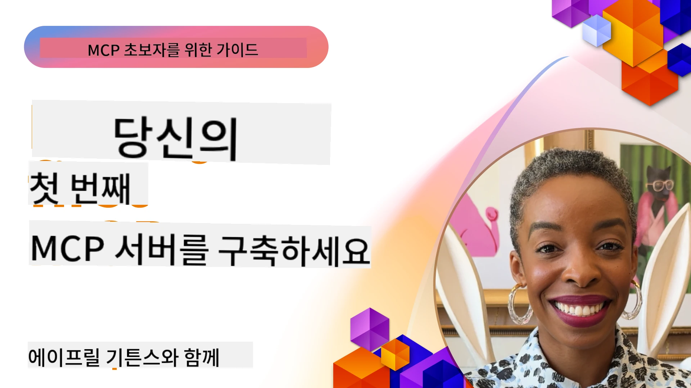

## 시작하기  

_(위 이미지를 클릭하면 이 강의의 영상을 볼 수 있습니다)_

이 섹션은 여러 강의로 구성되어 있습니다:

- **1 Your first server**, 첫 번째 강의에서는 첫 서버를 만드는 방법과 검사 도구를 사용해 서버를 확인하는 방법을 배웁니다. 검사 도구는 서버 테스트와 디버깅에 유용합니다, [강의로 가기](01-first-server/README.md)

- **2 Client**, 이 강의에서는 서버에 연결할 수 있는 클라이언트 작성법을 배웁니다, [강의로 가기](02-client/README.md)

- **3 Client with LLM**, 더 나은 방법으로서 클라이언트에 LLM을 추가해 서버와 "협상"하며 동작하도록 작성하는 방법을 배웁니다, [강의로 가기](03-llm-client/README.md)

- **4 Consuming a server GitHub Copilot Agent mode in Visual Studio Code**. 여기서는 Visual Studio Code 내에서 MCP 서버를 실행하는 방법을 살펴봅니다, [강의로 가기](04-vscode/README.md)

- **5 stdio Transport Server** stdio 전송은 로컬 MCP 서버-클라이언트 통신에 권장되는 표준으로, 프로세스 격리가 내장된 보안 서브프로세스 기반 통신을 제공합니다, [강의로 가기](05-stdio-server/README.md)

- **6 HTTP Streaming with MCP (Streamable HTTP)**. 현대적인 HTTP 스트리밍 전송 방식(원격 MCP 서버에 권장되는 방법, [MCP Specification 2025-11-25](https://spec.modelcontextprotocol.io/specification/2025-11-25/basic/transports/#streamable-http)참조), 진행 알림, Streamable HTTP를 사용해 확장 가능하고 실시간으로 동작하는 MCP 서버와 클라이언트 구현 방법을 배웁니다, [강의로 가기](06-http-streaming/README.md)

- **7 Utilising AI Toolkit for VSCode** MCP 클라이언트와 서버를 사용해 보고 테스트하는 방법, [강의로 가기](07-aitk/README.md)

- **8 Testing** 다양한 방법으로 서버와 클라이언트를 테스트하는 방법에 중점을 둡니다, [강의로 가기](08-testing/README.md)

- **9 Deployment** MCP 솔루션을 배포하는 여러 방식을 알아봅니다, [강의로 가기](09-deployment/README.md)

- **10 Advanced server usage** 고급 서버 사용법을 다룹니다, [강의로 가기](./10-advanced/README.md)

- **11 Auth** Basic Auth에서 JWT 및 RBAC 사용까지 간단한 인증 추가 방법을 배웁니다. 여기에서 시작한 후 고급 주제(5장)를 참고하고 2장 추천 사항을 통해 추가 보안 강화 작업을 수행하시기 바랍니다, [강의로 가기](./11-simple-auth/README.md)

- **12 MCP Hosts** Claude Desktop, Cursor, Cline, Windsurf 등 인기 있는 MCP 호스트 클라이언트를 설정하고 사용하는 방법, 전송 유형 및 문제 해결 방법 학습, [강의로 가기](./12-mcp-hosts/README.md)

- **13 MCP Inspector** MCP Inspector 도구를 사용해 MCP 서버를 인터랙티브하게 디버그하고 테스트하는 방법, 도구와 리소스, 프로토콜 메시지 문제 해결법 학습, [강의로 가기](./13-mcp-inspector/README.md)

- **14 Sampling** MCP 서버가 MCP 클라이언트와 협력해 LLM 관련 작업 수행하는 서버 만들기, [강의로 가기](./14-sampling/README.md)

- **15 MCP Apps** UI 지침도 함께 응답하는 MCP 서버 구축, [강의로 가기](./15-mcp-apps/README.md)

Model Context Protocol (MCP)은 애플리케이션이 LLM에 컨텍스트를 제공하는 방식을 표준화한 오픈 프로토콜입니다. MCP는 AI 애플리케이션을 위한 USB-C 포트와 같아서 다양한 데이터 소스와 도구를 AI 모델에 연결하는 표준화된 방식을 제공합니다.

## 학습 목표

이 강의가 끝나면 다음을 할 수 있습니다:

- C#, Java, Python, TypeScript, JavaScript를 위한 MCP 개발 환경 설정
- 맞춤 기능(리소스, 프롬프트, 도구)을 갖춘 기본 MCP 서버 구축 및 배포
- MCP 서버에 연결하는 호스트 애플리케이션 작성
- MCP 구현 테스트 및 디버깅
- 일반적인 설정 문제점과 해결 방법 이해
- MCP 구현을 인기 LLM 서비스에 연결하기

## MCP 환경 설정

MCP 작업을 시작하기 전 개발 환경을 준비하고 기본 워크플로우를 이해하는 것이 중요합니다. 이 섹션에서 원활하게 MCP를 시작할 수 있도록 초기 설정 단계를 안내합니다.

### 사전 준비 사항

MCP 개발에 들어가기 전에 다음을 준비하세요:

- **개발 환경**: 선택한 언어(C#, Java, Python, TypeScript, JavaScript)용
- **IDE/편집기**: Visual Studio, Visual Studio Code, IntelliJ, Eclipse, PyCharm 또는 최신 코드 편집기
- **패키지 관리자**: NuGet, Maven/Gradle, pip, npm/yarn
- **API 키**: 호스트 애플리케이션에서 사용할 AI 서비스용

### 공식 SDK

앞선 장들에서 Python, TypeScript, Java, .NET을 사용한 솔루션 예시를 볼 수 있습니다. 아래는 공식 지원하는 SDK 목록입니다.

MCP는 여러 언어용 공식 SDK를 제공합니다 ([MCP Specification 2025-11-25](https://spec.modelcontextprotocol.io/specification/2025-11-25/) 에 맞춤):
- [C# SDK](https://github.com/modelcontextprotocol/csharp-sdk) - Microsoft와 협력해 유지 관리
- [Java SDK](https://github.com/modelcontextprotocol/java-sdk) - Spring AI와 협력해 유지 관리
- [TypeScript SDK](https://github.com/modelcontextprotocol/typescript-sdk) - 공식 TypeScript 구현체
- [Python SDK](https://github.com/modelcontextprotocol/python-sdk) - 공식 Python 구현체 (FastMCP)
- [Kotlin SDK](https://github.com/modelcontextprotocol/kotlin-sdk) - 공식 Kotlin 구현체
- [Swift SDK](https://github.com/modelcontextprotocol/swift-sdk) - Loopwork AI와 협력해 유지 관리
- [Rust SDK](https://github.com/modelcontextprotocol/rust-sdk) - 공식 Rust 구현체
- [Go SDK](https://github.com/modelcontextprotocol/go-sdk) - 공식 Go 구현체

## 주요 내용 정리

- 언어별 SDK로 MCP 개발 환경 설정은 간단합니다
- MCP 서버 구축 시 명확한 스키마를 갖춘 도구를 생성하고 등록합니다
- MCP 클라이언트는 서버 및 모델에 연결해 확장 기능을 활용합니다
- 테스트와 디버깅은 신뢰할 수 있는 MCP 구현에 필수적입니다
- 배포 방법은 로컬 개발부터 클라우드 기반 솔루션까지 다양합니다

## 연습하기

이 섹션의 모든 장에서 볼 수 있는 연습 문제를 보완하는 샘플 세트를 제공합니다. 각 장마다 고유의 연습문제와 과제도 포함되어 있습니다.

- [Java Calculator](./samples/java/calculator/README.md)
- [.Net Calculator](../../../03-GettingStarted/samples/csharp)
- [JavaScript Calculator](./samples/javascript/README.md)
- [TypeScript Calculator](./samples/typescript/README.md)
- [Python Calculator](../../../03-GettingStarted/samples/python)

## 추가 자료

- [Build Agents using Model Context Protocol on Azure](https://learn.microsoft.com/azure/developer/ai/intro-agents-mcp)
- [Remote MCP with Azure Container Apps (Node.js/TypeScript/JavaScript)](https://learn.microsoft.com/samples/azure-samples/mcp-container-ts/mcp-container-ts/)
- [.NET OpenAI MCP Agent](https://learn.microsoft.com/samples/azure-samples/openai-mcp-agent-dotnet/openai-mcp-agent-dotnet/)

## 다음 단계

첫 번째 강의부터 시작하세요: [처음 MCP 서버 만들기](01-first-server/README.md)

이 모듈을 완료한 후에는 계속해서: [모듈 4: 실전 구현](../04-PracticalImplementation/README.md)

---

<!-- CO-OP TRANSLATOR DISCLAIMER START -->
**면책 조항**:  
이 문서는 AI 번역 서비스 [Co-op Translator](https://github.com/Azure/co-op-translator)를 사용하여 번역되었습니다. 정확성을 위해 최선을 다했지만, 자동 번역에는 오류나 부정확한 부분이 있을 수 있음을 유의하시기 바랍니다. 원문은 해당 언어의 원본 문서가 권위 있는 출처로 간주되어야 합니다. 중요한 정보의 경우 전문적인 인간 번역을 권장합니다. 본 번역의 사용으로 인해 발생하는 오해나 잘못된 해석에 대해 당사는 책임을 지지 않습니다.
<!-- CO-OP TRANSLATOR DISCLAIMER END -->