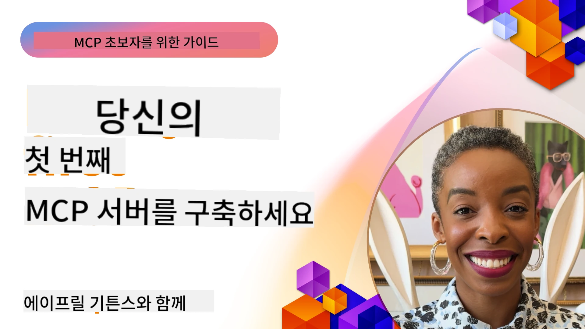

## 시작하기  

_(위 이미지를 클릭하면 이 수업의 동영상을 볼 수 있습니다)_

이 섹션은 여러 개의 수업으로 구성되어 있습니다:

- **1 당신의 첫 번째 서버**, 첫 번째 수업에서는 첫 번째 서버를 만드는 방법과 인스펙터 도구를 사용하여 서버를 검사하는 방법을 배웁니다. 이는 서버를 테스트하고 디버깅하는 데 유용합니다. [수업으로 이동](01-first-server/README.md)

- **2 클라이언트**, 이 수업에서는 서버에 연결할 수 있는 클라이언트를 작성하는 방법을 배웁니다. [수업으로 이동](02-client/README.md)

- **3 LLM이 포함된 클라이언트**, 클라이언트 작성의 더 좋은 방법은 LLM을 추가하여 서버와 "협상"하여 수행할 작업을 결정하는 것입니다. [수업으로 이동](03-llm-client/README.md)

- **4 Visual Studio Code에서 서버 GitHub Copilot 에이전트 모드 사용하기**. 여기서는 Visual Studio Code 내에서 MCP 서버를 실행하는 방법을 살펴봅니다. [수업으로 이동](04-vscode/README.md)

- **5 stdio 전송 서버** stdio 전송은 로컬 MCP 서버-클라이언트 통신에 권장되는 표준으로, 프로세스 격리를 내장한 안전한 서브프로세스 기반 통신을 제공합니다. [수업으로 이동](05-stdio-server/README.md)

- **6 MCP를 이용한 HTTP 스트리밍 (스트림 가능한 HTTP)**. 표준 원격 전송에 대해 배우기
	[MCP Specification 2026-07-28](https://modelcontextprotocol.io/specification/2026-07-28/basic/transports/streamable-http),
	그리고 수업에서 유지되는 이전 세션 기반 구현에 대해 배우기.
	[수업으로 이동](06-http-streaming/README.md)

- **7 AI Toolkit을 VSCode에서 활용** 하여 MCP 클라이언트 및 서버를 소비하고 테스트하기 [수업으로 이동](07-aitk/README.md)

- **8 테스트**. 여기서는 다양한 방법으로 서버와 클라이언트를 테스트하는 방법에 특히 집중합니다. [수업으로 이동](08-testing/README.md)

- **9 배포**. 이 챕터에서는 MCP 솔루션을 배포하는 다양한 방법을 다룹니다. [수업으로 이동](09-deployment/README.md)

- **10 고급 서버 사용법**. 이 챕터에서는 고급 서버 사용법을 다룹니다. [수업으로 이동](./10-advanced/README.md)

- **11 인증**. 이 챕터는 간단한 인증 추가 방법을 다루며, Basic Auth부터 JWT 및 RBAC 사용법까지 포함합니다. 여기서 시작한 후 5장의 고급 주제와 2장의 권고대로 추가 보안 강화도 수행하는 것을 권장합니다. [수업으로 이동](./11-simple-auth/README.md)

- **12 MCP 호스트**. Claude Desktop, Cursor, Cline, Windsurf 등 인기 MCP 호스트 클라이언트 구성 및 사용법을 배우고, 전송 유형과 문제 해결법을 익힙니다. [수업으로 이동](./12-mcp-hosts/README.md)

- **13 MCP 인스펙터**. MCP Inspector 도구를 사용해 MCP 서버를 인터랙티브하게 디버그 및 테스트합니다. 도구, 리소스 및 프로토콜 메시지 문제 해결 방법을 배웁니다. [수업으로 이동](./13-mcp-inspector/README.md)

- **14 샘플링**. `2025-11-25`의 이전 샘플링 원시 기능에 대해 배우고,
	새로운 설계를 직결된 LLM 제공자 통합으로 어떻게 전환하는지 다룹니다. 샘플링은
	MCP `2026-07-28`에서 더 이상 사용되지 않습니다. [수업으로 이동](./14-sampling/README.md)

- **15 MCP 앱**. UI 지침으로도 응답하는 MCP 서버를 구축합니다. [수업으로 이동](./15-mcp-apps/README.md)

모델 컨텍스트 프로토콜(MCP)은 애플리케이션이 LLM에 컨텍스트를 제공하는 방식을 표준화한 개방형 프로토콜입니다. MCP를 AI 애플리케이션을 위한 USB-C 포트로 생각해보세요 - 다양한 데이터 소스와 도구에 AI 모델을 연결하는 표준화된 방법을 제공합니다.

## 학습 목표

이 수업이 끝나면 다음을 할 수 있습니다:

- C#, Java, Python, TypeScript 및 JavaScript용 MCP 개발 환경 설정
- 맞춤 기능(리소스, 프롬프트, 도구)을 갖춘 기본 MCP 서버 빌드 및 배포
- MCP 서버에 연결하는 호스트 애플리케이션 생성
- MCP 구현 테스트 및 디버그
- 일반적인 설정 문제와 해결책 이해
- 인기있는 LLM 서비스에 MCP 구현 연결

## MCP 환경 설정

MCP를 사용하기 전에 개발 환경을 준비하고 기본 작업 흐름을 이해하는 것이 중요합니다. 이 섹션에서는 원활한 MCP 시작을 위한 초기 설정 단계를 안내합니다.

### 전제 조건

MCP 개발에 뛰어들기 전에 다음을 갖추었는지 확인하세요:

- **개발 환경**: 선택한 언어(C#, Java, Python, TypeScript 또는 JavaScript)
- **IDE/에디터**: Visual Studio, Visual Studio Code, IntelliJ, Eclipse, PyCharm 또는 최신 코드 편집기
- **패키지 관리자**: NuGet, Maven/Gradle, pip, 또는 npm/yarn
- **API 키**: 호스트 애플리케이션에서 사용할 AI 서비스 키

### 공식 SDK

다음 장에서는 Python, TypeScript,
Java 및 .NET을 사용해 구축한 솔루션을 볼 수 있습니다. 여기에 공식 SDK가 있습니다.

MCP `2026-07-28`용 SDK 지원은 언어별로 독립적으로 제공되고 있습니다.
예제를 실행하기 전에 패키지 버전과 SDK 릴리스 노트를 확인하여
지원하는 프로토콜 개정을 확인하세요. 자세한 내용은
[공식 SDK 목록](https://modelcontextprotocol.io/docs/sdk)을 참조하세요:
- [C# SDK](https://github.com/modelcontextprotocol/csharp-sdk) - Microsoft와 협력하여 유지 관리
- [Java SDK](https://github.com/modelcontextprotocol/java-sdk) - Spring AI와 협력하여 유지 관리
- [TypeScript SDK](https://github.com/modelcontextprotocol/typescript-sdk) - 공식 TypeScript 구현
- [Python SDK](https://github.com/modelcontextprotocol/python-sdk) - 공식 Python 구현 (FastMCP)
- [Kotlin SDK](https://github.com/modelcontextprotocol/kotlin-sdk) - 공식 Kotlin 구현
- [Swift SDK](https://github.com/modelcontextprotocol/swift-sdk) - Loopwork AI와 협력하여 유지 관리
- [Rust SDK](https://github.com/modelcontextprotocol/rust-sdk) - 공식 Rust 구현
- [Go SDK](https://github.com/modelcontextprotocol/go-sdk) - 공식 Go 구현

## 주요 내용 정리

- 언어별 SDK를 통해 MCP 개발 환경 설정은 간단합니다
- MCP 서버 구축은 명확한 스키마와 함께 도구를 생성하고 등록하는 것을 포함합니다
- MCP 클라이언트는 서버 및 모델에 연결하여 확장된 기능을 활용합니다
- 안정적인 MCP 구현을 위해 테스트와 디버깅은 필수입니다
- 배포 옵션은 로컬 개발부터 클라우드 기반 솔루션에 이르기까지 다양합니다

## 실습하기

이 섹션의 모든 장에서 볼 수 있는 연습 문제를 보완하는 샘플 세트가 있습니다. 또한 각 장마다 고유한 연습 문제와 과제가 있습니다

- [Java Calculator](./samples/java/calculator/README.md)
- [.NET Calculator](../../../03-GettingStarted/samples/csharp)
- [JavaScript Calculator](./samples/javascript/README.md)
- [TypeScript Calculator](./samples/typescript/README.md)
- [Python Calculator](../../../03-GettingStarted/samples/python)

## 추가 자료

- [Azure에서 Model Context Protocol을 사용하여 에이전트 구축하기](https://learn.microsoft.com/azure/developer/ai/intro-agents-mcp)
- [Azure Container Apps와 함께하는 원격 MCP (Node.js/TypeScript/JavaScript)](https://learn.microsoft.com/samples/azure-samples/mcp-container-ts/mcp-container-ts/)
- [.NET OpenAI MCP 에이전트](https://learn.microsoft.com/samples/azure-samples/openai-mcp-agent-dotnet/openai-mcp-agent-dotnet/)

## 다음 단계

첫 번째 수업부터 시작하세요: [처음 MCP 서버 만들기](01-first-server/README.md)

이 모듈을 완료하면 계속 진행하세요: [모듈 4: 실습 구현](../04-PracticalImplementation/README.md)

---

<!-- CO-OP TRANSLATOR DISCLAIMER START -->
**면책 조항**:
이 문서는 AI 번역 서비스 [Co-op Translator](https://github.com/Azure/co-op-translator)를 사용하여 번역되었습니다. 정확성을 기하기 위해 노력하고 있으나, 자동 번역은 오류나 부정확한 부분이 있을 수 있음을 유의하시기 바랍니다. 원본 문서의 원어본이 권위 있는 자료로 간주되어야 합니다. 중요한 정보의 경우, 전문가의 인간 번역을 권장합니다. 이 번역 사용으로 인해 발생하는 오해나 잘못된 해석에 대해 당사는 책임을 지지 않습니다.
<!-- CO-OP TRANSLATOR DISCLAIMER END -->