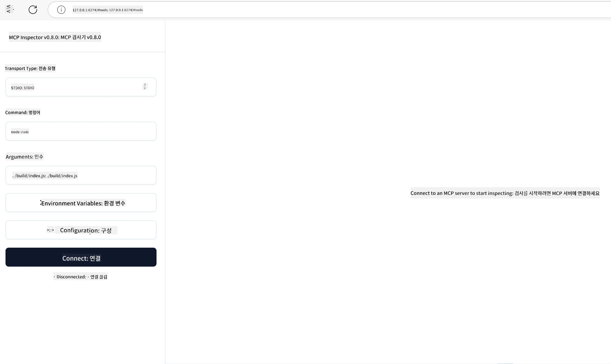

# 실전 구현

[](https://youtu.be/vCN9-mKBDfQ)

_(위 이미지를 클릭하면 이 강의의 비디오를 볼 수 있습니다)_

실전 구현은 Model Context Protocol(MCP)의 힘이 실체화되는 부분입니다. MCP의 이론과 아키텍처를 이해하는 것 또한 중요하지만, 진짜 가치는 이러한 개념을 실제로 적용하여 현실 세계 문제를 해결하는 솔루션을 구축, 테스트 및 배포할 때 나타납니다. 이 장은 개념적 지식과 실무 개발 간의 간격을 메우며 MCP 기반 애플리케이션을 실제로 구현하는 과정을 안내합니다.

지능형 어시스턴트를 개발하든, 비즈니스 워크플로우에 AI를 통합하든, 데이터 처리용 맞춤형 도구를 구축하든 MCP는 유연한 기반을 제공합니다. 언어에 구애받지 않는 설계와 인기 프로그래밍 언어용 공식 SDK로 다양한 개발자가 접근 가능합니다. 이 SDK를 활용하면 여러 플랫폼과 환경에서 솔루션을 신속히 프로토타입하고 반복하며 확장할 수 있습니다.

다음 섹션에서는 C#, Java with Spring, TypeScript, JavaScript, Python에서 MCP를 구현하는 방법을 보여주는 실전 예제, 샘플 코드, 배포 전략을 다룹니다. MCP 서버를 디버그하고 테스트하는 방법, API를 관리하는 방법, Azure를 사용해 클라우드에 솔루션을 배포하는 방법도 배울 수 있습니다. 이러한 실습 자료는 학습 속도를 높이고 견고하며 프로덕션 준비된 MCP 애플리케이션을 자신 있게 구축할 수 있도록 설계되었습니다.

## 개요

이 강의는 여러 프로그래밍 언어에서 MCP 구현의 실무적인 측면에 중점을 둡니다. C#, Java with Spring, TypeScript, JavaScript, Python에서 MCP SDK를 활용해 견고한 애플리케이션을 구축하고 MCP 서버를 디버그 및 테스트하며 재사용 가능한 리소스, 프롬프트, 도구를 만드는 방법을 탐구합니다.

## 학습 목표

이 강의가 끝나면 다음을 수행할 수 있습니다:

- 다양한 프로그래밍 언어에서 공식 SDK를 사용해 MCP 솔루션 구현
- 체계적으로 MCP 서버 디버그 및 테스트
- 서버 기능(리소스, 프롬프트, 도구) 생성 및 사용
- 복잡한 작업을 위한 효과적인 MCP 워크플로 설계
- 성능과 신뢰성을 위한 MCP 구현 최적화

## 공식 SDK 자료

Model Context Protocol은 여러 언어용 공식 SDK를 제공합니다([MCP Specification 2025-11-25](https://spec.modelcontextprotocol.io/specification/2025-11-25/)에 맞춤):

- [C# SDK](https://github.com/modelcontextprotocol/csharp-sdk)
- [Java with Spring SDK](https://github.com/modelcontextprotocol/java-sdk) **참고:** [Project Reactor](https://projectreactor.io) 의존성 필요. ([논의 이슈 246](https://github.com/orgs/modelcontextprotocol/discussions/246) 참고)
- [TypeScript SDK](https://github.com/modelcontextprotocol/typescript-sdk)
- [Python SDK](https://github.com/modelcontextprotocol/python-sdk)
- [Kotlin SDK](https://github.com/modelcontextprotocol/kotlin-sdk)
- [Go SDK](https://github.com/modelcontextprotocol/go-sdk)

## MCP SDK 사용하기

이 섹션에서는 여러 프로그래밍 언어에서 MCP를 구현하는 실전 예제를 제공합니다. `samples` 디렉토리에 언어별로 정리된 샘플 코드를 찾을 수 있습니다.

### 사용 가능한 샘플

리포지토리에는 다음 언어로 된 [샘플 구현](../../../04-PracticalImplementation/samples)이 포함되어 있습니다:

- [C#](./samples/csharp/README.md)
- [Java with Spring](./samples/java/containerapp/README.md)
- [TypeScript](./samples/typescript/README.md)
- [JavaScript](./samples/javascript/README.md)
- [Python](./samples/python/README.md)

각 샘플은 해당 언어 및 생태계에 맞는 주요 MCP 개념과 구현 패턴을 보여줍니다.

### 실전 가이드

추가로 실전 MCP 구현을 위한 가이드:

- [페이징 및 대용량 결과 처리](./pagination/README.md) - 도구, 리소스, 대용량 데이터셋을 위한 커서 기반 페이징 처리

## 핵심 서버 기능

MCP 서버는 다음 기능들을 조합하여 구현할 수 있습니다:

### 리소스

리소스는 사용자 또는 AI 모델이 사용할 컨텍스트와 데이터를 제공합니다:

- 문서 저장소
- 지식 기반
- 구조화된 데이터 소스
- 파일 시스템

### 프롬프트

프롬프트는 사용자용 템플릿화된 메시지와 워크플로입니다:

- 사전 정의된 대화 템플릿
- 안내형 상호작용 패턴
- 특수화된 대화 구조

### 도구

도구는 AI 모델이 실행할 함수입니다:

- 데이터 처리 유틸리티
- 외부 API 통합
- 계산 기능
- 검색 기능

## 샘플 구현: C# 구현

공식 C# SDK 리포지토리에는 MCP의 다양한 측면을 보여주는 여러 샘플 구현이 포함되어 있습니다:

- **기본 MCP 클라이언트**: MCP 클라이언트를 생성하고 도구를 호출하는 간단한 예제
- **기본 MCP 서버**: 기본 도구 등록을 포함한 최소 서버 구현
- **고급 MCP 서버**: 도구 등록, 인증, 오류 처리 등 완전 기능 서버
- **ASP.NET 통합**: ASP.NET Core와 통합하는 예제들
- **도구 구현 패턴**: 다양한 복잡도의 도구 구현 패턴들

MCP C# SDK는 프리뷰 상태로 API가 변경될 수 있습니다. SDK 변화에 따라 계속해서 블로그를 업데이트할 예정입니다.

### 주요 기능

- [C# MCP Nuget ModelContextProtocol](https://www.nuget.org/packages/ModelContextProtocol)
- [첫 MCP 서버 만들기](https://devblogs.microsoft.com/dotnet/build-a-model-context-protocol-mcp-server-in-csharp/)

완전한 C# 구현 샘플은 [공식 C# SDK 샘플 리포지토리](https://github.com/modelcontextprotocol/csharp-sdk)에서 확인하세요.

## 샘플 구현: Java with Spring 구현

Java with Spring SDK는 기업급 기능을 갖춘 견고한 MCP 구현 옵션을 제공합니다.

### 주요 기능

- Spring 프레임워크 통합
- 강력한 타입 안정성
- 리액티브 프로그래밍 지원
- 포괄적인 오류 처리

완전한 Java with Spring 구현 샘플은 샘플 디렉토리의 [Java with Spring 샘플](samples/java/containerapp/README.md)을 참조하세요.

## 샘플 구현: JavaScript 구현

JavaScript SDK는 경량이며 유연한 MCP 구현 방식을 제공합니다.

### 주요 기능

- Node.js 및 브라우저 지원
- Promise 기반 API
- Express 및 다른 프레임워크와 쉬운 통합
- 스트리밍을 위한 WebSocket 지원

완전한 JavaScript 구현 샘플은 샘플 디렉토리의 [JavaScript 샘플](samples/javascript/README.md)을 참조하세요.

## 샘플 구현: Python 구현

Python SDK는 우수한 머신러닝 프레임워크 통합을 가진 파이썬틱한 MCP 구현 방식을 제공합니다.

### 주요 기능

- asyncio 기반의 async/await 지원
- FastAPI 통합
- 간단한 도구 등록
- 인기 ML 라이브러리와 네이티브 통합

완전한 Python 구현 샘플은 샘플 디렉토리의 [Python 샘플](samples/python/README.md)을 참조하세요.

## API 관리

Azure API Management는 MCP 서버를 보호하는 훌륭한 방법입니다. MCP 서버 앞에 Azure API Management 인스턴스를 두고, 다음과 같은 기능 처리를 맡기는 방식입니다:

- 속도 제한(rate limiting)
- 토큰 관리
- 모니터링
- 로드 밸런싱
- 보안

### Azure 샘플

아래는 MCP 서버 생성 및 Azure API Management로 보안하는 [Azure 샘플](https://github.com/Azure-Samples/remote-mcp-apim-functions-python)입니다.

아래 이미지에서 인증 흐름이 어떻게 이루어지는지 확인할 수 있습니다:


위 이미지에서는 다음이 실행됩니다:

- Microsoft Entra를 사용한 인증/인가 진행
- Azure API Management가 게이트웨이 역할을 하며 정책으로 트래픽을 관리 및 라우팅함
- Azure Monitor가 모든 요청을 로그로 기록하여 분석 대비

#### 권한 부여 흐름

권한 부여 흐름의 상세한 내용을 살펴봅시다:


#### MCP 권한 부여 명세

[MCP 권한 부여 명세](https://spec.modelcontextprotocol.io/specification/2025-11-25/basic/authorization/)에 대해 더 알아보세요.

## 원격 MCP 서버 Azure 배포

앞서 언급한 샘플을 배포해 봅시다:

1. 리포지토리 클론

    ```bash
    git clone https://github.com/Azure-Samples/remote-mcp-apim-functions-python.git
    cd remote-mcp-apim-functions-python
    ```

1. `Microsoft.App` 리소스 공급자 등록

   - Azure CLI를 사용 중이라면 `az provider register --namespace Microsoft.App --wait` 실행
   - Azure PowerShell 사용 시 `Register-AzResourceProvider -ProviderNamespace Microsoft.App` 실행 후 `(Get-AzResourceProvider -ProviderNamespace Microsoft.App).RegistrationState`로 등록 완료 여부 확인

1. 이 [azd](https://aka.ms/azd) 명령을 실행해 API Management 서비스, 함수 앱(코드 포함), 기타 필요한 Azure 리소스 프로비저닝

    ```shell
    azd up
    ```

    이 명령은 Azure에 모든 클라우드 리소스를 배포합니다.

### MCP Inspector로 서버 테스트

1. **새 터미널 창**에서 MCP Inspector를 설치 및 실행

    ```shell
    npx @modelcontextprotocol/inspector
    ```

    이와 유사한 인터페이스가 표시됩니다:

    

1. 앱이 표시한 URL(예: [http://127.0.0.1:6274/#resources](http://127.0.0.1:6274/#resources))에서 MCP Inspector 웹 앱을 CTRL 클릭으로 엽니다.
1. 전송 유형을 `SSE`로 설정
1. 실행 중인 API Management SSE 엔드포인트 URL을 `azd up` 실행 후 표시된 주소로 설정하고 **연결**:

    ```shell
    https://<apim-servicename-from-azd-output>.azure-api.net/mcp/sse
    ```

1. **도구 목록** 보기. 도구를 클릭하고 **도구 실행**.

모든 단계가 올바르게 수행되었다면 MCP 서버에 연결할 수 있으며 도구 호출도 성공했을 것입니다.

## Azure용 MCP 서버

[Remote-mcp-functions](https://github.com/Azure-Samples/remote-mcp-functions-dotnet): 이 리포지토리 세트는 Python, C# .NET, Node/TypeScript로 Azure Functions에서 커스텀 원격 MCP(모델 컨텍스트 프로토콜) 서버를 빠르게 구축 및 배포하는 템플릿입니다.

이 샘플은 개발자가 다음을 할 수 있도록 완전한 솔루션을 제공합니다:

- 로컬에서 빌드 및 실행: 로컬 머신에서 MCP 서버 개발과 디버그
- Azure 배포: 간단한 azd up 명령으로 클라우드에 쉽게 배포
- 클라이언트 연결: VS Code Copilot 에이전트 모드 및 MCP Inspector 등 다양한 클라이언트에서 MCP 서버 연결

### 주요 기능

- 설계 단계부터 보안 내장: 키와 HTTPS로 MCP 서버를 보안
- 인증 옵션: 내장 인증 및/또는 API Management를 통한 OAuth 지원
- 네트워크 격리: Azure Virtual Networks(VNET)를 이용한 네트워크 격리 지원
- 서버리스 아키텍처: Azure Functions 활용으로 확장 가능하고 이벤트 기반 실행
- 로컬 개발 지원: 포괄적인 로컬 개발 및 디버깅 지원
- 간단한 배포: Azure에 대한 간소화된 배포 프로세스

리포지토리에는 프로덕션 준비가 된 MCP 서버 구현을 빠르게 시작할 수 있도록 필요한 설정 파일, 소스 코드, 인프라 정의가 모두 포함되어 있습니다.

- [Azure Remote MCP Functions Python](https://github.com/Azure-Samples/remote-mcp-functions-python) - Azure Functions와 Python을 사용한 MCP 샘플 구현
- [Azure Remote MCP Functions .NET](https://github.com/Azure-Samples/remote-mcp-functions-dotnet) - Azure Functions와 C# .NET을 사용한 MCP 샘플 구현
- [Azure Remote MCP Functions Node/Typescript](https://github.com/Azure-Samples/remote-mcp-functions-typescript) - Azure Functions와 Node/TypeScript를 사용한 MCP 샘플 구현

## 핵심 요점

- MCP SDK는 견고한 MCP 솔루션 구현을 위한 언어별 도구를 제공
- 디버깅과 테스트는 신뢰할 수 있는 MCP 애플리케이션에 필수적
- 재사용 가능한 프롬프트 템플릿이 일관된 AI 상호작용 지원
- 잘 설계된 워크플로가 여러 도구를 사용해 복잡한 작업을 오케스트레이션
- MCP 솔루션 구현 시 보안, 성능, 오류 처리를 고려해야 함

## 연습 과제

본인의 영역에서 실제 문제를 해결하는 실용적인 MCP 워크플로를 설계하세요:

1. 이 문제 해결에 유용할 3~4개의 도구를 식별
2. 이 도구들이 어떻게 상호작용하는지 보여주는 워크플로 다이어그램 작성
3. 선호하는 언어로 도구 중 하나의 기본 버전 구현
4. 모델이 도구를 효과적으로 활용하도록 도움을 줄 프롬프트 템플릿 생성

## 추가 자료

---

## 다음 강의

다음: [고급 주제](../05-AdvancedTopics/README.md)

---

<!-- CO-OP TRANSLATOR DISCLAIMER START -->
**면책 조항**:  
이 문서는 AI 번역 서비스 [Co-op Translator](https://github.com/Azure/co-op-translator)를 사용하여 번역되었습니다. 정확성을 위해 최선을 다하고 있으나, 자동 번역에서는 오류나 부정확한 부분이 있을 수 있음을 유의해 주시기 바랍니다. 원문은 해당 언어로 작성된 원본 문서를 권위 있는 출처로 간주해야 합니다. 중요한 정보에 대해서는 전문적인 인간 번역을 권장합니다. 이 번역 사용으로 인해 발생하는 오해나 잘못된 해석에 대해 당사는 책임을 지지 않습니다.
<!-- CO-OP TRANSLATOR DISCLAIMER END -->