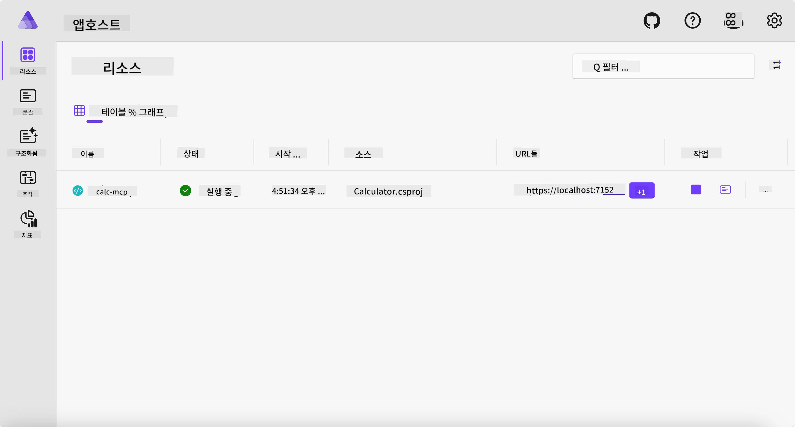
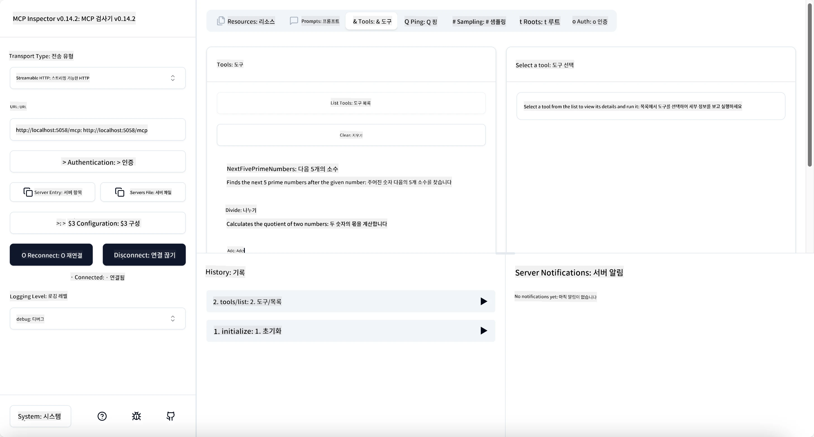
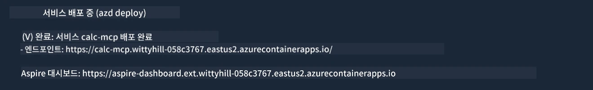

# 샘플

이전 예제에서는 `stdio` 타입을 사용하여 로컬 .NET 프로젝트를 사용하는 방법과 컨테이너에서 서버를 로컬로 실행하는 방법을 보여줍니다. 이는 많은 상황에서 좋은 해결책입니다. 하지만 서버를 클라우드 환경과 같이 원격으로 실행하는 것이 유용할 수 있습니다. 이때 `http` 타입이 사용됩니다.

`04-PracticalImplementation` 폴더 내 솔루션을 보면 이전 예제보다 훨씬 복잡해 보일 수 있습니다. 하지만 실제로는 그렇지 않습니다. 프로젝트 `src/Calculator`를 자세히 보면 이전 예제와 거의 동일한 코드임을 알 수 있습니다. 유일한 차이점은 HTTP 요청을 처리하기 위해 다른 라이브러리 `ModelContextProtocol.AspNetCore`를 사용한다는 점과, `IsPrime` 메서드를 비공개로 변경하여 코드 내에 비공개 메서드를 가질 수 있음을 보여준다는 점입니다. 나머지 코드는 이전과 동일합니다.

다른 프로젝트들은 [Aspire](https://aspire.dev/get-started/what-is-aspire/)에서 가져온 것입니다. 솔루션에 Aspire가 포함되면 개발 및 테스트 중 개발자의 경험이 향상되고 관측 가능성도 개선됩니다. 서버 실행에 필수는 아니지만 솔루션에 포함하는 것이 좋은 관행입니다.

## 서버를 로컬에서 시작하기

1. VS Code (C# DevKit 확장 기능 포함)에서 `04-PracticalImplementation/samples/csharp` 디렉토리로 이동합니다.
1. 서버를 시작하려면 다음 명령을 실행합니다:

   ```bash
    dotnet watch run --project ./src/AppHost
   ```

1. 웹 브라우저가 Aspire 대시보드를 열면, `http` URL이 표시됩니다. 예를 들어 `http://localhost:5058/`과 같아야 합니다.

   

## MCP Inspector로 스트리밍 HTTP 테스트하기

Node.js 22.7.5 이상이 설치되어 있다면 MCP Inspector를 사용하여 서버를 테스트할 수 있습니다.

서버를 시작한 후 터미널에서 다음 명령을 실행하세요:

```bash
npx @modelcontextprotocol/inspector http://localhost:5058
```



- 전송 유형으로 `Streamable HTTP`를 선택합니다.
- URL 필드에 앞서 확인한 서버 URL을 입력하고, 끝에 `/mcp`를 붙입니다. 예를 들어 `http://localhost:5058/mcp`와 같이 `http`여야 합니다 (`https` 아님).
- Connect 버튼을 선택하세요.

Inspector의 좋은 점은 발생하는 일을 잘 시각화해준다는 것입니다.

- 사용 가능한 도구 목록을 시도해보세요.
- 도구 중 몇 가지를 테스트해보세요. 이전과 같이 작동해야 합니다.

## VS Code에서 GitHub Copilot Chat으로 MCP 서버 테스트하기

Streamable HTTP 전송을 GitHub Copilot Chat과 함께 사용하려면, 이전에 생성한 `calc-mcp` 서버 구성을 다음과 같이 변경하세요:

```jsonc
// .vscode/mcp.json
{
  "servers": {
    "calc-mcp": {
      "type": "http",
      "url": "http://localhost:5058/mcp"
    }
  }
}
```

테스트를 해보세요:

- "6780 이후 3개의 소수"를 요청해보세요. Copilot이 새 도구 `NextFivePrimeNumbers`를 사용하여 처음 3개의 소수만 반환하는 것을 확인할 수 있습니다.
- "111 이후 7개의 소수"를 요청하여 결과를 확인해보세요.
- "John에게 사탕 24개가 있고, 3명의 아이에게 모두 나누어주려 합니다. 각 아이가 몇 개의 사탕을 받나요?"를 요청하여 결과를 확인하세요.

## 서버를 Azure에 배포하기

더 많은 사람이 서버를 사용할 수 있도록 서버를 Azure에 배포해봅시다.

터미널에서 `04-PracticalImplementation/samples/csharp` 폴더로 이동한 다음 다음 명령을 실행하세요:

```bash
azd up
```

배포가 완료되면 다음과 같은 메시지를 볼 수 있습니다:



URL을 복사하여 MCP Inspector와 GitHub Copilot Chat에서 사용하세요.

```jsonc
// .vscode/mcp.json
{
  "servers": {
    "calc-mcp": {
      "type": "http",
      "url": "https://calc-mcp.gentleriver-3977fbcf.australiaeast.azurecontainerapps.io/mcp"
    }
  }
}
```

## 다음 단계는?

우리는 다양한 전송 유형과 테스트 도구를 시도해봤고 MCP 서버를 Azure에 배포했습니다. 하지만 만약 서버가 데이터베이스나 비공개 API와 같은 사설 리소스에 접근해야 한다면 어떨까요? 다음 장에서 서버의 보안을 어떻게 향상시킬 수 있는지 살펴보겠습니다.

---

<!-- CO-OP TRANSLATOR DISCLAIMER START -->
**면책 조항**:
이 문서는 AI 번역 서비스 [Co-op Translator](https://github.com/Azure/co-op-translator)를 사용하여 번역되었습니다. 정확성을 기하기 위해 노력하고 있으나, 자동 번역은 오류나 부정확한 부분이 있을 수 있음을 유의하시기 바랍니다. 원본 문서의 원어본이 권위 있는 자료로 간주되어야 합니다. 중요한 정보의 경우, 전문가의 인간 번역을 권장합니다. 이 번역 사용으로 인해 발생하는 오해나 잘못된 해석에 대해 당사는 책임을 지지 않습니다.
<!-- CO-OP TRANSLATOR DISCLAIMER END -->