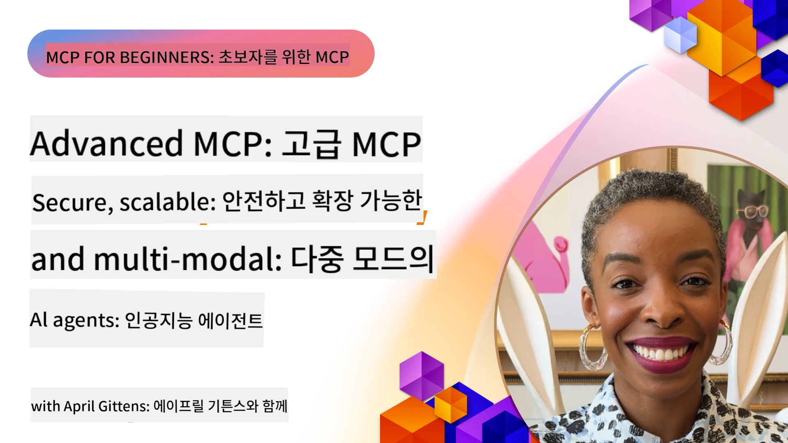

# MCP 고급 주제

_(위 이미지를 클릭하여 이 수업의 비디오를 시청하세요)_

이 챕터에서는 다중 모달 통합, 확장성, 보안 모범 사례, 엔터프라이즈 통합 등 Model Context Protocol (MCP) 구현의 일련의 고급 주제를 다룹니다. 이 주제들은 현대 AI 시스템의 요구를 충족할 수 있는 견고하고 프로덕션 준비된 MCP 애플리케이션을 구축하는 데 중요합니다.

## 개요

이 수업에서는 다중 모달 통합, 확장성, 보안 모범 사례, 엔터프라이즈 통합에 중점을 두어 Model Context Protocol 구현의 고급 개념을 탐구합니다. 이러한 주제들은 엔터프라이즈 환경에서 복잡한 요구 사항을 처리할 수 있는 프로덕션급 MCP 애플리케이션을 구축하는 데 필수적입니다.

> **현재 명세 노트:** MCP `2026-07-28`은 5.4 및 5.6 수업에서 다룬 Roots 및
> Sampling 기본형을 더 이상 사용하지 않습니다. 또한 프로토콜 기능(5.16)에서 참조된
> 실험적 Tasks 기능을 전용 Tasks 확장으로 이전했습니다. 해당 수업들은
> 레거시 `2025-11-25` 구현을 위해 보존되며 마이그레이션 가이드를 포함합니다.
> 자세한 내용은 [MCP 변경 사항: 2026-07-28 명세](../01-CoreConcepts/mcp-2026-07-28.md)를 참조하세요.

## 학습 목표

이 수업이 끝나면 다음을 할 수 있습니다:

- MCP 프레임워크 내에서 다중 모달 기능 구현
- 높은 수요 시나리오에 대응하는 확장 가능한 MCP 아키텍처 설계
- MCP 보안 원칙에 맞는 보안 모범 사례 적용
- MCP를 엔터프라이즈 AI 시스템 및 프레임워크와 통합
- 프로덕션 환경에서 성능 및 신뢰성 최적화

## 수업 및 샘플 프로젝트

| 링크 | 제목 | 설명 |
|------|-------|-------------|
| [5.1 Azure 통합](./mcp-integration/README.md) | Azure와 통합 | Azure에서 MCP 서버를 통합하는 방법 배우기 |
| [5.2 다중 모달 샘플](./mcp-multi-modality/README.md) | MCP 다중 모달 샘플  | 오디오, 이미지, 다중 모달 응답 샘플 |
| [5.3 MCP OAuth2 샘플](../../../05-AdvancedTopics/mcp-oauth2-demo) | MCP OAuth2 데모 | MCP와 함께 OAuth2를 보여주는 최소 Spring Boot 앱으로, 인증 및 리소스 서버로 동작합니다. 안전한 토큰 발급, 보호된 엔드포인트, Azure 컨테이너 앱 배포, API 관리 통합 데모 포함. |
| [5.4 루트 컨텍스트](./mcp-root-contexts/README.md) | 루트 컨텍스트  | 레거시 `2025-11-25` Roots 기본형 및 현재 마이그레이션 옵션 학습(`2026-07-28`에서 폐기됨) |
| [5.5 라우팅](./mcp-routing/README.md) | 라우팅 | 다양한 라우팅 유형 배우기 |
| [5.6 샘플링](./mcp-sampling/README.md) | 샘플링 | 레거시 `2025-11-25` 샘플링 기본형 및 현재 마이그레이션 옵션 학습(`2026-07-28`에서 폐기됨) |
| [5.7 스케일링](./mcp-scaling/README.md) | 스케일링  | 스케일링 배우기 |
| [5.8 보안](./mcp-security/README.md) | 보안  | MCP 서버 보안 강화 |
| [5.9 웹 검색 샘플](./web-search-mcp/README.md) | 웹 검색 MCP | SerpAPI와 통합된 Python MCP 서버 및 클라이언트로 실시간 웹, 뉴스, 제품 검색과 Q&A 제공. 다중 도구 오케스트레이션, 외부 API 통합 및 견고한 오류 처리 시연. |
| [5.10 실시간 스트리밍](./mcp-realtimestreaming/README.md) | 스트리밍  | 오늘날 데이터 중심 세계에서 비즈니스와 애플리케이션이 신속한 의사결정을 위해 즉각적인 정보 액세스를 요구함에 따라 실시간 데이터 스트리밍이 필수적이 되었습니다.|
| [5.11 실시간 웹 검색](./mcp-realtimesearch/README.md) | 웹 검색 | MCP가 AI 모델, 검색 엔진, 애플리케이션 전반에 걸쳐 컨텍스트 관리를 표준화하여 실시간 웹 검색을 혁신하는 방법.|
| [5.12 Model Context Protocol 서버를 위한 Entra ID 인증](./mcp-security-entra/README.md) | Entra ID 인증 | Microsoft Entra ID는 강력한 클라우드 기반 ID 및 액세스 관리 솔루션을 제공하여 MCP 서버와 상호작용하는 권한 있는 사용자와 애플리케이션만 접근할 수 있도록 도와줍니다.|
| [5.13 Microsoft Foundry 에이전트 통합](./mcp-foundry-agent-integration/README.md) | Microsoft Foundry 통합 | Model Context Protocol 서버를 Microsoft Foundry 에이전트와 통합하는 방법으로, 강력한 도구 오케스트레이션과 표준화된 외부 데이터 소스 연결을 통한 엔터프라이즈 AI 기능을 가능하게 합니다.|
| [5.14 컨텍스트 엔지니어링](./mcp-contextengineering/README.md) | 컨텍스트 엔지니어링 | MCP 서버를 위한 미래의 컨텍스트 엔지니어링 기법 기회로, 컨텍스트 최적화, 동적 컨텍스트 관리, MCP 프레임워크 내에서 효과적인 프롬프트 엔지니어링 전략을 포함합니다.|
| [5.15 MCP 맞춤 전송](./mcp-transport/README.md) | 맞춤 전송 | 특수 MCP 통신 시나리오를 위한 맞춤 전송 메커니즘 구현 방법 배우기.|
| [5.16 프로토콜 기능 심층 분석](./mcp-protocol-features/README.md) | 프로토콜 기능 | 진행 알림, 요청 취소, 리소스 템플릿, 오류 처리 패턴 등 고급 프로토콜 기능 마스터하기.|
| [5.17 적대적 다중 에이전트 추론](./mcp-adversarial-agents/README.md) | 적대적 에이전트 | 상반된 입장을 가진 두 에이전트가 단일 MCP 도구 세트를 공유하며 환각 감지, 극단 사례 표출 및 구조화된 토론을 통해 더 잘 보정된 출력을 생성하는 방법.|

> **역사적 `2025-11-25` 노트:** 해당 개정판에서는 실험적인
> Tasks 기능 및 여러 프로토콜 기능이 확장되었습니다. `2026-07-28`에서는 Tasks가
> 공식 확장으로 이동하고 Roots는 폐기되었습니다. `2025-11-25`
> 기능 상태를 현재 지침으로 사용하지 마십시오; [2026-07-28 변경 로그](https://modelcontextprotocol.io/specification/2026-07-28/changelog)를 참조하세요.

## 추가 참고 자료

최신 MCP 고급 주제 정보를 얻으려면 다음을 참조하세요:
- [MCP 문서](https://modelcontextprotocol.io/)
- [MCP 명세 (2026-07-28)](https://modelcontextprotocol.io/specification/2026-07-28/)
- [GitHub 저장소](https://github.com/modelcontextprotocol)
- [OWASP MCP Top 10](https://microsoft.github.io/mcp-azure-security-guide/mcp/) - 보안 위험 및 완화책
- [MCP 보안 서밋 워크숍 (Sherpa)](https://azure-samples.github.io/sherpa/) - 실습 보안 교육

## 주요 요점

- 다중 모달 MCP 구현은 텍스트 처리 이상의 AI 능력을 확장합니다
- 확장성은 엔터프라이즈 배포에 필수적이며 수평 및 수직 확장을 통해 해결할 수 있습니다
- 포괄적인 보안 조치는 데이터를 보호하고 적절한 접근 제어를 보장합니다
- Azure OpenAI 및 Microsoft AI Foundry와 같은 플랫폼과의 엔터프라이즈 통합은 MCP 기능을 향상합니다
- 고급 MCP 구현은 최적화된 아키텍처와 신중한 자원 관리의 이점을 누립니다

## 연습

특정 사용 사례를 위한 엔터프라이즈급 MCP 구현을 설계하세요:

1. 사용 사례에 대한 다중 모달 요구사항 식별
2. 민감한 데이터를 보호하기 위한 보안 통제 개요
3. 다양한 부하를 처리할 수 있는 확장 가능한 아키텍처 설계
4. 엔터프라이즈 AI 시스템과의 통합 지점 계획
5. 잠재적 성능 병목 현상 및 완화 전략 문서화

## 추가 자료

- [Azure OpenAI 문서](https://learn.microsoft.com/en-us/azure/ai-services/openai/)
- [Microsoft AI Foundry 문서](https://learn.microsoft.com/en-us/ai-services/)

---

## 다음 단계

이 모듈의 수업을 [5.1 MCP 통합](./mcp-integration/README.md)부터 탐색하세요

이 모듈을 완료한 후 [모듈 6: 커뮤니티 기여](../06-CommunityContributions/README.md)로 계속 진행하세요

---

<!-- CO-OP TRANSLATOR DISCLAIMER START -->
**면책 조항**:
이 문서는 AI 번역 서비스 [Co-op Translator](https://github.com/Azure/co-op-translator)를 사용하여 번역되었습니다. 정확성을 기하기 위해 노력하고 있으나, 자동 번역은 오류나 부정확한 부분이 있을 수 있음을 유의하시기 바랍니다. 원본 문서의 원어본이 권위 있는 자료로 간주되어야 합니다. 중요한 정보의 경우, 전문가의 인간 번역을 권장합니다. 이 번역 사용으로 인해 발생하는 오해나 잘못된 해석에 대해 당사는 책임을 지지 않습니다.
<!-- CO-OP TRANSLATOR DISCLAIMER END -->