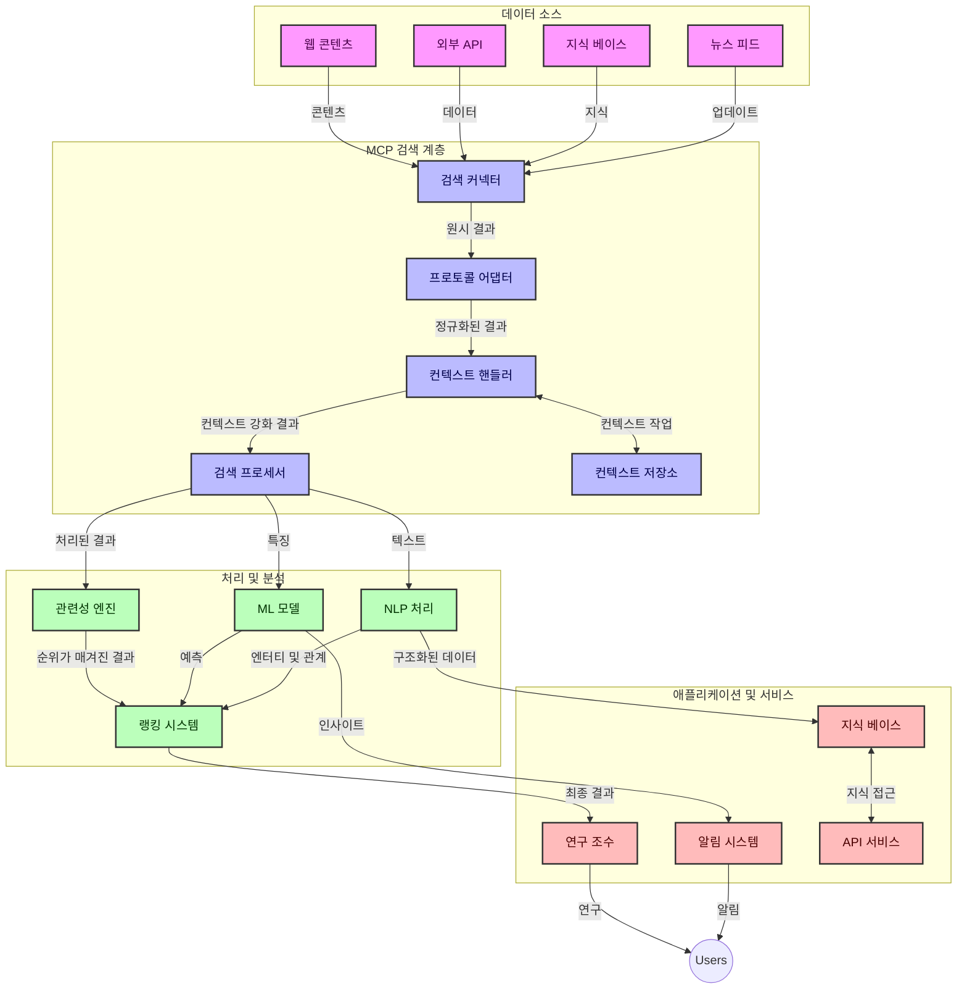
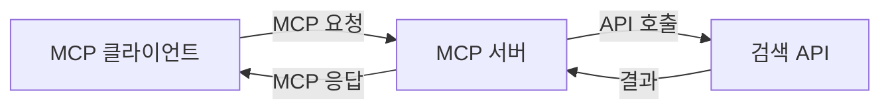
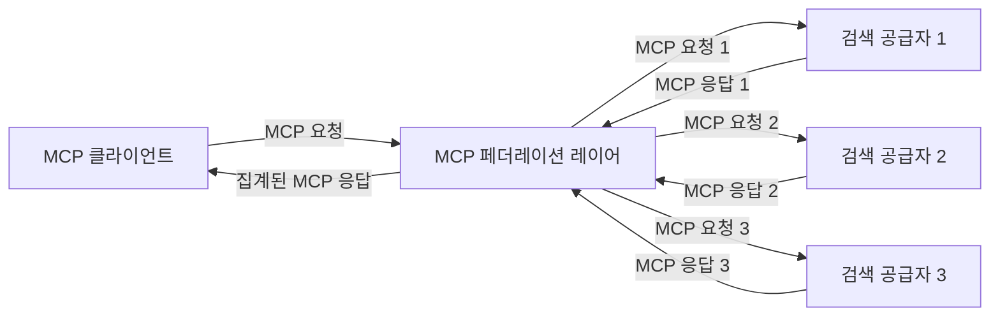
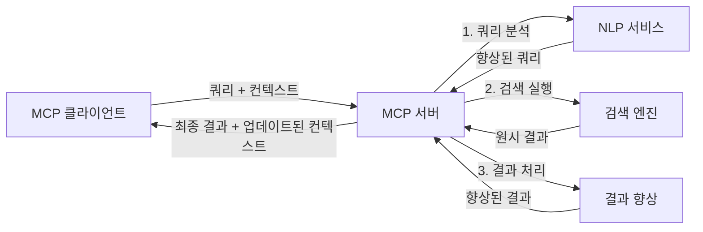

# 실시간 웹 검색을 위한 모델 컨텍스트 프로토콜

## 개요

실시간 웹 검색은 오늘날 정보 중심 환경에서 필수적이 되었으며, 애플리케이션이 관련성 있고 적시에 응답을 제공하기 위해 인터넷 전반의 최신 정보에 즉각적으로 접근해야 합니다. 모델 컨텍스트 프로토콜(MCP)은 이러한 실시간 검색 프로세스를 최적화하고 검색 효율성을 향상하며 컨텍스트 무결성을 유지하고 전체 시스템 성능을 개선하는 데 있어 중요한 발전을 의미합니다.

이 모듈은 MCP가 AI 모델, 검색 엔진, 애플리케이션 전반에 걸쳐 컨텍스트 관리를 표준화된 방식으로 제공함으로써 실시간 웹 검색을 어떻게 변화시키는지 살펴봅니다.

### 학습 내용

이 포괄적인 안내서에서 다음을 알게 될 것입니다:

- MCP가 AI 모델과 실시간 웹 검색 기능 사이에 원활한 연결 고리를 만드는 방법
- MCP를 활용한 효율적이고 확장 가능한 검색 솔루션 구현을 위한 아키텍처 패턴
- 다수의 쿼리와 상호작용에 걸쳐 검색 컨텍스트를 보존하는 기법
- 다양한 검색 시나리오에 대한 Python 및 JavaScript 실습 코드 구현
- MCP 기반 검색 시스템에서 관련성, 최신성 및 성능을 균형 있게 조절하는 방법

## 실시간 웹 검색 소개

실시간 웹 검색은 웹 기반 정보가 게시되거나 업데이트됨에 따라 지속적으로 쿼리를 실행하고 처리 및 분석할 수 있는 기술적 접근법으로, 시스템이 최소한의 지연으로 신선하고 관련성 높은 정보를 제공하도록 합니다. 전통적 검색 시스템이 몇 시간 또는 며칠 오래된 인덱스된 데이터로 작업하는 것과 달리, 실시간 검색은 웹의 라이브 데이터를 처리하여 온라인 콘텐츠의 현재 상태를 반영하는 통찰력과 정보를 제공합니다.

### 실시간 웹 검색의 핵심 개념:

- **지속적인 쿼리 처리**: 검색 쿼리는 지속적으로 업데이트되는 데이터 소스를 대상으로 처리됩니다
- **최신성 우선순위 지정**: 시스템은 신선한 정보를 우선시하도록 설계됩니다
- **관련성과 최신성 균형 조정**: 관련성 및 최신성 간 균형 유지
- **확장 가능한 아키텍처**: 시스템은 가변적인 쿼리 부하와 데이터 규모를 처리할 수 있어야 합니다
- **컨텍스트 이해**: 검색 반복 과정에서 사용자 컨텍스트를 유지하는 것이 의미 있는 결과를 위해 중요
- **동적 쿼리 재구성**: 컨텍스트와 이전 결과를 기반으로 쿼리를 적응적으로 수정
- **다중 소스 통합**: 여러 검색 제공자 및 웹 소스의 결과를 결합
- **의미 기반 이해**: 단순 키워드가 아닌 의미에 기반한 쿼리 및 콘텐츠 처리
- **실시간 순위 조정**: 신규 정보가 나오면 결과 순위를 지속적으로 조정

### 모델 컨텍스트 프로토콜과 실시간 웹 검색

모델 컨텍스트 프로토콜(MCP)은 실시간 웹 검색 환경에서 여러 주요 과제를 해결합니다:

1. **검색 컨텍스트 보존**: MCP는 분산된 검색 구성 요소 전반에서 컨텍스트가 유지되는 방식을 표준화하여 AI 모델과 처리 노드가 관련 쿼리 이력 및 사용자 선호에 접근할 수 있도록 합니다.

2. **효율적인 쿼리 관리**: MCP는 구조화된 메커니즘을 통해 컨텍스트 전달을 제공하여 각 검색 반복에서 컨텍스트를 반복하는 오버헤드를 줄입니다.

3. <strong>상호운용성</strong>: MCP는 다양한 검색 기술과 AI 모델 간 컨텍스트 공유를 위한 공통 언어를 만들어 더 유연하고 확장 가능한 아키텍처를 가능하게 합니다.

4. **검색 최적화된 컨텍스트**: MCP 구현은 효과적인 검색에 가장 관련성 높은 컨텍스트 요소를 우선순위화하여 성능과 정확성 모두를 최적화할 수 있습니다.

5. **적응형 검색 처리**: MCP를 통한 적절한 컨텍스트 관리로 검색 시스템은 진화하는 사용자 요구와 정보 환경에 따라 동적으로 처리를 조정할 수 있습니다.

뉴스 집계부터 연구 보조까지 현대 애플리케이션에서 MCP와 웹 검색 기술의 통합은 점차 관련성 높은 결과를 제공하는 더 지능적이고 컨텍스트 인식적인 검색을 가능하게 합니다.

## 학습 목표

이 수업이 끝나면 다음을 할 수 있습니다:

- 실시간 웹 검색의 기본 원리와 현대 애플리케이션에서의 과제 이해
- 모델 컨텍스트 프로토콜(MCP)이 실시간 웹 검색 능력을 어떻게 향상시키는지 설명
- 인기 있는 프레임워크 및 API를 이용한 MCP 기반 검색 솔루션 구현
- MCP를 이용한 확장 가능하고 고성능 검색 아키텍처 설계 및 배포
- 의미 기반 검색, 연구 보조, AI 보강 탐색 등 다양한 사용 사례에 MCP 개념 적용
- MCP 기반 검색 기술의 최신 동향 및 미래 혁신 평가
- 사용자 상호작용에서 학습하는 컨텍스트 인식 검색 시스템 개발
- 표준화된 MCP 프로토콜을 사용하여 AI 어시스턴트에 웹 검색 기능 통합
- 컨텍스트에 따라 점진적으로 결과를 정제하는 다단계 검색 파이프라인 생성
- 포괄적인 컨텍스트 인식을 유지하면서 검색 성능 최적화

### 정의와 중요성

실시간 웹 검색은 최소 지연으로 웹 기반 정보를 연속적으로 쿼리, 검색, 제공하는 것을 포함합니다. 웹을 주기적으로 크롤링하고 인덱싱하는 전통적 검색 엔진과 달리, 실시간 검색은 정보가 이용 가능해지면 즉각적으로 노출시키는 것을 목표로 하여 최신 콘텐츠에 즉시 접근할 수 있도록 합니다.

실시간 웹 검색의 주요 특징은 다음과 같습니다:

- <strong>신선도</strong>: 최근 콘텐츠와 업데이트를 우선시
- **지속적 처리**: 신규 정보를 지속적으로 모니터링
- **쿼리 적응**: 컨텍스트와 피드백에 기반한 검색 쿼리 정제
- **즉각 제공**: 최소 지연으로 검색 결과 제공
- **컨텍스트 유지**: 향상된 관련성을 위해 이전 쿼리를 기반으로 구축

### 전통적 웹 검색에서의 과제

전통적인 웹 검색 방식은 실시간 시나리오에 적용할 때 여러 한계를 가집니다:

1. **컨텍스트 단절**: 다중 쿼리 간 검색 컨텍스트 유지의 어려움
2. **정보 신선도**: 최신 정보를 접근하고 우선순위 지정하는 데의 어려움
3. **통합 복잡성**: 검색 시스템과 애플리케이션 간 상호운용성 문제
4. **지연 시간 문제**: 포괄적 검색과 응답 시간 요구사항 간 균형
5. **관련성 조정**: 최신성을 우선시하면서 정확성과 관련성 보장

## 검색용 모델 컨텍스트 프로토콜(MCP) 이해

### 검색 컨텍스트에서 MCP란 무엇인가?

모델 컨텍스트 프로토콜(MCP)은 AI 모델과 애플리케이션 간 효율적인 상호작용을 촉진하기 위해 설계된 표준 통신 프로토콜입니다. 실시간 웹 검색 맥락에서 MCP는 다음을 위한 프레임워크를 제공합니다:

- 쿼리 연속 전체에서 검색 컨텍스트를 보존
- 검색 쿼리 및 결과 형식 표준화
- 검색 매개변수 및 결과 전송 최적화
- 모델과 검색 엔진 간 통신 강화

### 핵심 구성 요소 및 아키텍처

실시간 웹 검색용 MCP 아키텍처는 여러 핵심 구성 요소로 구성됩니다:

1. **쿼리 컨텍스트 핸들러**: 다수 쿼리 간 검색 컨텍스트를 관리 및 유지
2. **검색 프로세서**: 컨텍스트 인식 기술을 활용해 들어오는 검색 요청 처리
3. **프로토콜 어댑터**: 컨텍스트를 유지하며 다양한 검색 API 간 변환 수행
4. **컨텍스트 저장소**: 검색 이력과 선호도를 효율적으로 저장 및 조회
5. **검색 커넥터**: 다양한 검색 엔진과 웹 API에 연결



### MCP가 실시간 웹 검색을 개선하는 방법

MCP는 전통적인 웹 검색 과제를 다음과 같이 해결합니다:

- **컨텍스트 연속성**: 전체 검색 세션 동안 쿼리 간 관계 유지
- **최적화된 전송**: 지능적 컨텍스트 관리를 통해 검색 매개변수 중복 감소
- **표준화된 인터페이스**: 검색 구성 요소에 일관된 API 제공
- **지연 시간 감소**: 효율적 컨텍스트 처리로 오버헤드 최소화
- **강화된 관련성**: 다중 쿼리 간 사용자 의도 보존으로 검색 관련성 향상

## 통합 및 구현

실시간 웹 검색 시스템은 성능과 컨텍스트 무결성을 모두 유지하기 위해 세심한 아키텍처 설계 및 구현이 필요합니다. 모델 컨텍스트 프로토콜은 AI 모델과 검색 기술 통합을 위한 표준화된 접근법을 제공하여 더 정교하고 컨텍스트 인식적 검색 파이프라인을 가능하게 합니다.

### 검색 아키텍처에서 MCP 통합 개요

실시간 웹 검색 환경에서 MCP 구현을 위한 주요 고려 사항은 다음과 같습니다:

1. **검색 컨텍스트 직렬화**: MCP는 검색 요청 내에 컨텍스트 정보를 효율적으로 인코딩하는 메커니즘을 제공하여 중요한 컨텍스트가 처리 파이프라인 전체에 걸쳐 쿼리에 따라오도록 보장합니다. 여기에는 검색 관련 메타데이터에 최적화된 표준 직렬화 형식이 포함됩니다.

2. **상태 유지 검색 처리**: MCP는 검색 반복 간 일관된 컨텍스트 표현을 유지해 더 지능적인 상태 유지 처리를 가능하게 합니다. 이는 컨텍스트 정제가 결과를 개선하는 다단계 검색 파이프라인에서 특히 유용합니다.

3. **쿼리 확장 및 정제**: MCP 구현은 축적된 컨텍스트를 기반으로 정교한 쿼리 확장 및 정제를 촉진하여 검색 세션이 진행될수록 점점 더 관련성 높은 결과를 제공합니다.

4. **결과 캐싱 및 우선순위 지정**: MCP는 컨텍스트 처리를 표준화하여 구성 요소가 진화하는 검색 컨텍스트에 따라 적응할 수 있도록 결과 캐싱 및 우선순위 관리를 지원합니다.

5. **검색 연합 및 집계**: MCP는 검색 컨텍스트의 구조화된 표현을 제공함으로써 다수의 백엔드에 걸친 고급 검색 연합을 가능하게 하여 다양한 출처의 결과를 더 의미 있게 집계할 수 있습니다.

다양한 검색 기술에 걸친 MCP 구현은 컨텍스트 관리에 대한 통합적 접근법을 만들어 맞춤 통합 코드를 줄이는 동시에 검색 쿼리가 진화함에 따라 의미 있는 컨텍스트를 유지하는 시스템 능력을 향상시킵니다.

### 다양한 웹 검색 구현에서의 MCP

다음 예제들은 JSON-RPC 기반 프로토콜을 중심으로 한 현재 MCP 명세를 따르며, 별도의 전송 메커니즘을 가지고 있습니다. 코드는 MCP 프로토콜과 완전 호환성을 유지하면서 맞춤형 검색 통합을 구현하는 방법을 보여줍니다.


<details>
<summary>일반 검색 API를 이용한 Python 구현</summary>

```python
import asyncio
import json
import aiohttp
from typing import Dict, Any, Optional, List
from contextlib import asynccontextmanager
from collections.abc import AsyncIterator

# 표준 MCP 라이브러리 임포트
from mcp.client.session import ClientSession
from mcp.client.streamable_http import streamablehttp_client
from mcp.types import TextContent, CreateMessageRequestParams, CreateMessageResult
from mcp.server.fastmcp import FastMCP

# 웹 검색용 FastMCP 서버 생성
search_server = FastMCP("WebSearch")

# 웹 검색 작업을 처리하는 클래스
class WebSearchHandler:
    def __init__(self, api_endpoint: str, api_key: str):
        self.api_endpoint = api_endpoint
        self.api_key = api_key
        self.session = None
        
    async def initialize(self):
        """Initialize the HTTP session"""
        self.session = aiohttp.ClientSession(
            headers={"Authorization": f"Bearer {self.api_key}"}
        )
    
    async def close(self):
        """Close the HTTP session"""
        if self.session:
            await self.session.close()
            
    async def perform_search(self, query: str, max_results: int = 5, 
                           include_domains: List[str] = None, 
                           exclude_domains: List[str] = None,
                           time_period: str = "any") -> Dict[str, Any]:
        """Perform web search using the search API"""
        # 검색 매개변수 구성
        search_params = {
            "q": query,
            "limit": max_results,
            "time": time_period
        }
        
        if include_domains:
            search_params["site"] = ",".join(include_domains)
            
        if exclude_domains:
            search_params["exclude_site"] = ",".join(exclude_domains)
        
        # 검색 요청 수행
        try:
            async with self.session.get(
                self.api_endpoint,
                params=search_params
            ) as response:
                if response.status != 200:
                    error_text = await response.text()
                    raise Exception(f"Search API error: {response.status} - {error_text}")
                
                search_data = await response.json()
                
                # API 전용 응답을 표준 형식으로 변환
                results = []
                for item in search_data.get("results", []):
                    results.append({
                        "title": item.get("title", ""),
                        "url": item.get("url", ""),
                        "snippet": item.get("snippet", ""),
                        "date": item.get("published_date", ""),
                        "source": item.get("source", "")
                    })
                
                return {
                    "query": query,
                    "totalResults": len(results),
                    "results": results
                }
        except Exception as e:
            print(f"Search API request error: {e}")
            raise

# 검색 핸들러 초기화
search_handler = WebSearchHandler(
    api_endpoint="https://api.search-service.example/search",
    api_key="your-api-key-here"
)

# 검색 핸들러 관리를 위한 수명주기 설정
@asyncio.asynccontextmanager
async def app_lifespan(server: FastMCP):
    """Manage application lifecycle"""
    await search_handler.initialize()
    try:
        yield {"search_handler": search_handler}
    finally:
        await search_handler.close()

# 서버 수명주기 설정
search_server = FastMCP("WebSearch", lifespan=app_lifespan)

# 웹 검색 도구 등록
@search_server.tool()
async def web_search(query: str, max_results: int = 5, 
                   include_domains: List[str] = None,
                   exclude_domains: List[str] = None,
                   time_period: str = "any") -> Dict[str, Any]:
    """
    Search the web for information
    
    Args:
        query: The search query
        max_results: Maximum number of results to return (default: 5)
        include_domains: List of domains to include in search results
        exclude_domains: List of domains to exclude from search results
        time_period: Time period for results ("day", "week", "month", "any")
        
    Returns:
        Dictionary containing search results
    """
    ctx = search_server.get_context()
    search_handler = ctx.request_context.lifespan_context["search_handler"]
    
    results = await search_handler.perform_search(
        query=query,
        max_results=max_results,
        include_domains=include_domains,
        exclude_domains=exclude_domains,
        time_period=time_period
    )
    
    return results

# 클라이언트 사용 예시
async def client_example():
    # Streamable HTTP 전송을 사용해 검색 서버 연결
    async with streamablehttp_client("http://localhost:8000/mcp") as (read, write, _):
        async with ClientSession(read, write) as session:
            # 연결 초기화
            await session.initialize()
            
            # web_search 도구 호출
            search_results = await session.call_tool(
                "web_search", 
                {
                    "query": "latest developments in AI and Model Context Protocol",
                    "max_results": 5,
                    "time_period": "day",
                    "include_domains": ["github.com", "microsoft.com"]
                }
            )
            
            print(f"Search results: {search_results}")

# 서버 실행 예시
if __name__ == "__main__":
    # Streamable HTTP 전송으로 서버 실행
    search_server.run(transport="streamable-http")
```
</details> 

<details>
<summary>브라우저 기반 검색을 이용한 JavaScript 구현</summary>


```javascript
// 웹 검색을 위한 MCP 서버 구현
import { McpServer, ResourceTemplate } from '@modelcontextprotocol/sdk/server/mcp.js';
import { StreamableHTTPServerTransport } from '@modelcontextprotocol/sdk/server/streamableHttp.js';
import { z } from 'zod';

// 웹 검색을 위한 MCP 서버 생성
const searchServer = new McpServer({
    name: "BrowserSearch",
    description: "A server that provides web search capabilities"
});

// 검색 서비스 클래스
class SearchService {
    constructor(searchApiUrl, apiKey) {
        this.searchApiUrl = searchApiUrl;
        this.apiKey = apiKey;
    }

    async performSearch(parameters) {
        const {
            query = '',
            maxResults = 5,
            includeDomains = [],
            excludeDomains = [],
            timePeriod = 'any'
        } = parameters;
        
        // 매개변수로 검색 URL 구성
        const url = new URL(this.searchApiUrl);
        url.searchParams.append('q', query);
        url.searchParams.append('limit', maxResults);
        url.searchParams.append('time', timePeriod);
        
        if (includeDomains.length > 0) {
            url.searchParams.append('site', includeDomains.join(','));
        }
        
        if (excludeDomains.length > 0) {
            url.searchParams.append('exclude_site', excludeDomains.join(','));
        }
        
        try {
            const response = await fetch(url.toString(), {
                method: 'GET',
                headers: {
                    'Authorization': `Bearer ${this.apiKey}`,
                    'Content-Type': 'application/json'
                }
            });
            
            if (!response.ok) {
                const errorText = await response.text();
                throw new Error(`Search API error: ${response.status} - ${errorText}`);
            }
            
            const searchData = await response.json();
            
            // API별 응답을 표준 형식으로 변환
            const results = searchData.results?.map(item => ({
                title: item.title || '',
                url: item.url || '',
                snippet: item.snippet || '',
                date: item.published_date || '',
                source: item.source || ''
            })) || [];
            
            return {
                query,
                totalResults: results.length,
                results
            };
        } catch (error) {
            console.error('Search API request error:', error);
            throw error;
        }
    }
}

// 검색 서비스 초기화
const searchService = new SearchService(
    'https://api.search-service.example/search',
    'your-api-key-here'
);

// 서버용 컨텍스트 공급자 설정
searchServer.setContextProvider(() => {
    return {
        searchService
    };
});

// 웹 검색 도구 등록
searchServer.tool({
    name: 'web_search',
    description: 'Search the web for information',
    parameters: {
        type: 'object',
        properties: {
            query: {
                type: 'string',
                description: 'The search query'
            },
            maxResults: {
                type: 'integer',
                description: 'Maximum number of results to return',
                default: 5
            },
            includeDomains: {
                type: 'array',
                items: { type: 'string' },
                description: 'List of domains to include in search results'
            },
            excludeDomains: {
                type: 'array',
                items: { type: 'string' },
                description: 'List of domains to exclude from search results'
            },
            timePeriod: {
                type: 'string',
                description: 'Time period for results',
                enum: ['day', 'week', 'month', 'any'],
                default: 'any'
            }
        },
        required: ['query']
    },
    handler: async (params, context) => {
        const { searchService } = context;
        return await searchService.performSearch(params);
    }
});

// 검색 서버에 연결하는 예제 클라이언트 코드
import { Client } from '@modelcontextprotocol/sdk/client/index.js';
import { StreamableHTTPClientTransport } from '@modelcontextprotocol/sdk/client/streamableHttp.js';

async function connectToSearchServer() {
    // 검색 서버에 연결
    const transport = new StreamableHTTPClientTransport(
        new URL('http://localhost:8000/mcp')
    );
    
    const client = new Client({
        name: 'search-client',
        version: '1.0.0'
    });
    
    await client.connect(transport);
    
    // 검색 도구 실행
    const searchResults = await client.callTool({
        name: 'web_search',
        arguments: {
            query: 'Model Context Protocol implementation examples',
            maxResults: 10,
            timePeriod: 'week',
            includeDomains: ['github.com', 'docs.microsoft.com']
        }
    });
    
    console.log('Search results:', searchResults);
    
    // 정리 작업
    await client.disconnect();
}

// 서버 시작
const transport = new StreamableHTTPServerTransport();
await searchServer.connect(transport);
console.log('Search server running at http://localhost:8000/mcp');

// 별도의 프로세스에서 또는 서버 시작 후
// connectToSearchServer().catch(console.error);
```
</details> 


## 코드 예제 고지사항

> **중요 참고**: 아래 코드 예제는 모델 컨텍스트 프로토콜(MCP)과 웹 검색 기능 통합을 시연합니다. 공식 MCP SDK의 패턴과 구조를 따르지만 교육 목적으로 단순화되었습니다.
> 
> 이 예제들은 다음과 같은 내용을 보여줍니다:
> 
> 1. **Python 구현**: 외부 검색 API에 연결되는 FastMCP 서버 구현으로, 웹 검색 도구를 제공합니다. 이 예제는 [공식 MCP Python SDK](https://github.com/modelcontextprotocol/python-sdk)의 패턴을 따라 수명 주기 관리, 컨텍스트 처리, 도구 구현을 시연합니다. 서버는 생산 배포용으로 기존 SSE 전송을 대체한 권장 스트리밍 HTTP 전송을 사용합니다.
> 
> 2. **JavaScript 구현**: [공식 MCP TypeScript SDK](https://github.com/modelcontextprotocol/typescript-sdk)의 FastMCP 패턴을 사용한 TypeScript/JavaScript 구현으로, 적절한 도구 정의와 클라이언트 연결을 갖춘 검색 서버를 만듭니다. 최신 권장 패턴에 따라 세션 관리와 컨텍스트 보존을 따릅니다.
> 
> 이러한 예제는 실제 프로덕션 사용을 위해 추가적인 오류 처리, 인증, 특정 API 통합 코드가 필요합니다. 보여진 검색 API 엔드포인트(`https://api.search-service.example/search`)는 자리 표시자이며 실제 검색 서비스 엔드포인트로 교체해야 합니다.
> 
> 완전한 구현 세부사항과 최신 접근법은 [공식 MCP 명세](https://spec.modelcontextprotocol.io/)와 SDK 문서를 참조하십시오.

## 핵심 개념

### 모델 컨텍스트 프로토콜 (MCP) 프레임워크

모델 컨텍스트 프로토콜은 AI 모델, 애플리케이션, 서비스가 컨텍스트를 교환할 수 있도록 표준화된 방식을 제공합니다. 실시간 웹 검색에서 이 프레임워크는 일관성 있는 다중 턴 검색 경험을 만드는 데 필수적입니다. 주요 구성 요소는 다음과 같습니다:

1. **클라이언트-서버 아키텍처**: MCP는 검색 클라이언트(요청자)와 검색 서버(제공자)를 명확히 구분하여 유연한 배포 모델을 허용합니다.

2. **JSON-RPC 통신**: 프로토콜은 JSON-RPC를 메시지 교환에 사용하여 웹 기술과 호환되며 다양한 플랫폼에 쉽게 구현할 수 있습니다.

3. **컨텍스트 관리**: MCP는 다중 상호작용에 걸쳐 검색 컨텍스트를 유지, 갱신, 활용하는 구조화된 방식을 정의합니다.

4. **도구 정의**: 검색 기능을 잘 정의된 매개변수와 반환값을 가진 표준화된 도구로 노출합니다.

5. **스트리밍 지원**: 결과가 점진적으로 도착할 수 있는 실시간 검색에 필수적인 스트리밍 결과를 지원합니다.

### 웹 검색 통합 패턴

MCP를 웹 검색과 통합할 때 여러 패턴이 나타납니다:

#### 1. 직접 검색 제공자 통합



이 패턴에서는 MCP 서버가 하나 이상의 검색 API와 직접 인터페이스하여 MCP 요청을 API별 호출로 변환하고 결과를 MCP 응답으로 포맷합니다.

#### 2. 컨텍스트 보존을 통한 연합 검색



이 패턴은 여러 MCP 호환 검색 제공자에게 검색 쿼리를 분산시키며, 각 제공자는 서로 다른 유형의 콘텐츠나 검색 기능에 특화될 수 있고 통일된 컨텍스트를 유지합니다.

#### 3. 컨텍스트 강화 검색 체인



이 패턴에서는 검색 프로세스가 여러 단계로 나누어지며 각 단계에서 컨텍스트가 풍부해져 점진적으로 더 관련성 높은 결과를 도출합니다.

### 검색 컨텍스트 구성 요소

MCP 기반 웹 검색에서 컨텍스트는 일반적으로 다음을 포함합니다:

- **쿼리 이력**: 세션 내 이전 검색 쿼리들
- **사용자 선호**: 언어, 지역, 안전 검색 설정
- **상호작용 이력**: 클릭한 결과, 결과에 머문 시간
- **검색 매개변수**: 필터, 정렬 순서 및 기타 검색 수정자
- **도메인 지식**: 검색과 관련된 주제별 컨텍스트
- **시간적 컨텍스트**: 시간 기반 관련성 요소
- **출처 선호**: 신뢰하거나 선호하는 정보 출처

## 사용 사례 및 응용

### 연구 및 정보 수집

MCP는 연구 워크플로우를 다음과 같이 강화합니다:

- 검색 세션 전반에 걸친 연구 컨텍스트 보존
- 더 정교하고 컨텍스트에 맞는 쿼리 가능
- 다중 소스 검색 연합 지원
- 검색 결과에서 지식 추출 촉진

### 실시간 뉴스 및 트렌드 모니터링

MCP 기반 검색은 뉴스 모니터링에 다음과 같은 이점을 제공합니다:

- 거의 실시간에 가까운 신흥 뉴스 기사 발견
- 관련 정보의 컨텍스트 기반 필터링
- 다중 소스 간 주제 및 엔티티 추적
- 사용자 컨텍스트에 기반한 개인화 뉴스 알림

### AI 보강 탐색 및 연구

MCP는 AI 보강 탐색에 새로운 가능성을 만듭니다:

- 현재 브라우저 활동에 기반한 컨텍스트 검색 제안
- LLM 기반 어시스턴트와 웹 검색의 원활한 통합
- 유지된 컨텍스트로 다중 턴 검색 정제
- 향상된 사실 확인 및 정보 검증

## 미래 동향 및 혁신

### 웹 검색에서의 MCP 진화

앞으로 우리는 MCP가 다음 과제를 해결하도록 진화할 것으로 기대합니다:


- **멀티모달 검색**: 저장된 컨텍스트와 함께 텍스트, 이미지, 오디오, 비디오 검색 통합
- **분산 검색**: 분산 및 연합 검색 생태계 지원
- **검색 프라이버시**: 컨텍스트 인지 프라이버시 보호 검색 메커니즘
- **쿼리 이해**: 자연어 검색 쿼리의 심층 의미 분석

### 기술의 잠재적 발전

미래 MCP 검색을 형성할 신기술들:

1. **뉴럴 검색 아키텍처**: MCP에 최적화된 임베딩 기반 검색 시스템
2. **개인화 검색 컨텍스트**: 시간이 지나며 개별 사용자 검색 패턴 학습
3. **지식 그래프 통합**: 도메인별 지식 그래프로 강화된 컨텍스트 검색
4. **교차 모달 컨텍스트**: 다양한 검색 방식 간 컨텍스트 유지

## 실습

### 실습 1: 기본 MCP 검색 파이프라인 설정

이 실습에서는 다음을 학습합니다:
- 기본 MCP 검색 환경 구성
- 웹 검색용 컨텍스트 핸들러 구현
- 검색 반복 간 컨텍스트 보존 테스트 및 검증

### 실습 2: MCP 검색으로 연구 조수 구축

다음을 수행하는 완전한 애플리케이션 생성:
- 자연어 연구 질문 처리
- 컨텍스트 인지 웹 검색 수행
- 여러 출처에서 정보 종합
- 조직된 연구 결과 제시

### 실습 3: MCP로 다중 출처 검색 연합 구현

고급 실습 과정:
- 여러 검색 엔진에 대한 컨텍스트 인지 쿼리 전달
- 결과 순위 매김 및 집계
- 검색 결과 컨텍스트 중복 제거
- 출처별 메타데이터 처리

## 추가 자료

- [Model Context Protocol Specification](https://spec.modelcontextprotocol.io/) - 공식 MCP 사양 및 세부 프로토콜 문서
- [Model Context Protocol Documentation](https://modelcontextprotocol.io/) - 상세 튜토리얼 및 구현 안내서
- [MCP Python SDK](https://github.com/modelcontextprotocol/python-sdk) - MCP 프로토콜 공식 Python 구현체
- [MCP TypeScript SDK](https://github.com/modelcontextprotocol/typescript-sdk) - MCP 프로토콜 공식 TypeScript 구현체
- [MCP Reference Servers](https://github.com/modelcontextprotocol/servers) - MCP 서버 레퍼런스 구현체
- [Bing Web Search API Documentation](https://learn.microsoft.com/en-us/bing/search-apis/bing-web-search/overview) - 마이크로소프트 웹 검색 API
- [Google Custom Search JSON API](https://developers.google.com/custom-search/v1/overview) - 구글 커스텀 검색 JSON API
- [SerpAPI Documentation](https://serpapi.com/search-api) - 검색 엔진 결과 페이지 API
- [Meilisearch Documentation](https://www.meilisearch.com/docs) - 오픈 소스 검색 엔진
- [Elasticsearch Documentation](https://www.elastic.co/guide/index.html) - 분산 검색 및 분석 엔진
- [LangChain Documentation](https://python.langchain.com/docs/get_started/introduction) - LLM으로 애플리케이션 구축

## 학습 성과

이 모듈을 완료하면 다음을 할 수 있습니다:

- 실시간 웹 검색의 기본 원리와 도전 과제 이해
- Model Context Protocol (MCP)이 실시간 웹 검색 능력을 향상시키는 방법 설명
- 인기 있는 프레임워크와 API를 사용해 MCP 기반 검색 솔루션 구현
- MCP로 확장 가능하고 고성능 검색 아키텍처 설계 및 배포
- 의미론 검색, 연구 조수, AI 보조 탐색 등 다양한 사용 사례에 MCP 개념 적용
- MCP 기반 검색 기술의 새로운 트렌드와 미래 혁신 평가


### 신뢰와 안전 고려사항

MCP 기반 웹 검색 솔루션을 구현할 때 MCP 사양의 다음 중요한 원칙을 유념하세요:

1. **사용자 동의 및 제어**: 사용자는 모든 데이터 접근과 작업에 대해 명확한 동의와 이해가 있어야 합니다. 이는 외부 데이터 소스에 접근할 수 있는 웹 검색 구현에서 특히 중요합니다.

2. **데이터 프라이버시**: 검색 쿼리와 결과를 적절히 처리하고 특히 민감한 정보가 포함될 수 있을 때 사용자 데이터 보호를 위한 적절한 접근 제어를 시행합니다.

3. **도구 안전성**: 검색 도구는 임의 코드 실행의 보안 위험 요인이므로 적절한 권한 부여와 검증을 시행합니다. 도구 동작 설명은 신뢰할 수 있는 서버에서 얻지 않은 한 신뢰 불가로 간주해야 합니다.

4. **명확한 문서화**: MCP 사양의 구현 지침에 따라 MCP 기반 검색 구현의 능력, 한계, 보안 고려사항을 명확히 문서화합니다.

5. **견고한 동의 흐름**: 각 도구가 수행하는 작업을 명확히 설명하고 외부 웹 자원과 상호작용하는 도구에 대해서는 사용 승인을 하기 전에 견고한 동의 및 권한 부여 흐름을 구축합니다.

MCP 보안 및 신뢰 고려사항에 대한 자세한 내용은 [공식 문서](https://modelcontextprotocol.io/specification/2025-11-25/basic/security_best_practices)를 참조하세요.

## 다음 단계

- [5.12 Entra ID Authentication for Model Context Protocol Servers](../mcp-security-entra/README.md)

---

<!-- CO-OP TRANSLATOR DISCLAIMER START -->
**면책 조항**:
이 문서는 AI 번역 서비스 [Co-op Translator](https://github.com/Azure/co-op-translator)를 사용하여 번역되었습니다. 정확성을 기하기 위해 노력하고 있으나, 자동 번역은 오류나 부정확한 부분이 있을 수 있음을 유의하시기 바랍니다. 원본 문서의 원어본이 권위 있는 자료로 간주되어야 합니다. 중요한 정보의 경우, 전문가의 인간 번역을 권장합니다. 이 번역 사용으로 인해 발생하는 오해나 잘못된 해석에 대해 당사는 책임을 지지 않습니다.
<!-- CO-OP TRANSLATOR DISCLAIMER END -->