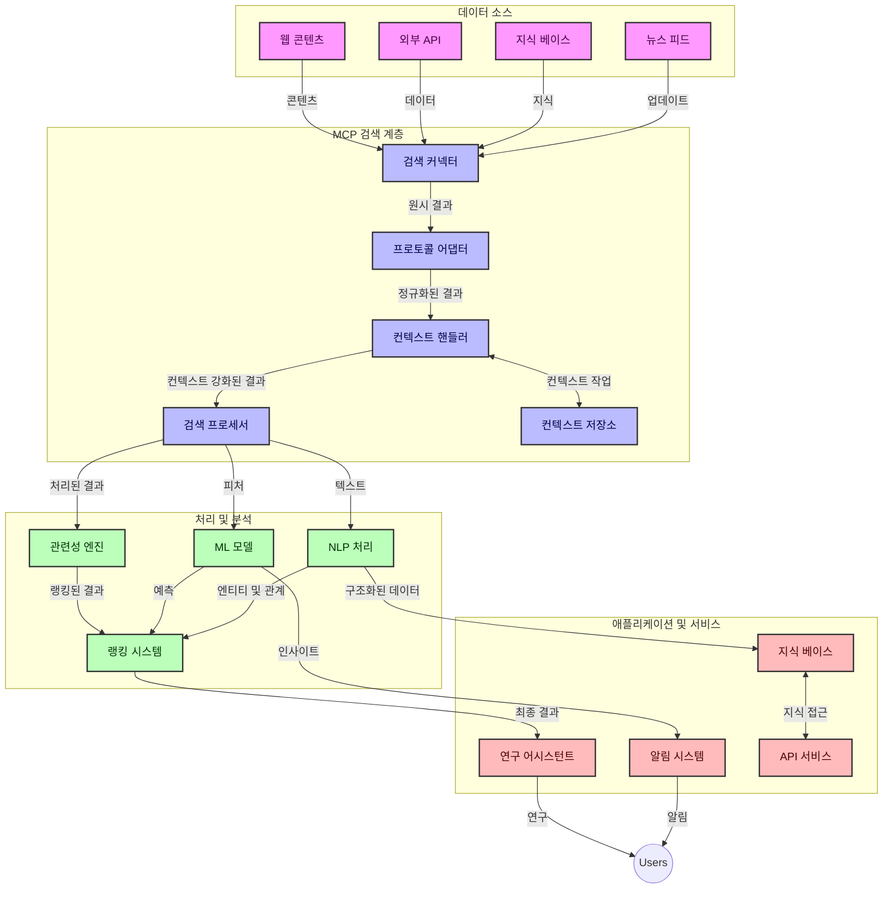
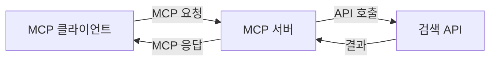
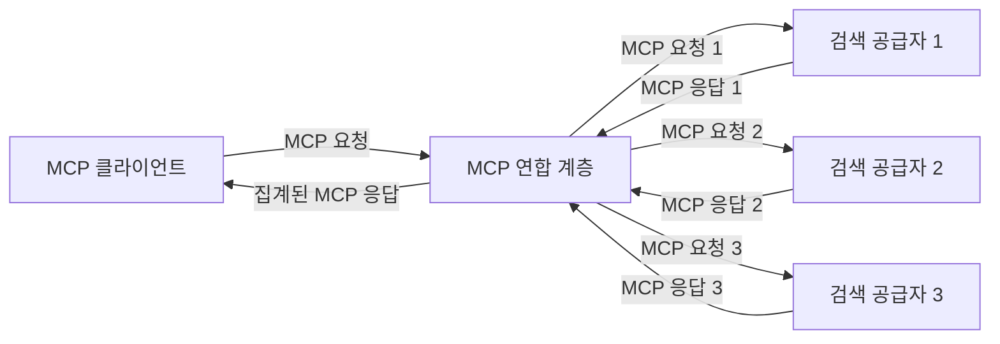
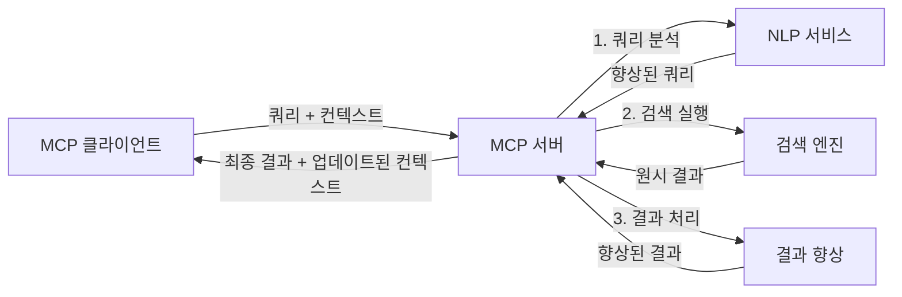

# 실시간 웹 검색을 위한 모델 컨텍스트 프로토콜

## 개요

실시간 웹 검색은 오늘날 정보 중심 환경에서 필수가 되었습니다. 애플리케이션이 인터넷 전반의 최신 정보에 즉시 접근하여 관련성 있고 시기적절한 응답을 제공해야 하기 때문입니다. 모델 컨텍스트 프로토콜(MCP)은 이러한 실시간 검색 프로세스를 최적화하여 검색 효율성을 향상시키고, 컨텍스트 무결성을 유지하며, 전반적인 시스템 성능을 개선하는 중요한 진전을 나타냅니다.

이 모듈에서는 MCP가 AI 모델, 검색 엔진, 애플리케이션 전반에서 컨텍스트 관리를 표준화하는 접근 방식을 제공함으로써 실시간 웹 검색을 어떻게 변화시키는지 탐구합니다.

### 학습 내용

이 포괄적인 가이드에서 여러분은 다음을 배우게 됩니다:

- MCP가 AI 모델과 실시간 웹 검색 기능 사이에 원활한 연결을 어떻게 만드는지
- MCP를 사용하여 효율적이고 확장 가능한 검색 솔루션을 구현하기 위한 아키텍처 패턴
- 여러 쿼리와 상호작용에 걸쳐 검색 컨텍스트를 유지하는 기법
- 다양한 검색 시나리오에 대한 Python 및 JavaScript의 실제 코드 구현
- MCP 기반 검색 시스템에서 관련성, 최신성, 성능을 균형 있게 조율하는 방법

## 실시간 웹 검색 소개

실시간 웹 검색은 웹 기반 정보가 게시되거나 업데이트되는 즉시 지속적으로 질의, 처리, 분석하는 기술적 접근법으로, 시스템이 최소 지연으로 신선하고 관련성 있는 정보를 제공할 수 있게 합니다. 수시간 또는 수일 된 색인 데이터를 기반으로 작동하는 전통적 검색 시스템과 달리 실시간 검색은 웹의 실시간 데이터를 처리하여 온라인 콘텐츠의 현재 상태를 반영하는 통찰과 정보를 전달합니다.

### 실시간 웹 검색의 핵심 개념:

- **지속적 쿼리 처리**: 데이터 소스가 끊임없이 갱신됨에 따라 쿼리가 처리됨
- **최신성 우선순위**: 시스템은 신선한 정보를 우선시하도록 설계됨
- **관련성 균형**: 관련성과 최신성 간의 균형 유지
- **확장 가능한 아키텍처**: 가변 쿼리 부하와 데이터 양을 처리해야 함
- **컨텍스트 이해**: 검색 반복 전반에 사용자 컨텍스트 유지가 중요
- **동적 쿼리 재구성**: 컨텍스트와 이전 결과를 기반으로 쿼리를 적응적으로 수정
- **멀티 소스 통합**: 여러 검색 공급자와 웹 소스의 결과 결합
- **의미론적 이해**: 단순 키워드가 아닌 의미 기반으로 쿼리 및 콘텐츠 처리
- **실시간 랭킹**: 새 정보가 제공됨에 따라 결과 순위 지속적으로 조정

### 모델 컨텍스트 프로토콜과 실시간 웹 검색

모델 컨텍스트 프로토콜(MCP)은 실시간 웹 검색 환경에서 다음과 같은 주요 도전을 해결합니다:

1. **검색 컨텍스트 보존**: MCP는 분산된 검색 구성 요소 전반에 컨텍스트를 유지하는 방법을 표준화하여 AI 모델과 처리 노드가 관련 쿼리 이력 및 사용자 선호에 접근할 수 있도록 보장합니다.

2. **효율적인 쿼리 관리**: MCP는 컨텍스트 전송을 위한 구조화된 메커니즘을 제공하여 각 검색 반복마다 컨텍스트를 반복하는 오버헤드를 줄입니다.

3. <strong>상호운용성</strong>: MCP는 다양한 검색 기술과 AI 모델 간 컨텍스트 공유를 위한 공통 언어를 만들어 보다 유연하고 확장 가능한 아키텍처를 가능하게 합니다.

4. **검색 최적화된 컨텍스트**: MCP 구현은 효과적인 검색을 위해 가장 관련성 높은 컨텍스트 요소에 우선순위를 둬 성능과 정확도를 모두 최적화할 수 있습니다.

5. **적응형 검색 처리**: MCP를 통한 적절한 컨텍스트 관리를 통해 검색 시스템은 변화하는 사용자 요구와 정보 환경에 따라 동적으로 처리 방식을 조정할 수 있습니다.

뉴스 집계부터 연구 도우미에 이르는 현대 애플리케이션에서 MCP와 웹 검색 기술 통합은 사용자 상호작용이 계속됨에 따라 점점 더 관련성 높은 결과를 제공할 수 있는 지능적이고 컨텍스트 인지적 검색을 실현합니다.

## 학습 목표

이 강의를 마치면 다음을 할 수 있게 됩니다:

- 실시간 웹 검색의 기본 원리와 현대 애플리케이션에서의 도전 과제 이해
- 모델 컨텍스트 프로토콜(MCP)이 실시간 웹 검색 기능을 어떻게 향상시키는지 설명
- 인기 있는 프레임워크와 API를 활용해 MCP 기반 검색 솔루션 구현
- MCP로 확장 가능하고 고성능 검색 아키텍처 설계 및 배포
- 의미 기반 검색, 연구 지원, AI 증강 브라우징을 포함한 다양한 활용 사례에 MCP 개념 적용
- MCP 기반 검색 기술의 최신 동향과 미래 혁신 평가
- 사용자 상호작용에서 학습하는 컨텍스트 인지 검색 시스템 개발
- 표준화된 MCP 프로토콜을 사용하여 AI 비서에 웹 검색 기능 통합
- 컨텍스트에 따라 점진적으로 결과를 정제하는 다단계 검색 파이프라인 생성
- 포괄적 컨텍스트 인식을 유지하면서 검색 성능 최적화

### 정의와 중요성

실시간 웹 검색은 최소 지연으로 웹 기반 정보를 지속적으로 질의, 검색, 전달하는 것을 포함합니다. 전통적인 검색 엔진이 웹을 주기적으로 크롤링하고 색인하는 것과 달리 실시간 검색은 정보가 제공되는 즉시 노출하려고 합니다.

실시간 웹 검색의 주요 특징은 다음과 같습니다:

- <strong>신선함</strong>: 최신 콘텐츠와 업데이트 우선순위 지정
- **지속 처리**: 새로운 정보를 끊임없이 모니터링
- **쿼리 적응**: 컨텍스트 및 피드백에 따라 검색 쿼리 정제
- **즉각 전달**: 최소 딜레이로 검색 결과 제공
- **컨텍스트 유지**: 이전 쿼리를 기반으로 관련성 향상

### 전통적 웹 검색의 과제

전통적 웹 검색 접근법은 실시간 적용 시 여러 한계에 직면합니다:

1. **컨텍스트 단절**: 여러 쿼리에 걸친 검색 컨텍스트 유지 어려움
2. **정보 최신성**: 최신 정보 접근 및 우선순위 설정 문제
3. **통합 복잡성**: 검색 시스템과 애플리케이션 간 상호운용성 문제
4. **지연 문제**: 포괄적인 검색과 응답 시간 요구사항 균형 조정
5. **관련성 조율**: 최신성을 우선하되 정확성과 관련성 보장

## 검색을 위한 모델 컨텍스트 프로토콜(MCP) 이해

### 검색 맥락에서의 MCP란?

모델 컨텍스트 프로토콜(MCP)은 AI 모델과 애플리케이션 간 효율적 상호작용을 촉진하기 위한 표준화된 통신 프로토콜입니다. 실시간 웹 검색에서는 다음을 위한 프레임워크를 제공합니다:

- 쿼리 시퀀스 전반에 걸친 검색 컨텍스트 보존
- 검색 쿼리 및 결과 형식의 표준화
- 검색 파라미터 및 결과 전송 최적화
- 모델과 검색 엔진 간 커뮤니케이션 강화

### 주요 구성 요소 및 아키텍처

실시간 웹 검색을 위한 MCP 아키텍처는 다음의 핵심 구성 요소로 이루어져 있습니다:

1. **쿼리 컨텍스트 핸들러**: 여러 쿼리에 걸쳐 검색 컨텍스트 관리 및 유지
2. **검색 프로세서**: 컨텍스트 인지 기법을 사용하여 들어오는 검색 요청 처리
3. **프로토콜 어댑터**: 다양한 검색 API 간 변환하며 컨텍스트 보존
4. **컨텍스트 저장소**: 검색 이력과 선호를 효율적으로 저장 및 조회
5. **검색 커넥터**: 다양한 검색 엔진과 웹 API에 연결



### MCP가 실시간 웹 검색을 개선하는 방법

MCP는 전통적 웹 검색의 도전을 다음과 같이 해결합니다:

- **컨텍스트 연속성**: 검색 세션 전반에 걸쳐 쿼리 간 관계 유지
- **전송 최적화**: 지능적 컨텍스트 관리로 검색 파라미터 중복 감소
- **표준화된 인터페이스**: 검색 구성 요소를 위한 일관된 API 제공
- **지연 감소**: 효율적 컨텍스트 처리를 통한 처리 오버헤드 최소화
- **향상된 관련성**: 여러 쿼리에 걸쳐 사용자 의도 보존으로 검색 관련성 향상

## 통합 및 구현

실시간 웹 검색 시스템은 성능과 컨텍스트 무결성을 모두 유지하기 위한 신중한 아키텍처 설계와 구현이 필요합니다. 모델 컨텍스트 프로토콜은 AI 모델과 검색 기술을 통합하는 표준화된 접근법을 제공하여 보다 정교하고 컨텍스트 인지적인 검색 파이프라인을 가능하게 합니다.

### 검색 아키텍처 내 MCP 통합 개요

실시간 웹 검색 환경에서 MCP를 구현할 때 고려해야 할 주요 사항은 다음과 같습니다:

1. **검색 컨텍스트 직렬화**: MCP는 검색 요청 내에 컨텍스트 정보를 효율적으로 인코딩하는 메커니즘을 제공하여 필수 컨텍스트가 처리 파이프라인 전반에 따라 쿼리를 따라가도록 보장합니다. 여기에는 검색 관련 메타데이터에 최적화된 표준화된 직렬화 포맷이 포함됩니다.

2. **상태 유지 검색 처리**: MCP는 검색 반복 간 일관된 컨텍스트 표현을 유지하여 보다 지능적인 상태 유지 처리를 가능하게 합니다. 이는 컨텍스트 정제를 통해 결과를 개선하는 다단계 검색 파이프라인에서 특히 유용합니다.

3. **쿼리 확장 및 정제**: MCP 구현체는 축적된 컨텍스트를 바탕으로 정교한 쿼리 확장 및 정제를 지원하여 검색 세션이 진행됨에 따라 점진적으로 관련성 높은 결과를 제공합니다.

4. **결과 캐싱 및 우선순위 지정**: 컨텍스트 처리 표준화로 MCP는 결과 캐싱과 우선순위 지정을 관리하는 데 도움을 주어 구성 요소가 변화하는 검색 컨텍스트에 맞게 조정할 수 있게 합니다.

5. **검색 연합 및 집계**: MCP는 검색 컨텍스트의 구조화된 표현을 제공하여 여러 백엔드에서의 검색 연합을 보다 정교하게 만들며, 다양한 소스의 결과를 더 의미있게 집계할 수 있게 합니다.

다양한 검색 기술 전반에 걸친 MCP 구현은 컨텍스트 관리를 위한 통합된 접근법을 만들어 맞춤 통합 코드 필요성을 줄이고 검색 쿼리 변화에 따른 의미 있는 컨텍스트 유지 능력을 향상시킵니다.

### 다양한 웹 검색 구현에서의 MCP

이 예제들은 JSON-RPC 기반 프로토콜과 구분된 전송 메커니즘에 초점을 맞춘 현재 MCP 사양을 따릅니다. 코드는 여러분이 MCP 프로토콜과 완전 호환성을 유지하면서 맞춤 검색 통합을 구현하는 방법을 보여줍니다.


<details>
<summary>일반 검색 API를 사용한 Python 구현</summary>

```python
import asyncio
import json
import aiohttp
from typing import Dict, Any, Optional, List
from contextlib import asynccontextmanager
from collections.abc import AsyncIterator

# 표준 MCP 라이브러리 가져오기
from mcp.client.session import ClientSession
from mcp.client.streamable_http import streamablehttp_client
from mcp.types import TextContent, CreateMessageRequestParams, CreateMessageResult
from mcp.server.fastmcp import FastMCP

# 웹 검색을 위한 FastMCP 서버 생성
search_server = FastMCP("WebSearch")

# 웹 검색 작업을 처리하는 클래스
class WebSearchHandler:
    def __init__(self, api_endpoint: str, api_key: str):
        self.api_endpoint = api_endpoint
        self.api_key = api_key
        self.session = None
        
    async def initialize(self):
        """Initialize the HTTP session"""
        self.session = aiohttp.ClientSession(
            headers={"Authorization": f"Bearer {self.api_key}"}
        )
    
    async def close(self):
        """Close the HTTP session"""
        if self.session:
            await self.session.close()
            
    async def perform_search(self, query: str, max_results: int = 5, 
                           include_domains: List[str] = None, 
                           exclude_domains: List[str] = None,
                           time_period: str = "any") -> Dict[str, Any]:
        """Perform web search using the search API"""
        # 검색 매개변수 구성
        search_params = {
            "q": query,
            "limit": max_results,
            "time": time_period
        }
        
        if include_domains:
            search_params["site"] = ",".join(include_domains)
            
        if exclude_domains:
            search_params["exclude_site"] = ",".join(exclude_domains)
        
        # 검색 요청 수행
        try:
            async with self.session.get(
                self.api_endpoint,
                params=search_params
            ) as response:
                if response.status != 200:
                    error_text = await response.text()
                    raise Exception(f"Search API error: {response.status} - {error_text}")
                
                search_data = await response.json()
                
                # API 특화 응답을 표준 형식으로 변환
                results = []
                for item in search_data.get("results", []):
                    results.append({
                        "title": item.get("title", ""),
                        "url": item.get("url", ""),
                        "snippet": item.get("snippet", ""),
                        "date": item.get("published_date", ""),
                        "source": item.get("source", "")
                    })
                
                return {
                    "query": query,
                    "totalResults": len(results),
                    "results": results
                }
        except Exception as e:
            print(f"Search API request error: {e}")
            raise

# 검색 핸들러 초기화
search_handler = WebSearchHandler(
    api_endpoint="https://api.search-service.example/search",
    api_key="your-api-key-here"
)

# 검색 핸들러 관리를 위한 수명주기 설정
@asyncio.asynccontextmanager
async def app_lifespan(server: FastMCP):
    """Manage application lifecycle"""
    await search_handler.initialize()
    try:
        yield {"search_handler": search_handler}
    finally:
        await search_handler.close()

# 서버 수명주기 설정
search_server = FastMCP("WebSearch", lifespan=app_lifespan)

# 웹 검색 도구 등록
@search_server.tool()
async def web_search(query: str, max_results: int = 5, 
                   include_domains: List[str] = None,
                   exclude_domains: List[str] = None,
                   time_period: str = "any") -> Dict[str, Any]:
    """
    Search the web for information
    
    Args:
        query: The search query
        max_results: Maximum number of results to return (default: 5)
        include_domains: List of domains to include in search results
        exclude_domains: List of domains to exclude from search results
        time_period: Time period for results ("day", "week", "month", "any")
        
    Returns:
        Dictionary containing search results
    """
    ctx = search_server.get_context()
    search_handler = ctx.request_context.lifespan_context["search_handler"]
    
    results = await search_handler.perform_search(
        query=query,
        max_results=max_results,
        include_domains=include_domains,
        exclude_domains=exclude_domains,
        time_period=time_period
    )
    
    return results

# 클라이언트 사용 예
async def client_example():
    # Streamable HTTP 전송을 사용해 검색 서버에 연결
    async with streamablehttp_client("http://localhost:8000/mcp") as (read, write, _):
        async with ClientSession(read, write) as session:
            # 연결 초기화
            await session.initialize()
            
            # web_search 도구 호출
            search_results = await session.call_tool(
                "web_search", 
                {
                    "query": "latest developments in AI and Model Context Protocol",
                    "max_results": 5,
                    "time_period": "day",
                    "include_domains": ["github.com", "microsoft.com"]
                }
            )
            
            print(f"Search results: {search_results}")

# 서버 실행 예
if __name__ == "__main__":
    # Streamable HTTP 전송으로 서버 실행
    search_server.run(transport="streamable-http")
```
</details> 

<details>
<summary>브라우저 기반 검색을 사용한 JavaScript 구현</summary>


```javascript
// 웹 검색을 위한 MCP 서버 구현
import { McpServer, ResourceTemplate } from '@modelcontextprotocol/sdk/server/mcp.js';
import { StreamableHTTPServerTransport } from '@modelcontextprotocol/sdk/server/streamableHttp.js';
import { z } from 'zod';

// 웹 검색을 위한 MCP 서버 생성
const searchServer = new McpServer({
    name: "BrowserSearch",
    description: "A server that provides web search capabilities"
});

// 검색 서비스 클래스
class SearchService {
    constructor(searchApiUrl, apiKey) {
        this.searchApiUrl = searchApiUrl;
        this.apiKey = apiKey;
    }

    async performSearch(parameters) {
        const {
            query = '',
            maxResults = 5,
            includeDomains = [],
            excludeDomains = [],
            timePeriod = 'any'
        } = parameters;
        
        // 매개변수로 검색 URL 구성
        const url = new URL(this.searchApiUrl);
        url.searchParams.append('q', query);
        url.searchParams.append('limit', maxResults);
        url.searchParams.append('time', timePeriod);
        
        if (includeDomains.length > 0) {
            url.searchParams.append('site', includeDomains.join(','));
        }
        
        if (excludeDomains.length > 0) {
            url.searchParams.append('exclude_site', excludeDomains.join(','));
        }
        
        try {
            const response = await fetch(url.toString(), {
                method: 'GET',
                headers: {
                    'Authorization': `Bearer ${this.apiKey}`,
                    'Content-Type': 'application/json'
                }
            });
            
            if (!response.ok) {
                const errorText = await response.text();
                throw new Error(`Search API error: ${response.status} - ${errorText}`);
            }
            
            const searchData = await response.json();
            
            // API별 응답을 표준 형식으로 변환
            const results = searchData.results?.map(item => ({
                title: item.title || '',
                url: item.url || '',
                snippet: item.snippet || '',
                date: item.published_date || '',
                source: item.source || ''
            })) || [];
            
            return {
                query,
                totalResults: results.length,
                results
            };
        } catch (error) {
            console.error('Search API request error:', error);
            throw error;
        }
    }
}

// 검색 서비스 초기화
const searchService = new SearchService(
    'https://api.search-service.example/search',
    'your-api-key-here'
);

// 서버용 컨텍스트 공급자 설정
searchServer.setContextProvider(() => {
    return {
        searchService
    };
});

// 웹 검색 도구 등록
searchServer.tool({
    name: 'web_search',
    description: 'Search the web for information',
    parameters: {
        type: 'object',
        properties: {
            query: {
                type: 'string',
                description: 'The search query'
            },
            maxResults: {
                type: 'integer',
                description: 'Maximum number of results to return',
                default: 5
            },
            includeDomains: {
                type: 'array',
                items: { type: 'string' },
                description: 'List of domains to include in search results'
            },
            excludeDomains: {
                type: 'array',
                items: { type: 'string' },
                description: 'List of domains to exclude from search results'
            },
            timePeriod: {
                type: 'string',
                description: 'Time period for results',
                enum: ['day', 'week', 'month', 'any'],
                default: 'any'
            }
        },
        required: ['query']
    },
    handler: async (params, context) => {
        const { searchService } = context;
        return await searchService.performSearch(params);
    }
});

// 검색 서버에 연결하는 예제 클라이언트 코드
import { Client } from '@modelcontextprotocol/sdk/client/index.js';
import { StreamableHTTPClientTransport } from '@modelcontextprotocol/sdk/client/streamableHttp.js';

async function connectToSearchServer() {
    // 검색 서버에 연결
    const transport = new StreamableHTTPClientTransport(
        new URL('http://localhost:8000/mcp')
    );
    
    const client = new Client({
        name: 'search-client',
        version: '1.0.0'
    });
    
    await client.connect(transport);
    
    // 검색 도구 실행
    const searchResults = await client.callTool({
        name: 'web_search',
        arguments: {
            query: 'Model Context Protocol implementation examples',
            maxResults: 10,
            timePeriod: 'week',
            includeDomains: ['github.com', 'docs.microsoft.com']
        }
    });
    
    console.log('Search results:', searchResults);
    
    // 정리 작업
    await client.disconnect();
}

// 서버 시작
const transport = new StreamableHTTPServerTransport();
await searchServer.connect(transport);
console.log('Search server running at http://localhost:8000/mcp');

// 별도의 프로세스에서 또는 서버 시작 후
// connectToSearchServer().catch(console.error);
```
</details> 


## 코드 예제 주의 사항

> **중요 참고**: 아래 코드 예제는 모델 컨텍스트 프로토콜(MCP)과 웹 검색 기능 통합을 시연합니다. 공식 MCP SDK의 패턴과 구조를 따르나 교육 목적으로 단순화되었습니다.
> 
> 예제는 다음을 보여줍니다:
> 
> 1. **Python 구현**: FastMCP 서버 구현으로 웹 검색 도구를 제공하고 외부 검색 API에 연결합니다. 이 예제는 [공식 MCP Python SDK](https://github.com/modelcontextprotocol/python-sdk) 패턴을 따라 수명 주기 관리, 컨텍스트 처리, 도구 구현을 적절히 수행합니다. 이 서버는 권장되는 Streamable HTTP 전송을 사용하며 이전 SSE 전송보다 프로덕션 배포에 적합합니다.
> 
> 2. **JavaScript 구현**: [공식 MCP TypeScript SDK](https://github.com/modelcontextprotocol/typescript-sdk)의 FastMCP 패턴을 사용한 TypeScript/JavaScript 구현으로, 올바른 도구 정의와 클라이언트 연결을 갖춘 검색 서버를 만듭니다. 최신 세션 관리 및 컨텍스트 보존 패턴을 따릅니다.
> 
> 프로덕션 사용을 위해서는 추가 오류 처리, 인증, 특정 API 통합 코드가 필요합니다. 예시로 사용된 검색 API 엔드포인트(`https://api.search-service.example/search`)는 자리 표시자이며 실제 서비스 엔드포인트로 대체되어야 합니다.
> 
> 완전한 구현 세부사항과 최신 접근법은
> [공식 MCP 사양](https://modelcontextprotocol.io/specification/2026-07-28/)
> 및 SDK 문서를 참조하십시오.

## 핵심 개념

### 모델 컨텍스트 프로토콜(MCP) 프레임워크

기본적으로 MCP는 AI 모델, 애플리케이션, 서비스 간에 컨텍스트를 교환하는 표준화된 방법을 제공합니다. 실시간 웹 검색에서는 일관된 다중 회차 검색 경험을 만드는 데 필수적입니다. 주요 구성 요소는 다음과 같습니다:

1. **클라이언트-서버 아키텍처**: MCP는 검색 클라이언트(요청자)와 검색 서버(제공자) 간 명확한 분리를 확립하여 유연한 배포 모델을 지원합니다.

2. **JSON-RPC 통신**: 프로토콜은 JSON-RPC를 메시지 교환에 사용하여 웹 기술과 호환되며 다양한 플랫폼에서 구현이 용이합니다.

3. **컨텍스트 관리**: MCP는 여러 상호작용에 걸친 검색 컨텍스트 유지, 업데이트, 활용을 위한 구조화된 방법을 정의합니다.

4. **도구 정의**: 검색 기능은 명확한 매개변수와 반환 값을 가진 표준 도구로 노출됩니다.

5. **스트리밍 지원**: 프로토콜은 결과가 점진적으로 도착하는 실시간 검색에 필수적인 스트리밍 결과를 지원합니다.

### 웹 검색 통합 패턴

MCP를 웹 검색과 통합할 때 여러 패턴이 나타납니다:

#### 1. 직접 검색 공급자 통합



이 패턴에서 MCP 서버는 한 개 이상의 검색 API와 직접 인터페이스하며 MCP 요청을 API 특정 호출로 변환하고 결과를 MCP 응답 형식으로 포맷합니다.

#### 2. 컨텍스트 보존을 통한 연합 검색



이 패턴은 MCP 호환 검색 공급자 여러 곳에 검색 쿼리를 분산시키며, 각 공급자는 다양한 콘텐츠 유형이나 검색 기능에 특화될 수 있고, 통일된 컨텍스트를 유지합니다.

#### 3. 컨텍스트 강화 검색 체인



이 패턴은 검색 과정을 여러 단계로 나누며 각 단계마다 컨텍스트를 풍부하게 하여 점차 더 관련성 높은 결과를 만듭니다.

### 검색 컨텍스트 구성 요소

MCP 기반 웹 검색 컨텍스트는 일반적으로 다음을 포함합니다:

- **쿼리 이력**: 세션 내 이전 검색 쿼리
- **사용자 선호**: 언어, 지역, 안전 검색 설정
- **상호작용 이력**: 클릭한 결과, 결과에 소비한 시간
- **검색 파라미터**: 필터, 정렬 순서 및 기타 검색 조정자
- **도메인 지식**: 검색과 관련된 주제별 컨텍스트
- **시간적 컨텍스트**: 시간 기반 관련성 요소
- **소스 선호**: 신뢰하거나 선호하는 정보 출처

## 사용 사례 및 애플리케이션

### 연구 및 정보 수집

MCP는 연구 워크플로우를 다음과 같이 향상시킵니다:

- 검색 세션 전반에 걸친 연구 컨텍스트 보존
- 보다 정교하고 컨텍스트에 맞는 쿼리 가능
- 다중 소스 검색 연합 지원
- 검색 결과에서 지식 추출 촉진

### 실시간 뉴스 및 트렌드 모니터링

MCP 기반 검색은 뉴스 모니터링에 다음과 같은 장점을 제공합니다:

- 거의 실시간으로 새 뉴스 스토리 발견
- 관련 정보의 컨텍스트 필터링
- 다중 소스 전반에 걸친 주제 및 엔티티 추적
- 사용자 컨텍스트에 기반한 개인화된 뉴스 알림

### AI 증강 브라우징 및 연구

MCP는 AI 증강 브라우징을 위해 새로운 가능성을 만듭니다:

- 현재 브라우저 활동에 기반한 컨텍스트 검색 제안
- 웹 검색과 LLM 기반 비서의 원활한 통합
- 유지된 컨텍스트로 다회차 검색 정제
- 향상된 팩트체크 및 정보 검증

## 미래 동향 및 혁신

### 웹 검색에서 MCP의 진화

앞으로 우리는 MCP가 다음을 해결하도록 진화할 것으로 기대합니다:


- **멀티모달 검색**: 텍스트, 이미지, 오디오, 비디오 검색을 컨텍스트를 유지하며 통합
- **분산형 검색**: 분산 및 연합 검색 생태계 지원
- **검색 개인정보보호**: 컨텍스트 인지 프라이버시 보호 검색 메커니즘
- **쿼리 이해**: 자연어 검색 쿼리의 심층 의미 분석

### 기술의 잠재적 진보

미래 MCP 검색을 형성할 신흥 기술:

1. **신경망 검색 아키텍처**: MCP에 최적화된 임베딩 기반 검색 시스템
2. **개인화된 검색 컨텍스트**: 개별 사용자 검색 패턴을 시간이 지남에 따라 학습
3. **지식 그래프 통합**: 도메인별 지식 그래프로 강화된 컨텍스트 기반 검색
4. **교차 모달 컨텍스트**: 다양한 검색 모달리티 간 컨텍스트 유지

## 실습 과제

### 연습 1: 기본 MCP 검색 파이프라인 설정

이 연습을 통해 배우게 될 내용:
- 기본 MCP 검색 환경 구성
- 웹 검색 용 컨텍스트 핸들러 구현
- 검색 반복 간 컨텍스트 유지 테스트 및 검증

### 연습 2: MCP 검색을 활용한 연구 도우미 구축

완전한 애플리케이션을 만드세요:
- 자연어 연구 질문 처리
- 컨텍스트 인지 웹 검색 수행
- 다중 출처로부터 정보 종합
- 조직된 연구 결과 제시

### 연습 3: MCP와 함께하는 다중 출처 검색 연합 구현

고급 연습 내용:
- 다수 검색 엔진에 대한 컨텍스트 인지 쿼리 전송
- 결과 순위 지정 및 통합
- 검색 결과의 컨텍스트 기반 중복 제거
- 출처별 메타데이터 처리

## 추가 자료

- [Model Context Protocol Specification](https://modelcontextprotocol.io/specification/2026-07-28/) - 공식 MCP 사양 및 상세 프로토콜 문서
- [Model Context Protocol Documentation](https://modelcontextprotocol.io/) - 상세 튜토리얼 및 구현 가이드
- [MCP Python SDK](https://github.com/modelcontextprotocol/python-sdk) - MCP 프로토콜 공식 Python 구현체
- [MCP TypeScript SDK](https://github.com/modelcontextprotocol/typescript-sdk) - MCP 프로토콜 공식 TypeScript 구현체
- [MCP Reference Servers](https://github.com/modelcontextprotocol/servers) - MCP 서버 참조 구현체
- [Bing Web Search API Documentation](https://learn.microsoft.com/en-us/bing/search-apis/bing-web-search/overview) - 마이크로소프트 웹 검색 API
- [Google Custom Search JSON API](https://developers.google.com/custom-search/v1/overview) - 구글 맞춤 검색 엔진
- [SerpAPI Documentation](https://serpapi.com/search-api) - 검색 엔진 결과 페이지 API
- [Meilisearch Documentation](https://www.meilisearch.com/docs) - 오픈 소스 검색 엔진
- [Elasticsearch Documentation](https://www.elastic.co/guide/index.html) - 분산형 검색 및 분석 엔진
- [LangChain Documentation](https://python.langchain.com/docs/get_started/introduction) - LLM 기반 애플리케이션 구축

## 학습 성과

이 모듈을 완료하면 다음을 할 수 있습니다:

- 실시간 웹 검색의 기본 및 도전 과제 이해
- Model Context Protocol (MCP)가 실시간 웹 검색 기능을 어떻게 강화하는지 설명
- 인기 프레임워크와 API를 사용해 MCP 기반 검색 솔루션 구현
- MCP로 확장 가능하고 고성능 검색 아키텍처 설계 및 배포
- 의미 기반 검색, 연구 도우미, AI 보조 브라우징 등 다양한 사용 사례에 MCP 개념 적용
- MCP 기반 검색 기술의 최신 동향과 미래 혁신 평가


### 신뢰 및 안전 고려 사항

MCP 기반 웹 검색 솔루션을 구현할 때 MCP 사양에서 다음 중요한 원칙을 기억하세요:

1. **사용자 동의 및 제어**: 사용자는 모든 데이터 접근 및 작업에 대해 명시적으로 동의하고 이해해야 합니다. 특히 외부 데이터 소스에 접근할 수 있는 웹 검색 구현에서 중요합니다.

2. **데이터 개인정보보호**: 검색 쿼리 및 결과가 민감 정보를 포함할 수 있으므로 적절한 처리와 접근 제어를 구현하여 사용자 데이터를 보호하세요.

3. **도구 안전성**: 검색 도구는 임의 코드 실행을 통해 보안 위험을 야기할 수 있으므로 적절한 권한 부여 및 검증을 구현해야 합니다. 도구 동작 설명은 신뢰할 수 있는 서버에서 받은 경우를 제외하고 신뢰하지 말아야 합니다.

4. **명확한 문서화**: MCP 사양의 구현 가이드라인에 따라 MCP 기반 검색 구현의 기능, 한계 및 보안 고려 사항에 대해 명확하게 문서화하세요.

5. **견고한 동의 절차**: 특히 외부 웹 리소스와 상호작용하는 도구의 사용을 승인하기 전에 도구의 기능을 명확히 설명하는 견고한 동의 및 권한 부여 절차를 구축하세요.

MCP 보안 및 신뢰 고려 사항에 대한 완전한 내용은
[공식 문서](https://modelcontextprotocol.io/specification/2026-07-28/basic/security_best_practices)를 참조하세요.

## 다음 단계

- [5.12 Model Context Protocol 서버용 Entra ID 인증](../mcp-security-entra/README.md)

---

<!-- CO-OP TRANSLATOR DISCLAIMER START -->
**면책 조항**:
이 문서는 AI 번역 서비스 [Co-op Translator](https://github.com/Azure/co-op-translator)를 사용하여 번역되었습니다. 정확성을 기하기 위해 노력하고 있으나, 자동 번역은 오류나 부정확한 부분이 있을 수 있음을 유의하시기 바랍니다. 원본 문서의 원어본이 권위 있는 자료로 간주되어야 합니다. 중요한 정보의 경우, 전문가의 인간 번역을 권장합니다. 이 번역 사용으로 인해 발생하는 오해나 잘못된 해석에 대해 당사는 책임을 지지 않습니다.
<!-- CO-OP TRANSLATOR DISCLAIMER END -->