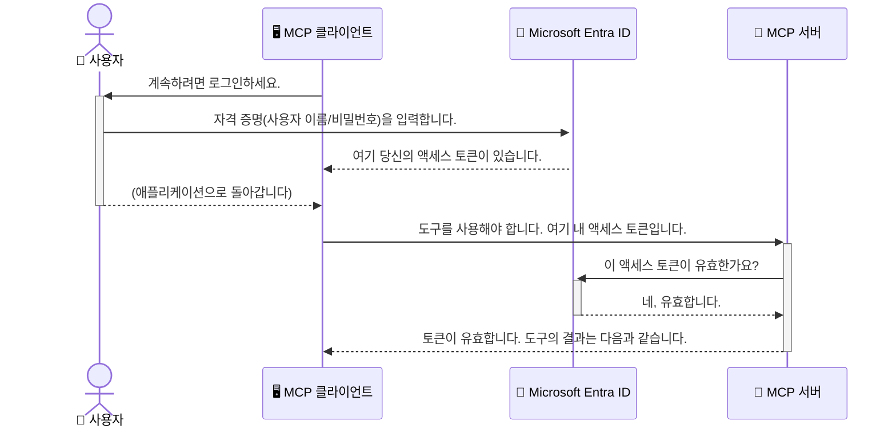

# AI 워크플로 보호: 모델 컨텍스트 프로토콜 서버를 위한 Entra ID 인증

> [!NOTE]
> 이 수업의 원격 서버 코드는 기존의 `/sse` 및 `/message`
> 엔드포인트를 보호하며 MCP `2025-11-25`를 대상으로 합니다. 이들의 아이덴티티 및 토큰 검증
> 방식을 유지하되, 새 구현에서는 `2026-07-28`과 호환되는 Streamable HTTP 전송을 사용하세요.


## 소개
모델 컨텍스트 프로토콜(MCP) 서버를 보호하는 것은 집의 현관문을 잠그는 것만큼 중요합니다. MCP 서버를 개방하면 허가되지 않은 접근으로 도구와 데이터가 노출되어 보안 위협이 발생할 수 있습니다. Microsoft Entra ID는 강력한 클라우드 기반 아이덴티티 및 접근 관리 솔루션을 제공하여 허가된 사용자와 애플리케이션만 MCP 서버와 상호작용할 수 있도록 도와줍니다. 이 섹션에서는 Entra ID 인증을 사용하여 AI 워크플로를 보호하는 방법을 배우게 됩니다.

## 학습 목표
이 섹션을 마치면 다음을 할 수 있습니다:

- MCP 서버 보안의 중요성을 이해한다.
- Microsoft Entra ID 및 OAuth 2.0 인증의 기본 개념을 설명한다.
- 공개 클라이언트와 기밀 클라이언트의 차이를 인식한다.
- 로컬(public client) 및 원격(confidential client) MCP 서버 시나리오에서 Entra ID 인증을 구현한다.
- AI 워크플로 개발 시 보안 모범 사례를 적용한다.

## 보안과 MCP

집의 현관문을 잠그지 않고 두지 않는 것처럼, MCP 서버도 누구나 접근할 수 있게 열어두면 안 됩니다. AI 워크플로 보안은 견고하고 신뢰할 수 있으며 안전한 애플리케이션 구축에 필수적입니다. 이 장에서는 Microsoft Entra ID를 이용해 MCP 서버를 보호하는 방법을 소개하여 허가된 사용자와 애플리케이션만 도구와 데이터에 접근할 수 있도록 합니다.

## MCP 서버 보안이 중요한 이유

MCP 서버가 이메일 발송이나 고객 데이터베이스 접근 등의 도구를 보유하고 있다고 가정해 보십시오. 보안이 되어 있지 않은 서버라면 누구나 그 도구를 사용하여 무단 데이터 접근, 스팸, 기타 악의적 활동을 일으킬 수 있습니다.

인증을 구현함으로써 모든 서버 요청이 사용자 또는 애플리케이션의 신원을 확인하여 요청이 합법적인지 검증하게 됩니다. 이는 AI 워크플로 보호를 위한 첫 번째이자 가장 중요한 단계입니다.

## Microsoft Entra ID 소개

[**Microsoft Entra ID**](https://adoption.microsoft.com/microsoft-security/entra/)는 클라우드 기반 아이덴티티 및 접근 관리 서비스입니다. 이를 여러분 애플리케이션을 위한 만능 보안 경비원으로 생각할 수 있습니다. 사용자 신원 확인(인증)과 권한 부여를 처리하는 복잡한 과정을 담당합니다.

Entra ID를 사용하면 다음을 할 수 있습니다:

- 사용자의 안전한 로그인 기능 활성화.
- API 및 서비스 보호.
- 중앙 집중식으로 접근 정책 관리.

MCP 서버에 대해서는 Entra ID가 누가 서버 기능에 접근할 수 있는지 관리하는 강력하고 널리 신뢰받는 솔루션을 제공합니다.

---

## Entra ID 인증 동작 방식 이해하기

Entra ID는 **OAuth 2.0** 같은 공개 표준을 사용하여 인증을 처리합니다. 자세한 내용은 복잡할 수 있지만, 핵심 개념은 간단하며 비유를 통해 이해할 수 있습니다.

### OAuth 2.0 쉽게 이해하기: 발렛 키

OAuth 2.0을 자동차 발렛 서비스에 비유해 보세요. 식당에 도착했을 때 마스터 키를 주는 대신, 제한된 권한을 가진 <strong>발렛 키</strong>를 줍니다 — 차를 시동 걸고 문을 잠글 수 있지만 트렁크나 글로브박스는 열 수 없습니다.

이 비유에서:

- <strong>당신은</strong> <strong>사용자</strong>입니다.
- **당신의 자동차는** 도구와 데이터를 보유한 <strong>MCP 서버</strong>입니다.
- <strong>발렛은</strong> <strong>Microsoft Entra ID</strong>입니다.
- **주차 요원은** 서버에 접근하려는 **MCP 클라이언트**(애플리케이션)입니다.
- **발렛 키는** <strong>액세스 토큰</strong>입니다.

액세스 토큰은 사용자가 로그인한 후 Entra ID가 MCP 클라이언트에 제공하는 안전한 문자열입니다. 클라이언트는 이 토큰을 모든 요청에 포함해 MCP 서버에 제출합니다. 서버는 토큰을 확인하여 요청이 합법적이고 클라이언트가 필요한 권한을 가졌음을 검증할 수 있으며, 실제 자격 증명(비밀번호 등)을 직접 다룰 필요가 없습니다.

### 인증 흐름

실제 동작 방식은 다음과 같습니다:



### Microsoft 인증 라이브러리(MSAL) 소개

코드 예제로 들어가기 전에 알아야 할 중요한 구성 요소는 <strong>Microsoft 인증 라이브러리(MSAL)</strong>입니다.

MSAL은 마이크로소프트가 개발한 라이브러리로, 개발자가 인증을 쉽게 처리할 수 있도록 도와줍니다. 보안 토큰 처리, 로그인 관리, 세션 갱신 같은 복잡한 작업을 직접 구현하지 않아도 됩니다.

MSAL 사용을 권장하는 이유는:

- **안전함:** 업계 표준 프로토콜과 보안 최선의 관행을 구현하여 코드 내 취약점 위험을 줄여줍니다.
- **개발 간소화:** OAuth 2.0 및 OpenID Connect 프로토콜의 복잡성을 추상화하여 몇 줄의 코드로 강력한 인증 기능을 추가할 수 있습니다.
- **유지 관리:** 마이크로소프트가 적극적으로 MSAL을 유지보수하여 새로운 보안 위협과 플랫폼 변화를 대응합니다.

MSAL은 .NET, JavaScript/TypeScript, Python, Java, Go, iOS, Android 등 다양한 언어와 애플리케이션 프레임워크를 지원하여 전체 기술 스택에서 일관된 인증 패턴을 사용할 수 있습니다.

MSAL에 대해 더 알아보려면 공식 [MSAL 개요 문서](https://learn.microsoft.com/entra/identity-platform/msal-overview)를 확인하세요.

---

## Entra ID로 MCP 서버 보호하기: 단계별 안내

이제 `stdio`를 통해 통신하는 로컬 MCP 서버를 Entra ID로 보호하는 방법을 살펴보겠습니다. 이 예제에서는 사용자의 머신에서 실행되는 데스크톱 앱이나 로컬 개발 서버에 적합한 <strong>공개 클라이언트</strong>를 사용합니다.

### 시나리오 1: 로컬 MCP 서버 보안(공개 클라이언트)

이 시나리오에서는 로컬에서 실행되고 `stdio`로 통신하며, 사용자 인증을 위해 Entra ID를 사용하는 MCP 서버를 살펴봅니다. 서버에는 Microsoft Graph API에서 사용자의 프로필 정보를 가져오는 단일 도구가 있습니다.

#### 1. Entra ID에서 애플리케이션 설정

코드를 작성하기 전에 Microsoft Entra ID에 애플리케이션을 등록해야 합니다. 이렇게 하면 Entra ID가 애플리케이션을 인식하고 인증 서비스를 사용할 권한을 부여합니다.

1. <strong>[Microsoft Entra 포털](https://entra.microsoft.com/)</strong>로 이동합니다.
2. <strong>앱 등록</strong>으로 가서 <strong>새 등록</strong>을 클릭합니다.
3. 애플리케이션 이름을 지정합니다(예: "내 로컬 MCP 서버").
4. <strong>지원되는 계정 유형</strong>은 **이 조직 디렉터리 내 계정만** 선택합니다.
5. 이 예에서는 <strong>리디렉션 URI</strong>를 비워둡니다.
6. <strong>등록</strong>을 클릭합니다.

등록 후, <strong>애플리케이션(클라이언트) ID</strong>와 <strong>디렉터리(테넌트) ID</strong>를 메모하세요. 코드에서 필요합니다.

#### 2. 코드: 주요 부분 설명

인증을 처리하는 코드의 핵심 부분을 살펴봅니다. 전체 코드는 [mcp-auth-servers GitHub 저장소](https://github.com/Azure-Samples/mcp-auth-servers) 내 [Entra ID - Local - WAM](https://github.com/Azure-Samples/mcp-auth-servers/tree/main/src/entra-id-local-wam) 폴더에서 확인할 수 있습니다.

**`AuthenticationService.cs`**

이 클래스는 Entra ID와의 상호작용을 담당합니다.

- **`CreateAsync`**: MSAL(Microsoft Authentication Library)의 `PublicClientApplication`을 초기화합니다. 애플리케이션의 `clientId`와 `tenantId`로 구성합니다.
- **`WithBroker`**: Windows Web Account Manager 같은 브로커 사용을 활성화하여 더 안전하고 원활한 싱글 사인온 경험을 제공합니다.
- **`AcquireTokenAsync`**: 핵심 메서드로, 먼저 토큰을 조용히(silent) 획득하려 시도합니다(유효한 세션이 있으면 사용자가 다시 로그인할 필요 없음). 조용한 토큰 획득이 실패하면 사용자에게 인터랙티브한 로그인 창을 띄웁니다.

```csharp
// Simplified for clarity
public static async Task<AuthenticationService> CreateAsync(ILogger<AuthenticationService> logger)
{
    var msalClient = PublicClientApplicationBuilder
        .Create(_clientId) // Your Application (client) ID
        .WithAuthority(AadAuthorityAudience.AzureAdMyOrg)
        .WithTenantId(_tenantId) // Your Directory (tenant) ID
        .WithBroker(new BrokerOptions(BrokerOptions.OperatingSystems.Windows))
        .Build();

    // ... cache registration ...

    return new AuthenticationService(logger, msalClient);
}

public async Task<string> AcquireTokenAsync()
{
    try
    {
        // Try silent authentication first
        var accounts = await _msalClient.GetAccountsAsync();
        var account = accounts.FirstOrDefault();

        AuthenticationResult? result = null;

        if (account != null)
        {
            result = await _msalClient.AcquireTokenSilent(_scopes, account).ExecuteAsync();
        }
        else
        {
            // If no account, or silent fails, go interactive
            result = await _msalClient.AcquireTokenInteractive(_scopes).ExecuteAsync();
        }

        return result.AccessToken;
    }
    catch (Exception ex)
    {
        _logger.LogError(ex, "An error occurred while acquiring the token.");
        throw; // Optionally rethrow the exception for higher-level handling
    }
}
```

**`Program.cs`**

MCP 서버를 설정하고 인증 서비스를 통합하는 코드입니다.

- **`AddSingleton<AuthenticationService>`**: `AuthenticationService`를 의존성 주입 컨테이너에 등록하여 다른 구성 요소(툴 등)에서 사용할 수 있게 합니다.
- **`GetUserDetailsFromGraph` 도구**: 이 도구는 `AuthenticationService` 인스턴스를 필요로 합니다. 무엇을 하기 전에 `authService.AcquireTokenAsync()`를 호출해 유효한 액세스 토큰을 얻습니다. 인증 성공 시 이 토큰으로 Microsoft Graph API를 호출해 사용자 정보를 가져옵니다.

```csharp
// Simplified for clarity
[McpServerTool(Name = "GetUserDetailsFromGraph")]
public static async Task<string> GetUserDetailsFromGraph(
    AuthenticationService authService)
{
    try
    {
        // This will trigger the authentication flow
        var accessToken = await authService.AcquireTokenAsync();

        // Use the token to create a GraphServiceClient
        var graphClient = new GraphServiceClient(
            new BaseBearerTokenAuthenticationProvider(new TokenProvider(authService)));

        var user = await graphClient.Me.GetAsync();

        return System.Text.Json.JsonSerializer.Serialize(user);
    }
    catch (Exception ex)
    {
        return $"Error: {ex.Message}";
    }
}
```

#### 3. 전체 과정의 작동 방식

1. MCP 클라이언트가 `GetUserDetailsFromGraph` 도구를 사용하려 할 때, 도구가 먼저 `AcquireTokenAsync`를 호출합니다.
2. `AcquireTokenAsync`는 MSAL 라이브러리로 유효한 토큰 있는지 확인합니다.
3. 토큰이 없으면 브로커가 사용자에게 Entra ID 계정으로 로그인하라는 창을 띄웁니다.
4. 로그인 완료 후 Entra ID가 액세스 토큰을 발급합니다.
5. 도구는 토큰을 받고 이를 사용해 Microsoft Graph API에 안전하게 호출합니다.
6. 사용자 정보가 MCP 클라이언트로 반환됩니다.

이 과정은 인증된 사용자만 도구를 사용할 수 있도록 하며, 로컬 MCP 서버를 효과적으로 보호합니다.

### 시나리오 2: 원격 MCP 서버 보안(기밀 클라이언트)

MCP 서버가 원격 머신(예: 클라우드 서버)에서 실행되고 HTTP 스트리밍 방식으로 통신하면 보안 요구 사항이 달라집니다. 이 경우, <strong>기밀 클라이언트</strong>와 <strong>Authorization Code Flow</strong>를 사용해야 합니다. 이 방법은 애플리케이션 비밀이 브라우저에 노출되지 않아 더욱 안전합니다.

이 예제는 Express.js를 사용하는 TypeScript 기반 MCP 서버 예제입니다.

#### 1. Entra ID에서 애플리케이션 설정

설정은 공개 클라이언트와 유사하지만, <strong>클라이언트 비밀</strong>을 생성해야 한다는 점이 중요합니다.

1. <strong>[Microsoft Entra 포털](https://entra.microsoft.com/)</strong>로 이동합니다.
2. 앱 등록에서 **인증서 및 비밀** 탭으로 갑니다.
3. <strong>새 클라이언트 비밀</strong>을 클릭한 뒤 설명을 넣고 <strong>추가</strong>를 클릭합니다.
4. **중요:** 비밀 값은 즉시 복사하세요. 다시는 볼 수 없습니다.
5. <strong>리디렉션 URI</strong>를 구성해야 합니다. <strong>인증</strong> 탭으로 가서 <strong>플랫폼 추가</strong>를 클릭, <strong>웹</strong>을 선택하고 애플리케이션의 리디렉션 URI(예: `http://localhost:3001/auth/callback`)를 입력합니다.

> **⚠️ 중요한 보안 안내:** 프로덕션 환경에서는 클라이언트 비밀 대신 **관리되는 ID** 또는 **워크로드 ID 연합** 같은 **비밀 없는 인증** 방법 사용을 강력히 권장합니다. 클라이언트 비밀은 노출되거나 탈취될 위험이 있습니다. 관리되는 ID는 코드나 구성에서 자격 증명을 저장할 필요 없이 더 안전한 방법입니다.
>
> 관리되는 ID 및 구현 방법에 대해 자세히 알아보려면 [Azure 리소스를 위한 관리되는 ID 개요](https://learn.microsoft.com/entra/identity/managed-identities-azure-resources/overview)를 참고하세요.

#### 2. 코드: 주요 부분 설명

이 예제는 세션 기반 방식을 사용합니다. 사용자가 인증하면 서버가 액세스 토큰과 갱신 토큰을 세션에 저장하고, 사용자에게 세션 토큰을 제공합니다. 이후 요청 시 이 세션 토큰을 사용합니다. 전체 코드는 [mcp-auth-servers GitHub 저장소](https://github.com/Azure-Samples/mcp-auth-servers) 내 [Entra ID - Confidential client](https://github.com/Azure-Samples/mcp-auth-servers/tree/main/src/entra-id-cca-session) 폴더에서 확인할 수 있습니다.

**`Server.ts`**

Express 서버와 MCP 전송 계층을 설정하는 파일입니다.

- **`requireBearerAuth`**: `/sse` 및 `/message` 엔드포인트를 보호하는 미들웨어입니다. 요청의 `Authorization` 헤더에 유효한 베어러 토큰이 있는지 검사합니다.
- **`EntraIdServerAuthProvider`**: `McpServerAuthorizationProvider` 인터페이스를 구현하는 커스텀 클래스입니다. OAuth 2.0 흐름을 처리합니다.
- **`/auth/callback`**: 사용자가 인증한 후 Entra ID가 리디렉트하는 엔드포인트입니다. 권한 코드를 액세스 토큰과 갱신 토큰으로 교환합니다.

```typescript
// 명확성을 위해 단순화됨
const app = express();
const { server } = createServer();
const provider = new EntraIdServerAuthProvider();

// SSE 엔드포인트 보호
app.get("/sse", requireBearerAuth({
  provider,
  requiredScopes: ["User.Read"]
}), async (req, res) => {
  // ... 트랜스포트에 연결 ...
});

// 메시지 엔드포인트 보호
app.post("/message", requireBearerAuth({
  provider,
  requiredScopes: ["User.Read"]
}), async (req, res) => {
  // ... 메시지 처리 ...
});

// OAuth 2.0 콜백 처리
app.get("/auth/callback", (req, res) => {
  provider.handleCallback(req.query.code, req.query.state)
    .then(result => {
      // ... 성공 또는 실패 처리 ...
    });
});
```

**`Tools.ts`**

MCP 서버가 제공하는 도구들을 정의한 파일입니다. `getUserDetails` 도구는 이전 예제와 유사하지만, 세션에서 액세스 토큰을 가져옵니다.

```typescript
// 명확성을 위해 단순화됨
server.setRequestHandler(CallToolRequestSchema, async (request) => {
  const { name } = request.params;
  const context = request.params?.context as { token?: string } | undefined;
  const sessionToken = context?.token;

  if (name === ToolName.GET_USER_DETAILS) {
    if (!sessionToken) {
      throw new AuthenticationError("Authentication token is missing or invalid. Ensure the token is provided in the request context.");
    }

    // 세션 저장소에서 Entra ID 토큰 가져오기
    const tokenData = tokenStore.getToken(sessionToken);
    const entraIdToken = tokenData.accessToken;

    const graphClient = Client.init({
      authProvider: (done) => {
        done(null, entraIdToken);
      }
    });

    const user = await graphClient.api('/me').get();

    // ... 사용자 세부 정보 반환 ...
  }
});
```

**`auth/EntraIdServerAuthProvider.ts`**

이 클래스는 다음 작업을 처리합니다:

- 사용자를 Entra ID 로그인 페이지로 리디렉션.
- 권한 코드를 액세스 토큰으로 교환.
- `tokenStore`에 토큰 저장.
- 토큰 만료 시 액세스 토큰 갱신.


#### 3. 모든 것이 함께 작동하는 방식

1. 사용자가 처음으로 MCP 서버에 연결하려고 하면, `requireBearerAuth` 미들웨어가 유효한 세션이 없음을 감지하고 Entra ID 로그인 페이지로 리디렉션합니다.
2. 사용자는 자신의 Entra ID 계정으로 로그인합니다.
3. Entra ID가 사용자에게 권한 부여 코드를 포함한 `/auth/callback` 엔드포인트로 다시 리디렉션합니다.
4. 서버는 코드를 액세스 토큰과 갱신 토큰으로 교환한 후 이를 저장하고 세션 토큰을 생성하여 클라이언트에 전송합니다.
5. 클라이언트는 이제 이 세션 토큰을 모든 향후 요청의 `Authorization` 헤더에 사용하여 MCP 서버에 요청할 수 있습니다.
6. `getUserDetails` 도구가 호출되면, 세션 토큰을 사용해 Entra ID 액세스 토큰을 조회하고, 이를 이용해 Microsoft Graph API를 호출합니다.

이 흐름은 공개 클라이언트 흐름보다 복잡하지만, 인터넷에 노출된 엔드포인트에는 필수적입니다. 원격 MCP 서버는 공용 인터넷을 통해 접근 가능하기 때문에 무단 액세스와 잠재적 공격으로부터 보호하기 위한 더 강력한 보안 조치가 필요합니다.


## 보안 권장 사항

- **항상 HTTPS 사용**: 클라이언트와 서버 간 통신을 암호화하여 토큰이 가로채이는 것을 방지합니다.
- **역할 기반 액세스 제어(RBAC) 구현**: 사용자가 인증되었는지 여부만 확인하지 말고, 무엇을 할 수 있는지도 확인하세요. Entra ID에서 역할을 정의하고 MCP 서버에서 이를 검사할 수 있습니다.
- **모니터링 및 감사**: 모든 인증 이벤트를 기록하여 의심스러운 활동을 탐지하고 대응할 수 있도록 합니다.
- **속도 제한 및 제한 처리**: Microsoft Graph 등 API는 남용 방지를 위해 속도 제한을 구현합니다. MCP 서버에서 지수 백오프 및 재시도 로직을 구현해 HTTP 429(요청 과다) 응답을 우아하게 처리하세요. 자주 접근하는 데이터를 캐싱해 API 호출을 줄이는 방법도 고려하세요.
- **토큰 보안 저장**: 액세스 토큰과 갱신 토큰을 안전하게 저장하세요. 로컬 애플리케이션은 시스템의 보안 저장소를 사용하고, 서버 애플리케이션은 암호화된 저장소나 Azure Key Vault 같은 안전한 키 관리 서비스를 사용하는 것이 좋습니다.
- **토큰 만료 처리**: 액세스 토큰은 수명이 제한적입니다. 갱신 토큰을 사용해 자동 토큰 갱신을 구현하여 다시 인증을 요구하지 않고도 원활한 사용자 경험을 유지하세요.
- **Azure API Management 사용 고려**: MCP 서버 내에서 직접 보안을 구현하는 것도 세밀한 제어를 제공하지만, Azure API Management 같은 API 게이트웨이는 인증, 권한 부여, 속도 제한, 모니터링 등 많은 보안 문제를 자동으로 처리해 줍니다. 이들은 클라이언트와 MCP 서버 사이에 중앙 집중식 보안 계층을 제공합니다. MCP와 API 게이트웨이 사용에 관한 자세한 내용은 [Azure API Management Your Auth Gateway For MCP Servers](https://techcommunity.microsoft.com/blog/integrationsonazureblog/azure-api-management-your-auth-gateway-for-mcp-servers/4402690)를 참조하세요.


## 주요 내용 요약

- MCP 서버를 안전하게 보호하는 것은 데이터와 도구를 지키는 데 매우 중요합니다.
- Microsoft Entra ID는 인증 및 권한 부여를 위한 강력하고 확장 가능한 솔루션을 제공합니다.
- 로컬 애플리케이션에는 **공개 클라이언트**, 원격 서버에는 <strong>비밀 클라이언트</strong>를 사용하세요.
- <strong>권한 부여 코드 흐름</strong>은 웹 애플리케이션에 가장 안전한 옵션입니다.


## 실습 과제

1. 본인이 구축할 MCP 서버가 로컬 서버인지 원격 서버인지 생각해 보세요.
2. 답변에 따라 공개 클라이언트 또는 비밀 클라이언트를 사용할 것인지 결정하세요.
3. MCP 서버가 Microsoft Graph에 대해 작업 수행 시 요청할 권한은 무엇인지 생각해 보세요.


## 실습

### 실습 1: Entra ID에서 애플리케이션 등록
Microsoft Entra 포털에 접속하세요.
MCP 서버용 새 애플리케이션을 등록하세요.
애플리케이션(클라이언트) ID와 디렉터리(테넌트) ID를 기록하세요.

### 실습 2: 로컬 MCP 서버 보안 설정 (공개 클라이언트)
- MSAL(Microsoft Authentication Library)을 통합하여 사용자 인증을 구현하는 코드 예제를 따라하세요.
- Microsoft Graph에서 사용자 세부 정보를 가져오는 MCP 도구를 호출해 인증 흐름을 테스트하세요.

### 실습 3: 원격 MCP 서버 보안 설정 (비밀 클라이언트)
- Entra ID에 비밀 클라이언트를 등록하고 클라이언트 비밀을 생성하세요.
- Express.js MCP 서버를 권한 부여 코드 흐름을 사용하도록 구성하세요.
- 보호된 엔드포인트를 테스트하고 토큰 기반 접근을 확인하세요.

### 실습 4: 보안 권장 사항 적용
- 로컬 또는 원격 서버에 HTTPS를 활성화하세요.
- 서버 로직에 역할 기반 액세스 제어(RBAC)를 구현하세요.
- 토큰 만료 처리와 안전한 토큰 저장도 추가하세요.

## 참고 자료

1. **MSAL 개요 문서**  
   Microsoft 인증 라이브러리(MSAL)가 어떻게 다양한 플랫폼에서 안전한 토큰 획득을 지원하는지 알아보세요:  
   [MSAL Overview on Microsoft Learn](https://learn.microsoft.com/en-gb/entra/msal/overview)

2. **Azure-Samples/mcp-auth-servers GitHub 저장소**  
   인증 흐름을 보여주는 MCP 서버 참조 구현입니다:  
   [Azure-Samples/mcp-auth-servers on GitHub](https://github.com/Azure-Samples/mcp-auth-servers)

3. **Azure 리소스용 관리형 ID 개요**  
   시스템 또는 사용자 할당 관리형 ID를 사용하여 비밀을 제거하는 방법을 이해하세요:  
   [Managed Identities Overview on Microsoft Learn](https://learn.microsoft.com/en-us/entra/identity/managed-identities-azure-resources/)

4. **Azure API Management: MCP 서버용 인증 게이트웨이**  
   MCP 서버를 위한 안전한 OAuth2 게이트웨이로서 APIM 사용에 대한 심층 분석:  
   [Azure API Management Your Auth Gateway For MCP Servers](https://techcommunity.microsoft.com/blog/integrationsonazureblog/azure-api-management-your-auth-gateway-for-mcp-servers/4402690)

5. **Microsoft Graph 권한 참조**  
   Microsoft Graph의 위임 및 애플리케이션 권한에 대한 포괄적인 목록:  
   [Microsoft Graph Permissions Reference](https://learn.microsoft.com/zh-tw/graph/permissions-reference)


## 학습 결과
이 섹션을 완료하면 다음을 수행할 수 있습니다:

- MCP 서버와 AI 워크플로우에 인증이 중요한 이유를 설명할 수 있습니다.
- 로컬 및 원격 MCP 서버 시나리오 모두에서 Entra ID 인증을 설정하고 구성할 수 있습니다.
- 서버 배포에 따라 적절한 클라이언트 유형(공개 또는 비밀)을 선택할 수 있습니다.
- 토큰 저장 및 역할 기반 권한 부여를 포함해 안전한 코딩 관행을 구현할 수 있습니다.
- 무단 액세스로부터 MCP 서버와 도구를 자신 있게 보호할 수 있습니다.

## 다음 단계

- [5.13 Microsoft Foundry와 MCP 통합](../mcp-foundry-agent-integration/README.md)

---

<!-- CO-OP TRANSLATOR DISCLAIMER START -->
**면책 조항**:
이 문서는 AI 번역 서비스 [Co-op Translator](https://github.com/Azure/co-op-translator)를 사용하여 번역되었습니다. 정확성을 기하기 위해 노력하고 있으나, 자동 번역은 오류나 부정확한 부분이 있을 수 있음을 유의하시기 바랍니다. 원본 문서의 원어본이 권위 있는 자료로 간주되어야 합니다. 중요한 정보의 경우, 전문가의 인간 번역을 권장합니다. 이 번역 사용으로 인해 발생하는 오해나 잘못된 해석에 대해 당사는 책임을 지지 않습니다.
<!-- CO-OP TRANSLATOR DISCLAIMER END -->