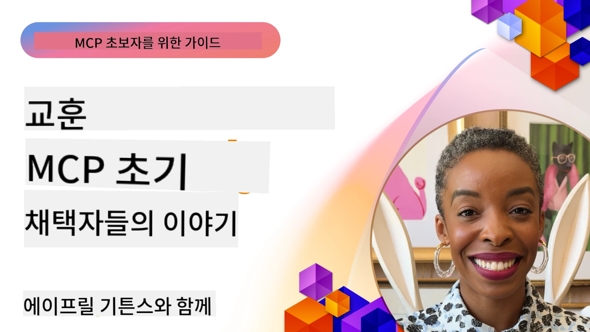

# 🌟 초기 도입자들의 교훈

[](https://youtu.be/jds7dSmNptE)

_(위 이미지를 클릭하여 이 수업의 비디오를 시청하세요)_

## 🎯 이 모듈에서 다루는 내용

이 모듈은 실제 조직과 개발자들이 모델 컨텍스트 프로토콜(MCP)을 활용하여 실제 문제를 해결하고 혁신을 주도하는 방법을 탐구합니다. 상세한 사례 연구, 실습 프로젝트 및 실제 예제를 통해 MCP가 언어 모델, 도구 및 기업 데이터를 연결하는 안전하고 확장 가능한 AI 통합을 어떻게 가능하게 하는지 알게 됩니다.

### 📚 MCP 실전 적용 보기

이러한 원칙이 실제 운영 가능한 도구에 어떻게 적용되는지 보고 싶나요? 오늘 바로 사용할 수 있는 실제 Microsoft MCP 서버를 소개하는 [**10개의 Microsoft MCP 서버: 개발자 생산성 혁신 사례**](microsoft-mcp-servers.md)를 확인해 보세요.

## 개요

이 수업은 초기 도입자들이 모델 컨텍스트 프로토콜(MCP)을 활용하여 산업 전반에 걸쳐 실제 과제를 해결하고 혁신을 주도한 방법을 탐구합니다. 상세 사례 연구와 실습 프로젝트를 통해 MCP가 표준화되고 안전하며 확장 가능한 AI 통합을 가능하게 하여 대형 언어 모델, 도구, 엔터프라이즈 데이터를 통합 프레임워크로 연결하는 방법을 확인할 수 있습니다. MCP 기반 솔루션 설계 및 구축에 대한 실무 경험을 얻고, 입증된 구현 패턴을 배우며, 프로덕션 환경에서 MCP 배포를 위한 모범 사례를 발견할 수 있습니다. 또한 신흥 동향, 향후 방향성, 오픈 소스 자원을 강조하여 MCP 기술 및 진화하는 생태계의 최전선에 머무를 수 있도록 합니다.

## 학습 목표

- 다양한 산업에서의 실제 MCP 구현 분석
- 완전한 MCP 기반 애플리케이션 설계 및 구축
- MCP 기술의 신흥 동향 및 미래 방향 탐색
- 실제 개발 시나리오에 모범 사례 적용

## 실제 MCP 구현 사례

### 사례 연구 1: 기업 고객 지원 자동화

다국적 기업이 MCP 기반 솔루션을 구현하여 고객 지원 시스템 전반의 AI 상호작용을 표준화했습니다. 이를 통해 다음을 실현했습니다.

- 다수 LLM 제공업체에 대한 통합 인터페이스 생성
- 부서 간 일관된 프롬프트 관리 유지
- 강력한 보안 및 컴플라이언스 제어 구현
- 특정 요구에 따라 다양한 AI 모델 간 손쉬운 전환

**기술적 구현:**

```python
# 고객 지원을 위한 Python MCP 서버 구현
import logging
import asyncio
from modelcontextprotocol import create_server, ServerConfig
from modelcontextprotocol.server import MCPServer
from modelcontextprotocol.transports import create_http_transport
from modelcontextprotocol.resources import ResourceDefinition
from modelcontextprotocol.prompts import PromptDefinition
from modelcontextprotocol.tool import ToolDefinition

# 로깅 구성
logging.basicConfig(level=logging.INFO)

async def main():
    # 서버 구성 생성
    config = ServerConfig(
        name="Enterprise Customer Support Server",
        version="1.0.0",
        description="MCP server for handling customer support inquiries"
    )
    
    # MCP 서버 초기화
    server = create_server(config)
    
    # 지식 베이스 리소스 등록
    server.resources.register(
        ResourceDefinition(
            name="customer_kb",
            description="Customer knowledge base documentation"
        ),
        lambda params: get_customer_documentation(params)
    )
    
    # 프롬프트 템플릿 등록
    server.prompts.register(
        PromptDefinition(
            name="support_template",
            description="Templates for customer support responses"
        ),
        lambda params: get_support_templates(params)
    )
    
    # 지원 도구 등록
    server.tools.register(
        ToolDefinition(
            name="ticketing",
            description="Create and update support tickets"
        ),
        handle_ticketing_operations
    )
    
    # HTTP 전송으로 서버 시작
    transport = create_http_transport(port=8080)
    await server.run(transport)

if __name__ == "__main__":
    asyncio.run(main())
```

**결과:** 모델 비용 30% 절감, 응답 일관성 45% 향상, 글로벌 운영 전반 컴플라이언스 강화.

### 사례 연구 2: 의료 진단 보조 시스템

한 의료 기관이 MCP 인프라를 개발하여 여러 전문 의료 AI 모델을 통합하면서 민감한 환자 데이터 보호를 보장했습니다:

- 일반 및 전문 의료 모델 간 무결점 전환
- 엄격한 개인정보 보호 제어 및 감사지원
- 기존 전자의무기록(EHR) 시스템과 통합
- 의료 용어에 일관된 프롬프트 엔지니어링 적용

**기술적 구현:**

```csharp
// C# MCP host application implementation in healthcare application
using Microsoft.Extensions.DependencyInjection;
using ModelContextProtocol.SDK.Client;
using ModelContextProtocol.SDK.Security;
using ModelContextProtocol.SDK.Resources;

public class DiagnosticAssistant
{
    private readonly MCPHostClient _mcpClient;
    private readonly PatientContext _patientContext;
    
    public DiagnosticAssistant(PatientContext patientContext)
    {
        _patientContext = patientContext;
        
        // Configure MCP client with healthcare-specific settings
        var clientOptions = new ClientOptions
        {
            Name = "Healthcare Diagnostic Assistant",
            Version = "1.0.0",
            Security = new SecurityOptions
            {
                Encryption = EncryptionLevel.Medical,
                AuditEnabled = true
            }
        };
        
        _mcpClient = new MCPHostClientBuilder()
            .WithOptions(clientOptions)
            .WithTransport(new HttpTransport("https://healthcare-mcp.example.org"))
            .WithAuthentication(new HIPAACompliantAuthProvider())
            .Build();
    }
    
    public async Task<DiagnosticSuggestion> GetDiagnosticAssistance(
        string symptoms, string patientHistory)
    {
        // Create request with appropriate resources and tool access
        var resourceRequest = new ResourceRequest
        {
            Name = "patient_records",
            Parameters = new Dictionary<string, object>
            {
                ["patientId"] = _patientContext.PatientId,
                ["requestingProvider"] = _patientContext.ProviderId
            }
        };
        
        // Request diagnostic assistance using appropriate prompt
        var response = await _mcpClient.SendPromptRequestAsync(
            promptName: "diagnostic_assistance",
            parameters: new Dictionary<string, object>
            {
                ["symptoms"] = symptoms,
                patientHistory = patientHistory,
                relevantGuidelines = _patientContext.GetRelevantGuidelines()
            });
            
        return DiagnosticSuggestion.FromMCPResponse(response);
    }
}
```

**결과:** 의사의 진단 제안이 개선되면서 HIPAA 완전 준수 유지, 시스템 간 문맥 전환 대폭 감소.

### 사례 연구 3: 금융 서비스 리스크 분석

한 금융기관이 MCP를 도입해 부서별 리스크 분석 프로세스를 표준화했습니다:

- 신용 리스크, 사기 탐지, 투자 리스크 모델에 대한 통합 인터페이스 생성
- 엄격한 접근 제어 및 모델 버전 관리 구현
- 모든 AI 권고 사항에 대한 감사 가능성 보장
- 다양한 시스템 간 일관된 데이터 포맷 유지

**기술적 구현:**

```java
// 금융 위험 평가를 위한 자바 MCP 서버
import org.mcp.server.*;
import org.mcp.security.*;

public class FinancialRiskMCPServer {
    public static void main(String[] args) {
        // 금융 준수 기능을 갖춘 MCP 서버 생성
        MCPServer server = new MCPServerBuilder()
            .withModelProviders(
                new ModelProvider("risk-assessment-primary", new AzureOpenAIProvider()),
                new ModelProvider("risk-assessment-audit", new LocalLlamaProvider())
            )
            .withPromptTemplateDirectory("./compliance/templates")
            .withAccessControls(new SOCCompliantAccessControl())
            .withDataEncryption(EncryptionStandard.FINANCIAL_GRADE)
            .withVersionControl(true)
            .withAuditLogging(new DatabaseAuditLogger())
            .build();
            
        server.addRequestValidator(new FinancialDataValidator());
        server.addResponseFilter(new PII_RedactionFilter());
        
        server.start(9000);
        
        System.out.println("Financial Risk MCP Server running on port 9000");
    }
}
```

**결과:** 규제 준수 강화, 모델 배포 주기 40% 단축, 부서 간 리스크 평가 일관성 향상.

### 사례 연구 4: Microsoft Playwright MCP 서버 브라우저 자동화

Microsoft는 모델 컨텍스트 프로토콜을 통해 안전하고 표준화된 브라우저 자동화를 가능하게 하는 [Playwright MCP 서버](https://github.com/microsoft/playwright-mcp)를 개발했습니다. 이 프로덕션 준비 서버는 AI 에이전트 및 LLM이 제어 가능하고 감시 가능한 방식으로 웹 브라우저와 상호작용할 수 있도록 하여 자동화 웹 테스트, 데이터 추출, 엔드 투 엔드 워크플로우 같은 활용 사례를 지원합니다.

> **🎯 프로덕션 준비 도구**
> 
> 이 사례 연구는 오늘 바로 사용할 수 있는 실제 MCP 서버를 보여줍니다! Playwright MCP 서버 및 기타 9개의 프로덕션 준비 Microsoft MCP 서버에 대해 자세히 알아보려면 [**Microsoft MCP 서버 가이드**](microsoft-mcp-servers.md#8--playwright-mcp-server)를 참고하세요.

**주요 기능:**
- MCP 도구로서 브라우저 자동화 기능(내비게이션, 폼 작성, 스크린샷 캡처 등)을 노출
- 무단 행위 방지를 위한 엄격한 접근 제어 및 샌드박싱 구현
- 모든 브라우저 상호작용에 대한 자세한 감사 로그 제공
- Azure OpenAI 및 기타 LLM 공급자와의 통합 지원으로 에이전트 기반 자동화 지원
- GitHub Copilot 코딩 에이전트에 웹 브라우징 기능 제공

**기술적 구현:**

```typescript
// TypeScript: MCP 서버에 Playwright 브라우저 자동화 도구 등록
import { createServer, ToolDefinition } from 'modelcontextprotocol';
import { launch } from 'playwright';

const server = createServer({
  name: 'Playwright MCP Server',
  version: '1.0.0',
  description: 'MCP server for browser automation using Playwright'
});

// URL로 이동하고 스크린샷을 캡처하는 도구 등록
server.tools.register(
  new ToolDefinition({
    name: 'navigate_and_screenshot',
    description: 'Navigate to a URL and capture a screenshot',
    parameters: {
      url: { type: 'string', description: 'The URL to visit' }
    }
  }),
  async ({ url }) => {
    const browser = await launch();
    const page = await browser.newPage();
    await page.goto(url);
    const screenshot = await page.screenshot();
    await browser.close();
    return { screenshot };
  }
);

// MCP 서버 시작
server.listen(8080);
```

**결과:**

- AI 에이전트 및 LLM용 안전하고 프로그래밍 가능한 브라우저 자동화 구현
- 수동 테스트 노력 감소 및 웹 애플리케이션 테스트 범위 개선
- 엔터프라이즈 환경용 브라우저 기반 도구 통합을 위한 재사용 가능하고 확장 가능한 프레임워크 제공
- GitHub Copilot의 웹 브라우징 기능 지원

**참고자료:**

- [Playwright MCP Server GitHub 저장소](https://github.com/microsoft/playwright-mcp)
- [Microsoft AI 및 자동화 솔루션](https://azure.microsoft.com/en-us/products/ai-services/)

### 사례 연구 5: Azure MCP – 엔터프라이즈급 모델 컨텍스트 프로토콜 서비스

Azure MCP Server ([https://aka.ms/azmcp](https://aka.ms/azmcp))는 Microsoft의 관리형 엔터프라이즈급 모델 컨텍스트 프로토콜 구현으로, 확장 가능하고 안전하며 규정을 준수하는 MCP 서버 기능을 클라우드 서비스로 제공합니다. Azure MCP를 통해 조직들은 MCP 서버를 신속히 배포, 관리, Azure AI, 데이터, 보안 서비스와 통합해 운영 부담을 줄이고 AI 도입 속도를 높일 수 있습니다.

> **🎯 프로덕션 준비 도구**
> 
> 오늘 바로 사용할 수 있는 실제 MCP 서버입니다! Microsoft Foundry MCP 서버에 대해 자세히 알아보려면 [**Microsoft MCP 서버 가이드**](microsoft-mcp-servers.md)를 참고하세요.


- 완전 관리형 MCP 서버 호스팅 제공, 내장된 확장성, 모니터링 및 보안 포함
- Azure OpenAI, Azure AI Search 등 Azure 서비스와 네이티브 통합 지원
- Microsoft Entra ID를 통한 엔터프라이즈 인증 및 권한 부여
- 맞춤 도구, 프롬프트 템플릿, 리소스 커넥터 지원
- 엔터프라이즈 보안 및 규제 요건 준수 보장

**기술적 구현:**

```yaml
# Example: Azure MCP server deployment configuration (YAML)
apiVersion: mcp.microsoft.com/v1
kind: McpServer
metadata:
  name: enterprise-mcp-server
spec:
  modelProviders:
    - name: azure-openai
      type: AzureOpenAI
      endpoint: https://<your-openai-resource>.openai.azure.com/
      apiKeySecret: <your-azure-keyvault-secret>
  tools:
    - name: document_search
      type: AzureAISearch
      endpoint: https://<your-search-resource>.search.windows.net/
      apiKeySecret: <your-azure-keyvault-secret>
  authentication:
    type: EntraID
    tenantId: <your-tenant-id>
  monitoring:
    enabled: true
    logAnalyticsWorkspace: <your-log-analytics-id>
```

**결과:**  
- 즉시 사용 가능한 규정 준수 MCP 서버 플랫폼 제공으로 엔터프라이즈 AI 프로젝트의 가치 창출 시간 단축
- LLM, 도구, 기업 데이터 소스 통합 단순화
- MCP 작업 부하에 대한 보안, 가시성, 운영 효율성 강화
- Azure SDK 모범 사례 및 최신 인증 패턴 적용으로 코드 품질 향상

**참고자료:**  
- [Azure MCP 문서](https://aka.ms/azmcp)
- [Azure MCP Server GitHub 저장소](https://github.com/Azure/azure-mcp)
- [Azure AI 서비스](https://azure.microsoft.com/en-us/products/ai-services/)
- [Microsoft MCP 센터](https://mcp.azure.com)

## 사례 연구 6: NLWeb 
MCP(모델 컨텍스트 프로토콜)는 챗봇과 AI 비서가 도구와 상호작용하는 신흥 프로토콜입니다. 모든 NLWeb 인스턴스는 MCP 서버이기도 하며, 자연어로 웹사이트에 질문할 때 사용하는 주된 방법인 ask를 지원합니다. 반환되는 응답은 웹 데이터를 묘사하기 위해 널리 쓰이는 어휘인 schema.org를 활용합니다. 느슨하게 말하면, MCP는 NLWeb이 Http에 대응하는 HTML과 같습니다. NLWeb은 프로토콜, Schema.org 형식, 샘플 코드를 결합해 사이트가 이러한 엔드포인트를 신속히 생성하도록 돕습니다. 이를 통해 인간은 대화형 인터페이스로, 기계는 자연스러운 에이전트 간 상호작용으로 혜택을 받습니다.

NLWeb은 두 가지 별개의 구성 요소로 이루어져 있습니다.
- 자연어로 사이트와 인터페이스하기 위한 매우 단순한 프로토콜과 반환 답변에 json 및 schema.org를 활용하는 포맷이 있습니다. 자세한 내용은 REST API 문서를 참고하세요.
- (1)을 활용한 직관적인 구현체로, 제품, 레시피, 명소, 리뷰 등 항목 목록으로 추상화할 수 있는 사이트를 위해 설계되었습니다. 사용자 인터페이스 위젯세트와 함께 사이트가 콘텐츠에 대해 대화형 인터페이스를 쉽게 제공할 수 있습니다. 작동 방식에 대한 자세한 내용은 Life of a chat query 문서를 확인하세요.
 
**참고자료:**  
- [Azure MCP 문서](https://aka.ms/azmcp)
- [NLWeb](https://github.com/microsoft/NlWeb)

### 사례 연구 7: Microsoft Foundry MCP 서버 – 엔터프라이즈 AI 에이전트 통합

Microsoft Foundry MCP 서버는 MCP를 통해 엔터프라이즈 환경에서 AI 에이전트와 워크플로우를 조직하고 관리하는 방법을 보여줍니다. MCP를 Microsoft Foundry와 통합함으로써 조직은 에이전트 상호작용 표준화, Foundry의 워크플로우 관리 활용, 안전하고 확장 가능한 배포 환경 확보가 가능합니다.

> **🎯 프로덕션 준비 도구**
> 
> 오늘 바로 사용할 수 있는 실제 MCP 서버입니다! Microsoft Foundry MCP 서버에 대해 자세히 알아보려면 [**Microsoft MCP 서버 가이드**](microsoft-mcp-servers.md#9--microsoft-foundry-mcp-server)를 참고하세요.

**주요 기능:**
- 모델 카탈로그 및 배포 관리 등 Azure AI 생태계에 대한 포괄적 접근
- RAG 애플리케이션을 위한 Azure AI Search 지식 색인화
- AI 모델 성능 및 품질 보증을 위한 평가 도구
- 최첨단 연구 모델을 위한 Microsoft Foundry Catalog 및 Labs와 통합
- 프로덕션 시나리오용 에이전트 관리 및 평가 기능

**결과:**
- AI 에이전트 워크플로우의 신속한 프로토타입 제작과 견고한 모니터링
- 고급 시나리오용 Azure AI 서비스와의 매끄러운 통합
- 에이전트 파이프라인 구축, 배포 및 모니터링을 위한 통합 인터페이스
- 기업에 대한 보안, 규정 준수 및 운영 효율성 향상
- 복잡한 에이전트 기반 프로세스에 대한 제어를 유지하면서 AI 도입 가속화

**참고자료:**
- [Microsoft Foundry MCP Server GitHub 저장소](https://github.com/azure-ai-foundry/mcp-foundry)
- [MCP와 Azure AI 에이전트 통합 (Microsoft Foundry 블로그)](https://devblogs.microsoft.com/foundry/integrating-azure-ai-agents-mcp/)

### 사례 연구 8: Foundry MCP Playground – 실험 및 프로토타이핑

Foundry MCP Playground는 MCP 서버와 Microsoft Foundry 통합을 실험하기 위한 즉시 사용 가능한 환경을 제공합니다. 개발자는 Microsoft Foundry 카탈로그 및 Labs의 자원을 활용해 AI 모델과 에이전트 워크플로우를 신속히 프로토타입, 테스트, 평가할 수 있습니다. 이 플레이그라운드는 설정을 간소화하고 샘플 프로젝트를 제공하며 협업 개발을 지원하여 복잡한 인프라 없이도 새로운 시나리오와 모범 사례를 탐구할 수 있게 합니다. 진입 장벽을 낮춤으로써 MCP 및 Microsoft Foundry 생태계 내 혁신과 커뮤니티 기여를 촉진하는 데 특히 유용합니다.

**참고자료:**

- [Foundry MCP Playground GitHub 저장소](https://github.com/azure-ai-foundry/foundry-mcp-playground)

### 사례 연구 9: Microsoft Learn Docs MCP 서버 – AI 기반 문서 접근

Microsoft Learn Docs MCP 서버는 모델 컨텍스트 프로토콜을 통해 AI 비서가 공식 Microsoft 문서에 실시간으로 접근할 수 있도록 하는 클라우드 호스팅 서비스입니다. 이 프로덕션 준비 서버는 포괄적인 Microsoft Learn 생태계와 연결되며 공식 Microsoft 소스 전반에 걸친 의미 기반 검색을 가능하게 합니다.

> **🎯 프로덕션 준비 도구**
> 
> 오늘 바로 사용할 수 있는 실제 MCP 서버입니다! Microsoft Learn Docs MCP 서버에 대해 자세히 알아보려면 [**Microsoft MCP 서버 가이드**](microsoft-mcp-servers.md#1--microsoft-learn-docs-mcp-server)를 참고하세요.

**주요 기능:**
- 공식 Microsoft 문서, Azure 문서 및 Microsoft 365 문서에 대한 실시간 접근 제공
- 문맥과 의도를 이해하는 고급 의미 검색 기능
- Microsoft Learn 콘텐츠가 발행될 때마다 항상 최신 정보 유지
- Microsoft Learn, Azure 문서, Microsoft 365 소스를 포괄적으로 지원
- 문서 제목과 URL이 포함된 최대 10개의 고품질 콘텐츠 청크 반환

**중요성:**
- Microsoft 기술에 대한 '오래된 AI 지식' 문제 해결
- AI 비서가 최신 .NET, C#, Azure 및 Microsoft 365 기능에 접근할 수 있도록 보장
- 정확한 코드 생성을 위한 권위 있는 1차 정보 제공
- 빠르게 진화하는 Microsoft 기술을 사용하는 개발자에게 필수

**결과:**
- Microsoft 기술에 대한 AI 생성 코드의 정확도 크게 향상
- 최신 문서 및 모범 사례 검색에 소요되는 시간 단축
- 문맥 인식형 문서 검색으로 개발자 생산성 향상
- IDE를 떠나지 않고도 개발 워크플로우와 원활하게 통합

**참고자료:**
- [Microsoft Learn Docs MCP 서버 GitHub 저장소](https://github.com/MicrosoftDocs/mcp)
- [Microsoft Learn 문서](https://learn.microsoft.com/)

## 실습 프로젝트

### 프로젝트 1: 다중 공급자 MCP 서버 구축

**목표:** 특정 기준에 따라 여러 AI 모델 공급자로 요청을 라우팅할 수 있는 MCP 서버를 만듭니다.

**요구사항:**

- 최소 세 개 이상의 모델 공급자 지원(예: OpenAI, Anthropic, 로컬 모델)
- 요청 메타데이터에 기반한 라우팅 메커니즘 구현
- 공급자 자격 증명 관리를 위한 구성 시스템 작성
- 성능 및 비용 최적화를 위한 캐싱 추가
- 사용 현황 모니터링용 간단한 대시보드 구축

**구현 단계:**

1. 기본 MCP 서버 인프라 구축
2. 각 AI 모델 서비스용 공급자 어댑터 구현
3. 요청 속성에 따른 라우팅 로직 작성
4. 빈번한 요청을 위한 캐싱 메커니즘 추가
5. 모니터링 대시보드 개발
6. 다양한 요청 패턴으로 테스트 수행

**기술:** Python(.NET/Java/Python 중 선호하는 언어 사용), Redis 캐싱, 대시보드용 간단한 웹 프레임워크.

### 프로젝트 2: 기업용 프롬프트 관리 시스템

**목표:** 조직 전체에서 프롬프트 템플릿을 관리, 버전 관리 및 배포하는 MCP 기반 시스템을 개발합니다.

**요구사항:**


- 프롬프트 템플릿을 위한 중앙 집중식 저장소 생성
- 버전 관리 및 승인 워크플로우 구현
- 샘플 입력을 활용한 템플릿 테스트 기능 구축
- 역할 기반 접근 제어 개발
- 템플릿 검색 및 배포를 위한 API 생성

**구현 단계:**

1. 템플릿 저장용 데이터베이스 스키마 설계
2. 템플릿 CRUD 작업을 위한 핵심 API 생성
3. 버전 관리 시스템 구현
4. 승인 워크플로우 구축
5. 테스트 프레임워크 개발
6. 관리용 간단한 웹 인터페이스 생성
7. MCP 서버와 통합

**기술:** 원하는 백엔드 프레임워크, SQL 또는 NoSQL 데이터베이스, 관리 인터페이스용 프론트엔드 프레임워크.

### 프로젝트 3: MCP 기반 콘텐츠 생성 플랫폼

**목표:** MCP를 활용하여 다양한 콘텐츠 유형에서 일관된 결과를 제공하는 콘텐츠 생성 플랫폼 구축.

**요구사항:**

- 여러 콘텐츠 형식 지원 (블로그 게시물, 소셜 미디어, 마케팅 카피)
- 커스터마이징 옵션이 포함된 템플릿 기반 생성 구현
- 콘텐츠 검토 및 피드백 시스템 생성
- 콘텐츠 성과 지표 추적
- 콘텐츠 버전 관리 및 반복 지원

**구현 단계:**

1. MCP 클라이언트 인프라 설정
2. 다양한 콘텐츠 유형에 맞는 템플릿 생성
3. 콘텐츠 생성 파이프라인 구축
4. 검토 시스템 구현
5. 지표 추적 시스템 개발
6. 템플릿 관리 및 콘텐츠 생성을 위한 사용자 인터페이스 생성

**기술:** 선호하는 프로그래밍 언어, 웹 프레임워크, 데이터베이스 시스템.

## MCP 기술의 미래 방향

### 신흥 동향

1. **멀티모달 MCP**
   - 이미지, 오디오, 비디오 모델과의 상호작용 표준화를 위한 MCP 확장
   - 교차 모달 추론 능력 개발
   - 다양한 모달리티에 대한 표준화된 프롬프트 형식

2. **연합 MCP 인프라**
   - 조직 간 자원 공유가 가능한 분산형 MCP 네트워크
   - 안전한 모델 공유를 위한 표준화된 프로토콜
   - 개인정보 보호 계산 기법

3. **MCP 마켓플레이스**
   - MCP 템플릿 및 플러그인 공유 및 수익화를 위한 생태계
   - 품질 보증 및 인증 절차
   - 모델 마켓플레이스와의 통합

4. **엣지 컴퓨팅용 MCP**
   - 자원이 제한된 엣지 장치를 위한 MCP 표준 적응
   - 저대역폭 환경에 최적화된 프로토콜
   - IoT 생태계에 특화된 MCP 구현

5. **규제 프레임워크**
   - 규제 준수를 위한 MCP 확장 개발
   - 표준화된 감사 기록 및 설명 가능성 인터페이스
   - 신흥 AI 거버넌스 프레임워크와의 통합

### Microsoft의 MCP 솔루션

Microsoft와 Azure는 다양한 시나리오에서 MCP 구현을 지원하기 위해 여러 오픈 소스 저장소를 개발했습니다:

#### Microsoft 조직

1. [playwright-mcp](https://github.com/microsoft/playwright-mcp) - 브라우저 자동화 및 테스트용 Playwright MCP 서버
2. [files-mcp-server](https://github.com/microsoft/files-mcp-server) - 로컬 테스트 및 커뮤니티 기여를 위한 OneDrive MCP 서버 구현
3. [NLWeb](https://github.com/microsoft/NlWeb) - NLWeb은 개방형 프로토콜과 관련 오픈 소스 도구 모음입니다. 주로 AI 웹을 위한 기반 계층 구축에 중점

#### Azure-Samples 조직

1. [mcp](https://github.com/Azure-Samples/mcp) - 여러 언어를 이용해 Azure에서 MCP 서버를 구축하고 통합하기 위한 샘플, 도구, 리소스 링크
2. [mcp-auth-servers](https://github.com/Azure-Samples/mcp-auth-servers) - 현재 모델 컨텍스트 프로토콜 사양을 활용한 인증을 시연하는 참조 MCP 서버
3. [remote-mcp-functions](https://github.com/Azure-Samples/remote-mcp-functions) - Azure Functions에서 원격 MCP 서버 구현용 랜딩 페이지 및 언어별 저장소 링크
4. [remote-mcp-functions-python](https://github.com/Azure-Samples/remote-mcp-functions-python) - Python을 사용해 Azure Functions 내에서 맞춤 원격 MCP 서버를 구축하고 배포하기 위한 퀵스타트 템플릿
5. [remote-mcp-functions-dotnet](https://github.com/Azure-Samples/remote-mcp-functions-dotnet) - .NET/C#을 사용해 Azure Functions 내에서 맞춤 원격 MCP 서버를 구축하고 배포하기 위한 퀵스타트 템플릿
6. [remote-mcp-functions-typescript](https://github.com/Azure-Samples/remote-mcp-functions-typescript) - TypeScript를 사용해 Azure Functions 내에서 맞춤 원격 MCP 서버를 구축하고 배포하기 위한 퀵스타트 템플릿
7. [remote-mcp-apim-functions-python](https://github.com/Azure-Samples/remote-mcp-apim-functions-python) - Python을 사용한 원격 MCP 서버를 위한 Azure API 관리 AI 게이트웨이
8. [AI-Gateway](https://github.com/Azure-Samples/AI-Gateway) - MCP 기능을 포함한 APIM과 Azure OpenAI, AI Foundry 통합 AI 실험

이 저장소들은 다양한 프로그래밍 언어와 Azure 서비스를 대상으로 모델 컨텍스트 프로토콜 작업에 필요한 여러 구현, 템플릿 및 리소스를 제공합니다. 기본 서버 구현부터 인증, 클라우드 배포, 엔터프라이즈 통합 시나리오까지 다양한 사용 사례를 다룹니다.

#### MCP 리소스 디렉토리

공식 Microsoft MCP 저장소 내의 [MCP Resources 디렉토리](https://github.com/microsoft/mcp/tree/main/Resources)는 모델 컨텍스트 프로토콜 서버용 샘플 리소스, 프롬프트 템플릿, 도구 정의를 엄선해 제공하는 컬렉션입니다. 이 디렉토리는 재사용 가능한 구성 요소 및 모범 사례 예제를 제공하여 개발자가 MCP를 빠르게 시작할 수 있도록 돕습니다:

- **프롬프트 템플릿:** 일반 AI 작업과 시나리오에 즉시 사용 가능한 프롬프트 템플릿, 자체 MCP 서버 구현에 맞게 조정 가능.
- **도구 정의:** 다양한 MCP 서버 간 도구 통합 및 호출 표준화를 위한 예시 도구 스키마 및 메타데이터.
- **리소스 샘플:** MCP 프레임워크 내에서 데이터 소스, API 및 외부 서비스 연결을 위한 예시 리소스 정의.
- **참고 구현:** 실제 MCP 프로젝트에서 리소스, 프롬프트, 도구를 어떻게 구조화하고 조직하는지 보여주는 실용 샘플.

이 리소스들은 개발 속도를 높이고 표준화를 촉진하며 MCP 기반 솔루션 구축 및 배포 시 모범 사례 준수를 돕습니다.

#### MCP 리소스 디렉토리

- [MCP Resources (샘플 프롬프트, 도구, 리소스 정의)](https://github.com/microsoft/mcp/tree/main/Resources)

### 연구 기회

- MCP 프레임워크 내 효율적인 프롬프트 최적화 기법
- 다중 테넌트 MCP 배포를 위한 보안 모델
- 다양한 MCP 구현 간 성능 벤치마킹
- MCP 서버의 형식적 검증 방법

## 결론

모델 컨텍스트 프로토콜(MCP)은 산업 전반에 걸쳐 표준화되고 안전하며 상호운용 가능한 AI 통합의 미래를 빠르게 형성하고 있습니다. 이 수업의 사례 연구와 실습 프로젝트를 통해 Microsoft 및 Azure를 포함한 초기 도입자들이 실제 문제 해결, AI 도입 가속화, 준수, 보안, 확장성 확보를 위해 MCP를 어떻게 활용하는지 살펴보았습니다. MCP의 모듈식 접근법은 조직이 대형 언어 모델, 도구 및 엔터프라이즈 데이터를 통합된 감사 가능한 프레임워크 내에서 연결할 수 있도록 합니다. MCP가 계속 발전함에 따라 커뮤니티와의 참여, 오픈 소스 자원 탐색, 모범 사례 적용이 강력하고 미래에 대비한 AI 솔루션 구축의 핵심이 될 것입니다.

## 추가 리소스

- [MCP Foundry GitHub 저장소](https://github.com/azure-ai-foundry/mcp-foundry)
- [Foundry MCP Playground](https://github.com/azure-ai-foundry/foundry-mcp-playground)
- [Azure AI 에이전트와 MCP 통합 (Microsoft Foundry 블로그)](https://devblogs.microsoft.com/foundry/integrating-azure-ai-agents-mcp/)
- [MCP GitHub 저장소 (Microsoft)](https://github.com/microsoft/mcp)
- [MCP Resources 디렉토리 (샘플 프롬프트, 도구, 리소스 정의)](https://github.com/microsoft/mcp/tree/main/Resources)
- [MCP 커뮤니티 및 문서](https://modelcontextprotocol.io/introduction)
- [MCP 사양 (2026-07-28)](https://modelcontextprotocol.io/specification/2026-07-28/)
- [Azure MCP 문서](https://aka.ms/azmcp)
- [OWASP MCP Top 10](https://microsoft.github.io/mcp-azure-security-guide/mcp/) - 보안 모범 사례
- [Playwright MCP 서버 GitHub 저장소](https://github.com/microsoft/playwright-mcp)
- [Files MCP 서버 (OneDrive)](https://github.com/microsoft/files-mcp-server)
- [Azure-Samples MCP](https://github.com/Azure-Samples/mcp)
- [MCP 인증 서버 (Azure-Samples)](https://github.com/Azure-Samples/mcp-auth-servers)
- [원격 MCP 함수 (Azure-Samples)](https://github.com/Azure-Samples/remote-mcp-functions)
- [원격 MCP 함수 Python (Azure-Samples)](https://github.com/Azure-Samples/remote-mcp-functions-python)
- [원격 MCP 함수 .NET (Azure-Samples)](https://github.com/Azure-Samples/remote-mcp-functions-dotnet)
- [원격 MCP 함수 TypeScript (Azure-Samples)](https://github.com/Azure-Samples/remote-mcp-functions-typescript)
- [원격 MCP APIM 함수 Python (Azure-Samples)](https://github.com/Azure-Samples/remote-mcp-apim-functions-python)
- [AI-Gateway (Azure-Samples)](https://github.com/Azure-Samples/AI-Gateway)
- [Microsoft AI 및 자동화 솔루션](https://azure.microsoft.com/en-us/products/ai-services/)

## 연습 문제

1. 사례 연구 중 하나를 분석하고 대체 구현 방안을 제안하세요.
2. 프로젝트 아이디어 중 하나를 선택해 상세한 기술 사양서를 작성하세요.
3. 사례 연구에 포함되지 않은 산업 분야를 조사하고 MCP가 해당 분야의 특정 문제를 어떻게 해결할 수 있을지 개요를 작성하세요.
4. 미래 방향 중 하나를 탐색하고 이를 지원하는 새로운 MCP 확장 콘셉트를 만드세요.

## 다음 단계

더 알아보기: [Microsoft MCP Servers](./microsoft-mcp-servers.md)

계속: [모듈 8: 모범 사례](../08-BestPractices/README.md)

---

<!-- CO-OP TRANSLATOR DISCLAIMER START -->
**면책 조항**:
이 문서는 AI 번역 서비스 [Co-op Translator](https://github.com/Azure/co-op-translator)를 사용하여 번역되었습니다. 정확성을 기하기 위해 노력하고 있으나, 자동 번역은 오류나 부정확한 부분이 있을 수 있음을 유의하시기 바랍니다. 원본 문서의 원어본이 권위 있는 자료로 간주되어야 합니다. 중요한 정보의 경우, 전문가의 인간 번역을 권장합니다. 이 번역 사용으로 인해 발생하는 오해나 잘못된 해석에 대해 당사는 책임을 지지 않습니다.
<!-- CO-OP TRANSLATOR DISCLAIMER END -->