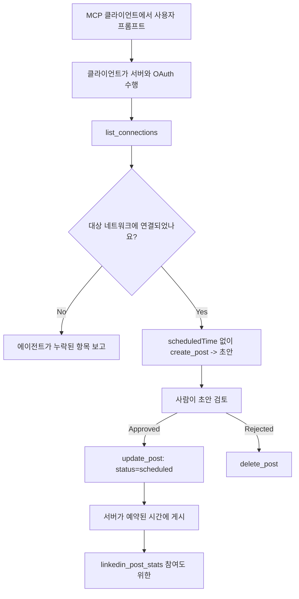

# 사례 연구: 원격 MCP 서버를 가진 에이전트에서 소셜 네트워크에 게시하기

> **면책 조항:** 여러 서비스와 오픈 소스 프로젝트가 소셜 네트워크에 게시할 수 있으며, 팀은 각 네트워크의 API를 직접 통합할 수도 있습니다. 아래 시나리오는 <strong>쓰기 가능한 원격 MCP 서버</strong>가 어떻게 설계되고 사용될 수 있는지에 대한 작업 예제로 제공됩니다. Publora는 무료 요금제가 있는 상업용 서비스이며, 여기서 설명하는 패턴은 사용자를 대신하여 되돌릴 수 없는 작업을 수행하는 모든 MCP 서버에 적용됩니다.

## 개요

에이전트는 콘텐츠 초안 작성에는 능하지만 전달에는 약합니다. 모델은 몇 초 만에 릴리스 발표문을 작성할 수 있지만, 그 후 작업은 멈춥니다: 게시하려면 네트워크별 API, 네트워크별 OAuth 앱, 그리고 각각 다른 미디어 규칙 세트가 필요합니다. 대부분 팀은 텍스트를 수동으로 브라우저에 복사하여 해결합니다.

이 사례 연구는 그 마지막 단계를 단일 원격 MCP 서버로 어떻게 완료하는지, 그리고 — 이를 구축하는 누구에게나 더 유용하게 — **쓰기 가능한** 서버가 정확히 맞춰야 하는 설계 결정을 다룹니다. 데이터 읽기는 관대한 반면 게시 작업은 그렇지 않습니다: 잘못된 도구 호출은 관객에게 보이며 되돌릴 수 없습니다.

## 시나리오

작은 개발자 협력 팀이 에이전트(Claude, VS Code, Cursor — 클라이언트는 중요하지 않음) 내에서 게시물을 초안 작성합니다. 그들은 에이전트가 다음을 하길 원합니다:

- 팀이 연결한 소셜 계정을 확인,
- 게시물을 초안으로 작성하고 사람이 승인할 때까지 초안 상태 유지,
- 이미지 첨부,
- 선택한 시간에 여러 네트워크에 예약,
- 이후 성과 보고.

중요한 것은, 그들이 실험하는 동안 에이전트가 <em>실수로</em> 게시하지 못하게 하는 것입니다.

## 사용 도구

- [Publora MCP Server](https://github.com/publora/mcp-server) — 게시, 예약, 미디어 및 LinkedIn 분석 도구를 노출하는 원격 MCP 서버(`streamable-http`). 공식 MCP 레지스트리에서 `com.publora/mcp-server`로 등록됨.

## 단계별 작업 흐름

1. **서버 연결:** OAuth를 사용하는 클라이언트는 서버 자체 동의 화면에서 권한 코드 흐름(PKCE)을 완료하며, 헤드리스 CLI 같은 비사용 클라이언트는 헤더 내 Publora API 키를 사용합니다. 두 경로 모두 지원되며, 어떤 경로를 사용하느냐는 서버가 아닌 클라이언트에 달려 있습니다.
2. **연결 목록 가져오기:** 에이전트가 `list_connections`를 호출하여 연결된 계정과 식별자를 받습니다.
3. **초안 작성:** 에이전트가 예약 시간이 없는 상태로 `create_post`를 호출합니다. 게시물은 초안으로 저장되어 아무것도 게시하지 않습니다.
4. **미디어 첨부:** 공개 이미지 URL이 같은 호출에서 전달되고, 서버가 이를 다운로드하고 유효성을 검증합니다.
5. **예약:** 사람이 승인한 후 `update_post`가 상태를 ISO 8601 시간과 함께 예약 상태로 설정합니다.
6. **측정:** LinkedIn의 경우, 게시물이 활성화된 후 `linkedin_post_stats`가 참여도를 반환합니다.

## 예제 프롬프트

```text
Which social accounts do I have connected?
Draft a post announcing our new changelog page, attach the screenshot at
https://example.com/changelog.png, and keep it as a draft — do not publish it.
Once I approve, schedule it to LinkedIn and Bluesky for tomorrow at 09:00 UTC.
```

## 머메이드 플로우차트



## 기술 구현

아래 교훈들은 이 사례 연구에서 이전 가능한 부분입니다.

### 열린 탐색, 인증된 실행

`tools/list`는 자격 증명 없이 제공되며, 모든 `tools/call`은 토큰이 필요하고 그렇지 않으면 보호된 리소스 메타데이터를 가리키는 `WWW-Authenticate` 헤더와 함께 `401`을 반환합니다. (서버는 또한 인증되지 않은 `initialize`에 응답하는데, 이는 `2026-07-28` 이전 프로토콜 버전의 클라이언트에만 중요하며 그 개정판에서는 핸드셰이크가 완전히 제거되었습니다.)

이 분리는 실제로 중요합니다. 레지스트리, 카탈로그, 클라이언트는 비밀 없이 도구 표면 — 이름, 스키마, 주석 — 을 내성적으로 조사할 수 있지만, 익명으로는 아무 것도 <em>실행</em>할 수 없습니다. `initialize`에 토큰을 요구하는 서버는 도구에 사실상 보이지 않으며, 익명 `tools/call`을 허용하는 서버는 위험을 초래합니다.

### 등록: 동적 클라이언트 등록과 그것을 대체하는 것

서버는 `/.well-known/oauth-protected-resource`와 `/.well-known/oauth-authorization-server`를 광고하고, 권한 코드 흐름과 PKCE(`S256`), 갱신 토큰 및 <strong>동적 클라이언트 등록</strong>을 지원합니다.

동적 등록은 수동 단계를 제거합니다: 없으면 모든 클라이언트는 사전에 발급된 `client_id`가 필요해 각 클라이언트마다 공급자에게 별도의 요청을 보내야 합니다.

복사할 설계가 아닌 호환성 동작으로 처리하세요. 2026-07-28 개정 사양은 동적 클라이언트 등록을 폐지하고 클라이언트가 안정된 HTTPS URL에 메타데이터 문서를 호스팅하며 그 URL이 곧 `client_id`가 되는 Client ID Metadata Document(CIMD)를 권장합니다. DCR은 현재도 작동하지만 오늘 구축되는 서버는 CIMD를 계획하고 오래된 클라이언트용으로만 DCR을 유지해야 합니다.

### 도구 주석은 장식이 아니다

모든 도구는 `title`과 적용 가능한 힌트: `readOnlyHint`, `destructiveHint`, `idempotentHint`, `openWorldHint`를 가집니다.

힌트에 투자할 두 가지 이유. 첫째, 클라이언트는 힌트를 사용해 사용자에게 무엇을 확인할지 결정합니다 — 클라이언트는 읽기 전용 조회를 자동 실행하고 삭제 전 승인을 요구할 수 있습니다. 사양은 주석이 신뢰할 수 없는 힌트임을 명확히 하며 권한 메커니즘이 아니라고 했습니다: 이는 클라이언트가 제공할 작업을 형성하며 서버 측 통제는 여전히 필요합니다. 둘째, 주요 커넥터 디렉터리는 검토를 위해 이를 <em>필수</em>로 요구합니다; 제목과 힌트가 없는 서버는 제대로 동작해도 반려됩니다.

### 식별자를 추론 불가능하게 만들기

플랫폼 식별자는 `list_connections`가 반환하는 불투명 문자열이며, 스키마 설명은 원문 그대로 복사해야 하며 추측해서는 안 된다고 명시합니다. 서버는 다른 형식을 거부합니다.

모델은 유창한 추론자입니다. 모든 쓰기 가능한 서버는 식별자가 결국 환각될 것으로 가정하고 그 경로를 조기에 시끄럽게 실패하게 만들어야 하며, 그럴듯한 값에 기반해 동작하면 안 됩니다.

### 게시 전에 실패, 실행 가능한 메시지 제공

일부 네트워크는 텍스트만 게시를 거부하며 이미지 또는 비디오를 요구합니다. 이는 게시물이 예약될 때 검증하며, 오류는 플랫폼과 누락된 요구 사항을 명시합니다.

에이전트는 "Instagram은 미디어를 요구함 — 이미지나 비디오를 첨부하세요"에서 다시 왕복 없이 복구할 수 있습니다. 일반적인 `400` 오류는 복구할 수 없습니다.

### 재시도를 안전하게 만들기

콘텐츠를 생성하는 두 도구인 `create_post`와 `update_post`는 멱등성 키를 받습니다: 동일한 요청에 멱등성 키를 재사용하면 원래 응답을 재현하여 중복 게시를 방지합니다. 에이전트 런타임은 타임아웃 시 재시도하는데, 멱등성 없이는 느린 응답이 중복 게시로 이어집니다. 다른 쓰기 도구 — 삭제, 미디어 단계, LinkedIn 반응 및 댓글 — 는 멱등성 키를 받지 않으니, 거기서는 재시도가 자동으로 안전하지 않습니다. 자신의 변이 중 어떤 것이 보호되고 어떤 것이 아닌지 아는 것이 중요합니다.

### 게시하지 않는 테스트 방법 제공

서버는 예약된 대상 `publora-playground`를 받아들여 진짜 대상처럼 검증하고 확인한 후 폐기합니다 — 실제 계정에는 아무것도 도달하지 않습니다. 이는 도구 스키마 자체에 설명되어 있는데, 자격 증명 없이 모든 클라이언트가 읽을 수 있습니다: `create_post`의 `platforms` 필드는 "실제 연결이 필요 없는 연결 테스트 대상 — 게시물은 확인 후 폐기되며, 게시되지 않음"으로 문서화되어 있습니다. 유일한 항목으로 전달하여 호출하세요: `platforms: ["publora-playground"]`.

이 방법은 전체 도구 표면에서 가장 유용한 세부 사항 중 하나로 판명되었습니다. 커넥터 디렉터리 검토자, 기여자, CI는 실제 관중에게 위험 없이 전체 쓰기 경로를 끝까지 실행할 수 있습니다. 되돌릴 수 없는 작업이 있는 모든 MCP 서버는 문서화된 무효 작업 대상의 혜택을 봅니다.

## 결과 및 영향

- 게시 단계가 브라우저에서 콘텐츠 작성이 이루어지는 동일 대화로 이동했고, 초안 우선 습관이 사람을 루프에 유지합니다. 정확히 정의하세요: 초안은 규약일 뿐 경계가 아닙니다. 동일한 인증 정보가 예약 또는 게시할 수 있으므로 실제 승인 게이트가 필요하면 별도 인증 정보나 서버 앞 정책 계층에서 강제해야 합니다.
- 네트워크별 차이점 — 미디어 요구사항, 스레딩, 답글 제어 — 이 모든 것이 각각의 에이전트가 아닌 서버에서 한 번 처리됩니다.
- 동일 서버는 개별 클라이언트 작업 없이 여러 MCP 클라이언트를 지원합니다. 탐색은 공개되고 등록은 동적이기 때문입니다.
- 위 설계 제약은 사용자만큼이나 커넥터 디렉터리 검토에서 형성되었습니다: 주석, OAuth, 안전 테스트 대상은 최소 한 곳 이상에서 필수였습니다.

## 참고 문헌

- [Publora MCP Server (소스)](https://github.com/publora/mcp-server)
- [Publora API 및 MCP 문서](https://docs.publora.com)
- [MCP 레지스트리 항목: `com.publora/mcp-server`](https://registry.modelcontextprotocol.io/v0/servers?search=com.publora/mcp-server)
- [MCP 사양 — 권한 부여](https://modelcontextprotocol.io/specification/draft/basic/authorization)
- [MCP 사양 — 도구 주석](https://modelcontextprotocol.io/docs/concepts/tools)

## 다음 단계

- 구축 중인 MCP 서버에서 여기 소개한 세 가지 가장 쉬운 개선점부터 확인하세요: 모든 도구에 주석, 모든 쓰기에 멱등성 키, 문서화된 무효 작업 대상.
- 열린 탐색 분리를 시험해 보세요: 자격 증명 없이 공개 원격 서버에 `tools/list`를 호출하고, 도구를 호출하고 `401` 챌린지를 검사하세요.
- 귀하 도메인에서 "되돌리기"가 의미하는 바를 고려하세요. 게시에는 초안과 삭제가 있습니다; 동등한 항목이 없으면 확인은 프롬프트가 아닌 도구 설계에 속합니다.

---

<!-- CO-OP TRANSLATOR DISCLAIMER START -->
**면책 조항**:
이 문서는 AI 번역 서비스 [Co-op Translator](https://github.com/Azure/co-op-translator)를 사용하여 번역되었습니다. 정확성을 기하기 위해 노력하고 있으나, 자동 번역은 오류나 부정확한 부분이 있을 수 있음을 유의하시기 바랍니다. 원본 문서의 원어본이 권위 있는 자료로 간주되어야 합니다. 중요한 정보의 경우, 전문가의 인간 번역을 권장합니다. 이 번역 사용으로 인해 발생하는 오해나 잘못된 해석에 대해 당사는 책임을 지지 않습니다.
<!-- CO-OP TRANSLATOR DISCLAIMER END -->