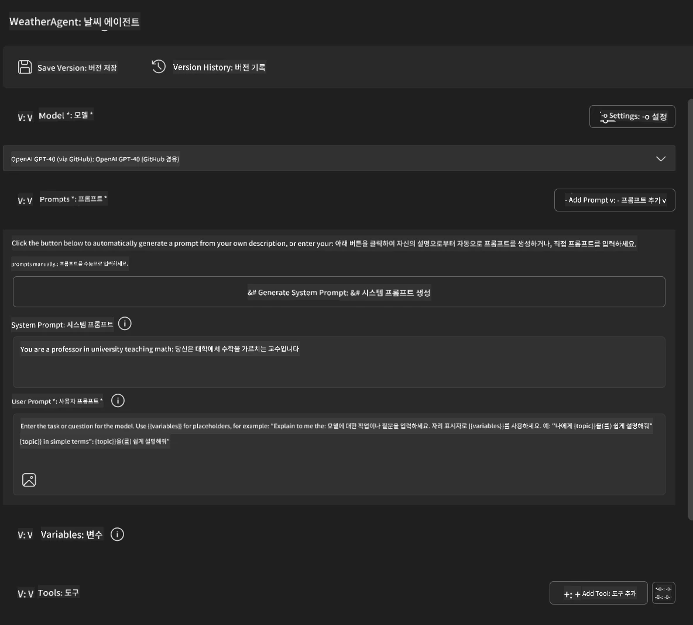
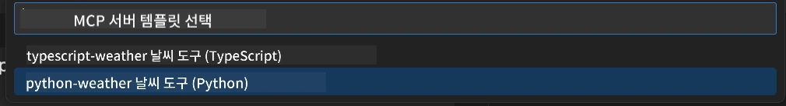
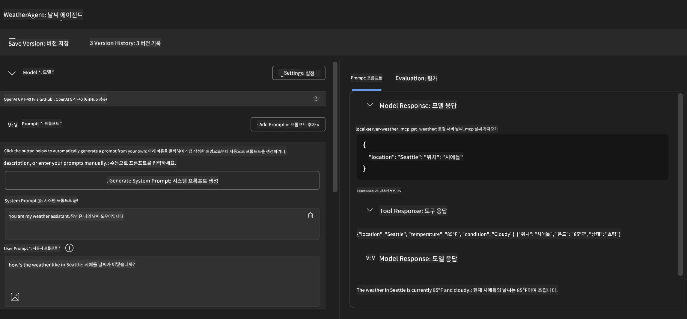
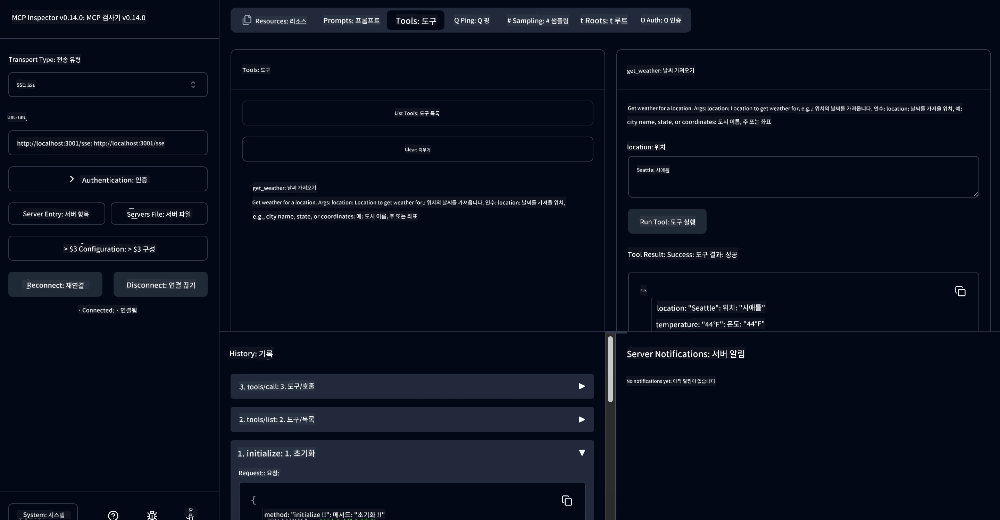

# 🔧 모듈 3: Microsoft Foundry Toolkit를 이용한 고급 MCP 개발

> [!NOTE]
> 이 실습의 Inspector URL은 구식 `/sse` 엔드포인트를 사용하며,
> 고정된 MCP SDK `1.9.3` 및 Inspector `0.14.0` 종속성을 목표로 합니다. 이는 최신
> `2026-07-28` Streamable HTTP 예제가 아닙니다.


## 🎯 학습 목표

이 실습을 완료하면 다음을 할 수 있습니다:

- ✅ Microsoft Foundry Toolkit을 사용하여 맞춤 MCP 서버를 생성하기
- ✅ 최신 MCP Python SDK (v1.9.3) 구성 및 사용하기
- ✅ 디버깅을 위한 MCP Inspector 설정 및 활용하기
- ✅ Agent Builder 및 Inspector 환경에서 MCP 서버 디버깅하기
- ✅ 고급 MCP 서버 개발 워크플로우 이해하기

## 📋 사전 준비 사항

- 실습 2 (MCP 기본) 완료
- Microsoft Foundry Toolkit 확장자가 설치된 VS Code
- Python 3.10+ 환경
- Inspector 설정용 Node.js 및 npm

## 🏗️ 만들게 될 것

이 실습에서, 다음을 시연하는 <strong>Weather MCP Server</strong>를 생성합니다:
- 맞춤 MCP 서버 구현
- Microsoft Foundry Toolkit Agent Builder와의 통합
- 전문적인 디버깅 워크플로우
- 최신 MCP SDK 사용 패턴

---

## 🔧 핵심 구성 요소 개요

### 🐍 MCP Python SDK
Model Context Protocol Python SDK는 맞춤 MCP 서버 구축의 기반을 제공합니다. 디버깅 기능이 강화된 1.9.3 버전을 사용합니다.

### 🔍 MCP Inspector
강력한 디버깅 도구로서 다음을 제공합니다:
- 실시간 서버 모니터링
- 도구 실행 시각화
- 네트워크 요청/응답 검사
- 대화형 테스트 환경

---

## 📖 단계별 구현

### 1단계: Agent Builder에서 WeatherAgent 생성

1. Microsoft Foundry Toolkit 확장자를 통해 VS Code에서 **Agent Builder** 실행
2. 다음 구성으로 **새 에이전트 생성**:
   - 에이전트 이름: `WeatherAgent`



### 2단계: MCP 서버 프로젝트 초기화

1. Agent Builder에서 <strong>도구</strong> → <strong>도구 추가</strong>로 이동
2. 제공되는 옵션에서 **"MCP Server"** 선택
3. **"새 MCP 서버 생성"** 선택
4. `python-weather` 템플릿 선택
5. 서버 이름 지정: `weather_mcp`



### 3단계: 프로젝트 열기 및 검사

1. 생성된 프로젝트를 VS Code에서 열기
2. 프로젝트 구조 검토:
   ```
   weather_mcp/
   ├── src/
   │   ├── __init__.py
   │   └── server.py
   ├── inspector/
   │   ├── package.json
   │   └── package-lock.json
   ├── .vscode/
   │   ├── launch.json
   │   └── tasks.json
   ├── pyproject.toml
   └── README.md
   ```

### 4단계: 최신 MCP SDK로 업그레이드

> **🔍 업그레이드 이유:** 향상된 기능과 더 나은 디버깅을 위해 최신 MCP SDK (v1.9.3) 및 Inspector 서비스 (0.14.0)를 사용하려고 합니다.

#### 4a. Python 종속성 업데이트

**`pyproject.toml` 편집:** [./code/weather_mcp/pyproject.toml](../../../../10-StreamliningAIWorkflowsBuildingAnMCPServerWithAIToolkit/lab3/code/weather_mcp/pyproject.toml) 업데이트


#### 4b. Inspector 구성 업데이트

**`inspector/package.json` 편집:** [./code/weather_mcp/inspector/package.json](../../../../10-StreamliningAIWorkflowsBuildingAnMCPServerWithAIToolkit/lab3/code/weather_mcp/inspector/package.json) 업데이트

#### 4c. Inspector 종속성 업데이트

**`inspector/package-lock.json` 편집:** [./code/weather_mcp/inspector/package-lock.json](../../../../10-StreamliningAIWorkflowsBuildingAnMCPServerWithAIToolkit/lab3/code/weather_mcp/inspector/package-lock.json) 업데이트

> **📝 참고:** 이 파일은 광범위한 종속성 정의를 포함합니다. 아래는 필수 구조이며, 전체 내용은 적절한 종속성 해결을 보장합니다.


> **⚡ 전체 패키지 잠금:** 전체 package-lock.json 파일에는 약 3000줄의 종속성 정의가 포함되어 있습니다. 위는 핵심 구조를 보여주며, 전체 종속성 해결을 위해 제공된 파일을 사용하세요.

### 5단계: VS Code 디버깅 구성

*참고: 지정된 경로의 파일을 복사하여 로컬 파일을 교체하세요*

#### 5a. 실행 구성 업데이트

**`.vscode/launch.json` 편집:**

```json
{
  "version": "0.2.0",
  "configurations": [
    {
      "name": "Attach to Local MCP",
      "type": "debugpy",
      "request": "attach",
      "connect": {
        "host": "localhost",
        "port": 5678
      },
      "presentation": {
        "hidden": true
      },
      "internalConsoleOptions": "neverOpen",
      "postDebugTask": "Terminate All Tasks"
    },
    {
      "name": "Launch Inspector (Edge)",
      "type": "msedge",
      "request": "launch",
      "url": "http://localhost:6274?timeout=60000&serverUrl=http://localhost:3001/sse#tools",
      "cascadeTerminateToConfigurations": [
        "Attach to Local MCP"
      ],
      "presentation": {
        "hidden": true
      },
      "internalConsoleOptions": "neverOpen"
    },
    {
      "name": "Launch Inspector (Chrome)",
      "type": "chrome",
      "request": "launch",
      "url": "http://localhost:6274?timeout=60000&serverUrl=http://localhost:3001/sse#tools",
      "cascadeTerminateToConfigurations": [
        "Attach to Local MCP"
      ],
      "presentation": {
        "hidden": true
      },
      "internalConsoleOptions": "neverOpen"
    }
  ],
  "compounds": [
    {
      "name": "Debug in Agent Builder",
      "configurations": [
        "Attach to Local MCP"
      ],
      "preLaunchTask": "Open Agent Builder",
    },
    {
      "name": "Debug in Inspector (Edge)",
      "configurations": [
        "Launch Inspector (Edge)",
        "Attach to Local MCP"
      ],
      "preLaunchTask": "Start MCP Inspector",
      "stopAll": true
    },
    {
      "name": "Debug in Inspector (Chrome)",
      "configurations": [
        "Launch Inspector (Chrome)",
        "Attach to Local MCP"
      ],
      "preLaunchTask": "Start MCP Inspector",
      "stopAll": true
    }
  ]
}
```

**`.vscode/tasks.json` 편집:**

```
{
  "version": "2.0.0",
  "tasks": [
    {
      "label": "Start MCP Server",
      "type": "shell",
      "command": "python -m debugpy --listen 127.0.0.1:5678 src/__init__.py sse",
      "isBackground": true,
      "options": {
        "cwd": "${workspaceFolder}",
        "env": {
          "PORT": "3001"
        }
      },
      "problemMatcher": {
        "pattern": [
          {
            "regexp": "^.*$",
            "file": 0,
            "location": 1,
            "message": 2
          }
        ],
        "background": {
          "activeOnStart": true,
          "beginsPattern": ".*",
          "endsPattern": "Application startup complete|running"
        }
      }
    },
    {
      "label": "Start MCP Inspector",
      "type": "shell",
      "command": "npm run dev:inspector",
      "isBackground": true,
      "options": {
        "cwd": "${workspaceFolder}/inspector",
        "env": {
          "CLIENT_PORT": "6274",
          "SERVER_PORT": "6277",
        }
      },
      "problemMatcher": {
        "pattern": [
          {
            "regexp": "^.*$",
            "file": 0,
            "location": 1,
            "message": 2
          }
        ],
        "background": {
          "activeOnStart": true,
          "beginsPattern": "Starting MCP inspector",
          "endsPattern": "Proxy server listening on port"
        }
      },
      "dependsOn": [
        "Start MCP Server"
      ]
    },
    {
      "label": "Open Agent Builder",
      "type": "shell",
      "command": "echo ${input:openAgentBuilder}",
      "presentation": {
        "reveal": "never"
      },
      "dependsOn": [
        "Start MCP Server"
      ],
    },
    {
      "label": "Terminate All Tasks",
      "command": "echo ${input:terminate}",
      "type": "shell",
      "problemMatcher": []
    }
  ],
  "inputs": [
    {
      "id": "openAgentBuilder",
      "type": "command",
      "command": "ai-mlstudio.agentBuilder",
      "args": {
        "initialMCPs": [ "local-server-weather_mcp" ],
        "triggeredFrom": "vsc-tasks"
      }
    },
    {
      "id": "terminate",
      "type": "command",
      "command": "workbench.action.tasks.terminate",
      "args": "terminateAll"
    }
  ]
}
```


---

## 🚀 MCP 서버 실행 및 테스트

### 6단계: 종속성 설치

구성 변경 후 다음 명령을 실행하세요:

**Python 종속성 설치:**
```bash
uv sync
```

**Inspector 종속성 설치:**
```bash
cd inspector
npm install
```

### 7단계: Agent Builder로 디버깅

1. **F5를 누르거나** **"Debug in Agent Builder"** 구성을 사용
2. 디버그 패널에서 복합 구성 선택
3. 서버 시작 및 Agent Builder 열릴 때까지 대기
4. 자연어 쿼리로 weather MCP 서버 테스트

다음과 같은 입력 프롬프트

SYSTEM_PROMPT

```
You are my weather assistant
```

USER_PROMPT

```
How's the weather like in Seattle
```



### 8단계: MCP Inspector로 디버깅

1. **"Debug in Inspector"** 구성 사용 (Edge 또는 Chrome)
2. `http://localhost:6274` 에서 Inspector 인터페이스 열기
3. 대화형 테스트 환경 탐색:
   - 사용 가능한 도구 보기
   - 도구 실행 테스트
   - 네트워크 요청 모니터링
   - 서버 응답 디버깅



---

## 🎯 주요 학습 결과

이 실습을 완료함으로써 다음을 달성했습니다:

- [x] Microsoft Foundry Toolkit 템플릿을 사용하여 **맞춤 MCP 서버 생성**
- [x] 향상된 기능을 위한 **최신 MCP SDK(v1.9.3)로 업그레이드**
- [x] Agent Builder 및 Inspector용 **전문 디버깅 워크플로우 구성**
- [x] 대화형 서버 테스트용 **MCP Inspector 설정**
- [x] MCP 개발을 위한 **VS Code 디버깅 구성 숙달**

## 🔧 탐색한 고급 기능

| 기능 | 설명 | 사용 사례 |
|---------|-------------|----------|
| **MCP Python SDK v1.9.3** | 최신 프로토콜 구현 | 현대적인 서버 개발 |
| **MCP Inspector 0.14.0** | 대화형 디버깅 도구 | 실시간 서버 테스트 |
| **VS Code 디버깅** | 통합 개발 환경 | 전문 디버깅 워크플로우 |
| **Agent Builder 통합** | Microsoft Foundry Toolkit 직접 연결 | 종단 간 에이전트 테스트 |

## 📚 추가 자료

- [MCP Python SDK 문서](https://modelcontextprotocol.io/docs/sdk/python)
- [Microsoft Foundry Toolkit 확장 가이드](https://code.visualstudio.com/docs/ai/ai-toolkit)
- [VS Code 디버깅 문서](https://code.visualstudio.com/docs/editor/debugging)
- [Model Context Protocol 명세](https://modelcontextprotocol.io/docs/concepts/architecture)

---

**🎉 축하합니다!** Lab 3을 성공적으로 완료하여 전문 개발 워크플로우를 사용하여 맞춤 MCP 서버를 생성, 디버깅 및 배포할 수 있습니다.

### 🔜 다음 모듈로 계속하기

실제 개발 워크플로우에 MCP 기술을 적용할 준비가 되셨나요? <strong>[모듈 4: 실전 MCP 개발 - 맞춤 GitHub 클론 서버](../lab4/README.md)</strong>로 계속 진행하세요. 여기서 다음을 수행합니다:
- 프로덕션 준비가 된 MCP 서버를 구축하여 GitHub 저장소 작업 자동화
- MCP를 통한 GitHub 저장소 복제 기능 구현
- VS Code 및 GitHub Copilot Agent 모드와 맞춤 MCP 서버 통합
- 프로덕션 환경에서 맞춤 MCP 서버 테스트 및 배포
- 개발자를 위한 실제 워크플로우 자동화 학습

---

<!-- CO-OP TRANSLATOR DISCLAIMER START -->
**면책 조항**:
이 문서는 AI 번역 서비스 [Co-op Translator](https://github.com/Azure/co-op-translator)를 사용하여 번역되었습니다. 정확성을 기하기 위해 노력하고 있으나, 자동 번역은 오류나 부정확한 부분이 있을 수 있음을 유의하시기 바랍니다. 원본 문서의 원어본이 권위 있는 자료로 간주되어야 합니다. 중요한 정보의 경우, 전문가의 인간 번역을 권장합니다. 이 번역 사용으로 인해 발생하는 오해나 잘못된 해석에 대해 당사는 책임을 지지 않습니다.
<!-- CO-OP TRANSLATOR DISCLAIMER END -->