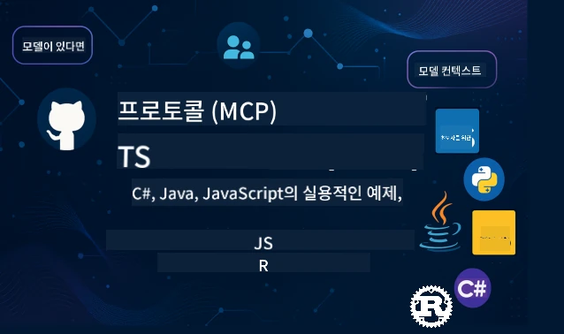

 

[](https://GitHub.com/microsoft/mcp-for-beginners/graphs/contributors)
[](https://GitHub.com/microsoft/mcp-for-beginners/issues)
[](https://GitHub.com/microsoft/mcp-for-beginners/pulls)
[](http://makeapullrequest.com)

[](https://GitHub.com/microsoft/mcp-for-beginners/watchers)
[](https://GitHub.com/microsoft/mcp-for-beginners/fork)
[](https://GitHub.com/microsoft/mcp-for-beginners/stargazers)


[](https://discord.gg/nTYy5BXMWG)

이 리소스를 사용하기 시작하려면 다음 단계를 따르세요:
1. **저장소 포크하기**: 클릭 [](https://GitHub.com/microsoft/mcp-for-beginners/fork)
2. **저장소 클론하기**:   `git clone https://github.com/microsoft/mcp-for-beginners.git`
3. **가입하기** [](https://discord.gg/nTYy5BXMWG)


### 🌐 다국어 지원

#### GitHub 액션을 통한 지원 (자동화 및 항상 최신 상태 유지)

<!-- CO-OP TRANSLATOR LANGUAGES TABLE START -->
[Arabic](../ar/README.md) | [Bengali](../bn/README.md) | [Bulgarian](../bg/README.md) | [Burmese (Myanmar)](../my/README.md) | [Chinese (Simplified)](../zh-CN/README.md) | [Chinese (Traditional, Hong Kong)](../zh-HK/README.md) | [Chinese (Traditional, Macau)](../zh-MO/README.md) | [Chinese (Traditional, Taiwan)](../zh-TW/README.md) | [Croatian](../hr/README.md) | [Czech](../cs/README.md) | [Danish](../da/README.md) | [Dutch](../nl/README.md) | [Estonian](../et/README.md) | [Finnish](../fi/README.md) | [French](../fr/README.md) | [German](../de/README.md) | [Greek](../el/README.md) | [Hebrew](../he/README.md) | [Hindi](../hi/README.md) | [Hungarian](../hu/README.md) | [Indonesian](../id/README.md) | [Italian](../it/README.md) | [Japanese](../ja/README.md) | [Kannada](../kn/README.md) | [Korean](./README.md) | [Lithuanian](../lt/README.md) | [Malay](../ms/README.md) | [Malayalam](../ml/README.md) | [Marathi](../mr/README.md) | [Nepali](../ne/README.md) | [Nigerian Pidgin](../pcm/README.md) | [Norwegian](../no/README.md) | [Persian (Farsi)](../fa/README.md) | [Polish](../pl/README.md) | [Portuguese (Brazil)](../pt-BR/README.md) | [Portuguese (Portugal)](../pt-PT/README.md) | [Punjabi (Gurmukhi)](../pa/README.md) | [Romanian](../ro/README.md) | [Russian](../ru/README.md) | [Serbian (Cyrillic)](../sr/README.md) | [Slovak](../sk/README.md) | [Slovenian](../sl/README.md) | [Spanish](../es/README.md) | [Swahili](../sw/README.md) | [Swedish](../sv/README.md) | [Tagalog (Filipino)](../tl/README.md) | [Tamil](../ta/README.md) | [Telugu](../te/README.md) | [Thai](../th/README.md) | [Turkish](../tr/README.md) | [Ukrainian](../uk/README.md) | [Urdu](../ur/README.md) | [Vietnamese](../vi/README.md)

> **로컬로 클론하는 것을 선호하시나요?**

> 이 저장소에는 50개 이상의 언어 번역본이 포함되어 있어 다운로드 크기가 상당히 증가합니다. 번역본 없이 클론하려면 sparse checkout을 사용하세요:
> ```bash
> git clone --filter=blob:none --sparse https://github.com/microsoft/mcp-for-beginners.git
> cd mcp-for-beginners
> git sparse-checkout set --no-cone '/*' '!translations' '!translated_images'
> ```
> 이렇게 하면 훨씬 빠른 다운로드로 코스를 완료하는 데 필요한 모든 것을 얻을 수 있습니다.
<!-- CO-OP TRANSLATOR LANGUAGES TABLE END -->

# 🚀 초보자를 위한 모델 컨텍스트 프로토콜(MCP) 커리큘럼

## **C#, Java, JavaScript, Rust, Python, TypeScript 언어로 손쉬운 코드 예제와 함께 MCP 배우기**

## 🧠 모델 컨텍스트 프로토콜 커리큘럼 개요  
모델 컨텍스트 프로토콜에 대한 여정에 오신 것을 환영합니다! AI 애플리케이션이 다양한 도구와 서비스와 어떻게 소통하는지 궁금했다면, 여러분은 지금 개발자들이 지능형 시스템을 구축하는 방식을 혁신하는 우아한 해법을 발견하려고 합니다.

MCP는 AI 애플리케이션을 위한 범용 번역기라고 생각해 보세요 - USB 포트가 어떤 장치든 컴퓨터에 연결할 수 있게 하는 것처럼, MCP는 AI 모델이 어떤 도구나 서비스든 표준화된 방식으로 연결할 수 있게 합니다. 처음 챗봇을 만들든 복잡한 AI 워크플로를 작업하든 MCP를 이해하는 것은 더 강력하고 유연한 애플리케이션을 만들 수 있는 힘을 줄 것입니다.

이 커리큘럼은 여러분의 학습 여정을 위해 인내심을 가지고 세심하게 설계되었습니다. 여러분이 이미 이해하고 있는 간단한 개념부터 시작해 좋아하는 프로그래밍 언어로 직접 실습하며 점차 전문성을 쌓아갈 것입니다. 각 단계마다 명확한 설명, 실용적인 예제, 그리고 충분한 격려가 포함되어 있습니다.

이 여정을 마치면 자신만의 MCP 서버를 구축하고 이를 인기 있는 AI 플랫폼과 통합하며, 이 기술이 AI 개발의 미래를 어떻게 재편하는지 이해하는 자신감을 갖게 될 것입니다. 함께 이 흥미로운 모험을 시작합시다!

### 공식 문서 및 명세서  

이 자원들은 여러분의 이해가 깊어질수록 더 귀중해지지만, 당장 모두 읽으려 부담을 가지지 마세요. 가장 관심 있는 영역부터 시작하세요!  
- 📘 [MCP 문서](https://modelcontextprotocol.io/) – 단계별 튜토리얼과 사용자 가이드가 있는 기본 자료입니다. 초보자를 위해 작성되어 여러분이 자신의 속도로 따라 할 수 있는 명확한 예제를 제공합니다.  
- 📜 [MCP 명세서](https://modelcontextprotocol.io/docs/) – 이곳은 포괄적인 참조 매뉴얼로 생각하세요. 커리큘럼을 진행하면서 특정 세부사항을 찾아보고 고급 기능을 탐색할 때 다시 방문하게 될 것입니다.  
- 📜 [원본 MCP 명세서](https://modelcontextprotocol.io/specification/versioning) – 보다 고급 구현에 도움이 될 수 있는 추가 기술적 세부사항이 포함되어 있습니다. 필요할 때 참고하시고, 처음에는 부담 갖지 않으셔도 됩니다.  
- 🧑‍💻 [MCP GitHub 저장소](https://github.com/modelcontextprotocol) – 여러 프로그래밍 언어로 된 SDK, 도구, 코드 샘플이 있습니다. 실제 예제와 바로 사용할 수 있는 컴포넌트의 보물창고입니다.  
- 🌐 [MCP 커뮤니티](https://github.com/orgs/modelcontextprotocol/discussions) – MCP에 대해 배우는 동료와 경험 많은 개발자들과 토론할 수 있는 지원 커뮤니티입니다. 질문이 환영받고 지식이 자유롭게 공유됩니다.  

## 학습 목표  

이 커리큘럼을 마치면 새로운 역량에 대해 자신감과 기대감을 느낄 것입니다. 달성할 내용은 다음과 같습니다:

• **MCP 기본 이해**: 모델 컨텍스트 프로토콜이 무엇이며 AI 애플리케이션들이 어떻게 함께 작동하는 방식을 혁신하는지, 적절한 비유와 예제로 이해합니다.

• **최초의 MCP 서버 구축**: 선호하는 프로그래밍 언어로 작동하는 MCP 서버를 만들어 보며, 간단한 예제로 시작해 단계별로 실력을 키웁니다.

• **AI 모델과 실제 도구 연결**: AI 모델과 실제 서비스 사이의 연결 고리를 배우며, 애플리케이션에 강력한 새로운 기능을 부여합니다.

• **보안 모범 사례 구현**: MCP 구현을 안전하게 유지하는 방법을 배우고, 애플리케이션과 사용자 모두를 보호합니다.

• **자신감 있는 배포**: MCP 프로젝트를 개발에서 프로덕션까지 실제 환경에 맞는 실질적인 배포 전략으로 전환할 수 있습니다.

• **MCP 커뮤니티 참여**: AI 애플리케이션 개발의 미래를 함께 만들어가는 성장하는 개발자 커뮤니티의 일원이 됩니다.

## 필수 배경 지식  

MCP 구체적으로 들어가기 전에 몇 가지 기본 개념에 익숙해지시길 바랍니다. 이 분야 전문가가 아니어도 걱정하지 마세요 - 필요한 모든 내용을 차근차근 설명할 것입니다!

### 프로토콜 이해하기 (기초)

프로토콜은 대화에 필요한 규칙과 같습니다. 친구에게 전화하면 인사하고, 서로 말할 차례를 지키고, 끝나면 작별 인사를 하듯이 컴퓨터 프로그램도 효과적인 소통을 위해 비슷한 규칙이 필요합니다.

MCP는 프로토콜, 즉 AI 모델과 애플리케이션이 도구 및 서비스와 생산적 “대화”를 하기 위한 규칙 집합입니다. 대화 규칙이 인간 소통을 원활하게 하듯, MCP도 AI 애플리케이션 간 소통을 훨씬 신뢰성 있고 강력하게 만듭니다.

### 클라이언트-서버 관계 (프로그램 간 협력 방식)

여러분은 매일 클라이언트-서버 관계를 사용하고 있습니다! 웹 브라우저(클라이언트)를 통해 웹사이트에 접속하면, 웹 서버가 페이지 내용을 보내줍니다. 브라우저는 정보를 요청하는 방법을 알고, 서버는 응답하는 방법을 압니다.

MCP에서도 비슷한 관계가 존재합니다: AI 모델은 정보를 요청하거나 동작을 요구하는 클라이언트 역할을 하고 MCP 서버가 이러한 기능을 제공합니다. 이는 AI가 특정 작업을 수행하도록 요청하는 유용한 조수(서버)를 둔 것과 같습니다.

### 표준화가 중요한 이유 (호환성 확보)

차마다 다른 모양의 주유구를 쓴다면, 각 차마다 다른 어댑터가 필요할 것입니다! 표준화는 공통된 방식을 합의해 서로 다르게 보이는 것들이 매끄럽게 작동하도록 합니다.

MCP는 AI 애플리케이션을 위한 이런 표준화를 제공합니다. 모든 AI 모델이 각 도구와 맞춤형 코드를 작성할 필요 없이, MCP는 그들이 소통할 수 있는 범용 방법을 만듭니다. 이를 통해 개발자는 한 번 도구를 만들면 여러 AI 시스템과 호환 가능하게 됩니다.

## 🧭 여러분의 학습 경로 개요  

MCP 학습 여정은 자신감과 능력을 점진적으로 쌓도록 신중하게 구성되어 있습니다. 각 단계는 새로운 개념을 소개하는 동시에 이미 배운 내용을 강화합니다.

### 🌱 기초 단계: 기본 이해 (모듈 0-2)

이곳에서 모험이 시작됩니다! 익숙한 비유와 간단한 예제를 통해 MCP 개념을 소개합니다. MCP가 무엇인지, 왜 필요한지, AI 개발의 더 큰 세계에서 어떤 위치를 차지하는지 이해하게 됩니다.

• **모듈 0 - MCP 소개**: MCP가 무엇인지, 왜 현대 AI 애플리케이션에 중요한지 탐구합니다. 실제 MCP가 작동하는 예제를 보고 개발자들이 직면하는 공통 문제를 어떻게 해결하는지 이해합니다.

• **모듈 1 - 핵심 개념 설명**: MCP의 기본 구성 요소를 배우고, 다양한 비유와 시각적 예제를 사용하여 자연스럽고 이해하기 쉽게 만듭니다.

• **모듈 2 - MCP의 보안**: 보안이 어려워 보일 수 있지만, MCP 내장 보안 기능과 애플리케이션을 처음부터 보호하는 모범 사례를 안내합니다.

### 🔨 구축 단계: 최초 구현 만들기 (모듈 3)

이제 정말 재미있는 단계가 시작됩니다! 실제 MCP 서버와 클라이언트를 직접 구축하는 실습 경험을 얻습니다. 걱정하지 마세요 - 간단한 예제로 시작하여 모든 단계를 안내할 것입니다.

이 모듈에는 선호하는 프로그래밍 언어로 연습할 수 있는 여러 실습 가이드가 포함되어 있습니다. 첫 MCP 서버를 만들고, 이를 연결하는 클라이언트를 빌드하며, VS Code와 같은 인기 개발 도구와도 통합합니다.
각 가이드에는 완전한 코드 예제, 문제 해결 팁, 그리고 우리가 특정 설계 선택을 하는 이유에 대한 설명이 포함되어 있습니다. 이 단계를 마치면 자랑스러워할 만한 작동하는 MCP 구현체를 가지게 될 것입니다!

### 🚀 성장 단계: 고급 개념 및 실제 적용 (모듈 4-5)

기본 개념을 익힌 후에는 더 정교한 MCP 기능을 탐구할 준비가 되었습니다. 실용적인 구현 전략, 디버깅 기법, 멀티모달 AI 통합과 같은 고급 주제를 다룹니다.

또한 MCP 구현체를 프로덕션 용도에 맞게 확장하고 Azure와 같은 클라우드 플랫폼과 통합하는 방법도 배우게 됩니다. 이 모듈들은 실제 세계의 요구를 처리할 수 있는 MCP 솔루션을 구축할 준비를 시켜줍니다.

### 🌟 숙련 단계: 커뮤니티 및 전문화 (모듈 6-11)

최종 단계는 MCP 커뮤니티에 참여하고 관심 있는 분야에 전문화하는 데 초점을 맞춥니다. 오픈 소스 MCP 프로젝트에 기여하는 방법, 고급 인증 패턴 구현, 종합적인 데이터베이스 통합 솔루션 구축을 배우게 됩니다.

모듈 11은 특별히 주목할 만합니다 - PostgreSQL 통합을 통해 프로덕션 준비가 된 MCP 서버를 구축하는 13개의 실습 학습 경로로 구성된 완전한 과정입니다. 지금까지 배운 모든 것을 종합하는 캡스톤 프로젝트와 같습니다!

### 📚 전체 커리큘럼 구성

| Module | 주제 | 설명 | 링크 |
|--------|-------|-------------|------|
| **모듈 1-3: 기본** | | | |
| 00 | MCP 소개 | 모델 컨텍스트 프로토콜 및 AI 파이프라인에서의 중요성 개요 | [자세히 읽기](./00-Introduction/README.md) |
| 01 | 핵심 개념 설명 | MCP 핵심 개념에 대한 심층 탐구 | [자세히 읽기](./01-CoreConcepts/README.md) |
| 02 | MCP 보안 | 보안 위협 및 모범 사례 | [자세히 읽기](./02-Security/README.md) |
| 03 | MCP 시작하기 | 환경 설정, 기본 서버/클라이언트, 통합 | [자세히 읽기](./03-GettingStarted/README.md) |
| **모듈 3: 첫 서버 및 클라이언트 구축** | | | |
| 3.1 | 첫 서버 | 첫 MCP 서버 만들기 | [가이드](./03-GettingStarted/01-first-server/README.md) |
| 3.2 | 첫 클라이언트 | 기본 MCP 클라이언트 개발 | [가이드](./03-GettingStarted/02-client/README.md) |
| 3.3 | LLM 클라이언트 | 대형 언어 모델 통합 | [가이드](./03-GettingStarted/03-llm-client/README.md) |
| 3.4 | VS Code 통합 | VS Code에서 MCP 서버 사용하기 | [가이드](./03-GettingStarted/04-vscode/README.md) |
| 3.5 | stdio 서버 | stdio 전송으로 서버 생성 | [가이드](./03-GettingStarted/05-stdio-server/README.md) |
| 3.6 | HTTP 스트리밍 | MCP에서 HTTP 스트리밍 구현 | [가이드](./03-GettingStarted/06-http-streaming/README.md) |
| 3.7 | AI 툴킷 | MCP와 AI 툴킷 사용하기 | [가이드](./03-GettingStarted/07-aitk/README.md) |
| 3.8 | 테스트 | MCP 서버 구현 테스트 | [가이드](./03-GettingStarted/08-testing/README.md) |
| 3.9 | 배포 | MCP 서버 프로덕션 배포 | [가이드](./03-GettingStarted/09-deployment/README.md) |
| 3.10 | 고급 서버 사용 | 고급 기능 및 아키텍처 개선을 위한 고급 서버 사용 | [가이드](./03-GettingStarted/10-advanced/README.md) |
| 3.11 | 간단한 인증 | 인증 및 RBAC 기초 보여주기 | [가이드](./03-GettingStarted/11-simple-auth/README.md) |
| **모듈 4-5: 실용 및 고급** | | | |
| 04 | 실용적 구현 | SDK, 디버깅, 테스트, 재사용 가능한 프롬프트 템플릿 | [자세히 읽기](./04-PracticalImplementation/README.md) |
| 05 | MCP 고급 주제 | 멀티모달 AI, 확장성, 엔터프라이즈 사용 | [자세히 읽기](./05-AdvancedTopics/README.md) |
| 5.1 | Azure 통합 | Azure와 MCP 통합 | [가이드](./05-AdvancedTopics/mcp-integration/README.md) |
| 5.2 | 멀티모달리티 | 여러 모달리티 작업 | [가이드](./05-AdvancedTopics/mcp-multi-modality/README.md) |
| 5.3 | OAuth2 데모 | OAuth2 인증 구현 | [가이드](./05-AdvancedTopics/mcp-oauth2-demo/README.md) |
| 5.4 | 루트 컨텍스트 | 루트 컨텍스트 이해 및 구현 | [가이드](./05-AdvancedTopics/mcp-root-contexts/README.md) |
| 5.5 | 라우팅 | MCP 라우팅 전략 | [가이드](./05-AdvancedTopics/mcp-routing/README.md) |
| 5.6 | 샘플링 | MCP 내 샘플링 기법 | [가이드](./05-AdvancedTopics/mcp-sampling/README.md) |
| 5.7 | 확장 | MCP 구현 확장 | [가이드](./05-AdvancedTopics/mcp-scaling/README.md) |
| 5.8 | 보안 | 고급 보안 고려 사항 | [가이드](./05-AdvancedTopics/mcp-security/README.md) |
| 5.9 | 웹 검색 | 웹 검색 기능 구현 | [가이드](./05-AdvancedTopics/web-search-mcp/README.md) |
| 5.10 | 실시간 스트리밍 | 실시간 스트리밍 기능 구축 | [가이드](./05-AdvancedTopics/mcp-realtimestreaming/README.md) |
| 5.11 | 실시간 검색 | 실시간 검색 구현 | [가이드](./05-AdvancedTopics/mcp-realtimesearch/README.md) |
| 5.12 | Entra ID 인증 | Microsoft Entra ID로 인증 | [가이드](./05-AdvancedTopics/mcp-security-entra/README.md) |
| 5.13 | Foundry 통합 | Azure AI Foundry와 통합 | [가이드](./05-AdvancedTopics/mcp-foundry-agent-integration/README.md) |
| 5.14 | 컨텍스트 엔지니어링 | 효과적 컨텍스트 엔지니어링 기법 | [가이드](./05-AdvancedTopics/mcp-contextengineering/README.md) |
| 5.15 | MCP 맞춤형 전송 | 맞춤형 전송 구현 | [가이드](./05-AdvancedTopics/mcp-transport/README.md) |
| **모듈 6-10: 커뮤니티 및 모범 사례** | | | |
| 06 | 커뮤니티 기여 | MCP 생태계에 기여하는 법 | [가이드](./06-CommunityContributions/README.md) |
| 07 | 초기 도입 인사이트 | 실제 구현 사례 | [가이드](./07-LessonsFromEarlyAdoption/README.md) |
| 08 | MCP 모범 사례 | 성능, 장애 허용, 복원력 | [가이드](./08-BestPractices/README.md) |
| 09 | MCP 사례 연구 | 실용적 구현 사례 | [가이드](./09-CaseStudy/README.md) |
| 10 | 실습 워크숍 | AI 툴킷으로 MCP 서버 구축 | [실습](./10-StreamliningAIWorkflowsBuildingAnMCPServerWithAIToolkit/README.md) |
| **모듈 11: MCP 서버 실습 실험실** | | | |
| 11 | MCP 서버 데이터베이스 통합 | PostgreSQL 통합을 위한 13개 실습 학습 경로 | [실습](./11-MCPServerHandsOnLabs/README.md) |
| 11.1 | 소개 | 데이터베이스 통합 MCP 및 소매 분석 사용 사례 개요 | [실습 00](./11-MCPServerHandsOnLabs/00-Introduction/README.md) |
| 11.2 | 핵심 아키텍처 | MCP 서버 아키텍처, 데이터베이스 계층, 보안 패턴 이해 | [실습 01](./11-MCPServerHandsOnLabs/01-Architecture/README.md) |
| 11.3 | 보안 및 멀티 테넌시 | 행 수준 보안, 인증, 다중 테넌트 데이터 접근 | [실습 02](./11-MCPServerHandsOnLabs/02-Security/README.md) |
| 11.4 | 환경 설정 | 개발 환경, Docker, Azure 리소스 설정 | [실습 03](./11-MCPServerHandsOnLabs/03-Setup/README.md) |
| 11.5 | 데이터베이스 설계 | PostgreSQL 설정, 소매 스키마 설계 및 샘플 데이터 | [실습 04](./11-MCPServerHandsOnLabs/04-Database/README.md) |
| 11.6 | MCP 서버 구현 | 데이터베이스 통합 FastMCP 서버 구축 | [실습 05](./11-MCPServerHandsOnLabs/05-MCP-Server/README.md) |
| 11.7 | 도구 개발 | 데이터베이스 쿼리 도구 및 스키마 인트로스펙션 생성 | [실습 06](./11-MCPServerHandsOnLabs/06-Tools/README.md) |
| 11.8 | 의미 기반 검색 | Azure OpenAI 및 pgvector로 벡터 임베딩 구현 | [실습 07](./11-MCPServerHandsOnLabs/07-Semantic-Search/README.md) |
| 11.9 | 테스트 및 디버깅 | 테스트 전략, 디버깅 도구, 검증 방법 | [실습 08](./11-MCPServerHandsOnLabs/08-Testing/README.md) |
| 11.10 | VS Code 통합 | VS Code MCP 통합 및 AI 채팅 사용 설정 | [실습 09](./11-MCPServerHandsOnLabs/09-VS-Code/README.md) |
| 11.11 | 배포 전략 | Docker 배포, Azure Container Apps 및 확장 고려 사항 | [실습 10](./11-MCPServerHandsOnLabs/10-Deployment/README.md) |
| 11.12 | 모니터링 | Application Insights, 로깅, 성능 모니터링 | [실습 11](./11-MCPServerHandsOnLabs/11-Monitoring/README.md) |
| 11.13 | 모범 사례 | 성능 최적화, 보안 강화 및 프로덕션 팁 | [실습 12](./11-MCPServerHandsOnLabs/12-Best-Practices/README.md) |

### 💻 샘플 코드 프로젝트

MCP를 배우는 가장 흥미로운 부분 중 하나는 코드 실력이 점차 성장하는 모습을 보는 것입니다. 코드 예제는 이해하기 쉬우면서도 실제 MCP 원칙을 보여주도록 설계되어, 이 코드가 무엇을 하는지뿐만 아니라 왜 이렇게 구성되었는지, 그리고 더 큰 MCP 애플리케이션에서 어떻게 맞물리는지 이해할 수 있습니다.

#### 기본 MCP 계산기 샘플

| 언어 | 설명 | 링크 |
|----------|-------------|------|
| C# | MCP 서버 예제 | [코드 보기](./03-GettingStarted/samples/csharp/README.md) |
| Java | MCP 계산기 | [코드 보기](./03-GettingStarted/samples/java/calculator/README.md) |
| JavaScript | MCP 데모 | [코드 보기](./03-GettingStarted/samples/javascript/README.md) |
| Python | MCP 서버 | [코드 보기](../../03-GettingStarted/samples/python/mcp_calculator_server.py) |
| TypeScript | MCP 예제 | [코드 보기](./03-GettingStarted/samples/typescript/README.md) |
| Rust | MCP 예제 | [코드 보기](./03-GettingStarted/samples/rust/README.md) |

#### 고급 MCP 구현

| 언어 | 설명 | 링크 |
|----------|-------------|------|
| C# | 고급 샘플 | [코드 보기](./04-PracticalImplementation/samples/csharp/README.md) |
| Java with Spring | 컨테이너 앱 예제 | [코드 보기](./04-PracticalImplementation/samples/java/containerapp/README.md) |
| JavaScript | 고급 샘플 | [코드 보기](./04-PracticalImplementation/samples/javascript/README.md) |
| Python | 복잡한 구현 | [코드 보기](../../04-PracticalImplementation/samples/python/READMEmd) |
| TypeScript | 컨테이너 샘플 | [코드 보기](./04-PracticalImplementation/samples/typescript/README.md) |

## 🎯 MCP 학습을 위한 전제 조건

이 커리큘럼을 최대한 활용하려면 다음을 갖추어야 합니다:

- C#, Java, JavaScript, Python 또는 TypeScript 중 적어도 하나 언어로 기본 프로그래밍 지식
- 클라이언트-서버 모델 및 API 이해
- REST 및 HTTP 개념에 익숙함
- (선택 사항) AI/ML 개념 배경 지식

- 지원을 위한 커뮤니티 토론 참여

## 📚 학습 가이드 및 자료

이 저장소에는 효과적으로 탐색하고 학습할 수 있도록 여러 자료가 포함되어 있습니다:

### 학습 가이드

포괄적인 [학습 가이드](./study_guide.md)를 통해 이 저장소를 효과적으로 탐색할 수 있습니다. 이 시각적 커리큘럼 맵은 모든 주제의 연결 관계를 보여주고 샘플 프로젝트를 효과적으로 사용하는 방법을 안내합니다. 전체적인 그림을 시각적으로 보는 학습자에게 특히 유용합니다.

가이드에는 다음이 포함됩니다:
- 다루는 모든 주제를 보여주는 시각적 커리큘럼 맵
- 각 저장소 섹션의 상세 분해
- 샘플 프로젝트 활용법 안내
- 다양한 수준별 추천 학습 경로
- 학습 여정을 보완하는 추가 자료

### 변경 기록

커리큘럼 자료의 주요 업데이트를 추적하는 상세한 [변경 기록](./changelog.md)을 유지하여 최신 개선 사항과 추가 내용을 확인할 수 있습니다.
- 신규 콘텐츠 추가
- 구조 변경
- 기능 개선
- 문서 업데이트

## 🛠️ 이 커리큘럼을 효과적으로 사용하는 방법

이 가이드의 각 수업에는:
1. MCP 개념에 대한 명확한 설명  
2. 여러 언어로 된 라이브 코드 예제  
3. 실제 MCP 애플리케이션을 구축하는 연습 문제  
4. 고급 학습자를 위한 추가 자료

## 주문형 콘텐츠

### [MCP Dev Days 2025년 7월](https://developer.microsoft.com/en-us/reactor/series/S-1563/)
#### [➡️주문형 시청 - MCP Dev Days](https://developer.microsoft.com/en-us/reactor/series/S-1563/)
AI 모델과 이를 활용하는 도구를 연결하는 신흥 표준인 Model Context Protocol(MCP)에 전념하는 MCP Dev Days 가상 이벤트에서 이틀간 깊이 있는 기술 통찰, 커뮤니티 연결 및 실습 학습을 준비하세요.  
이벤트 페이지 https://aka.ms/mcpdevdays 에서 등록하면 MCP Dev Days를 시청할 수 있습니다.

#### [1일차: MCP 생산성, 개발 도구 및 커뮤니티](https://developer.microsoft.com/en-us/reactor/series/S-1563/)

개발자가 MCP를 개발자 워크플로우에 활용할 수 있도록 지원하고 훌륭한 MCP 커뮤니티를 축하하는 날입니다. Arcade, Block, Okta, Neon 등 커뮤니티 멤버 및 파트너들과 함께 Microsoft와 협력하여 개방적이고 확장 가능한 MCP 생태계를 모양새는 방법을 알아봅니다.  
실제 사례 데모: VS Code, Visual Studio, GitHub Copilot, 인기 커뮤니티 도구  
실용적이고 맥락 중심의 개발 워크플로우  
커뮤니티 주도의 세션 및 인사이트  
시작하는 분이나 이미 MCP를 활용하는 분 모두 1일차에서 영감과 실행 가능한 핵심 내용을 얻게 될 것입니다.

#### [2일차: 자신 있게 MCP 서버 구축하기](https://developer.microsoft.com/en-us/reactor/series/S-1563/)

MCP 빌더를 위한 날입니다. MCP 서버 구현 전략 및 모범 사례, MCP를 AI 워크플로우에 통합하는 방법을 깊이 있게 다룹니다.

#### 주제 포함:

- MCP 서버 구축 및 에이전트 경험에 통합하기  
- 프롬프트 주도 개발  
- 보안 모범 사례  
- Functions, ACA, API Management와 같은 빌딩 블록 활용  
- 레지스트리 정렬 및 툴링(1P + 3P)

개발자, 도구 제작자 또는 AI 제품 전략가라면 확장 가능하고 안전하며 미래 지향적인 MCP 솔루션 구축에 필요한 인사이트가 가득한 날입니다.

### MCP 부트캠프 2025년 8월
MCP와 VS Code 연동, Azure에 전문적으로 배포하는 방법을 MCP 초급 과정 내용을 바탕으로 집중형 영상 세션에서 학습합니다. 대형 기업들이 이미 사용하는 기술을 실제로 익히고 떠나세요.

#### [➡️주문형 시청 MCP 부트캠프 | 영어](https://developer.microsoft.com/en-us/reactor/series/s-1568/)
#### [➡️주문형 시청 MCP 부트캠프 | 브라질어](https://developer.microsoft.com/en-us/reactor/series/S-1566/)
#### [➡️주문형 시청 MCP 부트캠프 | 스페인어](https://developer.microsoft.com/en-us/reactor/series/S-1567/)

### C#과 함께하는 MCP 학습 - 튜토리얼 시리즈
Model Context Protocol(MCP)은 AI 모델과 클라이언트 애플리케이션 간 상호작용을 표준화하기 위해 설계된 최첨단 프레임워크입니다. 초보자 친화적인 이 세션에서 MCP를 소개하고 첫 번째 MCP 서버를 만드는 방법을 안내합니다.  
#### C#: [https://aka.ms/letslearnmcp-csharp](https://aka.ms/letslearnmcp-csharp)  
#### Java: [https://aka.ms/letslearnmcp-java](https://aka.ms/letslearnmcp-java)  
#### JavaScript: [https://aka.ms/letslearnmcp-javascript](https://aka.ms/letslearnmcp-javascript)  
#### Python: [https://aka.ms/letslearnmcp-python](https://aka.ms/letslearnmcp-python)

## 🎓 당신의 MCP 여정이 시작됩니다

축하합니다! 프로그래밍 역량을 확장하고 AI 개발의 최첨단과 연결되는 흥미로운 여정의 첫걸음을 내딛었습니다.

### 지금까지 달성한 것

이 소개를 읽음으로써 이미 MCP 지식의 기초를 쌓기 시작했습니다. MCP가 무엇인지, 왜 중요한지, 그리고 이 커리큘럼이 학습 여정을 어떻게 지원할지 알고 있습니다. 이는 중요한 성취이며 이 중요한 기술에서 전문가로 거듭나는 시작입니다.

### 앞으로의 모험

모듈을 진행하면서 모든 전문가가 한때는 초보였다는 사실을 기억하세요. 현재 복잡해 보이는 개념도 연습하고 적용하다 보면 자연스럽게 익숙해질 것입니다. 작은 한 걸음 한 걸음이 개발 경력 내내 도움이 될 강력한 능력으로 쌓여갑니다.

### 당신을 지원하는 네트워크

MCP에 열정을 가진 학습자와 전문가 커뮤니티에 합류하게 됩니다. 코딩 문제에 막히거나 발견을 나누고 싶을 때 커뮤니티가 당신의 여정을 지원합니다.

AI 앱을 만드는 데 질문이나 고난이 있다면, MCP에 대한 동료 학습자 및 경험 많은 개발자들과 토론에 참여하세요. 질문을 환영하며 지식을 자유롭게 나누는 지원적인 커뮤니티입니다.

[](https://discord.gg/nTYy5BXMWG)

제품 피드백이나 구축 중 오류가 있으면 다음을 방문하세요:

[](https://aka.ms/foundry/forum)

### 시작할 준비가 되셨나요?

당신의 MCP 모험은 지금 시작됩니다! 모듈 0부터 실습 MCP 경험을 시작하거나 샘플 프로젝트를 탐색하여 무엇을 구축할지 살펴보세요. 모든 전문가는 지금 당신이 서 있는 바로 그곳에서 시작했다는 사실을 기억하고, 인내와 연습으로 이루어낼 수 있는 성과에 놀랄 것입니다.

Model Context Protocol 개발의 세계에 오신 것을 환영합니다. 함께 멋진 것을 만들어봅시다!

## 🤝 학습 커뮤니티에 기여하기

이 커리큘럼은 여러분과 같은 학습자의 기여로 더욱 강력해집니다! 오탈자 수정, 명확한 설명 제안, 새 예제 추가 등 모든 기여가 다른 초보자의 성공을 돕습니다.

Microsoft Valued Professional [Shivam Goyal](https://www.linkedin.com/in/shivam2003/) 님께 코드 샘플 기여에 감사드립니다.

기여 프로세스는 환영하며 지원적이도록 설계되었습니다. 대부분의 기여는 Contributor License Agreement(CLA)를 요구하지만 자동화 도구가 매끄럽게 안내합니다.

## 📜 오픈 소스 학습

이 전체 커리큘럼은 MIT [LICENSE](../../LICENSE) 하에 제공되어 자유롭게 사용, 수정, 공유할 수 있습니다. 이는 개발자 모두가 MCP 지식을 활용할 수 있게 하려는 우리의 미션을 지원합니다.

## 🤝 기여 지침

이 프로젝트는 기여와 제안을 환영합니다. 대부분의 기여는 Contributor License Agreement(CLA)를 통해 기여 권한이 있음을 선언해야 합니다. 자세한 내용은 <https://cla.opensource.microsoft.com>를 참조하세요.

풀 리퀘스트 제출 시, CLA 봇이 자동으로 CLA 필요 여부를 확인하고 PR에 적절히 표시합니다(예: 상태 확인, 코멘트). 봇 안내를 따르면 되며, 모든 저장소에서 한 번만 진행하면 됩니다.

이 프로젝트는 [Microsoft Open Source Code of Conduct](https://opensource.microsoft.com/codeofconduct/)를 채택했습니다.  
자세한 내용은 [Code of Conduct FAQ](https://opensource.microsoft.com/codeofconduct/faq/)를 확인하거나, 추가 질문이 있으면 [opencode@microsoft.com](mailto:opencode@microsoft.com)으로 문의하세요.

---

*당신의 MCP 여정을 시작할 준비가 되었나요? [Module 00 - Introduction to MCP](./00-Introduction/README.md)에서 시작하여 Model Context Protocol 개발의 세계에 첫발을 내딛으세요!*


## 🎒 기타 과정
우리 팀은 다른 과정도 제작합니다! 확인해 보세요:

<!-- CO-OP TRANSLATOR OTHER COURSES START -->
### LangChain
[](https://aka.ms/langchain4j-for-beginners)
[](https://aka.ms/langchainjs-for-beginners?WT.mc_id=m365-94501-dwahlin)

---

### Azure / Edge / MCP / 에이전트
[](https://github.com/microsoft/AZD-for-beginners?WT.mc_id=academic-105485-koreyst)
[](https://github.com/microsoft/edgeai-for-beginners?WT.mc_id=academic-105485-koreyst)
[](https://github.com/microsoft/mcp-for-beginners?WT.mc_id=academic-105485-koreyst)
[](https://github.com/microsoft/ai-agents-for-beginners?WT.mc_id=academic-105485-koreyst)

---

### 생성 AI 시리즈
[](https://github.com/microsoft/generative-ai-for-beginners?WT.mc_id=academic-105485-koreyst)
[-9333EA?style=for-the-badge&labelColor=E5E7EB&color=9333EA)](https://github.com/microsoft/Generative-AI-for-beginners-dotnet?WT.mc_id=academic-105485-koreyst)
[-C084FC?style=for-the-badge&labelColor=E5E7EB&color=C084FC)](https://github.com/microsoft/generative-ai-for-beginners-java?WT.mc_id=academic-105485-koreyst)
[-E879F9?style=for-the-badge&labelColor=E5E7EB&color=E879F9)](https://github.com/microsoft/generative-ai-with-javascript?WT.mc_id=academic-105485-koreyst)

---

### 핵심 학습
[](https://aka.ms/ml-beginners?WT.mc_id=academic-105485-koreyst)
[](https://aka.ms/datascience-beginners?WT.mc_id=academic-105485-koreyst)
[](https://aka.ms/ai-beginners?WT.mc_id=academic-105485-koreyst)
[](https://github.com/microsoft/Security-101?WT.mc_id=academic-96948-sayoung)
[](https://aka.ms/webdev-beginners?WT.mc_id=academic-105485-koreyst)
[](https://aka.ms/iot-beginners?WT.mc_id=academic-105485-koreyst)
[](https://github.com/microsoft/xr-development-for-beginners?WT.mc_id=academic-105485-koreyst)

---
 
### 코파일럿 시리즈
[](https://aka.ms/GitHubCopilotAI?WT.mc_id=academic-105485-koreyst)
[](https://github.com/microsoft/mastering-github-copilot-for-dotnet-csharp-developers?WT.mc_id=academic-105485-koreyst)
[](https://github.com/microsoft/CopilotAdventures?WT.mc_id=academic-105485-koreyst)
<!-- CO-OP TRANSLATOR OTHER COURSES END -->

---

<!-- CO-OP TRANSLATOR DISCLAIMER START -->
**면책 조항**:  
이 문서는 AI 번역 서비스 [Co-op Translator](https://github.com/Azure/co-op-translator)를 사용하여 번역되었습니다. 정확성을 위해 노력하였으나, 자동 번역에는 오류나 부정확한 부분이 있을 수 있음을 유의하시기 바랍니다. 원문은 해당 문서의 권위 있는 출처로 간주되어야 합니다. 중요한 정보의 경우 전문 인력에 의한 번역을 권장합니다. 본 번역 사용으로 인해 발생하는 오해나 잘못된 해석에 대해 당사는 책임을 지지 않습니다.
<!-- CO-OP TRANSLATOR DISCLAIMER END -->