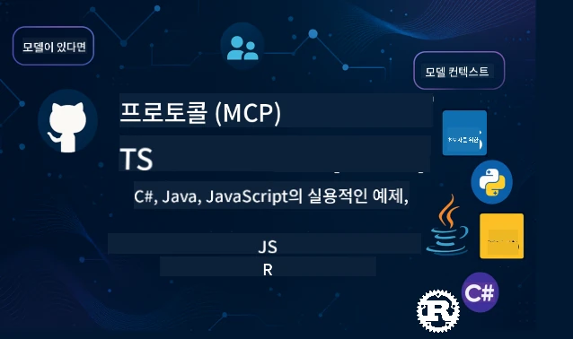

 

[](https://GitHub.com/microsoft/mcp-for-beginners/graphs/contributors)
[](https://GitHub.com/microsoft/mcp-for-beginners/issues)
[](https://GitHub.com/microsoft/mcp-for-beginners/pulls)
[](http://makeapullrequest.com)
[](https://mcptoplist.com/server/mcp.so%2Fmcp-for-beginners%2Fmicrosoft)

[](https://GitHub.com/microsoft/mcp-for-beginners/watchers)
[](https://GitHub.com/microsoft/mcp-for-beginners/fork)
[](https://GitHub.com/microsoft/mcp-for-beginners/stargazers)


[](https://discord.gg/nTYy5BXMWG)

이 리소스를 사용하여 시작하려면 다음 단계를 따르세요:
1. **리포지토리 포크**: 클릭 [](https://GitHub.com/microsoft/mcp-for-beginners/fork)
2. **리포지토리 복제**: `git clone https://github.com/microsoft/mcp-for-beginners.git`
3. <strong>가입하기</strong> [](https://discord.gg/nTYy5BXMWG)


### 🌐 다국어 지원

#### GitHub 액션을 통해 지원 (자동화 및 항상 최신 상태 유지)

<!-- CO-OP TRANSLATOR LANGUAGES TABLE START -->
[Arabic](../ar/README.md) | [Bengali](../bn/README.md) | [Bulgarian](../bg/README.md) | [Burmese (Myanmar)](../my/README.md) | [Chinese (Simplified)](../zh-CN/README.md) | [Chinese (Traditional, Hong Kong)](../zh-HK/README.md) | [Chinese (Traditional, Macau)](../zh-MO/README.md) | [Chinese (Traditional, Taiwan)](../zh-TW/README.md) | [Croatian](../hr/README.md) | [Czech](../cs/README.md) | [Danish](../da/README.md) | [Dutch](../nl/README.md) | [Estonian](../et/README.md) | [Finnish](../fi/README.md) | [French](../fr/README.md) | [German](../de/README.md) | [Greek](../el/README.md) | [Hebrew](../he/README.md) | [Hindi](../hi/README.md) | [Hungarian](../hu/README.md) | [Indonesian](../id/README.md) | [Italian](../it/README.md) | [Japanese](../ja/README.md) | [Kannada](../kn/README.md) | [Khmer](../km/README.md) | [Korean](./README.md) | [Lithuanian](../lt/README.md) | [Malay](../ms/README.md) | [Malayalam](../ml/README.md) | [Marathi](../mr/README.md) | [Nepali](../ne/README.md) | [Nigerian Pidgin](../pcm/README.md) | [Norwegian](../no/README.md) | [Persian (Farsi)](../fa/README.md) | [Polish](../pl/README.md) | [Portuguese (Brazil)](../pt-BR/README.md) | [Portuguese (Portugal)](../pt-PT/README.md) | [Punjabi (Gurmukhi)](../pa/README.md) | [Romanian](../ro/README.md) | [Russian](../ru/README.md) | [Serbian (Cyrillic)](../sr/README.md) | [Slovak](../sk/README.md) | [Slovenian](../sl/README.md) | [Spanish](../es/README.md) | [Swahili](../sw/README.md) | [Swedish](../sv/README.md) | [Tagalog (Filipino)](../tl/README.md) | [Tamil](../ta/README.md) | [Telugu](../te/README.md) | [Thai](../th/README.md) | [Turkish](../tr/README.md) | [Ukrainian](../uk/README.md) | [Urdu](../ur/README.md) | [Vietnamese](../vi/README.md)

> **로컬 복제를 선호하시나요?**
>
> 이 리포지토리는 50개 이상의 언어 번역을 포함하고 있어 다운로드 크기가 크게 늘어납니다. 번역 없이 복제하려면 희소 체크아웃을 사용하세요:
>
> **Bash / macOS / Linux:**
> ```bash
> git clone --filter=blob:none --sparse https://github.com/microsoft/mcp-for-beginners.git
> cd mcp-for-beginners
> git sparse-checkout set --no-cone '/*' '!translations' '!translated_images'
> ```
>
> **CMD (Windows):**
> ```cmd
> git clone --filter=blob:none --sparse https://github.com/microsoft/mcp-for-beginners.git
> cd mcp-for-beginners
> git sparse-checkout set --no-cone "/*" "!translations" "!translated_images"
> ```
>
> 이는 더 빠른 다운로드로 코스를 완료하는 데 필요한 모든 것을 제공합니다.
<!-- CO-OP TRANSLATOR LANGUAGES TABLE END -->

# 🚀 초보자용 모델 컨텍스트 프로토콜(MCP) 커리큘럼

## **C#, Java, JavaScript, Rust, Python, TypeScript로 실습하는 MCP 학습**

## 🧠 모델 컨텍스트 프로토콜 커리큘럼 개요
모델 컨텍스트 프로토콜 여정에 오신 것을 환영합니다! AI 애플리케이션이 다양한 도구와 서비스와 어떻게 통신하는지 궁금했다면, 지금부터 개발자들이 지능형 시스템을 구축하는 방식을 바꾸는 우아한 솔루션을 발견하게 될 것입니다.

MCP를 AI 애플리케이션을 위한 만능 번역기라고 생각해 보세요 – USB 포트가 어떤 기기든 컴퓨터에 연결할 수 있게 해주듯, MCP는 AI 모델이 어떤 도구나 서비스에도 표준화된 방식으로 연결하게 해줍니다. 첫 번째 챗봇을 만들든 복잡한 AI 워크플로우를 작업하든, MCP를 이해하면 더 유능하고 유연한 애플리케이션을 만들 힘을 얻게 됩니다.

이 커리큘럼은 여러분의 학습 여정을 인내심과 세심함으로 설계했습니다. 이미 알고 있는 간단한 개념부터 시작해 좋아하는 프로그래밍 언어로 직접 실습하며 점차 전문성을 쌓아갈 것입니다. 각각의 단계에는 명확한 설명과 실용적인 예제, 그리고 충분한 격려가 포함됩니다.

이 여정을 완료하면 자신만의 MCP 서버를 구축하고 인기 있는 AI 플랫폼과 통합하며 이 기술이 AI 개발의 미래를 어떻게 재편하는지 이해할 수 있게 될 것입니다. 함께 이 흥미진진한 모험을 시작합시다!

### 공식 문서 및 명세서

이 커리큘럼은 **MCP 명세 2025-11-25** (최신 안정 버전)에 맞춰져 있습니다. MCP 명세는 날짜 기반 버전 관리(YYYY-MM-DD 형식)를 사용하여 명확한 프로토콜 버전 추적을 보장합니다.

> **앞으로의 계획:** 다음 명세 버전인 <strong>2026-07-28</strong>의 릴리스 후보가 2026년 7월 28일에 출시될 예정입니다. 이 버전은 전송 계층을 상태 비저장(stateless)으로 만들고, 확장 프레임워크(MCP 앱, 작업)를 공식화하며, 권한 부여를 강화하고 Roots, Sampling 및 Logging을 더 이상 사용하지 않도록 합니다. 전체 내용을 보려면 [MCP의 변경 사항: 2026-07-28 릴리스 후보](./01-CoreConcepts/mcp-2026-07-28-release-candidate.md)를 참조하세요.

이러한 자원들은 이해도가 높아질수록 더 가치 있게 느껴지지만, 당장 모두 읽어야 한다는 부담을 느끼지 마세요. 가장 관심 있는 영역부터 시작하세요!
- 📘 [MCP 문서](https://modelcontextprotocol.io/) – 단계별 튜토리얼과 사용자 가이드로 가득한 주요 자원입니다. 초보자도 따라 하기 쉬운 명확한 예제로 작성되었습니다.
- 📜 [MCP 명세서](https://modelcontextprotocol.io/specification/2025-11-25) – 포괄적인 참고 매뉴얼이라고 생각하세요. 커리큘럼을 진행하며 특정 세부 정보를 찾아보고 고급 기능을 탐구할 때 자주 방문하게 될 것입니다.
- 📜 [MCP 명세 버전 관리](https://modelcontextprotocol.io/specification/versioning) – 프로토콜 버전 이력과 MCP가 날짜 기반 버전 관리 방식을 사용하는 방법에 대한 정보를 제공합니다.
- 🧑‍💻 [MCP GitHub 리포지토리](https://github.com/modelcontextprotocol) – 여러 프로그래밍 언어로 된 SDK, 도구, 코드 샘플을 찾을 수 있는 보물창고입니다.
- 🌐 [MCP 커뮤니티](https://github.com/orgs/modelcontextprotocol/discussions) – MCP에 대해 함께 배우고 경험 많은 개발자들과 토론할 수 있는 지원하는 커뮤니티입니다. 질문도 환영하며 지식을 자유롭게 공유합니다.
  
## 학습 목표

이 커리큘럼을 완료할 때쯤이면 새로운 능력에 대해 자신감과 흥분을 느끼게 될 것입니다. 여러분이 성취할 내용은 다음과 같습니다:

• **MCP 기초 이해하기**: 모델 컨텍스트 프로토콜이 무엇인지, 왜 AI 애플리케이션들이 함께 작동하는 방식을 혁신하는지 적절한 비유와 예제로 이해하게 됩니다.

• **첫 MCP 서버 구축하기**: 선호하는 프로그래밍 언어로 작동하는 MCP 서버를 만들어보며 간단한 예제부터 단계별로 실력을 키워갈 것입니다.

• **AI 모델을 실제 도구에 연결하기**: AI 모델과 실제 서비스를 연결하는 방법을 배우며, 애플리케이션에 강력한 새로운 기능을 부여할 것입니다.

• **보안 모범 사례 구현하기**: MCP 구현을 안전하게 보호하는 방법을 익혀 애플리케이션과 사용자를 모두 지키는 법을 알게 됩니다.

• **자신감을 가지고 배포하기**: MCP 프로젝트를 개발에서 운영까지 현실 세계에서 작동하는 실용적인 배포 전략과 함께 잘 이끌어가는 법을 배울 것입니다.

• **MCP 커뮤니티에 참여하기**: AI 애플리케이션 개발의 미래를 형성하는 성장하는 개발자 커뮤니티의 일원이 될 것입니다.

## 필수 배경지식

MCP 구체적인 내용에 들어가기 전에, 기본 개념들에 대해 편안하게 느끼도록 합시다. 이 분야에 전문가가 아니어도 걱정하지 마세요 - 필요한 모든 것을 함께 설명할 것입니다!

### 프로토콜 이해하기 (기초)

프로토콜은 대화 규칙과 같습니다. 친구에게 전화할 때, 전화를 받으면 "안녕하세요"라고 인사하고, 번갈아 말하며, 끝나면 "안녕"이라고 말하죠. 컴퓨터 프로그램도 효과적으로 통신하려면 이런 규칙이 필요합니다.

MCP는 프로토콜입니다 – AI 모델과 애플리케이션이 도구나 서비스와 건설적인 "대화"를 할 수 있게 도와주는 합의된 규칙 집합입니다. 사람 간 대화 규칙이 소통을 원활하게 하듯, MCP 덕분에 AI 애플리케이션 간 통신이 훨씬 더 신뢰할 수 있고 강력해집니다.

### 클라이언트-서버 관계 (프로그램이 함께 작동하는 방식)

여러분은 매일 클라이언트-서버 관계를 사용하고 있습니다! 웹 브라우저(클라이언트)를 사용해 웹사이트를 방문할 때, 페이지 콘텐츠를 보내주는 웹 서버에 연결합니다. 브라우저는 정보를 요청하는 방법을 알고, 서버는 응답하는 방법을 압니다.

MCP에서도 비슷한 관계가 있습니다: AI 모델은 정보를 요청하거나 작업을 요청하는 클라이언트 역할을 하고, MCP 서버는 그 기능을 제공합니다. 마치 AI가 특정 작업을 수행하도록 요청할 수 있는 도우미(서버)가 있는 것과 같습니다.

### 표준화가 왜 중요한가 (함께 작동하게 만들기)

만약 모든 자동차 제조사가 다른 모양의 주유기를 사용한다면 – 자동차마다 다른 어댑터가 필요하겠죠! 표준화는 원활하게 작동하도록 공통 방식을 합의하는 것을 의미합니다.

MCP는 AI 애플리케이션을 위한 이러한 표준화를 제공합니다. 모든 AI 모델이 각 도구와 작동하기 위해 각각 맞춤 코드를 작성할 필요 없이, MCP는 모두가 통신할 수 있는 보편적인 방식을 만듭니다. 이를 통해 개발자는 도구를 한 번만 만들고 다양한 AI 시스템과 작동하도록 할 수 있습니다.

## 🧭 학습 경로 개요

여러분의 MCP 여정은 자신감과 기술을 점진적으로 쌓도록 신중하게 구조화되어 있습니다. 각 단계는 새 개념을 소개하면서 이미 배운 내용을 강화합니다.

### 🌱 기초 단계: 기본 이해 (모듈 0-2)

모험이 여기서 시작됩니다! 익숙한 비유와 간단한 예제를 사용해 MCP 개념을 소개할 것입니다. MCP가 무엇이고, 왜 존재하며, AI 개발의 더 큰 세계에서 어떻게 적합한지 이해하게 됩니다.


• **모듈 0 - MCP 소개**: MCP가 무엇이며 왜 현대 AI 애플리케이션에 중요한지 탐구하는 것으로 시작합니다. 실제 MCP 사례를 통해 개발자가 직면하는 일반적인 문제를 어떻게 해결하는지 이해할 수 있습니다.

• **모듈 1 - 핵심 개념 설명**: 여기서 MCP의 기본 구성 요소를 배웁니다. 많은 비유와 시각적 예시를 사용하여 이 개념들이 자연스럽고 이해하기 쉽게 만들 것입니다.

• **모듈 2 - MCP 보안**: 보안이 어려워 보일 수 있지만, MCP에 내장된 안전 기능과 애플리케이션을 처음부터 보호하는 최고 관행을 알려 드립니다.

### 🔨 구축 단계: 첫 구현 만들기 (모듈 3)

이제 진짜 재미가 시작됩니다! 실제 MCP 서버와 클라이언트를 직접 만들어 볼 수 있습니다. 걱정하지 마세요 - 간단한 것부터 시작하여 각 단계를 안내해 드립니다.

이 모듈에는 선호하는 프로그래밍 언어로 연습할 수 있는 여러 실습 안내서가 포함되어 있습니다. 첫 서버를 만들고, 서버에 연결할 클라이언트를 구축하며, VS Code와 같은 인기 개발 도구와도 통합할 것입니다.

각 안내서에는 완전한 코드 예제, 문제 해결 팁, 특정 설계 선택 이유에 대한 설명이 포함되어 있습니다. 이 단계를 마치면 자랑스러워할 수 있는 작동하는 MCP 구현물을 갖게 될 것입니다!

### 🚀 성장 단계: 고급 개념과 실제 응용 (모듈 4-5)

기본 사항을 익힌 후에는 더욱 정교한 MCP 기능을 탐구할 준비가 됩니다. 실용적 구현 전략, 디버깅 기술, 다중 모드 AI 통합과 같은 고급 주제를 다룹니다.

또한 생산 환경에서 MCP 구현을 확장하고 Azure와 같은 클라우드 플랫폼과 통합하는 방법도 배우게 됩니다. 이 모듈들은 실제 요구를 처리할 수 있는 MCP 솔루션 구축 준비를 도와줍니다.

### 🌟 마스터 단계: 커뮤니티 및 전문화 (모듈 6-11)

마지막 단계는 MCP 커뮤니티에 참여하고 자신이 가장 관심 있는 분야에 전문화하는 데 중점을 둡니다. 오픈 소스 MCP 프로젝트에 기여하는 방법, 고급 인증 패턴 구현, 종합적인 데이터베이스 통합 솔루션 구축을 배웁니다.

모듈 11은 특별히 주목할 만한데, PostgreSQL 통합과 함께 생산 준비가 된 MCP 서버를 구축하는 13개의 실습 랩으로 구성된 완전한 학습 경로를 제공합니다. 지금까지 배운 모든 것을 결합하는 캡스톤 프로젝트와 같습니다!

### 📚 전체 커리큘럼 구조

| 모듈 | 주제 | 설명 | 링크 |
|--------|-------|-------------|------|
| **모듈 0-3: 기초** | | | |
| 00 | MCP 소개 | 모델 컨텍스트 프로토콜 및 AI 파이프라인에서의 중요성 개요 | [자세히 읽기](./00-Introduction/README.md) |
| 01 | 핵심 개념 설명 | MCP 핵심 개념 상세 탐구 | [자세히 읽기](./01-CoreConcepts/README.md) |
| 1.1 | MCP 변화 내용(2026-07-28 RC) | Stateless 프로토콜, 확장 프레임워크, 다음 명세 버전의 기능 폐기 예정 | [가이드](./01-CoreConcepts/mcp-2026-07-28-release-candidate.md) |
| 02 | MCP 보안 | 보안 위협과 모범 사례 | [자세히 읽기](./02-Security/README.md) |
| 03 | MCP 시작하기 | 환경 설정, 기본 서버/클라이언트, 통합 | [자세히 읽기](./03-GettingStarted/README.md) |
| **모듈 3: 첫 서버 및 클라이언트 구축** | | | |
| 3.1 | 첫 서버 | 첫 번째 MCP 서버 만들기 | [가이드](./03-GettingStarted/01-first-server/README.md) |
| 3.2 | 첫 클라이언트 | 기본 MCP 클라이언트 개발 | [가이드](./03-GettingStarted/02-client/README.md) |
| 3.3 | LLM 클라이언트 | 대형 언어 모델 통합 | [가이드](./03-GettingStarted/03-llm-client/README.md) |
| 3.4 | VS Code 통합 | VS Code에서 MCP 서버 사용 | [가이드](./03-GettingStarted/04-vscode/README.md) |
| 3.5 | stdio 서버 | stdio 전송을 이용한 서버 만들기 | [가이드](./03-GettingStarted/05-stdio-server/README.md) |
| 3.6 | HTTP 스트리밍 | MCP에서 HTTP 스트리밍 구현 | [가이드](./03-GettingStarted/06-http-streaming/README.md) |
| 3.7 | Microsoft Foundry 툴킷 | Microsoft Foundry 툴킷과 MCP 사용 | [가이드](./03-GettingStarted/07-aitk/README.md) |
| 3.8 | 테스트 | MCP 서버 구현 테스트 | [가이드](./03-GettingStarted/08-testing/README.md) |
| 3.9 | 배포 | MCP 서버를 프로덕션에 배포 | [가이드](./03-GettingStarted/09-deployment/README.md) |
| 3.10 | 고급 서버 사용법 | 고급 기능 사용 및 아키텍처 개선을 위한 고급 서버 활용 | [가이드](./03-GettingStarted/10-advanced/README.md) |
| 3.11 | 간단한 인증 | 초기부터 인증 및 RBAC 소개 | [가이드](./03-GettingStarted/11-simple-auth/README.md) |
| 3.12 | MCP 호스트 | Claude Desktop, Cursor, Cline 등 MCP 호스트 설정 | [가이드](./03-GettingStarted/12-mcp-hosts/README.md) |
| 3.13 | MCP 인스펙터 | Inspector 도구로 MCP 서버 디버깅 및 테스트 | [가이드](./03-GettingStarted/13-mcp-inspector/README.md) |
| 3.14 | 샘플링 | 클라이언트와 협업하는 샘플링 사용법 | [가이드](./03-GettingStarted/14-sampling/README.md) |
| 3.15 | MCP 앱 | MCP 앱 구축 | [가이드](./03-GettingStarted/15-mcp-apps/README.md) |
| **모듈 4-5: 실전 및 고급** | | | |
| 04 | 실전 구현 | SDK, 디버깅, 테스트, 재사용 가능한 프롬프트 템플릿 | [자세히 읽기](./04-PracticalImplementation/README.md) |
| 4.1 | 페이지네이션 | 커서 기반 페이지네이션을 이용한 대용량 결과 처리 | [가이드](./04-PracticalImplementation/pagination/README.md) |
| 05 | MCP 고급 주제 | 다중 모드 AI, 확장, 기업용 활용 | [자세히 읽기](./05-AdvancedTopics/README.md) |
| 5.1 | Azure 통합 | MCP와 Azure 통합 | [가이드](./05-AdvancedTopics/mcp-integration/README.md) |
| 5.2 | 다중 모드 | 여러 모달리티 처리 | [가이드](./05-AdvancedTopics/mcp-multi-modality/README.md) |
| 5.3 | OAuth2 데모 | OAuth2 인증 구현 | [가이드](./05-AdvancedTopics/mcp-oauth2-demo/README.md) |
| 5.4 | 루트 컨텍스트 | 루트 컨텍스트 이해 및 구현 | [가이드](./05-AdvancedTopics/mcp-root-contexts/README.md) |
| 5.5 | 라우팅 | MCP 라우팅 전략 | [가이드](./05-AdvancedTopics/mcp-routing/README.md) |
| 5.6 | 샘플링 | MCP 샘플링 기법 | [가이드](./05-AdvancedTopics/mcp-sampling/README.md) |
| 5.7 | 확장 | MCP 구현 확장 | [가이드](./05-AdvancedTopics/mcp-scaling/README.md) |
| 5.8 | 보안 | 고급 보안 고려사항 | [가이드](./05-AdvancedTopics/mcp-security/README.md) |
| 5.9 | 웹 검색 | 웹 검색 기능 구현 | [가이드](./05-AdvancedTopics/web-search-mcp/README.md) |
| 5.10 | 실시간 스트리밍 | 실시간 스트리밍 기능 구축 | [가이드](./05-AdvancedTopics/mcp-realtimestreaming/README.md) |
| 5.11 | 실시간 검색 | 실시간 검색 구현 | [가이드](./05-AdvancedTopics/mcp-realtimesearch/README.md) |
| 5.12 | Entra ID 인증 | Microsoft Entra ID를 통한 인증 | [가이드](./05-AdvancedTopics/mcp-security-entra/README.md) |
| 5.13 | Foundry 통합 | Microsoft Foundry와 통합 | [가이드](./05-AdvancedTopics/mcp-foundry-agent-integration/README.md) |
| 5.14 | 컨텍스트 엔지니어링 | 효율적인 컨텍스트 엔지니어링 기법 | [가이드](./05-AdvancedTopics/mcp-contextengineering/README.md) |
| 5.15 | MCP 맞춤 전송 | 맞춤 전송 구현 | [가이드](./05-AdvancedTopics/mcp-transport/README.md) |
| 5.16 | 프로토콜 기능 | 진행 알림, 취소, 리소스 템플릿 | [가이드](./05-AdvancedTopics/mcp-protocol-features/README.md) |
| 5.17 | 대립 다중 에이전트 추론 | 두 에이전트가 공유 MCP 도구를 사용해 반대 입장 토론, 판사 에이전트가 평가 | [가이드](./05-AdvancedTopics/mcp-adversarial-agents/README.md) |
| **모듈 6-10: 커뮤니티 및 모범 사례** | | | |
| 06 | 커뮤니티 기여 | MCP 생태계에 기여하는 방법 | [가이드](./06-CommunityContributions/README.md) |
| 07 | 초기 도입 인사이트 | 실제 구현 사례 | [가이드](./07-LessonsfromEarlyAdoption/README.md) |
| 08 | MCP 모범 사례 | 성능, 결함 허용, 복원력 | [가이드](./08-BestPractices/README.md) |
| 09 | MCP 사례 연구 | 실용적 구현 예제 | [가이드](./09-CaseStudy/README.md) |
| 10 | 실습 워크숍 | Microsoft Foundry Toolkit으로 MCP 서버 구축 | [랩](./10-StreamliningAIWorkflowsBuildingAnMCPServerWithAIToolkit/README.md) |
| **모듈 11: MCP 서버 실습 랩** | | | |
| 11 | MCP 서버 데이터베이스 통합 | PostgreSQL 통합을 위한 13개 실습 랩 완성 학습 경로 | [랩](./11-MCPServerHandsOnLabs/README.md) |
| 11.1 | 소개 | 데이터베이스 통합과 소매 분석 사용 사례를 포함한 MCP 개요 | [랩 00](./11-MCPServerHandsOnLabs/00-Introduction/README.md) |
| 11.2 | 핵심 아키텍처 | MCP 서버 아키텍처, 데이터베이스 계층, 보안 패턴 이해 | [랩 01](./11-MCPServerHandsOnLabs/01-Architecture/README.md) |
| 11.3 | 보안 및 다중 테넌시 | 행 수준 보안, 인증, 다중 테넌트 데이터 접근 | [랩 02](./11-MCPServerHandsOnLabs/02-Security/README.md) |
| 11.4 | 환경 설정 | 개발 환경, Docker, Azure 자원 설정 | [랩 03](./11-MCPServerHandsOnLabs/03-Setup/README.md) |
| 11.5 | 데이터베이스 설계 | PostgreSQL 설정, 소매 스키마 설계 및 샘플 데이터 | [랩 04](./11-MCPServerHandsOnLabs/04-Database/README.md) |
| 11.6 | MCP 서버 구현 | 데이터베이스 통합을 갖춘 FastMCP 서버 구축 | [랩 05](./11-MCPServerHandsOnLabs/05-MCP-Server/README.md) |
| 11.7 | 도구 개발 | 데이터베이스 쿼리 도구 및 스키마 인트로스펙션 개발 | [랩 06](./11-MCPServerHandsOnLabs/06-Tools/README.md) |
| 11.8 | 의미론적 검색 | Azure OpenAI 및 pgvector를 활용한 벡터 임베딩 구현 | [랩 07](./11-MCPServerHandsOnLabs/07-Semantic-Search/README.md) |
| 11.9 | 테스트 및 디버깅 | 테스트 전략, 디버깅 도구, 검증 방법 | [랩 08](./11-MCPServerHandsOnLabs/08-Testing/README.md) |
| 11.10 | VS Code 통합 | VS Code MCP 통합 구성 및 AI 챗 사용 | [랩 09](./11-MCPServerHandsOnLabs/09-VS-Code/README.md) |
| 11.11 | 배포 전략 | Docker 배포, Azure 컨테이너 앱, 확장 고려사항 | [랩 10](./11-MCPServerHandsOnLabs/10-Deployment/README.md) |
| 11.12 | 모니터링 | Application Insights, 로깅, 성능 모니터링 | [랩 11](./11-MCPServerHandsOnLabs/11-Monitoring/README.md) |
| 11.13 | 모범 사례 | 성능 최적화, 보안 강화, 프로덕션 팁 | [랩 12](./11-MCPServerHandsOnLabs/12-Best-Practices/README.md) |
| **모듈 12: MCP 도구** | | | |
| 12.1 | 도구 | Copilot 앱에서 MCP 사용법 | [가이드](./12-tooling/README.md) |

### 💻 샘플 코드 프로젝트

MCP를 배우는 가장 흥미로운 부분 중 하나는 코드 실력이 점진적으로 발전하는 것을 보는 것입니다. 저희는 코드 예제를 간단하게 시작해 이해가 깊어짐에 따라 점점 더 정교하게 설계했습니다. 다음은 어떻게 개념을 소개하는지입니다 - 이해하기 쉬운 코드이지만 진짜 MCP 원리를 보여줌으로써, 이 코드가 무엇을 하는지 뿐만 아니라 왜 이렇게 구조화되었는지, 더 큰 MCP 애플리케이션에 어떻게 맞춰지는지 이해할 수 있습니다.

#### 기본 MCP 계산기 샘플

| 언어 | 설명 | 링크 |
|----------|-------------|------|

| C# | MCP 서버 예제 | [코드 보기](./03-GettingStarted/samples/csharp/README.md) |
| Java | MCP 계산기 | [코드 보기](./03-GettingStarted/samples/java/calculator/README.md) |
| JavaScript | MCP 데모 | [코드 보기](./03-GettingStarted/samples/javascript/README.md) |
| Python | MCP 서버 | [코드 보기](../../03-GettingStarted/samples/python/mcp_calculator_server.py) |
| TypeScript | MCP 예제 | [코드 보기](./03-GettingStarted/samples/typescript/README.md) |
| Rust | MCP 예제 | [코드 보기](./03-GettingStarted/samples/rust/README.md) |

#### 고급 MCP 구현

| 언어 | 설명 | 링크 |
|----------|-------------|------|
| C# | 고급 샘플 | [코드 보기](./04-PracticalImplementation/samples/csharp/README.md) |
| Java with Spring | 컨테이너 앱 예제 | [코드 보기](./04-PracticalImplementation/samples/java/containerapp/README.md) |
| JavaScript | 고급 샘플 | [코드 보기](./04-PracticalImplementation/samples/javascript/README.md) |
| Python | 복잡한 구현 | [코드 보기](./04-PracticalImplementation/samples/python/README.md) |
| TypeScript | 컨테이너 샘플 | [코드 보기](./04-PracticalImplementation/samples/typescript/README.md) |


## 🎯 MCP 학습 사전 준비 사항

이 커리큘럼을 최대한 활용하려면 다음이 필요합니다:

- 다음 언어 중 최소 하나에 대한 기본 프로그래밍 지식: C#, Java, JavaScript, Python, 또는 TypeScript
- 클라이언트-서버 모델과 API 이해
- REST 및 HTTP 개념에 대한 친숙함
- (선택 사항) AI/ML 개념 배경 지식

- 지원을 위한 커뮤니티 토론 참여

## 📚 학습 가이드 및 자료

이 저장소는 효과적인 학습을 돕기 위한 여러 자료를 포함하고 있습니다:

### 학습 가이드

포괄적인 [학습 가이드](./study_guide.md)가 제공되어 이 저장소를 효과적으로 탐색할 수 있도록 돕습니다. 이 시각적 커리큘럼 맵은 모든 주제 간의 연결을 보여주고 샘플 프로젝트를 효과적으로 사용하는 방법을 안내합니다. 특히 전체적인 그림을 보고 싶어하는 시각 학습자에게 유용합니다.

가이드에는 다음이 포함됩니다:
- 다뤄지는 모든 주제를 보여주는 시각적 커리큘럼 맵
- 각 저장소 섹션의 자세한 분석
- 샘플 프로젝트 사용 방법 안내
- 다양한 실력 수준에 맞춘 학습 경로 추천
- 학습 여정을 보완하는 추가 자료

### 변경 로그

우리는 커리큘럼 자료의 모든 중요한 업데이트를 추적하는 자세한 [변경 로그](./changelog.md)를 유지하여 최신 개선사항과 추가 내용을 확인할 수 있습니다.
- 새로운 콘텐츠 추가
- 구조 변경
- 기능 개선
- 문서 업데이트

## 🛠️ 이 커리큘럼을 효과적으로 사용하는 방법

이 가이드의 각 수업은 다음을 포함합니다:

1. MCP 개념에 대한 명확한 설명  
2. 여러 언어로 된 실시간 코드 예제  
3. 실제 MCP 애플리케이션 개발을 위한 연습 문제  
4. 고급 학습자를 위한 추가 자료

### C#과 함께하는 MCP 학습 - 튜토리얼 시리즈
최신 AI 모델과 클라이언트 애플리케이션 간 상호 작용을 표준화하기 위해 설계된 최첨단 프레임워크인 Model Context Protocol (MCP)에 대해 배워봅시다. 이 초보자 친화적 세션을 통해 MCP를 소개하고 첫 번째 MCP 서버를 만드는 과정을 안내합니다.
#### C#: [https://aka.ms/letslearnmcp-csharp](https://aka.ms/letslearnmcp-csharp)
#### Java: [https://aka.ms/letslearnmcp-java](https://aka.ms/letslearnmcp-java)
#### JavaScript: [https://aka.ms/letslearnmcp-javascript](https://aka.ms/letslearnmcp-javascript)
#### Python: [https://aka.ms/letslearnmcp-python](https://aka.ms/letslearnmcp-python)

## 🎓 당신의 MCP 여정 시작

축하합니다! 이제 프로그래밍 역량을 확장하고 AI 개발의 최첨단과 연결되는 흥미로운 여정의 첫걸음을 내디뎠습니다.

### 지금까지 이루어낸 것들

이 소개 글을 읽으며 이미 MCP 지식의 기초를 쌓기 시작했습니다. MCP가 무엇인지, 왜 중요한지, 그리고 이 커리큘럼이 학습 여정을 어떻게 지원하는지 이해했습니다. 이는 중요한 성취이며 이 중요한 기술에 대한 전문성의 시작입니다.

### 앞으로의 모험

모듈을 진행하면서 모든 전문가도 한때 초보자였다는 것을 기억하세요. 지금은 복잡해 보이는 개념들도 연습하고 적용하면서 자연스러워질 것입니다. 작은 한 걸음 한 걸음이 개발 경력 전반에 도움이 될 강력한 역량으로 쌓입니다.

### 당신의 지원 네트워크

당신은 MCP에 열정을 가진 학습자와 전문가 커뮤니티에 참여하게 되었습니다. 코딩 문제에 막히거나 획기적인 발견을 공유하고 싶을 때, 이 커뮤니티가 당신의 여정을 지원합니다.

AI 앱 개발에 대해 막히거나 질문이 있으면 MCP에 대해 함께 배우는 사람들과 경험 많은 개발자들의 토론에 참여하세요. 질문이 환영받고 지식이 자유롭게 공유되는 지원 커뮤니티입니다.

[](https://discord.gg/nTYy5BXMWG)

제품 피드백이나 빌드 중 오류가 있으면 방문하세요:

[](https://aka.ms/foundry/forum)

### 시작할 준비가 되셨나요?

당신의 MCP 모험이 이제 시작됩니다! 모듈 0부터 시작해 첫 번째 실습 MCP 경험에 뛰어들거나 샘플 프로젝트를 탐색해 어떤 것을 개발할지 확인하세요. 모든 전문가는 지금 당신 위치에서 시작했으며, 인내와 연습을 통해 놀라운 성과를 이루게 될 것입니다.

Model Context Protocol 개발의 세계에 오신 것을 환영합니다. 함께 놀라운 것을 만들어 봅시다!

## 🤝 학습 커뮤니티에 기여하기

이 커리큘럼은 여러분과 같은 학습자들의 기여로 더욱 견고해집니다! 오타 수정, 더 명확한 설명 제안, 새 예제 추가 등 어떤 기여도 초보자들의 성공에 도움이 됩니다.

코드 샘플을 기여해 주신 Microsoft Valued Professional [Shivam Goyal](https://www.linkedin.com/in/shivam2003/)께 감사드립니다.

기여 절차는 환영하고 지원적이도록 설계되었습니다. 대부분의 기여는 Contributor License Agreement(CLA)를 요구하지만, 자동화된 도구가 과정을 원활히 안내합니다.

## 📜 오픈 소스 학습

이 전체 커리큘럼은 MIT [LICENSE](../../LICENSE) 하에 제공되어 자유롭게 사용, 수정, 공유할 수 있습니다. 이는 개발자 누구나 MCP 지식을 이용할 수 있게 하려는 사명을 지원합니다.
## 🤝 기여 가이드라인

이 프로젝트는 기여와 제안을 환영합니다. 대부분의 기여는 다음에 동의해야 합니다.
Contributor License Agreement(CLA)는 귀하가 기여물의 권리를 소유하고 실제로 사용 권한을 부여했음을 선언하는 문서입니다. 자세한 내용은 <https://cla.opensource.microsoft.com>을 참조하세요.


이 프로젝트는 [Microsoft 오픈 소스 행동 강령](https://opensource.microsoft.com/codeofconduct/)을 채택했습니다.
자세한 내용은 [행동 강령 FAQ](https://opensource.microsoft.com/codeofconduct/faq/)를 보거나,


---

*MCP 여정을 시작할 준비가 되셨나요? [Module 00 - MCP 소개](./00-Introduction/README.md)부터 시작해 Model Context Protocol 개발 세계에 첫 발을 내딛으세요!*


## 🎒 기타 과정
저희 팀은 다른 과정도 제작합니다! 확인해 보세요:

<!-- CO-OP TRANSLATOR OTHER COURSES START -->
### LangChain
[](https://aka.ms/langchain4j-for-beginners)
[](https://aka.ms/langchainjs-for-beginners?WT.mc_id=m365-94501-dwahlin)
[](https://github.com/microsoft/langchain-for-beginners?WT.mc_id=m365-94501-dwahlin)
---

### Azure / Edge / MCP / 에이전트
[](https://github.com/microsoft/AZD-for-beginners?WT.mc_id=academic-105485-koreyst)
[](https://github.com/microsoft/edgeai-for-beginners?WT.mc_id=academic-105485-koreyst)
[](https://github.com/microsoft/mcp-for-beginners?WT.mc_id=academic-105485-koreyst)
[](https://github.com/microsoft/ai-agents-for-beginners?WT.mc_id=academic-105485-koreyst)

---
 
### 생성 AI 시리즈
[](https://github.com/microsoft/generative-ai-for-beginners?WT.mc_id=academic-105485-koreyst)
[-9333EA?style=for-the-badge&labelColor=E5E7EB&color=9333EA)](https://github.com/microsoft/Generative-AI-for-beginners-dotnet?WT.mc_id=academic-105485-koreyst)
[-C084FC?style=for-the-badge&labelColor=E5E7EB&color=C084FC)](https://github.com/microsoft/generative-ai-for-beginners-java?WT.mc_id=academic-105485-koreyst)
[-E879F9?style=for-the-badge&labelColor=E5E7EB&color=E879F9)](https://github.com/microsoft/generative-ai-with-javascript?WT.mc_id=academic-105485-koreyst)

---
 
### 핵심 학습
[](https://aka.ms/ml-beginners?WT.mc_id=academic-105485-koreyst)
[](https://aka.ms/datascience-beginners?WT.mc_id=academic-105485-koreyst)
[](https://aka.ms/ai-beginners?WT.mc_id=academic-105485-koreyst)

[](https://github.com/microsoft/Security-101?WT.mc_id=academic-96948-sayoung)
[](https://aka.ms/webdev-beginners?WT.mc_id=academic-105485-koreyst)
[](https://aka.ms/iot-beginners?WT.mc_id=academic-105485-koreyst)
[](https://github.com/microsoft/xr-development-for-beginners?WT.mc_id=academic-105485-koreyst)

---
 
### 코파일럿 시리즈
[](https://aka.ms/GitHubCopilotAI?WT.mc_id=academic-105485-koreyst)
[](https://github.com/microsoft/mastering-github-copilot-for-dotnet-csharp-developers?WT.mc_id=academic-105485-koreyst)
[](https://github.com/microsoft/CopilotAdventures?WT.mc_id=academic-105485-koreyst)
<!-- CO-OP TRANSLATOR OTHER COURSES END -->

---

<!-- CO-OP TRANSLATOR DISCLAIMER START -->
**면책 조항**:
이 문서는 AI 번역 서비스 [Co-op Translator](https://github.com/Azure/co-op-translator)를 사용하여 번역되었습니다. 정확성을 기하기 위해 노력하고 있으나, 자동 번역은 오류나 부정확한 부분이 있을 수 있음을 유의하시기 바랍니다. 원본 문서의 원어본이 권위 있는 자료로 간주되어야 합니다. 중요한 정보의 경우, 전문가의 인간 번역을 권장합니다. 이 번역 사용으로 인해 발생하는 오해나 잘못된 해석에 대해 당사는 책임을 지지 않습니다.
<!-- CO-OP TRANSLATOR DISCLAIMER END -->