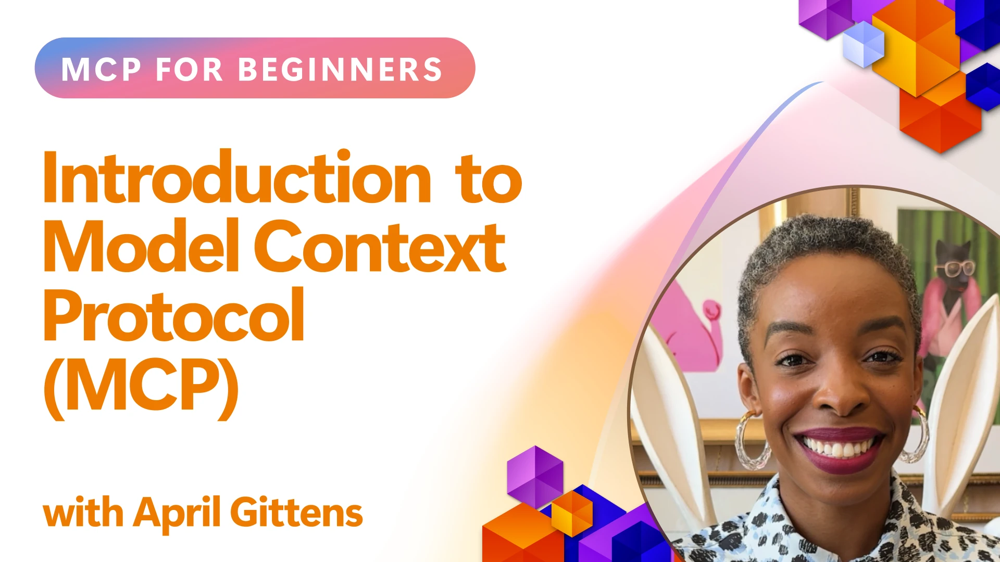
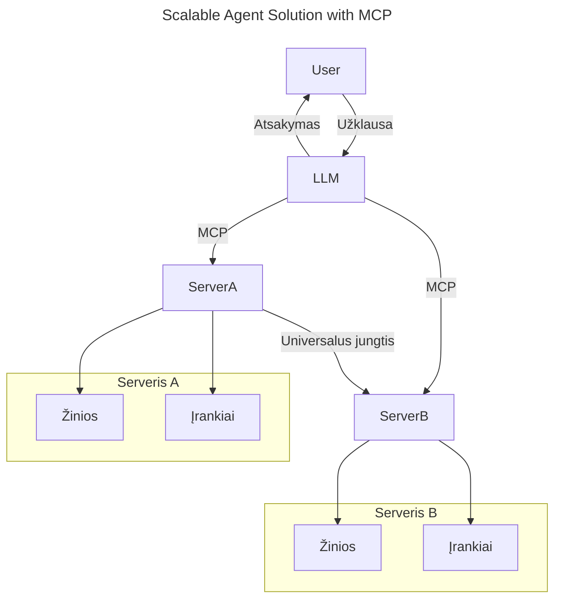
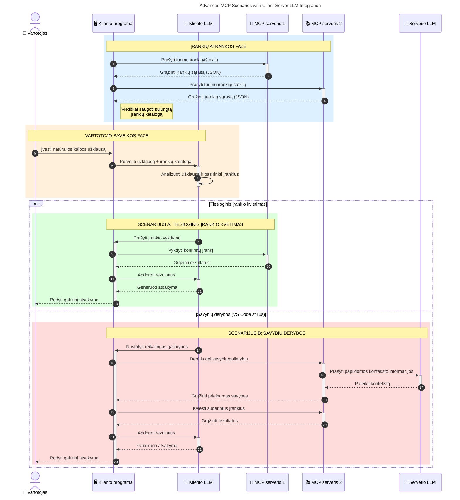

# Įvadas į Modelio Konteksto Protokolą (MCP): Kodėl tai svarbu skaliuojamoms AI programoms

[](https://youtu.be/agBbdiOPLQA)

_(Paspauskite aukščiau esantį paveikslėlį, norėdami peržiūrėti šios pamokos vaizdo įrašą)_

Generatyvinės AI programos yra didelis žingsnis į priekį, nes dažnai leidžia vartotojui bendrauti su programa naudojant natūralios kalbos užklausas. Tačiau, skiriant daugiau laiko ir resursų tokioms programoms, norisi užtikrinti, kad funkcionalumai ir ištekliai būtų lengvai integruojami taip, kad būtų paprasta plėsti programą, kad ji galėtų aptarnauti daugiau nei vieną modelį ir valdyti įvairius modelių sudėtingumus. Trumpai tariant, generatyvinių AI programų kūrimas prasideda lengvai, bet augant jų sudėtingumui, reikia pradėti apibrėžti architektūrą ir tikriausiai remtis standartu, kad programos būtų kuriamos nuosekliai. Būtent čia MCP atlieka svarbų vaidmenį – organizuoja procesus ir suteikia standartą.

---

## **🔍 Kas yra Modelio Konteksto Protokolas (MCP)?**

**Modelio Konteksto Protokolas (MCP)** yra **atvira, standartizuota sąsaja**, leidžianti didiesiems kalbos modeliams (LLM) sklandžiai sąveikauti su išoriniais įrankiais, API ir duomenų šaltiniais. Jis suteikia nuoseklią architektūrą, kuri praplečia AI modelio funkcionalumą už jų mokymo duomenų ribų, leidžiant kurti protingesnes, skaliuojamas ir jautresnes AI sistemas.

---

## **🎯 Kodėl AI standartuose svarbu nustatyti standartus**

Didėjant generatyvinėms AI programoms sudėtingumui, būtina priimti standartus, kurie užtikrintų **skaliavimą, išplečiamumą, palaikomumą** ir **išvengtų tiekėjų priklausomybės**. MCP sprendžia šiuos poreikius:

- Vienyja modelių ir įrankių integracijas
- Sumažina trapias, vienkartines individualias sistema
- Leidžia viename ekosistemoje naudoti kelis įvairių tiekėjų modelius

**Pastaba:** Nors MCP skelbiamas kaip atviras standartas, nėra planų standartizuoti MCP per esamas standartų organizacijas, tokias kaip IEEE, IETF, W3C, ISO ar kitas.

---

## **📚 Mokymosi tikslai**

Šio straipsnio pabaigoje jūs mokėsite:

- Apibrėžti **Modelio Konteksto Protokolą (MCP)** ir jo naudojimo atvejus
- Suprasti, kaip MCP standartizuoja modelio ir įrankių sąveiką
- Identifikuoti pagrindines MCP architektūros sudedamąsias dalis
- Išnagrinėti realaus pasaulio MCP taikymus verslo ir vystymo kontekstuose

---

## **💡 Kodėl Modelio Konteksto Protokolas (MCP) yra žaidimo keitiklis**

### **🔗 MCP sprendžia AI sąveikų fragmentaciją**

Prieš MCP, modelių integracija su įrankiais reikalavo:

- Kodo parašymo kiekvienam įrankio ir modelio porai
- Nestandartinių API kiekvienam tiekėjui
- Dažnų trikdžių dėl naujinimų
- Silpno skaliavimo su didėjančiu įrankių kiekiu

### **✅ MCP standartizavimo privalumai**

| **Privalumas**            | **Aprašymas**                                                                 |
|--------------------------|-------------------------------------------------------------------------------|
| Tarpuveikiamumas          | LLM sklandžiai veikia su įrankiais iš skirtingų tiekėjų                      |
| Nuoseklumas              | Vienoda elgsena tarp platformų ir įrankių                                  |
| Pakartotinumas           | Vieną kartą sukurtus įrankius galima naudoti įvairiuose projektuose ir sistemose |
| Apskaičiuotas vystymas   | Sutrumpina kūrimo laiką naudojant standartizuotas, plug-and-play sąsajas      |

---

## **🧱 Aukšto lygio MCP architektūros apžvalga**

MCP veikia pagal **kliento-serverio modelį**, kai:

- **MCP šeimininkai** valdo AI modelius
- **MCP klientai** inicijuoja užklausas
- **MCP serveriai** tiekia kontekstą, įrankius ir galimybes

### **Pagrindinės sudedamosios dalys:**

- **Ištekliai** – statiniai arba dinaminiai duomenys modeliams  
- **Užklausos (Prompts)** – iš anksto apibrėžtos darbų eigos gairėms generuoti  
- **Įrankiai** – vykdomos funkcijos, tokios kaip paieška, skaičiavimai  
- **Mėginių ėmimas (Sampling)** – agentinė veikla per rekursines sąveikas (nebenaudojama nuo
    MCP `2026-07-28`; nauji įgyvendinimai turėtų tiesiogiai integruotis su LLM
    tiekėju)
- **Ištraukimas (Elicitation)** – serverio inicijuotos vartotojo įvedimo užklausos
- **Šaknys (Roots)** – informacinės failų sistemos vietos, susijusios su serveriu
    (nebenaudojama nuo MCP `2026-07-28`; pageidautina naudoti įrankių parametrus, išteklių URI arba
    serverio konfigūraciją)

### **Protokolo architektūra:**

MCP naudoja dviejų sluoksnių architektūrą:
- **Duomenų sluoksnis**: JSON-RPC 2.0 žinutės, metaduomenys kiekvienai užklausai, atradimas ir
    protokolo primityvai
- **Transporto sluoksnis**: stdio vietos subprocessams ir Streamable HTTP nuotoliniams
    serveriams. Streamable HTTP gali naudoti SSE įrėminimą srautiniams atsakymams,
    bet senesnysis HTTP+SSE transportas yra nebenaudojamas.

---

## Kaip veikia MCP serveriai

MCP serveriai veikia šiuo būdu:

- **Užklausos eiga**:
    1. Užklausą inicijuoja galutinis vartotojas ar jį atstovaujanti programinė įranga.
    2. **MCP klientas** siunčia užklausą **MCP šeimininkui**, kuris valdo AI modelio vykdymą.
    3. **AI modelis** gauna vartotojo užklausą ir gali prašyti prieigos prie išorinių įrankių ar duomenų per vieną ar kelis įrankių skambučius.
    4. Komunikaciją su tinkamais **MCP serveriais** vykdo ne tiesiogiai modelis, o **MCP šeimininkas** pagal standartizuotą protokolą.
- **MCP šeimininko funkcijos**:
    - **Įrankių registras**: palaiko katalogą apie turimus įrankius ir jų galimybes.
    - **Autentifikacija**: patikrina leidimus prieiti prie įrankių.
    - **Užklausų tvarkytojas**: apdoroja atėjusias modelio įrankių užklausas.
    - **Atsakymų formuotojas**: struktūruoja įrankių išvestis modelio suprantamu formatu.
- **MCP serverio vykdymas**:
    - **MCP šeimininkas** nukreipia įrankių skambučius vienam ar keliems specializuotiems **MCP serveriams** (pvz., paieškai, skaičiavimams, duomenų bazės užklausoms).
    - **MCP serveriai** atlieka savo operacijas ir grąžina rezultatus **MCP šeimininkui** nuosekliame formate.
    - **MCP šeimininkas** formuoja ir perduoda rezultatus **AI modeliui**.
- **Atsakymo užbaigimas**:
    - **AI modelis** įtraukia įrankių išvestis į galutinį atsakymą.
    - **MCP šeimininkas** siunčia atsakymą atgal **MCP klientui**, kuris pateikia jį galutiniam vartotojui ar kviečiančiai programai.
    

```mermaid
---
title: MCP Architecture and Component Interactions
description: A diagram showing the flows of the components in MCP.
---
graph TD
    Client[MCP klientas/programa] -->|Siunčia užklausą| H[MCP serveris]
    H -->|Iškviečia| A[DI modelis]
    A -->|Įrankio kvietimo užklausa| H
    H -->|MCP Protocol| T1[MCP Server Tool 01: Žiniatinklio paieška]
    H -->|MCP Protocol| T2[MCP Server Tool 02: Skaičiuoklio įrankis]
    H -->|MCP Protocol| T3[MCP Server Tool 03: Duomenų bazės prieigos įrankis]
    H -->|MCP Protocol| T4[MCP Server Tool 04: Failų sistemos įrankis]
    H -->|Siunčia atsakymą| Client

    subgraph „MCP serverio komponentai“
        H
        G[Įrankių registras]
        I[Autentifikavimas]
        J[Užklausų tvarkytojas]
        K[Atsako formatavimo įrankis]
    end

    H <--> G
    H <--> I
    H <--> J
    H <--> K

    style A fill:#f9d5e5,stroke:#333,stroke-width:2px
    style H fill:#eeeeee,stroke:#333,stroke-width:2px
    style Client fill:#d5e8f9,stroke:#333,stroke-width:2px
    style G fill:#fffbe6,stroke:#333,stroke-width:1px
    style I fill:#fffbe6,stroke:#333,stroke-width:1px
    style J fill:#fffbe6,stroke:#333,stroke-width:1px
    style K fill:#fffbe6,stroke:#333,stroke-width:1px
    style T1 fill:#c2f0c2,stroke:#333,stroke-width:1px
    style T2 fill:#c2f0c2,stroke:#333,stroke-width:1px
    style T3 fill:#c2f0c2,stroke:#333,stroke-width:1px
    style T4 fill:#c2f0c2,stroke:#333,stroke-width:1px
```

## 👨‍💻 Kaip sukurti MCP serverį (pavyzdžiai)

MCP serveriai leidžia išplėsti LLM galimybes suteikiant duomenis ir funkcionalumą. 

Pasiruošę išbandyti? Čia yra kalbų ir/ar technologijų specifiniai SDK su pavyzdžiais, kaip sukurti paprastus MCP serverius skirtingomis kalbomis/tech stiklais:

- **Python SDK**: https://github.com/modelcontextprotocol/python-sdk

- **TypeScript SDK**: https://github.com/modelcontextprotocol/typescript-sdk

- **Java SDK**: https://github.com/modelcontextprotocol/java-sdk

- **C#/.NET SDK**: https://github.com/modelcontextprotocol/csharp-sdk


## 🌍 Realūs MCP naudojimo atvejai

MCP palaiko platų programų spektrą išplėčiant AI galimybes:

| **Panaudojimas**                  | **Aprašymas**                                                                |
|------------------------------|-------------------------------------------------------------------------------|
| Verslo duomenų integracija    | Sujunkite LLM su duomenų bazėmis, CRM ar vidiniais įrankiais                   |
| Agentiniai AI sistemos         | Leidžia autonominius agentus su įrankių prieiga ir sprendimų darbo eigomis    |
| Daugiamodalinės programos      | Sujungia tekstą, vaizdą ir garso įrankius vienoje vieningoje AI programoje    |
| Realių laikų duomenų integracija| Pristato gyvus duomenis AI sąveikoms tikslesniems ir dabartiniams rezultatams |


### 🧠 MCP = Visuotinė AI sąveikų norma

Modelio Konteksto Protokolas (MCP) veikia kaip visuotinė AI sąveikų norma, panašiai kaip USB-C standartizavo fizinius įrenginių jungtis. AI pasaulyje MCP suteikia nuoseklią sąsają, leidžiančią modeliams (klientams) sklandžiai integruotis su išoriniais įrankiais ir duomenų tiekėjais (serveriais). Tai pašalina būtinybę naudoti įvairius, individualius protokolus kiekvienam API ar duomenų šaltiniui.

MCP suderinami įrankiai (vadinami MCP serveriais) laikosi vieningo standarto. Šie serveriai gali pateikti turimus įrankius arba veiksmus ir juos vykdyti, kai AI agentas juos užklausia. AI agentų platformos, kurios palaiko MCP, gali atrasti turimus įrankius iš serverių ir iškvietinėti juos per šį standartizuotą protokolą.

### 💡 Palengvina prieigą prie žinių

Be įrankių teikimo, MCP taip pat palengvina prieigą prie žinių. Jis leidžia programoms pateikti kontekstą didiesiems kalbos modeliams (LLM), susiedamas juos su įvairiais duomenų šaltiniais. Pavyzdžiui, MCP serveris gali atstovauti įmonės dokumentų saugyklą, leidžiant agentams pagal poreikį gauti aktualią informaciją. Kitas serveris gali valdyti konkrečius veiksmus, tokius kaip el. laiškų siuntimas ar įrašų atnaujinimas. Iš agento perspektyvos tai tiesiog įrankiai, kuriuos jis gali naudoti – kai kurie grąžina duomenis (žinių kontekstą), kiti atlieka veiksmus. MCP efektyviai valdo abu.

Agentas, prisijungiantis prie MCP serverio, automatiškai sužino serverio turimas galimybes ir prieinamus duomenis standartiniu formatu. Ši standartizacija leidžia dinamiškai prieinamus įrankius. Pavyzdžiui, pridėjus naują MCP serverį agento sistemoje, jo funkcijos iš karto tampa naudojamos be papildomų agento nurodymų pritaikymų.

Šis sutrumpintas integracijos procesas atitinka žemiau pateiktą diagramą, kur serveriai suteikia tiek įrankius, tiek žinias, užtikrindami sklandų bendradarbiavimą tarp sistemų. 

### 👉 Pavyzdys: skaliuojamas agentų sprendimas


Universali jungtis leidžia MCP serveriams bendrauti ir dalintis funkcijomis tarpusavyje, leidžiant ServerA deleguoti užduotis ServerB arba naudotis jo įrankiais ir žiniomis. Tai federuoja įrankius ir duomenis tarp serverių, remiantis skaliuojamas ir modulinės agentų architektūras. Kadangi MCP standartizuoja įrankių eksponavimą, agentai gali dinamiškai atrasti ir nukreipti užklausas tarp serverių be tiesioginių integracijų kodavime.


Įrankių ir žinių federacija: Įrankiais ir duomenimis galima naudotis per serverius, leidžiant kurti skaliuojamas ir modulinės agentų architektūras.

### 🔄 Pažangūs MCP scenarijai su kliento pusės LLM integracija

Be pagrindinės MCP architektūros, yra pažangių scenarijų, kai tiek kliente, tiek serveryje yra LLM, leidžiant sudėtingesnes sąveikas. Šioje diagramoje **Kliento programa** gali būti IDE su keliais MCP įrankiais, prieinamais LLM naudotojui:



## 🔐 Praktiniai MCP privalumai

Štai praktiniai MCP naudojimo privalumai:

- **Nauja informacija**: Modeliai gali naudotis atnaujinta informacija už jų mokymo duomenų ribų
- **Galimybių išplėtimas**: Modeliai gali naudotis specializuotais įrankiais už mokslo ribų
- **Sumažintas halucinavimas**: Išoriniai duomenų šaltiniai suteikia faktinę pagrindą
- **Privatumas**: Jautrūs duomenys lieka saugioje aplinkoje, o ne įterpti į užklausas

## 📌 Svarbiausios išvados

Svarbiausios išvados apie MCP naudojimą:

- **MCP** standartizuoja, kaip AI modeliai sąveikauja su įrankiais ir duomenimis
- Skatina **išplečiamumą, nuoseklumą ir tarpuveikiamumą**
- MCP padeda **sutrumpinti kūrimo laiką, pagerinti patikimumą ir išplėsti modelio galimybes**
- Kliento-serverio architektūra **leidžia kurti lanksčias ir išplečiamas AI programas**

## 🧠 Užduotis

Pagalvokite apie AI programą, kurią norėtumėte kurti.

- Kokie **išoriniai įrankiai ar duomenys** galėtų sustiprinti jos galimybes?
- Kaip MCP galėtų padaryti integraciją **paprastesnę ir patikimesnę?**

## Papildomi šaltiniai

- [MCP GitHub saugykla](https://github.com/modelcontextprotocol)


## Kas toliau

Toliau: [1 skyrius: Pagrindinės sąvokos](../01-CoreConcepts/README.md)

---

<!-- CO-OP TRANSLATOR DISCLAIMER START -->
**Atsakomybės apribojimas**:
Šis dokumentas buvo išverstas naudojant dirbtinio intelekto vertimo paslaugą [Co-op Translator](https://github.com/Azure/co-op-translator). Nors siekiame tikslumo, prašome atkreipti dėmesį, kad automatiniai vertimai gali turėti klaidų ar netikslumų. Originalus dokumentas jo gimtąja kalba laikomas autoritetingu šaltiniu. Svarbiai informacijai rekomenduojama naudoti profesionalų žmogiškąjį vertimą. Mes neatsakome už jokius nesusipratimus ar neteisingą interpretaciją, kilusią naudojantis šiuo vertimu.
<!-- CO-OP TRANSLATOR DISCLAIMER END -->