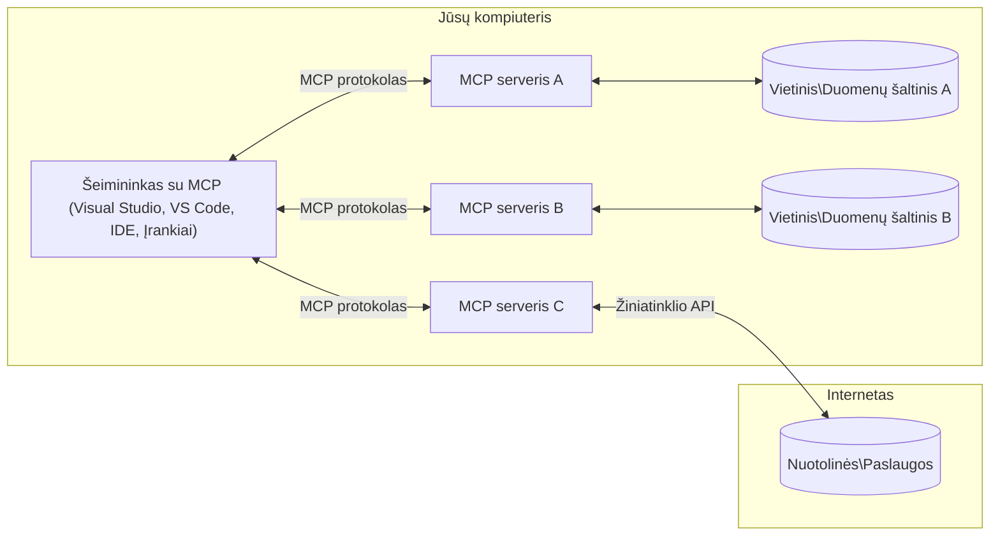

# MCP Pagrindinės Sąvokos: Modelio Konteksto Protokolo Valdymas AI Integracijai

[](https://youtu.be/earDzWGtE84)

_(Spustelėkite aukščiau esantį paveikslėlį, kad peržiūrėtumėte šios pamokos vaizdo įrašą)_

[Modelio Konteksto Protokolas (MCP)](https://github.com/modelcontextprotocol) yra galinga, standartizuota sistema, optimizuojanti komunikaciją tarp Didelių Kalbos Modelių (LLM) ir išorinių įrankių, programų bei duomenų šaltinių.  
Šis vadovas supažindins jus su MCP pagrindinėmis sąvokomis. Sužinosite apie jo klientų-serverių architektūrą, esminius komponentus, komunikacijos mechanizmus ir geriausias įgyvendinimo praktikas.

- **Aiškus Vartotojo Sutikimas**: Visas duomenų prieigos ir operacijos reikalauja aiškaus vartotojo patvirtinimo prieš vykdymą. Vartotojai turi aiškiai suprasti, kokie duomenys bus pasiekiami ir kokie veiksmai bus atliekami, turėdami smulkų leidimų ir autorizacijų valdymą.

- **Duomenų Privatumo Apsauga**: Vartotojo duomenys atskleidžiami tik su aiškiu sutikimu ir turi būti apsaugoti tvirtais prieigos kontrolės mechanizmais viso sąveikos ciklo metu. Įgyvendinimai turi užkirsti kelią neautorizuotam duomenų perdavimui ir išlaikyti griežtas privatumo ribas.

- **Įrankių Vykdymo Saugumas**: Kiekvienas įrankio kvietimas reikalauja aiškaus vartotojo sutikimo su aiškiu supratimu apie įrankio funkcionalumą, parametrus ir galimą poveikį. Tvirti saugumo apribojimai turi užkirsti kelią neplanuotam, nesaugiam ar kenksmingam įrankių vykdymui.

- **Transporto Sluoksnio Saugumas**: Visos komunikacijos kanalai turėtų naudoti tinkamus šifravimo ir autentifikavimo mechanizmus. Nuotoliniai ryšiai turi įgyvendinti saugius transporto protokolus ir tinkamą kredencialų valdymą.

#### Įgyvendinimo gairės:

- **Leidimų Valdymas**: Įgyvendinkite smulkiai reguliuojamas leidimų sistemas, leidžiančias vartotojams kontroliuoti, kurie serveriai, įrankiai ir ištekliai yra pasiekiami  
- **Autentifikacija ir Autorizacija**: Naudokite saugius autentifikacijos metodus (OAuth, API raktus) su tinkamu žetonų valdymu ir galiojimo pabaiga  
- **Įvesties Patikra**: Tikrinkite visus parametrus ir duomenų įvestis pagal apibrėžtas schemas, kad išvengtumėte injekcijos atakų  
- **Auditavimo Žurnalas**: Išlaikykite išsamius visų operacijų žurnalus saugumo stebėsenai ir atitikties užtikrinimui  

## Apžvalga

Šioje pamokoje nagrinėjama pagrindinė Modelio Konteksto Protokolo (MCP) ekosistemos architektūra ir komponentai. Sužinosite apie klientų-serverių architektūrą, pagrindinius komponentus ir komunikacijos mechanizmus, kurie palaiko MCP sąveikas.

## Pagrindiniai Mokymosi Tikslai

Pamokos pabaigoje jūs:

- Suprasite MCP klientų-serverių architektūrą.  
- Nustatysite šeimininkų, klientų ir serverių vaidmenis bei atsakomybes.  
- Išanalizuosite pagrindines savybes, kurios daro MCP lanksčia integracijos sluoksniu.  
- Sužinosite, kaip informacija teka MCP ekosistemoje.  
- Įgysite praktinių žinių per kodo pavyzdžius .NET, Java, Python ir JavaScript kalbomis.

## MCP Architektūra: Gilesnis Žvilgsnis

MCP ekosistema sukurta pagal klientų-serverių modelį. Ši modulinė struktūra leidžia AI programoms efektyviai sąveikauti su įrankiais, duomenų bazėmis, API ir kontekstiniais ištekliais. Pažvelkime į šią architektūrą jos pagrindiniuose komponentuose.

Pagrinde MCP laikosi klientų-serverių architektūros, kurioje šeimininko programa gali prisijungti prie kelių serverių:


- **MCP Šeimininkai**: Programos, tokios kaip VSCode, Claude Desktop, IDE ar AI įrankiai, norintys pasiekti duomenis per MCP  
- **MCP Klientai**: Protokolo klientai, palaikantys 1:1 ryšius su serveriais  
- **MCP Serveriai**: Lengvos programos, kurios kiekviena per standartizuotą Modelio Konteksto Protokolą atskleidžia specifines galimybes  
- **Vietiniai Duomenų Šaltiniai**: Jūsų kompiuterio failai, duomenų bazės ir paslaugos, prie kurių MCP serveriai gali saugiai prisijungti  
- **Nuotolinės Paslaugos**: Išorinės sistemos, pasiekiamos internetu, prie kurių MCP serveriai gali jungtis per API.

MCP Protokolas yra besivystantis standartas, naudojantis datos pagrindu versijavimą (YYYY-MM-DD formatu). Dabartinė protokolo versija yra **2025-11-25**. Naujausius atnaujinimus galite matyti [protokolo specifikacijoje](https://modelcontextprotocol.io/specification/2025-11-25/)

### 1. Šeimininkai

Modelio Konteksto Protokole (MCP) **Šeimininkai** yra AI programos, kurios veikia kaip pagrindinė sąsaja, per kurią vartotojai sąveikauja su protokolu. Šeimininkai koordinuoja ir valdo ryšius su keliais MCP serveriais, kurdami atskirus MCP klientus kiekvienam serverio ryšiui. Šeimininkų pavyzdžiai:

- **AI Programos**: Claude Desktop, Visual Studio Code, Claude Code  
- **Kūrimo Aplinkos**: IDE ir kodo redaktoriai su MCP integracija  
- **Individualios Programos**: Specialiai sukurtos AI agentūros ir įrankiai  

**Šeimininkai** yra programos, koordinuojančios AI modelių sąveikas. Jie:

- **Orkestra AI Modelius**: Vykdo arba sąveikauja su LLM, generuodami atsakymus ir koordinuodami AI darbo eigas  
- **Valdo Klientų Ryšius**: Kuria ir palaiko po vieną MCP klientą kiekvienam MCP serverio ryšiui  
- **Valdo Vartotojo Sąsają**: Tvarko pokalbio eigą, vartotojo sąveikas ir atsakymų pateikimą  
- **Užtikrina Saugumą**: Valdo leidimus, saugumo apribojimus ir autentifikaciją  
- **Tvarko Vartotojo Sutikimą**: Valdo vartotojo patvirtinimą dėl duomenų dalijimosi ir įrankių vykdymo  

### 2. Klientai

**Klientai** yra esminiai komponentai, palaikantys dedikuotus vienas prie vieno ryšius tarp Šeimininkų ir MCP serverių. Kiekvienas MCP klientas yra sukuriamas Šeimininko, kad prisijungtų prie konkretaus MCP serverio, užtikrinant organizuotus ir saugius komunikacijos kanalus. Keli klientai leidžia Šeimininkams vienu metu jungtis prie kelių serverių.

**Klientai** yra jungties komponentai šeimininko programoje. Jie:

- **Protokolo Komunikacija**: Siunčia JSON-RPC 2.0 užklausas serveriams su užklausomis ir instrukcijomis  
- **Galimybių Derybos**: Derasi dėl palaikomų funkcijų ir protokolo versijų su serveriais inicijavimo metu  
- **Įrankių Vykdymas**: Tvarko įrankių vykdymo užklausas iš modelių ir apdoroja atsakymus  
- **Realaus Laiko Atnaujinimai**: Tvarko pranešimus ir realaus laiko atnaujinimus iš serverių  
- **Atsakymų Apdorojimas**: Apdoroja ir formatuoja serverių atsakymus vartotojams pateikti  

### 3. Serveriai

**Serveriai** yra programos, teikiančios kontekstą, įrankius ir galimybes MCP klientams. Jie gali veikti lokaliai (toje pačioje mašinoje kaip Šeimininkas) arba nuotoliniu būdu (išorinėse platformose) ir yra atsakingi už klientų užklausų apdorojimą bei struktūruotų atsakymų teikimą. Serveriai atskleidžia specifinį funkcionalumą per standartizuotą Modelio Konteksto Protokolą.

**Serveriai** yra paslaugos, teikiančios kontekstą ir galimybes. Jie:

- **Funkcijų Registracija**: Registruoja ir atskleidžia klientams prieinamus primityvus (išteklius, užklausas, įrankius)  
- **Užklausų Apdorojimas**: Priima ir vykdo įrankių kvietimus, išteklių užklausas ir užklausų užklausas iš klientų  
- **Konteksto Teikimas**: Teikia kontekstinę informaciją ir duomenis, kad pagerintų modelio atsakymus  
- **Būsenos Valdymas**: Išlaiko sesijos būseną ir tvarko būsenos priklausomas sąveikas, kai reikia  
- **Realaus Laiko Pranešimai**: Siunčia pranešimus apie galimybių pokyčius ir atnaujinimus prijungtiems klientams  

Serverius gali kurti bet kas, norintis išplėsti modelio galimybes specializuotu funkcionalumu, ir jie palaiko tiek vietinį, tiek nuotolinį diegimą.

### 4. Serverio Primityvai

Modelio Konteksto Protokolo (MCP) serveriai teikia tris pagrindinius **primityvus**, kurie apibrėžia pagrindinius statybinius blokus turtingoms sąveikoms tarp klientų, šeimininkų ir kalbos modelių. Šie primityvai nurodo, kokio tipo kontekstinė informacija ir veiksmai yra prieinami per protokolą.

MCP serveriai gali atskleisti bet kokią iš šių trijų pagrindinių primityvų kombinaciją:

#### Ištekliai

**Ištekliai** yra duomenų šaltiniai, teikiantys kontekstinę informaciją AI programoms. Jie atstovauja statinį arba dinaminį turinį, kuris gali pagerinti modelio supratimą ir sprendimų priėmimą:

- **Kontekstiniai Duomenys**: Struktūruota informacija ir kontekstas AI modeliui  
- **Žinių Bazės**: Dokumentų saugyklos, straipsniai, vadovai ir moksliniai darbai  
- **Vietiniai Duomenų Šaltiniai**: Failai, duomenų bazės ir vietinės sistemos informacija  
- **Išoriniai Duomenys**: API atsakymai, interneto paslaugos ir nuotoliniai sistemos duomenys  
- **Dinaminis Turinys**: Realaus laiko duomenys, atnaujinami pagal išorines sąlygas  

Ištekliai identifikuojami URI ir palaiko atradimą per `resources/list` bei gavimą per `resources/read` metodus:

```text
file://documents/project-spec.md
database://production/users/schema
api://weather/current
```

#### Užklausos

**Užklausos** yra pakartotinai naudojami šablonai, padedantys struktūruoti sąveikas su kalbos modeliais. Jos suteikia standartizuotus sąveikos modelius ir šablonines darbo eigas:

- **Šabloninės Sąveikos**: Iš anksto struktūruoti pranešimai ir pokalbio pradžios frazės  
- **Darbo Eigos Šablonai**: Standartizuotos sekos dažnoms užduotims ir sąveikoms  
- **Keletas Pavyzdžių**: Pavyzdžiais pagrįsti šablonai modelio instrukcijoms  
- **Sistemos Užklausos**: Pagrindinės užklausos, apibrėžiančios modelio elgesį ir kontekstą  
- **Dinaminiai Šablonai**: Parametrizuotos užklausos, pritaikomos specifiniams kontekstams  

Užklausos palaiko kintamųjų pakeitimą ir gali būti atrandamos per `prompts/list` bei gaunamos su `prompts/get`:

```markdown
Generate a {{task_type}} for {{product}} targeting {{audience}} with the following requirements: {{requirements}}
```

#### Įrankiai

**Įrankiai** yra vykdomos funkcijos, kurias AI modeliai gali iškviesti atlikti specifinius veiksmus. Jie atstovauja MCP ekosistemos „veiksmažodžius“, leidžiančius modeliams sąveikauti su išorinėmis sistemomis:

- **Vykdomos Funkcijos**: Diskretūs veiksmai, kuriuos modeliai gali iškviesti su specifiniais parametrais  
- **Išorinės Sistemos Integracija**: API kvietimai, duomenų bazių užklausos, failų operacijos, skaičiavimai  
- **Unikali Tapatybė**: Kiekvienas įrankis turi unikalų pavadinimą, aprašymą ir parametrų schemą  
- **Struktūruotas Įvestis/Išvestis**: Įrankiai priima patikrintus parametrus ir grąžina struktūruotus, tipizuotus atsakymus  
- **Veiksmų Galimybės**: Leidžia modeliams atlikti realaus pasaulio veiksmus ir gauti gyvus duomenis  

Įrankiai apibrėžiami su JSON Schema parametrų patikrai ir atrandami per `tools/list`, vykdomi per `tools/call`:

```typescript
server.tool(
  "search_products", 
  {
    query: z.string().describe("Search query for products"),
    category: z.string().optional().describe("Product category filter"),
    max_results: z.number().default(10).describe("Maximum results to return")
  }, 
  async (params) => {
    // Vykdyti paiešką ir grąžinti struktūrizuotus rezultatus
    return await productService.search(params);
  }
);
```

## Klientų Primityvai

Modelio Konteksto Protokole (MCP) **klientai** gali atskleisti primityvus, leidžiančius serveriams prašyti papildomų galimybių iš šeimininko programos. Šie kliento pusės primityvai leidžia turtingesnes, interaktyvesnes serverių įgyvendinimo galimybes, kurios gali pasiekti AI modelio galimybes ir vartotojo sąveikas.

### Pavyzdžių Generavimas

**Pavyzdžių generavimas** leidžia serveriams prašyti kalbos modelio užbaigimų iš kliento AI programos. Šis primityvas leidžia serveriams pasiekti LLM galimybes be savo modelio priklausomybių:

- **Modelio Nepriklausomas Prieinamumas**: Serveriai gali prašyti užbaigimų be LLM SDK įtraukimo ar modelio prieigos valdymo  
- **Serverio Inicijuojamas AI**: Leidžia serveriams autonomiškai generuoti turinį naudojant kliento AI modelį  
- **Rekursyvios LLM Sąveikos**: Palaiko sudėtingas situacijas, kai serveriams reikia AI pagalbos apdorojimui  
- **Dinaminis Turinio Generavimas**: Leidžia serveriams kurti kontekstinius atsakymus naudojant šeimininko modelį  

Pavyzdžių generavimas inicijuojamas per `sampling/complete` metodą, kur serveriai siunčia užbaigimo užklausas klientams.

### Informacijos Surinkimas

**Informacijos surinkimas** leidžia serveriams prašyti papildomos informacijos arba patvirtinimo iš vartotojų per kliento sąsają:

- **Vartotojo Įvesties Užklausos**: Serveriai gali prašyti papildomos informacijos, kai reikia įrankio vykdymui  
- **Patvirtinimo Dialogai**: Prašo vartotojo sutikimo jautrioms ar reikšmingoms operacijoms  
- **Interaktyvios Darbo Eigos**: Leidžia serveriams kurti žingsnis po žingsnio vartotojo sąveikas  
- **Dinaminis Parametrų Rinkimas**: Surenka trūkstamus ar pasirenkamus parametrus įrankio vykdymo metu  

Informacijos surinkimo užklausos atliekamos naudojant `elicitation/request` metodą, kad būtų surinkta vartotojo įvestis per kliento sąsają.

### Žurnalo Vedimas

**Žurnalo vedimas** leidžia serveriams siųsti struktūruotus žurnalo pranešimus klientams, skirtus derinimui, stebėsenai ir veiklos matomumui:

- **Derinimo Palaikymas**: Leidžia serveriams pateikti išsamius vykdymo žurnalus trikčių šalinimui  
- **Veiklos Stebėsena**: Siunčia būsenos atnaujinimus ir našumo metrikas klientams  
- **Klaidų Pranešimai**: Pateikia išsamią klaidų kontekstą ir diagnostinę informaciją  
- **Auditavimo Takai**: Kuria išsamius serverio operacijų ir sprendimų žurnalus  

Žurnalo pranešimai siunčiami klientams, siekiant užtikrinti skaidrumą serverio veikloje ir palengvinti derinimą.

## Informacijos Srautas MCP

Modelio Konteksto Protokolas (MCP) apibrėžia struktūruotą informacijos srautą tarp šeimininkų, klientų, serverių ir modelių. Šio srauto supratimas padeda aiškiai matyti, kaip apdorojamos vartotojo užklausos ir kaip išoriniai įrankiai bei duomenų šaltiniai integruojami į modelio atsakymus.

- **Šeimininkas Inicijuoja Ryšį**  
  Šeimininko programa (pvz., IDE ar pokalbių sąsaja) užmezga ryšį su MCP serveriu, dažniausiai per STDIO, WebSocket ar kitą palaikomą transportą.

- **Galimybių Derybos**  
  Klientas (įterptas į šeimininką) ir serveris keičiasi informacija apie palaikomas funkcijas, įrankius, išteklius ir protokolo versijas. Tai užtikrina, kad abi pusės supranta, kokios galimybės yra prieinamos sesijos metu.

- **Vartotojo Užklausa**  
  Vartotojas sąveikauja su šeimininku (pvz., įveda užklausą ar komandą). Šeimininkas surenka šią įvestį ir perduoda ją klientui apdorojimui.

- **Ištekliaus ar Įrankio Naudojimas**  
  - Klientas gali prašyti papildomo konteksto ar išteklių iš serverio (pvz., failų, duomenų bazės įrašų ar žinių bazės straipsnių), kad praturtintų modelio supratimą.  
  - Jei modelis nusprendžia, kad reikalingas įrankis (pvz., duomenų gavimui, skaičiavimui ar API kvietimui), klientas siunčia įrankio kvietimo užklausą serveriui, nurodydamas įrankio pavadinimą ir parametrus.

- **Serverio Vykdymas**  
  Serveris gauna išteklių ar įrankio užklausą, atlieka reikalingas operacijas (pvz., funkcijos vykdymą, duomenų bazės užklausą ar failo gavimą) ir grąžina rezultatus klientui struktūruotu formatu.

- **Atsakymo Generavimas**  
  Klientas integruoja serverio atsakymus (išteklių duomenis, įrankių išvestis ir kt.) į vykstančią modelio sąveiką. Modelis naudoja šią informaciją, kad sugeneruotų išsamų ir kontekstualiai tinkamą atsakymą.

- **Rezultato Pateikimas**  
  Šeimininkas gauna galutinį klientų išvestį ir pateikia ją vartotojui, dažnai įtraukiant tiek modelio sugeneruotą tekstą, tiek įrankių vykdymo ar išteklių paieškos rezultatus.

Šis srautas leidžia MCP palaikyti pažangias, interaktyvias ir kontekstualiai jautrias AI programas, sklandžiai jungiant modelius su išoriniais įrankiais ir duomenų šaltiniais.

## Protokolo Architektūra ir Sluoksniai

MCP susideda iš dviejų atskirų architektūrinių sluoksnių, kurie veikia kartu, kad suteiktų pilną komunikacijos sistemą:

### Duomenų Sluoksnis

**Duomenų sluoksnis** įgyvendina pagrindinį MCP protokolą, naudodamas **JSON-RPC 2.0** kaip pagrindą. Šis sluoksnis apibrėžia pranešimų struktūrą, semantiką ir sąveikos modelius:

#### Pagrindiniai Komponentai:

- **JSON-RPC 2.0 Protokolas**: Visa komunikacija naudoja standartizuotą JSON-RPC 2.0 pranešimų formatą metodų kvietimams, atsakymams ir pranešimams.
- **Gyvavimo ciklo valdymas**: tvarko ryšio inicijavimą, galimybių derinimą ir sesijos užbaigimą tarp klientų ir serverių
- **Serverio primityvai**: leidžia serveriams teikti pagrindines funkcijas per įrankius, išteklius ir užklausas
- **Kliento primityvai**: leidžia serveriams prašyti LLM mėginių, gauti vartotojo įvestį ir siųsti žurnalo pranešimus
- **Realaus laiko pranešimai**: palaiko asinchroninius pranešimus dinamiškiems atnaujinimams be apklausos

#### Pagrindinės savybės:

- **Protokolo versijos derinimas**: naudoja datos pagrindu versijavimą (YYYY-MM-DD) suderinamumui užtikrinti
- **Galimybių atradimas**: klientai ir serveriai keičiasi palaikomų funkcijų informacija inicijavimo metu
- **Būsenos sesijos**: palaiko ryšio būseną per kelis sąveikos kartus konteksto tęstinumui

### Transporto sluoksnis

**Transporto sluoksnis** valdo komunikacijos kanalus, žinučių rėminimą ir autentifikavimą tarp MCP dalyvių:

#### Palaikomi transporto mechanizmai:

1. **STDIO transportas**:
   - naudoja standartines įvesties/išvesties srautus tiesioginiam procesų bendravimui
   - optimalus vietiniams procesams tame pačiame kompiuteryje be tinklo apkrovos
   - dažnai naudojamas vietinėms MCP serverio įgyvendinimo versijoms

2. **Srautinio HTTP transportas**:
   - naudoja HTTP POST klientų ir serverių žinutėms  
   - neprivalomi Server-Sent Events (SSE) serverio ir kliento srautiniam ryšiui
   - leidžia nuotolinį serverių bendravimą per tinklus
   - palaiko standartinę HTTP autentifikaciją (bearer tokenai, API raktai, pasirinktiniai antraštės)
   - MCP rekomenduoja OAuth saugiam tokenų pagrindu autentifikavimui

#### Transporto abstrakcija:

Transporto sluoksnis abstrahuoja komunikacijos detales nuo duomenų sluoksnio, leidžiant naudoti tą patį JSON-RPC 2.0 žinučių formatą visuose transporto mechanizmuose. Ši abstrakcija leidžia programoms sklandžiai pereiti tarp vietinių ir nuotolinių serverių.

### Saugumo svarstymai

MCP įgyvendinimai privalo laikytis kelių svarbių saugumo principų, kad būtų užtikrintas saugus, patikimas ir apsaugotas bendravimas per visus protokolo veiksmus:

- **Vartotojo sutikimas ir kontrolė**: vartotojai privalo aiškiai sutikti prieš bet kokius duomenų prieigos ar veiksmų vykdymo veiksmus. Jie turi turėti aiškią kontrolę, kokie duomenys dalijami ir kokie veiksmai leidžiami, remiantis intuityviomis vartotojo sąsajomis veiklų peržiūrai ir patvirtinimui.

- **Duomenų privatumas**: vartotojo duomenys turi būti atskleisti tik su aiškiu sutikimu ir apsaugoti tinkamomis prieigos kontrolėmis. MCP įgyvendinimai privalo apsaugoti nuo neautorizuoto duomenų perdavimo ir užtikrinti privatumo išlaikymą per visas sąveikas.

- **Įrankių saugumas**: prieš kviečiant bet kokį įrankį, būtinas aiškus vartotojo sutikimas. Vartotojai turi aiškiai suprasti kiekvieno įrankio funkcionalumą, o griežtos saugumo ribos turi būti taikomos, kad būtų išvengta neplanuoto ar nesaugaus įrankių vykdymo.

Laikantis šių saugumo principų, MCP užtikrina vartotojų pasitikėjimą, privatumą ir saugumą per visus protokolo veiksmus, tuo pačiu leidžiant galingas AI integracijas.

## Kodo pavyzdžiai: pagrindiniai komponentai

Žemiau pateikti kelių populiarių programavimo kalbų kodo pavyzdžiai, iliustruojantys, kaip įgyvendinti pagrindinius MCP serverio komponentus ir įrankius.

### .NET pavyzdys: paprasto MCP serverio kūrimas su įrankiais

Čia pateiktas praktinis .NET kodo pavyzdys, demonstruojantis, kaip įgyvendinti paprastą MCP serverį su pasirinktinais įrankiais. Šis pavyzdys parodo, kaip apibrėžti ir registruoti įrankius, tvarkyti užklausas ir prijungti serverį naudojant Model Context Protocol.

```csharp
using System;
using System.Threading.Tasks;
using ModelContextProtocol.Server;
using ModelContextProtocol.Server.Transport;
using ModelContextProtocol.Server.Tools;

public class WeatherServer
{
    public static async Task Main(string[] args)
    {
        // Create an MCP server
        var server = new McpServer(
            name: "Weather MCP Server",
            version: "1.0.0"
        );
        
        // Register our custom weather tool
        server.AddTool<string, WeatherData>("weatherTool", 
            description: "Gets current weather for a location",
            execute: async (location) => {
                // Call weather API (simplified)
                var weatherData = await GetWeatherDataAsync(location);
                return weatherData;
            });
        
        // Connect the server using stdio transport
        var transport = new StdioServerTransport();
        await server.ConnectAsync(transport);
        
        Console.WriteLine("Weather MCP Server started");
        
        // Keep the server running until process is terminated
        await Task.Delay(-1);
    }
    
    private static async Task<WeatherData> GetWeatherDataAsync(string location)
    {
        // This would normally call a weather API
        // Simplified for demonstration
        await Task.Delay(100); // Simulate API call
        return new WeatherData { 
            Temperature = 72.5,
            Conditions = "Sunny",
            Location = location
        };
    }
}

public class WeatherData
{
    public double Temperature { get; set; }
    public string Conditions { get; set; }
    public string Location { get; set; }
}
```

### Java pavyzdys: MCP serverio komponentai

Šis pavyzdys demonstruoja tą patį MCP serverį ir įrankių registraciją kaip aukščiau pateiktame .NET pavyzdyje, bet įgyvendintą Java kalba.

```java
import io.modelcontextprotocol.server.McpServer;
import io.modelcontextprotocol.server.McpToolDefinition;
import io.modelcontextprotocol.server.transport.StdioServerTransport;
import io.modelcontextprotocol.server.tool.ToolExecutionContext;
import io.modelcontextprotocol.server.tool.ToolResponse;

public class WeatherMcpServer {
    public static void main(String[] args) throws Exception {
        // Sukurkite MCP serverį
        McpServer server = McpServer.builder()
            .name("Weather MCP Server")
            .version("1.0.0")
            .build();
            
        // Užregistruokite orų įrankį
        server.registerTool(McpToolDefinition.builder("weatherTool")
            .description("Gets current weather for a location")
            .parameter("location", String.class)
            .execute((ToolExecutionContext ctx) -> {
                String location = ctx.getParameter("location", String.class);
                
                // Gaukite orų duomenis (supaprastinta)
                WeatherData data = getWeatherData(location);
                
                // Grąžinkite suformatuotą atsakymą
                return ToolResponse.content(
                    String.format("Temperature: %.1f°F, Conditions: %s, Location: %s", 
                    data.getTemperature(), 
                    data.getConditions(), 
                    data.getLocation())
                );
            })
            .build());
        
        // Prisijunkite prie serverio naudodami stdio transportą
        try (StdioServerTransport transport = new StdioServerTransport()) {
            server.connect(transport);
            System.out.println("Weather MCP Server started");
            // Laikykite serverį veikiančią, kol procesas bus nutrauktas
            Thread.currentThread().join();
        }
    }
    
    private static WeatherData getWeatherData(String location) {
        // Įgyvendinimas kvies orų API
        // Supaprastinta pavyzdžio tikslais
        return new WeatherData(72.5, "Sunny", location);
    }
}

class WeatherData {
    private double temperature;
    private String conditions;
    private String location;
    
    public WeatherData(double temperature, String conditions, String location) {
        this.temperature = temperature;
        this.conditions = conditions;
        this.location = location;
    }
    
    public double getTemperature() {
        return temperature;
    }
    
    public String getConditions() {
        return conditions;
    }
    
    public String getLocation() {
        return location;
    }
}
```

### Python pavyzdys: MCP serverio kūrimas

Šis pavyzdys naudoja fastmcp, todėl įsitikinkite, kad jį įdiegėte:

```python
pip install fastmcp
```
Kodo pavyzdys:

```python
#!/usr/bin/env python3
import asyncio
from fastmcp import FastMCP
from fastmcp.transports.stdio import serve_stdio

# Sukurkite FastMCP serverį
mcp = FastMCP(
    name="Weather MCP Server",
    version="1.0.0"
)

@mcp.tool()
def get_weather(location: str) -> dict:
    """Gets current weather for a location."""
    return {
        "temperature": 72.5,
        "conditions": "Sunny",
        "location": location
    }

# Alternatyvus požiūris naudojant klasę
class WeatherTools:
    @mcp.tool()
    def forecast(self, location: str, days: int = 1) -> dict:
        """Gets weather forecast for a location for the specified number of days."""
        return {
            "location": location,
            "forecast": [
                {"day": i+1, "temperature": 70 + i, "conditions": "Partly Cloudy"}
                for i in range(days)
            ]
        }

# Užregistruokite klasės įrankius
weather_tools = WeatherTools()

# Paleiskite serverį
if __name__ == "__main__":
    asyncio.run(serve_stdio(mcp))
```

### JavaScript pavyzdys: MCP serverio kūrimas

Šis pavyzdys rodo MCP serverio kūrimą JavaScript kalba ir kaip užregistruoti du su oru susijusius įrankius.

```javascript
// Naudojant oficialų Model Context Protocol SDK
import { McpServer } from "@modelcontextprotocol/sdk/server/mcp.js";
import { StdioServerTransport } from "@modelcontextprotocol/sdk/server/stdio.js";
import { z } from "zod"; // Parametrų patikrinimui

// Sukurti MCP serverį
const server = new McpServer({
  name: "Weather MCP Server",
  version: "1.0.0"
});

// Apibrėžti orų įrankį
server.tool(
  "weatherTool",
  {
    location: z.string().describe("The location to get weather for")
  },
  async ({ location }) => {
    // Paprastai tai kviečia orų API
    // Supaprastinta demonstracijai
    const weatherData = await getWeatherData(location);
    
    return {
      content: [
        { 
          type: "text", 
          text: `Temperature: ${weatherData.temperature}°F, Conditions: ${weatherData.conditions}, Location: ${weatherData.location}` 
        }
      ]
    };
  }
);

// Apibrėžti prognozavimo įrankį
server.tool(
  "forecastTool",
  {
    location: z.string(),
    days: z.number().default(3).describe("Number of days for forecast")
  },
  async ({ location, days }) => {
    // Paprastai tai kviečia orų API
    // Supaprastinta demonstracijai
    const forecast = await getForecastData(location, days);
    
    return {
      content: [
        { 
          type: "text", 
          text: `${days}-day forecast for ${location}: ${JSON.stringify(forecast)}` 
        }
      ]
    };
  }
);

// Pagalbinės funkcijos
async function getWeatherData(location) {
  // Simuliuoti API kvietimą
  return {
    temperature: 72.5,
    conditions: "Sunny",
    location: location
  };
}

async function getForecastData(location, days) {
  // Simuliuoti API kvietimą
  return Array.from({ length: days }, (_, i) => ({
    day: i + 1,
    temperature: 70 + Math.floor(Math.random() * 10),
    conditions: i % 2 === 0 ? "Sunny" : "Partly Cloudy"
  }));
}

// Prisijungti prie serverio naudojant stdio transportą
const transport = new StdioServerTransport();
server.connect(transport).catch(console.error);

console.log("Weather MCP Server started");
```

Šis JavaScript pavyzdys demonstruoja, kaip sukurti MCP klientą, kuris jungiasi prie serverio, siunčia užklausą ir apdoroja atsakymą, įskaitant bet kokius įrankių kvietimus.

## Saugumas ir autorizacija

MCP apima keletą įmontuotų koncepcijų ir mechanizmų saugumo ir autorizacijos valdymui per visą protokolą:

1. **Įrankių leidimų valdymas**:  
  Klientai gali nurodyti, kuriuos įrankius modelis gali naudoti sesijos metu. Tai užtikrina, kad prieinami tik aiškiai autorizuoti įrankiai, sumažinant neplanuotų ar nesaugių veiksmų riziką. Leidimai gali būti dinamiškai konfigūruojami pagal vartotojo pageidavimus, organizacijos politiką ar sąveikos kontekstą.

2. **Autentifikacija**:  
  Serveriai gali reikalauti autentifikacijos prieš suteikiant prieigą prie įrankių, išteklių ar jautrių veiksmų. Tai gali apimti API raktus, OAuth tokenus ar kitus autentifikacijos mechanizmus. Tinkama autentifikacija užtikrina, kad tik patikimi klientai ir vartotojai gali iškviesti serverio galimybes.

3. **Validacija**:  
  Parametrų validacija taikoma visiems įrankių kvietimams. Kiekvienas įrankis apibrėžia laukiamus tipų, formatų ir apribojimų parametrus, o serveris atitinkamai tikrina gaunamas užklausas. Tai apsaugo nuo netinkamos ar kenksmingos įvesties pateikimo į įrankių įgyvendinimus ir padeda išlaikyti veiksmų vientisumą.

4. **Ribojimas pagal dažnį**:  
  Siekiant išvengti piktnaudžiavimo ir užtikrinti sąžiningą serverio išteklių naudojimą, MCP serveriai gali įgyvendinti kvietimų į įrankius ir išteklių prieigos dažnio ribojimą. Ribojimai gali būti taikomi pagal vartotoją, sesiją ar globaliai, ir padeda apsaugoti nuo paslaugos atsisakymo atakų ar pernelyg didelio išteklių naudojimo.

Derinant šiuos mechanizmus, MCP suteikia saugią pagrindą kalbos modelių integracijai su išoriniais įrankiais ir duomenų šaltiniais, tuo pačiu suteikdama vartotojams ir kūrėjams smulkų prieigos ir naudojimo valdymą.

## Protokolo žinutės ir komunikacijos srautas

MCP komunikacija naudoja struktūruotas **JSON-RPC 2.0** žinutes, kad palengvintų aiškias ir patikimas sąveikas tarp šeimininkų, klientų ir serverių. Protokolas apibrėžia specifinius žinučių modelius skirtingų tipų veiksmams:

### Pagrindiniai žinučių tipai:

#### **Inicijavimo žinutės**
- **`initialize` užklausa**: užmezga ryšį ir derina protokolo versiją bei galimybes
- **`initialize` atsakymas**: patvirtina palaikomas funkcijas ir serverio informaciją  
- **`notifications/initialized`**: signalizuoja, kad inicijavimas baigtas ir sesija paruošta

#### **Atrankos žinutės**
- **`tools/list` užklausa**: atranda serverio turimus įrankius
- **`resources/list` užklausa**: pateikia turimus išteklius (duomenų šaltinius)
- **`prompts/list` užklausa**: gauna turimus užklausų šablonus

#### **Vykdymo žinutės**  
- **`tools/call` užklausa**: vykdo konkretų įrankį su pateiktais parametrais
- **`resources/read` užklausa**: gauna turinį iš konkretaus ištekliaus
- **`prompts/get` užklausa**: gauna užklausos šabloną su neprivalomais parametrais

#### **Kliento pusės žinutės**
- **`sampling/complete` užklausa**: serveris prašo LLM užbaigimo iš kliento
- **`elicitation/request`**: serveris prašo vartotojo įvesties per kliento sąsają
- **Žurnalo žinutės**: serveris siunčia struktūruotus žurnalo pranešimus klientui

#### **Pranešimų žinutės**
- **`notifications/tools/list_changed`**: serveris praneša klientui apie įrankių pasikeitimus
- **`notifications/resources/list_changed`**: serveris praneša klientui apie išteklių pasikeitimus  
- **`notifications/prompts/list_changed`**: serveris praneša klientui apie užklausų pasikeitimus

### Žinučių struktūra:

Visos MCP žinutės atitinka JSON-RPC 2.0 formatą su:
- **Užklausų žinutėmis**: turi `id`, `method` ir neprivalomus `params`
- **Atsakymų žinutėmis**: turi `id` ir arba `result`, arba `error`  
- **Pranešimų žinutėmis**: turi `method` ir neprivalomus `params` (be `id` ir atsakymo)

Ši struktūruota komunikacija užtikrina patikimas, sekamas ir išplečiamas sąveikas, palaikančias pažangias scenarijus, tokius kaip realaus laiko atnaujinimai, įrankių grandinavimas ir patikimas klaidų valdymas.

## Pagrindinės išvados

- **Architektūra**: MCP naudoja klientų-serverių architektūrą, kur šeimininkai valdo kelis klientų ryšius su serveriais
- **Dalyviai**: ekosistemoje yra šeimininkai (AI programos), klientai (protokolo jungtys) ir serveriai (galimybių teikėjai)
- **Transporto mechanizmai**: komunikacija palaiko STDIO (vietinį) ir srautinį HTTP su neprivalomu SSE (nuotolinį)
- **Pagrindiniai primityvai**: serveriai atskleidžia įrankius (vykdomas funkcijas), išteklius (duomenų šaltinius) ir užklausas (šablonus)
- **Kliento primityvai**: serveriai gali prašyti mėginių (LLM užbaigimų), įvedimo (vartotojo įvesties) ir žurnalo iš klientų
- **Protokolo pagrindas**: sukurtas ant JSON-RPC 2.0 su datos pagrindu versijavimu (dabartinė: 2025-11-25)
- **Realaus laiko galimybės**: palaiko pranešimus dinamiškiems atnaujinimams ir realaus laiko sinchronizacijai
- **Saugumas pirmiausia**: aiškus vartotojo sutikimas, duomenų privatumo apsauga ir saugus transportas yra pagrindiniai reikalavimai

## Užduotis

Sukurkite paprastą MCP įrankį, kuris būtų naudingas jūsų srityje. Apibrėžkite:
1. Kaip būtų pavadintas įrankis
2. Kokius parametrus jis priimtų
3. Kokią išvestį jis grąžintų
4. Kaip modelis galėtų naudoti šį įrankį sprendžiant vartotojo problemas


---

## Kas toliau

Toliau: [2 skyrius: Saugumas](../02-Security/README.md)

---

<!-- CO-OP TRANSLATOR DISCLAIMER START -->
**Atsakomybės apribojimas**:  
Šis dokumentas buvo išverstas naudojant dirbtinio intelekto vertimo paslaugą [Co-op Translator](https://github.com/Azure/co-op-translator). Nors siekiame tikslumo, prašome atkreipti dėmesį, kad automatiniai vertimai gali turėti klaidų ar netikslumų. Originalus dokumentas jo gimtąja kalba turėtų būti laikomas autoritetingu šaltiniu. Svarbiai informacijai rekomenduojamas profesionalus žmogaus vertimas. Mes neatsakome už bet kokius nesusipratimus ar neteisingus aiškinimus, kilusius dėl šio vertimo naudojimo.
<!-- CO-OP TRANSLATOR DISCLAIMER END -->