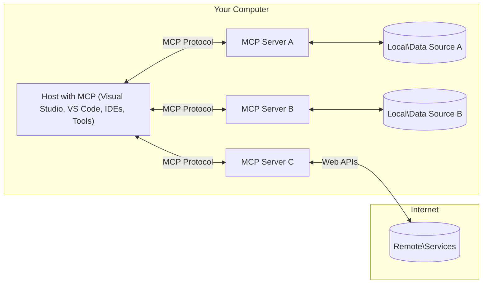

<!--
CO_OP_TRANSLATOR_METADATA:
{
  "original_hash": "88b863a69b4f18b15e82da358ffd3489",
  "translation_date": "2025-08-26T16:10:04+00:00",
  "source_file": "01-CoreConcepts/README.md",
  "language_code": "lt"
}
-->
# MCP Pagrindinės Sąvokos: Modelio Konteksto Protokolo Įvaldymas AI Integracijai

[](https://youtu.be/earDzWGtE84)

_(Spustelėkite aukščiau esančią nuotrauką, kad peržiūrėtumėte šios pamokos vaizdo įrašą)_

[Modelio Konteksto Protokolas (MCP)](https://github.com/modelcontextprotocol) yra galingas, standartizuotas pagrindas, optimizuojantis komunikaciją tarp Didelių Kalbos Modelių (LLM) ir išorinių įrankių, programų bei duomenų šaltinių. Šis vadovas supažindins jus su pagrindinėmis MCP sąvokomis. Sužinosite apie jo klient-serverio architektūrą, esminius komponentus, komunikacijos mechaniką ir geriausias įgyvendinimo praktikas.

- **Aiškus Vartotojo Sutikimas**: Visiems duomenų prieigos ir operacijų veiksmams būtinas aiškus vartotojo patvirtinimas prieš vykdymą. Vartotojai turi aiškiai suprasti, kokie duomenys bus pasiekiami ir kokie veiksmai bus atliekami, turėdami detalią kontrolę dėl leidimų ir autorizacijų.

- **Duomenų Privatumo Apsauga**: Vartotojo duomenys atskleidžiami tik gavus aiškų sutikimą ir turi būti apsaugoti stipriomis prieigos kontrolėmis viso sąveikos ciklo metu. Įgyvendinimas turi užkirsti kelią neautorizuotam duomenų perdavimui ir išlaikyti griežtas privatumo ribas.

- **Įrankių Vykdymo Saugumas**: Kiekvienam įrankio iškvietimui būtinas aiškus vartotojo sutikimas, suprantant įrankio funkcionalumą, parametrus ir galimą poveikį. Turi būti užtikrintos tvirtos saugumo ribos, kad būtų išvengta netyčinio, nesaugaus ar kenkėjiško įrankių vykdymo.

- **Transporto Sluoksnio Saugumas**: Visos komunikacijos turi naudoti tinkamus šifravimo ir autentifikavimo mechanizmus. Nuotoliniai ryšiai turi įgyvendinti saugius transporto protokolus ir tinkamą kredencialų valdymą.

#### Įgyvendinimo Gairės:

- **Leidimų Valdymas**: Įgyvendinkite detalią leidimų sistemą, leidžiančią vartotojams kontroliuoti, kurie serveriai, įrankiai ir resursai yra pasiekiami.
- **Autentifikacija ir Autorizacija**: Naudokite saugius autentifikacijos metodus (OAuth, API raktus) su tinkamu žetonų valdymu ir galiojimo pabaiga.  
- **Įvesties Tikrinimas**: Tikrinkite visus parametrus ir duomenų įvestis pagal apibrėžtas schemas, kad išvengtumėte injekcijos atakų.
- **Audito Žurnalai**: Palaikykite išsamius visų operacijų žurnalus saugumo stebėjimui ir atitikties užtikrinimui.

## Apžvalga

Šioje pamokoje nagrinėjama pagrindinė architektūra ir komponentai, sudarantys Modelio Konteksto Protokolo (MCP) ekosistemą. Sužinosite apie klient-serverio architektūrą, pagrindinius komponentus ir komunikacijos mechanizmus, kurie palaiko MCP sąveikas.

## Pagrindiniai Mokymosi Tikslai

Pamokos pabaigoje jūs:

- Suprasite MCP klient-serverio architektūrą.
- Atpažinsite Šeimininkų, Klientų ir Serverių vaidmenis bei atsakomybes.
- Analizuosite pagrindines MCP savybes, kurios daro jį lanksčiu integracijos sluoksniu.
- Suprasite, kaip informacija teka MCP ekosistemoje.
- Įgysite praktinių įžvalgų per kodo pavyzdžius .NET, Java, Python ir JavaScript kalbomis.

## MCP Architektūra: Išsamesnis Žvilgsnis

MCP ekosistema yra sukurta remiantis klient-serverio modeliu. Ši modulinė struktūra leidžia AI programoms efektyviai sąveikauti su įrankiais, duomenų bazėmis, API ir kontekstiniais resursais. Išskaidykime šią architektūrą į pagrindinius komponentus.

MCP esmė yra klient-serverio architektūra, kurioje pagrindinė programa gali prisijungti prie kelių serverių:



- **MCP Šeimininkai**: Programos, tokios kaip VSCode, Claude Desktop, IDE ar AI įrankiai, norintys pasiekti duomenis per MCP.
- **MCP Klientai**: Protokolo klientai, palaikantys 1:1 ryšius su serveriais.
- **MCP Serveriai**: Lengvos programos, kurios per standartizuotą Modelio Konteksto Protokolą atskleidžia specifines galimybes.
- **Vietiniai Duomenų Šaltiniai**: Jūsų kompiuterio failai, duomenų bazės ir paslaugos, kurias MCP serveriai gali saugiai pasiekti.
- **Nuotolinės Paslaugos**: Išorinės sistemos, pasiekiamos internetu, prie kurių MCP serveriai gali prisijungti per API.

MCP Protokolas yra besivystantis standartas, naudojantis datos pagrindu versijavimą (YYYY-MM-DD formatas). Dabartinė protokolo versija yra **2025-06-18**. Naujausius atnaujinimus galite rasti [protokolo specifikacijoje](https://modelcontextprotocol.io/specification/2025-06-18/).

### 1. Šeimininkai

Modelio Konteksto Protokole (MCP) **Šeimininkai** yra AI programos, kurios veikia kaip pagrindinė sąsaja, per kurią vartotojai sąveikauja su protokolu. Šeimininkai koordinuoja ir valdo ryšius su keliais MCP serveriais, sukurdami dedikuotus MCP klientus kiekvienam serverio ryšiui. Šeimininkų pavyzdžiai:

- **AI Programos**: Claude Desktop, Visual Studio Code, Claude Code.
- **Kūrimo Aplinka**: IDE ir kodo redaktoriai su MCP integracija.  
- **Individualios Programos**: Specialiai sukurtos AI agentai ir įrankiai.

**Šeimininkai** yra programos, koordinuojančios AI modelių sąveikas. Jie:

- **Orkestruoja AI Modelius**: Vykdo arba sąveikauja su LLM, kad generuotų atsakymus ir koordinuotų AI darbo eigas.
- **Valdo Klientų Ryšius**: Kuria ir palaiko vieną MCP klientą kiekvienam MCP serverio ryšiui.
- **Kontroliuoja Vartotojo Sąsają**: Tvarko pokalbių eigą, vartotojo sąveikas ir atsakymų pateikimą.  
- **Užtikrina Saugumą**: Valdo leidimus, saugumo apribojimus ir autentifikaciją.
- **Tvarko Vartotojo Sutikimą**: Valdo vartotojo patvirtinimą dėl duomenų dalijimosi ir įrankių vykdymo.

### 2. Klientai

**Klientai** yra esminiai komponentai, palaikantys dedikuotus vienas su vienu ryšius tarp Šeimininkų ir MCP serverių. Kiekvienas MCP klientas yra inicijuojamas Šeimininko, kad prisijungtų prie specifinio MCP serverio, užtikrinant organizuotus ir saugius komunikacijos kanalus. Keli klientai leidžia Šeimininkams vienu metu prisijungti prie kelių serverių.

**Klientai** yra jungiamieji komponentai Šeimininko programoje. Jie:

- **Protokolo Komunikacija**: Siunčia JSON-RPC 2.0 užklausas serveriams su raginimais ir instrukcijomis.
- **Galimybių Derinimas**: Derina palaikomas funkcijas ir protokolo versijas su serveriais inicijavimo metu.
- **Įrankių Vykdymas**: Tvarko įrankių vykdymo užklausas iš modelių ir apdoroja atsakymus.
- **Realaus Laiko Atnaujinimai**: Tvarko pranešimus ir realaus laiko atnaujinimus iš serverių.
- **Atsakymų Apdorojimas**: Apdoroja ir formatuoja serverių atsakymus vartotojui pateikimui.

### 3. Serveriai

**Serveriai** yra programos, teikiančios kontekstą, įrankius ir galimybes MCP klientams. Jie gali veikti lokaliai (toje pačioje mašinoje kaip Šeimininkas) arba nuotoliniu būdu (išorinėse platformose) ir yra atsakingi už klientų užklausų tvarkymą bei struktūruotų atsakymų pateikimą. Serveriai atskleidžia specifinį funkcionalumą per standartizuotą Modelio Konteksto Protokolą.

**Serveriai** yra paslaugos, teikiančios kontekstą ir galimybes. Jie:

- **Funkcijų Registracija**: Registruoja ir atskleidžia galimus primityvus (resursus, raginimus, įrankius) klientams.
- **Užklausų Tvarkymas**: Priima ir vykdo įrankių iškvietimus, resursų užklausas ir raginimų užklausas iš klientų.
- **Konteksto Teikimas**: Pateikia kontekstinę informaciją ir duomenis, kad pagerintų modelio atsakymus.
- **Būsenos Valdymas**: Palaiko sesijos būseną ir tvarko būsenines sąveikas, kai to reikia.
- **Realaus Laiko Pranešimai**: Siunčia pranešimus apie galimybių pokyčius ir atnaujinimus prijungtiems klientams.

Serverius gali kurti bet kas, norintis išplėsti modelio galimybes specializuotu funkcionalumu, ir jie palaiko tiek lokalius, tiek nuotolinius diegimo scenarijus.

### 4. Serverio Primityvai

Modelio Konteksto Protokolo (MCP) serveriai teikia tris pagrindinius **primityvus**, kurie apibrėžia pagrindinius sąveikos elementus tarp klientų, šeimininkų ir kalbos modelių. Šie primityvai nurodo kontekstinės informacijos ir veiksmų tipus, pasiekiamus per protokolą.

MCP serveriai gali atskleisti bet kokią šių trijų pagrindinių primityvų kombinaciją:

#### Resursai

**Resursai** yra duomenų šaltiniai, teikiantys kontekstinę informaciją AI programoms. Jie atspindi statinį arba dinaminį turinį, kuris gali pagerinti modelio supratimą ir sprendimų priėmimą:

- **Kontekstiniai Duomenys**: Struktūruota informacija ir kontekstas AI modelio suvokimui.
- **Žinių Bazės**: Dokumentų saugyklos, straipsniai, vadovai ir moksliniai darbai.
- **Vietiniai Duomenų Šaltiniai**: Failai, duomenų bazės ir vietinė sistemos informacija.  
- **Išoriniai Duomenys**: API atsakymai, interneto paslaugos ir nuotolinės sistemos duomenys.
- **Dinaminis Turinys**: Realaus laiko duomenys, atnaujinami pagal išorines sąlygas.

Resursai identifikuojami pagal URI ir palaiko atradimą per `resources/list` bei gavimą per `resources/read` metodus:

```text
file://documents/project-spec.md
database://production/users/schema
api://weather/current
```

#### Raginimai

**Raginimai** yra pakartotinai naudojami šablonai, padedantys struktūrizuoti sąveikas su kalbos modeliais. Jie teikia standartizuotus sąveikos modelius ir šabloninius darbo srautus:

- **Šabloninės Sąveikos**: Iš anksto struktūruoti pranešimai ir pokalbių pradžios.
- **Darbo Srautų Šablonai**: Standartizuotos sekos įprastoms užduotims ir sąveikoms.
- **Few-shot Pavyzdžiai**: Pavyzdžiais pagrįsti šablonai modelio instrukcijoms.
- **Sisteminiai Raginimai**: Pagrindiniai raginimai, apibrėžiantys modelio elgesį ir kontekstą.
- **Dinaminiai Šablonai**: Parametruoti raginimai, prisitaikantys prie specifinių kontekstų.

Raginimai palaiko kintamųjų pakeitimą ir gali būti atrandami per `prompts/list` bei gaunami su `prompts/get`:

```markdown
Generate a {{task_type}} for {{product}} targeting {{audience}} with the following requirements: {{requirements}}
```

#### Įrankiai

**Įrankiai** yra vykdomos funkcijos, kurias AI modeliai gali iškviesti tam, kad atliktų specifinius veiksmus. Jie atspindi MCP ekosistemos „veiksmus“, leidžiančius modeliams sąveikauti su išorinėmis sistemomis:

- **Vykdomos Funkcijos**: Konkretūs veiksmai, kuriuos modeliai gali iškviesti su specifiniais parametrais.
- **Išorinių Sistemų Integracija**: API iškvietimai, duomenų bazės užklausos, failų operacijos, skaičiavimai.
- **Unikali Tapatybė**: Kiekvienas įrankis turi unikalų pavadinimą, aprašymą ir parametrų schemą.
- **Struktūruota I/O**: Įrankiai priima patikrintus parametrus ir grąžina struktūruotus, tipizuotus atsakymus.
- **Veiksmų Galimybės**: Leidžia modeliams atlikti realius veiksmus ir gauti tiesioginius duomenis.

Įrankiai apibrėžiami JSON Schema parametrų tikrinimui ir atrandami per `tools/list`, o vykdomi per `tools/call`:

```typescript
server.tool(
  "search_products", 
  {
    query: z.string().describe("Search query for products"),
    category: z.string().optional().describe("Product category filter"),
    max_results: z.number().default(10).describe("Maximum results to return")
  }, 
  async (params) => {
    // Execute search and return structured results
    return await productService.search(params);
  }
);
```

## Klientų Primityvai

Modelio Konteksto Protokole (MCP) **klientai** gali atskleisti primityvus, leidžiančius serveriams prašyti papildomų galimybių iš šeimininko programos. Šie klientų pusės primityvai leidžia kurti turtingesnes, interaktyvesnes serverių implementacijas, kurios gali pasiekti AI modelio galimybes ir vartotojo sąveikas.

### Pavyzdžių Generavimas

**Pavyzdžių Generavimas** leidžia serveriams prašyti kalbos modelio užbaigimų iš kliento AI programos. Šis primityvas suteikia serveriams galimybę pasiekti LLM galimybes be savo modelio priklausomybių:

- **Modelio Nepriklausoma Prieiga**: Serveriai gali prašyti užbaigimų be LLM SDK ar modelio prieigos valdymo.
- **Serverio Inicijuotas AI**: Leidžia serveriams autonomiškai generuoti turinį naudojant kliento AI modelį.
- **Rekursinės LLM Sąveikos**: Palaiko sudėtingus scenarijus, kai serveriams reikia AI pagalbos apdorojimui.
- **Dinaminis Turinys**: Leidžia serveriams kurti kontekstinius atsakymus naudojant šeimininko modelį.

Pavyzdžių generavimas inicijuojamas per `sampling/complete` metodą, kur serveriai siunčia užbaigimo užklausas klientams.

### Informacijos Surinkimas  

**Informacijos Surinkimas** leidžia serveriams prašyti papildomos informacijos ar patvirtinimo iš vartotojų per kliento sąsają:

- **Vartotojo Įvesties Užklausos**: Serveriai gali prašyti papildomos informacijos, kai to reikia įrankio vykdymui.
- **Patvirtinimo Dialogai**: Prašo vartotojo patvirtinimo jautriems ar reikšmingiems veiksmams.
- **Interaktyvūs Darbo Srautai**: Leidžia serveriams kurti žingsnis po žingsnio vartotojo sąveikas.
- **Dinaminis Parametrų Surinkimas**: Surenka trūkstamus ar pasirenkamus parametrus įrankio vykdymo metu.

Informacijos surinkimo užklausos siunčiamos naudojant `elicitation/request` metodą, kad būtų surinkta vartotojo įvestis per kliento sąsają.

### Žurnalavimas

**Žurnalavimas** leidžia serveriams siųsti struktūruotus žurnalų pranešimus klientams, skirtus derinimui, stebėjimui ir operaciniam matomumui:

- **Derinimo Palaikymas**: Leidžia serveriams pateikti detalius vykdymo žurnalus problemų sprendimui.

- **JSON-RPC 2.0 protokolas**: Visa komunikacija vyksta naudojant standartizuotą JSON-RPC 2.0 žinučių formatą metodų iškvietimams, atsakymams ir pranešimams
- **Gyvavimo ciklo valdymas**: Valdo ryšio inicijavimą, galimybių derinimą ir sesijos užbaigimą tarp klientų ir serverių
- **Serverio primityvai**: Leidžia serveriams teikti pagrindines funkcijas per įrankius, išteklius ir užklausas
- **Kliento primityvai**: Leidžia serveriams prašyti LLM pavyzdžių, gauti naudotojo įvestį ir siųsti žurnalo pranešimus
- **Pranešimai realiuoju laiku**: Palaiko asinchroninius pranešimus dinamiškiems atnaujinimams be apklausos

#### Pagrindinės savybės:

- **Protokolo versijos derinimas**: Naudoja datos pagrindu sukurtą versijavimą (YYYY-MM-DD), kad užtikrintų suderinamumą
- **Galimybių aptikimas**: Klientai ir serveriai keičiasi palaikomų funkcijų informacija inicijavimo metu
- **Būseninės sesijos**: Išlaiko ryšio būseną per kelias sąveikas, kad būtų užtikrintas konteksto tęstinumas

### Transporto sluoksnis

**Transporto sluoksnis** valdo komunikacijos kanalus, žinučių įrėminimą ir autentifikaciją tarp MCP dalyvių:

#### Palaikomi transporto mechanizmai:

1. **STDIO transportas**:
   - Naudoja standartinius įvesties/išvesties srautus tiesioginei procesų komunikacijai
   - Optimalus vietiniams procesams toje pačioje mašinoje be tinklo apkrovos
   - Dažnai naudojamas vietinėse MCP serverio įgyvendinimuose

2. **Srautinis HTTP transportas**:
   - Naudoja HTTP POST klientų žinutėms serveriui
   - Pasirenkami Server-Sent Events (SSE) serverio žinutėms klientui
   - Leidžia nuotolinį serverių ryšį per tinklus
   - Palaiko standartinę HTTP autentifikaciją (autentifikacijos žetonai, API raktai, pasirinktinės antraštės)
   - MCP rekomenduoja OAuth saugiai autentifikacijai žetonais

#### Transporto abstrakcija:

Transporto sluoksnis abstrahuoja komunikacijos detales nuo duomenų sluoksnio, leidžiant naudoti tą patį JSON-RPC 2.0 žinučių formatą visuose transporto mechanizmuose. Ši abstrakcija leidžia programoms sklandžiai pereiti tarp vietinių ir nuotolinių serverių.

### Saugumo aspektai

MCP įgyvendinimai turi laikytis kelių svarbių saugumo principų, kad užtikrintų saugias, patikimas ir saugias sąveikas visuose protokolo veiksmuose:

- **Naudotojo sutikimas ir kontrolė**: Naudotojai turi aiškiai sutikti prieš prieinant prie bet kokių duomenų ar atliekant veiksmus. Jie turi turėti aiškią kontrolę, kokie duomenys yra dalijami ir kokie veiksmai yra leidžiami, palaikomi intuityvių naudotojo sąsajų, skirtų veiklų peržiūrai ir patvirtinimui.

- **Duomenų privatumas**: Naudotojo duomenys turi būti atskleisti tik su aiškiu sutikimu ir turi būti apsaugoti tinkamomis prieigos kontrolėmis. MCP įgyvendinimai turi užtikrinti, kad nebūtų neteisėto duomenų perdavimo ir kad privatumas būtų išlaikytas visose sąveikose.

- **Įrankių saugumas**: Prieš iškviečiant bet kokį įrankį, reikalingas aiškus naudotojo sutikimas. Naudotojai turi aiškiai suprasti kiekvieno įrankio funkcionalumą, o tvirti saugumo barjerai turi būti įgyvendinti, kad būtų išvengta netyčinio ar nesaugaus įrankių vykdymo.

Laikantis šių saugumo principų, MCP užtikrina naudotojų pasitikėjimą, privatumą ir saugumą visuose protokolo sąveikose, tuo pačiu leidžiant galingas AI integracijas.

## Kodo pavyzdžiai: pagrindiniai komponentai

Žemiau pateikiami kelių populiarių programavimo kalbų kodo pavyzdžiai, iliustruojantys, kaip įgyvendinti pagrindinius MCP serverio komponentus ir įrankius.

### .NET pavyzdys: paprasto MCP serverio kūrimas su įrankiais

Štai praktinis .NET kodo pavyzdys, rodantis, kaip įgyvendinti paprastą MCP serverį su pasirinktiniais įrankiais. Šis pavyzdys demonstruoja, kaip apibrėžti ir registruoti įrankius, apdoroti užklausas ir prijungti serverį naudojant Model Context Protocol.

```csharp
using System;
using System.Threading.Tasks;
using ModelContextProtocol.Server;
using ModelContextProtocol.Server.Transport;
using ModelContextProtocol.Server.Tools;

public class WeatherServer
{
    public static async Task Main(string[] args)
    {
        // Create an MCP server
        var server = new McpServer(
            name: "Weather MCP Server",
            version: "1.0.0"
        );
        
        // Register our custom weather tool
        server.AddTool<string, WeatherData>("weatherTool", 
            description: "Gets current weather for a location",
            execute: async (location) => {
                // Call weather API (simplified)
                var weatherData = await GetWeatherDataAsync(location);
                return weatherData;
            });
        
        // Connect the server using stdio transport
        var transport = new StdioServerTransport();
        await server.ConnectAsync(transport);
        
        Console.WriteLine("Weather MCP Server started");
        
        // Keep the server running until process is terminated
        await Task.Delay(-1);
    }
    
    private static async Task<WeatherData> GetWeatherDataAsync(string location)
    {
        // This would normally call a weather API
        // Simplified for demonstration
        await Task.Delay(100); // Simulate API call
        return new WeatherData { 
            Temperature = 72.5,
            Conditions = "Sunny",
            Location = location
        };
    }
}

public class WeatherData
{
    public double Temperature { get; set; }
    public string Conditions { get; set; }
    public string Location { get; set; }
}
```

### Java pavyzdys: MCP serverio komponentai

Šis pavyzdys demonstruoja tą patį MCP serverį ir įrankių registraciją kaip aukščiau pateiktame .NET pavyzdyje, tačiau įgyvendintą Java kalba.

```java
import io.modelcontextprotocol.server.McpServer;
import io.modelcontextprotocol.server.McpToolDefinition;
import io.modelcontextprotocol.server.transport.StdioServerTransport;
import io.modelcontextprotocol.server.tool.ToolExecutionContext;
import io.modelcontextprotocol.server.tool.ToolResponse;

public class WeatherMcpServer {
    public static void main(String[] args) throws Exception {
        // Create an MCP server
        McpServer server = McpServer.builder()
            .name("Weather MCP Server")
            .version("1.0.0")
            .build();
            
        // Register a weather tool
        server.registerTool(McpToolDefinition.builder("weatherTool")
            .description("Gets current weather for a location")
            .parameter("location", String.class)
            .execute((ToolExecutionContext ctx) -> {
                String location = ctx.getParameter("location", String.class);
                
                // Get weather data (simplified)
                WeatherData data = getWeatherData(location);
                
                // Return formatted response
                return ToolResponse.content(
                    String.format("Temperature: %.1f°F, Conditions: %s, Location: %s", 
                    data.getTemperature(), 
                    data.getConditions(), 
                    data.getLocation())
                );
            })
            .build());
        
        // Connect the server using stdio transport
        try (StdioServerTransport transport = new StdioServerTransport()) {
            server.connect(transport);
            System.out.println("Weather MCP Server started");
            // Keep server running until process is terminated
            Thread.currentThread().join();
        }
    }
    
    private static WeatherData getWeatherData(String location) {
        // Implementation would call a weather API
        // Simplified for example purposes
        return new WeatherData(72.5, "Sunny", location);
    }
}

class WeatherData {
    private double temperature;
    private String conditions;
    private String location;
    
    public WeatherData(double temperature, String conditions, String location) {
        this.temperature = temperature;
        this.conditions = conditions;
        this.location = location;
    }
    
    public double getTemperature() {
        return temperature;
    }
    
    public String getConditions() {
        return conditions;
    }
    
    public String getLocation() {
        return location;
    }
}
```

### Python pavyzdys: MCP serverio kūrimas

Šiame pavyzdyje parodoma, kaip sukurti MCP serverį naudojant Python. Taip pat pateikiami du skirtingi būdai, kaip sukurti įrankius.

```python
#!/usr/bin/env python3
import asyncio
from mcp.server.fastmcp import FastMCP
from mcp.server.transports.stdio import serve_stdio

# Create a FastMCP server
mcp = FastMCP(
    name="Weather MCP Server",
    version="1.0.0"
)

@mcp.tool()
def get_weather(location: str) -> dict:
    """Gets current weather for a location."""
    # This would normally call a weather API
    # Simplified for demonstration
    return {
        "temperature": 72.5,
        "conditions": "Sunny",
        "location": location
    }

# Alternative approach using a class
class WeatherTools:
    @mcp.tool()
    def forecast(self, location: str, days: int = 1) -> dict:
        """Gets weather forecast for a location for the specified number of days."""
        # This would normally call a weather API forecast endpoint
        # Simplified for demonstration
        return {
            "location": location,
            "forecast": [
                {"day": i+1, "temperature": 70 + i, "conditions": "Partly Cloudy"}
                for i in range(days)
            ]
        }

# Instantiate the class to register its tools
weather_tools = WeatherTools()

# Start the server using stdio transport
if __name__ == "__main__":
    asyncio.run(serve_stdio(mcp))
```

### JavaScript pavyzdys: MCP serverio kūrimas

Šis pavyzdys rodo, kaip sukurti MCP serverį naudojant JavaScript ir kaip registruoti du su oru susijusius įrankius.

```javascript
// Using the official Model Context Protocol SDK
import { McpServer } from "@modelcontextprotocol/sdk/server/mcp.js";
import { StdioServerTransport } from "@modelcontextprotocol/sdk/server/stdio.js";
import { z } from "zod"; // For parameter validation

// Create an MCP server
const server = new McpServer({
  name: "Weather MCP Server",
  version: "1.0.0"
});

// Define a weather tool
server.tool(
  "weatherTool",
  {
    location: z.string().describe("The location to get weather for")
  },
  async ({ location }) => {
    // This would normally call a weather API
    // Simplified for demonstration
    const weatherData = await getWeatherData(location);
    
    return {
      content: [
        { 
          type: "text", 
          text: `Temperature: ${weatherData.temperature}°F, Conditions: ${weatherData.conditions}, Location: ${weatherData.location}` 
        }
      ]
    };
  }
);

// Define a forecast tool
server.tool(
  "forecastTool",
  {
    location: z.string(),
    days: z.number().default(3).describe("Number of days for forecast")
  },
  async ({ location, days }) => {
    // This would normally call a weather API
    // Simplified for demonstration
    const forecast = await getForecastData(location, days);
    
    return {
      content: [
        { 
          type: "text", 
          text: `${days}-day forecast for ${location}: ${JSON.stringify(forecast)}` 
        }
      ]
    };
  }
);

// Helper functions
async function getWeatherData(location) {
  // Simulate API call
  return {
    temperature: 72.5,
    conditions: "Sunny",
    location: location
  };
}

async function getForecastData(location, days) {
  // Simulate API call
  return Array.from({ length: days }, (_, i) => ({
    day: i + 1,
    temperature: 70 + Math.floor(Math.random() * 10),
    conditions: i % 2 === 0 ? "Sunny" : "Partly Cloudy"
  }));
}

// Connect the server using stdio transport
const transport = new StdioServerTransport();
server.connect(transport).catch(console.error);

console.log("Weather MCP Server started");
```

Šis JavaScript pavyzdys demonstruoja, kaip sukurti MCP klientą, kuris jungiasi prie serverio, siunčia užklausą ir apdoroja atsakymą, įskaitant bet kokius įrankių iškvietimus.

## Saugumas ir autorizacija

MCP apima kelias įmontuotas koncepcijas ir mechanizmus, skirtus saugumui ir autorizacijai valdyti visame protokole:

1. **Įrankių leidimų kontrolė**:  
   Klientai gali nurodyti, kokius įrankius modelis gali naudoti sesijos metu. Tai užtikrina, kad prieinami tik aiškiai leidžiami įrankiai, sumažinant netyčinių ar nesaugių veiksmų riziką. Leidimai gali būti dinamiškai konfigūruojami pagal naudotojo pageidavimus, organizacijos politiką ar sąveikos kontekstą.

2. **Autentifikacija**:  
   Serveriai gali reikalauti autentifikacijos prieš suteikiant prieigą prie įrankių, išteklių ar jautrių veiksmų. Tai gali apimti API raktus, OAuth žetonus ar kitas autentifikacijos schemas. Tinkama autentifikacija užtikrina, kad tik patikimi klientai ir naudotojai gali iškviesti serverio galimybes.

3. **Validacija**:  
   Parametrų validacija yra privaloma visiems įrankių iškvietimams. Kiekvienas įrankis apibrėžia laukiamus tipus, formatus ir apribojimus savo parametrams, o serveris atitinkamai tikrina gaunamas užklausas. Tai apsaugo nuo netinkamų ar kenkėjiškų įvestų duomenų ir padeda išlaikyti veiksmų vientisumą.

4. **Kreipinių ribojimas**:  
   Siekiant išvengti piktnaudžiavimo ir užtikrinti sąžiningą serverio išteklių naudojimą, MCP serveriai gali įgyvendinti kreipinių ribojimą įrankių iškvietimams ir išteklių prieigai. Ribos gali būti taikomos vienam naudotojui, sesijai ar globaliai ir padeda apsisaugoti nuo paslaugų trikdymo atakų ar per didelio išteklių naudojimo.

Sujungus šiuos mechanizmus, MCP suteikia saugų pagrindą kalbos modelių integracijai su išoriniais įrankiais ir duomenų šaltiniais, tuo pačiu suteikiant naudotojams ir kūrėjams smulkią prieigos ir naudojimo kontrolę.

## Protokolo žinutės ir komunikacijos eiga

MCP komunikacija naudoja struktūrizuotas **JSON-RPC 2.0** žinutes, kad palengvintų aiškias ir patikimas sąveikas tarp šeimininkų, klientų ir serverių. Protokolas apibrėžia specifinius žinučių šablonus skirtingiems veiksmų tipams:

### Pagrindiniai žinučių tipai:

#### **Inicijavimo žinutės**
- **`initialize` užklausa**: Užmezga ryšį ir derina protokolo versiją bei galimybes
- **`initialize` atsakymas**: Patvirtina palaikomas funkcijas ir serverio informaciją  
- **`notifications/initialized`**: Signalizuoja, kad inicijavimas baigtas ir sesija paruošta

#### **Aptikimo žinutės**
- **`tools/list` užklausa**: Aptinka serverio prieinamus įrankius
- **`resources/list` užklausa**: Išvardija prieinamus išteklius (duomenų šaltinius)
- **`prompts/list` užklausa**: Gauna prieinamus užklausų šablonus

#### **Vykdymo žinutės**  
- **`tools/call` užklausa**: Vykdo konkretų įrankį su pateiktais parametrais
- **`resources/read` užklausa**: Gauna turinį iš konkretaus ištekliaus
- **`prompts/get` užklausa**: Gauna užklausos šabloną su pasirenkamais parametrais

#### **Kliento pusės žinutės**
- **`sampling/complete` užklausa**: Serveris prašo LLM užbaigimo iš kliento
- **`elicitation/request`**: Serveris prašo naudotojo įvesties per kliento sąsają
- **Žurnalo žinutės**: Serveris siunčia struktūrizuotas žurnalo žinutes klientui

#### **Pranešimų žinutės**
- **`notifications/tools/list_changed`**: Serveris praneša klientui apie įrankių pokyčius
- **`notifications/resources/list_changed`**: Serveris praneša klientui apie išteklių pokyčius  
- **`notifications/prompts/list_changed`**: Serveris praneša klientui apie užklausų šablonų pokyčius

### Žinučių struktūra:

Visos MCP žinutės atitinka JSON-RPC 2.0 formatą su:
- **Užklausų žinutėmis**: Apima `id`, `method` ir pasirenkamus `params`
- **Atsakymų žinutėmis**: Apima `id` ir arba `result`, arba `error`  
- **Pranešimų žinutėmis**: Apima `method` ir pasirenkamus `params` (be `id` ar atsakymo)

Ši struktūrizuota komunikacija užtikrina patikimas, atsekamas ir išplečiamas sąveikas, palaikančias pažangius scenarijus, tokius kaip atnaujinimai realiuoju laiku, įrankių grandinės ir tvirtas klaidų valdymas.

## Pagrindinės išvados

- **Architektūra**: MCP naudoja klientų-serverių architektūrą, kur šeimininkai valdo kelis klientų ryšius su serveriais
- **Dalyviai**: Ekosistemą sudaro šeimininkai (AI programos), klientai (protokolo jungtys) ir serveriai (galimybių teikėjai)
- **Transporto mechanizmai**: Komunikacija palaiko STDIO (vietinį) ir srautinius HTTP su pasirenkamu SSE (nuotolinį)
- **Pagrindiniai primityvai**: Serveriai teikia įrankius (vykdomas funkcijas), išteklius (duomenų šaltinius) ir užklausas (šablonus)
- **Kliento primityvai**: Serveriai gali prašyti pavyzdžių (LLM užbaigimų), įvesties (naudotojo įvesties) ir žurnalo iš klientų
- **Protokolo pagrindas**: Sukurtas JSON-RPC 2.0 pagrindu su datos pagrindu sukurtu versijavimu (dabartinė: 2025-06-18)
- **Realaus laiko galimybės**: Palaiko pranešimus dinamiškiems atnaujinimams ir sinchronizavimui realiuoju laiku
- **Saugumas pirmiausia**: Aiškus naudotojo sutikimas, duomenų privatumo apsauga ir saugus transportas yra pagrindiniai reikalavimai

## Užduotis

Sukurkite paprastą MCP įrankį, kuris būtų naudingas jūsų srityje. Apibrėžkite:
1. Kaip įrankis būtų pavadintas
2. Kokius parametrus jis priimtų
3. Kokį rezultatą jis grąžintų
4. Kaip modelis galėtų naudoti šį įrankį naudotojo problemoms spręsti


---

## Kas toliau

Toliau: [2 skyrius: Saugumas](../02-Security/README.md)

---

**Atsakomybės apribojimas**:  
Šis dokumentas buvo išverstas naudojant dirbtinio intelekto vertimo paslaugą [Co-op Translator](https://github.com/Azure/co-op-translator). Nors siekiame tikslumo, atkreipiame dėmesį, kad automatiniai vertimai gali turėti klaidų ar netikslumų. Originalus dokumentas jo gimtąja kalba turėtų būti laikomas autoritetingu šaltiniu. Kritinei informacijai rekomenduojama naudoti profesionalų žmogaus vertimą. Mes neprisiimame atsakomybės už nesusipratimus ar klaidingus aiškinimus, kylančius dėl šio vertimo naudojimo.