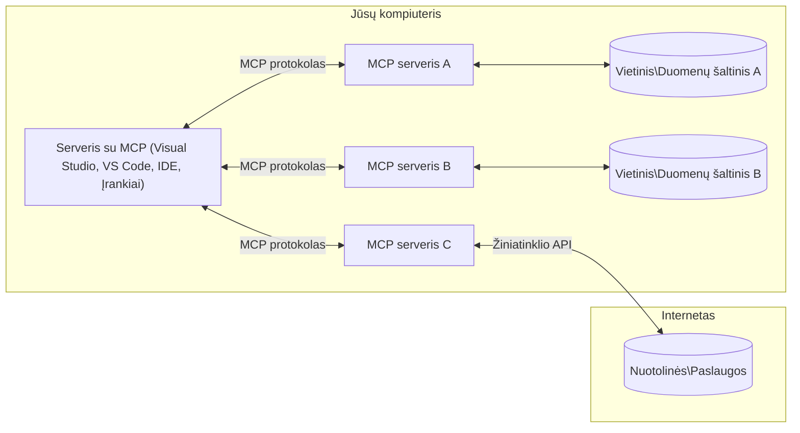

# MCP pagrindinės sąvokos: Modelio Konteksto Protokolo (MCP) įsisavinimas AI integracijai

[](https://youtu.be/earDzWGtE84)

_(Paspauskite aukščiau esantį paveikslėlį, kad peržiūrėtumėte šio pamokos vaizdo įrašą)_

[Modelio Konteksto Protokolas (MCP)](https://github.com/modelcontextprotocol) yra galinga, standartizuota sistema, kuri optimizuoja tarpusavio ryšį tarp Didelių Kalbinių Modelių (LLM) ir išorinių įrankių, programų bei duomenų šaltinių.  
Šis vadovas supažindins jus su MCP pagrindinėmis sąvokomis. Sužinosite apie jo kliento-serverio architektūrą, svarbiausias sudedamąsias dalis, komunikacijos mechanizmus ir gerąsias įdiegimo praktikas.

- **Aiškus Vartotojo Sutikimas**: Visas duomenų prieigos ir veiksmų vykdymas reikalauja aiškaus vartotojo leidimo prieš vykdymą. Vartotojai turi būti aiškiai supažindinti su tuo, kokie duomenys bus prieinami ir kokie veiksmai bus atliekami, turint galimybę smulkiai valdyti leidimus ir teises.

- **Duomenų Privatumo Apsauga**: Vartotojų duomenys pateikiami tik gavus aiškų sutikimą ir turi būti apsaugoti taikant griežtus prieigos kontrolės mechanizmus viso sąveikos ciklo metu. Įgyvendinimai turi neleisti neatitinkamo duomenų perdavimo ir išlaikyti griežtas privatumo ribas.

- **Įrankių Vykdymo Saugumas**: Kiekvienas įrankio kvietimas reikalauja aiškaus vartotojo sutikimo, užtikrinant aiškų supratimą apie įrankio funkcionalumą, parametrus ir galimą poveikį. Griežtos saugumo ribos turi neleisti netyčiniam, nesaugiems ar kenksmingiems įrankių veiksmams.

- **Transporto Sluoksnio Saugumas**: Visos komunikacijos kanalai turėtų naudoti tinkamas šifravimo ir autentifikacijos priemones. Nuotoliniai ryšiai turi būti įgyvendinami naudojant saugius transporto protokolus ir tinkamą prisijungimo duomenų valdymą.

#### Įgyvendinimo gairės:

- **Leidimų valdymas**: Įgyvendinkite smulkiai valdomas leidimų sistemas, leidžiančias vartotojams kontroliuoti, kurie serveriai, įrankiai ir ištekliai yra prieinami  
- **Autentifikacija ir autorizacija**: Naudokite saugius autentifikacijos metodus (OAuth, API raktus) su tinkamu žetonų valdymu ir galiojimo pabaiga  
- **Įvesties patikra**: Tikrinkite visus parametrus ir duomenų įvestis pagal apibrėžtas schemas, kad apsisaugotumėte nuo injekcijų atakų  
- **Audito žurnalavimas**: Išlaikykite išsamius visų operacijų žurnalus saugumo stebėjimui ir atitikties užtikrinimui

## Apžvalga

Ši pamoka nagrinėja pagrindinę Modelio Konteksto Protokolo (MCP) ekosistemos architektūrą ir sudėtines dalis. Sužinosite apie kliento-serverio architektūrą, svarbiausias dalis ir komunikacijos mechanizmus, kurie užtikrina MCP sąveikas.

## Pagrindiniai mokymosi tikslai

Pamokos pabaigoje jūs:

- Suprasite MCP kliento-serverio architektūrą.  
- Identifikuosite Hostų, Klientų ir Serverių vaidmenis ir atsakomybes.  
- Analizuosite pagrindines savybes, dėl kurių MCP yra lankstus integracijos sluoksnis.  
- Sužinosite, kaip informaciją teka MCP ekosistemoje.  
- Įgisite praktinių žinių per kodo pavyzdžius .NET, Java, Python ir JavaScript kalbomis.

## MCP architektūra: detalesnis žvilgsnis

MCP ekosistema pastatyta ant kliento-serverio modelio. Ši modulinė struktūra leidžia AI programoms efektyviai bendrauti su įrankiais, duomenų bazėmis, API ir kontekstiniais ištekliais. Panagrinėkime šią architektūrą jos pagrindinėmis dalimis.

MCP iš esmės veikia pagal kliento-serverio architektūrą, kurioje pagrindinė programa (host) gali prisijungti prie daugelio serverių:


```mermaid
flowchart LR
    subgraph "Jūsų kompiuteris"
        Host["Serveris su MCP (Visual Studio, VS Code, IDE, Įrankiai)"]
        S1["MCP serveris A"]
        S2["MCP serveris B"]
        S3["MCP serveris C"]
        Host <-->|"MCP protokolas"| S1
        Host <-->|"MCP protokolas"| S2
        Host <-->|"MCP protokolas"| S3
        S1 <--> D1[("Vietinis\Duomenų šaltinis A")]
        S2 <--> D2[("Vietinis\Duomenų šaltinis B")]
    end
    subgraph "Internetas"
        S3 <-->|"Žiniatinklio API"| D3[("Nuotolinės\Paslaugos")]
    end
```
- **MCP Hostai**: Programos kaip VSCode, Claude Desktop, IDE ar AI įrankiai, norintys prieiti prie duomenų per MCP  
- **MCP Klientai**: Protokolo klientai, palaikantys vienas prie vieno ryšius su serveriais  
- **MCP Serveriai**: Lengvosios programos, kurios kiekviena per standartizuotą Modelio Konteksto Protokolą atskleidžia specifines galimybes  
- **Vietiniai duomenų šaltiniai**: Jūsų kompiuterio failai, duomenų bazės ir paslaugos, prie kurių MCP serveriai gali saugiai jungtis  
- **Nuotolinės paslaugos**: Išorinės sistemos, pasiekiamos internetu, prie kurių MCP serveriai gali jungtis per API.

MCP Protokolas yra evoliucinė standartizacija, naudojanti datomis pagrįstą versijavimą (YYYY-MM-DD formatu). Dabartinė protokolo versija yra **2025-11-25**. Naujausi pakeitimai ir specifikacija matomi [protokolo specifikacijoje](https://modelcontextprotocol.io/specification/2025-11-25/).

### 1. Hostai

Modelio Konteksto Protokole (MCP) **Hostai** yra AI programos, kurios veikia kaip pagrindinė sąsaja, kuria vartotojai sąveikauja su protokolu. Hostai koordinuoja ir valdo ryšius su keliais MCP serveriais, kiekvienam serveriui kurdami specialius MCP klientus. Pavyzdžiai:

- **AI programos**: Claude Desktop, Visual Studio Code, Claude Code  
- **Kūrimo aplinkos**: IDE ir kodo redaktoriai su MCP integracija  
- **Individualios programos**: Specializuoti AI agentai ir įrankiai

**Hostai** – tai programos, kurios koordinuoja AI modelių sąveikas. Jie:

- **Orkesruoja AI modelius**: Vykdo ar sąveikauja su LLM generuodami atsakymus ir valdydami AI darbo eigas  
- **Valdo klientų ryšius**: Kuria ir palaiko po vieną MCP klientą kiekvienam MCP serverio ryšiui  
- **Valdo vartotojo sąsają**: Tvarko pokalbių eigą, vartotojo sąveikas ir atsakymų pateikimą  
- **Užtikrina saugumą**: Valdo leidimus, saugumo apribojimus ir autentifikaciją  
- **Tvarko vartotojo sutikimą**: Valdo vartotojo leidimus duomenų dalijimuisi ir įrankių vykdymui

### 2. Klientai

**Klientai** yra esminės dalys, kurios palaiko specialius vienas prie vieno ryšius tarp Hostų ir MCP serverių. Kiekvieną MCP klientą sukuria Hostas, kad prisijungtų prie konkretaus MCP serverio, užtikrinant tvarkingus ir saugius komunikacijos kanalus. Daug klientų leidžia Hostams vienu metu jungtis prie kelių serverių.

**Klientai** yra jungties komponentai host programoje. Jie:

- **Protokolo komunikacija**: Siunčia JSON-RPC 2.0 užklausas serveriams su užklausomis ir instrukcijomis  
- **Galimybių derybos**: Derasi dėl palaikomų funkcijų ir protokolo versijų su serveriais inicijavimo metu  
- **Įrankių vykdymas**: Valdo įrankių vykdymo užklausas iš modelių ir apdoroja atsakymus  
- **Realaus laiko atnaujinimai**: Tvarko serverių pranešimus ir realaus laiko atnaujinimus  
- **Atsakymų apdorojimas**: Apdoroja ir formatuoja serverių atsakymus vartotojų atvaizdavimui

### 3. Serveriai

**Serveriai** yra programos, kurios MCP klientams teikia kontekstą, įrankius ir galimybes. Jie gali veikti vietoje (toje pačioje mašinoje kaip Hostas) arba nuotoliniu būdu (išorinėse platformose), ir atsakingi už kliento užklausų apdorojimą bei struktūruotų atsakymų pateikimą. Serveriai atskleidžia specifines funkcijas per standartizuotą Modelio Konteksto Protokolą.

**Serveriai** yra paslaugos, kurios teikia kontekstą ir galimybes. Jie:

- **Funkcijų registracija**: Registruoja ir atskleidžia prieinamas prietaisas (išteklius, užklausas, įrankius) klientams  
- **Užklausų apdorojimas**: Priima ir vykdo įrankių kvietimus, išteklių užklausas ir užkraunamųjų užklausas iš klientų  
- **Konteksto teikimas**: Pateikia kontekstinę informaciją ir duomenis, kad pagerintų modelio atsakymus  
- **Būsenos valdymas**: Išlaiko sesijos būseną ir tvarko būsenos priklausomas sąveikas, kai reikia  
- **Realaus laiko pranešimai**: Siunčia pranešimus apie galimybių pokyčius ir atnaujinimus prijungtiems klientams

Serverius gali kurti bet kas, norint praplėsti modelio galimybes specializuotomis funkcijomis, jie palaiko tiek vietinius, tiek nuotolinius diegimo scenarijus.

### 4. Serverio primityvai

Modelio Konteksto Protokolo (MCP) serveriai teikia tris pagrindinius **primityvus**, kurie apibrėžia pagrindinius elementus turtingoms sąveikoms tarp klientų, hostų ir kalbinių modelių. Šie primityvai nustato, kokio tipo kontekstinė informacija ir veiksmai yra prieinami per protokolą.

MCP serveriai gali atskleisti bet kokį trijų pagrindinių primityvų derinį:

#### Ištekliai

**Ištekliai** yra duomenų šaltiniai, kurie teikia kontekstinę informaciją AI programoms. Jie reprezentuoja statinį arba dinamišką turinį, kuris gali pagerinti modelio supratimą ir sprendimų priėmimą:

- **Kontekstinė informacija**: Strukturizuota informacija ir kontekstas AI modeliui  
- **Žinių bazės**: Dokumentų saugyklos, straipsniai, vadovai ir moksliniai darbai  
- **Vietiniai duomenų šaltiniai**: Failai, duomenų bazės ir vietinė sistemos informacija  
- **Išoriniai duomenys**: API atsakymai, žiniatinklio paslaugos ir nuotoliniai sistemos duomenys  
- **Dinaminis turinys**: Realaus laiko duomenys, kurie atsinaujina pagal išorines sąlygas

Ištekliai identifikuojami URI ir jų paieška vykdoma per `resources/list`, o gavimas – per `resources/read` metodus:

```text
file://documents/project-spec.md
database://production/users/schema
api://weather/current
```

#### Užklausos

**Užklausos** yra pakartotinai naudojamos šabloninės struktūros, kurios padeda organizuoti sąveikas su kalbiniais modeliais. Jos suteikia standartizuotus sąveikos šablonus ir apibrėžtas darbo eigas:

- **Šabloninė sąveika**: Iš anksto suformuotos žinutės ir pokalbio pradžios konstrukcijos  
- **Darbo eigos šablonai**: Standartizuotos sekos dažnoms užduotims ir sąveikoms  
- **Few-shot pavyzdžiai**: Pavyzdiniais naudojami šablonai mokymui modeliui  
- **Sistemos užklausos**: Pagrindinės užklausos, kurios apibrėžia modelio elgseną ir kontekstą  
- **Dinaminiai šablonai**: Parametrizuotos užklausos, kurios prisitaiko prie specifinių kontekstų

Užklausos palaiko kintamųjų keitimą ir yra randamos per `prompts/list` bei gauna duomenis per `prompts/get`:

```markdown
Generate a {{task_type}} for {{product}} targeting {{audience}} with the following requirements: {{requirements}}
```

#### Įrankiai

**Įrankiai** yra vykdomos funkcijos, kurias AI modeliai gali kvieti atlikti tam tikrus veiksmus. Jie reprezentuoja MCP ekosistemos „veiksmažodžius“, leidžiančius modeliams bendrauti su išorinėmis sistemomis:

- **Vykdomos funkcijos**: Atskiri veiksmai, kuriuos modeliai gali iškviesti su specifiniais parametrais  
- **Išorinių sistemų integracija**: API kvietimai, duomenų bazių užklausos, failų operacijos, skaičiavimai  
- **Unikali tapatybė**: Kiekvienas įrankis turi unikalų pavadinimą, aprašymą ir parametrų schemą  
- **Struktūruotas įėjimas/išėjimas**: Įrankiai priima patikrintus parametrus ir grąžina struktūruotus, tipizuotus atsakymus  
- **Veiksmų galimybės**: Leidžia modeliams atlikti realius veiksmus ir gauti gyvus duomenis

Įrankiai aprašomi JSON Schema parametrais ir yra randami per `tools/list`, kviečiami su `tools/call`. Įrankiai taip pat gali turėti **piktogramas** kaip papildomą metaduomenį geresniam UI pateikimui.

**Įrankių anotacijos**: Įrankiai palaiko elgsenos anotacijas (pvz., `readOnlyHint`, `destructiveHint`), kurios nurodo, ar įrankis yra tik skaitymui skirtas ar žalingas, padėdamos klientams priimti informuotus sprendimus dėl įrankių vykdymo.

Įrankio aprašymo pavyzdys:

```typescript
server.tool(
  "search_products", 
  {
    query: z.string().describe("Search query for products"),
    category: z.string().optional().describe("Product category filter"),
    max_results: z.number().default(10).describe("Maximum results to return")
  }, 
  async (params) => {
    // Vykdyti paiešką ir grąžinti struktūruotus rezultatus
    return await productService.search(params);
  }
);
```

## Kliento primityvai

Modelio Konteksto Protokole (MCP) **klientai** gali atskleisti primityvus, leidžiančius serveriams prašyti papildomų galimybių iš host programos. Šie kliento pusės primityvai leidžia kurti turtingesnes, interaktyvesnes serverių implementacijas, kurios gali naudotis AI modelio galimybėmis ir vartotojo sąveikomis.

### Pavyzdžių ėmimas (Sampling)

**Sampling** leidžia serveriams prašyti kalbinio modelio užbaigimų iš kliento AI programos. Šis primityvas leidžia serveriams pasiekti LLM galimybes, nepriklausomai nuo jų įtaisytų modelių:

- **Modeliui nepriklausoma prieiga**: serveriai gali prašyti užbaigimų be LLM SDK diegimo ar modelio prieigos valdymo  
- **Serverio inicijuotas AI**: serveriai gali savarankiškai generuoti turinį naudodami kliento AI modelį  
- **Rekursyvi LLM sąveika**: palaiko sudėtingus scenarijus, kai serveriams reikia AI pagalbos apdorojimui  
- **Dinaminis turinio generavimas**: leidžia serveriams kurti kontekstinius atsakymus naudojant host tikro modelio pajėgumus  
- **Įrankių kvietimų palaikymas**: serveriai gali pridėti `tools` ir `toolChoice` parametrus, kad leistų kliento modeliui kvietinėti įrankius per užbaigimą

Sampling pradedamas per metodą `sampling/complete`, kuriuo serveriai siunčia užbaigimo užklausas klientams.

### Įsišaknijimai (Roots)

**Roots** suteikia standartizuotą būdą klientams atskleisti failų sistemos ribas serveriams, padedant serveriams suprasti, prie kurių katalogų ir failų jie turi prieigą:

- **Failų sistemos ribos**: apibrėžia vietas failų sistemoje, kur serveriai gali veikti  
- **Prieigos kontrolė**: padeda serveriams žinoti, prie kurių katalogų ir failų jie turi teisę prieiti  
- **Dinaminiai atnaujinimai**: klientai gali pranešti serveriams, kai keičiasi šaknų sąrašas  
- **URI identifikacija**: šaknys žymimos `file://` URI, žyminčiais prieinamus katalogus ir failus

Šaknys aptinkamos per metodą `roots/list`, o klientai siunčia pranešimus `notifications/roots/list_changed`, kai šaknys pasikeičia.

### Informacijos rinkimas (Elicitation)

**Elicitation** leidžia serveriams prašyti papildomos informacijos arba patvirtinimo iš vartotojų per kliento sąsają:

- **Vartotojo įvesties užklausos**: serveriai gali prašyti papildomos informacijos įrankių vykdymui  
- **Patvirtinimo dialogai**: prašyti vartotojo leidimo jautriems ar svarbiems veiksmams  
- **Interaktyvios darbo eigos**: leisti kurti žingsnis po žingsnio vartotojo sąveikas  
- **Dinaminis parametrų rinkimas**: rinkti trūkstamus arba pasirinktinius parametrus vykdant įrankius

Elicitation užklausos teikiamos naudojant metodą `elicitation/request`, kad būtų surinkta vartotojo įvestis per kliento sąsają.

**URL režimo elicitation**: serveriai taip pat gali reikalauti vartotojo sąveikos URL pagrindu, nukreipdami vartotojus į išorines interneto svetaines autentifikacijai, patvirtinimui ar duomenų įvedimui.

### Žurnalavimas (Logging)

**Logging** leidžia serveriams siųsti struktūruotus žurnalų pranešimus klientams, skirtus klaidų fiksavimui, stebėsenai ir operatyviam matomumui:

- **Klaidų paieška**: leidžia serveriams pateikti detalius vykdymo žurnalus triktims diagnozuoti  
- **Operatyvinė stebėsena**: siųsti būsena ir našumo metrikas klientams  
- **Klaidų pranešimai**: pateikti detalią klaidų informaciją ir diagnostikos duomenis  
- **Audito keliai**: kurti išsamius serverio veiksmų ir sprendimų žurnalus

Žurnalų pranešimai siunčiami klientams, siekiant užtikrinti operacijų skaidrumą ir palengvinti trikčių šalinimą.

## Informacijos srautas MCP

Modelio Konteksto Protokolas (MCP) apibrėžia struktūruotą informacijos srautą tarp hostų, klientų, serverių ir modelių. Supratimas apie šį srautą padeda aiškiai suvokti, kaip vartotojo užklausos apdorojamos bei kaip išoriniai įrankiai ir duomenys integruojami į modelių atsakymus.
- **Patalpinimo programa inicijuoja ryšį**  
  Patalpinimo programa (pvz., IDE arba pokalbių sąsaja) užmezga ryšį su MCP serveriu, paprastai per STDIO, WebSocket arba kitą palaikomą transportą.

- **Pajėgumų derinimas**  
  Klientas (integruotas į patalpinimo programą) ir serveris keičiasi informacija apie jų palaikomas funkcijas, įrankius, išteklius ir protokolo versijas. Tai užtikrina, kad abi pusės supranta, kokios galimybės yra prieinamos sesijos metu.

- **Naudotojo užklausa**  
  Naudotojas sąveikauja su patalpinimo programa (pvz., įveda užklausą ar komandą). Programa surenka šį įvestį ir perduoda ją klientui apdorojimui.

- **Išteklių ar įrankių naudojimas**  
  - Klientas gali paprašyti papildomos konteksto ar išteklių iš serverio (pvz., failų, duomenų bazės įrašų arba žinių bazės straipsnių), kad pagerintų modelio supratimą.  
  - Jei modelis nustato, kad reikia įrankio (pvz., kad gauti duomenis, atlikti skaičiavimą ar iškviesti API), klientas siunčia įrankio kvietimo užklausą serveriui, nurodydamas įrankio pavadinimą ir parametrus.

- **Serverio vykdymas**  
  Serveris gauna išteklių arba įrankio užklausą, atlieka reikalingas operacijas (pvz., vykdo funkciją, atlieka užklausą duomenų bazėje arba paima failą) ir grąžina rezultatus klientui struktūruota forma.

- **Atsakymo generavimas**  
  Klientas įjungia serverio atsakymus (išteklių duomenis, įrankių išvestis ir kt.) į tęsiamą modelio sąveiką. Modelis naudoja šią informaciją, kad sugeneruotų išsamų ir kontekstui tinkamą atsakymą.

- **Rezultatų pateikimas**  
  Patalpinimo programa gauna galutinį klientų išvestį ir pateikia ją naudotojui, dažnai įtraukdama tiek modelio sugeneruotą tekstą, tiek bet kokius įrankių vykdymo ar išteklių paieškos rezultatus.

Šis srautas leidžia MCP palaikyti pažangias, interaktyvias ir kontekstines dirbtinio intelekto programas, sklandžiai sujungiant modelius su išoriniais įrankiais ir duomenų šaltiniais.

## Protokolo architektūra ir sluoksniai

MCP susideda iš dviejų skirtingų architektūrinių sluoksnių, kurie veikia kartu, kad pateiktų pilną komunikacijos karkasą:

### Duomenų sluoksnis

**Duomenų sluoksnis** įgyvendina pagrindinį MCP protokolą, naudojant **JSON-RPC 2.0** kaip pagrindą. Šis sluoksnis apibrėžia žinučių struktūrą, semantiką ir sąveikos modelius:

#### Pagrindiniai komponentai:

- **JSON-RPC 2.0 protokolas**: visa komunikacija vyksta standartizuotu JSON-RPC 2.0 pranešimų formatu metodų kvietimams, atsakymams ir pranešimams  
- **Gyvavimo ciklo valdymas**: tvarko ryšio inicijavimą, pajėgumų derinimą ir sesijos užbaigimą tarp klientų ir serverių  
- **Serverio priedai**: leidžia serveriams teikti pagrindines funkcijas per įrankius, išteklius ir užklausas  
- **Kliento priedai**: leidžia serveriams užklausti LLM pavyzdžių, gauti naudotojo įvestį ir siųsti žurnalų pranešimus  
- **Realaus laiko pranešimai**: palaiko asinchroninius pranešimus dinamiškiems atnaujinimams be apklausos  

#### Pagrindinės ypatybės:

- **Protokolo versijos derinimas**: naudoja datos formato versijavimą (YYYY-MM-DD), kad užtikrintų suderinamumą  
- **Pajėgumų atradimas**: klientai ir serveriai mainosi palaikomomis funkcijomis inicijavimo metu  
- **Būsenos palaikymas**: išlaiko ryšio būseną per kelias sąveikas konteksto tęstinumui  

### Transporto sluoksnis

**Transporto sluoksnis** valdo komunikacijos kanalus, žinučių rėminimą ir autentifikaciją tarp MCP dalyvių:

#### Palaikomi transporto mechanizmai:

1. **STDIO transportas**:  
   - naudoja standartines įvesties/išvesties srautus tiesioginei procesų komunikacijai  
   - optimalus vietiniams procesams tame pačiame įrenginyje be tinklo apkrovos  
   - dažnai naudojamas vietiniuose MCP serverių įgyvendinimuose  

2. **Srautas per HTTP transportas**:  
   - naudoja HTTP POST klientas-serveris žinutėms  
   - papildomai palaiko Server-Sent Events (SSE) serveris-klientas srautą  
   - leidžia nuotolinę serverio komunikaciją per tinklus  
   - palaiko standartinę HTTP autentifikaciją (Bearer tokenus, API raktus, pasirinktinius antraštes)  
   - MCP rekomenduoja OAuth saugiam tokenų pagrindu veikiančiam autentifikavimui  

#### Transporto abstrakcija:

Transporto sluoksnis abstrahuoja komunikacijos detales nuo duomenų sluoksnio, leidžiant naudoti tą patį JSON-RPC 2.0 žinučių formatą per visus transporto mechanizmus. Ši abstrakcija leidžia taikomosioms programoms sklandžiai perjungti tarp vietinių ir nuotolinių serverių.

### Saugumo aspektai

MCP įdiegimai privalo laikytis kelių svarbių saugumo principų, užtikrinančių saugią, patikimą ir apsaugotą sąveiką per visus protokolo veiksmus:

- **Naudotojo sutikimas ir kontrolė**: naudotojai turi aiškiai ir aktyviai sutikti, prieš pasiekiant bet kokius duomenis ar atliekant veiksmus. Jie turi turėti aiškią kontrolę, kokie duomenys dalijami ir kokios operacijos leidžiamos, palaikomi intuityviais naudotojo sąsajos įrankiais peržiūrai ir patvirtinimui.

- **Duomenų privatumas**: naudotojo duomenys turi būti atskleisti tik gavus aiškų sutikimą ir būtini apsaugoti tinkamais prieigos kontrolės mechanizmais. MCP įgyvendinimai turi užkirsti kelią neleistinam duomenų perdavimui ir užtikrinti, kad privatumas būtų išlaikytas per visas sąveikas.

- **Įrankių saugumas**: prieš kviečiant bet kokį įrankį, būtinas aiškus naudotojo sutikimas. Naudotojai turi suprasti kiekvieno įrankio funkcionalumą, o saugumo ribos turi būti griežtai taikomos, kad išvengtų netyčinių arba nesaugių įrankių vykdymų.

Vadovaudamasis šiais saugumo principais MCP užtikrina naudotojų pasitikėjimą, privatumo ir saugumo išlaikymą visų protokolo sąveikų metu, tuo pačiu leidžiant pažangias DI integracijas.

## Kodo pavyzdžiai: pagrindiniai komponentai

Žemiau pateikti kelių populiarių programavimo kalbų kodo pavyzdžiai, iliustruojantys, kaip įgyvendinti pagrindinius MCP serverio komponentus ir įrankius.

### .NET pavyzdys: paprasto MCP serverio sukūrimas su įrankiais

Štai praktinis .NET kodo pavyzdys, rodantis, kaip įgyvendinti paprastą MCP serverį su pasirinktiniais įrankiais. Šis pavyzdys demonstruoja, kaip apibrėžti ir registruoti įrankius, apdoroti užklausas ir sujungti serverį naudojant Model Context Protocol.

```csharp
using System;
using System.Threading.Tasks;
using ModelContextProtocol.Server;
using ModelContextProtocol.Server.Transport;
using ModelContextProtocol.Server.Tools;

public class WeatherServer
{
    public static async Task Main(string[] args)
    {
        // Create an MCP server
        var server = new McpServer(
            name: "Weather MCP Server",
            version: "1.0.0"
        );
        
        // Register our custom weather tool
        server.AddTool<string, WeatherData>("weatherTool", 
            description: "Gets current weather for a location",
            execute: async (location) => {
                // Call weather API (simplified)
                var weatherData = await GetWeatherDataAsync(location);
                return weatherData;
            });
        
        // Connect the server using stdio transport
        var transport = new StdioServerTransport();
        await server.ConnectAsync(transport);
        
        Console.WriteLine("Weather MCP Server started");
        
        // Keep the server running until process is terminated
        await Task.Delay(-1);
    }
    
    private static async Task<WeatherData> GetWeatherDataAsync(string location)
    {
        // This would normally call a weather API
        // Simplified for demonstration
        await Task.Delay(100); // Simulate API call
        return new WeatherData { 
            Temperature = 72.5,
            Conditions = "Sunny",
            Location = location
        };
    }
}

public class WeatherData
{
    public double Temperature { get; set; }
    public string Conditions { get; set; }
    public string Location { get; set; }
}
```

### Java pavyzdys: MCP serverio komponentai

Šis pavyzdys parodo tą patį MCP serverį ir įrankių registraciją kaip aukščiau pateiktame .NET pavyzdyje, bet įgyvendintą Java kalba.

```java
import io.modelcontextprotocol.server.McpServer;
import io.modelcontextprotocol.server.McpToolDefinition;
import io.modelcontextprotocol.server.transport.StdioServerTransport;
import io.modelcontextprotocol.server.tool.ToolExecutionContext;
import io.modelcontextprotocol.server.tool.ToolResponse;

public class WeatherMcpServer {
    public static void main(String[] args) throws Exception {
        // Sukurkite MCP serverį
        McpServer server = McpServer.builder()
            .name("Weather MCP Server")
            .version("1.0.0")
            .build();
            
        // Užregistruokite orų įrankį
        server.registerTool(McpToolDefinition.builder("weatherTool")
            .description("Gets current weather for a location")
            .parameter("location", String.class)
            .execute((ToolExecutionContext ctx) -> {
                String location = ctx.getParameter("location", String.class);
                
                // Gaukite orų duomenis (supaprastinta)
                WeatherData data = getWeatherData(location);
                
                // Grąžinkite suformatuotą atsakymą
                return ToolResponse.content(
                    String.format("Temperature: %.1f°F, Conditions: %s, Location: %s", 
                    data.getTemperature(), 
                    data.getConditions(), 
                    data.getLocation())
                );
            })
            .build());
        
        // Prisijunkite prie serverio naudodami stdio transportą
        try (StdioServerTransport transport = new StdioServerTransport()) {
            server.connect(transport);
            System.out.println("Weather MCP Server started");
            // Laikykite serverį veikiančią, kol procesas bus nutrauktas
            Thread.currentThread().join();
        }
    }
    
    private static WeatherData getWeatherData(String location) {
        // Įgyvendinimas kvies orų API
        // Supaprastinta pavyzdžio tikslais
        return new WeatherData(72.5, "Sunny", location);
    }
}

class WeatherData {
    private double temperature;
    private String conditions;
    private String location;
    
    public WeatherData(double temperature, String conditions, String location) {
        this.temperature = temperature;
        this.conditions = conditions;
        this.location = location;
    }
    
    public double getTemperature() {
        return temperature;
    }
    
    public String getConditions() {
        return conditions;
    }
    
    public String getLocation() {
        return location;
    }
}
```

### Python pavyzdys: MCP serverio kūrimas

Šis pavyzdys naudoja fastmcp, todėl įsitikinkite, kad jį įdiegėte:

```python
pip install fastmcp
```
Kodo pavyzdys:

```python
#!/usr/bin/env python3
import asyncio
from fastmcp import FastMCP
from fastmcp.transports.stdio import serve_stdio

# Sukurti FastMCP serverį
mcp = FastMCP(
    name="Weather MCP Server",
    version="1.0.0"
)

@mcp.tool()
def get_weather(location: str) -> dict:
    """Gets current weather for a location."""
    return {
        "temperature": 72.5,
        "conditions": "Sunny",
        "location": location
    }

# Alternatyvus požiūris naudojant klasę
class WeatherTools:
    @mcp.tool()
    def forecast(self, location: str, days: int = 1) -> dict:
        """Gets weather forecast for a location for the specified number of days."""
        return {
            "location": location,
            "forecast": [
                {"day": i+1, "temperature": 70 + i, "conditions": "Partly Cloudy"}
                for i in range(days)
            ]
        }

# Registruoti klasės įrankius
weather_tools = WeatherTools()

# Paleisti serverį
if __name__ == "__main__":
    asyncio.run(serve_stdio(mcp))
```

### JavaScript pavyzdys: MCP serverio kūrimas

Šis pavyzdys demonstruoja MCP serverio sukūrimą JavaScript kalba ir kaip užregistruoti du su oru susijusius įrankius.

```javascript
// Naudojant oficialų Model Context Protocol SDK
import { McpServer } from "@modelcontextprotocol/sdk/server/mcp.js";
import { StdioServerTransport } from "@modelcontextprotocol/sdk/server/stdio.js";
import { z } from "zod"; // Parametrų patikrinimui

// Sukurkite MCP serverį
const server = new McpServer({
  name: "Weather MCP Server",
  version: "1.0.0"
});

// Apibrėžkite orų įrankį
server.tool(
  "weatherTool",
  {
    location: z.string().describe("The location to get weather for")
  },
  async ({ location }) => {
    // Paprastai tai kviečia orų API
    // Supaprastinta demonstravimui
    const weatherData = await getWeatherData(location);
    
    return {
      content: [
        { 
          type: "text", 
          text: `Temperature: ${weatherData.temperature}°F, Conditions: ${weatherData.conditions}, Location: ${weatherData.location}` 
        }
      ]
    };
  }
);

// Apibrėžkite prognozavimo įrankį
server.tool(
  "forecastTool",
  {
    location: z.string(),
    days: z.number().default(3).describe("Number of days for forecast")
  },
  async ({ location, days }) => {
    // Paprastai tai kviečia orų API
    // Supaprastinta demonstravimui
    const forecast = await getForecastData(location, days);
    
    return {
      content: [
        { 
          type: "text", 
          text: `${days}-day forecast for ${location}: ${JSON.stringify(forecast)}` 
        }
      ]
    };
  }
);

// Pagalbinės funkcijos
async function getWeatherData(location) {
  // Simuliuoti API kvietimą
  return {
    temperature: 72.5,
    conditions: "Sunny",
    location: location
  };
}

async function getForecastData(location, days) {
  // Simuliuoti API kvietimą
  return Array.from({ length: days }, (_, i) => ({
    day: i + 1,
    temperature: 70 + Math.floor(Math.random() * 10),
    conditions: i % 2 === 0 ? "Sunny" : "Partly Cloudy"
  }));
}

// Prisijunkite prie serverio naudodami stdio transportą
const transport = new StdioServerTransport();
server.connect(transport).catch(console.error);

console.log("Weather MCP Server started");
```

Šis JavaScript pavyzdys parodo, kaip sukurti MCP serverį, kuris registruoja orui skirtus įrankius ir jungiasi naudojant stdio transportą apdoroti gaunamas klientų užklausas.

## Saugumas ir autorizacija

MCP įtraukia keletą integruotų sąvokų ir mechanizmų, skirtų saugumui ir autorizacijai valdyti per visą protokolą:

1. **Įrankių leidimų kontrolė**:  
  Klientai gali nurodyti, kokius įrankius modelis gali naudoti sesijos metu. Tai užtikrina, kad pasiekiami būtų tik išaiškintai leidžiami įrankiai, mažinant netyčinių ar nesaugių veiksmų riziką. Leidimai gali būti dinamiškai konfigūruojami pagal naudotojų pageidavimus, organizacijos politiką ar sąveikos kontekstą.

2. **Autentifikacija**:  
  Serveriai gali reikalauti autentifikacijos, kad suteiktų prieigą prie įrankių, išteklių ar jautrių funkcijų. Tai gali būti API raktai, OAuth tokenai ar kitos autentifikacijos schemos. Tinkama autentifikacija užtikrina, kad vien tik patikimi klientai ir naudotojai galėtų iškviesti serverio galimybes.

3. **Validacija**:  
  Visi įrankių kvietimai privalo vykdyti parametrų validaciją. Kiekvienas įrankis apibrėžia laukiamus parametrų tipus, formatus ir apribojimus, o serveris atitinkamai tikrina gaunamas užklausas. Tai apsaugo nuo netinkamos ar kenksmingos įvesties pasiekimo įrankių realizacijoms ir padeda išlaikyti veiksmų vientisumą.

4. **Ribojimų taikymas (Rate limiting)**:  
  Siekiant užkirsti kelią piktnaudžiavimui ir užtikrinti sąžiningą serverių resursų naudojimą, MCP serveriai gali taikyti kvotų ribojimus įrankių kvietimams ir išteklių prieigai. Ribojimai gali būti taikomi pagal naudotoją, sesiją ar globaliai, tai padeda apsisaugoti nuo DoS atakų ar pernelyg didelio resursų vartojimo.

Derinant šiuos mechanizmus MCP suteikia saugią bazę kalbos modelių integracijai su išoriniais įrankiais ir duomenų šaltiniais, tuo pačiu suteikdama naudotojams ir kūrėjams smulkiai valdyti prieigą ir naudojimą.

## Protokolo žinutės ir komunikacijos srautas

MCP komunikacija naudoja struktūrizuotas **JSON-RPC 2.0** žinutes, kad būtų užtikrinta aiški ir patikima sąveika tarp patalpinimo programų, klientų ir serverių. Protokolas apibrėžia specifinius žinučių modelius skirtingų tipų veiksmams:

### Pagrindiniai žinučių tipai:

#### **Inicijavimo žinutės**
- **`initialize` užklausa**: užmegzta ryšys ir derinama protokolo versija bei pajėgumai  
- **`initialize` atsakymas**: patvirtinamos palaikomos funkcijos ir serverio informacija  
- **`notifications/initialized`**: signalizuojama, kad inicijavimas baigtas ir sesija paruošta  

#### **Atradimo žinutės**
- **`tools/list` užklausa**: atranda serverio turimus įrankius  
- **`resources/list` užklausa**: išrenka prieinamus išteklius (duomenų šaltinius)  
- **`prompts/list` užklausa**: gauna turimus užklausos šablonus  

#### **Vykdymo žinutės**  
- **`tools/call` užklausa**: vykdo konkretų įrankį su pateiktais parametrais  
- **`resources/read` užklausa**: gauna turinį iš konkretaus ištekliaus  
- **`prompts/get` užklausa**: atsiunčia užklausos šabloną su pasirinktiniais parametrais  

#### **Kliento pusės žinutės**
- **`sampling/complete` užklausa**: serveris prašo klientą pateikti LLM užbaigimą  
- **`elicitation/request`**: serveris prašo naudotojo įvesties per kliento sąsają  
- **Žurnalo žinutės**: serveris siunčia struktūrizuotas žurnalo žinutes klientui  

#### **Pranešimų žinutės**
- **`notifications/tools/list_changed`**: serveris informuoja klientą apie įrankių sąrašo pakeitimus  
- **`notifications/resources/list_changed`**: serveris informuoja klientą apie išteklių sąrašo pakeitimus  
- **`notifications/prompts/list_changed`**: serveris informuoja klientą apie užklausų sąrašo pakeitimus  

### Žinučių struktūra:

Visos MCP žinutės atitinka JSON-RPC 2.0 formatą su:  
- **Užklausų žinutėmis**: turi `id`, `method` ir pasirinktinius `params`  
- **Atsakymų žinutėmis**: turi `id` ir arba `result`, arba `error`  
- **Pranešimų žinutėmis**: turi `method` ir pasirinktinius `params` (be `id` arba atsakymo)  

Ši struktūruota komunikacija užtikrina patikimą, sekančią ir plečiamą sąveiką, palaikančią pažangias scenarijus, pvz., realaus laiko atnaujinimus, įrankių seką ir tvirtą klaidų apdorojimą.

### Užduotys (eksperimentinis)

**Užduotys** yra eksperimentinė savybė, suteikianti patvarias vykdymo apvalkales, leidžiančias atidėlioti rezultatų gavimą ir stebėti būseną MCP užklausoms:

- **Ilgalaikės operacijos**: stebi brangias skaičiavimo užduotis, darbo eigos automatizavimą ir paketų apdorojimą  
- **Atidėti rezultatai**: apklausia užduoties būseną ir gauna rezultatus, kai operacijos baigiamos  
- **Būsenos stebėjimas**: seka užduoties pažangą per apibrėžtas gyvavimo ciklo būsenas  
- **Daugiapakopės operacijos**: palaiko sudėtingas darbo eigas, kurios apima kelias sąveikas  

Užduotys apgaubia standartines MCP užklausas, kad leistų vykdyti asinchroninius šablonus operacijoms, kurios negali įvykti iš karto.

## Pagrindinės įžvalgos

- **Architektūra**: MCP naudoja klientų-serverių architektūrą, kurioje patalpinimo programos valdo kelis klientus serveriams  
- **Dalyviai**: ekosistemoje yra patalpinimo programos (DI programos), klientai (protokolo jungtys) ir serveriai (pajėgumų tiekėjai)  
- **Transporto mechanizmai**: komunikacija palaiko STDIO (vietinė) ir srautinį HTTP su pasirinktiniais SSE (nuotolinė)  
- **Pagrindinės priemonės**: serveriai atskleidžia įrankius (vykdomas funkcijas), išteklius (duomenų šaltinius) ir užklausas (šablonus)  
- **Kliento priemonės**: serveriai gali prašyti pavyzdžiavimų (LLM užbaigimai su įrankių kvietimais), įvesties išgavimą (naudotojo įvestis įskaitant URL režimą), ribų (failų sistemos ribas) ir žurnalo įrašus iš klientų  
- **Eksperimentinės savybės**: Užduotys teikia patvarias vykdymo apvalkales ilgalaikėms operacijoms  
- **Protokolo pagrindas**: statytas ant JSON-RPC 2.0 su datos formatavimo versijavimu (dabartinė: 2025-11-25)  
- **Realaus laiko galimybės**: palaiko pranešimus dinamiškiems atnaujinimams ir realaus laiko sinchronizacijai  
- **Saugumas pirmiausia**: aiškus naudotojo sutikimas, duomenų privatumo apsauga ir saugus transportas yra pagrindiniai reikalavimai  

## Užduotis

Sukurkite paprastą MCP įrankį, kuris būtų naudingas jūsų srityje. Apibrėžkite:  
1. Įrankio pavadinimą  
2. Priimamus parametrus  
3. Grąžinamą rezultatą  
4. Kaip modelis galėtų naudoti šį įrankį naudotojų problemų sprendimui  

---

## Kas toliau

Toliau: [2 skyrius: Saugumas](../02-Security/README.md)

---

<!-- CO-OP TRANSLATOR DISCLAIMER START -->
**Atsakomybės apribojimas**:  
Šis dokumentas buvo išverstas pasitelkus dirbtinio intelekto vertimo paslaugą [Co-op Translator](https://github.com/Azure/co-op-translator). Nors stengiamės užtikrinti tikslumą, prašome atkreipti dėmesį, kad automatiniai vertimai gali turėti klaidų ar netikslumų. Oficialiu šaltiniu laikytinas dokumentas jo originalia kalba. Kritinei informacijai rekomenduojamas profesionalus žmogaus atliktas vertimas. Mes neatsakome už bet kokius nesusipratimus ar neteisingas interpretacijas, kylančias dėl šio vertimo naudojimo.
<!-- CO-OP TRANSLATOR DISCLAIMER END -->