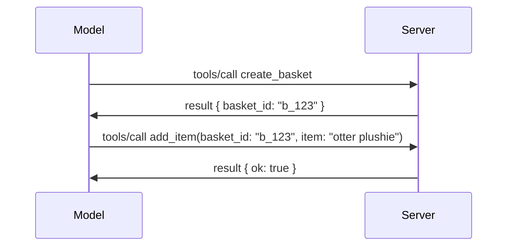

# Kas pasikeitė MCP: 2026-07-28 specifikacija

> **Statusas:** Galutinis. MCP specifikacija `2026-07-28` išleista 2026 m. liepos 28 d.
> ir yra dabartinis protokolo pataisymas. Ši pamoka aprašo galutinę
> specifikaciją. Kai kurie mokymo pavyzdžiai vis dar aiškiai nurodyti versijoje
> `2025-11-25`, nes jų SDK dar nepriėmė naujojo bevalstinio API;
> traktuokite tuos pavyzdžius kaip senosios suderinamumo gairės.

## Apžvalga

`2026-07-28` yra didžiausias MCP pataisymas nuo paleidimo. Šeši
specifikacijos patobulinimų pasiūlymai (SEP) pašalina protokolo lygyje sesijas ir
daro MCP bevalstį transporto sluoksnyje, plėtiniai tampa pirmaujančiu,
versijuojamu mechanizmu, o keletas anksčiau šioje mokymo programoje aptartų funkcijų
(Šaknys, Atranka, Registravimas) yra nutraukiamos pagal naują gyvenimo ciklo politiką. Ši
pamoka apibendrina, kas pasikeitė, kodėl tai svarbu ir ką tai reiškia kodui,
parašytam pagal `2025-11-25`.

Šaltinis: [2026-07-28 MCP specifikacijos kandidatas į leidimą](https://blog.modelcontextprotocol.io/posts/2026-07-28-release-candidate/) (Model Context Protocol tinklaraštis, David Soria Parra ir Den Delimarsky).

## Mokymosi tikslai

Vadovaujantis šiai pamokai, jūs sugebėsite:

- Paaiškinti, kodėl MCP pereina prie bevalstės protokolo branduolio ir kokią problemą tai sprendžia horizontaliai skalėms paskirstytoms diegimams.
- Apibūdinti, kaip pakeičiamas `initialize`/`initialized` rankos paspaudimas ir `Mcp-Session-Id` antraštė.
- Nustatyti naujas `Mcp-Method` ir `Mcp-Name` antraštes bei `ttlMs`/`cacheScope` talpyklos metaduomenis.
- Atpažinti Plėtinių sistemą ir du plėtinius, pridedamus šio leidimo metu: MCP programėlės ir Užduotys.
- Apibendrinti autorizacijos stiprinimo ir dinaminės kliento registracijos
  nutraukimą.
- Nustatyti, kurie pagrindiniai bruožai (Šaknys, Atranka, Registravimas) dabar yra nutraukiami ir ką tai reiškia praktikoje.
- Paaiškinti Pilną JSON schemos 2020-12 pokytį įrankio `inputSchema`/`outputSchema`.

## Bevalstis protokolas

Pagrindinis pasikeitimas: MCP tampa bevalstis protokolo sluoksnyje.

### Prieš (2025-11-25): sesijos pririša jus prie vieno serverio egzemplioriaus

Įrankio iškvietimas per Streamable HTTP prasideda `initialize` rankos paspaudimu. Serveris atsako `Mcp-Session-Id` antrašte, kurią kiekvienas vėlesnis užklausimas turi turėti:

```http
POST /mcp HTTP/1.1
Mcp-Session-Id: 1868a90c-3a3f-4f5b
Content-Type: application/json

{"jsonrpc":"2.0","id":2,"method":"tools/call",
 "params":{"name":"search","arguments":{"q":"otters"}}}
```

Kadangi sesija pririšta prie to serverio egzemplioriaus, kuris ją išdavė, horizontaliai skirstomi diegimai reikalauja **lipnaus maršrutavimo** apkrovos paskirstytuve ir **bendros sesijų saugyklos** visų egzempliorių tarpe.

### Po (2026-07-28): kiekvienas užklausimas yra savarankiškas

```http
POST /mcp HTTP/1.1
MCP-Protocol-Version: 2026-07-28
Mcp-Method: tools/call
Mcp-Name: search
Content-Type: application/json

{"jsonrpc":"2.0","id":1,"method":"tools/call",
 "params":{"name":"search","arguments":{"q":"otters"},
           "_meta":{"io.modelcontextprotocol/protocolVersion":"2026-07-28",
                    "io.modelcontextprotocol/clientInfo":{"name":"my-app","version":"1.0"},
                    "io.modelcontextprotocol/clientCapabilities":{}}}}
```

Bet kuris serverio egzempliorius gali tvarkyti šią užklausą. Pagrindiniai pokyčiai:

- **Pašalinamas `initialize`/`initialized` rankos paspaudimas** ([SEP-2575](https://github.com/modelcontextprotocol/modelcontextprotocol/pull/2575)). Protokolo versija, kliento informacija ir kliento galimybės perkeliamos į `_meta` kiekvienoje užklausoje. Naujas `server/discover` metodas leidžia klientui iš anksto gauti serverio galimybes, kai jų reikia.
- **Pašalinama `Mcp-Session-Id` antraštė ir protokolo lygio sesija** ([SEP-2567](https://github.com/modelcontextprotocol/modelcontextprotocol/pull/2567)). Lipnus maršrutavimas ir bendros sesijų saugyklos nebereikalingos protokolo lygyje.

### Bevalstis protokolas, būsenos išlaikymo programos

Pašalinus protokolo lygio sesiją, jūsų serveris gali išlikti būsenos palaikantis. Rekomenduojama schema yra ta pati, kokią HTTP API naudoja visada: vienos įrankio iškvietimo metu suteikti aiškų identifikatorių (pavyzdžiui, `basket_id`, `browser_id`) ir leisti modeliui grąžinti tą identifikatorių kaip įprastą argumentą vėlesniuose iškvietimuose.



Tai leidžia modeliui matyti ir sukti būseną, o ne slėpti ją transporto metaduomenyse, ir leidžia bet kuriam serverio egzemplioriui apdoroti bet kurį iškvietimą.

### Užklausimai iš serverio klientui, pertvarkyti

Bevalstis protokolas vis tiek reikalauja būdo, kaip serveris galėtų paprašyti klientą kažko viduryje iškvietimo (pavyzdžiui, prašyti išaiškinimo):

- **Užklausimai, inicijuoti serverio, gali būti vykdomi tik tada, kai serveris aktyviai apdoroja kliento užklausą** ([SEP-2260](https://github.com/modelcontextprotocol/modelcontextprotocol/pull/2260)) — anksčiau tai buvo rekomendacija, dabar privaloma. Vartotojas niekada nesulaukia netikėto prašymo.
- **Daugiapakopiai užklausimai** ([SEP-2322](https://github.com/modelcontextprotocol/modelcontextprotocol/pull/2322)) pakeičia SSE srauto laikymą atvirą. Vietoje to serveris grąžina `InputRequiredResult`:

  ```json
  {
    "resultType": "input_required",
    "inputRequests": {
      "confirm": {
        "type": "elicitation",
        "message": "Delete 3 files?",
        "schema": { "type": "boolean" }
      }
    },
    "requestState": "eyJzdGVwIjoxLCJmaWxlcyI6WyJhIiwiYiIsImMiXX0="
  }
  ```

  Klientas surenka atsakymus ir pakartoja pradinį iškvietimą su `inputResponses` ir pakartotu `requestState`. Bet kuris serverio egzempliorius gali imtis pakartotinės užklausos, nes visa reikalinga informacija yra komponente.

### Maršrutinis, talpinamas, sekamas

Trys mažesni pakeitimai palengvina bevalstį srautą valdyti:

- **`Mcp-Method` ir `Mcp-Name` antraštės privalomos Streamable HTTP** ([SEP-2243](https://github.com/modelcontextprotocol/modelcontextprotocol/pull/2243)), todėl apkrovos paskirstytuvai, vartai ir greičio ribotojai gali maršrutuoti pagal operaciją neskaitant JSON kūno. Serveriai atmeta užklausas, kai antraštės ir kūnas nesutampa.
- **`tools/list` ir resursų skaitymo rezultatai turi `ttlMs` ir `cacheScope`** ([SEP-2549](https://github.com/modelcontextprotocol/modelcontextprotocol/pull/2549)), modeliuojant pagal HTTP `Cache-Control`. Klientai žino, kiek laiko sąrašas yra naujas ir ar jis saugus dalintis tarp vartotojų, nereikalaudami ilgalaikio SSE srauto su pokyčių stebėjimu.
- **W3C Trace Context propagacija `_meta` dokumentuota** ([SEP-414](https://github.com/modelcontextprotocol/modelcontextprotocol/pull/414)), patikslinami `traceparent`, `tracestate` ir `baggage` raktažodžiai, kad paskirstyta sekimo sistema galėtų sekti užklausą per kliento SDK, MCP serverį ir žemutines sistemas tiekime suderinamame su [OpenTelemetry](https://opentelemetry.io/) backend'e.

## Plėtiniai tampa pirmaujančiais

Plėtiniai egzistavo neoficialiai versijoje `2025-11-25`. [SEP-2133](https://github.com/modelcontextprotocol/modelcontextprotocol/pull/2133) juos formalizuoja:

- Plėtiniai identifikuojami pagal atvirkštinį DNS ID.
- Jie derinami per `extensions` žemėlapį kliento ir serverio galimybėse.
- Jie gyvena savo `ext-*` repozitorijose su deleguotais valdytojais ir versijuojami nepriklausomai nuo pagrindinės specifikacijos.
- Naujasis plėtinių kelias SEP procese suteikia jiems kelią nuo eksperimentinio iki oficialaus.

Šis leidimas pristato du oficialius plėtinius.


### MCP programėlės: serverio atvaizduojamos naudotojo sąsajos

[MCP programėlės](https://blog.modelcontextprotocol.io/posts/2026-01-26-mcp-apps/) ([SEP-1865](https://github.com/modelcontextprotocol/modelcontextprotocol/pull/1865)) leidžia serveriams tiekti interaktyvias HTML sąsajas, kurias talpinantys įrenginiai atvaizduoja sandbox intyrkomoje iframe. Įrankiai iš anksto deklaruoja savo sąsajos šablonus, kad talpintojai galėtų juos iš anksto parsiųsti, kešuoti ir saugumo tikslais peržiūrėti prieš paleidimą. Pagrindus šioje srityje jau aptarėte [15 pamokoje: MCP programėlės](../03-GettingStarted/15-mcp-apps/README.md) — pagal plėtinių sistemą MCP programėlės dabar oficialiai yra plėtinys, o ne eksperimentinė pagrindinė funkcija.

### Užduotys tampa plėtiniu

Užduotys buvo pristatytos kaip eksperimentinė pagrindinė funkcija 2025-11-25. Gamybinis naudojimas atskleidė pakankamai daug pertvarkymo poreikį, todėl tinkama jų vieta yra plėtinys: [Užduočių plėtinys](https://github.com/modelcontextprotocol/modelcontextprotocol/pull/2663) pertvarko gyvenimo ciklą aplink nestatini modelį — serveris gali atsakyti į `tools/call` su užduoties rankena, o klientas ją valdo su `tasks/get`, `tasks/update` ir `tasks/cancel`. Užduoties sukūrimą valdo serveris: klientas reklamuoja plėtinį, o serveris nusprendžia, kada kvietimas turi būti vykdomas kaip užduotis. `tasks/list` visiškai pašalinamas, nes jo neįmanoma saugiai apriboti be sesijų.

> **Migracijos pastaba:** jei įdiegėte eksperimentinį 2025-11-25 Užduočių API, reikės migracijos prie naujo plėtinio gyvenimo ciklo — jis nesuderinamas atgal.

## Autorizacijos stiprinimas

Keletas SEP stiprina
[autorizacijos specifikaciją](https://modelcontextprotocol.io/specification/2026-07-28/basic/authorization)
, kad ji labiau atitiktų realaus pasaulio OAuth 2.0 / OpenID Connect diegimus:

| SEP | Pakeitimas |
|---|---|
| [SEP-2468](https://github.com/modelcontextprotocol/modelcontextprotocol/pull/2468) | Klientai privalo patikrinti `iss` parametrą autorizacijos atsakymuose pagal [RFC 9207](https://www.rfc-editor.org/rfc/rfc9207), taip apsisaugodami nuo maišymo atakų, dažnų MCP vieno kliento ir kelių serverių modelyje. Būsima versija reikalaus atmesti atsakymus, kuriuose trūksta `iss`. |
| [SEP-837](https://github.com/modelcontextprotocol/modelcontextprotocol/pull/837) | Tik suderinamumo tikslais dinaminių klientų registracijos klientai nurodo savo OpenID Connect `application_type`, kad būtų išvengta neteisingų „web“ numatytųjų reikšmių darbalaukio ir CLI klientams. |
| [SEP-2352](https://github.com/modelcontextprotocol/modelcontextprotocol/pull/2352) | Tik suderinamumo tikslais registruoti kredencialai yra susieti su autorizacijos serverio, išdavusio kredencialus, `issuer`; jei išteklius persikelia, klientai turi persiregistruoti. |
| [SEP-2207](https://github.com/modelcontextprotocol/modelcontextprotocol/pull/2207) | Aprašo, kaip prašyti atnaujinimo žetonų iš OpenID Connect tipo autorizacijos serverių. |
| [SEP-2350](https://github.com/modelcontextprotocol/modelcontextprotocol/pull/2350) | Paaiškina srities kaupimą per žingsninę autorizaciją. |
| [SEP-2351](https://github.com/modelcontextprotocol/modelcontextprotocol/pull/2351) | Paaiškina `.well-known` atradimo galūnę. |

Jei kuriate MCP autorizacijos serverį, pateikite `iss` lauką

autorizacijos atsakymai ir atitinka galutinę autorizacijos specifikaciją. Daugiau žr.
[02-Security](../02-Security/README.md) įgyvendinimo gairėms.

Dinaminė kliento registracija lieka prieinama suderinamumui, bet taip pat
yra pasenusi nuo `2026-07-28`. Nauji įgyvendinimai turėtų naudoti Kliento ID metaduomenų
dokumentus.

## Pasenusios funkcijos

Pagal naują
[funkcijų gyvavimo ciklo politiką](https://github.com/modelcontextprotocol/modelcontextprotocol/pull/2577),
šaknys, mėginiai, žurnalaivimas ir dinaminė kliento registracija yra **pasesnę**:

| Funkcija | Rekomenduojamas pakaitalas |
|---|---|
| Šaknys | Įrankių parametrai, išteklių URI arba serverio konfigūracija |
| Mėginiai | Tiesioginė integracija su LLM tiekėjo API |
| Žurnalaivimas | `stderr` stdio perdavimams; OpenTelemetry struktūrizuotam stebėjimui |
| Dinaminė kliento registracija | Kliento ID metaduomenų dokumentai |

Šios funkcijos lieka `2026-07-28` dėl suderinamumo. Jos gali būti pašalintos
pirmojoje specifikacijos peržiūroje, išleistoje ne anksčiau kaip 2027 m. liepos 28 d.;
faktinis pašalinimas gali įvykti vėliau. Nauji įgyvendinimai turėtų naudoti aukščiau
nurodytus pakaitalus.

## Pilnas JSON Schema 2020-12 įrankiams

Įrankio `inputSchema` ir `outputSchema` yra pakelti į pilną [JSON Schema 2020-12](https://json-schema.org/draft/2020-12) ([SEP-2106](https://github.com/modelcontextprotocol/modelcontextprotocol/pull/2106)):

- Įvesties schemos išlaiko `type: "object"` pagrindinę sąlygą, bet dabar leidžia kompoziciją (`oneOf`, `anyOf`, `allOf`), sąlygiškumus ir nuorodas (`$ref`, `$defs`).
- Išvesties schemos yra neribotos, ir `structuredContent` dabar gali būti bet kuri JSON reikšmė, ne tik objektas.
- Įgyvendinimai neturi automatiškai dereferencijuoti išorinių `$ref` URI ir turėtų riboti schemų gylį bei validavimo laiką (apsaugai nuo paslaugos atsisakymo, jei tikrinate schemas serverio pusėje).

Atskirai, klaidos kodas trūkstamam ištekliui keičiamas iš MCP specialaus `-32002` į JSON-RPC standartą `-32602` (Netinkami parametrai) ([SEP-2164](https://github.com/modelcontextprotocol/modelcontextprotocol/pull/2164)). Jei jūsų klientas atpažįsta pažodžiui `-32002`, jį reikės atnaujinti.

## Kaip toliau vystosi šis protokolas

Šis leidimas turi trikdžius keliantį pakeitimų pobūdį, kurio MCP prižiūrėtojai nenori laikyti norma ateityje. Trys valdymo SEP siekia to išvengti:

- **Funkcijų gyvavimo ciklo politika** kiekvienai funkcijai suteikia aktyvumo → pasenimo → pašalinimo kelią, kuriame tarp pasenimo ir ankstyviausio pašalinimo yra mažiausiai dvylika mėnesių.
- **Išplėtimų sistema** leidžia naujas galimybes siųsti kaip pasirenkamus išplėtimus ir juos stabilizuoti ten prieš (jei iš viso) įtraukiant į pagrindinę specifikaciją.
- Standartų takelio SEP nebegali pasiekti galutinio statuso, kol atitinkamas scenarijus nepateikiamas [atitikimo komplekte](https://github.com/modelcontextprotocol/conformance) ([SEP-2484](https://github.com/modelcontextprotocol/modelcontextprotocol/pull/2484)) — tas pats komplektas, kuriuo [SDK lygio sistema](https://github.com/modelcontextprotocol/modelcontextprotocol/pull/1777) vertina oficialius SDK.

## Leidimo laiko juosta ir patvirtinimas

- Leidimo kandidatas buvo užfiksuotas 2026 m. gegužės 21 d.
- Galutinė specifikacija išleista 2026 m. liepos 28 d.

- SDK palaikymas gali vėluoti atitinkamai specifikacijai. Patikrinkite
  [SDK dokumentaciją](https://modelcontextprotocol.io/docs/sdk) ir SDK
  išleidimo pastabas prieš migraciją pavyzdyje.
- Stebėkite galutinius pakeitimus
  [2026-07-28 specifikacijoje](https://modelcontextprotocol.io/specification/2026-07-28/)
  ir jos
  [pakeitimų žurnale](https://modelcontextprotocol.io/specification/2026-07-28/changelog).

## Ką tai reiškia šiam mokymo programos turiniui

Mokymo programa pereina nuo `2025-11-25` pavyzdžių prie dabartinės
`2026-07-28` specifikacijos. Konkrečiai:

- **Seansai ir `initialize` rankos paspaudimas** pavyzdžiuose, skirtuose
  `2025-11-25`, yra senstelėję veiksmai. `2026-07-28` protokolas juos
  pakeičia aukščiau aprašytu bevalstiu užklausos modeliu.
- **Atranka ir Sakniai** išlieka prieinami suderinamumui, bet yra pasenę.
  Nauji dizainai turėtų naudoti aukščiau nurodytus pakeitimo modelius.
- **Eksperimentinė Užduočių funkcija**, jei ją naudojote, turės būti perkelta į Užduočių plėtinio naują gyvenimo ciklą.
- **MCP programėlės** ([15 pamoka](../03-GettingStarted/15-mcp-apps/README.md)) praktiškai nesikeičia; jos tiesiog patenka į oficialų Plėtinių sistemą.

## Papildomi ištekliai

- [MCP specifikacija 2026-07-28](https://modelcontextprotocol.io/specification/2026-07-28/)
- [2026-07-28 Pakeitimų žurnalas](https://modelcontextprotocol.io/specification/2026-07-28/changelog)
- [2026-07-28 MCP specifikacijos kandidatė į leidimą (istoriškai tinklaraščio įrašas)](https://blog.modelcontextprotocol.io/posts/2026-07-28-release-candidate/)
- [MCP transportų ateitis](https://blog.modelcontextprotocol.io/posts/2025-12-19-mcp-transport-future/)
- [SEP gairės](https://modelcontextprotocol.io/community/sep-guidelines)
- [MCP SDK sluoksnių sistema](https://modelcontextprotocol.io/docs/sdk)

## Tolimesni žingsniai

Grįžkite prie [Pagrindinių koncepcijų](./README.md) arba tęskite į
[Saugumą](../02-Security/README.md), kad pritaikytumėte dabartines `2026-07-28` gaires.

---

<!-- CO-OP TRANSLATOR DISCLAIMER START -->
**Atsakomybės apribojimas**:
Šis dokumentas buvo išverstas naudojant dirbtinio intelekto vertimo paslaugą [Co-op Translator](https://github.com/Azure/co-op-translator). Nors siekiame tikslumo, prašome atkreipti dėmesį, kad automatiniai vertimai gali turėti klaidų ar netikslumų. Originalus dokumentas jo gimtąja kalba laikomas autoritetingu šaltiniu. Svarbiai informacijai rekomenduojama naudoti profesionalų žmogiškąjį vertimą. Mes neatsakome už jokius nesusipratimus ar neteisingą interpretaciją, kilusią naudojantis šiuo vertimu.
<!-- CO-OP TRANSLATOR DISCLAIMER END -->