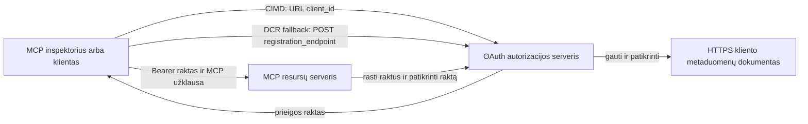

# CIMD ir DCR autorizacijos pavyzdys

Šis TypeScript pavyzdys lygina du būdus, kaip OAuth klientas gali gauti tapatybę
prieš prisijungdamas prie apsaugoto MCP serverio:

- **Kliento ID metaduomenų dokumentai (CIMD)** naudoja stabilų HTTPS URL kaip
  `client_id`. Tai yra pageidaujama priemonė klientams ir autorizacijos
  serveriams, kurie neturi išankstinio ryšio.
- **Dinaminė kliento registracija (DCR)** prašo autorizacijos serverio sukurti
  neaiškų kliento ID vykdymo metu. MCP `2026-07-28` išlaiko DCR tik dėl
  atgalinio suderinamumo.

Pavyzdyje naudojamas stabilus MCP TypeScript SDK v2 ir bevalstis
MCP `2026-07-28` užklausų modelis. Jis veikia su išoriniu OAuth 2.1/OpenID
Connect autorizacijos serveriu, pavyzdžiui, Auth0. MCP serveris yra resursų
serveris: jis patvirtina prieigos žetonus, bet neautentifikuoja vartotojų ar neišduoda
žetonų.

## Mokymosi tikslai

Užbaigę šį pavyzdį, galėsite:

- Paaiškinti, kodėl CIMD yra pageidautina DCR naujiems MCP klientams.
- Paskelbti galiojantį CIMD dokumentą viešam vietiniam klientui.
- Konfigūruoti MCP resursų serverį OAuth atradimui ir JWT patikrai.
- Naudoti CIMD ir DCR su tuo pačiu MCP serveriu ir autorizacijos serveriu.
- Priversti OAuth sritį MCP įrankyje.
- Nustatyti, kurios atsakomybės priklauso klientui, resursų serveriui ir
  autorizacijos serveriui.

## Architektūra



Autorizacijos serveris pasirenka ir patvirtina registracijos mechanizmą.
MCP serveris mato tik patvirtintą `client_id` teiginį. HTTPS URL
su keliu identifikuoja CIMD. Neaiškus ID nepakanka įrodyti DCR, nes
iš anksto registruotas klientas taip pat gali naudoti neaiškų ID; neprivaloma
`DCR_CLIENT_ID_PREFIX` nustatymas pateikia tiekėjo specifinę demonstracinę užuominą.

## Registracijos prioritetas

MCP klientai, palaikantys visas priemones, turėtų naudoti šią tvarką:

1. Naudoti iš anksto registruotą kliento informaciją, jei ji jau yra.
2. Naudoti CIMD, kai autorizacijos serveris reklamuoja
   `client_id_metadata_document_supported: true`.
3. Naudoti DCR tik kaip atsarginę priemonę, kai serveris reklamuoja
   `registration_endpoint`.
4. Paprašyti vartotojo iš anksto registruotos kliento informacijos, kai niekas iš
   aukščiau nėra prieinama.

## Projekto struktūra

```text
src/
  config.ts          Environment validation
  dcr.ts             DCR compatibility request
  mcp.ts             MCP tools and scope checks
  oauth.ts           Authorization metadata and JWT verification
  register-dcr.ts    DCR command-line helper
  registration.ts    CIMD document and mechanism classification
  server.ts          Express, OAuth discovery, and MCP endpoint
test/
  dcr.test.ts
  oauth.test.ts
  registration.test.ts
  server.test.ts
```

## Reikalavimai

- Node.js 20.6 arba naujesnė versija. Scenarijai naudoja `--env-file` ir `--import`.
- OAuth 2.1/OpenID Connect autorizacijos serveris, palaikantis:
  - Autorizacijos kodo srautą su S256 PKCE.
  - OAuth apsaugotų resursų metaduomenis ir resursų indikatorius.
  - JWT prieigos žetonus ir JWKS galinį tašką.
  - CIMD, taip pat DCR, jei norite palyginti senesnį atsarginį variantą.
- MCP Inspector arba kitas MCP `2026-07-28` klientas.
- Viešas HTTPS URL CIMD dokumentui. Kūrimo tunelis tinka laboratorijai;
  naudokite stabilų domeną gamybai.

## Diegimas ir testavimas

```bash
npm install
npm run build
npm test
```

Dvylika testų naudoja vietinius raktus ir imituojamus HTTP galinius taškus. Jiems nereikia
autorizacijos serverio paskyros. Jie patikrina:

- CIMD dokumento formą ir URL apribojimus.
- Sąžiningą URL ir neaiškių kliento ID klasifikaciją.
- DCR užklausos ir atsakymo apdorojimą.
- Nesaugų ne loopback DCR galinių taškų atmetimą.
- JWT parašo, išdavimo, auditorijos, galiojimo pabaigos, kliento ID ir srities patikrinimą.
- Vykdymo proceso MCP `2026-07-28` kvietimą `registration-info`.

## Konfigūruokite autorizacijos serverį

Tikslios kontrolės pavadinimai priklauso nuo tiekėjo. Konfigūruokite šias galimybes:

1. Sukurkite API ar resursų serverį, kurio identifikatorius tiksliai atitinka jūsų MCP
   URL, įskaitant `/mcp`, pavyzdžiui, `http://127.0.0.1:3001/mcp`.
2. Naudokite RS256 prieigos žetonus ir įtraukite `client_id` arba `azp` teiginį.
3. Pridėkite leidimą arba sritį `tool:greet`.
4. Įgalinkite autorizacijos kodo srautą su S256 PKCE viešiems vietiniams klientams.
5. Įjunkite Kliento ID metaduomenų dokumentus.
6. Tik palyginimui įjunkite Dinaminę kliento registraciją.
7. Užtikrinkite, kad autorizacijos serverio metaduomenys praneša:
   - `issuer`
   - `authorization_endpoint`
   - `token_endpoint`
   - `jwks_uri`
   - `client_id_metadata_document_supported: true`
   - `registration_endpoint`, kai DCR įjungta

### Auth0 pavyzdys

Auth0 atveju įjunkite Kliento ID metaduomenų dokumentų registraciją, OIDC dinaminę
programos registraciją ir resursų parametrų suderinamumą. Sukurkite API,
kurio identifikatorius yra tikslus MCP URL ir pridėkite leidimą `tool:greet`.
Leiskite testiniam vartotojui ir trečiųjų šalių klientams prašyti šio leidimo.

Tiekėjo valdymo pultai ir funkcijų prieinamumas laikui bėgant keičiasi. Prieš naudojant šiuos nustatymus už šios laboratorijos ribų, pasitikrinkite
tiekėjo dokumentaciją.

## Konfigūruokite pavyzdį

Sukurkite `.env` iš pavyzdžio:

```powershell
Copy-Item .env.example .env
```

Bash suderinamose aplinkose:

```bash
cp .env.example .env
```

Nustatykite šias reikšmes:

```dotenv
MCP_SERVER_URL=http://127.0.0.1:3001/mcp
AUTHORIZATION_SERVER_ISSUER=https://your-tenant.example.com/
AUTHORIZATION_SERVER_METADATA_URL=https://your-tenant.example.com/.well-known/openid-configuration
CLIENT_METADATA_URL=https://your-public-host.example.com/client-metadata.json
OAUTH_REDIRECT_URIS=http://127.0.0.1:6274/oauth/callback
DCR_CLIENT_ID_PREFIX=tpc_
```

Svarbios detalės:

- `AUTHORIZATION_SERVER_ISSUER` privalo tiksliai atitikti `issuer` rasto
  autorizacijos serverio metaduomenyse, įskaitant bet kokį užbaigiamąjį brūkšnį.
- `MCP_SERVER_URL` turi atitikti prieigos žetono auditoriją.
- `CLIENT_METADATA_URL` turi naudoti HTTPS, turėti ne šaknies kelią ir būti
  viešuoju URL, kuris aptarnauja metaduomenų maršrutą. Užklausų eilutės ir fragmentai yra
  atmestini, kad maršrutas ir `client_id` liktų identiški.
- `OAUTH_REDIRECT_URIS` yra kableliais atskirtas leistinų adresų sąrašas. Pagal numatytuosius nustatymus tai yra MCP
  Inspector loopback atšaukimo adresas.
- `DCR_CLIENT_ID_PREFIX` yra neprivalomas ir tiekėjo specifinis. Palikite tuščią, jei jūsų
  tiekėjas neturi patikimos DCR prefikso.

## Paskelbti CIMD dokumentą

Paleiskite tunelį, kuris siunčia savo viešą HTTPS kilmę į `127.0.0.1:3001`.
Nustatykite `CLIENT_METADATA_URL` į tą kilmę plius `/client-metadata.json`, tada vykdykite:

```bash
npm run build
npm start
```

Patikrinkite abu atradimo dokumentus:

```bash
curl http://127.0.0.1:3001/health
curl http://127.0.0.1:3001/client-metadata.json
curl http://127.0.0.1:3001/.well-known/oauth-protected-resource/mcp
```

`client_id`, grąžinamas viešojo HTTPS metaduomenų URL, turi būti baitas į baitą
identiškas tam URL. Autorizacijos serveris privalo patvirtinti dokumentą ir
jo peradresavimo URI prieš išduodamas žetoną.

> [!NOTE]
> Pavyzdys laiko kliento dokumentą ir MCP resursų serverį viename procese,
> kad laboratorija būtų nedidelė. Gamyboje MCP klientas valdo ir laiko savo CIMD
> dokumentą nepriklausomai nuo resursų serverio.

## Palyginkite CIMD ir DCR

Paleiskite MCP Inspector:

```bash
npx @modelcontextprotocol/inspector
```

Naudokite Streamable HTTP ir prijunkite prie `http://127.0.0.1:3001/mcp`.

### CIMD (pageidaujama)

1. Įveskite viešą `CLIENT_METADATA_URL` kaip OAuth kliento ID.
2. Paprašykite `tool:greet` ir bet kokių tapatybės sričių, kurias reikalauja jūsų tiekėjas.
3. Baigkite prisijungimą ir sutikimą.
4. Iškvieskite `registration-info`. Jis praneša `mechanism: "cimd"`.
5. Iškvieskite `greet`, kad patikrintumėte srities taikymą.

### DCR (atsarginė suderinamumo priemonė)

1. Išvalykite Inspector išsaugotą OAuth būseną.
2. Palikite OAuth kliento ID tuščią, kad Inspector galėtų naudoti reklamuojamą
   `registration_endpoint`.
3. Baigkite prisijungimą ir sutikimą.
4. Iškvieskite `registration-info`.
5. Jei `DCR_CLIENT_ID_PREFIX` atitinka tiekėjo sugeneruotus ID, įrankis
   praneša `mechanism: "dcr"`; kitaip teisingai praneša
   `opaque-client-id`.

Taip pat galite tiesiogiai parodyti registracijos užklausą:

```bash
npm run build
npm run register:dcr
```

Pagalbinė programa atspausdina grąžintą kliento ID, bet niekada neatspausdina kliento slaptojo rakto.
Bet kokį grąžintą slaptažodį laikykite jautriu ir laikykite tinkamoje slaptoje saugykloje.

## Įrankiai

| Įrankis | Reikalinga sritis | Paskirtis |
| --- | --- | --- |
| `registration-info` | Patvirtintas klientas | Pranešti kliento ID tipą |
| `greet` | `tool:greet` | Pademonstruoti įrankio autorizaciją |

## Saugumo pastabos

- Patikrinkite JWT parašus per autorizacijos serverio JWKS galinį tašką.
- Reikalaukite tikslaus leidėjo ir auditorijos atitikimo.
- Reikalaukite galiojimo pabaigos ir kliento ID teiginių.
- Niekada nepriimkite žetono, išduoto kitam resursui.
- Niekada nepraleiskite MCP žetono toliau į žemiausio lygio API.
- Laikykite DCR kredencialus su saitais su leidėju, kuris juos sukūrė.
- Patikrinkite CIMD peradresavimo URI tiksliai sutampančius.
- Taikykite SSRF kontrolę, kai autorizacijos serveris gauna CIMD URL.
- Naudokite HTTPS autorizacijos ir metaduomenų galiniuose taškuose už loopback
  kūrimo aplinkų.
- Neišveskite DCR iš neaiškaus kliento ID, nebent tiekėjas dokumentuoja
  patikimą identifikatoriaus konvenciją.

## Nuorodos

- [MCP autorizacijos specifikacija](https://modelcontextprotocol.io/specification/2026-07-28/basic/authorization)
- [MCP kliento registracija](https://modelcontextprotocol.io/specification/2026-07-28/basic/authorization/client-registration)
- [MCP saugumo geriausios praktikos](https://modelcontextprotocol.io/specification/2026-07-28/basic/security_best_practices)
- [MCP TypeScript SDK v2 autorizacijos vadovas](https://ts.sdk.modelcontextprotocol.io/v2/serving/authorization)
- [OAuth dinaminė kliento registracija (RFC 7591)](https://datatracker.ietf.org/doc/html/rfc7591)
- [OAuth kliento ID metaduomenų dokumento projektas](https://datatracker.ietf.org/doc/html/draft-ietf-oauth-client-id-metadata-document-00)

## Padėka

Šoninis mokymosi būdas įkvėptas
[Sambego/auth0-xmcp-cimd](https://github.com/Sambego/auth0-xmcp-cimd). Šis
pavyzdys yra originali, tiekėjo-neutralioji įgyvendinimas, sukurtas naudojant oficialų
MCP TypeScript SDK v2 šiam mokymo programos tikslui.

---

<!-- CO-OP TRANSLATOR DISCLAIMER START -->
**Atsakomybės apribojimas**:
Šis dokumentas buvo išverstas naudojant dirbtinio intelekto vertimo paslaugą [Co-op Translator](https://github.com/Azure/co-op-translator). Nors siekiame tikslumo, prašome atkreipti dėmesį, kad automatiniai vertimai gali turėti klaidų ar netikslumų. Originalus dokumentas jo gimtąja kalba laikomas autoritetingu šaltiniu. Svarbiai informacijai rekomenduojama naudoti profesionalų žmogiškąjį vertimą. Mes neatsakome už jokius nesusipratimus ar neteisingą interpretaciją, kilusią naudojantis šiuo vertimu.
<!-- CO-OP TRANSLATOR DISCLAIMER END -->