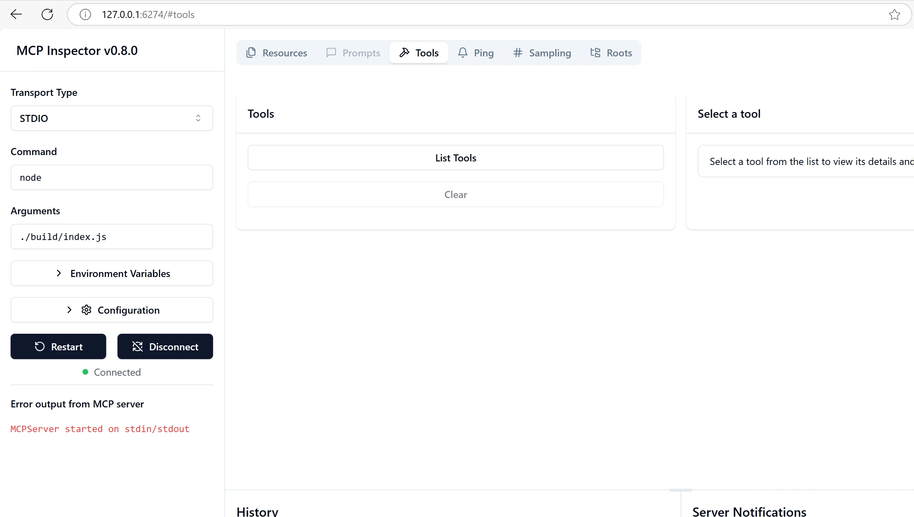
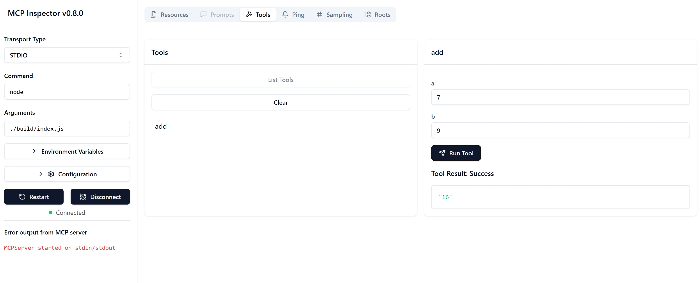

# Pradžia su MCP

> [!NOTE]
> Šiame pamokoje pateiktas Java HTTP pavyzdys naudoja senąjį HTTP+SSE transportą ir
> taikomas MCP `2025-11-25` suderinamam SDK. Naujiems nuotoliniams serveriams naudokite
> `2026-07-28` Streamable HTTP transportą ir patikrinkite SDK palaikymą.

Sveiki atvykę į savo pirmuosius Modelio Konteksto Protokolo (MCP) žingsnius! Nesvarbu, ar esate naujokas MCP, ar norite gilinti savo supratimą, šis vadovas padės jums per svarbiausius diegimo ir kūrimo procesus. Sužinosite, kaip MCP leidžia sklandžiai integruoti AI modelius su programomis ir kaip greitai paruošti savo aplinką MCP pagrįstų sprendimų kūrimui ir testavimui.

> SANTRAUKA; Jei kuriate AI programas, žinote, kad galite pridėti įrankius ir kitus išteklius prie savo LLM (didelio kalbos modelio), kad modelis taptų žinojesnis. Tačiau, jei šiuos įrankius ir išteklius talpinate serveryje, programa ir serverio galimybės gali būti naudojamos bet kurio kliento su ar be LLM.

## Apžvalga

Šioje pamokoje pateikiamos praktinės rekomendacijos, kaip nustatyti MCP aplinkas ir kurti pirmąsias MCP programas. Sužinosite, kaip paruošti reikalingus įrankius ir pagrindinius karkasus, kaip kurti paprastus MCP serverius, kurti host aplikacijas ir testuoti savo įgyvendinimus.

Modelio Konteksto Protokolas (MCP) yra atviras protokolas, standartizuojantis būdą, kaip programos pateikia kontekstą LLM. Galvokite apie MCP kaip apie USB-C jungtį AI programoms – jis suteikia standartizuotą būdą prijungti AI modelius prie įvairių duomenų šaltinių ir įrankių.

## Mokymosi tikslai

Iki šios pamokos pabaigos galėsite:

- Nustatyti MCP kūrimo aplinkas C#, Java, Python, TypeScript ir Rust kalboms
- Kurti ir diegti paprastus MCP serverius su individualiomis funkcijomis (ištekliais, užuominomis ir įrankiais)
- Kurti host aplikacijas, jungiančias prie MCP serverių
- Testuoti ir derinti MCP įgyvendinimus

## MCP aplinkos paruošimas

Prieš pradėdami darbą su MCP, svarbu pasiruošti kūrimo aplinką ir suprasti pagrindinį darbo eigą. Šiame skyriuje jus nuvesime per pradinius nustatymo žingsnius, kad MCP pradžia būtų sklandi.

### Reikalavimai

Prieš pradėdami MCP kūrimą, įsitikinkite, kad turite:

- **Kūrimo aplinka**: pasirinktos kalbos (C#, Java, Python, TypeScript ar Rust) aplinka
- **IDE/Redaktorius**: Visual Studio, Visual Studio Code, IntelliJ, Eclipse, PyCharm ar bet kokį modernų kodo redaktorių
- **Paketo valdytojai**: NuGet, Maven/Gradle, pip, npm/yarn ar Cargo
- **API raktai**: bet kuriai AI paslaugai, kurią planuojate naudoti host aplikacijose

## Pagrindinė MCP serverio struktūra

MCP serveris paprastai apima:

- **Serverio konfigūracija**: nustatyti prievadą, autentifikaciją ir kitus parametrus
- **Ištekliai**: duomenys ir kontekstas, pasiekiami LLM
- **Įrankiai**: funkcionalumas, kurį modeliai gali iškviesti
- **Užuominos**: tekstų generavimo ar struktūrizavimo šablonai

Štai supaprastintas pavyzdys TypeScript:

```typescript
import { McpServer, ResourceTemplate } from "@modelcontextprotocol/sdk/server/mcp.js";
import { StdioServerTransport } from "@modelcontextprotocol/sdk/server/stdio.js";
import { z } from "zod";

// Sukurti MCP serverį
const server = new McpServer({
  name: "Demo",
  version: "1.0.0"
});

// Pridėti sudėjimo įrankį
server.tool("add",
  { a: z.number(), b: z.number() },
  async ({ a, b }) => ({
    content: [{ type: "text", text: String(a + b) }]
  })
);

// Pridėti dinamišką pasveikinimo resursą
server.resource(
  "file",
  // Parametras 'list' valdo, kaip resursas pateikia galimus failus. Nustatymas į undefined išjungia šio resurso failų sąrašą.
  new ResourceTemplate("file://{path}", { list: undefined }),
  async (uri, { path }) => ({
    contents: [{
      uri: uri.href,
      text: `File, ${path}!`
    }]
  })
);

// Pridėti failo resursą, kuris skaito failo turinį
server.resource(
  "file",
  new ResourceTemplate("file://{path}", { list: undefined }),
  async (uri, { path }) => {
    let text;
    try {
      text = await fs.readFile(path, "utf8");
    } catch (err) {
      text = `Error reading file: ${err.message}`;
    }
    return {
      contents: [{
        uri: uri.href,
        text
      }]
    };
  }
);

server.prompt(
  "review-code",
  { code: z.string() },
  ({ code }) => ({
    messages: [{
      role: "user",
      content: {
        type: "text",
        text: `Please review this code:\n\n${code}`
      }
    }]
  })
);

// Pradėti gauti žinutes iš stdin ir siųsti žinutes į stdout
const transport = new StdioServerTransport();
await server.connect(transport);
```

Ankstesniame kode mes:

- Importavome reikalingas klases iš MCP TypeScript SDK.
- Sukūrėme ir sukonfigūravome naują MCP serverio egzempliorių.
- Užregistravome individualų įrankį (`calculator`) su apdorojimo funkcija.
- Paleidome serverį, kad klausytų MCP užklausų.

## Testavimas ir derinimas

Prieš pradėdami testuoti savo MCP serverį, svarbu suprasti turimus įrankius ir geriausias derinimo praktikas. Efektyvus testavimas užtikrina, kad serveris veiks kaip tikėtasi ir padeda greitai identifikuoti bei išspręsti problemas. Toliau pateikiamos rekomenduojamos MCP įgyvendinimo patikros priemonės.

MCP suteikia įrankius jūsų serveriams testuoti ir derinti:

- **Inspector įrankis** – ši grafinė sąsaja leidžia prisijungti prie serverio ir testuoti jūsų įrankius, užuominas bei išteklius.
- **curl** – taip pat galite prisijungti prie serverio naudodami komandų eilutės įrankį curl arba kitus klientus, kurie gali vykdyti HTTP komandas.

### Naudojant MCP Inspector

[MCP Inspector](https://github.com/modelcontextprotocol/inspector) yra vizualus testavimo įrankis, kuris leidžia:

1. **Aptikti serverio galimybes**: automatiškai nustatyti galimus išteklius, įrankius ir užuominas
2. **Išbandyti įrankių vykdymą**: išbandyti įvairius parametrus ir matyti atsakymus realiu laiku
3. **Peržiūrėti serverio metaduomenis**: ištirti serverio informaciją, schemas ir konfigūracijas

```bash
# pvz., TypeScript, MCP Inspector diegimas ir paleidimas
npx @modelcontextprotocol/inspector node build/index.js
```

Vykdant aukščiau nurodytas komandas MCP Inspector atidarys vietinę žiniatinklio sąsają jūsų naršyklėje. Galite tikėtis matyti informacinę skydelį, rodantį jūsų registruotus MCP serverius, jų turimus įrankius, išteklius ir užuominas. Sąsaja leidžia interaktyviai testuoti įrankių vykdymą, apžiūrėti serverio metaduomenis ir matyti atsakymus realiu laiku, kas palengvina MCP serverio įgyvendinimų patikrinimą ir derinimą.

Štai ekrano nuotrauka, kaip tai gali atrodyti:



## Dažnos konfigūracijos problemos ir sprendimai

| Problema | Galimas sprendimas |
|-------|-------------------|
| Ryšys atmestas | Patikrinkite ar serveris veikia ir ar prievadas teisingas |
| Įrankio vykdymo klaidos | Peržiūrėkite parametrų validaciją ir klaidų valdymą |
| Autentifikacijos klaidos | Patikrinkite API raktus ir leidimus |
| Schemos validacijos klaidos | Įsitikinkite, kad parametrai atitinka apibrėžtą schemą |
| Serveris neįsijungia | Patikrinkite prievadų konfliktus ar trūkstamas priklausomybes |
| CORS klaidos | Sukonfigūruokite tinkamus CORS antraštes tarpkryptiniams užklausimams |
| Autentifikacijos problemos | Patikrinkite tokenų galiojimą ir leidimus |

## Vietinis kūrimas

Vietiniam kūrimui ir testavimui galite paleisti MCP serverius tiesiog savo mašinoje:

1. **Paleiskite serverio procesą**: Vykdykite savo MCP serverio programą
2. **Sukonfigūruokite tinklą**: Įsitikinkite, kad serveris pasiekiamas per numatytą prievadą
3. **Prisijunkite klientus**: Naudokite vietinius ryšio URL, pvz., `http://localhost:3000`

```bash
# Pavyzdys: TypeScript MCP serverio paleidimas vietiniame kompiuteryje
npm run start
# Serveris veikia adresu http://localhost:3000
```

## Pirmojo MCP serverio kūrimas

Ankstesnėje pamokoje apėmėme [Pagrindines sąvokas](../../01-CoreConcepts/README.md), dabar metas šias žinias pritaikyti.

### Ką gali serveris

Prieš pradedant rašyti kodą, priminkime, ką serveris gali daryti:

MCP serveris gali, pavyzdžiui:

- Pasiekti vietinius failus ir duomenų bazes
- Jungtis prie nuotolinių API
- Atlikti skaičiavimus
- Integruotis su kitais įrankiais ir paslaugomis
- Suteikti sąsają naudotojui sąveikai

Puiku, dabar, kai žinome ko galime tikėtis, pradėkime rašyti kodą.

## Užduotis: Serverio kūrimas

Norėdami sukurti serverį, turite atlikti šiuos veiksmus:

- Įdiekite MCP SDK.
- Sukurkite projektą ir nustatykite jo struktūrą.
- Parašykite serverio kodą.
- Išbandykite serverį.

### -1- Projekto kūrimas

#### TypeScript

```sh
# Sukurkite projekto katalogą ir inicializuokite npm projektą
mkdir calculator-server
cd calculator-server
npm init -y
```

#### Python

```sh
# Sukurkite projekto katalogą
mkdir calculator-server
cd calculator-server
# Atidarykite aplanką Visual Studio Code - praleiskite, jei naudojate kitą IDE
code .
```

#### .NET

```sh
dotnet new console -n McpCalculatorServer
cd McpCalculatorServer
```

#### Java

Java atveju sukurkite Spring Boot projektą:

```bash
curl https://start.spring.io/starter.zip \
  -d dependencies=web \
  -d javaVersion=21 \
  -d type=maven-project \
  -d groupId=com.example \
  -d artifactId=calculator-server \
  -d name=McpServer \
  -d packageName=com.microsoft.mcp.sample.server \
  -o calculator-server.zip
```

Išarchyvuokite zip failą:

```bash
unzip calculator-server.zip -d calculator-server
cd calculator-server
# neprivaloma pašalinti nenaudojamą testą
rm -rf src/test/java
```

Pridėkite šią pilną konfigūraciją į savo *pom.xml* failą:

```xml
<?xml version="1.0" encoding="UTF-8"?>
<project xmlns="http://maven.apache.org/POM/4.0.0"
    xmlns:xsi="http://www.w3.org/2001/XMLSchema-instance"
    xsi:schemaLocation="http://maven.apache.org/POM/4.0.0 http://maven.apache.org/xsd/maven-4.0.0.xsd">
    <modelVersion>4.0.0</modelVersion>
    
    <!-- Spring Boot parent for dependency management -->
    <parent>
        <groupId>org.springframework.boot</groupId>
        <artifactId>spring-boot-starter-parent</artifactId>
        <version>3.5.0</version>
        <relativePath />
    </parent>

    <!-- Project coordinates -->
    <groupId>com.example</groupId>
    <artifactId>calculator-server</artifactId>
    <version>0.0.1-SNAPSHOT</version>
    <name>Calculator Server</name>
    <description>Basic calculator MCP service for beginners</description>

    <!-- Properties -->
    <properties>
        <java.version>21</java.version>
        <maven.compiler.source>21</maven.compiler.source>
        <maven.compiler.target>21</maven.compiler.target>
    </properties>

    <!-- Spring AI BOM for version management -->
    <dependencyManagement>
        <dependencies>
            <dependency>
                <groupId>org.springframework.ai</groupId>
                <artifactId>spring-ai-bom</artifactId>
                <version>1.0.0-SNAPSHOT</version>
                <type>pom</type>
                <scope>import</scope>
            </dependency>
        </dependencies>
    </dependencyManagement>

    <!-- Dependencies -->
    <dependencies>
        <dependency>
            <groupId>org.springframework.ai</groupId>
            <artifactId>spring-ai-starter-mcp-server-webflux</artifactId>
        </dependency>
        <dependency>
            <groupId>org.springframework.boot</groupId>
            <artifactId>spring-boot-starter-actuator</artifactId>
        </dependency>
        <dependency>
         <groupId>org.springframework.boot</groupId>
         <artifactId>spring-boot-starter-test</artifactId>
         <scope>test</scope>
      </dependency>
    </dependencies>

    <!-- Build configuration -->
    <build>
        <plugins>
            <plugin>
                <groupId>org.springframework.boot</groupId>
                <artifactId>spring-boot-maven-plugin</artifactId>
            </plugin>
            <plugin>
                <groupId>org.apache.maven.plugins</groupId>
                <artifactId>maven-compiler-plugin</artifactId>
                <configuration>
                    <release>21</release>
                </configuration>
            </plugin>
        </plugins>
    </build>

    <!-- Repositories for Spring AI snapshots -->
    <repositories>
        <repository>
            <id>spring-milestones</id>
            <name>Spring Milestones</name>
            <url>https://repo.spring.io/milestone</url>
            <snapshots>
                <enabled>false</enabled>
            </snapshots>
        </repository>
        <repository>
            <id>spring-snapshots</id>
            <name>Spring Snapshots</name>
            <url>https://repo.spring.io/snapshot</url>
            <releases>
                <enabled>false</enabled>
            </releases>
        </repository>
    </repositories>
</project>
```

#### Rust

```sh
mkdir calculator-server
cd calculator-server
cargo init
```

### -2- Pridėti priklausomybes

Dabar, kai turite sukurtą projektą, pridėkime priklausomybes:

#### TypeScript

```sh
# Jei dar nėra įdiegta, įdiekite TypeScript globaliai
npm install typescript -g

# Įdiekite MCP SDK ir Zod schemai tikrinti
npm install @modelcontextprotocol/sdk zod
npm install -D @types/node typescript
```

#### Python

```sh
# Sukurkite virtualią aplinką ir įdiekite priklausomybes
python -m venv venv
venv\Scripts\activate
pip install "mcp[cli]"
```

#### Java

```bash
cd calculator-server
./mvnw clean install -DskipTests
```

#### Rust

```sh
cargo add rmcp --features server,transport-io
cargo add serde
cargo add tokio --features rt-multi-thread
```

### -3- Sukurti projekto failus

#### TypeScript

Atverkite *package.json* failą ir pakeiskite turinį taip, kad galėtumėte kurti ir paleisti serverį:

```json
{
  "name": "calculator-server",
  "version": "1.0.0",
  "main": "index.js",
  "type": "module",
  "scripts": {
    "build": "tsc",
    "start": "npm run build && node ./build/index.js",
  },
  "keywords": [],
  "author": "",
  "license": "ISC",
  "description": "A simple calculator server using Model Context Protocol",
  "dependencies": {
    "@modelcontextprotocol/sdk": "^1.16.0",
    "zod": "^3.25.76"
  },
  "devDependencies": {
    "@types/node": "^24.0.14",
    "typescript": "^5.8.3"
  }
}
```

Sukurkite *tsconfig.json* su šiuo turiniu:

```json
{
  "compilerOptions": {
    "target": "ES2022",
    "module": "Node16",
    "moduleResolution": "Node16",
    "outDir": "./build",
    "rootDir": "./src",
    "strict": true,
    "esModuleInterop": true,
    "skipLibCheck": true,
    "forceConsistentCasingInFileNames": true
  },
  "include": ["src/**/*"],
  "exclude": ["node_modules"]
}
```

Sukurkite katalogą savo šaltinio kodui:

```sh
mkdir src
touch src/index.ts
```

#### Python

Sukurkite failą *server.py*

```sh
touch server.py
```

#### .NET

Įdiekite būtinus NuGet paketus:

```sh
dotnet add package ModelContextProtocol --prerelease
dotnet add package Microsoft.Extensions.Hosting
```

#### Java

Java Spring Boot projektuose projekto struktūra sukuriama automatiškai.

#### Rust

Rust atveju *src/main.rs* failas sukuriamas pagal nutylėjimą paleidus `cargo init`. Atidarykite failą ir ištrinkite numatytąjį kodą.

### -4- Kurti serverio kodą

#### TypeScript

Sukurkite failą *index.ts* ir pridėkite šį kodą:

```typescript
import { McpServer, ResourceTemplate } from "@modelcontextprotocol/sdk/server/mcp.js";
import { StdioServerTransport } from "@modelcontextprotocol/sdk/server/stdio.js";
import { z } from "zod";
 
// Sukurkite MCP serverį
const server = new McpServer({
  name: "Calculator MCP Server",
  version: "1.0.0"
});
```

Dabar turite serverį, bet jis nedaug ką daro, pataisykime tai.

#### Python

```python
# server.py
from mcp.server.fastmcp import FastMCP

# Sukurkite MCP serverį
mcp = FastMCP("Demo")
```

#### .NET

```csharp
using Microsoft.Extensions.DependencyInjection;
using Microsoft.Extensions.Hosting;
using Microsoft.Extensions.Logging;
using ModelContextProtocol.Server;
using System.ComponentModel;

var builder = Host.CreateApplicationBuilder(args);
builder.Logging.AddConsole(consoleLogOptions =>
{
    // Configure all logs to go to stderr
    consoleLogOptions.LogToStandardErrorThreshold = LogLevel.Trace;
});

builder.Services
    .AddMcpServer()
    .WithStdioServerTransport()
    .WithToolsFromAssembly();
await builder.Build().RunAsync();

// add features
```

#### Java

Java atveju sukurkite pagrindinius serverio komponentus. Pirmiausia pakeiskite pagrindinę programos klasę:

*src/main/java/com/microsoft/mcp/sample/server/McpServerApplication.java*:

```java
package com.microsoft.mcp.sample.server;

import org.springframework.ai.tool.ToolCallbackProvider;
import org.springframework.ai.tool.method.MethodToolCallbackProvider;
import org.springframework.boot.SpringApplication;
import org.springframework.boot.autoconfigure.SpringBootApplication;
import org.springframework.context.annotation.Bean;
import com.microsoft.mcp.sample.server.service.CalculatorService;

@SpringBootApplication
public class McpServerApplication {

    public static void main(String[] args) {
        SpringApplication.run(McpServerApplication.class, args);
    }
    
    @Bean
    public ToolCallbackProvider calculatorTools(CalculatorService calculator) {
        return MethodToolCallbackProvider.builder().toolObjects(calculator).build();
    }
}
```

Sukurkite kalkuliatoriaus servisą *src/main/java/com/microsoft/mcp/sample/server/service/CalculatorService.java*:

```java
package com.microsoft.mcp.sample.server.service;

import org.springframework.ai.tool.annotation.Tool;
import org.springframework.stereotype.Service;

/**
 * Service for basic calculator operations.
 * This service provides simple calculator functionality through MCP.
 */
@Service
public class CalculatorService {

    /**
     * Add two numbers
     * @param a The first number
     * @param b The second number
     * @return The sum of the two numbers
     */
    @Tool(description = "Add two numbers together")
    public String add(double a, double b) {
        double result = a + b;
        return formatResult(a, "+", b, result);
    }

    /**
     * Subtract one number from another
     * @param a The number to subtract from
     * @param b The number to subtract
     * @return The result of the subtraction
     */
    @Tool(description = "Subtract the second number from the first number")
    public String subtract(double a, double b) {
        double result = a - b;
        return formatResult(a, "-", b, result);
    }

    /**
     * Multiply two numbers
     * @param a The first number
     * @param b The second number
     * @return The product of the two numbers
     */
    @Tool(description = "Multiply two numbers together")
    public String multiply(double a, double b) {
        double result = a * b;
        return formatResult(a, "*", b, result);
    }

    /**
     * Divide one number by another
     * @param a The numerator
     * @param b The denominator
     * @return The result of the division
     */
    @Tool(description = "Divide the first number by the second number")
    public String divide(double a, double b) {
        if (b == 0) {
            return "Error: Cannot divide by zero";
        }
        double result = a / b;
        return formatResult(a, "/", b, result);
    }

    /**
     * Calculate the power of a number
     * @param base The base number
     * @param exponent The exponent
     * @return The result of raising the base to the exponent
     */
    @Tool(description = "Calculate the power of a number (base raised to an exponent)")
    public String power(double base, double exponent) {
        double result = Math.pow(base, exponent);
        return formatResult(base, "^", exponent, result);
    }

    /**
     * Calculate the square root of a number
     * @param number The number to find the square root of
     * @return The square root of the number
     */
    @Tool(description = "Calculate the square root of a number")
    public String squareRoot(double number) {
        if (number < 0) {
            return "Error: Cannot calculate square root of a negative number";
        }
        double result = Math.sqrt(number);
        return String.format("√%.2f = %.2f", number, result);
    }

    /**
     * Calculate the modulus (remainder) of division
     * @param a The dividend
     * @param b The divisor
     * @return The remainder of the division
     */
    @Tool(description = "Calculate the remainder when one number is divided by another")
    public String modulus(double a, double b) {
        if (b == 0) {
            return "Error: Cannot divide by zero";
        }
        double result = a % b;
        return formatResult(a, "%", b, result);
    }

    /**
     * Calculate the absolute value of a number
     * @param number The number to find the absolute value of
     * @return The absolute value of the number
     */
    @Tool(description = "Calculate the absolute value of a number")
    public String absolute(double number) {
        double result = Math.abs(number);
        return String.format("|%.2f| = %.2f", number, result);
    }

    /**
     * Get help about available calculator operations
     * @return Information about available operations
     */
    @Tool(description = "Get help about available calculator operations")
    public String help() {
        return "Basic Calculator MCP Service\n\n" +
               "Available operations:\n" +
               "1. add(a, b) - Adds two numbers\n" +
               "2. subtract(a, b) - Subtracts the second number from the first\n" +
               "3. multiply(a, b) - Multiplies two numbers\n" +
               "4. divide(a, b) - Divides the first number by the second\n" +
               "5. power(base, exponent) - Raises a number to a power\n" +
               "6. squareRoot(number) - Calculates the square root\n" + 
               "7. modulus(a, b) - Calculates the remainder of division\n" +
               "8. absolute(number) - Calculates the absolute value\n\n" +
               "Example usage: add(5, 3) will return 5 + 3 = 8";
    }

    /**
     * Format the result of a calculation
     */
    private String formatResult(double a, String operator, double b, double result) {
        return String.format("%.2f %s %.2f = %.2f", a, operator, b, result);
    }
}
```

**Pasirenkami komponentai gamybai paruoštai paslaugai:**

Sukurkite paleidimo konfigūraciją *src/main/java/com/microsoft/mcp/sample/server/config/StartupConfig.java*:

```java
package com.microsoft.mcp.sample.server.config;

import org.springframework.boot.CommandLineRunner;
import org.springframework.context.annotation.Bean;
import org.springframework.context.annotation.Configuration;

@Configuration
public class StartupConfig {
    
    @Bean
    public CommandLineRunner startupInfo() {
        return args -> {
            System.out.println("\n" + "=".repeat(60));
            System.out.println("Calculator MCP Server is starting...");
            System.out.println("SSE endpoint: http://localhost:8080/sse");
            System.out.println("Health check: http://localhost:8080/actuator/health");
            System.out.println("=".repeat(60) + "\n");
        };
    }
}
```

Sukurkite sveikatos valdiklį *src/main/java/com/microsoft/mcp/sample/server/controller/HealthController.java*:

```java
package com.microsoft.mcp.sample.server.controller;

import org.springframework.http.ResponseEntity;
import org.springframework.web.bind.annotation.GetMapping;
import org.springframework.web.bind.annotation.RestController;
import java.time.LocalDateTime;
import java.util.HashMap;
import java.util.Map;

@RestController
public class HealthController {
    
    @GetMapping("/health")
    public ResponseEntity<Map<String, Object>> healthCheck() {
        Map<String, Object> response = new HashMap<>();
        response.put("status", "UP");
        response.put("timestamp", LocalDateTime.now().toString());
        response.put("service", "Calculator MCP Server");
        return ResponseEntity.ok(response);
    }
}
```

Sukurkite išimčių tvarkyklę *src/main/java/com/microsoft/mcp/sample/server/exception/GlobalExceptionHandler.java*:

```java
package com.microsoft.mcp.sample.server.exception;

import org.springframework.http.HttpStatus;
import org.springframework.http.ResponseEntity;
import org.springframework.web.bind.annotation.ExceptionHandler;
import org.springframework.web.bind.annotation.RestControllerAdvice;

@RestControllerAdvice
public class GlobalExceptionHandler {

    @ExceptionHandler(IllegalArgumentException.class)
    public ResponseEntity<ErrorResponse> handleIllegalArgumentException(IllegalArgumentException ex) {
        ErrorResponse error = new ErrorResponse(
            "Invalid_Input", 
            "Invalid input parameter: " + ex.getMessage());
        return new ResponseEntity<>(error, HttpStatus.BAD_REQUEST);
    }

    public static class ErrorResponse {
        private String code;
        private String message;

        public ErrorResponse(String code, String message) {
            this.code = code;
            this.message = message;
        }

        // Gaukėjai
        public String getCode() { return code; }
        public String getMessage() { return message; }
    }
}
```

Sukurkite individualų baneriuką *src/main/resources/banner.txt*:

```text
_____      _            _       _             
 / ____|    | |          | |     | |            
| |     __ _| | ___ _   _| | __ _| |_ ___  _ __ 
| |    / _` | |/ __| | | | |/ _` | __/ _ \| '__|
| |___| (_| | | (__| |_| | | (_| | || (_) | |   
 \_____\__,_|_|\___|\__,_|_|\__,_|\__\___/|_|   
                                                
Calculator MCP Server v1.0
Spring Boot MCP Application
```

</details>

#### Rust

Pridėkite šį kodą prie *src/main.rs* failo pradžios. Tai importuoja reikalingas bibliotekas ir modulius jūsų MCP serveriui.

```rust
use rmcp::{
    handler::server::{router::tool::ToolRouter, tool::Parameters},
    model::{ServerCapabilities, ServerInfo},
    schemars, tool, tool_handler, tool_router,
    transport::stdio,
    ServerHandler, ServiceExt,
};
use std::error::Error;
```

Kalkuliatoriaus serveris bus paprastas, galintis sudėti du skaičius. Sukurkime struktūrą, atstovaujančią kalkuliatoriaus užklausą.

```rust
#[derive(Debug, serde::Deserialize, schemars::JsonSchema)]
pub struct CalculatorRequest {
    pub a: f64,
    pub b: f64,
}
```

Toliau sukurkime struktūrą, atstovaujančią kalkuliatoriaus serverį. Ši struktūra laikys įrankių maršrutizatorių, kuris naudojamas įrankiams registruoti.

```rust
#[derive(Debug, Clone)]
pub struct Calculator {
    tool_router: ToolRouter<Self>,
}
```

Dabar galime įgyvendinti `Calculator` struktūrą, kad sukurtume naują serverio egzempliorių ir įgyvendintume serverio apdorojimą, pateikdami serverio informaciją.

```rust
#[tool_router]
impl Calculator {
    pub fn new() -> Self {
        Self {
            tool_router: Self::tool_router(),
        }
    }
}

#[tool_handler]
impl ServerHandler for Calculator {
    fn get_info(&self) -> ServerInfo {
        ServerInfo {
            instructions: Some("A simple calculator tool".into()),
            capabilities: ServerCapabilities::builder().enable_tools().build(),
            ..Default::default()
        }
    }
}
```

Galiausiai reikia įgyvendinti pagrindinę funkciją, kuri paleis serverį. Ši funkcija sukurs `Calculator` egzempliorių ir aptarnaus jį per standartinę įėjimo/išėjimo srautus.

```rust
#[tokio::main]
async fn main() -> Result<(), Box<dyn Error>> {
    let service = Calculator::new().serve(stdio()).await?;
    service.waiting().await?;
    Ok(())
}
```

Serveris dabar paruoštas pateikti pagrindinę informaciją apie save. Toliau pridėsime įrankį, kuris atlieka sudėtį.

### -5- Įrankio ir išteklių pridėjimas

Pridėkite įrankį ir išteklių pridėdami šį kodą:

#### TypeScript

```typescript
server.tool(
  "add",
  { a: z.number(), b: z.number() },
  async ({ a, b }) => ({
    content: [{ type: "text", text: String(a + b) }]
  })
);

server.resource(
  "greeting",
  new ResourceTemplate("greeting://{name}", { list: undefined }),
  async (uri, { name }) => ({
    contents: [{
      uri: uri.href,
      text: `Hello, ${name}!`
    }]
  })
);
```

Jūsų įrankis priima parametrus `a` ir `b` ir vykdo funkciją, kuri sukuria atsakymą tokiu formatu:

```typescript
{
  contents: [{
    type: "text", content: "some content"
  }]
}
```

Jūsų išteklius pasiekiamas per string'ą "greeting" ir priima parametrą `name`, kuris sukuria panašų atsakymą kaip įrankis:

```typescript
{
  uri: "<href>",
  text: "a text"
}
```

#### Python

```python
# Pridėti sudėjimo įrankį
@mcp.tool()
def add(a: int, b: int) -> int:
    """Add two numbers"""
    return a + b


# Pridėti dinamišką pasveikinimo šaltinį
@mcp.resource("greeting://{name}")
def get_greeting(name: str) -> str:
    """Get a personalized greeting"""
    return f"Hello, {name}!"
```

Ankstesniame kode mes:

- Apibrėžėme įrankį `add`, kuris priima parametrus `a` ir `b`, abu sveikieji skaičiai.
- Sukūrėme išteklių pavadinimu `greeting`, kuris priima parametrą `name`.

#### .NET

Pridėkite tai į savo Program.cs failą:

```csharp
[McpServerToolType]
public static class CalculatorTool
{
    [McpServerTool, Description("Adds two numbers")]
    public static string Add(int a, int b) => $"Sum {a + b}";
}
```

#### Java

Įrankiai jau buvo sukurti ankstesniame žingsnyje.

#### Rust

Pridėkite naują įrankį `impl Calculator` bloke:

```rust
#[tool(description = "Adds a and b")]
async fn add(
    &self,
    Parameters(CalculatorRequest { a, b }): Parameters<CalculatorRequest>,
) -> String {
    (a + b).to_string()
}
```

### -6- Galutinis kodas

Pridėkime paskutinį reikiamą kodą, kad serveris galėtų paleisti:

#### TypeScript

```typescript
// Pradėti gauti žinutes per stdin ir siųsti žinutes per stdout
const transport = new StdioServerTransport();
await server.connect(transport);
```

Štai pilnas kodas:

```typescript
// index.ts
import { McpServer, ResourceTemplate } from "@modelcontextprotocol/sdk/server/mcp.js";
import { StdioServerTransport } from "@modelcontextprotocol/sdk/server/stdio.js";
import { z } from "zod";

// Sukurti MCP serverį
const server = new McpServer({
  name: "Calculator MCP Server",
  version: "1.0.0"
});

// Pridėti papildomą įrankį
server.tool(
  "add",
  { a: z.number(), b: z.number() },
  async ({ a, b }) => ({
    content: [{ type: "text", text: String(a + b) }]
  })
);

// Pridėti dinaminį pasveikinimo išteklių
server.resource(
  "greeting",
  new ResourceTemplate("greeting://{name}", { list: undefined }),
  async (uri, { name }) => ({
    contents: [{
      uri: uri.href,
      text: `Hello, ${name}!`
    }]
  })
);

// Pradėti gauti žinutes per stdin ir siųsti žinutes per stdout
const transport = new StdioServerTransport();
server.connect(transport);
```

#### Python

```python
# server.py
from mcp.server.fastmcp import FastMCP

# Sukurkite MCP serverį
mcp = FastMCP("Demo")


# Pridėkite sudėjimo įrankį
@mcp.tool()
def add(a: int, b: int) -> int:
    """Add two numbers"""
    return a + b


# Pridėkite dinaminį pasveikinimo resursą
@mcp.resource("greeting://{name}")
def get_greeting(name: str) -> str:
    """Get a personalized greeting"""
    return f"Hello, {name}!"

# Pagrindinis vykdymo blokas - tai būtina serverio paleidimui
if __name__ == "__main__":
    mcp.run()
```

#### .NET

Sukurkite Program.cs failą su šiuo turiniu:

```csharp
using Microsoft.Extensions.DependencyInjection;
using Microsoft.Extensions.Hosting;
using Microsoft.Extensions.Logging;
using ModelContextProtocol.Server;
using System.ComponentModel;

var builder = Host.CreateApplicationBuilder(args);
builder.Logging.AddConsole(consoleLogOptions =>
{
    // Configure all logs to go to stderr
    consoleLogOptions.LogToStandardErrorThreshold = LogLevel.Trace;
});

builder.Services
    .AddMcpServer()
    .WithStdioServerTransport()
    .WithToolsFromAssembly();
await builder.Build().RunAsync();

[McpServerToolType]
public static class CalculatorTool
{
    [McpServerTool, Description("Adds two numbers")]
    public static string Add(int a, int b) => $"Sum {a + b}";
}
```

#### Java

Jūsų pilna pagrindinės programos klasė turėtų atrodyti taip:

```java
// McpServerApplication.java
package com.microsoft.mcp.sample.server;

import org.springframework.ai.tool.ToolCallbackProvider;
import org.springframework.ai.tool.method.MethodToolCallbackProvider;
import org.springframework.boot.SpringApplication;
import org.springframework.boot.autoconfigure.SpringBootApplication;
import org.springframework.context.annotation.Bean;
import com.microsoft.mcp.sample.server.service.CalculatorService;

@SpringBootApplication
public class McpServerApplication {

    public static void main(String[] args) {
        SpringApplication.run(McpServerApplication.class, args);
    }
    
    @Bean
    public ToolCallbackProvider calculatorTools(CalculatorService calculator) {
        return MethodToolCallbackProvider.builder().toolObjects(calculator).build();
    }
}
```

#### Rust

Galutinis Rust serverio kodas turėtų atrodyti taip:

```rust
use rmcp::{
    ServerHandler, ServiceExt,
    handler::server::{router::tool::ToolRouter, tool::Parameters},
    model::{ServerCapabilities, ServerInfo},
    schemars, tool, tool_handler, tool_router,
    transport::stdio,
};
use std::error::Error;

#[derive(Debug, serde::Deserialize, schemars::JsonSchema)]
pub struct CalculatorRequest {
    pub a: f64,
    pub b: f64,
}

#[derive(Debug, Clone)]
pub struct Calculator {
    tool_router: ToolRouter<Self>,
}

#[tool_router]
impl Calculator {
    pub fn new() -> Self {
        Self {
            tool_router: Self::tool_router(),
        }
    }
    
    #[tool(description = "Adds a and b")]
    async fn add(
        &self,
        Parameters(CalculatorRequest { a, b }): Parameters<CalculatorRequest>,
    ) -> String {
        (a + b).to_string()
    }
}

#[tool_handler]
impl ServerHandler for Calculator {
    fn get_info(&self) -> ServerInfo {
        ServerInfo {
            instructions: Some("A simple calculator tool".into()),
            capabilities: ServerCapabilities::builder().enable_tools().build(),
            ..Default::default()
        }
    }
}

#[tokio::main]
async fn main() -> Result<(), Box<dyn Error>> {
    let service = Calculator::new().serve(stdio()).await?;
    service.waiting().await?;
    Ok(())
}
```

### -7- Serverio testavimas

Paleiskite serverį šia komanda:

#### TypeScript

```sh
npm run build
```

#### Python

```sh
mcp run server.py
```

> Naudojant MCP Inspector, naudokite `mcp dev server.py`, kuris automatiškai paleidžia Inspector ir suteikia reikalingą proxy sesijos žetoną. Jei naudojate `mcp run server.py`, reikės rankiniu būdu paleisti Inspector ir sukonfigūruoti ryšį.

#### .NET

Įsitikinkite, kad esate projekto kataloge:

```sh
cd McpCalculatorServer
dotnet run
```

#### Java

```bash
./mvnw clean install -DskipTests
java -jar target/calculator-server-0.0.1-SNAPSHOT.jar
```

#### Rust

Vykdykite šias komandas, kad suformatuotumėte ir paleistumėte serverį:

```sh
cargo fmt
cargo run
```

### -8- Paleidimas naudojant Inspector

Inspector yra puikus įrankis, kuris gali paleisti jūsų serverį ir leidžia jums su juo sąveikauti, kad patikrintumėte veikimą. Paleiskime jį:

> [!NOTE]
> komanda lauke gali atrodyti kitaip, nes jis yra komanda serveriui paleisti su jūsų konkrečia vykdymo aplinka/

#### TypeScript

```sh
npx @modelcontextprotocol/inspector node build/index.js
```

arba pridėkite tai į savo *package.json* failą taip: `"inspector": "npx @modelcontextprotocol/inspector node build/index.js"` ir tada vykdykite `npm run inspector`

#### Python

Python naudoja Node.js įrankį inspector. Šį įrankį galima iškviesti taip:

```sh
mcp dev server.py
```


Tačiau jis neįgyvendina visų įrankyje esančių metodų, todėl rekomenduojama paleisti Node.js įrankį tiesiogiai taip, kaip parodyta žemiau:

```sh
npx @modelcontextprotocol/inspector mcp run server.py
```

Jei naudojate įrankį ar IDE, leidžiančią konfigūruoti komandas ir argumentus skriptams paleisti, 
įsitikinkite, kad laukelyje „Command“ (Komanda) nustatytas `python`, o kaip „Arguments“ (Argumentai) — `server.py`. Tai užtikrina, kad skriptas bus paleistas tinkamai.

#### .NET

Įsitikinkite, kad esate savo projekto aplanke:

```sh
cd McpCalculatorServer
npx @modelcontextprotocol/inspector dotnet run
```

#### Java

Įsitikinkite, kad jūsų kalkuliatoriaus serveris veikia
Paleiskite inspektorių:

```cmd
npx @modelcontextprotocol/inspector
```

Inspektoriaus žiniatinklio sąsajoje:

1. Pasirinkite „SSE“ kaip perdavimo tipą
2. Nustatykite URL į: `http://localhost:8080/sse`
3. Spauskite „Connect“ (Prisijungti)


**Jūs dabar esate prisijungę prie serverio**
**Java serverio testavimo skyrius dabar baigtas**

Toliau aprašoma sąveika su serveriu.

Turėtumėte matyti šią vartotojo sąsają:


1. Prisijunkite prie serverio paspausdami mygtuką „Connect“ (Prisijungti)
  Prisijungus prie serverio, turėtumėte matyti šį vaizdą:

  

1. Pasirinkite „Tools“ (Įrankiai) ir „listTools“, turėtumėte pamatyti „Add“ (Pridėti), pasirinkite „Add“ ir užpildykite parametro reikšmes.

  Turėtumėte matyti tokį atsakymą, t.y. „add“ įrankio rezultatą:

  

Sveikiname, jums pavyko sukurti ir paleisti pirmąjį serverį!

#### Rust

Norėdami paleisti Rust serverį su MCP Inspector CLI, naudokite šią komandą:

```sh
npx @modelcontextprotocol/inspector cargo run --cli --method tools/call --tool-name add --tool-arg a=1 b=2
```

### Oficialūs SDK

MCP teikia oficialius SDK kelioms kalboms:

- [C# SDK](https://github.com/modelcontextprotocol/csharp-sdk) - prižiūrimas kartu su Microsoft
- [Java SDK](https://github.com/modelcontextprotocol/java-sdk) - prižiūrimas kartu su Spring AI
- [TypeScript SDK](https://github.com/modelcontextprotocol/typescript-sdk) - oficialus TypeScript įgyvendinimas
- [Python SDK](https://github.com/modelcontextprotocol/python-sdk) - oficialus Python įgyvendinimas
- [Kotlin SDK](https://github.com/modelcontextprotocol/kotlin-sdk) - oficialus Kotlin įgyvendinimas
- [Swift SDK](https://github.com/modelcontextprotocol/swift-sdk) - prižiūrimas kartu su Loopwork AI
- [Rust SDK](https://github.com/modelcontextprotocol/rust-sdk) - oficialus Rust įgyvendinimas

## Svarbiausi dalykai

- MCP kūrimo aplinkos nustatymas yra paprastas naudojant konkrečiai kalbai skirtus SDK
- MCP serverių kūrimas apima įrankių kūrimą ir registravimą su aiškiomis schemomis
- Testavimas ir derinimas yra būtini patikimoms MCP įgyvendinimo sprendimams

## Pavyzdžiai

- [Java Calculator](../samples/java/calculator/README.md)
- [.NET Calculator](../../../../03-GettingStarted/samples/csharp)
- [JavaScript Calculator](../samples/javascript/README.md)
- [TypeScript Calculator](../samples/typescript/README.md)
- [Python Calculator](../../../../03-GettingStarted/samples/python)
- [Rust Calculator](../../../../03-GettingStarted/samples/rust)

## Užduotis

Sukurkite paprastą MCP serverį su pasirinktiniu įrankiu:

1. Įgyvendinkite įrankį pasirinkta kalba (.NET, Java, Python, TypeScript arba Rust).
2. Apibrėžkite įvesties parametrus ir grąžinimo reikšmes.
3. Paleiskite inspektoriaus įrankį, kad įsitikintumėte, jog serveris veikia tinkamai.
4. Išbandykite įgyvendinimą su įvairiomis įvestimis.

## Sprendimas

[Sprendimas](./solution/README.md)

## Papildomi šaltiniai

- [Agentų kūrimas naudojant Model Context Protocol Azure platformoje](https://learn.microsoft.com/azure/developer/ai/intro-agents-mcp)
- [Nuotolinis MCP su Azure Container Apps (Node.js/TypeScript/JavaScript)](https://learn.microsoft.com/samples/azure-samples/mcp-container-ts/mcp-container-ts/)
- [.NET OpenAI MCP agentas](https://learn.microsoft.com/samples/azure-samples/openai-mcp-agent-dotnet/openai-mcp-agent-dotnet/)

## Kas toliau

Toliau: [Kaip pradėti dirbti su MCP klientais](../02-client/README.md)

---

<!-- CO-OP TRANSLATOR DISCLAIMER START -->
**Atsakomybės apribojimas**:
Šis dokumentas buvo išverstas naudojant dirbtinio intelekto vertimo paslaugą [Co-op Translator](https://github.com/Azure/co-op-translator). Nors siekiame tikslumo, prašome atkreipti dėmesį, kad automatiniai vertimai gali turėti klaidų ar netikslumų. Originalus dokumentas jo gimtąja kalba laikomas autoritetingu šaltiniu. Svarbiai informacijai rekomenduojama naudoti profesionalų žmogiškąjį vertimą. Mes neatsakome už jokius nesusipratimus ar neteisingą interpretaciją, kilusią naudojantis šiuo vertimu.
<!-- CO-OP TRANSLATOR DISCLAIMER END -->