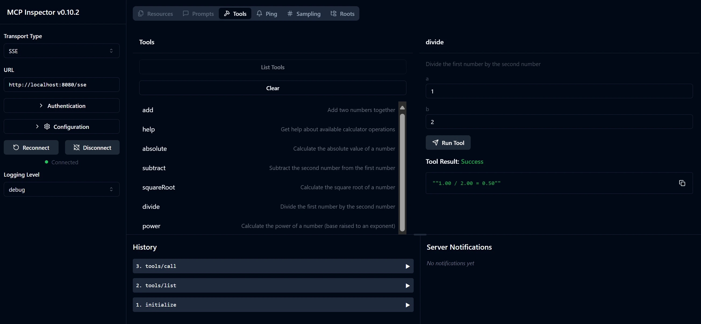

# Pagrindinė skaičiuoklės MCP paslauga

> [!NOTE]
> Šis Java sprendimas naudoja paveldėtą HTTP+SSE transportą ir yra skirtas SDK,
> suderinamam su MCP `2025-11-25`. Jis išlaikytas siekiant atitikti kursų kodą;
> nauji nuotoliniai serveriai turėtų naudoti `2026-07-28` Streamable HTTP palaikymą.

Ši paslauga teikia pagrindines skaičiuoklės operacijas per Modelio konteksto protokolą (MCP) naudodama Spring Boot su WebFlux transportu. Ji sukurta kaip paprastas pavyzdys pradedantiesiems, besimokantiems apie MCP įgyvendinimus.

Daugiau informacijos rasite žr. [MCP Server Boot Starter](https://docs.spring.io/spring-ai/reference/api/mcp/mcp-server-boot-starter-docs.html) referencinę dokumentaciją.


## Paslaugos naudojimas

Paslauga per MCP protokolą pateikia šiuos API galinius taškus:

- `add(a, b)`: Sudėti du skaičius
- `subtract(a, b)`: Atimti antrą skaičių iš pirmo
- `multiply(a, b)`: Sudauginti du skaičius
- `divide(a, b)`: Padalyti pirmą skaičių iš antro (su nulio patikra)
- `power(base, exponent)`: Apskaičiuoti skaičiaus laipsnį
- `squareRoot(number)`: Apskaičiuoti kvadratinę šaknį (su neigiamo skaičiaus patikra)
- `modulus(a, b)`: Apskaičiuoti likutį dalinant
- `absolute(number)`: Apskaičiuoti absoliučią reikšmę

## Priklausomybės

Projektui reikalingos šios pagrindinės priklausomybės:

```xml
<dependency>
    <groupId>org.springframework.ai</groupId>
    <artifactId>spring-ai-starter-mcp-server-webflux</artifactId>
</dependency>
```

## Projekto kūrimas

Projektą sukurkite naudodami Maven:
```bash
./mvnw clean install -DskipTests
```

## Serverio paleidimas

### Naudojant Java

```bash
java -jar target/calculator-server-0.0.1-SNAPSHOT.jar
```

### Naudojant MCP Inspector

MCP Inspector yra naudingas įrankis sąveikai su MCP paslaugomis. Norėdami naudoti jį su šia skaičiuoklės paslauga:

1. **Įdiekite ir paleiskite MCP Inspector** naujame terminalo lange:
   ```bash
   npx @modelcontextprotocol/inspector
   ```

2. **Pasiekite žiniatinklio vartotojo sąsają** paspausdami programos rodomą URL (dažniausiai http://localhost:6274)

3. **Konfigūruokite ryšį**:
   - Nustatykite transporto tipą "SSE"
   - Nustatykite URL į veikiantį serverio SSE galinį tašką: `http://localhost:8080/sse`
   - Spustelėkite "Connect"

4. **Naudokite įrankius**:
   - Spustelėkite "List Tools", kad pamatytumėte prieinamas skaičiuoklės operacijas
   - Pasirinkite įrankį ir spustelėkite "Run Tool", kad vykdytumėte operaciją



---

<!-- CO-OP TRANSLATOR DISCLAIMER START -->
**Atsakomybės apribojimas**:
Šis dokumentas buvo išverstas naudojant dirbtinio intelekto vertimo paslaugą [Co-op Translator](https://github.com/Azure/co-op-translator). Nors siekiame tikslumo, prašome atkreipti dėmesį, kad automatiniai vertimai gali turėti klaidų ar netikslumų. Originalus dokumentas jo gimtąja kalba laikomas autoritetingu šaltiniu. Svarbiai informacijai rekomenduojama naudoti profesionalų žmogiškąjį vertimą. Mes neatsakome už jokius nesusipratimus ar neteisingą interpretaciją, kilusią naudojantis šiuo vertimu.
<!-- CO-OP TRANSLATOR DISCLAIMER END -->