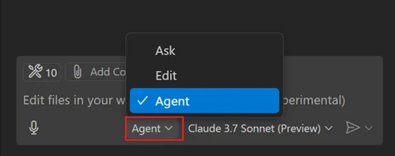
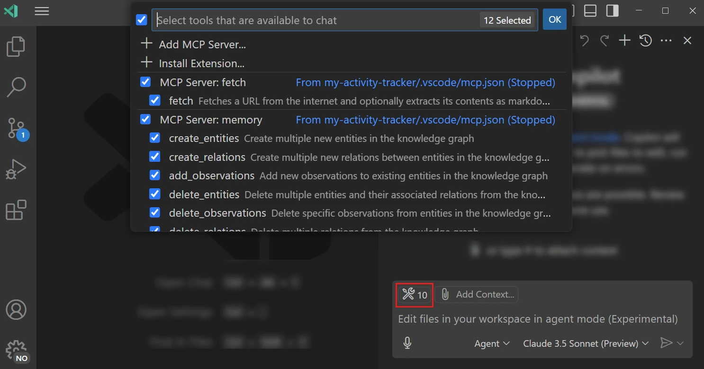
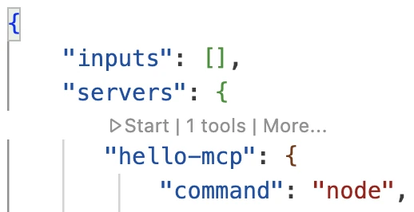
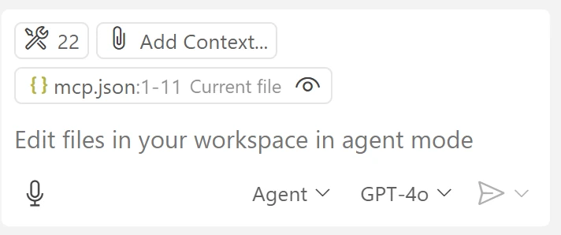
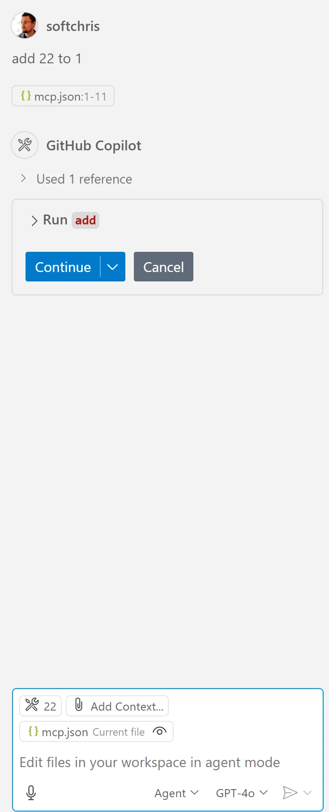

# Serverio naudojimas GitHub Copilot agento režimu

Visual Studio Code ir GitHub Copilot gali veikti kaip klientai ir naudoti MCP serverį. Klausiate, kodėl to norėtume? Na, tai reiškia, kad bet kurios MCP serverio funkcijos dabar gali būti naudojamos iš jūsų IDE. Įsivaizduokite, jei pridėtumėte, pavyzdžiui, GitHub MCP serverį – tai leistų valdyti GitHub naudojant užklausas, o ne rašant konkrečias komandas terminale. Arba įsivaizduokite bet ką, kas galėtų pagerinti jūsų kūrėjo patirtį, viską valdant natūralia kalba. Dabar pradeda būti aišku, koks čia privalumas, tiesa?

## Apžvalga

Ši pamoka aprašo, kaip naudoti Visual Studio Code ir GitHub Copilot agento režimą kaip klientą jūsų MCP serveriui.

## Mokymosi tikslai

Pamokos pabaigoje jūs sugebėsite:

- Naudoti MCP serverį per Visual Studio Code.
- Vykdyti funkcijas ir įrankius per GitHub Copilot.
- Konfigūruoti Visual Studio Code, kad jis rastų ir valdytų jūsų MCP serverį.

## Naudojimas

Galite valdyti savo MCP serverį dviem būdais:

- Per vartotojo sąsają, kaip matysite vėliau šiame skyriuje.
- Terminale, galima valdyti dalykus naudojant `code` vykdomąjį failą:

  Norėdami pridėti MCP serverį prie vartotojo profilio, naudokite komandų eilutės parinktį --add-mcp ir pateikite JSON serverio konfigūraciją formatu {\"name\":\"server-name\",\"command\":...}.

  ```
  code --add-mcp "{\"name\":\"my-server\",\"command\": \"uvx\",\"args\": [\"mcp-server-fetch\"]}"
  ```

### Ekrano kopijos





Toliau aptarsime, kaip naudojame vizualinę sąsają kitose skiltyse.

## Požiūris

Čia yra pagrindiniai žingsniai, kaip turime elgtis:

- Konfigūruoti failą, kad rastume MCP serverį.
- Paleisti/Prisijungti prie minėto serverio, kad jis pademonstruotų savo galimybes.
- Naudoti šias galimybes per GitHub Copilot pokalbių sąsają.

Puiku, dabar, kai suprantame eigą, pabandykime naudoti MCP serverį Visual Studio Code kartu atlikdami pratimą.

## Pratimas: serverio naudojimas

Šiame pratime konfigūruosime Visual Studio Code, kad jis rastų jūsų MCP serverį ir jį galėsite naudoti per GitHub Copilot pokalbių sąsają.

### -0- Pradinė sąlyga, įgalinti MCP serverių atradimą

Gali tekti įjungti MCP serverių atradimą.

1. Eikite į `File -> Preferences -> Settings` Visual Studio Code.

1. Paieškoje įveskite "MCP" ir įgalinkite `chat.mcp.discovery.enabled` nustatymų faile settings.json.

### -1- Sukurkite konfigūracijos failą

Pradėkite kurdami konfigūracijos failą savo projekto šaknyje, jums reikės failo pavadinimu MCP.json, kurį reikės įdėti į aplanką .vscode. Jis turėtų atrodyti taip:

```text
.vscode
|-- mcp.json
```

Toliau pažiūrėkime, kaip pridėti serverio įrašą.

### -2- Konfigūruokite serverį

Pridėkite šį turinį į *mcp.json*:

```json
{
    "inputs": [],
    "servers": {
       "hello-mcp": {
           "command": "node",
           "args": [
               "build/index.js"
           ]
       }
    }
}
```

Aukščiau pateiktas paprastas pavyzdys, kaip paleisti Node.js parašytą serverį, kitoms aplinkoms nurodykite tinkamą komandą serverio paleidimui naudojant `command` ir `args`.

### -3- Paleiskite serverį

Dabar, kai pridėjote įrašą, paleiskime serverį:

1. Suraskite savo įrašą *mcp.json* faile ir įsitikinkite, kad matote "play" piktogramą:

    

1. Paspauskite "play" piktogramą, turėtumėte matyti, kaip įrankių piktograma GitHub Copilot pokalbių sąsajoje didina galimų įrankių skaičių. Paspaudę šią įrankių piktogramą matysite registruotų įrankių sąrašą. Galite pažymėti/atžymėti kiekvieną įrankį pagal tai, ar norite, kad GitHub Copilot jį naudotų kaip kontekstą:

  

1. Norėdami vykdyti įrankį, įveskite užklausą, kuri, jūsų žiniomis, atitiks vieno iš įrankių aprašymą, pavyzdžiui, "add 22 to 1":

  

  Turėtumėte pamatyti atsakymą 23.

## Užduotis

Pabandykite pridėti serverio įrašą į savo *mcp.json* failą ir įsitikinkite, kad galite paleisti bei sustabdyti serverį. Taip pat įsitikinkite, kad per GitHub Copilot pokalbių sąsają galite bendrauti su savo serverio įrankiais.

## Sprendimas

[Sprendimas](./solution/README.md)

## Pagrindinės išvados

Šio skyriaus pagrindinės išvados yra:

- Visual Studio Code yra puikus klientas, leidžiantis naudoti kelis MCP serverius ir jų įrankius.
- GitHub Copilot pokalbių sąsaja yra būdas bendrauti su serveriais.
- Galite prašyti vartotojo įvesti duomenis, tokius kaip API raktus, kuriuos galima perduoti MCP serveriui konfigūruojant serverio įrašą *mcp.json* faile.

## Pavyzdžiai

- [Java skaičiuoklė](../samples/java/calculator/README.md)
- [.Net skaičiuoklė](../../../../03-GettingStarted/samples/csharp)
- [JavaScript skaičiuoklė](../samples/javascript/README.md)
- [TypeScript skaičiuoklė](../samples/typescript/README.md)
- [Python skaičiuoklė](../../../../03-GettingStarted/samples/python)

## Papildomi ištekliai

- [Visual Studio dokumentacija](https://code.visualstudio.com/docs/copilot/chat/mcp-servers)

## Kas toliau

- Toliau: [stdIO serverio kūrimas](../05-stdio-server/README.md)

---

<!-- CO-OP TRANSLATOR DISCLAIMER START -->
**Atsakomybės apribojimas**:
Šis dokumentas buvo išverstas naudojant dirbtinio intelekto vertimo paslaugą [Co-op Translator](https://github.com/Azure/co-op-translator). Nors siekiame tikslumo, prašome atkreipti dėmesį, kad automatiniai vertimai gali turėti klaidų ar netikslumų. Originalus dokumentas jo gimtąja kalba laikomas autoritetingu šaltiniu. Svarbiai informacijai rekomenduojama naudoti profesionalų žmogiškąjį vertimą. Mes neatsakome už jokius nesusipratimus ar neteisingą interpretaciją, kilusią naudojantis šiuo vertimu.
<!-- CO-OP TRANSLATOR DISCLAIMER END -->