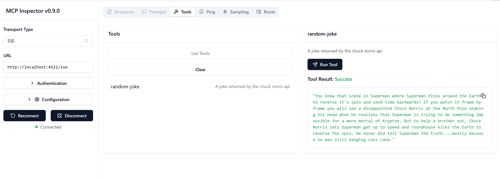

<!--
CO_OP_TRANSLATOR_METADATA:
{
  "original_hash": "a8831b194cb5ece750355e99434b7154",
  "translation_date": "2025-08-26T16:49:38+00:00",
  "source_file": "03-GettingStarted/05-sse-server/README.md",
  "language_code": "lt"
}
-->
# SSE Server

SSE (Server Sent Events) yra standartas, skirtas serverio ir kliento srautiniam perdavimui, leidžiantis serveriams realiuoju laiku siųsti atnaujinimus klientams per HTTP. Tai ypač naudinga programoms, kurioms reikalingi tiesioginiai atnaujinimai, pavyzdžiui, pokalbių programėlėms, pranešimams ar realaus laiko duomenų srautams. Be to, jūsų serveriu gali naudotis keli klientai vienu metu, nes jis veikia serveryje, kuris gali būti paleistas, pavyzdžiui, debesyje.

## Apžvalga

Šioje pamokoje aptarsime, kaip sukurti ir naudoti SSE serverius.

## Mokymosi tikslai

Šios pamokos pabaigoje jūs galėsite:

- Sukurti SSE serverį.
- Derinti SSE serverį naudojant Inspector.
- Naudoti SSE serverį su Visual Studio Code.

## SSE: kaip tai veikia

SSE yra vienas iš dviejų palaikomų transporto tipų. Pirmąjį, stdio, jau matėte ankstesnėse pamokose. Skirtumas yra toks:

- SSE reikalauja, kad valdytumėte du dalykus: ryšį ir žinutes.
- Kadangi tai yra serveris, kuris gali veikti bet kur, tai turi atsispindėti jūsų darbe su tokiais įrankiais kaip Inspector ir Visual Studio Code. Tai reiškia, kad vietoj to, kad nurodytumėte, kaip paleisti serverį, jūs nurodote galinį tašką, kuriame galima užmegzti ryšį. Žr. žemiau pateiktą kodo pavyzdį:

### TypeScript

```typescript
app.get("/sse", async (_: Request, res: Response) => {
    const transport = new SSEServerTransport('/messages', res);
    transports[transport.sessionId] = transport;
    res.on("close", () => {
        delete transports[transport.sessionId];
    });
    await server.connect(transport);
});

app.post("/messages", async (req: Request, res: Response) => {
    const sessionId = req.query.sessionId as string;
    const transport = transports[sessionId];
    if (transport) {
        await transport.handlePostMessage(req, res);
    } else {
        res.status(400).send('No transport found for sessionId');
    }
});
```

Šiame kode:

- `/sse` nustatytas kaip maršrutas. Kai pateikiamas užklausimas šiuo maršrutu, sukuriamas naujas transporto egzempliorius, o serveris *prisijungia* naudodamas šį transportą.
- `/messages` – tai maršrutas, kuris tvarko gaunamas žinutes.

### Python

```python
mcp = FastMCP("My App")

@mcp.tool()
def add(a: int, b: int) -> int:
    """Add two numbers"""
    return a + b

# Mount the SSE server to the existing ASGI server
app = Starlette(
    routes=[
        Mount('/', app=mcp.sse_app()),
    ]
)

```

Šiame kode mes:

- Sukuriame ASGI serverio egzempliorių (naudojant Starletter) ir prijungiame numatytąjį maršrutą `/`.

  Užkulisiuose maršrutai `/sse` ir `/messages` nustatomi ryšių ir žinučių tvarkymui. Likusi programos dalis, pavyzdžiui, funkcijų pridėjimas, vyksta taip pat, kaip ir su stdio serveriais.

### .NET    

```csharp
    var builder = WebApplication.CreateBuilder(args);
    builder.Services
        .AddMcpServer()
        .WithTools<Tools>();


    builder.Services.AddHttpClient();

    var app = builder.Build();

    app.MapMcp();
    ```

Yra du metodai, kurie padeda pereiti nuo žiniatinklio serverio prie SSE palaikančio serverio:

- `AddMcpServer` – šis metodas prideda galimybes.
- `MapMcp` – šis metodas prideda maršrutus, tokius kaip `/SSE` ir `/messages`.
```

Now that we know a little bit more about SSE, let's build an SSE server next.

## Exercise: Creating an SSE Server

To create our server, we need to keep two things in mind:

- We need to use a web server to expose endpoints for connection and messages.
- Build our server like we normally do with tools, resources and prompts when we were using stdio.

### -1- Create a server instance

To create our server, we use the same types as with stdio. However, for the transport, we need to choose SSE.

### TypeScript

```typescript
import { Request, Response } from "express";
import express from "express";
import { McpServer } from "@modelcontextprotocol/sdk/server/mcp.js";
import { SSEServerTransport } from "@modelcontextprotocol/sdk/server/sse.js";

const server = new McpServer({
  name: "example-server",
  version: "1.0.0"
});

const app = express();

const transports: {[sessionId: string]: SSEServerTransport} = {};
```

In the preceding code we've:

- Created a server instance.
- Defined an app using the web framework express.
- Created a transports variable that we will use to store incoming connections.

### Python

```python
from starlette.applications import Starlette
from starlette.routing import Mount, Host
from mcp.server.fastmcp import FastMCP


mcp = FastMCP("My App")
```

In the preceding code we've:

- Imported the libraries we're going to need with Starlette (an ASGI framework) being pulled in.
- Created an MCP server instance `mcp`.

### .NET

```csharp
var builder = WebApplication.CreateBuilder(args);
builder.Services
    .AddMcpServer();


builder.Services.AddHttpClient();

var app = builder.Build();

// TODO: pridėti maršrutus 
```

At this point, we've:

- Created a web app
- Added support for MCP features through `AddMcpServer`.

Let's add the needed routes next.

### -2- Add routes

Let's add routes next that handle the connection and incoming messages:

### TypeScript

```typescript
app.get("/sse", async (_: Request, res: Response) => {
  const transport = new SSEServerTransport('/messages', res);
  transports[transport.sessionId] = transport;
  res.on("close", () => {
    delete transports[transport.sessionId];
  });
  await server.connect(transport);
});

app.post("/messages", async (req: Request, res: Response) => {
  const sessionId = req.query.sessionId as string;
  const transport = transports[sessionId];
  if (transport) {
    await transport.handlePostMessage(req, res);
  } else {
    res.status(400).send('No transport found for sessionId');
  }
});

app.listen(3001);
```

In the preceding code we've defined:

- An `/sse` route that instantiates a transport of type SSE and ends up calling `connect` on the MCP server.
- A `/messages` route that takes care of incoming messages.

### Python

```python
app = Starlette(
    routes=[
        Mount('/', app=mcp.sse_app()),
    ]
)
```

In the preceding code we've:

- Created an ASGI app instance using the Starlette framework. As part of that we passes `mcp.sse_app()` to it's list of routes. That ends up mounting an `/sse` and `/messages` route on the app instance.

### .NET

```csharp
var builder = WebApplication.CreateBuilder(args);
builder.Services
    .AddMcpServer();

builder.Services.AddHttpClient();

var app = builder.Build();

app.MapMcp();
```

We've added one line of code at the end `add.MapMcp()` this means we now have routes `/SSE` and `/messages`. 

Let's add capabilties to the server next.

### -3- Adding server capabilities

Now that we've got everything SSE specific defined, let's add server capabilities like tools, prompts and resources.

### TypeScript

```typescript
server.tool("random-joke", "A joke returned by the chuck norris api", {},
  async () => {
    const response = await fetch("https://api.chucknorris.io/jokes/random");
    const data = await response.json();

    return {
      content: [
        {
          type: "text",
          text: data.value
        }
      ]
    };
  }
);
```

Here's how you can add a tool for example. This specific tool creates a tool call "random-joke" that calls a Chuck Norris API and returns a JSON response.

### Python

```python
@mcp.tool()
def add(a: int, b: int) -> int:
    """Sudėti du skaičius"""
    return a + b
```

Now your server has one tool.

### TypeScript

```typescript
// server-sse.ts
import { Request, Response } from "express";
import express from "express";
import { McpServer } from "@modelcontextprotocol/sdk/server/mcp.js";
import { SSEServerTransport } from "@modelcontextprotocol/sdk/server/sse.js";

// Sukurti MCP serverį
const server = new McpServer({
  name: "example-server",
  version: "1.0.0",
});

const app = express();

const transports: { [sessionId: string]: SSEServerTransport } = {};

app.get("/sse", async (_: Request, res: Response) => {
  const transport = new SSEServerTransport("/messages", res);
  transports[transport.sessionId] = transport;
  res.on("close", () => {
    delete transports[transport.sessionId];
  });
  await server.connect(transport);
});

app.post("/messages", async (req: Request, res: Response) => {
  const sessionId = req.query.sessionId as string;
  const transport = transports[sessionId];
  if (transport) {
    await transport.handlePostMessage(req, res);
  } else {
    res.status(400).send("No transport found for sessionId");
  }
});

server.tool("random-joke", "A joke returned by the chuck norris api", {}, async () => {
  const response = await fetch("https://api.chucknorris.io/jokes/random");
  const data = await response.json();

  return {
    content: [
      {
        type: "text",
        text: data.value,
      },
    ],
  };
});

app.listen(3001);
```

### Python

```python
from starlette.applications import Starlette
from starlette.routing import Mount, Host
from mcp.server.fastmcp import FastMCP


mcp = FastMCP("My App")

@mcp.tool()
def add(a: int, b: int) -> int:
    """Sudėti du skaičius"""
    return a + b

# Prijungti SSE serverį prie esamo ASGI serverio
app = Starlette(
    routes=[
        Mount('/', app=mcp.sse_app()),
    ]
)
```

### .NET

1. Let's create some tools first, for this we will create a file *Tools.cs* with the following content:

  ```csharp
  using System.ComponentModel;
  using System.Text.Json;
  using ModelContextProtocol.Server;

  namespace server;

  [McpServerToolType]
  public sealed class Tools
  {

      public Tools()
      {
      
      }

      [McpServerTool, Description("Sudėti du skaičius.")]
      public async Task<string> AddNumbers(
          [Description("Pirmas skaičius")] int a,
          [Description("Antras skaičius")] int b)
      {
          return (a + b).ToString();
      }

  }
  ```

  Here we've added the following:

  - Created a class `Tools` with the decorator `McpServerToolType`.
  - Defined a tool `AddNumbers` by decorating the method with `McpServerTool`. We've also provided parameters and an implementation.

1. Let's leverage the `Tools` class we just created:

  ```csharp
  var builder = WebApplication.CreateBuilder(args);
  builder.Services
      .AddMcpServer()
      .WithTools<Tools>();


  builder.Services.AddHttpClient();

  var app = builder.Build();

  app.MapMcp();
  ```

  We've added a call to `WithTools` that specifies `Tools` as the class containing the tools. That's it, we're ready.

Great, we have a server using SSE, let's take it for a spin next.

## Exercise: Debugging an SSE Server with Inspector

Inspector is a great tool that we saw in a previous lesson [Creating your first server](/03-GettingStarted/01-first-server/README.md). Let's see if we can use the Inspector even here:

### -1- Running the inspector

To run the inspector, you first must have an SSE server running, so let's do that next:

1. Run the server 

    ### TypeScript

    ```sh
    tsx && node ./build/server-sse.ts
    ```

    ### Python

    ```sh
    uvicorn server:app
    ```

    Note how we use the executable `uvicorn` that's installed when we typed `pip install "mcp[cli]"`. Typing `server:app` means we're trying to run a file `server.py` and for it to have a Starlette instance called `app`. 

    ### .NET

    ```sh
    dotnet run
    ```

    This should start the server. To interface with it you need a new terminal.

1. Run the inspector

    > ![NOTE]
    > Run this in a separate terminal window than the server is running in. Also note, you need to adjust the below command to fit the URL where your server runs.

    ```sh
    npx @modelcontextprotocol/inspector --cli http://localhost:8000/sse --method tools/list
    ```

    Inspector paleidimas atrodo vienodai visose aplinkose. Atkreipkite dėmesį, kad vietoj serverio kelio ir komandos serveriui paleisti mes nurodome URL, kuriame veikia serveris, ir taip pat nurodome `/sse` maršrutą.

### -2- Įrankio išbandymas

Prijunkite serverį pasirinkdami SSE iš išskleidžiamojo sąrašo ir užpildykite URL lauką, kuriame veikia jūsų serveris, pavyzdžiui, http:localhost:4321/sse. Dabar spustelėkite mygtuką „Connect“. Kaip ir anksčiau, pasirinkite įrankių sąrašą, pasirinkite įrankį ir pateikite įvesties reikšmes. Turėtumėte pamatyti rezultatą, kaip parodyta žemiau:



Puiku, jūs galite dirbti su Inspector, dabar pažiūrėkime, kaip dirbti su Visual Studio Code.

## Užduotis

Pabandykite išplėsti savo serverį pridėdami daugiau funkcijų. Žr. [šį puslapį](https://api.chucknorris.io/), kad, pavyzdžiui, pridėtumėte įrankį, kuris kviečia API. Jūs nusprendžiate, kaip turėtų atrodyti serveris. Smagiai praleiskite laiką :)

## Sprendimas

[Sprendimas](./solution/README.md) Čia pateiktas galimas sprendimas su veikiančiu kodu.

## Pagrindinės išvados

Pagrindinės šio skyriaus išvados yra šios:

- SSE yra antrasis palaikomas transporto tipas šalia stdio.
- Norint palaikyti SSE, reikia valdyti gaunamus ryšius ir žinutes naudojant žiniatinklio sistemą.
- Galite naudoti tiek Inspector, tiek Visual Studio Code SSE serveriui naudoti, kaip ir stdio serveriams. Atkreipkite dėmesį, kad yra nedidelių skirtumų tarp stdio ir SSE. SSE atveju reikia atskirai paleisti serverį, o tada paleisti Inspector įrankį. Inspector įrankiui taip pat yra skirtumų, nes reikia nurodyti URL.

## Pavyzdžiai

- [Java skaičiuotuvas](../samples/java/calculator/README.md)
- [.Net skaičiuotuvas](../../../../03-GettingStarted/samples/csharp)
- [JavaScript skaičiuotuvas](../samples/javascript/README.md)
- [TypeScript skaičiuotuvas](../samples/typescript/README.md)
- [Python skaičiuotuvas](../../../../03-GettingStarted/samples/python) 

## Papildomi ištekliai

- [SSE](https://developer.mozilla.org/en-US/docs/Web/API/Server-sent_events)

## Kas toliau

- Toliau: [HTTP srautinio perdavimo MCP (Streamable HTTP)](../06-http-streaming/README.md)

---

**Atsakomybės apribojimas**:  
Šis dokumentas buvo išverstas naudojant AI vertimo paslaugą [Co-op Translator](https://github.com/Azure/co-op-translator). Nors siekiame tikslumo, prašome atkreipti dėmesį, kad automatiniai vertimai gali turėti klaidų ar netikslumų. Originalus dokumentas jo gimtąja kalba turėtų būti laikomas autoritetingu šaltiniu. Dėl svarbios informacijos rekomenduojama profesionali žmogaus vertimo paslauga. Mes neprisiimame atsakomybės už nesusipratimus ar klaidingus interpretavimus, atsiradusius naudojant šį vertimą.