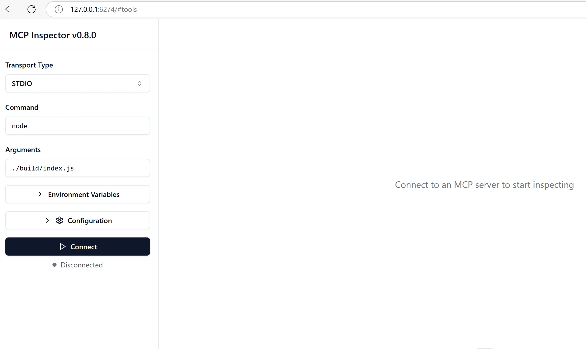

## Testavimas ir derinimas

Prieš pradėdami testuoti savo MCP serverį, svarbu suprasti turimus įrankius ir geriausias praktikas derinimui. Efektyvus testavimas užtikrina, kad jūsų serveris veiktų kaip tikėtasi, ir padeda greitai nustatyti bei išspręsti problemas. Toliau pateikta skyriuje aprašyta rekomenduojama MCP įgyvendinimo patikrinimo metodika.

## Apžvalga

Ši pamoka apima, kaip pasirinkti tinkamą testavimo metodą ir efektyviausią testavimo įrankį.

## Mokymosi tikslai

Šios pamokos pabaigoje sugebėsite:

- Apibūdinti įvairius testavimo metodus.
- Naudoti skirtingus įrankius savo kodo efektyviam testavimui.

## MCP serverių testavimas

MCP suteikia įrankius, padedančius testuoti ir derinti jūsų serverius:

- **MCP Inspector**: Komandinės eilutės įrankis, kurį galima naudoti tiek kaip CLI įrankį, tiek kaip grafinę sąsają.
- **Rankinis testavimas**: Galite naudoti įrankį, pavyzdžiui, curl, vykdyti interneto užklausas, tačiau tinka bet kuris įrankis, galintis vykdyti HTTP užklausas.
- **Vienetinis testavimas**: Galima naudoti savo mėgstamą testavimo sistemą tikrinti tiek serverio, tiek kliento funkcijas.

### Naudojimasis MCP Inspector

Šio įrankio naudojimą aptarėme ankstesnėse pamokose, tačiau trumpai apžvelkime aukštesniu lygiu. Tai Node.js pagrindu sukurtas įrankis, kurį galite naudoti paleisdami `npx` vykdomąjį failą, kuris laikinai atsisiųs ir įdiegs įrankį, o užklausos pabaigoje pats išsivalys.

[MCP Inspector](https://github.com/modelcontextprotocol/inspector) padeda:

- **Aptikti serverio galimybes**: Automatiškai nustatyti turimus išteklius, įrankius ir užklausas
- **Išbandyti įrankių vykdymą**: Išmėginti skirtingus parametrus ir realiu laiku matyti atsakymus
- **Peržiūrėti serverio metaduomenis**: Patikrinkite serverio informaciją, schemas ir konfigūracijas

Tipinis įrankio paleidimas atrodo taip:

```bash
npx @modelcontextprotocol/inspector node build/index.js
```

Aukščiau pateikta komanda paleidžia MCP ir jo grafinę sąsają, taip pat atidaro vietinę interneto sąsają jūsų naršyklėje. Matysite prietaisų skydelį, rodantį jūsų registruotus MCP serverius, jų turimus įrankius, išteklius ir užklausas. Sąsaja leidžia interaktyviai išbandyti įrankių vykdymą, peržiūrėti serverio metaduomenis ir matyti atsakymus realiu laiku, taip palengvinant MCP serverio įgyvendinimų patikrinimą ir derinimą.

Taip tai gali atrodyti: 

Taip pat galite paleisti įrankį CLI režimu, pridėdami atributą `--cli`. Štai pavyzdys, kaip paleisti įrankį „CLI“ režimu, kuris išvardina visus serverio įrankius:

```sh
npx @modelcontextprotocol/inspector --cli node build/index.js --method tools/list
```


### Rankinis testavimas

Be inspector įrankio paleidimo testuoti serverio galimybes, panašią metodiką galite taikyti paleisdami klientą, palaikantį HTTP, pavyzdžiui, curl.

Su curl galite tiesiogiai testuoti MCP serverius vykdydami HTTP užklausas:

```bash
# Pavyzdys: Testinio serverio metaduomenys
curl http://localhost:3000/v1/metadata

# Pavyzdys: Įrankio vykdymas
curl -X POST http://localhost:3000/v1/tools/execute \
  -H "Content-Type: application/json" \
  -d '{"name": "calculator", "parameters": {"expression": "2+2"}}'
```

Kaip matote iš aukščiau pateikto curl pavyzdžio, naudojate POST užklausą įrankio kvietimui, pateikdami krovinį, kuriame nurodytas įrankio pavadinimas ir jo parametrai. Naudokite jums tinkamiausią metodą. CLI įrankiai paprastai yra greitesni naudoti ir juos lengva skriptuoti, kas gali būti naudinga CI/CD aplinkoje.

### Vienetiniai testai

Sukurkite vienetinius testus savo įrankiams ir ištekliams, kad įsitikintumėte, jog jie veikia kaip tikėtasi. Štai keletas pavyzdinių testavimo kodo fragmentų.

```python
import pytest

from mcp.server.fastmcp import FastMCP
from mcp.shared.memory import (
    create_connected_server_and_client_session as create_session,
)

# Pažymėkite visą modulį asinchroniniams testams
pytestmark = pytest.mark.anyio


async def test_list_tools_cursor_parameter():
    """Test that the cursor parameter is accepted for list_tools.

    Note: FastMCP doesn't currently implement pagination, so this test
    only verifies that the cursor parameter is accepted by the client.
    """

 server = FastMCP("test")

    # Sukurkite keletą testavimo įrankių
    @server.tool(name="test_tool_1")
    async def test_tool_1() -> str:
        """First test tool"""
        return "Result 1"

    @server.tool(name="test_tool_2")
    async def test_tool_2() -> str:
        """Second test tool"""
        return "Result 2"

    async with create_session(server._mcp_server) as client_session:
        # Testuoti be žymeklio parametro (praleista)
        result1 = await client_session.list_tools()
        assert len(result1.tools) == 2

        # Testuoti su cursor=None
        result2 = await client_session.list_tools(cursor=None)
        assert len(result2.tools) == 2

        # Testuoti su žymekliu kaip eilute
        result3 = await client_session.list_tools(cursor="some_cursor_value")
        assert len(result3.tools) == 2

        # Testuoti su tuščiu eilutės žymekliu
        result4 = await client_session.list_tools(cursor="")
        assert len(result4.tools) == 2
    
```

Aukščiau pateiktas kodas daro šiuos veiksmus:

- Naudoja pytest sistemą, leidžiančią kurti testus funkcijų pavidalu ir naudoti assert sakinius.
- Sukuria MCP serverį su dviem skirtingais įrankiais.
- Naudoja `assert` sakinį tikrinti, ar tam tikros sąlygos įvykdytos.

Peržiūrėkite [visą failą čia](https://github.com/modelcontextprotocol/python-sdk/blob/main/tests/client/test_list_methods_cursor.py)

Remdamiesi aukščiau esančiu failu, galite testuoti savo serverį, kad įsitikintumėte, jog galimybės sukurtos taip, kaip numatyta.

Visi pagrindiniai SDK turi panašius testavimo skyrius, todėl galite juos pritaikyti pasirinktai vykdymo aplinkai.

## Pavyzdžiai

- [Java skaičiuoklė](../samples/java/calculator/README.md)
- [.Net skaičiuoklė](../../../../03-GettingStarted/samples/csharp)
- [JavaScript skaičiuoklė](../samples/javascript/README.md)
- [TypeScript skaičiuoklė](../samples/typescript/README.md)
- [Python skaičiuoklė](../../../../03-GettingStarted/samples/python)

## Papildomi ištekliai

- [Python SDK](https://github.com/modelcontextprotocol/python-sdk)

## Kas toliau

- Toliau: [Diegimas](../09-deployment/README.md)

---

<!-- CO-OP TRANSLATOR DISCLAIMER START -->
**Atsakomybės apribojimas**:
Šis dokumentas buvo išverstas naudojantis dirbtinio intelekto vertimo paslauga [Co-op Translator](https://github.com/Azure/co-op-translator). Nors stengiamės užtikrinti tikslumą, prašome suprasti, kad automatiniai vertimai gali turėti klaidų ar netikslumų. Originalus dokumentas jo gimtąja kalba turėtų būti laikomas autoritetingu šaltiniu. Kritinei informacijai rekomenduojama profesionali žmogaus atlikta vertimo paslauga. Mes neprisiimame atsakomybės už bet kokius nesusipratimus ar neteisingą interpretavimą, kylančius dėl šio vertimo naudojimo.
<!-- CO-OP TRANSLATOR DISCLAIMER END -->