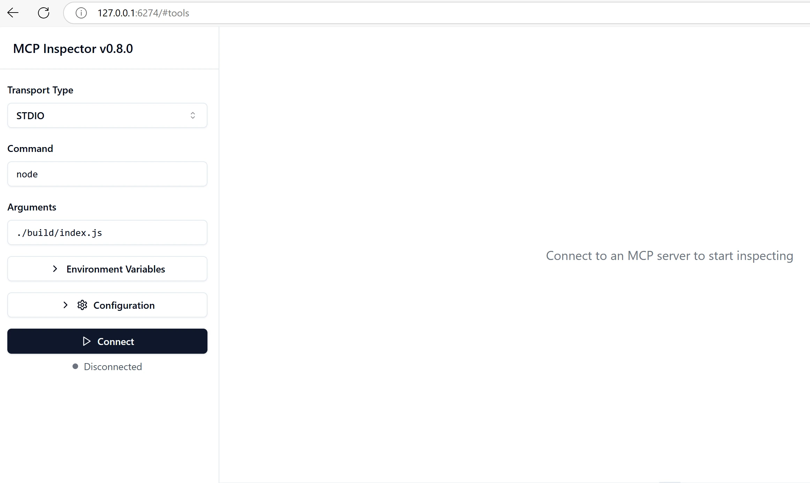

## Testavimas ir derinimas

Prieš pradėdami testuoti savo MCP serverį, svarbu suprasti turimus įrankius ir geriausią praktiką derinant. Efektyvus testavimas užtikrina, kad jūsų serveris veiktų taip, kaip numatyta, ir padeda greitai nustatyti bei spręsti problemas. Toliau pateiktoje skiltyje apžvelgiamos rekomenduojamos MCP įgyvendinimo patikros priemonės.

## Apžvalga

Šiame pamokoje aptariama, kaip pasirinkti tinkamą testavimo metodą ir efektyviausią testavimo įrankį.

## Mokymosi tikslai

Pamokos pabaigoje galėsite:

- Apibūdinti įvairius testavimo metodus.
- Naudoti skirtingus įrankius efektyviam kodo testavimui.


## MCP serverių testavimas

MCP suteikia įrankius, kurie padeda testuoti ir derinti jūsų serverius:

- **MCP Inspector**: Komandinės eilutės įrankis, kurį galima naudoti tiek CLI režimu, tiek vizualiai.
- **Rankinis testavimas**: Galite naudoti įrankį, pavyzdžiui, curl, vykdyti interneto užklausas, tačiau tinka bet koks HTTP palaikantis įrankis.
- **Vienetinis testavimas**: Galima naudoti pageidaujamą testavimo karkasą, kad būtų testuojamos tiek serverio, tiek kliento funkcijos.

### MCP Inspector naudojimas

Šio įrankio naudojimą aprašėme ankstesnėse pamokose, tačiau aptarkime jį trumpai. Tai Node.js pagrindu sukurtas įrankis, kurį galite naudoti iškviesdami vykdomąjį failą `npx`; jis laikinai atsisiunčia ir įdiegia įrankį, o po užklausos paleidimo savarankiškai išvalomas.

[MCP Inspector](https://github.com/modelcontextprotocol/inspector) padeda:

- **Aptikti serverio galimybes**: Automatiškai surasti turimus išteklius, įrankius ir užklausų šablonus
- **Testuoti įrankių vykdymą**: Išbandyti skirtingus parametrus ir matyti atsakymus realiuoju laiku
- **Peržiūrėti serverio metaduomenis**: Išnagrinėti serverio informaciją, schemas ir konfigūracijas

Įprastas įrankio paleidimas atrodo taip:

```bash
npx @modelcontextprotocol/inspector node build/index.js
```

Aukščiau pateiktas komandos pavyzdys paleidžia MCP ir jo vizualią sąsają bei atidaro vietinį interneto naršyklės langą. Galite tikėtis matyti informacijos suvestinę, kurioje rodomi užregistruoti MCP serveriai, jų turimi įrankiai, ištekliai ir užklausų šablonai. Sąsaja leidžia interaktyviai testuoti įrankių vykdymą, tikrinti serverio metaduomenis ir matyti atsakymus realiuoju laiku, todėl paprasčiau patikrinti ir derinti MCP serverio įgyvendinimus.

Štai kaip tai gali atrodyti: 

Taip pat galite paleisti šį įrankį CLI režimu pridėdami atributą `--cli`. Štai pavyzdys, kaip paleisti įrankį "CLI" režimu, kuris išrašo visus serverio įrankius:

```sh
npx @modelcontextprotocol/inspector --cli node build/index.js --method tools/list
```

### Rankinis testavimas

Be Inspectoriaus įrankio naudojimo serverio galimybėms tikrinti, panašią funkciją atlieka klientas, galintis naudoti HTTP, pavyzdžiui, curl.

Naudodami curl galite tiesiogiai testuoti MCP serverius HTTP užklausomis:

```bash
# Pavyzdys: Testavimo serverio meta duomenys
curl http://localhost:3000/v1/metadata

# Pavyzdys: Vykdyti įrankį
curl -X POST http://localhost:3000/v1/tools/execute \
  -H "Content-Type: application/json" \
  -d '{"name": "calculator", "parameters": {"expression": "2+2"}}'
```

Kaip matote iš aukščiau pateikto curl pavyzdžio, naudojama POST užklausa įrankiui iškviesti su kroviniu, kuriame nurodytas įrankio pavadinimas ir jo parametrai. Pasirinkite jums tinkamą būdą. CLI įrankiai paprastai yra greitesni naudoti ir juos lengva aprašyti kaip scenarijus, kas naudinga CI/CD aplinkoje.

### Vienetinis testavimas

Sukurkite vienetinius testus savo įrankiams ir ištekliams, kad įsitikintumėte jų teisingu veikimu. Štai keletas testavimo kodo pavyzdžių.

```python
import pytest

from mcp.server.fastmcp import FastMCP
from mcp.shared.memory import (
    create_connected_server_and_client_session as create_session,
)

# Pažymėkite visą modulį asinchroniniams testams
pytestmark = pytest.mark.anyio


async def test_list_tools_cursor_parameter():
    """Test that the cursor parameter is accepted for list_tools.

    Note: FastMCP doesn't currently implement pagination, so this test
    only verifies that the cursor parameter is accepted by the client.
    """

 server = FastMCP("test")

    # Sukurkite keletą testavimo įrankių
    @server.tool(name="test_tool_1")
    async def test_tool_1() -> str:
        """First test tool"""
        return "Result 1"

    @server.tool(name="test_tool_2")
    async def test_tool_2() -> str:
        """Second test tool"""
        return "Result 2"

    async with create_session(server._mcp_server) as client_session:
        # Testuoti be cursor parametro (praleista)
        result1 = await client_session.list_tools()
        assert len(result1.tools) == 2

        # Testuoti su cursor=None
        result2 = await client_session.list_tools(cursor=None)
        assert len(result2.tools) == 2

        # Testuoti su cursor kaip eilutė
        result3 = await client_session.list_tools(cursor="some_cursor_value")
        assert len(result3.tools) == 2

        # Testuoti su tuščios eilutės cursor
        result4 = await client_session.list_tools(cursor="")
        assert len(result4.tools) == 2
    
```

Aukščiau pateiktas kodas atlieka šiuos veiksmus:

- Naudoja pytest karkasą, kuris leidžia kurti testus kaip funkcijas ir naudoti assert sakinius.
- Sukuria MCP serverį su dviem skirtingais įrankiais.
- Naudoja `assert` sakinį tikrinti, ar tam tikros sąlygos yra įvykdytos.

Peržiūrėkite [pilną failą čia](https://github.com/modelcontextprotocol/python-sdk/blob/main/tests/client/test_list_methods_cursor.py)

Turėdamas aukščiau nurodytą failą, galite testuoti savo serverį, kad įsitikintumėte, jog galimybės yra sukurtos tinkamai.

Visi pagrindiniai SDK turi panašias testavimo dalis, tad galėsite jas pritaikyti pasirinktai vykdymo aplinkai.

## Pavyzdžiai

- [Java skaičiuotuvas](../samples/java/calculator/README.md)
- [.Net skaičiuotuvas](../../../../03-GettingStarted/samples/csharp)
- [JavaScript skaičiuotuvas](../samples/javascript/README.md)
- [TypeScript skaičiuotuvas](../samples/typescript/README.md)
- [Python skaičiuotuvas](../../../../03-GettingStarted/samples/python)

## Papildomi ištekliai

- [Python SDK](https://github.com/modelcontextprotocol/python-sdk)

## Toliau

- Toliau: [Diegimas](../09-deployment/README.md)

---

<!-- CO-OP TRANSLATOR DISCLAIMER START -->
**Atsakomybės apribojimas**:
Šis dokumentas buvo išverstas naudojant dirbtinio intelekto vertimo paslaugą [Co-op Translator](https://github.com/Azure/co-op-translator). Nors siekiame tikslumo, prašome atkreipti dėmesį, kad automatiniai vertimai gali turėti klaidų ar netikslumų. Originalus dokumentas jo gimtąja kalba laikomas autoritetingu šaltiniu. Svarbiai informacijai rekomenduojama naudoti profesionalų žmogiškąjį vertimą. Mes neatsakome už jokius nesusipratimus ar neteisingą interpretaciją, kilusią naudojantis šiuo vertimu.
<!-- CO-OP TRANSLATOR DISCLAIMER END -->