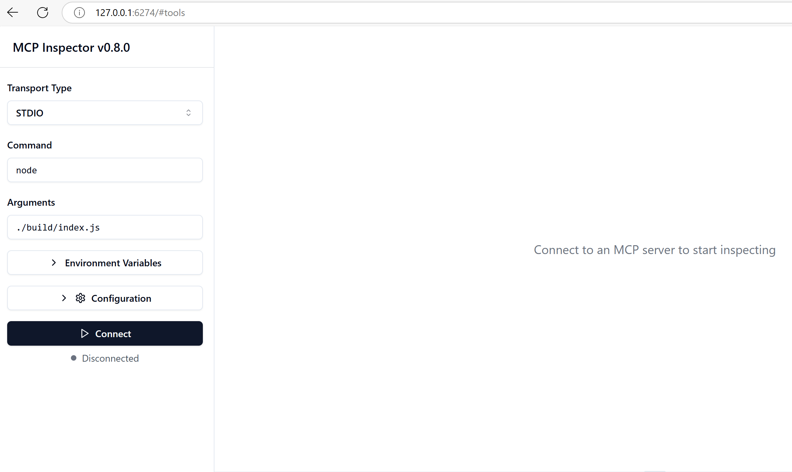

<!--
CO_OP_TRANSLATOR_METADATA:
{
  "original_hash": "4e34e34e84f013e73c7eaa6d09884756",
  "translation_date": "2025-08-26T16:48:23+00:00",
  "source_file": "03-GettingStarted/08-testing/README.md",
  "language_code": "lt"
}
-->
## Testavimas ir derinimas

Prieš pradėdami testuoti savo MCP serverį, svarbu suprasti, kokie įrankiai ir geriausios praktikos yra prieinami derinimui. Efektyvus testavimas užtikrina, kad jūsų serveris veikia taip, kaip tikėtasi, ir padeda greitai nustatyti bei išspręsti problemas. Šiame skyriuje aprašomi rekomenduojami metodai, kaip patikrinti jūsų MCP įgyvendinimą.

## Apžvalga

Šioje pamokoje aptarsime, kaip pasirinkti tinkamą testavimo metodą ir efektyviausią testavimo įrankį.

## Mokymosi tikslai

Šios pamokos pabaigoje jūs galėsite:

- Apibūdinti įvairius testavimo metodus.
- Naudoti skirtingus įrankius efektyviam kodo testavimui.

## MCP serverių testavimas

MCP siūlo įrankius, kurie padeda testuoti ir derinti jūsų serverius:

- **MCP Inspector**: Komandinės eilutės įrankis, kurį galima naudoti tiek kaip CLI įrankį, tiek kaip vizualų įrankį.
- **Rankinis testavimas**: Galite naudoti tokį įrankį kaip curl HTTP užklausoms vykdyti, tačiau tiks bet kuris įrankis, galintis dirbti su HTTP.
- **Vienetų testavimas**: Galite naudoti savo mėgstamą testavimo sistemą, kad patikrintumėte tiek serverio, tiek kliento funkcijas.

### MCP Inspector naudojimas

Apie šio įrankio naudojimą jau kalbėjome ankstesnėse pamokose, tačiau aptarkime jį aukštesniu lygiu. Tai Node.js pagrindu sukurtas įrankis, kurį galite naudoti per `npx` vykdomąjį failą. Jis laikinai atsisiųs ir įdiegs įrankį, o po užklausos vykdymo pats save išvalys.

[MCP Inspector](https://github.com/modelcontextprotocol/inspector) padeda:

- **Aptikti serverio galimybes**: Automatiškai nustatyti prieinamus resursus, įrankius ir užklausas.
- **Testuoti įrankių vykdymą**: Išbandyti skirtingus parametrus ir realiu laiku matyti atsakymus.
- **Peržiūrėti serverio metaduomenis**: Išnagrinėti serverio informaciją, schemas ir konfigūracijas.

Tipinis šio įrankio paleidimas atrodo taip:

```bash
npx @modelcontextprotocol/inspector node build/index.js
```

Aukščiau pateikta komanda paleidžia MCP ir jo vizualią sąsają, taip pat atidaro vietinę žiniatinklio sąsają jūsų naršyklėje. Galite tikėtis pamatyti prietaisų skydelį, kuriame rodomi jūsų registruoti MCP serveriai, jų prieinami įrankiai, resursai ir užklausos. Sąsaja leidžia interaktyviai testuoti įrankių vykdymą, tikrinti serverio metaduomenis ir matyti realaus laiko atsakymus, todėl lengviau patikrinti ir derinti jūsų MCP serverio įgyvendinimus.

Štai kaip tai gali atrodyti: 

Taip pat galite paleisti šį įrankį CLI režimu, pridėdami atributą `--cli`. Štai pavyzdys, kaip paleisti įrankį "CLI" režimu, kuris išvardija visus serverio įrankius:

```sh
npx @modelcontextprotocol/inspector --cli node build/index.js --method tools/list
```

### Rankinis testavimas

Be inspektoriaus įrankio naudojimo serverio galimybėms testuoti, panašus metodas yra naudoti klientą, galintį dirbti su HTTP, pavyzdžiui, curl.

Naudodami curl, galite tiesiogiai testuoti MCP serverius per HTTP užklausas:

```bash
# Example: Test server metadata
curl http://localhost:3000/v1/metadata

# Example: Execute a tool
curl -X POST http://localhost:3000/v1/tools/execute \
  -H "Content-Type: application/json" \
  -d '{"name": "calculator", "parameters": {"expression": "2+2"}}'
```

Kaip matote iš aukščiau pateikto curl naudojimo, POST užklausa naudojama įrankiui paleisti, pateikiant užklausos turinį, kuriame yra įrankio pavadinimas ir jo parametrai. Naudokite jums tinkamiausią metodą. CLI įrankiai paprastai yra greitesni naudoti ir leidžia juos automatizuoti, kas gali būti naudinga CI/CD aplinkoje.

### Vienetų testavimas

Sukurkite vienetų testus savo įrankiams ir resursams, kad užtikrintumėte, jog jie veikia taip, kaip tikėtasi. Štai pavyzdinis testavimo kodas:

```python
import pytest

from mcp.server.fastmcp import FastMCP
from mcp.shared.memory import (
    create_connected_server_and_client_session as create_session,
)

# Mark the whole module for async tests
pytestmark = pytest.mark.anyio


async def test_list_tools_cursor_parameter():
    """Test that the cursor parameter is accepted for list_tools.

    Note: FastMCP doesn't currently implement pagination, so this test
    only verifies that the cursor parameter is accepted by the client.
    """

 server = FastMCP("test")

    # Create a couple of test tools
    @server.tool(name="test_tool_1")
    async def test_tool_1() -> str:
        """First test tool"""
        return "Result 1"

    @server.tool(name="test_tool_2")
    async def test_tool_2() -> str:
        """Second test tool"""
        return "Result 2"

    async with create_session(server._mcp_server) as client_session:
        # Test without cursor parameter (omitted)
        result1 = await client_session.list_tools()
        assert len(result1.tools) == 2

        # Test with cursor=None
        result2 = await client_session.list_tools(cursor=None)
        assert len(result2.tools) == 2

        # Test with cursor as string
        result3 = await client_session.list_tools(cursor="some_cursor_value")
        assert len(result3.tools) == 2

        # Test with empty string cursor
        result4 = await client_session.list_tools(cursor="")
        assert len(result4.tools) == 2
    
```

Aukščiau pateiktas kodas atlieka šiuos veiksmus:

- Naudoja pytest sistemą, kuri leidžia kurti testus kaip funkcijas ir naudoti assert teiginius.
- Sukuria MCP serverį su dviem skirtingais įrankiais.
- Naudoja `assert` teiginį, kad patikrintų, ar tam tikros sąlygos yra įvykdytos.

Peržiūrėkite [pilną failą čia](https://github.com/modelcontextprotocol/python-sdk/blob/main/tests/client/test_list_methods_cursor.py)

Remdamiesi aukščiau pateiktu failu, galite testuoti savo serverį, kad užtikrintumėte, jog galimybės sukurtos taip, kaip turėtų būti.

Visos pagrindinės SDK turi panašias testavimo sekcijas, todėl galite pritaikyti jas savo pasirinktam vykdymo laikui.

## Pavyzdžiai

- [Java skaičiuotuvas](../samples/java/calculator/README.md)
- [.Net skaičiuotuvas](../../../../03-GettingStarted/samples/csharp)
- [JavaScript skaičiuotuvas](../samples/javascript/README.md)
- [TypeScript skaičiuotuvas](../samples/typescript/README.md)
- [Python skaičiuotuvas](../../../../03-GettingStarted/samples/python)

## Papildomi ištekliai

- [Python SDK](https://github.com/modelcontextprotocol/python-sdk)

## Kas toliau

- Toliau: [Diegimas](../09-deployment/README.md)

---

**Atsakomybės apribojimas**:  
Šis dokumentas buvo išverstas naudojant AI vertimo paslaugą [Co-op Translator](https://github.com/Azure/co-op-translator). Nors siekiame tikslumo, prašome atkreipti dėmesį, kad automatiniai vertimai gali turėti klaidų ar netikslumų. Originalus dokumentas jo gimtąja kalba turėtų būti laikomas autoritetingu šaltiniu. Kritinei informacijai rekomenduojama naudoti profesionalų žmogaus vertimą. Mes neprisiimame atsakomybės už nesusipratimus ar klaidingus interpretavimus, atsiradusius dėl šio vertimo naudojimo.