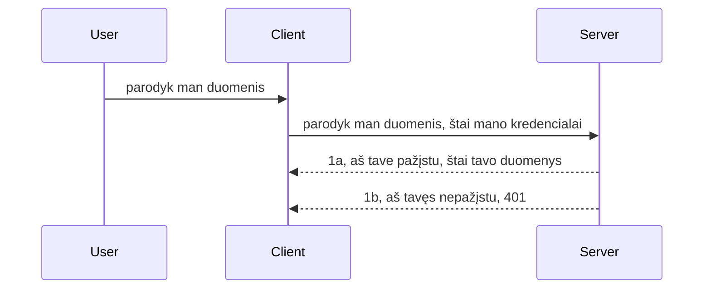

# Paprasta autentifikacija

MCP SDK palaiko OAuth 2.1 naudojimą, kuris, tiesą sakant, yra gana sudėtingas procesas apimantis tokius konceptus kaip autentifikavimo serveris, resursų serveris, kredencialų pateikimas, kodo gavimas, kodo pavertimas prieigos žetonu, kol pagaliau galite gauti savo resurso duomenis. Jei nesate pratę prie OAuth, kuris yra puikus dalykas diegti, gera pradėti nuo kai kurių paprastų autentifikacijos lygių ir palaipsniui kelti sau saugumo lygį. Būtent todėl šis skyrius egzistuoja – padėti jums žengti į pažangesnę autentifikaciją.

## Autentifikacija, ką turime omenyje?

Autentifikacija yra trumpinys iš autentifikavimo ir autorizavimo. Idėja yra tokia, kad turime padaryti dvi dalykus:

- **Autentifikavimas**, tai procesas, kuriuo sužinome, ar leidžiame asmeniui įeiti į mūsų namus, ar jie turi teisę būti „čionai“, tai yra turėti prieigą prie mūsų resursų serverio, kuriame veikia mūsų MCP Serverio funkcijos.
- **Autorizavimas**, tai procesas, kuriuo sužinome, ar vartotojas turėtų turėti prieigą prie konkrečių resursų, kurių jis prašo, pavyzdžiui, šių užsakymų ar produktų, arba ar jam leidžiama skaityti turinį, bet ne naikinti, kaip kitą pavyzdį.

## Kredencialai: kaip mes sakome sistemai, kas mes esame

Dauguma interneto kūrėjų pradeda mąstyti suteikdami serveriui kredencialą, dažniausiai paslaptį, rodantį, ar jiems leidžiama būti čia – „Autentifikacija“. Šis kredencialas paprastai yra bazinio64 kodo versija su vartotojo vardu ir slaptažodžiu arba API raktas, kuris unikaliai identifikuoja konkretų vartotoją.

Tai vyksta siunčiant HTTP antraštę pavadinimu "Authorization" tokiu būdu:

```json
{ "Authorization": "secret123" }
```

Tai dažnai vadinama pagrindine autentifikacija. Bendras srauto veikimas yra toks:


Dabar, kai suprantame kaip tai veikia iš srauto perspektyvos, kaip tai įgyvendinti? Dauguma žiniatinklio serverių turi koncepciją, vadinamą tarpinis programinis sluoksnis (middleware), tai kodas, kuris vykdomas kaip užklausos dalis, gali patikrinti kredencialus ir, jei jie galioja, leidžia užklausai praėjimą. Jei užklausa neturi galiojančių kredencialų, gaunate autentifikavimo klaidą. Pažiūrėkime, kaip tai galima įgyvendinti:

**Python**

```python
class AuthMiddleware(BaseHTTPMiddleware):
    async def dispatch(self, request, call_next):

        has_header = request.headers.get("Authorization")
        if not has_header:
            print("-> Missing Authorization header!")
            return Response(status_code=401, content="Unauthorized")

        if not valid_token(has_header):
            print("-> Invalid token!")
            return Response(status_code=403, content="Forbidden")

        print("Valid token, proceeding...")
       
        response = await call_next(request)
        # pridėti bet kokius kliento antraštes arba kitaip pakeisti atsakymą
        return response


starlette_app.add_middleware(CustomHeaderMiddleware)
```

Čia turime:

- Sukurtą tarpprograminį sluoksnį pavadinimu `AuthMiddleware`, kurio `dispatch` metodas kviečiamas žiniatinklio serverio.
- Pridėtą tarpprograminį sluoksnį prie žiniatinklio serverio:

    ```python
    starlette_app.add_middleware(AuthMiddleware)
    ```

- Parašytą patikros logiką, kuri tikrina, ar yra „Authorization“ antraštė ir ar siunčiamas slaptasis raktas yra galiojantis:

    ```python
    has_header = request.headers.get("Authorization")
    if not has_header:
        print("-> Missing Authorization header!")
        return Response(status_code=401, content="Unauthorized")

    if not valid_token(has_header):
        print("-> Invalid token!")
        return Response(status_code=403, content="Forbidden")
    ```

   jei slaptasis raktas yra pateiktas ir galiojantis, leidžiame užklausai praėjimą kviesdami `call_next` ir grąžiname atsakymą.

    ```python
    response = await call_next(request)
    # pridėti bet kokius kliento antraštes arba kokiu nors būdu pakeisti atsakymą
    return response
    ```

Veikia taip: jei į serverį ateina užklausa, bus kviečiamas tarpprograminis sluoksnis ir pagal jo įgyvendinimą užklausa arba bus praleista, arba grąžinama klaida, nurodanti, kad klientui neleidžiama tęsti.

**TypeScript**

Čia kuriame tarpprograminį sluoksnį naudodami populiarų Express karkasą ir perimame užklausą prieš ją pasiekiant MCP Serverį. Štai kodas:

```typescript
function isValid(secret) {
    return secret === "secret123";
}

app.use((req, res, next) => {
    // 1. Ar yra autorizacijos antraštė?
    if(!req.headers["Authorization"]) {
        res.status(401).send('Unauthorized');
    }
    
    let token = req.headers["Authorization"];

    // 2. Patikrinkite galiojimą.
    if(!isValid(token)) {
        res.status(403).send('Forbidden');
    }

   
    console.log('Middleware executed');
    // 3. Pateikia užklausą kitam užklausų vamzdyno žingsniui.
    next();
});
```

Šiame kode mes:

1. Tikriname, ar yra „Authorization“ antraštė, jei nėra, siunčiame 401 klaidą.
2. Užtikriname, kad kredencialas/žetonas galioja, jei ne, siunčiame 403 klaidą.
3. Galiausiai perduodame užklausą toliau eilėje ir grąžiname reikalaujamą resursą.

## Pratimai: Įgyvendinkite autentifikaciją

Pažiūrėkime, kaip įgyvendinti tai praktiškai. Štai planas:

Serveris

- Sukurkite žiniatinklio serverį ir MCP instanciją.
- Įdiekite tarpinį programinį sluoksnį serveriui.

Klientas

- Siųskite žiniatinklio užklausą su kredencialu per antraštę.

### -1- Sukurkite žiniatinklio serverį ir MCP instanciją

Pirmame žingsnyje reikia sukurti žiniatinklio serverio instanciją ir MCP Serverį.

**Python**

Čia sukuriame MCP serverio instanciją, starlette žiniatinklio programą ir paleidžiame ją naudodami uvicorn.

```python
# kuriamas MCP serveris

app = FastMCP(
    name="MCP Resource Server",
    instructions="Resource Server that validates tokens via Authorization Server introspection",
    host=settings["host"],
    port=settings["port"],
    debug=True
)

# kuriama starlette žiniatinklio programa
starlette_app = app.streamable_http_app()

# teikiama programa per uvicorn
async def run(starlette_app):
    import uvicorn
    config = uvicorn.Config(
            starlette_app,
            host=app.settings.host,
            port=app.settings.port,
            log_level=app.settings.log_level.lower(),
        )
    server = uvicorn.Server(config)
    await server.serve()

run(starlette_app)
```

Šiame kode mes:

- Sukūrėme MCP Serverį.
- Sukonstravome starlette žiniatinklio programą iš MCP Serverio, `app.streamable_http_app()`.
- Paleidome ir aptarnaujame žiniatinklio programą naudodami uvicorn `server.serve()`.

**TypeScript**

Čia sukuriame MCP Serverio instanciją.

```typescript
const server = new McpServer({
      name: "example-server",
      version: "1.0.0"
    });

    // ... nustatyti serverio išteklius, įrankius ir užklausas ...
```

Šis MCP Serverio kūrimas turi įvykti mūsų POST /mcp maršruto apibrėžime, taigi paimkime aukščiau nurodytą kodą ir perkėlkime jį taip:

```typescript
import express from "express";
import { randomUUID } from "node:crypto";
import { McpServer } from "@modelcontextprotocol/sdk/server/mcp.js";
import { StreamableHTTPServerTransport } from "@modelcontextprotocol/sdk/server/streamableHttp.js";
import { isInitializeRequest } from "@modelcontextprotocol/sdk/types.js"

const app = express();
app.use(express.json());

// Žemėlapis transportams saugoti pagal sesijos ID
const transports: { [sessionId: string]: StreamableHTTPServerTransport } = {};

// Apdoroti POST užklausas klientas-serveris komunikacijai
app.post('/mcp', async (req, res) => {
  // Patikrinti, ar yra esamas sesijos ID
  const sessionId = req.headers['mcp-session-id'] as string | undefined;
  let transport: StreamableHTTPServerTransport;

  if (sessionId && transports[sessionId]) {
    // Pakartotinai naudoti esamą transportą
    transport = transports[sessionId];
  } else if (!sessionId && isInitializeRequest(req.body)) {
    // Naujas inicijavimo prašymas
    transport = new StreamableHTTPServerTransport({
      sessionIdGenerator: () => randomUUID(),
      onsessioninitialized: (sessionId) => {
        // Saugo transportą pagal sesijos ID
        transports[sessionId] = transport;
      },
      // DNS persaistymo apsauga pagal numatytuosius nustatymus išjungta dėl suderinamumo atgal. Jei paleidžiate šį serverį
      // vietoje, būtinai nustatykite:
      // enableDnsRebindingProtection: true,
      // allowedHosts: ['127.0.0.1'],
    });

    // Išvalyti transportą po uždarymo
    transport.onclose = () => {
      if (transport.sessionId) {
        delete transports[transport.sessionId];
      }
    };
    const server = new McpServer({
      name: "example-server",
      version: "1.0.0"
    });

    // ... nustatyti serverio išteklius, įrankius ir užklausas ...

    // Prisijungti prie MCP serverio
    await server.connect(transport);
  } else {
    // Neteisingas užklausimas
    res.status(400).json({
      jsonrpc: '2.0',
      error: {
        code: -32000,
        message: 'Bad Request: No valid session ID provided',
      },
      id: null,
    });
    return;
  }

  // Apdoroti užklausą
  await transport.handleRequest(req, res, req.body);
});

// Pakartotinai naudojamas apdorotojas GET ir DELETE užklausoms
const handleSessionRequest = async (req: express.Request, res: express.Response) => {
  const sessionId = req.headers['mcp-session-id'] as string | undefined;
  if (!sessionId || !transports[sessionId]) {
    res.status(400).send('Invalid or missing session ID');
    return;
  }
  
  const transport = transports[sessionId];
  await transport.handleRequest(req, res);
};

// Apdoroti GET užklausas serverio-kliento pranešimams per SSE
app.get('/mcp', handleSessionRequest);

// Apdoroti DELETE užklausas sesijos nutraukimui
app.delete('/mcp', handleSessionRequest);

app.listen(3000);
```

Dabar matote, kaip MCP Serverio kūrimas buvo perkeltas į `app.post("/mcp")`.

Toliau pereikime prie tarpinio programinio sluoksnio kūrimo, kad galėtume tikrinti atėjusius kredencialus.

### -2- Įdiekite tarpinį programinį sluoksnį serveriui

Toliau pereisime prie tarpinio programinio sluoksnio dalies. Čia kursime tarpinį sluoksnį, kuris ieško kredencialo `Authorization` antraštėje ir jį tikrina. Jei jis priimtinas, užklausa tęsis ir atliks tai, ką reikia (pvz., išvardys įrankius, perskaitys resursą ar vykdys kokias MCP funkcijas, kurių klientas prašė).

**Python**

Norėdami sukurti tarpinį sluoksnį, turime sukurti klasę, paveldinčią `BaseHTTPMiddleware`. Yra du įdomūs elementai:

- Užklausa `request`, iš kurios skaitome antraštės informaciją.
- `call_next` – atgalinio kvietimo funkcija, kurią turime iškviesti, jei klientas pateikė priimtiną kredencialą.

Pirmiausiai reikia pasitikrinti, ar trūksta `Authorization` antraštės:

```python
has_header = request.headers.get("Authorization")

# antraštė nerasta, nepavyko su 401, kitu atveju tęsti.
if not has_header:
    print("-> Missing Authorization header!")
    return Response(status_code=401, content="Unauthorized")
```

Čia siunčiame 401 neautorizuoto pranešimą, nes klientas nepavyksta autentifikuotis.

Tada, jei buvo pateiktas kredencialas, tikriname jo galiojimą taip:

```python
 if not valid_token(has_header):
    print("-> Invalid token!")
    return Response(status_code=403, content="Forbidden")
```

Atkreipkite dėmesį, kad aukščiau siunčiame 403 uždrausto pranešimą. Pažiūrėkime visą tarpprograminio sluoksnio kodą, įgyvendinantį viską, ką aptarėme:

```python
class AuthMiddleware(BaseHTTPMiddleware):
    async def dispatch(self, request, call_next):

        has_header = request.headers.get("Authorization")
        if not has_header:
            print("-> Missing Authorization header!")
            return Response(status_code=401, content="Unauthorized")

        if not valid_token(has_header):
            print("-> Invalid token!")
            return Response(status_code=403, content="Forbidden")

        print("Valid token, proceeding...")
        print(f"-> Received {request.method} {request.url}")
        response = await call_next(request)
        response.headers['Custom'] = 'Example'
        return response

```

Puiku, bet kaip dėl `valid_token` funkcijos? Štai ji žemiau:

```python
# NENAUDOKITE gamybai - patobulinkite tai !!
def valid_token(token: str) -> bool:
    # pašalinkite "Bearer " priešdėlį
    if token.startswith("Bearer "):
        token = token[7:]
        return token == "secret-token"
    return False
```

Tai akivaizdžiai galima patobulinti.

SVARBU: Tokios paslapties niekada neturėtumėte laikyti kodo viduje. Idealiai vertėtų gauti vertę iš duomenų šaltinio arba iš IDP (identiteto teikėjo) arba dar geriau – leisti IDP atlikti autentifikacijos patikrinimą.

**TypeScript**

Norėdami tai įgyvendinti su Express, turime iškviesti metodą `use`, kuris priima tarpinių sluoksnių funkcijas.

Turime:

- Dirbti su užklausa, kad patikrintume perduotą kredencialą `Authorization` savybėje.
- Patikrinti kredencialą ir, jei jis priimtinas, leisti užklausai tęsti bei klientui naudoti MCP funkcijas (pvz., išvardyti įrankius, skaityti resursos duomenis ar kt.).

Čia tikriname, ar esama `Authorization` antraštės, ir jei jos nėra, sustabdome užklausos įvykdymą:

```typescript
if(!req.headers["authorization"]) {
    res.status(401).send('Unauthorized');
    return;
}
```

Jei antraštė visai nebus atsiųsta, gausite 401 klaidą.

Tada tikriname, ar kredencialas galioja, ir jei ne, vėl sustabdome užklausą šįkart su kitokia žinute:

```typescript
if(!isValid(token)) {
    res.status(403).send('Forbidden');
    return;
} 
```

Pastebėkite, kad dabar gaunate 403 klaidą.

Štai pilnas kodas:

```typescript
app.use((req, res, next) => {
    console.log('Request received:', req.method, req.url, req.headers);
    console.log('Headers:', req.headers["authorization"]);
    if(!req.headers["authorization"]) {
        res.status(401).send('Unauthorized');
        return;
    }
    
    let token = req.headers["authorization"];

    if(!isValid(token)) {
        res.status(403).send('Forbidden');
        return;
    }  

    console.log('Middleware executed');
    next();
});
```

Nustatėme, kad žiniatinklio serveris priima tarpinį sluoksnį, tikrinsiantį klientų atsiųstus kredencialus. O kaip dėl paties kliento?

### -3- Siųskite žiniatinklio užklausą su kredencialu antraštėje

Turime užtikrinti, kad klientas perduoda kredencialą per antraštę. Kadangi naudosisime MCP klientą, turime suprasti, kaip tai padaryti.

**Python**

Klientui reikia perduoti antraštę su kredencialu taip:

```python
# NENUSTATYKITE reikšmės tiesiogiai, bent jau laikykite ją aplinkos kintamajame arba saugesnėje saugykloje
token = "secret-token"

async with streamablehttp_client(
        url = f"http://localhost:{port}/mcp",
        headers = {"Authorization": f"Bearer {token}"}
    ) as (
        read_stream,
        write_stream,
        session_callback,
    ):
        async with ClientSession(
            read_stream,
            write_stream
        ) as session:
            await session.initialize()
      
            # DARBUS, ką norite atlikti kliente, pavyzdžiui, įrankių sąrašą, įrankių kvietimą ir pan.
```

Atkreipkite dėmesį, kaip mes užpildome `headers` savybę tokiu būdu ` headers = {"Authorization": f"Bearer {token}"}`.

**TypeScript**

Galime tai padaryti dviem etapais:

1. Užpildyti konfigūracijos objektą mūsų kredencialu.
2. Paduoti konfigūracijos objektą transportui.

```typescript

// NEREIKIA kietai užkoduoti reikšmės kaip parodyta čia. Bent jau naudokite kaip aplinkos kintamąjį ir naudokite kažką panašaus į dotenv (kūrimo režime).
let token = "secret123"

// apibrėžkite kliento transporto parinkčių objektą
let options: StreamableHTTPClientTransportOptions = {
  sessionId: sessionId,
  requestInit: {
    headers: {
      "Authorization": "secret123"
    }
  }
};

// perduokite parinkčių objektą transportui
async function main() {
   const transport = new StreamableHTTPClientTransport(
      new URL(serverUrl),
      options
   );
```

Čia matote, kaip prireikė sukurti `options` objektą ir padėti antraštes į `requestInit` savybę.

SVARBU: Kaip tai pagerinti? Šiuo metu esama keletas trūkumų. Visų pirma, perduoti kredencialą tokiu būdu yra rizikinga, nebent turite bent jau HTTPS. Net tada kredencialas gali būti pavogtas, todėl jums reikia sistema, kuri leidžia lengvai panaikinti žetoną ir pridėti papildomų patikrinimų, pavyzdžiui, iš kurios vietos pasaulyje ateina užklausa, ar užklausa nevykdoma pernelyg dažnai (kaip botų elgsena), trumpai tariant, yra daug rūpesčių.

Vis dėlto verta paminėti, kad labai paprastoms API, kuriose nenorite, kad kas nors galėtų naudotis jūsų API be autentifikacijos, tai yra gera pradžia.

Sakydami tai, pabandykime pagerinti saugumą naudodami standartizuotą formatą – JSON Web Token, dar žinomus kaip JWT arba „JOT“ žetonus.

## JSON Web žetonai, JWT

Taigi, mes bandome patobulinti dalykus, pateikdami paprastus kredencialus. Kokie yra tiesioginiai pranašumai taikant JWT?

- **Saugumo patobulinimai**. Basic auth atveju siunčiate vartotojo vardą ir slaptažodį kaip base64 koduotą žetoną (arba API raktą) vėl ir vėl, o tai didina riziką. Su JWT siunčiate vartotojo vardą ir slaptažodį, gaunate žetoną mainais, kuris taip pat yra laiko ribojamas – t. y. baigsis galiojimo laikas. JWT leidžia paprastai naudoti smulkesnes prieigos kontrolės taisykles, naudodami vaidmenis, apimtis ir leidimus.
- **Be valstybės ir skalabilumas**. JWT yra savarankiški, jie neša visą vartotojo informaciją ir panaikina serverio sesijos saugojimo poreikį. Žetonas gali būti patvirtinamas lokaliai.
- **Sąveikumas ir federacija**. JWT yra Open ID Connect centras ir naudojamas su žinomais identiteto teikėjais kaip Entra ID, Google Identity ir Auth0. Jie taip pat leidžia naudoti vieno prisijungimo sistemas ir dar daugiau, darant juos įmonių lygio sprendimu.
- **Moduliarumas ir lankstumas**. JWT taip pat gali būti naudojamas su API vartais (Gateway) kaip Azure API Management, NGINX ir kitais. Jis palaiko autentifikacijos scenarijus ir serverio į serverį komunikaciją, įskaitant įsikūnijimo ir delegavimo scenarijus.
- **Veikimas ir kešavimas**. JWT galima kešuoti po iškodavimo, o tai sumažina analizės poreikį. Tai padeda ypač daug eismų turinčioms programoms, nes pagerina pralaidumą ir sumažina infrastruktūros apkrovą.
- **Pažangios funkcijos**. Taip pat palaiko introspekciją (validumo patikrinimą serveryje) ir tokenų panaikinimą (tokeno daro nebegaliojančiu).

Su visais šiais privalumais pažiūrėkime, kaip galime perkelti mūsų įgyvendinimą į kitą lygį.

## Kaip pakeisti paprastą autentifikaciją į JWT

Taigi didieji pokyčiai, kuriuos turime atlikti, yra:

- **Išmokti sukurti JWT žetoną** ir paruošti jį siuntimui iš kliento į serverį.
- **Tikrinkite JWT žetoną**, ir jei jis galiojantis, leiskite klientui naudotis mūsų resursais.
- **Saugi žetono saugykla**. Kaip mes saugosime šį žetoną.
- **Apsaugoti maršrutus**. Turime apsaugoti maršrutus, mūsų atveju apsaugosime maršrutus ir konkrečias MCP funkcijas.
- **Pridėti atnaujinimo žetonus**. Užtikrinti, kad sukuriami trumpalaikiai žetonai ir ilgo veikimo atnaujinimo žetonai, kurie gali būti naudojami naujiems žetonams gauti, jei senieji baigiasi. Taip pat užtikrinti yra atnaujinimo endpointas ir rotacijos strategija.

### -1- Sukurkite JWT žetoną

Pirmiausia JWT žetonas susideda iš šių dalių:

- **antraštė**, naudojamas algoritmas ir žetono tipas.
- **duomenų dalis (payload)**, teiginiai, pvz., sub (vartotojas ar subjektas, kurį žetonas atstovauja, tai dažniausiai vartotojo ID), exp (galiojimo pabaiga), role (vaidmuo)
- **parašas**, pasirašytas paslaptimi arba privačiu raktu.

Tam reikės sukurti antraštę, duomenų dalį ir užkoduotą žetoną.

**Python**

```python

import jwt
import jwt
from jwt.exceptions import ExpiredSignatureError, InvalidTokenError
import datetime

# Slaptas raktas, naudojamas JWT pasirašymui
secret_key = 'your-secret-key'

header = {
    "alg": "HS256",
    "typ": "JWT"
}

# vartotojo informacija, jos teiginiai ir galiojimo laikas
payload = {
    "sub": "1234567890",               # Subjektas (vartotojo ID)
    "name": "User Userson",                # Pasirinktinis teiginys
    "admin": True,                     # Pasirinktinis teiginys
    "iat": datetime.datetime.utcnow(),# Išduota
    "exp": datetime.datetime.utcnow() + datetime.timedelta(hours=1)  # Galiojimo laikas
}

# užkoduoti tai
encoded_jwt = jwt.encode(payload, secret_key, algorithm="HS256", headers=header)
```

Aukščiau kode mes:

- Aprašėme antraštę naudodami HS256 algoritmą ir JWT tipą.
- Sukonstravome duomenų dalį, kurioje yra subjektas ar vartotojo ID, vartotojo vardas, vaidmuo, išdavimo laikas ir galiojimo pabaigos laikas, taip įgyvendindami jau aptartą laiko ribotumo aspektą.

**TypeScript**

Čia mums reikės priklausomybių, kurios padės sukurti JWT žetoną.

Priklausomybės

```sh

npm install jsonwebtoken
npm install --save-dev @types/jsonwebtoken
```

Dabar, kai turime tai vietoje, sukurkime antraštę, duomenų dalį ir per tai sukurkime užkoduotą žetoną.

```typescript
import jwt from 'jsonwebtoken';

const secretKey = 'your-secret-key'; // Naudokite aplinkos kintamuosius gamyboje

// Apibrėžkite elementą
const payload = {
  sub: '1234567890',
  name: 'User usersson',
  admin: true,
  iat: Math.floor(Date.now() / 1000), // Išduota
  exp: Math.floor(Date.now() / 1000) + 60 * 60 // Galioja 1 valandą
};

// Apibrėžkite antraštę (neprivaloma, jsonwebtoken nustato numatytuosius)
const header = {
  alg: 'HS256',
  typ: 'JWT'
};

// Sukurkite žetoną
const token = jwt.sign(payload, secretKey, {
  algorithm: 'HS256',
  header: header
});

console.log('JWT:', token);
```

Šis žetonas:

Pasirašytas naudojant HS256
Galioja 1 valandą
Apima teiginius kaip sub, name, admin, iat ir exp.

### -2- Patikrinkite žetoną

Taip pat turėsime patikrinti žetoną, tai reikia daryti serveryje, kad įsitikintume, jog klientas siunčia galiojantį žetoną. Reikia atlikti daug patikrinimų – nuo struktūros iki galiojimo. Rekomenduojama pridėti kitų patikrinimų, pvz., ar vartotojas egzistuoja jūsų sistemoje ir pan.

Kad patikrintume žetoną, turime jį iškoduoti, kad galėtume jį skaityti, tada pradėti tikrinti jo galiojimą:

**Python**

```python

# Iššifruoti ir patikrinti JWT
try:
    decoded = jwt.decode(token, secret_key, algorithms=["HS256"])
    print("✅ Token is valid.")
    print("Decoded claims:")
    for key, value in decoded.items():
        print(f"  {key}: {value}")
except ExpiredSignatureError:
    print("❌ Token has expired.")
except InvalidTokenError as e:
    print(f"❌ Invalid token: {e}")

```

Šiame kode kviečiame `jwt.decode` su žetonu, slaptuoju raktu ir pasirinktu algoritmu kaip įvestimi. Atkreipkite dėmesį, kad naudojame try-catch konstrukciją, nes nepavykus patikrai išmetama klaida.

**TypeScript**

Čia reikia iškviesti `jwt.verify`, kad gautume iškoduotą žetono versiją, kurią galime toliau analizuoti. Jei šis kvietimas nepavyksta, tai reiškia, kad žetono struktūra yra neteisinga arba žetonas nebegalioja.

```typescript

try {
  const decoded = jwt.verify(token, secretKey);
  console.log('Decoded Payload:', decoded);
} catch (err) {
  console.error('Token verification failed:', err);
}
```

PASTABA: Kaip minėta anksčiau, turėtume atlikti papildomus patikrinimus, kad įsitikintume, jog šis žetonas rodo į vartotoją mūsų sistemoje ir užtikrintume, kad vartotojas turi teises, kurias jis teigia turintis.

Dabar pažvelkime į vaidmenimis grįstą prieigos valdymą, dar žinomą kaip RBAC.
## Rolės pagrindu veikiantis prieigos valdymas

Idėja yra ta, kad norime išreikšti, jog skirtingos rolės turi skirtingus leidimus. Pavyzdžiui, laikome, kad administratorius gali daryti viską, įprastas vartotojas gali skaityti/rašyti, o svečias gali tik skaityti. Todėl čia yra keletas galimų leidimų lygių:

- Admin.Write 
- User.Read
- Guest.Read

Pažiūrėkime, kaip galime įgyvendinti tokį valdymą su middleware. Middleware galima pridėti prie konkrečių maršrutų, taip pat ir prie visų maršrutų.

**Python**

```python
from starlette.middleware.base import BaseHTTPMiddleware
from starlette.responses import JSONResponse
import jwt

# NETURĖKITE slapto rakto kode, pavyzdžiui, tai yra tik demonstraciniais tikslais. Skaitykite jį iš saugios vietos.
SECRET_KEY = "your-secret-key" # įdėkite tai į aplinkos kintamąjį
REQUIRED_PERMISSION = "User.Read"

class JWTPermissionMiddleware(BaseHTTPMiddleware):
    async def dispatch(self, request, call_next):
        auth_header = request.headers.get("Authorization")
        if not auth_header or not auth_header.startswith("Bearer "):
            return JSONResponse({"error": "Missing or invalid Authorization header"}, status_code=401)

        token = auth_header.split(" ")[1]
        try:
            decoded = jwt.decode(token, SECRET_KEY, algorithms=["HS256"])
        except jwt.ExpiredSignatureError:
            return JSONResponse({"error": "Token expired"}, status_code=401)
        except jwt.InvalidTokenError:
            return JSONResponse({"error": "Invalid token"}, status_code=401)

        permissions = decoded.get("permissions", [])
        if REQUIRED_PERMISSION not in permissions:
            return JSONResponse({"error": "Permission denied"}, status_code=403)

        request.state.user = decoded
        return await call_next(request)


```

Yra keletas skirtingų būdų pridėti middleware, pavyzdžiui:

```python

# Alt 1: pridėti tarpinį programinį sluoksnį kuriant starlette programą
middleware = [
    Middleware(JWTPermissionMiddleware)
]

app = Starlette(routes=routes, middleware=middleware)

# Alt 2: pridėti tarpinį programinį sluoksnį po to, kai starlette programa jau sukurta
starlette_app.add_middleware(JWTPermissionMiddleware)

# Alt 3: pridėti tarpinį programinį sluoksnį kiekvienam maršrutui
routes = [
    Route(
        "/mcp",
        endpoint=..., # tvarkytojas
        middleware=[Middleware(JWTPermissionMiddleware)]
    )
]
```

**TypeScript**

Galime naudoti `app.use` ir middleware, kuris veiks visiems užklausoms.

```typescript
app.use((req, res, next) => {
    console.log('Request received:', req.method, req.url, req.headers);
    console.log('Headers:', req.headers["authorization"]);

    // 1. Patikrinkite, ar buvo išsiųstas autorizacijos antraštė

    if(!req.headers["authorization"]) {
        res.status(401).send('Unauthorized');
        return;
    }
    
    let token = req.headers["authorization"];

    // 2. Patikrinkite, ar žetonas yra galiojantis
    if(!isValid(token)) {
        res.status(403).send('Forbidden');
        return;
    }  

    // 3. Patikrinkite, ar žetono vartotojas egzistuoja mūsų sistemoje
    if(!isExistingUser(token)) {
        res.status(403).send('Forbidden');
        console.log("User does not exist");
        return;
    }
    console.log("User exists");

    // 4. Patvirtinkite, kad žetonas turi teisingas teises
    if(!hasScopes(token, ["User.Read"])){
        res.status(403).send('Forbidden - insufficient scopes');
    }

    console.log("User has required scopes");

    console.log('Middleware executed');
    next();
});

```

Yra nemažai dalykų, kuriuos galime leisti mūsų middleware atlikti ir kuriuos mūsų middleware TURĖTŲ daryti, būtent:

1. Patikrinti, ar yra autorizacijos antraštė
2. Patikrinti, ar žetonas yra galiojantis, mes kviečiame `isValid` metodą, kurį parašėme patikrinimui dėl JWT žetono integralumo ir galiojimo.
3. Patikrinti, ar vartotojas egzistuoja mūsų sistemoje, tai būtina patikrinti.

   ```typescript
    // vartotojai duomenų bazėje
   const users = [
     "user1",
     "User usersson",
   ]

   function isExistingUser(token) {
     let decodedToken = verifyToken(token);

     // TODO, patikrinti ar vartotojas egzistuoja duomenų bazėje
     return users.includes(decodedToken?.name || "");
   }
   ```

   Aukščiau sukūrėme labai paprastą `users` sąrašą, kuris, žinoma, turėtų būti duomenų bazėje.

4. Be to, reikėtų patikrinti, ar žetonas turi tinkamus leidimus.

   ```typescript
   if(!hasScopes(token, ["User.Read"])){
        res.status(403).send('Forbidden - insufficient scopes');
   }
   ```

   Šiame middleware kode aukščiau tikriname, ar žetonas turi User.Read leidimą, jei ne, siunčiame 403 klaidą. Žemiau yra `hasScopes` pagalbinė funkcija.

   ```typescript
   function hasScopes(scope: string, requiredScopes: string[]) {
     let decodedToken = verifyToken(scope);
    return requiredScopes.every(scope => decodedToken?.scopes.includes(scope));
  }
   ```

Have a think which additional checks you should be doing, but these are the absolute minimum of checks you should be doing.

Using Express as a web framework is a common choice. There are helpers library when you use JWT so you can write less code.

- `express-jwt`, helper library that provides a middleware that helps decode your token.
- `express-jwt-permissions`, this provides a middleware `guard` that helps check if a certain permission is on the token.

Here's what these libraries can look like when used:

```typescript
const express = require('express');
const jwt = require('express-jwt');
const guard = require('express-jwt-permissions')();

const app = express();
const secretKey = 'your-secret-key'; // put this in env variable

// Decode JWT and attach to req.user
app.use(jwt({ secret: secretKey, algorithms: ['HS256'] }));

// Check for User.Read permission
app.use(guard.check('User.Read'));

// multiple permissions
// app.use(guard.check(['User.Read', 'Admin.Access']));

app.get('/protected', (req, res) => {
  res.json({ message: `Welcome ${req.user.name}` });
});

// Error handler
app.use((err, req, res, next) => {
  if (err.code === 'permission_denied') {
    return res.status(403).send('Forbidden');
  }
  next(err);
});

```

Dabar jūs matėte, kaip middleware gali būti naudojamas tiek autentifikavimui, tiek autorizacijai, tačiau kaip dėl MCP, ar tai keičia mūsų autentifikavimo būdą? Sužinosime kitoje skiltyje.

### -3- Pridėti RBAC prie MCP

Iki šiol matėte, kaip galite pridėti RBAC per middleware, tačiau MCP atveju nėra paprasto būdo pridėti RBAC kiekvienai MCP funkcijai, ką daryti? Įprastai tiesiog pridedame tokį kodą, kuris tikrina, ar klientas turi teisę kviesti tam tikrą įrankį:

Turite keletą variantų, kaip įgyvendinti per funkciją veikiantį RBAC, štai keletas:

- Pridėti patikrinimą kiekvienam įrankiui, šaltiniui, raginimui, kur reikia patikrinti leidimų lygį.

   **python**

   ```python
   @tool()
   def delete_product(id: int):
      try:
          check_permissions(role="Admin.Write", request)
      catch:
        pass # klientas nepavyko autorizuoti, padidinkite autorizacijos klaidą
   ```

   **typescript**

   ```typescript
   server.registerTool(
    "delete-product",
    {
      title: Delete a product",
      description: "Deletes a product",
      inputSchema: { id: z.number() }
    },
    async ({ id }) => {
      
      try {
        checkPermissions("Admin.Write", request);
        // daroma, siųsti id į productService ir nuotolinę įrašą
      } catch(Exception e) {
        console.log("Authorization error, you're not allowed");  
      }

      return {
        content: [{ type: "text", text: `Deletected product with id ${id}` }]
      };
    }
   );
   ```


- Naudoti pažangesnį serverio metodą ir užklausų tvarkytojus, kad sumažintumėte vietų, kur reikia atlikti patikrinimą, skaičių.

   **Python**

   ```python
   
   tool_permission = {
      "create_product": ["User.Write", "Admin.Write"],
      "delete_product": ["Admin.Write"]
   }

   def has_permission(user_permissions, required_permissions) -> bool:
      # user_permissions: vartotojo turimų leidimų sąrašas
      # required_permissions: įrankiui reikalingų leidimų sąrašas
      return any(perm in user_permissions for perm in required_permissions)

   @server.call_tool()
   async def handle_call_tool(
     name: str, arguments: dict[str, str] | None
   ) -> list[types.TextContent]:
    # Tarkime, request.user.permissions yra vartotojo leidimų sąrašas
     user_permissions = request.user.permissions
     required_permissions = tool_permission.get(name, [])
     if not has_permission(user_permissions, required_permissions):
        # Išmesti klaidą "Jūs neturite leidimo kviesti įrankį {name}"
        raise Exception(f"You don't have permission to call tool {name}")
     # tęsti ir iškviesti įrankį
     # ...
   ```   
   

   **TypeScript**

   ```typescript
   function hasPermission(userPermissions: string[], requiredPermissions: string[]): boolean {
       if (!Array.isArray(userPermissions) || !Array.isArray(requiredPermissions)) return false;
       // Grąžinti true, jei vartotojas turi bent vieną reikalingą leidimą
       
       return requiredPermissions.some(perm => userPermissions.includes(perm));
   }
  
   server.setRequestHandler(CallToolRequestSchema, async (request) => {
      const { params: { name } } = request;
  
      let permissions = request.user.permissions;
  
      if (!hasPermission(permissions, toolPermissions[name])) {
         return new Error(`You don't have permission to call ${name}`);
      }
  
      // tęsti..
   });
   ```

   Atkreipkite dėmesį, kad turite užtikrinti, jog jūsų middleware priskiria dekoduotą žetoną užklausos vartotojo savybei, kad aukščiau pateiktas kodas būtų paprastas.

### Apibendrinimas

Dabar, kai aptarėme, kaip pridėti RBAC bendruoju atveju ir MCP atveju, metas pabandyti įgyvendinti saugumą patiems, kad įsitikintumėte, jog supratote pristatytas sąvokas.

## Užduotis 1: Sukurkite mcp serverį ir mcp klientą naudodami bazinę autentifikaciją

Čia taikysite tai, ką išmokote siųsdami kredencialus per antraštes.

## Sprendimas 1

[Sprendimas 1](./code/basic/README.md)

## Užduotis 2: Patobulinkite sprendimą iš Užduoties 1 naudodami JWT

Imkite pirmą sprendimą, bet šį kartą patobulinkime jį.

Vietoj Basic Auth naudosime JWT.

## Sprendimas 2

[Sprendimas 2](./solution/jwt-solution/README.md)

## Iššūkis

Pridėkite RBAC pagal įrankį, kaip aprašyta skiltyje „Pridėti RBAC prie MCP“.

## Santrauka

Tikimės, kad išmokote daug šiame skyriuje — nuo visiškos apsaugos nebuvimo, per pagrindinį saugumą, iki JWT ir kaip jis gali būti pridėtas prie MCP.

Mes sukūrėme tvirtus pagrindus su individualiais JWT, bet augant sistemai judame link standartizuoto tapatybės modelio. Naudodami IdP, kaip Entra ar Keycloak, galime perkelti žetonų išdavimo, tikrinimo ir gyvavimo valdymą į patikimą platformą — taip galime daugiau dėmesio skirti programos logikai ir vartotojo patirčiai.

Dėl to turime pažangesnę [temą apie Entra](../../05-AdvancedTopics/mcp-security-entra/README.md)

## Kas toliau

- Toliau: [MCP prieglobos nustatymas](../12-mcp-hosts/README.md)

---

<!-- CO-OP TRANSLATOR DISCLAIMER START -->
**Atsakomybės apribojimas**:
Šis dokumentas buvo išverstas naudojant dirbtinio intelekto vertimo paslaugą [Co-op Translator](https://github.com/Azure/co-op-translator). Nors siekiame tikslumo, atkreipkite dėmesį, kad automatizuoti vertimai gali turėti klaidų ar netikslumų. Originalus dokumentas savo gimtąja kalba turi būti laikomas autoritetingu šaltiniu. Kritinei informacijai rekomenduojamas profesionalus žmogaus vertimas. Mes neprisiimame atsakomybės už bet kokius nesusipratimus ar klaidingas interpretacijas, kylančias dėl šio vertimo naudojimo.
<!-- CO-OP TRANSLATOR DISCLAIMER END -->