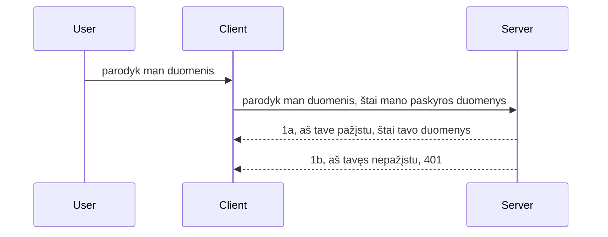

# Paprasta autentifikacija

MCP SDK palaiko OAuth 2.1 naudojimą, kuris, tiesą sakant, yra gana sudėtingas procesas, apimantis tokius konceptus kaip autentifikavimo serveris, išteklių serveris, kredencialų siuntimas, kodo gavimas, kodo apsikeitimas į nešėjo žetoną, kol galiausiai gaunate prieigą prie savo išteklių duomenų. Jei nesate pripratę prie OAuth, nors tai yra puikus dalykas įgyvendinti, geriausia pradėti nuo paprasto autentifikavimo lygio ir palaipsniui didinti saugumą. Todėl ši skyrius egzistuoja — kad išmokytume jus pažangesnės autentifikacijos.

## Autentifikacija, ką turime omenyje?

Autentifikacija yra vartojama kaip autentifikacijos ir autorizacijos trumpinys. Idėja yra tokia, kad turime atlikti du dalykus:

- **Autentifikacija**, tai procesas, kurio metu nusprendžiame, ar leisti asmeniui patekti į mūsų namus, ar jie turi teisę būti "čia", t.y., turėti prieigą prie mūsų išteklių serverio, kuriame veikia mūsų MCP serverio funkcijos.
- **Autorizacija**, tai procesas, kurio metu nustatome, ar vartotojas turėtų turėti prieigą prie tų konkrečių išteklių, kurių jis prašo, pavyzdžiui, prie užsakymų ar produktų, arba ar jam leidžiama tik skaityti turinį, bet ne trinti, kaip kitas pavyzdys.

## Kredencialai: kaip pasakome sistemai, kas mes esame

Dauguma interneto kūrėjų pradeda galvoti apie tai kaip apie kredencialų siuntimą serveriui, dažniausiai slaptą raktą, kuris sako, ar jie čia gali būti — "Autentifikacija". Šis kredencialas paprastai yra base64 koduota vartotojo vardo ir slaptažodžio versija arba API raktas, kuris unikalizuoja konkretų vartotoją.

Tai reiškia, kad jis siunčiamas per antraštę, vadinamą "Authorization", taip:

```json
{ "Authorization": "secret123" }
```

Tai paprastai vadinama paprasta autentifikacija. Bendras srautas veikia taip:


```mermaid
sequenceDiagram
   participant User
   participant Client
   participant Server

   User->>Client: parodyk man duomenis
   Client->>Server: parodyk man duomenis, štai mano paskyros duomenys
   Server-->>Client: 1a, aš tave pažįstu, štai tavo duomenys
   Server-->>Client: 1b, aš tavęs nepažįstu, 401 
```

Dabar, kai suprantame, kaip tai veikia srauto atžvilgiu, kaip tai įgyvendinti? Dauguma žiniatinklio serverių turi koncepciją, vadinamą middleware — tai kodo dalis, kuri veikia kaip užklausa ir gali patikrinti kredencialus, o jei jie galioja, leidžia užklausai praeiti. Jei užklausa neturi galiojančių kredencialų, gausite autentifikacijos klaidą. Pažiūrėkime, kaip tai galima įgyvendinti:

**Python**

```python
class AuthMiddleware(BaseHTTPMiddleware):
    async def dispatch(self, request, call_next):

        has_header = request.headers.get("Authorization")
        if not has_header:
            print("-> Missing Authorization header!")
            return Response(status_code=401, content="Unauthorized")

        if not valid_token(has_header):
            print("-> Invalid token!")
            return Response(status_code=403, content="Forbidden")

        print("Valid token, proceeding...")
       
        response = await call_next(request)
        # pridėti bet kokias kliento antraštes arba kažkaip pakeisti atsakymą
        return response


starlette_app.add_middleware(CustomHeaderMiddleware)
```

Čia turime:

- Sukurtą middleware pavadinimu `AuthMiddleware`, kurio `dispatch` metodas kviečiamas žiniatinklio serverio.
- Pridėtą middleware prie žiniatinklio serverio:

    ```python
    starlette_app.add_middleware(AuthMiddleware)
    ```

- Parašytą patikros logiką, kuri tikrina, ar yra Authorization antraštė, ir ar siunčiamas slaptasis raktas galioja:

    ```python
    has_header = request.headers.get("Authorization")
    if not has_header:
        print("-> Missing Authorization header!")
        return Response(status_code=401, content="Unauthorized")

    if not valid_token(has_header):
        print("-> Invalid token!")
        return Response(status_code=403, content="Forbidden")
    ```

    jei slaptažodis yra pateiktas ir galioja, tada leidžiame užklausai pereiti kviesdami `call_next` ir grąžiname atsakymą.

    ```python
    response = await call_next(request)
    # pridėti bet kokius klientų antraštes arba kitaip pakeisti atsakymą
    return response
    ```

Veikia tai taip: jei užklausa į serverį yra atlikta, middleware bus iškviestas ir atsižvelgdamas į savo įgyvendinimą arba leis užklausai patekti, arba grąžins klaidą, kuri rodo, kad klientas negali tęsti.

**TypeScript**

Čia sukuriame middleware naudojant populiarią Express sistemą ir aptinkame užklausą prieš jai pasiekiant MCP serverį. Štai kodas:

```typescript
function isValid(secret) {
    return secret === "secret123";
}

app.use((req, res, next) => {
    // 1. Ar yra autorizacijos antraštė?
    if(!req.headers["Authorization"]) {
        res.status(401).send('Unauthorized');
    }
    
    let token = req.headers["Authorization"];

    // 2. Patikrinkite galiojimą.
    if(!isValid(token)) {
        res.status(403).send('Forbidden');
    }

   
    console.log('Middleware executed');
    // 3. Perduoda užklausą kitam žingsniui užklausų apdorojimo grandinėje.
    next();
});
```

Šiame kode:

1. Patikriname, ar apskritai yra Authorization antraštė, jei ne, siunčiame 401 klaidą.
2. Užtikriname, kad kredencialas/žetonas galioja, jei ne, siunčiame 403 klaidą.
3. Galiausiai perduodame užklausą toliau užklausų vamzdyje ir grąžiname prašomą išteklių.

## Užduotis: Įgyvendinti autentifikaciją

Panaudosime mūsų žinias ir pabandysime tai įgyvendinti. Štai planas:

Serveris

- Sukurti žiniatinklio serverį ir MCP instanciją.
- Įgyvendinti middleware serveriui.

Klientas

- Siųsti užklausą su kredencialu per antraštę.

### -1- Sukurti žiniatinklio serverį ir MCP instanciją

> [!WARNING]
> Žemiau pateiktas TypeScript pavyzdys taikomas MCP `2025-11-25`. Jis sekasi transliacijas
> naudodamas `mcp-session-id` ir nėra dabartinis `2026-07-28` transliacijos pavyzdys. MCP
> `2026-07-28` pašalina `initialize` rankų paspaudimą ir protokolo sesijos ID; nauji
> įgyvendinimai naudoja savaiminius užklausimus. Žr.
> [Kas pasikeitė MCP: 2026-07-28 specifikacija](../../01-CoreConcepts/mcp-2026-07-28.md).

Pirmame žingsnyje turime sukurti žiniatinklio serverio instanciją ir MCP serverį.

**Python**

Čia sukuriame MCP serverio instanciją, sukuriame starlette žiniatinklio programą ir jį talpiname naudodami uvicorn.

```python
# kuriamas MCP serveris

app = FastMCP(
    name="MCP Resource Server",
    instructions="Resource Server that validates tokens via Authorization Server introspection",
    host=settings["host"],
    port=settings["port"],
    debug=True
)

# kuriama starlette tinklalapio programa
starlette_app = app.streamable_http_app()

# programos tiekimas per uvicorn
async def run(starlette_app):
    import uvicorn
    config = uvicorn.Config(
            starlette_app,
            host=app.settings.host,
            port=app.settings.port,
            log_level=app.settings.log_level.lower(),
        )
    server = uvicorn.Server(config)
    await server.serve()

run(starlette_app)
```

Šiame kode:

- Sukuriame MCP serverį.
- Konstrupuojame starlette žiniatinklio programą iš MCP serverio, `app.streamable_http_app()`.
- Talpiname ir paleidžiame žiniatinklio programą naudodami uvicorn `server.serve()`.

**TypeScript**

Čia sukuriame MCP serverio instanciją.

```typescript
const server = new McpServer({
      name: "example-server",
      version: "1.0.0"
    });

    // ... nustatykite serverio išteklius, įrankius ir užklausas ...
```

Šis MCP serverio kūrimas turi vykti mūsų POST /mcp maršruto apibrėžime, todėl paimkime aukščiau pateiktą kodą ir perkelkime taip:

```typescript
import express from "express";
import { randomUUID } from "node:crypto";
import { McpServer } from "@modelcontextprotocol/sdk/server/mcp.js";
import { StreamableHTTPServerTransport } from "@modelcontextprotocol/sdk/server/streamableHttp.js";
import { isInitializeRequest } from "@modelcontextprotocol/sdk/types.js"

const app = express();
app.use(express.json());

// Žemėlapis, skirtas saugoti transportus pagal sesijos ID
const transports: { [sessionId: string]: StreamableHTTPServerTransport } = {};

// Tvarkyti POST užklausas klientas-serveris komunikacijai
app.post('/mcp', async (req, res) => {
  // Tikrinti, ar sesijos ID jau egzistuoja
  const sessionId = req.headers['mcp-session-id'] as string | undefined;
  let transport: StreamableHTTPServerTransport;

  if (sessionId && transports[sessionId]) {
    // Pakartotinai naudoti esamą transportą
    transport = transports[sessionId];
  } else if (!sessionId && isInitializeRequest(req.body)) {
    // Naujas inicializavimo užklausimas
    transport = new StreamableHTTPServerTransport({
      sessionIdGenerator: () => randomUUID(),
      onsessioninitialized: (sessionId) => {
        // Saugyti transportą pagal sesijos ID
        transports[sessionId] = transport;
      },
      // DNS pakartotinio sujungimo apsauga pagal nutylėjimą išjungta dėl atgalinio suderinamumo. Jei paleidžiate šį serverį
      // vietoje, būtinai nustatykite:
      // enableDnsRebindingProtection: true,
      // allowedHosts: ['127.0.0.1'],
    });

    // Išvalyti transportą, kai jis uždaromas
    transport.onclose = () => {
      if (transport.sessionId) {
        delete transports[transport.sessionId];
      }
    };
    const server = new McpServer({
      name: "example-server",
      version: "1.0.0"
    });

    // ... parengti serverio išteklius, įrankius ir užklausas ...

    // Prisijungti prie MCP serverio
    await server.connect(transport);
  } else {
    // Neteisinga užklausa
    res.status(400).json({
      jsonrpc: '2.0',
      error: {
        code: -32000,
        message: 'Bad Request: No valid session ID provided',
      },
      id: null,
    });
    return;
  }

  // Tvarkyti užklausą
  await transport.handleRequest(req, res, req.body);
});

// Pakartotinai naudojamas tvarkytojas GET ir DELETE užklausoms
const handleSessionRequest = async (req: express.Request, res: express.Response) => {
  const sessionId = req.headers['mcp-session-id'] as string | undefined;
  if (!sessionId || !transports[sessionId]) {
    res.status(400).send('Invalid or missing session ID');
    return;
  }
  
  const transport = transports[sessionId];
  await transport.handleRequest(req, res);
};

// Tvarkyti GET užklausas serveris-klientas pranešimams per SSE
app.get('/mcp', handleSessionRequest);

// Tvarkyti DELETE užklausas sesijos nutraukimui
app.delete('/mcp', handleSessionRequest);

app.listen(3000);
```

Dabar matote, kaip MCP serverio kūrimas buvo perkeltas į `app.post("/mcp")`.

Pereikime prie kito žingsnio — middleware kūrimo, kad galėtume patikrinti gaunamus kredencialus.

### -2- Įgyvendinti middleware serveriui

Dabar pereiname prie middleware dalies. Čia sukursime middleware, kuris ieškos kredencialo `Authorization` antraštėje ir jį patikrins. Jei jis priimtinas, užklausa bus perduota toliau ir atliks tai, ką reikia (pvz., įrankių sąrašą, išteklių skaitymą ar kitą MCP funkcionalumą, kurio klientas prašė).

**Python**

Norėdami sukurti middleware, turime sukurti klasę, paveldinčią iš `BaseHTTPMiddleware`. Yra du svarbūs dalykai:

- Užklausa `request`, iš kurios skaitome antraštės informaciją.
- `call_next` — atgalinio kvietimo funkcija, kurią turi kvieti, jei klientas atneša mums priimamą kredencialą.

Pirmiausia turime apdoroti atvejį, kai `Authorization` antraštė trūksta:

```python
has_header = request.headers.get("Authorization")

# antraštė nerasta, nepavyko su 401, kitaip tęsti.
if not has_header:
    print("-> Missing Authorization header!")
    return Response(status_code=401, content="Unauthorized")
```

Čia siunčiame 401 nesankcionuoto pranešimą, nes klientas nepavyko autentifikacijos.

Tada, jei kredencialas buvo pateiktas, turime patikrinti jo galiojimą taip:

```python
 if not valid_token(has_header):
    print("-> Invalid token!")
    return Response(status_code=403, content="Forbidden")
```

Atkreipkite dėmesį, kaip aukščiau siunčiame 403 uždraustą pranešimą. Pažiūrėkime pilną middleware, įgyvendinantį viską, ką minėjome:

```python
class AuthMiddleware(BaseHTTPMiddleware):
    async def dispatch(self, request, call_next):

        has_header = request.headers.get("Authorization")
        if not has_header:
            print("-> Missing Authorization header!")
            return Response(status_code=401, content="Unauthorized")

        if not valid_token(has_header):
            print("-> Invalid token!")
            return Response(status_code=403, content="Forbidden")

        print("Valid token, proceeding...")
        print(f"-> Received {request.method} {request.url}")
        response = await call_next(request)
        response.headers['Custom'] = 'Example'
        return response

```

Puiku, o kaip dėl `valid_token` funkcijos? Štai ji žemiau:

```python
# NE NAUDOKITE produkcijai - patobulinkite tai !!
def valid_token(token: str) -> bool:
    # pašalinkite "Bearer " prefiksą
    if token.startswith("Bearer "):
        token = token[7:]
        return token == "secret-token"
    return False
```

Tai, žinoma, turėtų būti patobulinta.

SVARBU: Niekada neturėtumėte turėti tokių paslapčių kode. Geriausia reikšmę, su kuria lyginate, paimti iš duomenų šaltinio arba iš IDP (tapatybės paslaugų teikėjo) arba dar geriau – leisti IDP atlikti validaciją.

**TypeScript**

Norėdami įgyvendinti tai su Express, turime iškviesti `use` metodą, kuris priima middleware funkcijas.

Turime:

- Sąveikauti su užklausos kintamuoju ir patikrinti perduotą kredencialą `Authorization` savybėje.
- Patikrinti kredencialą ir, jei jis galioja, leisti užklausai tęstis ir atlikti klientui skirtą MCP užklausą (pvz., įrankių sąrašą, išteklių skaitymą ar kitą su MCP susijusį veiksmą).

Čia tikriname, ar yra `Authorization` antraštė, o jei jos nėra, sustabdome užklausą:

```typescript
if(!req.headers["authorization"]) {
    res.status(401).send('Unauthorized');
    return;
}
```

Jei antraštė išvis nėra siunčiama, gaunate 401.

Tada tikriname, ar kredencialas galioja; jei ne, ir vėl sustabdome užklausą, bet su kiek kita žinute:

```typescript
if(!isValid(token)) {
    res.status(403).send('Forbidden');
    return;
} 
```

Atkreipkite dėmesį, kaip dabar gaunate 403 klaidą.

Štai visas kodas:

```typescript
app.use((req, res, next) => {
    console.log('Request received:', req.method, req.url, req.headers);
    console.log('Headers:', req.headers["authorization"]);
    if(!req.headers["authorization"]) {
        res.status(401).send('Unauthorized');
        return;
    }
    
    let token = req.headers["authorization"];

    if(!isValid(token)) {
        res.status(403).send('Forbidden');
        return;
    }  

    console.log('Middleware executed');
    next();
});
```

Nustatėme žiniatinklio serverį priimti middleware, kuris tikrina, ar klientas siunčia kredencialą. O kaip dėl paties kliento?

### -3- Siųsti užklausą su kredencialu per antraštę

Turime užtikrinti, kad klientas perduotų kredencialą per antraštę. Kadangi naudosime MCP klientą, turime išsiaiškinti, kaip tai padaryti.

**Python**

Klientui turime perduoti antraštę su savo kredencialu taip:

```python
# NESIKODUOKITE vertės tiesiogiai, bent jau laikykite ją aplinkos kintamajame arba saugesnėje vietoje
token = "secret-token"

async with streamablehttp_client(
        url = f"http://localhost:{port}/mcp",
        headers = {"Authorization": f"Bearer {token}"}
    ) as (
        read_stream,
        write_stream,
        session_callback,
    ):
        async with ClientSession(
            read_stream,
            write_stream
        ) as session:
            await session.initialize()
      
            # DAROMA, ką norite, kad klientas atliktų, pvz., įrankių sąrašą, įrankių kvietimą ir pan.
```

Atkreipkite dėmesį, kaip pildome `headers` savybę taip: ` headers = {"Authorization": f"Bearer {token}"}`.

**TypeScript**

Tai galime išspręsti dviem žingsniais:

1. Užpildyti konfigūracijos objektą savo kredencialu.
2. Perduoti konfigūracijos objektą transportui.

```typescript

// NESIKODUOKITE reikšmės tiesiogiai, kaip čia parodyta. Bent jau laikykite ją kaip aplinkos kintamąjį ir naudokite kažką panašaus į dotenv (plikrų režimu).
let token = "secret123"

// apibrėžti kliento transporto parinkčių objektą
let options: StreamableHTTPClientTransportOptions = {
  sessionId: sessionId,
  requestInit: {
    headers: {
      "Authorization": "secret123"
    }
  }
};

// perduoti parinkčių objektą transportui
async function main() {
   const transport = new StreamableHTTPClientTransport(
      new URL(serverUrl),
      options
   );
```

Čia matote, kaip turėjome sukurti `options` objektą ir savo antraštes įdėti į `requestInit` savybę.

SVARBU: Kaip tai patobulinti? Dabartinis įgyvendinimas turi trūkumų. Pirma, tokį kredencialą siųsti yra gana rizikinga, nebent bent jau turite HTTPS. Net ir tada kredencialas gali būti pavogtas, todėl jums reikalinga sistema, kurioje galite lengvai anuliuoti žetoną ir pridėti papildomų patikrinimų, pavyzdžiui, iš kurios pasaulio vietos jis ateina, ar užklausa bus atliekama per dažnai (robotų elgesys) — trumpai tariant, yra daugybė rūpesčių.

Vis dėlto, labai paprastoms API, kur nenorite, kad kas nors galėtų kviesti jūsų API be autentifikacijos, tai yra gera pradžia.

Taigi, pabandykime šiek tiek sustiprinti saugumą naudodami standartizuotą formatą, pavyzdžiui, JSON Web Token, dar vadinamą JWT arba "JOT" žetonus.

## JSON Web Tokens, JWT

Taigi, stengiamės pagerinti situaciją nuo paprastų kredencialų. Kokie tiesioginiai privalumai, jei priimsime JWT?

- **Saugumo patobulinimai**. Paprastoje autentifikacijoje jūs siunčiate vartotojo vardą ir slaptažodį kaip base64 koduotą žetoną (arba siunčiate API raktą) vėl ir vėl, kas didina riziką. Naudojant JWT, siunčiate savo vartotojo vardą ir slaptažodį ir gaunate žetoną, kuris taip pat laiko apribotas — jis galioja tik tam tikrą laiką. JWT leidžia lengvai naudoti smulkesnę prieigos kontrolę naudojant vaidmenis, sritis ir leidimus.
- **Be valstybės (statelessness) ir mastelio keitimo**. JWT yra savaiminiai, nes jie talpina visą vartotojo informaciją ir nereikalauja saugoti sesijų serverio pusėje. Žetonas taip pat gali būti patikrintas vietoje.
- **Sąveikumas ir federacija**. JWT yra Open ID Connect pagrindas ir naudojamas su žinomais tapatybės teikėjais kaip Entra ID, Google Identity ir Auth0. Jie taip pat leidžia naudoti vieną prisijungimą ir daug kitų funkcijų, darant juos verslo klasės sprendimu.
- **Moduliškumas ir lankstumas**. JWT taip pat galima naudoti su API vartais, kaip Azure API Management, NGINX ir kt. Jie palaiko autentifikacijos scenarijus bei serverio-serverio komunikaciją, įskaitant įgaliotinę ir delegavimo scenarijus.
- **Veikimas ir talpykla**. JWT galima kešuoti po iššifravimo, kas sumažina analizės poreikį. Tai naudinga ypač didelio srauto programoms, nes pagerina pralaidumą ir sumažina apkrovą jūsų infrastruktūrai.
- **Pažangios funkcijos**. Taip pat palaiko introspekciją (galiojimo patikrinimą serveryje) ir atšaukimą (padarant žetoną nebegaliojančiu).

Su visais šiais privalumais pažiūrėkime, kaip galime pakelti savo įgyvendinimą į kitą lygį.

## Paverčiame paprastą autentifikaciją į JWT

Taigi, aukšto lygio pakeitimai, kuriuos turime padaryti:

- **Išmokti kurti JWT žetoną** ir paruošti jį siuntimui iš kliento į serverį.
- **Patikrinti JWT žetoną**, o jei galioja, leisti klientui pasiekti mūsų išteklius.
- **Saugiai saugoti žetoną**. Kaip mes jį saugosime.
- **Apsaugoti maršrutus**. Reikia apsaugoti maršrutus, mūsų atveju, apsaugoti MCP funkcionalumus.
- **Pridėti atnaujinimo žetonus**. Užtikrinti, kad kuriami trumpalaikiai žetonai, tačiau atnaujinimo žetonai būtų ilgalaikiai ir galėtų būti naudojami gauti naujus žetonus pasibaigus galiojimui. Taip pat įrengti atnaujinimo endpoint'ą ir rotacijos strategiją.

### -1- Sukurti JWT žetoną

Iš pradžių JWT žetonas turi šias dalis:

- **antraštę (header)**, naudojamą algoritmą ir žetono tipą.
- **naudą (payload)**, teiginius, kaip sub (vartotojas arba subjektas, kurį žetonas atstovauja; autentifikacijos scenarijuje tai paprastai naudotojo ID), exp (kai jis pasibaigia), role (vaidmuo).
- **parašą (signature)**, pasirašytą su slaptuoju arba privačiu raktu.

Tam mums reikės sukurti antraštę, naudą ir koduotą žetoną.

**Python**

```python

import jwt
import jwt
from jwt.exceptions import ExpiredSignatureError, InvalidTokenError
import datetime

# Slaptasis raktas, naudojamas pasirašyti JWT
secret_key = 'your-secret-key'

header = {
    "alg": "HS256",
    "typ": "JWT"
}

# vartotojo informacija, jos teiginiai ir galiojimo laikas
payload = {
    "sub": "1234567890",               # Tema (vartotojo ID)
    "name": "User Userson",                # Pasirinktinis teiginys
    "admin": True,                     # Pasirinktinis teiginys
    "iat": datetime.datetime.utcnow(),# Išleista
    "exp": datetime.datetime.utcnow() + datetime.timedelta(hours=1)  # Galiojimo laikas
}

# užkoduokite tai
encoded_jwt = jwt.encode(payload, secret_key, algorithm="HS256", headers=header)
```

Aukščiau mes:

- Apibrėžėme antraštę naudodami HS256 algoritmą ir tipą JWT.
- Sukūrėme naudą, kurioje yra subject arba naudotojo ID, vartotojo vardas, vaidmuo, kada išduota ir kada numatytas galiojimo laikas, taip įgyvendinant ankstesnėje dalyje minėtą laiko ribotumo aspektą.

**TypeScript**

Čia mums prireiks kai kurių paketų, kurie padės sukurti JWT žetoną.

Priklausomybės

```sh

npm install jsonwebtoken
npm install --save-dev @types/jsonwebtoken
```

Dabar kai tai įgyvendinome, sukurkime antraštę, naudą ir per tai sukursime užkoduotą žetoną.

```typescript
import jwt from 'jsonwebtoken';

const secretKey = 'your-secret-key'; // Naudokite aplinkos kintamuosius gamyboje

// Apibrėžkite naudingo krovinio duomenis
const payload = {
  sub: '1234567890',
  name: 'User usersson',
  admin: true,
  iat: Math.floor(Date.now() / 1000), // Išduota
  exp: Math.floor(Date.now() / 1000) + 60 * 60 // Galioja 1 valandą
};

// Apibrėžkite antraštę (pasirinktinai, jsonwebtoken nustato numatytuosius)
const header = {
  alg: 'HS256',
  typ: 'JWT'
};

// Sukurkite žetoną
const token = jwt.sign(payload, secretKey, {
  algorithm: 'HS256',
  header: header
});

console.log('JWT:', token);
```

Šis žetonas yra:

Pasirašytas naudojant HS256
Galioja 1 valandą
Apima teiginius kaip sub, name, admin, iat ir exp.

### -2- Patikrinti žetoną

Taip pat turime patikrinti žetoną, tai turėtume daryti serveryje, kad užtikrintume, jog tai, ką klientas siunčia, iš tiesų yra galiojanti. Yra daug patikrinimų, kuriuos turėtume atlikti, nuo struktūros iki galiojimo. Taip pat patartina pridėti papildomų patikrinimų, ar vartotojas yra mūsų sistemoje ir pan.

Norėdami patikrinti žetoną, jį turime iššifruoti, kad galėtume perskaityti ir tada pradėti tikrinti galiojimą:

**Python**

```python

# Iššifruoti ir patikrinti JWT
try:
    decoded = jwt.decode(token, secret_key, algorithms=["HS256"])
    print("✅ Token is valid.")
    print("Decoded claims:")
    for key, value in decoded.items():
        print(f"  {key}: {value}")
except ExpiredSignatureError:
    print("❌ Token has expired.")
except InvalidTokenError as e:
    print(f"❌ Invalid token: {e}")

```


Šiame kode mes kviečiame `jwt.decode` naudodami tokeną, slaptą raktą ir pasirinktą algoritmą kaip įvestį. Atkreipkite dėmesį, kaip naudojame try-catch konstrukciją, nes nepavykusi patikra sukelia klaidą.

**TypeScript**

Čia turime kviesti `jwt.verify`, kad gautume iššifruotą tokeno versiją, kurią galime toliau analizuoti. Jei šis kvietimas nepavyksta, tai reiškia, kad tokeno struktūra yra neteisinga arba jis nebegalioja.

```typescript

try {
  const decoded = jwt.verify(token, secretKey);
  console.log('Decoded Payload:', decoded);
} catch (err) {
  console.error('Token verification failed:', err);
}
```

PASTABA: kaip minėta anksčiau, turėtume atlikti papildomus patikrinimus, kad įsitikintume, jog šis tokenas nurodo vartotoją mūsų sistemoje ir kad vartotojas turi teises, kurias jis teigia turįs.

Toliau pažvelkime į vaidmenimis pagrįstą prieigos valdymą, dar vadinamą RBAC.

## Įtraukiame vaidmenimis pagrįstą prieigos valdymą

Idėja yra ta, kad norime išreikšti, jog skirtingi vaidmenys turi skirtingas teises. Pavyzdžiui, darome prielaidą, kad administratorius gali daryti viską, o įprastas vartotojas gali skaityti/rašyti, o svečias gali tik skaityti. Todėl yra keli galimi leidimų lygiai:

- Admin.Write 
- User.Read
- Guest.Read

Pažiūrėkime, kaip tokį valdymą galime įgyvendinti naudojant middleware. Middleware gali būti pridedami prie konkrečių maršrutų, taip pat ir visiems maršrutams.

**Python**

```python
from starlette.middleware.base import BaseHTTPMiddleware
from starlette.responses import JSONResponse
import jwt

# NEĮRAŠYKITE slaptumo tiesiogiai į kodą, tai skirta tik demonstraciniams tikslams. Skaitykite jį iš saugios vietos.
SECRET_KEY = "your-secret-key" # įdėkite tai į aplinkos kintamąjį
REQUIRED_PERMISSION = "User.Read"

class JWTPermissionMiddleware(BaseHTTPMiddleware):
    async def dispatch(self, request, call_next):
        auth_header = request.headers.get("Authorization")
        if not auth_header or not auth_header.startswith("Bearer "):
            return JSONResponse({"error": "Missing or invalid Authorization header"}, status_code=401)

        token = auth_header.split(" ")[1]
        try:
            decoded = jwt.decode(token, SECRET_KEY, algorithms=["HS256"])
        except jwt.ExpiredSignatureError:
            return JSONResponse({"error": "Token expired"}, status_code=401)
        except jwt.InvalidTokenError:
            return JSONResponse({"error": "Invalid token"}, status_code=401)

        permissions = decoded.get("permissions", [])
        if REQUIRED_PERMISSION not in permissions:
            return JSONResponse({"error": "Permission denied"}, status_code=403)

        request.state.user = decoded
        return await call_next(request)


```

Yra keletas skirtingų būdų, kaip pridėti middleware, kaip parodyta žemiau:

```python

# Alt 1: pridėti tarpinį programinį sluoksnį kuriant starlette programėlę
middleware = [
    Middleware(JWTPermissionMiddleware)
]

app = Starlette(routes=routes, middleware=middleware)

# Alt 2: pridėti tarpinį programinį sluoksnį, kai starlette programėlė jau sukurta
starlette_app.add_middleware(JWTPermissionMiddleware)

# Alt 3: pridėti tarpinį programinį sluoksnį pagal maršrutą
routes = [
    Route(
        "/mcp",
        endpoint=..., # tvarkytojas
        middleware=[Middleware(JWTPermissionMiddleware)]
    )
]
```

**TypeScript**

Galime naudoti `app.use` ir middleware, kuris bus paleidžiamas visiems užklausimams.

```typescript
app.use((req, res, next) => {
    console.log('Request received:', req.method, req.url, req.headers);
    console.log('Headers:', req.headers["authorization"]);

    // 1. Patikrinkite, ar buvo išsiųstas autorizacijos antraštė

    if(!req.headers["authorization"]) {
        res.status(401).send('Unauthorized');
        return;
    }
    
    let token = req.headers["authorization"];

    // 2. Patikrinkite, ar žetonas yra galiojantis
    if(!isValid(token)) {
        res.status(403).send('Forbidden');
        return;
    }  

    // 3. Patikrinkite, ar žetono vartotojas egzistuoja mūsų sistemoje
    if(!isExistingUser(token)) {
        res.status(403).send('Forbidden');
        console.log("User does not exist");
        return;
    }
    console.log("User exists");

    // 4. Patikrinkite, ar žetonas turi tinkamas teises
    if(!hasScopes(token, ["User.Read"])){
        res.status(403).send('Forbidden - insufficient scopes');
    }

    console.log("User has required scopes");

    console.log('Middleware executed');
    next();
});

```

Yra keletas dalykų, kuriuos turime leisti middleware ir kuriuos middleware TURĖTŲ daryti, būtent:

1. Patikrinti, ar yra autorizacijos antraštė
2. Patikrinti, ar tokenas galioja, kviečiame `isValid`, kurį parašėme, kad patikrintume JWT tokeno vientisumą ir galiojimą.
3. Patikrinti, ar vartotojas egzistuoja mūsų sistemoje, tai turėtume patikrinti.

   ```typescript
    // vartotojai duomenų bazėje
   const users = [
     "user1",
     "User usersson",
   ]

   function isExistingUser(token) {
     let decodedToken = verifyToken(token);

     // PADARYTI, patikrinti, ar vartotojas yra duomenų bazėje
     return users.includes(decodedToken?.name || "");
   }
   ```

   Aukščiau sukūrėme labai paprastą `users` sąrašą, kuris, aišku, turėtų būti duomenų bazėje.

4. Be to, turėtume patikrinti, ar tokenas turi reikiamas teises.

   ```typescript
   if(!hasScopes(token, ["User.Read"])){
        res.status(403).send('Forbidden - insufficient scopes');
   }
   ```

   Viršuje pateiktame middleware kode mes tikriname, ar tokenas turi User.Read teises, jei ne – siunčiame 403 klaidą. Žemiau pateiktas pagalbinis metodas `hasScopes`.

   ```typescript
   function hasScopes(scope: string, requiredScopes: string[]) {
     let decodedToken = verifyToken(scope);
    return requiredScopes.every(scope => decodedToken?.scopes.includes(scope));
  }
   ```

Have a think which additional checks you should be doing, but these are the absolute minimum of checks you should be doing.

Using Express as a web framework is a common choice. There are helpers library when you use JWT so you can write less code.

- `express-jwt`, helper library that provides a middleware that helps decode your token.
- `express-jwt-permissions`, this provides a middleware `guard` that helps check if a certain permission is on the token.

Here's what these libraries can look like when used:

```typescript
const express = require('express');
const jwt = require('express-jwt');
const guard = require('express-jwt-permissions')();

const app = express();
const secretKey = 'your-secret-key'; // put this in env variable

// Decode JWT and attach to req.user
app.use(jwt({ secret: secretKey, algorithms: ['HS256'] }));

// Check for User.Read permission
app.use(guard.check('User.Read'));

// multiple permissions
// app.use(guard.check(['User.Read', 'Admin.Access']));

app.get('/protected', (req, res) => {
  res.json({ message: `Welcome ${req.user.name}` });
});

// Error handler
app.use((err, req, res, next) => {
  if (err.code === 'permission_denied') {
    return res.status(403).send('Forbidden');
  }
  next(err);
});

```

Dabar, kai matėte, kaip middleware gali būti naudojamas tiek autentifikacijai, tiek autorizacijai, o kaip MCP? Ar tai keičia mūsų autentifikacijos tvarką? Sužinokime kitoje dalyje.

### -3- Pridėti RBAC prie MCP

Iki šiol matėte, kaip galite pridėti RBAC per middleware, tačiau MCP nėra paprasto būdo pridėti RBAC kiekvienai MCP funkcijai, ką darome? Tiesiog pridedame tokį kodą, kuris tikrina, ar klientas turi teises kviesti konkrečią įrankio funkciją:

Turite kelis skirtingus pasirinkimus, kaip įgyvendinti funkcijomis pagrįstą RBAC, štai keletas:

- Pridėti patikrą kiekvienam įrankiui, ištekliui, užklausai, kur reikia patikrinti leidimų lygį.

   **python**

   ```python
   @tool()
   def delete_product(id: int):
      try:
          check_permissions(role="Admin.Write", request)
      catch:
        pass # klientas nepavyko autorizuoti, mesti autorizacijos klaidą
   ```

   **typescript**

   ```typescript
   server.registerTool(
    "delete-product",
    {
      title: Delete a product",
      description: "Deletes a product",
      inputSchema: { id: z.number() }
    },
    async ({ id }) => {
      
      try {
        checkPermissions("Admin.Write", request);
        // padaryti, siųsti id į productService ir nuotolinį įrašą
      } catch(Exception e) {
        console.log("Authorization error, you're not allowed");  
      }

      return {
        content: [{ type: "text", text: `Deletected product with id ${id}` }]
      };
    }
   );
   ```


- Naudoti pažangią serverio prieigą ir užklausų tvarkytojus, kad sumažintumėte vietų, kur reikia atlikti patikrinimus, skaičių.

   **Python**

   ```python
   
   tool_permission = {
      "create_product": ["User.Write", "Admin.Write"],
      "delete_product": ["Admin.Write"]
   }

   def has_permission(user_permissions, required_permissions) -> bool:
      # vartotojo_teises: vartotojo turimų teisių sąrašas
      # reikalingos_teises: įrankiui reikalingų teisių sąrašas
      return any(perm in user_permissions for perm in required_permissions)

   @server.call_tool()
   async def handle_call_tool(
     name: str, arguments: dict[str, str] | None
   ) -> list[types.TextContent]:
    # Tarkime, request.user.permissions yra vartotojo teisių sąrašas
     user_permissions = request.user.permissions
     required_permissions = tool_permission.get(name, [])
     if not has_permission(user_permissions, required_permissions):
        # Mesti klaidą "Neturite leidimo naudoti įrankį {name}"
        raise Exception(f"You don't have permission to call tool {name}")
     # tęsti ir iškviesti įrankį
     # ...
   ```   
   

   **TypeScript**

   ```typescript
   function hasPermission(userPermissions: string[], requiredPermissions: string[]): boolean {
       if (!Array.isArray(userPermissions) || !Array.isArray(requiredPermissions)) return false;
       // Grąžina true, jei vartotojas turi bent vieną reikiamą leidimą
       
       return requiredPermissions.some(perm => userPermissions.includes(perm));
   }
  
   server.setRequestHandler(CallToolRequestSchema, async (request) => {
      const { params: { name } } = request;
  
      let permissions = request.user.permissions;
  
      if (!hasPermission(permissions, toolPermissions[name])) {
         return new Error(`You don't have permission to call ${name}`);
      }
  
      // tęskite..
   });
   ```

   Atkreipkite dėmesį, kad middleware turi priskirti iššifruotą tokeną request objekto user savybei, kad aukščiau pateiktas kodas būtų paprastas.

### Apibendrinimas

Dabar, kai aptarėme, kaip apskritai ir konkrečiai MCP įtraukti RBAC, pats metas pabandyti įgyvendinti saugumą savarankiškai, kad įsitikintumėte, jog supratote jums pristatytas koncepcijas.

## Užduotis 1: Sukurkite mcp serverį ir mcp klientą naudodami pagrindinę autentifikaciją

Čia naudosite tai, ką išmokote apie kredencialų siuntimą per antraštes.

## Sprendimas 1

[Sprendimas 1](./code/basic/README.md)

## Užduotis 2: Patobulinkite sprendimą iš užduoties 1 naudodami JWT

Paimkite pirmąjį sprendimą, bet šįkart jį pagerinkime.

Vietoje Basic Auth naudokime JWT.

## Sprendimas 2

[Sprendimas 2](./solution/jwt-solution/README.md)

## Iššūkis

Pridėkite RBAC prie kiekvieno įrankio, kaip aprašyta skyriuje "Pridėti RBAC prie MCP".

## Santrauka

Tikimės, kad šiame skyriuje sužinojote daug, pradedant nuo visiško saugumo nebuvimo, per pagrindinį saugumą, iki JWT ir kaip jį galima pridėti prie MCP.

Mes sukūrėme tvirtą pagrindą su individualiais JWT, tačiau plečiantis judame link standartiniu pagrindu paremtos tapatybės modelio. Priėmimas IdP, pvz., Entra ar Keycloak, leidžia mums perkrauti tokenų išdavimo, tikrinimo ir gyvenimo ciklo valdymą patikimai platformai — taip galime sutelkti dėmesį į programos logiką ir vartotojo patirtį.

Tam turime pažangesnį [Entra skyrių](../../05-AdvancedTopics/mcp-security-entra/README.md)

## Kas toliau

- Toliau: [MCP šeimininkų nustatymas](../12-mcp-hosts/README.md)

---

<!-- CO-OP TRANSLATOR DISCLAIMER START -->
**Atsakomybės apribojimas**:
Šis dokumentas buvo išverstas naudojant dirbtinio intelekto vertimo paslaugą [Co-op Translator](https://github.com/Azure/co-op-translator). Nors siekiame tikslumo, prašome atkreipti dėmesį, kad automatiniai vertimai gali turėti klaidų ar netikslumų. Originalus dokumentas jo gimtąja kalba laikomas autoritetingu šaltiniu. Svarbiai informacijai rekomenduojama naudoti profesionalų žmogiškąjį vertimą. Mes neatsakome už jokius nesusipratimus ar neteisingą interpretaciją, kilusią naudojantis šiuo vertimu.
<!-- CO-OP TRANSLATOR DISCLAIMER END -->