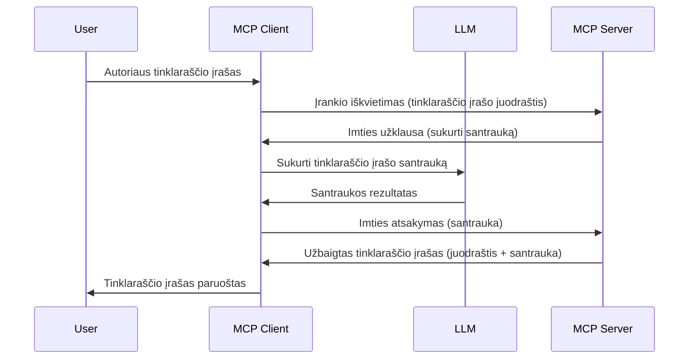

> [!WARNING]
> Mėginimas yra nepraktikuojamas MCP `2026-07-28`. Ši pamoka laikoma
> paveldėtomis įgyvendinimo versijomis. Nauji serveriai turėtų integruotis tiesiogiai su LLM
> teikėjo API.

# Mėginimas - funkcijų delegavimas klientui

> Mėginimas lieka `2026-07-28` specifikacijoje suderinamumui ir gali būti
> pašalintas pirmame pakeitime, išleistame nuo 2027 m. liepos 28 d. ar vėliau.
> Šios pamokos pavyzdžiai gali naudoti SDK API, kurie įgyvendina `2025-11-25`.
> Žr. [Kas pasikeitė MCP: 2026-07-28 specifikacija](../../01-CoreConcepts/mcp-2026-07-28.md).

Paveldėtuose įgyvendinimuose mėginimas leidžia MCP serveriui paprašyti pagalbos iš LLM,
kurį valdo klientas. Naujuose įgyvendinimuose kvieskite pasirinktą LLM teikėją
tiesiogiai.

Pažiūrėkime į kai kuriuos naudojimo atvejus ir kaip sukurti sprendimą, apimantį mėginimą.

## Apžvalga

Šioje pamokoje sutelksime dėmesį į tai, kada ir kur naudoti mėginimą ir kaip jį sukonfigūruoti.

## Mokymosi tikslai

Šiame skyriuje mes:

- Paaiškinsime, kas yra mėginimas ir kada jį naudoti.
- Parodysime, kaip sukonfigūruoti mėginimą MCP.
- Pateiksime pavyzdžius, kaip veikia mėginimas.

## Kas yra mėginimas ir kodėl jį naudoti?

Mėginimas yra pažangi funkcija, veikianti taip:



### Mėginimo užklausa

Gerai, dabar turime aukšto lygio patikimą scenarijų, aptarkime mėginimo užklausą, kurią serveris siunčia atgal klientui. Štai kaip tokia užklausa gali atrodyti JSON-RPC formatu:

```json
{
  "jsonrpc": "2.0",
  "id": 1,
  "method": "sampling/createMessage",
  "params": {
    "messages": [
      {
        "role": "user",
        "content": {
          "type": "text",
          "text": "Create a blog post summary of the following blog post: <BLOG POST>"
        }
      }
    ],
    "modelPreferences": {
      "hints": [
        {
          "name": "claude-3-sonnet"
        }
      ],
      "intelligencePriority": 0.8,
      "speedPriority": 0.5
    },
    "systemPrompt": "You are a helpful assistant.",
    "maxTokens": 100
  }
}
```

Yra keletas dalykų, kuriuos verta paminėti:

- Prompt, po content -> text, yra mūsų paragrafas, tai instrukcija LLM apibendrinti tinklaraščio įrašą.

- **modelPreferences**. Ši skiltis yra tiesiog pageidavimas, rekomendacija, kokią konfigūraciją naudoti su LLM. Vartotojas gali pasirinkti sekti šias rekomendacijas arba jas keisti. Šiuo atveju yra rekomendacijos apie modelį naudoti, greitį ir intelekto prioritetą.
- **systemPrompt**, tai įprastas sistemos paragrafas, suteikiantis LLM asmenybę ir turintis gaires.
- **maxTokens**, tai dar viena savybė, kuri nurodo, kiek žetonų rekomenduojama naudoti šiai užduočiai.

### Mėginimo atsakymas

Šis atsakymas yra tai, ką MCP klientas galiausiai siunčia atgal MCP serveriui ir yra kliento kvietimo LLM rezultatas, laukimo atsakymo ir šio pranešimo konstravimo rezultatas. Štai kaip tai gali atrodyti JSON-RPC:

```json
{
  "jsonrpc": "2.0",
  "id": 1,
  "result": {
    "role": "assistant",
    "content": {
      "type": "text",
      "text": "Here's your abstract <ABSTRACT>"
    },
    "model": "gpt-5",
    "stopReason": "endTurn"
  }
}
```

Pažymėkite, kad atsakymas yra tinklaraščio įrašo santrauka, kaip ir prašėme. Taip pat pastebėkite, kad naudotas `model` nėra tas, kurio prašėme, o "gpt-5" vietoje "claude-3-sonnet". Tai iliustruoja, kad vartotojas gali pakeisti nuomonę dėl naudojamo modelio ir kad jūsų mėginimo užklausa yra rekomendacija.

Gerai, dabar, kai suprantame pagrindinį srautą ir naudingą užduotį, pvz., „tinklaraščio įrašo kūrimas + santrauka“, pažiūrėkime, ką reikia padaryti, kad tai veiktų.

### Žinučių tipai

Mėginimo žinutės nėra apribotos tik tekstu, bet taip pat galite siųsti vaizdus ir garsą. Štai kaip JSON-RPC atrodo kitaip:

**Tekstas**

```json
{
  "type": "text",
  "text": "The message content"
}
```

**Vaizdo turinys**

```json
{
  "type": "image",
  "data": "base64-encoded-image-data",
  "mimeType": "image/jpeg"
}
```

**Garso turinys**

```json
{
  "type": "audio",
  "data": "base64-encoded-audio-data",
  "mimeType": "audio/wav"
}
```

> PASTABA: Dėl dabartinės būsenos ir migracijos gairių žr.
> [nebeveikiančią mėginimo dokumentaciją](https://modelcontextprotocol.io/specification/2026-07-28/client/sampling).

## Kaip sukonfigūruoti mėginimą klientui

> Pastaba: jei statote tik serverį, daug nereikia daryti čia.

Klientui reikia nurodyti šią funkciją taip:

```json
{
  "capabilities": {
    "sampling": {}
  }
}
```

Tai bus įtrauktas, kai pasirinktas klientas inicijuosis su serveriu.

## Mėginimo veiksmo pavyzdys - tinklaraščio įrašo kūrimas

Koduokime mėginimo serverį kartu, reikės atlikti šiuos veiksmus:

1. Sukurti įrankį serveryje.
1. Šis įrankis turėtų sukurti mėginimo užklausą.
1. Įrankis turėtų laukti, kol klientas atsakys į mėginimo užklausą.
1. Tada sukurkite įrankio rezultatą.

Pažiūrėkime kodą žingsnis po žingsnio:

### -1- Sukurkite įrankį

**python**

```python
@mcp.tool()
async def create_blog(title: str, content: str, ctx: Context[ServerSession, None]) -> str:
    """Create a blog post and generate a summary"""

```

### -2- Sukurkite mėginimo užklausą

Išplėskite savo įrankį šiuo kodu:

**python**

```python
post = BlogPost(
        id=len(posts) + 1,
        title=title,
        content=content,
        abstract=""
    )

prompt = f"Create an abstract of the following blog post: title: {title} and draft: {content} "

result = await ctx.session.create_message(
        messages=[
            SamplingMessage(
                role="user",
                content=TextContent(type="text", text=prompt),
            )
        ],
        max_tokens=100,
)

```

### -3- Palaukite atsakymo ir grąžinkite jį

**python**

```python
post.abstract = result.content.text

posts.append(post)

# grąžinkite pilną produktą
return json.dumps({
    "id": post.title,
    "abstract": post.abstract
})
```

### -4- Pilnas kodas

**python**

```python
from starlette.applications import Starlette
from starlette.routing import Mount, Host

from mcp.server.fastmcp import Context, FastMCP

from mcp.server.session import ServerSession
from mcp.types import SamplingMessage, TextContent

import json


from uuid import uuid4
from typing import List
from pydantic import BaseModel


mcp = FastMCP("Blog post generator")

# app = FastAPI()

posts = []

class BlogPost(BaseModel):
    id: int
    title: str
    content: str
    abstract: str

posts: List[BlogPost] = []

@mcp.tool()
async def create_blog(title: str, content: str, ctx: Context[ServerSession, None]) -> str:
    """Create a blog post and generate a summary"""

    post = BlogPost(
        id=len(posts) + 1,
        title=title,
        content=content,
        abstract=""
    )

    prompt = f"Create an abstract of the following blog post: title: {title} and draft: {content} "

    result = await ctx.session.create_message(
        messages=[
            SamplingMessage(
                role="user",
                content=TextContent(type="text", text=prompt),
            )
        ],
        max_tokens=100,
    )

    post.abstract = result.content.text

    posts.append(post)

    # grąžina visą tinklaraščio įrašą
    return json.dumps({
        "id": post.title,
        "abstract": post.abstract
    })

if __name__ == "__main__":
    print("Starting server...")
    # mcp.run()
    mcp.run(transport="streamable-http")

# paleiskite programą su: python server.py
```

### -5- Testavimas Visual Studio Code aplinkoje

Norėdami tai išbandyti Visual Studio Code, atlikite šiuos veiksmus:

1. Paleiskite serverį terminale
1. Įtraukite jį į *mcp.json* (ir įsitikinkite, kad jis paleistas), pvz., taip:

   ```json
   "servers": {
      "blog-server": {
        "type": "http",
        "url": "http://localhost:8000/mcp"
      }
   }
   ```

1. Įveskite paragrafą:

   ```text
   create a blog post named "Where Python comes from", the content is "Python is actually named after Monty Python Flying Circus"
   ```

1. Leiskite vykti mėginimui. Pirmą kartą testuodami būsite pateikti papildomu dialogu, kurį turėsite priimti, tada pamatysite įprastą dialogą, prašantį paleisti įrankį

1. Peržiūrėkite rezultatus. Matysite rezultatus gražiai pateiktus GitHub Copilot Chat, bet taip pat galite patikrinti neapdorotą JSON atsakymą.

**Bonus**. Visual Studio Code įrankiai puikiai palaiko mėginimą. Galite sukonfigūruoti Mėginimo prieigą savo įdiegtame serveryje taip:

1. Eikite į plėtinių skyrių.
1. Pasirinkite varnelę savo įdiegto serverio dalyje "MCP SERVERS - INSTALLED".
1 Pasirinkite "Configure Model Access", čia galite pasirinkti, kokius modelius GitHub Copilot gali naudoti vykdydamas mėginimą. Taip pat galite matyti visus neseniai įvykusius mėginimo užklausimus pasirinkdami "Show Sampling requests".

## Užduotis

Šioje užduotyje kursite šiek tiek kitokį Mėginimą, būtent mėginimo integraciją, palaikančią produkto aprašymo generavimą. Štai jūsų scenarijus:

**Scenarijus**: el. prekybos įmonės administracijos darbuotojui reikia pagalbos, nes produkto aprašymų kūrimas užima per daug laiko. Todėl turite sukurti sprendimą, kuriame galite iškviesti įrankį "create_product" su argumentais "title" ir "keywords", ir jis turėtų sukurti pilną produktą, įskaitant "description" lauką, kuris turi būti užpildytas kliento LLM.

Patarimas: naudokite anksčiau išmoktą medžiagą, kad sukurtumėte šį serverį ir jo įrankį naudodami mėginimo užklausą.

## Sprendimas

[Sprendimas](./solution/README.md)

## Pagrindinės išvados


Atranka yra galinga funkcija, leidžianti serveriui perduoti užduotis klientui, kai jam reikia LLM pagalbos.

## Kas toliau

- [4 skyrius – praktinė įgyvendinimas](../../04-PracticalImplementation/README.md)

---

<!-- CO-OP TRANSLATOR DISCLAIMER START -->
**Atsakomybės apribojimas**:
Šis dokumentas buvo išverstas naudojant dirbtinio intelekto vertimo paslaugą [Co-op Translator](https://github.com/Azure/co-op-translator). Nors siekiame tikslumo, prašome atkreipti dėmesį, kad automatiniai vertimai gali turėti klaidų ar netikslumų. Originalus dokumentas jo gimtąja kalba laikomas autoritetingu šaltiniu. Svarbiai informacijai rekomenduojama naudoti profesionalų žmogiškąjį vertimą. Mes neatsakome už jokius nesusipratimus ar neteisingą interpretaciją, kilusią naudojantis šiuo vertimu.
<!-- CO-OP TRANSLATOR DISCLAIMER END -->