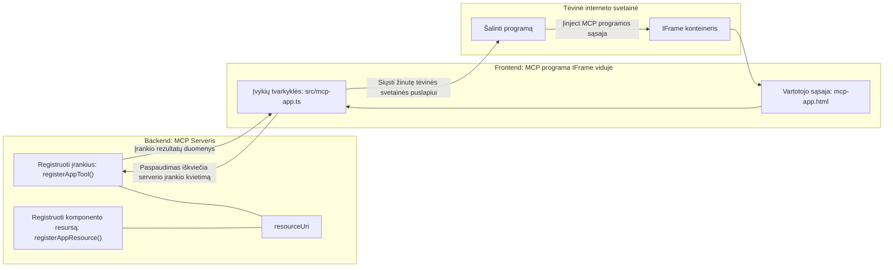
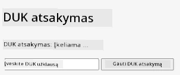
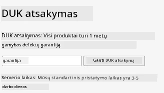
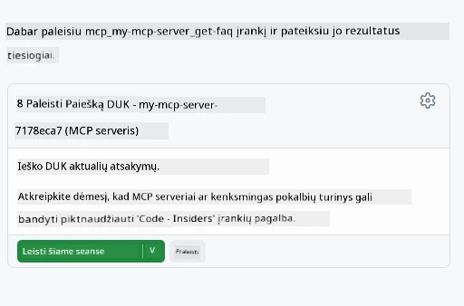
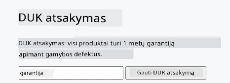

# MCP Programėlės

MCP Programėlės yra naujas MCP paradigma. Idėja ta, kad ne tik jūs atsakote su duomenimis iš įrankio kvietimo, bet ir pateikiate informaciją, kaip su šia informacija turėtų būti sąveikaujama. Tai reiškia, kad įrankių rezultatai dabar gali turėti Vartotojo Sąsajos (UI) informaciją. Kodėl to norėtume? Na, pagalvokite, kaip jūs šiandien tai darote. Tikėtina, kad jūs naudojate MCP serverio rezultatus, padėdami prieš jį kažkokį tipo frontend’ą, tai kodas, kurį reikia rašyti ir prižiūrėti. Kartais tai būtent tai, ko norite, bet kartais būtų puiku, jei galėtumėte tiesiog įtraukti savarankišką informacijos skiltį, kuri turi viską — nuo duomenų iki vartotojo sąsajos.

## Apžvalga

Ši pamoka suteikia praktines gaires apie MCP Programėles, kaip pradėti su jomis dirbti ir kaip jas integruoti į jau turimas internetines programas (Web Apps). MCP Programėlės yra labai naujas MCP Standarto papildymas.

## Mokymosi tikslai

Pamokos pabaigoje jūs gebėsite:

- Paaiškinti, kas yra MCP Programėlės.
- Kada naudoti MCP Programėles.
- Kurti ir integruoti savo MCP Programėles.

## MCP Programėlės – kaip tai veikia

Idėja su MCP Programėlėmis yra pateikti atsakymą, kuris iš esmės yra komponentas, skirtas atvaizduoti. Toks komponentas gali turėti tiek vizualinius elementus, tiek interaktyvumą, pvz., mygtukų paspaudimus, vartotojo įvestį ir dar daugiau. Pradėkime nuo serverio pusės ir mūsų MCP Serverio. Norint sukurti MCP Programėlės komponentą, reikia sukurti įrankį, bet taip pat ir programėlės resursą. Šios dvi dalys yra susietos per resourceUri.

Štai pavyzdys. Pabandykime vizualizuoti, kas įtraukiama ir kas ką atlieka:

```text
server.ts -- responsible for registering tools and the component as a UI component
src/
  mcp-app.ts -- wiring up event handlers
mcp-app.html -- the user interface
```
  
Šis vizualas aprašo architektūrą komponentei kurti ir jos logiką.


Pabandykime aprašyti atsakomybes backend ir frontend pusėse atitinkamai.

### Backend

Čia reikia įvykdyti du dalykus:

- Užregistruoti įrankius, su kuriais norime sąveikauti.
- Apibrėžti komponentą.

**Įrankio registravimas**

```typescript
registerAppTool(
    server,
    "get-time",
    {
      title: "Get Time",
      description: "Returns the current server time.",
      inputSchema: {},
      _meta: { ui: { resourceUri } }, // Susieja šį įrankį su jo vartotojo sąsajos ištekliais
    },
    async () => {
      const time = new Date().toISOString();
      return { content: [{ type: "text", text: time }] };
    },
  );

```
  
Aukščiau pateiktas kodas aprašo elgseną, kai jis atskleidžia įrankį pavadinimu `get-time`. Įrankis nepriima jokių įėjimų, bet sukuria dabartinį laiką. Mes galime apibrėžti `inputSchema` įrankiams, kuriems reikia priimti vartotojo įvestį.

**Komponento registravimas**

Tame pačiame faile taip pat reikia užregistruoti komponentą:

```typescript
const resourceUri = "ui://get-time/mcp-app.html";

// Užregistruokite išteklių, kuris grąžina sujungtą HTML/JavaScript vartotojo sąsajai.
registerAppResource(
  server,
  resourceUri,
  resourceUri,
  { mimeType: RESOURCE_MIME_TYPE },
  async () => {
    const html = await fs.readFile(path.join(DIST_DIR, "mcp-app.html"), "utf-8");

    return {
    contents: [
        { uri: resourceUri, mimeType: RESOURCE_MIME_TYPE, text: html },
    ],
    };
  },
);
```
  
Atkreipkite dėmesį, kaip minimas `resourceUri` sieja komponentą su jo įrankiais. Įdomus ir callback’as, kuriame užkraunamas UI failas ir komponentas grąžinamas.

### Komponento frontend'as

Kaip ir backend’e, čia yra du komponentai:

- Frontend’as, parašytas grynais HTML.
- Kodas, kuris valdo įvykius ir veiksmus, pvz., įrankių kvietimą ar žinučių siuntimą tėvinio langui.

**Vartotojo sąsaja**

Pažiūrėkime į vartotojo sąsają.

```html
<!-- mcp-app.html -->
<!DOCTYPE html>
<html lang="en">
  <head>
    <meta charset="UTF-8" />
    <title>Get Time App</title>
  </head>
  <body>
    <p>
      <strong>Server Time:</strong> <code id="server-time">Loading...</code>
    </p>
    <button id="get-time-btn">Get Server Time</button>
    <script type="module" src="/src/mcp-app.ts"></script>
  </body>
</html>
```
  
**Įvykių susiejimas**

Paskutinis elementas yra įvykių susiejimas. Tai reiškia, kad identifikuojame, kuri vieta mūsų UI reikia įvykių tvarkyklių ir ką daryti, jei įvykiai suveikia:

```typescript
// mcp-app.ts

import { App } from "@modelcontextprotocol/ext-apps";

// Gauti elementų nuorodas
const serverTimeEl = document.getElementById("server-time")!;
const getTimeBtn = document.getElementById("get-time-btn")!;

// Sukurti programos egzempliorių
const app = new App({ name: "Get Time App", version: "1.0.0" });

// Apdoroti įrankio rezultatus iš serverio. Nustatyti prieš `app.connect()`, kad būtų išvengta
// praleisto pradinio įrankio rezultato.
app.ontoolresult = (result) => {
  const time = result.content?.find((c) => c.type === "text")?.text;
  serverTimeEl.textContent = time ?? "[ERROR]";
};

// Prijungti mygtuko paspaudimą
getTimeBtn.addEventListener("click", async () => {
  // `app.callServerTool()` leidžia vartotojo sąsajai užklausti naujų duomenų iš serverio
  const result = await app.callServerTool({ name: "get-time", arguments: {} });
  const time = result.content?.find((c) => c.type === "text")?.text;
  serverTimeEl.textContent = time ?? "[ERROR]";
});

// Prisijungti prie serverio
app.connect();
```
  
Kaip matote viršuje, tai įprastas kodas, jungiantis DOM elementus su įvykiais. Vertėtų paminėti iškvietimą `callServerTool`, kuris iškviečia įrankį backend’e.

## Darbas su vartotojo įvestimi

Iki šiol matėme komponentą, kuris turi mygtuką, kuris paspaudus iškviečia įrankį. Pažiūrėkime, ar galime pridėti daugiau UI elementų, tokių kaip įvesties laukas, ir ar galime į rankas perduoti argumentus įrankiui. Įgyvendinkime DUK (FAQ) funkcionalumą. Štai kaip tai turėtų veikti:

- Turėtų būti mygtukas ir įvesties elementas, kuriame vartotojas įrašo raktinį žodį paieškai, pvz., „Shipping“ (Siuntimas). Tai turėtų iškviesti įrankį backend’e, kuris atlieka paiešką DUK duomenyse.
- Įrankis, palaikantis minėtą DUK paiešką.

Pirmiausia pridėkime būtinas palaikymo funkcijas backend’e:

```typescript
const faq: { [key: string]: string } = {
    "shipping": "Our standard shipping time is 3-5 business days.",
    "return policy": "You can return any item within 30 days of purchase.",
    "warranty": "All products come with a 1-year warranty covering manufacturing defects.",
  }

registerAppTool(
    server,
    "get-faq",
    {
      title: "Search FAQ",
      description: "Searches the FAQ for relevant answers.",
      inputSchema: zod.object({
        query: zod.string().default("shipping"),
      }),
      _meta: { ui: { resourceUri: faqResourceUri } }, // Susieja šį įrankį su jo vartotojo sąsajos resursu
    },
    async ({ query }) => {
      const answer: string = faq[query.toLowerCase()] || "Sorry, I don't have an answer for that.";
      return { content: [{ type: "text", text: answer }] };
    },
  );
```
  
Čia matome, kaip užpildome `inputSchema` ir suteikiame jam `zod` schemą taip:

```typescript
inputSchema: zod.object({
  query: zod.string().default("shipping"),
})
```
  
Aukščiau mes deklaruojame įvesties parametrą pavadinimu `query`, kuris yra neprivalomas ir turi numatytą reikšmę „shipping“.

Gerai, eikime prie *mcp-app.html*, kad pamatytume, kokią UI turime sukurti šiam atvejui:

```html
<div class="faq">
    <h1>FAQ response</h1>
    <p>FAQ Response: <code id="faq-response">Loading...</code></p>
    <input type="text" id="faq-query" placeholder="Enter FAQ query" />
    <button id="get-faq-btn">Get FAQ Response</button>
  </div>
```
  
Puiku, dabar turime įvesties elementą ir mygtuką. Dabar peržiūrėsime *mcp-app.ts* ir susiesime šiuos įvykius:

```typescript
const getFaqBtn = document.getElementById("get-faq-btn")!;
const faqQueryInput = document.getElementById("faq-query") as HTMLInputElement;

getFaqBtn.addEventListener("click", async () => {
  const query = faqQueryInput.value;
  const result = await app.callServerTool({ name: "get-faq", arguments: { query } });
  const faq = result.content?.find((c) => c.type === "text")?.text;
  faqResponseEl.textContent = faq ?? "[ERROR]";
});
```
  
Aukščiau pateiktame kode mes:

- Sukuriame nuorodas į svarbius UI elementus.
- Apdorojame mygtuko paspaudimą, išgauname įvesties elemento reikšmę ir kviečiame `app.callServerTool()` su `name` ir `arguments`, kur pastarasis perduoda `query` kaip reikšmę.

Iš tiesų, kai kviečiate `callServerTool`, yra išsiunčiama žinutė tėviniam langui, o tas langas iškviečia MCP Serverį.

### Išbandykite patys

Bandydami tai turėtume pamatyti tokį vaizdą:



ir štai čia, kai įvedame pvz., „warranty“ (garantija):



Norėdami paleisti šį kodą, eikite į [Kodo skyrių](./code/README.md)

## Testavimas Visual Studio Code

Visual Studio Code turi puikią paramą MVP Programėlėms ir tai tikriausiai vienas iš lengviausių būdų testuoti jūsų MCP Programėles. Norėdami naudoti Visual Studio Code, pridėkite serverio įrašą į *mcp.json* taip:

```json
"my-mcp-server-7178eca7": {
    "url": "http://localhost:3001/mcp",
    "type": "http"
  }
```
  
Tada paleiskite serverį, turėtumėte galėti bendrauti su savo MVP Programėle per Pokalbių Langą, jei turite įdiegę GitHub Copilot.

tai paleidžiant per komandinę eilutę, pvz., "#get-faq":



Ir kaip naršyklėje, ji atvaizduojama vienodai:



## Užduotis

Sukurkite akmens, popieriaus, žirklių žaidimą. Jame turėtų būti:

UI:

- išskleidžiamasis sąrašas su pasirinkimais
- mygtukas pasirinkimui pateikti
- žyma, rodanti, kas ką pasirinko ir kas laimėjo

Serveris:

- turėtų būti įrankis akmuo, popierius, žirklės, kuris priima "choice" kaip įvestį. Jis taip pat turėtų sugeneruoti kompiuterio pasirinkimą ir nustatyti laimėtoją

## Sprendimas

[Sprendimas](./assignment/README.md)

## Santrauka

Išmokome apie šį naują MCP Programėlių paradigmos modelį. Tai nauja paradigma, leidžianti MCP Serveriams turėti nuomonę ne tik apie duomenis, bet ir apie tai, kaip šie duomenys turi būti pateikiami.

Be to, sužinojome, kad šios MCP Programėlės talpinamos IFrame’o viduje ir bendrauti su MCP Serveriais jos privalo siųsti žinutes tėviniam interneto programos langui. Yra kelios bibliotekos tiek paprastam JavaScript, tiek React ir kitoms technologijoms, kurios palengvina šią komunikaciją.

## Pagrindinės išvados

Štai ką jūs išmokote:

- MCP Programėlės yra naujas standartas, kuriuo naudinga pasiųsti tiek duomenis, tiek vartotojo sąsajos funkcijas.
- Tokios programėlės dėl saugumo paleidžiamos IFrame viduje.

## Kas toliau

- [4 skyrius](../../04-PracticalImplementation/README.md)

---

<!-- CO-OP TRANSLATOR DISCLAIMER START -->
**Atsakomybės apribojimas**:  
Šis dokumentas buvo išverstas naudojant dirbtinio intelekto vertimo paslaugą [Co-op Translator](https://github.com/Azure/co-op-translator). Nors siekiame tikslumo, atkreipkite dėmesį, kad automatizuoti vertimai gali turėti klaidų ar netikslumų. Originalus dokumentas gimtąja kalba turėtų būti laikomas autoritetingu šaltiniu. Kritinei informacijai rekomenduojama profesionali žmogaus atliekama vertimo paslauga. Mes neatsakome už jokius nesusipratimus ar neteisingas interpretacijas, kylančias dėl šio vertimo naudojimo.
<!-- CO-OP TRANSLATOR DISCLAIMER END -->