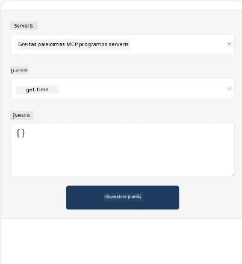
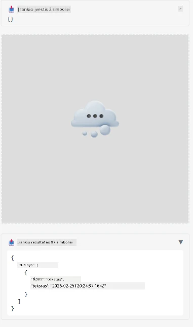

Štai pavyzdys, rodantis MCP programėlę

## Diegimas 

1. Eikite į *mcp-app* katalogą
1. Vykdykite `npm install`, turėtų būti įdiegtos frontend ir backend priklausomybės

Patikrinkite, ar backend kompiliuojasi, vykdydami:

```sh
npx tsc --noEmit
```

Jei viskas gerai, neturėtų būti jokio išvesties pranešimo.

## Paleisti backend

> Tai šiek tiek sudėtingiau, jei naudojate Windows kompiuterį, nes MCP programėlės sprendime naudojama `concurrently` biblioteka, kuriai vykdyti reikia rasti alternatyvą. Štai problema kelianti eilutė *package.json* faile MCP programėlėje:

    ```json
    "start": "concurrently \"cross-env NODE_ENV=development INPUT=mcp-app.html vite build --watch\" \"tsx watch main.ts\""
    ```

Ši programėlė turi du komponentus: backend dalį ir host dalį.

Paleiskite backend naudodami:

```sh
npm start
```

Tai turėtų paleisti backend adresu `http://localhost:3001/mcp`. 

> Atkreipkite dėmesį, jei esate Codespace aplinkoje, gali prireikti nustatyti prievado matomumą kaip viešą. Patikrinkite, ar galite pasiekti galinį tašką naršyklėje per https://<name of Codespace>.app.github.dev/mcp

## Pasirinkimas -1 Testuokite programėlę Visual Studio Code

Norėdami išbandyti sprendimą Visual Studio Code, atlikite šiuos veiksmus:

- Įtraukite serverio įrašą į `mcp.json` taip:

    ```json
    {
        "servers": {
            "my-mcp-server-7178eca7": {
                "url": "http://localhost:3001/mcp",
                "type": "http"
            }
        },
        "inputs": []
    }
    ```

1. Paspauskite mygtuką „start“ faile *mcp.json*
1. Įsitikinkite, kad atidarytas pokalbių langas, ir įveskite `get-faq`, turėtumėte pamatyti rezultatą panašų šiam:

    

## Pasirinkimas -2- Testuokite programėlę su host'u

Repozitorijaus <https://github.com/modelcontextprotocol/ext-apps> turinyje yra keli skirtingi host’ai, kuriuos galite naudoti savo MVP programėlių testavimui.

Čia pateiksime jums dvi pasirinkimo galimybes:

### Vietinis kompiuteris

- Eikite į *ext-apps* katalogą, kai jau esate nuklonavę repozitoriją.

- Įdiekite priklausomybes

   ```sh
   npm install
   ```

- Kitame terminalo lange eikite į *ext-apps/examples/basic-host*

    > Jeigu naudojate Codespace, turite nueiti į serve.ts failą, eilutę 27 ir pakeisti http://localhost:3001/mcp į savo Codespace URL backend'ui, pavyzdžiui https://psychic-xylophone-657rpjgvxpc5g64-3001.app.github.dev/mcp

- Paleiskite host'ą:

    ```sh
    npm start
    ```

    Tai turėtų sujungti host'ą su backend'u ir jūs turėtumėte pamatyti, kaip programėlė veikia šitaip:

    

### Codespace

Norint, kad Codespace aplinka veiktų, reikia šiek tiek papildomų veiksmų. Norėdami naudoti host'ą per Codespace: 

- Eikite į *ext-apps* katalogą ir atidarykite *examples/basic-host*. 
- Vykdykite `npm install`, kad įdiegtumėte priklausomybes
- Vykdykite `npm start`, kad paleistumėte host'ą.

## Išbandykite programėlę

Išbandykite programėlę taip:

- Pasirinkite mygtuką „Call Tool“ ir turėtumėte pamatyti rezultatą panašų į šį:

    

Puiku, viskas veikia.

---

<!-- CO-OP TRANSLATOR DISCLAIMER START -->
**Atsakomybės apribojimas**:
Šis dokumentas buvo išverstas naudojant dirbtinio intelekto vertimo paslaugą [Co-op Translator](https://github.com/Azure/co-op-translator). Nors stengiamės užtikrinti tikslumą, atkreipkite dėmesį, kad automatiniai vertimai gali turėti klaidų arba netikslumų. Originalus dokumentas jo pradinė kalba turi būti laikomas autoritetingu šaltiniu. Kritinei informacijai rekomenduojame naudoti profesionalaus žmogaus vertimą. Mes neatsakome už jokius nesusipratimus ar neteisingus interpretavimus, kilusius dėl šio vertimo naudojimo.
<!-- CO-OP TRANSLATOR DISCLAIMER END -->