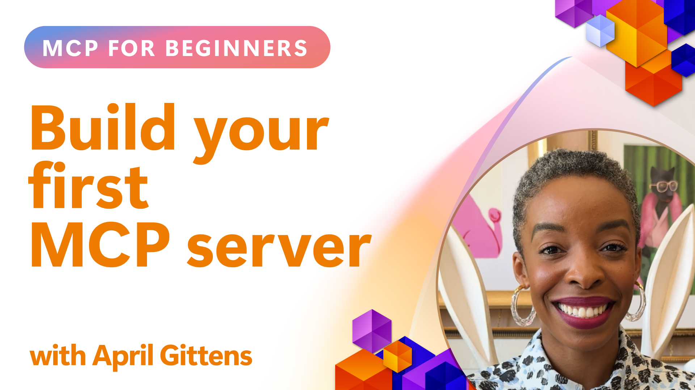

<!--
CO_OP_TRANSLATOR_METADATA:
{
  "original_hash": "858362ce0118de3fec0f9114bf396101",
  "translation_date": "2025-08-26T16:44:19+00:00",
  "source_file": "03-GettingStarted/README.md",
  "language_code": "lt"
}
-->
## Pradžia  

_(Spustelėkite aukščiau esančią nuotrauką, kad peržiūrėtumėte šios pamokos vaizdo įrašą)_

Šiame skyriuje yra kelios pamokos:

- **1 Jūsų pirmasis serveris**, pirmoje pamokoje sužinosite, kaip sukurti savo pirmąjį serverį ir patikrinti jį naudojant inspektoriaus įrankį – vertingą būdą testuoti ir derinti serverį, [į pamoką](01-first-server/README.md)

- **2 Klientas**, šioje pamokoje sužinosite, kaip parašyti klientą, kuris galėtų prisijungti prie jūsų serverio, [į pamoką](02-client/README.md)

- **3 Klientas su LLM**, dar geresnis būdas sukurti klientą – pridėti LLM, kad jis galėtų „derėtis“ su jūsų serveriu dėl veiksmų, [į pamoką](03-llm-client/README.md)

- **4 Serverio naudojimas GitHub Copilot Agent režimu Visual Studio Code**. Čia nagrinėsime, kaip paleisti MCP serverį Visual Studio Code aplinkoje, [į pamoką](04-vscode/README.md)

- **5 Naudojimas iš SSE (Server Sent Events)**. SSE yra standartas serverio-kliento srautui, leidžiantis serveriams realiu laiku siųsti atnaujinimus klientams per HTTP, [į pamoką](05-sse-server/README.md)

- **6 HTTP srautas su MCP (Streamable HTTP)**. Sužinokite apie modernų HTTP srautą, progreso pranešimus ir kaip įgyvendinti mastelio keičiamus, realaus laiko MCP serverius ir klientus naudojant Streamable HTTP, [į pamoką](06-http-streaming/README.md)

- **7 AI įrankių rinkinys VSCode**. Naudokite ir testuokite savo MCP klientus ir serverius, [į pamoką](07-aitk/README.md)

- **8 Testavimas**. Čia ypatingą dėmesį skirsime, kaip įvairiais būdais testuoti serverį ir klientą, [į pamoką](08-testing/README.md)

- **9 Diegimas**. Šiame skyriuje aptarsime įvairius MCP sprendimų diegimo būdus, [į pamoką](09-deployment/README.md)

Model Context Protocol (MCP) yra atviras protokolas, standartizuojantis, kaip programos teikia kontekstą LLM. MCP galima palyginti su USB-C jungtimi AI programoms – tai standartizuotas būdas prijungti AI modelius prie įvairių duomenų šaltinių ir įrankių.

## Mokymosi tikslai

Pamokos pabaigoje galėsite:

- Paruošti MCP kūrimo aplinkas C#, Java, Python, TypeScript ir JavaScript kalboms
- Kurti ir diegti pagrindinius MCP serverius su individualiomis funkcijomis (ištekliais, užklausomis ir įrankiais)
- Kurti pagrindines programas, kurios jungiasi prie MCP serverių
- Testuoti ir derinti MCP įgyvendinimus
- Suprasti dažniausiai pasitaikančias nustatymo problemas ir jų sprendimus
- Prijungti savo MCP įgyvendinimus prie populiarių LLM paslaugų

## MCP aplinkos nustatymas

Prieš pradėdami dirbti su MCP, svarbu paruošti kūrimo aplinką ir suprasti pagrindinį darbo eigą. Šiame skyriuje pateikiami pradiniai nustatymo žingsniai, kad MCP pradžia būtų sklandi.

### Būtinos sąlygos

Prieš pradėdami MCP kūrimą, įsitikinkite, kad turite:

- **Kūrimo aplinka**: Pasirinkta kalba (C#, Java, Python, TypeScript arba JavaScript)
- **IDE/Redaktorius**: Visual Studio, Visual Studio Code, IntelliJ, Eclipse, PyCharm arba bet kuris modernus kodų redaktorius
- **Paketų tvarkyklės**: NuGet, Maven/Gradle, pip arba npm/yarn
- **API raktai**: Bet kokioms AI paslaugoms, kurias planuojate naudoti savo pagrindinėse programose

### Oficialūs SDK

Artėjančiuose skyriuose matysite sprendimus, sukurtus naudojant Python, TypeScript, Java ir .NET. Čia pateikiami visi oficialiai palaikomi SDK.

MCP teikia oficialius SDK kelioms kalboms:
- [C# SDK](https://github.com/modelcontextprotocol/csharp-sdk) - Palaikomas bendradarbiaujant su Microsoft
- [Java SDK](https://github.com/modelcontextprotocol/java-sdk) - Palaikomas bendradarbiaujant su Spring AI
- [TypeScript SDK](https://github.com/modelcontextprotocol/typescript-sdk) - Oficialus TypeScript įgyvendinimas
- [Python SDK](https://github.com/modelcontextprotocol/python-sdk) - Oficialus Python įgyvendinimas
- [Kotlin SDK](https://github.com/modelcontextprotocol/kotlin-sdk) - Oficialus Kotlin įgyvendinimas
- [Swift SDK](https://github.com/modelcontextprotocol/swift-sdk) - Palaikomas bendradarbiaujant su Loopwork AI
- [Rust SDK](https://github.com/modelcontextprotocol/rust-sdk) - Oficialus Rust įgyvendinimas

## Pagrindinės mintys

- MCP kūrimo aplinkos nustatymas yra paprastas naudojant kalbai pritaikytus SDK
- MCP serverių kūrimas apima įrankių kūrimą ir registravimą su aiškiais schemomis
- MCP klientai jungiasi prie serverių ir modelių, kad pasinaudotų išplėstomis galimybėmis
- Testavimas ir derinimas yra būtini patikimam MCP įgyvendinimui
- Diegimo galimybės apima vietinį kūrimą ir debesų sprendimus

## Praktika

Turime pavyzdžių rinkinį, kuris papildo pratimus, kuriuos matysite visuose šio skyriaus skyriuose. Be to, kiekvienas skyrius turi savo pratimus ir užduotis.

- [Java skaičiuotuvas](./samples/java/calculator/README.md)
- [.Net skaičiuotuvas](../../../03-GettingStarted/samples/csharp)
- [JavaScript skaičiuotuvas](./samples/javascript/README.md)
- [TypeScript skaičiuotuvas](./samples/typescript/README.md)
- [Python skaičiuotuvas](../../../03-GettingStarted/samples/python)

## Papildomi ištekliai

- [Sukurkite agentus naudodami Model Context Protocol Azure platformoje](https://learn.microsoft.com/azure/developer/ai/intro-agents-mcp)
- [Nuotolinis MCP su Azure Container Apps (Node.js/TypeScript/JavaScript)](https://learn.microsoft.com/samples/azure-samples/mcp-container-ts/mcp-container-ts/)
- [.NET OpenAI MCP agentas](https://learn.microsoft.com/samples/azure-samples/openai-mcp-agent-dotnet/openai-mcp-agent-dotnet/)

## Kas toliau

Toliau: [Pirmojo MCP serverio kūrimas](01-first-server/README.md)

---

**Atsakomybės apribojimas**:  
Šis dokumentas buvo išverstas naudojant AI vertimo paslaugą [Co-op Translator](https://github.com/Azure/co-op-translator). Nors siekiame tikslumo, prašome atkreipti dėmesį, kad automatiniai vertimai gali turėti klaidų ar netikslumų. Originalus dokumentas jo gimtąja kalba turėtų būti laikomas autoritetingu šaltiniu. Kritinei informacijai rekomenduojama profesionali žmogaus vertimo paslauga. Mes neprisiimame atsakomybės už nesusipratimus ar klaidingus interpretavimus, atsiradusius naudojant šį vertimą.