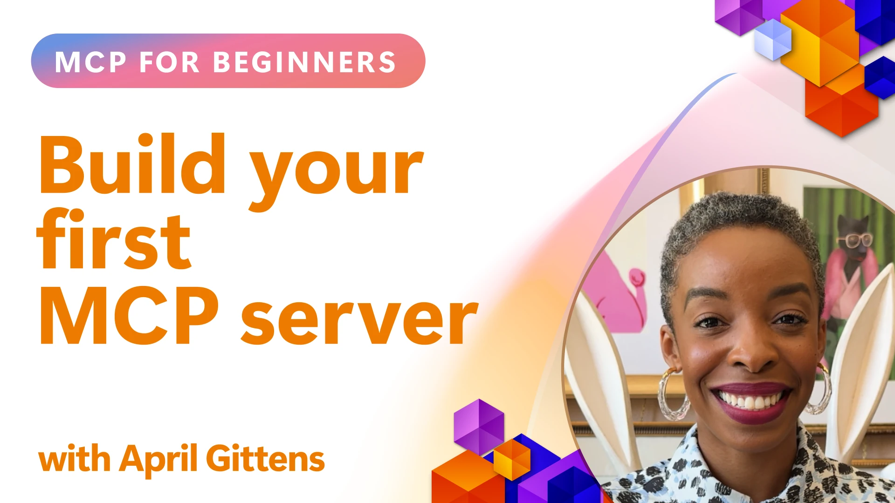

## Pradžia  

_(Spustelėkite paveikslėlį viršuje, kad peržiūrėtumėte šio užsiėmimo vaizdo įrašą)_

Ši dalis susideda iš kelių pamokų:

- **1 Jūsų pirmasis serveris**, pirmajame užsiėmime sužinosite, kaip sukurti savo pirmą serverį ir patikrinti jį naudojant inspektoriaus įrankį – naudinga priemonė serverio testavimui ir derinimui, [į pamoką](01-first-server/README.md)

- **2 Klientas**, šioje pamokoje išmoksite rašyti klientą, kuris gali prisijungti prie jūsų serverio, [į pamoką](02-client/README.md)

- **3 Klientas su LLM**, dar geresnis kliento rašymo būdas – pridėti LLM, kad jis galėtų "derėtis" su jūsų serveriu, ką daryti, [į pamoką](03-llm-client/README.md)

- **4 GitHub Copilot Agent režimo serverio naudojimas Visual Studio Code**. Čia nagrinėjame, kaip paleisti mūsų MCP serverį Visual Studio Code aplinkoje, [į pamoką](04-vscode/README.md)

- **5 stdio Transporto serveris** stdio transportas yra rekomenduojama standartinė vietinė MCP serverio ir kliento komunikacijos priemonė, užtikrinanti saugų komunikavimą tarp procesų su įmontuota proceso izoliacija [į pamoką](05-stdio-server/README.md)

- **6 HTTP srautinimas su MCP (Streamable HTTP)**. Sužinokite apie šiuolaikinį HTTP srautinimo transportą (rekomenduojamą nuotoliniams MCP serveriams pagal [MCP specifikaciją 2025-11-25](https://spec.modelcontextprotocol.io/specification/2025-11-25/basic/transports/#streamable-http)), pažangos pranešimus ir kaip įgyvendinti mastelio keičiamus, realaus laiko MCP serverius ir klientus naudojant Streamable HTTP. [į pamoką](06-http-streaming/README.md)

- **7 Dirbtinio intelekto rinkinys VSCode** naudojimui ir MCP klientų bei serverių testavimui [į pamoką](07-aitk/README.md)

- **8 Testavimas**. Čia ypatingas dėmesys skiriamas serverio ir kliento testavimui įvairiais būdais, [į pamoką](08-testing/README.md)

- **9 Diegimas**. Šiame skyriuje nagrinėsime skirtingus MCP sprendimų diegimo būdus, [į pamoką](09-deployment/README.md)

- **10 Išplėstinis serverio naudojimas**. Šiame skyriuje aptariamas pažangus serverio naudojimas, [į pamoką](./10-advanced/README.md)

- **11 Autentifikacija**. Čia kalbama apie paprastą autentifikaciją, nuo Basic Auth iki JWT ir RBAC naudojimo. Rekomenduojama pradėti čia, o vėliau nagrinėti pažangias temas 5 skyriuje ir atlikti papildomą saugumo stiprinimą 2 skyriuje pateiktų rekomendacijų pagrindu, [į pamoką](./11-simple-auth/README.md)

- **12 MCP šeimininkai**. Konfigūruokite ir naudokite populiarius MCP šeimininko klientus, įskaitant Claude Desktop, Cursor, Cline ir Windsurf. Sužinokite apie transporto tipus ir trikčių diagnostiką, [į pamoką](./12-mcp-hosts/README.md)

- **13 MCP inspektorius**. Interaktyviai derinkite ir testuokite savo MCP serverius naudodami MCP inspektoriaus įrankį. Sužinokite apie trikčių šalinimo įrankius, išteklius ir protokolo pranešimus, [į pamoką](./13-mcp-inspector/README.md)

- **14 Bandymas**. Kurkite MCP serverius, kurie bendradarbiauja su MCP klientais LLM susijusiose užduotyse. [į pamoką](./14-sampling/README.md)

- **15 MCP programos**. Kurkite MCP serverius, kurie taip pat atsako su UI instrukcijomis, [į pamoką](./15-mcp-apps/README.md)

Modelio konteksto protokolas (MCP) yra atviras protokolas, standartizuojantis, kaip programos pateikia kontekstą LLM. Galvokite apie MCP kaip USB-C prievadą dirbtinio intelekto programoms – jis suteikia standartizuotą būdą prijungti AI modelius prie skirtingų duomenų šaltinių ir įrankių.

## Mokymosi tikslai

Baigę šią pamoką galėsite:

- Parengti kūrimo aplinkas MCP C#, Java, Python, TypeScript ir JavaScript kalboms
- Kurti ir diegti pagrindinius MCP serverius su pritaikytomis funkcijomis (ištekliai, užuominos, įrankiai)
- Kurti šeimininko programas, jungiančias prie MCP serverių
- Testuoti ir derinti MCP įgyvendinimus
- Suprasti įprastus diegimo iššūkius ir jų sprendimus
- Jungti savo MCP įgyvendinimus prie populiarių LLM paslaugų

## MCP aplinkos parengimas

Prieš pradėdami dirbti su MCP svarbu paruošti kūrimo aplinką ir suprasti pagrindinį darbo procesą. Ši dalis padės jums atlikti pradinius nustatymus, kad MCP pradžia būtų sklandi.

### Reikalavimai

Prieš pradedant MCP kūrimą įsitikinkite, kad turite:

- **Kūrimo aplinką** savo pasirinkta kalba (C#, Java, Python, TypeScript ar JavaScript)
- **IDE / Redaktorių**: Visual Studio, Visual Studio Code, IntelliJ, Eclipse, PyCharm ar bet kurį modernų kodo redaktorių
- **Paketo tvarkykles**: NuGet, Maven/Gradle, pip ar npm/yarn
- **API raktus**: Jei ketinate naudoti AI paslaugas savo šeimininko programose

### Oficialūs SDK

Kituose skyriuose matysite sprendimus, panaudojant Python, TypeScript, Java ir .NET. Čia pateikiami visi oficialiai palaikomi SDK.

MCP teikia oficialius SDK kelioms programavimo kalboms (atitinkančias [MCP Specifikaciją 2025-11-25](https://spec.modelcontextprotocol.io/specification/2025-11-25/)):
- [C# SDK](https://github.com/modelcontextprotocol/csharp-sdk) – palaikoma bendradarbiaujant su Microsoft
- [Java SDK](https://github.com/modelcontextprotocol/java-sdk) – palaikoma bendradarbiaujant su Spring AI
- [TypeScript SDK](https://github.com/modelcontextprotocol/typescript-sdk) – oficiali TypeScript įgyvendinimas
- [Python SDK](https://github.com/modelcontextprotocol/python-sdk) – oficiali Python įgyvendinimas (FastMCP)
- [Kotlin SDK](https://github.com/modelcontextprotocol/kotlin-sdk) – oficiali Kotlin įgyvendinimas
- [Swift SDK](https://github.com/modelcontextprotocol/swift-sdk) – palaikoma bendradarbiaujant su Loopwork AI
- [Rust SDK](https://github.com/modelcontextprotocol/rust-sdk) – oficiali Rust įgyvendinimas
- [Go SDK](https://github.com/modelcontextprotocol/go-sdk) – oficiali Go įgyvendinimas

## Pagrindinės mintys

- MCP kūrimo aplinkos parengimas yra paprastas naudojant kalbai specifinius SDK
- MCP serverių kūrimas apima įrankių kūrimą ir registravimą su aiškiomis schemomis
- MCP klientai jungiasi prie serverių ir modelių, kad išnaudotų išplėstines galimybes
- Testavimas ir derinimas yra būtini patikimam MCP įgyvendinimui
- Diegimo galimybės apima nuo vietinio kūrimo iki sprendimų debesyje

## Praktika

Turime keletą pavyzdžių, kurie papildo visas šios dalies užduotis. Be to, kiekvienas skyrius turi ir savas užduotis bei pratybas.

- [Java skaičiuoklė](./samples/java/calculator/README.md)
- [.Net skaičiuoklė](../../../03-GettingStarted/samples/csharp)
- [JavaScript skaičiuoklė](./samples/javascript/README.md)
- [TypeScript skaičiuoklė](./samples/typescript/README.md)
- [Python skaičiuoklė](../../../03-GettingStarted/samples/python)

## Papildomi ištekliai

- [Agentų kūrimas naudojant Model Context Protocol Azure aplinkoje](https://learn.microsoft.com/azure/developer/ai/intro-agents-mcp)
- [Nuotolinis MCP su Azure Container Apps (Node.js/TypeScript/JavaScript)](https://learn.microsoft.com/samples/azure-samples/mcp-container-ts/mcp-container-ts/)
- [.NET OpenAI MCP agentas](https://learn.microsoft.com/samples/azure-samples/openai-mcp-agent-dotnet/openai-mcp-agent-dotnet/)

## Kas toliau

Pradėkite nuo pirmos pamokos: [Sukurti savo pirmą MCP serverį](01-first-server/README.md)

Baigę šį modulį tęskite: [4 modulis: Praktinis įgyvendinimas](../04-PracticalImplementation/README.md)

---

<!-- CO-OP TRANSLATOR DISCLAIMER START -->
**Atsakomybės apribojimas**:
Šis dokumentas buvo išverstas naudojant dirbtinio intelekto vertimo tarnybą [Co-op Translator](https://github.com/Azure/co-op-translator). Nors stengiamės užtikrinti tikslumą, prašome atkreipti dėmesį, kad automatizuotuose vertimuose gali būti klaidų ar netikslumų. Originalus dokumentas gimtąja kalba turėtų būti laikomas pagrindiniu ir autoritetingu šaltiniu. Svarbiai informacijai rekomenduojamas profesionalus vertimas žmogaus. Mes neatsakome už jokius nesusipratimus ar neteisingas interpretacijas, kilusias dėl šio vertimo naudojimo.
<!-- CO-OP TRANSLATOR DISCLAIMER END -->