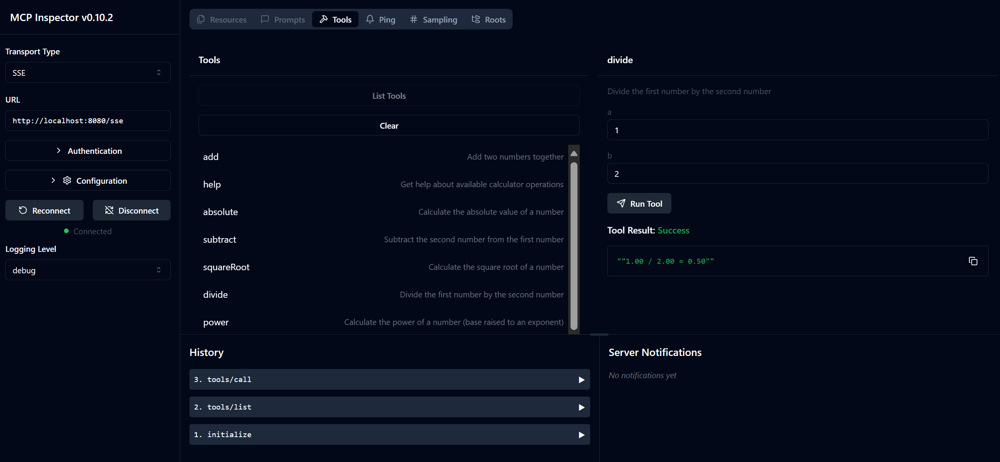

<!--
CO_OP_TRANSLATOR_METADATA:
{
  "original_hash": "13231e9951b68efd9df8c56bd5cdb27e",
  "translation_date": "2025-08-26T16:54:59+00:00",
  "source_file": "03-GettingStarted/samples/java/calculator/README.md",
  "language_code": "lt"
}
-->
# Pagrindinė skaičiuoklės MCP paslauga

Ši paslauga teikia pagrindines skaičiuoklės operacijas per Model Context Protocol (MCP), naudojant Spring Boot su WebFlux transportu. Ji sukurta kaip paprastas pavyzdys pradedantiesiems, norintiems išmokti MCP įgyvendinimo.

Daugiau informacijos rasite [MCP Server Boot Starter](https://docs.spring.io/spring-ai/reference/api/mcp/mcp-server-boot-starter-docs.html) dokumentacijoje.

## Apžvalga

Paslauga demonstruoja:
- SSE (Server-Sent Events) palaikymą
- Automatinį įrankių registravimą naudojant Spring AI `@Tool` anotaciją
- Pagrindines skaičiuoklės funkcijas:
  - Sudėtis, atimtis, daugyba, dalyba
  - Laipsnio skaičiavimas ir kvadratinė šaknis
  - Modulis (likutis) ir absoliuti vertė
  - Pagalbos funkcija operacijų aprašymams

## Funkcijos

Ši skaičiuoklės paslauga siūlo šias galimybes:

1. **Pagrindinės aritmetinės operacijos**:
   - Dviejų skaičių sudėtis
   - Vieno skaičiaus atimtis iš kito
   - Dviejų skaičių daugyba
   - Vieno skaičiaus dalyba iš kito (su nulio dalybos patikra)

2. **Pažangios operacijos**:
   - Laipsnio skaičiavimas (bazės pakėlimas laipsniu)
   - Kvadratinės šaknies skaičiavimas (su neigiamo skaičiaus patikra)
   - Modulio (likučio) skaičiavimas
   - Absoliučios vertės skaičiavimas

3. **Pagalbos sistema**:
   - Įmontuota pagalbos funkcija, paaiškinanti visas galimas operacijas

## Paslaugos naudojimas

Paslauga teikia šiuos API galinius taškus per MCP protokolą:

- `add(a, b)`: Sudėti du skaičius
- `subtract(a, b)`: Atimti antrą skaičių iš pirmo
- `multiply(a, b)`: Padauginti du skaičius
- `divide(a, b)`: Padalyti pirmą skaičių iš antro (su nulio patikra)
- `power(base, exponent)`: Apskaičiuoti skaičiaus laipsnį
- `squareRoot(number)`: Apskaičiuoti kvadratinę šaknį (su neigiamo skaičiaus patikra)
- `modulus(a, b)`: Apskaičiuoti likutį dalijant
- `absolute(number)`: Apskaičiuoti absoliučią vertę
- `help()`: Gauti informaciją apie galimas operacijas

## Testavimo klientas

Paprastas testavimo klientas yra įtrauktas į `com.microsoft.mcp.sample.client` paketą. `SampleCalculatorClient` klasė demonstruoja skaičiuoklės paslaugos galimas operacijas.

## LangChain4j kliento naudojimas

Projektas apima LangChain4j pavyzdinį klientą `com.microsoft.mcp.sample.client.LangChain4jClient`, kuris demonstruoja, kaip integruoti skaičiuoklės paslaugą su LangChain4j ir GitHub modeliais:

### Reikalavimai

1. **GitHub žetono nustatymas**:
   
   Norint naudoti GitHub AI modelius (pvz., phi-4), reikia GitHub asmeninio prieigos žetono:

   a. Eikite į savo GitHub paskyros nustatymus: https://github.com/settings/tokens
   
   b. Spustelėkite "Generate new token" → "Generate new token (classic)"
   
   c. Suteikite savo žetonui aprašomąjį pavadinimą
   
   d. Pasirinkite šiuos leidimus:
      - `repo` (Pilna kontrolė privačioms saugykloms)
      - `read:org` (Skaityti organizacijos ir komandos narystę, skaityti organizacijos projektus)
      - `gist` (Kurti gistus)
      - `user:email` (Prieiga prie vartotojo el. pašto adresų (tik skaitymas))
   
   e. Spustelėkite "Generate token" ir nukopijuokite naują žetoną
   
   f. Nustatykite jį kaip aplinkos kintamąjį:
      
      Windows sistemoje:
      ```
      set GITHUB_TOKEN=your-github-token
      ```
      
      macOS/Linux sistemoje:
      ```bash
      export GITHUB_TOKEN=your-github-token
      ```

   g. Norėdami nustatyti nuolat, pridėkite jį prie aplinkos kintamųjų per sistemos nustatymus

2. Pridėkite LangChain4j GitHub priklausomybę į savo projektą (jau įtraukta į pom.xml):
   ```xml
   <dependency>
       <groupId>dev.langchain4j</groupId>
       <artifactId>langchain4j-github</artifactId>
       <version>${langchain4j.version}</version>
   </dependency>
   ```

3. Įsitikinkite, kad skaičiuoklės serveris veikia `localhost:8080`

### LangChain4j kliento paleidimas

Šis pavyzdys demonstruoja:
- Prisijungimą prie skaičiuoklės MCP serverio per SSE transportą
- LangChain4j naudojimą kuriant pokalbių robotą, kuris naudoja skaičiuoklės operacijas
- Integraciją su GitHub AI modeliais (šiuo metu naudojamas phi-4 modelis)

Klientas siunčia šiuos pavyzdinius užklausimus, kad pademonstruotų funkcionalumą:
1. Dviejų skaičių sumos skaičiavimas
2. Skaičiaus kvadratinės šaknies radimas
3. Pagalbos informacijos gavimas apie galimas skaičiuoklės operacijas

Paleiskite pavyzdį ir patikrinkite konsolės išvestį, kad pamatytumėte, kaip AI modelis naudoja skaičiuoklės įrankius atsakymams pateikti.

### GitHub modelio konfigūracija

LangChain4j klientas sukonfigūruotas naudoti GitHub phi-4 modelį su šiais nustatymais:

```java
ChatLanguageModel model = GitHubChatModel.builder()
    .apiKey(System.getenv("GITHUB_TOKEN"))
    .timeout(Duration.ofSeconds(60))
    .modelName("phi-4")
    .logRequests(true)
    .logResponses(true)
    .build();
```

Norėdami naudoti kitus GitHub modelius, tiesiog pakeiskite `modelName` parametrą į kitą palaikomą modelį (pvz., "claude-3-haiku-20240307", "llama-3-70b-8192" ir kt.).

## Priklausomybės

Projektui reikalingos šios pagrindinės priklausomybės:

```xml
<!-- For MCP Server -->
<dependency>
    <groupId>org.springframework.ai</groupId>
    <artifactId>spring-ai-starter-mcp-server-webflux</artifactId>
</dependency>

<!-- For LangChain4j integration -->
<dependency>
    <groupId>dev.langchain4j</groupId>
    <artifactId>langchain4j-mcp</artifactId>
    <version>${langchain4j.version}</version>
</dependency>

<!-- For GitHub models support -->
<dependency>
    <groupId>dev.langchain4j</groupId>
    <artifactId>langchain4j-github</artifactId>
    <version>${langchain4j.version}</version>
</dependency>
```

## Projekto kūrimas

Sukurkite projektą naudodami Maven:
```bash
./mvnw clean install -DskipTests
```

## Serverio paleidimas

### Naudojant Java

```bash
java -jar target/calculator-server-0.0.1-SNAPSHOT.jar
```

### Naudojant MCP Inspector

MCP Inspector yra naudingas įrankis sąveikai su MCP paslaugomis. Norėdami jį naudoti su šia skaičiuoklės paslauga:

1. **Įdiekite ir paleiskite MCP Inspector** naujame terminalo lange:
   ```bash
   npx @modelcontextprotocol/inspector
   ```

2. **Pasiekite internetinę sąsają** spustelėdami programos rodomą URL (paprastai http://localhost:6274)

3. **Konfigūruokite ryšį**:
   - Nustatykite transporto tipą kaip "SSE"
   - Nustatykite URL į jūsų veikiančio serverio SSE galinį tašką: `http://localhost:8080/sse`
   - Spustelėkite "Connect"

4. **Naudokite įrankius**:
   - Spustelėkite "List Tools", kad pamatytumėte galimas skaičiuoklės operacijas
   - Pasirinkite įrankį ir spustelėkite "Run Tool", kad vykdytumėte operaciją



### Naudojant Docker

Projektas apima Dockerfile konteinerizuotam diegimui:

1. **Sukurkite Docker atvaizdą**:
   ```bash
   docker build -t calculator-mcp-service .
   ```

2. **Paleiskite Docker konteinerį**:
   ```bash
   docker run -p 8080:8080 calculator-mcp-service
   ```

Tai:
- Sukurs daugiapakopį Docker atvaizdą su Maven 3.9.9 ir Eclipse Temurin 24 JDK
- Sukurs optimizuotą konteinerio atvaizdą
- Atvers paslaugą 8080 prievade
- Paleis MCP skaičiuoklės paslaugą konteineryje

Kai konteineris veikia, paslaugą galite pasiekti adresu `http://localhost:8080`.

## Trikčių šalinimas

### Dažnos problemos su GitHub žetonu

1. **Žetono leidimų problemos**: Jei gaunate 403 Forbidden klaidą, patikrinkite, ar jūsų žetonas turi tinkamus leidimus, kaip nurodyta reikalavimuose.

2. **Žetonas nerastas**: Jei gaunate "No API key found" klaidą, įsitikinkite, kad GITHUB_TOKEN aplinkos kintamasis tinkamai nustatytas.

3. **Apribojimai**: GitHub API turi apribojimus. Jei susiduriate su apribojimų klaida (statuso kodas 429), palaukite kelias minutes prieš bandydami dar kartą.

4. **Žetono galiojimo pabaiga**: GitHub žetonai gali baigti galioti. Jei po kurio laiko gaunate autentifikavimo klaidas, sugeneruokite naują žetoną ir atnaujinkite aplinkos kintamąjį.

Jei reikia papildomos pagalbos, peržiūrėkite [LangChain4j dokumentaciją](https://github.com/langchain4j/langchain4j) arba [GitHub API dokumentaciją](https://docs.github.com/en/rest).

---

**Atsakomybės apribojimas**:  
Šis dokumentas buvo išverstas naudojant AI vertimo paslaugą [Co-op Translator](https://github.com/Azure/co-op-translator). Nors siekiame tikslumo, prašome atkreipti dėmesį, kad automatiniai vertimai gali turėti klaidų ar netikslumų. Originalus dokumentas jo gimtąja kalba turėtų būti laikomas autoritetingu šaltiniu. Kritinei informacijai rekomenduojama naudoti profesionalų žmogaus vertimą. Mes neprisiimame atsakomybės už nesusipratimus ar klaidingus interpretavimus, atsiradusius dėl šio vertimo naudojimo.