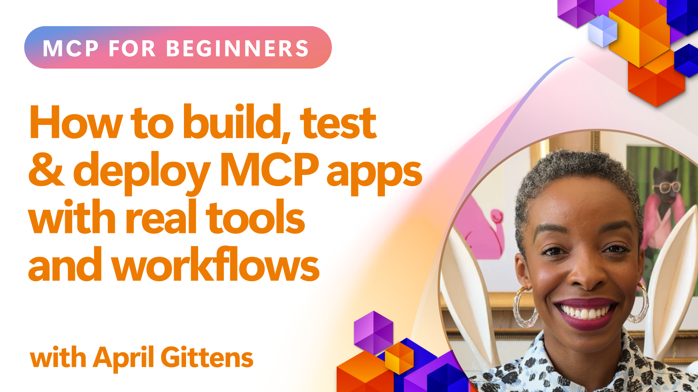
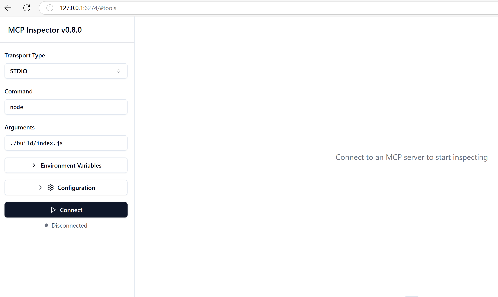

<!--
CO_OP_TRANSLATOR_METADATA:
{
  "original_hash": "83efa75a69bc831277263a6f1ae53669",
  "translation_date": "2025-08-26T16:17:16+00:00",
  "source_file": "04-PracticalImplementation/README.md",
  "language_code": "lt"
}
-->
# Praktinis įgyvendinimas

[](https://youtu.be/vCN9-mKBDfQ)

_(Spustelėkite aukščiau esančią nuotrauką, kad peržiūrėtumėte šios pamokos vaizdo įrašą)_

Praktinis įgyvendinimas yra ta vieta, kur Modelio Konteksto Protokolo (MCP) galia tampa apčiuopiama. Nors svarbu suprasti MCP teoriją ir architektūrą, tikroji vertė atsiskleidžia, kai šias koncepcijas pritaikote kurdami, testuodami ir diegdami sprendimus, kurie sprendžia realias problemas. Šis skyrius sujungia konceptualias žinias su praktiniu vystymu, padėdamas jums įgyvendinti MCP pagrįstas programas.

Nesvarbu, ar kuriate išmaniuosius asistentus, integruojate dirbtinį intelektą į verslo procesus, ar kuriate individualius duomenų apdorojimo įrankius, MCP suteikia lankstų pagrindą. Jo nepriklausoma nuo programavimo kalbos struktūra ir oficialūs SDK populiarioms programavimo kalboms daro jį prieinamą įvairiems kūrėjams. Naudodamiesi šiais SDK, galite greitai kurti prototipus, iteruoti ir plėsti savo sprendimus įvairiose platformose ir aplinkose.

Toliau pateiktuose skyriuose rasite praktinių pavyzdžių, kodo pavyzdžių ir diegimo strategijų, kurios parodys, kaip įgyvendinti MCP naudojant C#, Java su Spring, TypeScript, JavaScript ir Python. Taip pat sužinosite, kaip derinti ir testuoti MCP serverius, valdyti API ir diegti sprendimus debesyje naudojant Azure. Šie praktiniai ištekliai skirti paspartinti jūsų mokymąsi ir padėti užtikrintai kurti patikimas, gamybai paruoštas MCP programas.

## Apžvalga

Ši pamoka orientuota į praktinius MCP įgyvendinimo aspektus įvairiomis programavimo kalbomis. Mes nagrinėsime, kaip naudoti MCP SDK su C#, Java su Spring, TypeScript, JavaScript ir Python, kad sukurtume patikimas programas, derintume ir testuotume MCP serverius bei kurtume pakartotinai naudojamus išteklius, šablonus ir įrankius.

## Mokymosi tikslai

Šios pamokos pabaigoje jūs galėsite:

- Įgyvendinti MCP sprendimus naudojant oficialius SDK įvairiomis programavimo kalbomis
- Sistemingai derinti ir testuoti MCP serverius
- Kurti ir naudoti serverio funkcijas (Ištekliai, Šablonai ir Įrankiai)
- Kurti efektyvias MCP darbo eigas sudėtingoms užduotims
- Optimizuoti MCP įgyvendinimus našumui ir patikimumui

## Oficialūs SDK ištekliai

Modelio Konteksto Protokolas siūlo oficialius SDK kelioms kalboms:

- [C# SDK](https://github.com/modelcontextprotocol/csharp-sdk)
- [Java su Spring SDK](https://github.com/modelcontextprotocol/java-sdk) **Pastaba:** reikalauja priklausomybės nuo [Project Reactor](https://projectreactor.io). (Žr. [diskusijų klausimą 246](https://github.com/orgs/modelcontextprotocol/discussions/246).)
- [TypeScript SDK](https://github.com/modelcontextprotocol/typescript-sdk)
- [Python SDK](https://github.com/modelcontextprotocol/python-sdk)
- [Kotlin SDK](https://github.com/modelcontextprotocol/kotlin-sdk)

## Darbas su MCP SDK

Šiame skyriuje pateikiami praktiniai MCP įgyvendinimo pavyzdžiai įvairiomis programavimo kalbomis. Kodo pavyzdžius galite rasti `samples` kataloge, suskirstytame pagal kalbas.

### Galimi pavyzdžiai

Saugykloje yra [įgyvendinimo pavyzdžiai](../../../04-PracticalImplementation/samples) šiomis kalbomis:

- [C#](./samples/csharp/README.md)
- [Java su Spring](./samples/java/containerapp/README.md)
- [TypeScript](./samples/typescript/README.md)
- [JavaScript](./samples/javascript/README.md)
- [Python](./samples/python/README.md)

Kiekvienas pavyzdys demonstruoja pagrindines MCP koncepcijas ir įgyvendinimo modelius konkrečiai kalbai ir ekosistemai.

## Pagrindinės serverio funkcijos

MCP serveriai gali įgyvendinti bet kokį šių funkcijų derinį:

### Ištekliai

Ištekliai suteikia kontekstą ir duomenis naudotojui arba AI modeliui:

- Dokumentų saugyklos
- Žinių bazės
- Struktūrizuoti duomenų šaltiniai
- Failų sistemos

### Šablonai

Šablonai yra paruoštos žinutės ir darbo eigos naudotojams:

- Iš anksto apibrėžti pokalbių šablonai
- Vadovaujamos sąveikos struktūros
- Specializuotos dialogo struktūros

### Įrankiai

Įrankiai yra funkcijos, kurias vykdo AI modelis:

- Duomenų apdorojimo įrankiai
- Išorinių API integracijos
- Skaičiavimo galimybės
- Paieškos funkcionalumas

## Pavyzdinis įgyvendinimas: C# įgyvendinimas

Oficialiame C# SDK saugykloje yra keli pavyzdiniai įgyvendinimai, demonstruojantys skirtingus MCP aspektus:

- **Paprastas MCP klientas**: Paprastas pavyzdys, kaip sukurti MCP klientą ir iškviesti įrankius
- **Paprastas MCP serveris**: Minimalus serverio įgyvendinimas su pagrindine įrankių registracija
- **Išplėstinis MCP serveris**: Pilnai funkcionalus serveris su įrankių registracija, autentifikacija ir klaidų valdymu
- **ASP.NET integracija**: Pavyzdžiai, demonstruojantys integraciją su ASP.NET Core
- **Įrankių įgyvendinimo modeliai**: Įvairūs modeliai, kaip įgyvendinti įrankius su skirtingu sudėtingumo lygiu

C# MCP SDK yra peržiūros stadijoje, todėl API gali keistis. Mes nuolat atnaujinsime šį tinklaraštį, kai SDK vystysis.

### Pagrindinės funkcijos

- [C# MCP Nuget ModelContextProtocol](https://www.nuget.org/packages/ModelContextProtocol)
- Kaip sukurti savo [pirmąjį MCP serverį](https://devblogs.microsoft.com/dotnet/build-a-model-context-protocol-mcp-server-in-csharp/).

Visus C# įgyvendinimo pavyzdžius rasite [oficialioje C# SDK pavyzdžių saugykloje](https://github.com/modelcontextprotocol/csharp-sdk).

## Pavyzdinis įgyvendinimas: Java su Spring įgyvendinimas

Java su Spring SDK siūlo tvirtas MCP įgyvendinimo galimybes su įmonės lygio funkcijomis.

### Pagrindinės funkcijos

- Integracija su Spring Framework
- Stipri tipų sauga
- Reaktyvaus programavimo palaikymas
- Išsamus klaidų valdymas

Visą Java su Spring įgyvendinimo pavyzdį rasite [Java su Spring pavyzdyje](samples/java/containerapp/README.md) pavyzdžių kataloge.

## Pavyzdinis įgyvendinimas: JavaScript įgyvendinimas

JavaScript SDK suteikia lengvą ir lanksčią MCP įgyvendinimo galimybę.

### Pagrindinės funkcijos

- Node.js ir naršyklės palaikymas
- API, pagrįsta pažadais
- Lengva integracija su Express ir kitais karkasais
- WebSocket palaikymas srautiniam perdavimui

Visą JavaScript įgyvendinimo pavyzdį rasite [JavaScript pavyzdyje](samples/javascript/README.md) pavyzdžių kataloge.

## Pavyzdinis įgyvendinimas: Python įgyvendinimas

Python SDK siūlo „Pythonic“ požiūrį į MCP įgyvendinimą su puikia ML karkasų integracija.

### Pagrindinės funkcijos

- Async/await palaikymas su asyncio
- FastAPI integracija
- Paprasta įrankių registracija
- Natūrali integracija su populiariais ML bibliotekais

Visą Python įgyvendinimo pavyzdį rasite [Python pavyzdyje](samples/python/README.md) pavyzdžių kataloge.

## API valdymas

Azure API Management yra puikus atsakymas į klausimą, kaip apsaugoti MCP serverius. Idėja yra pastatyti Azure API Management instanciją prieš jūsų MCP serverį ir leisti jai valdyti funkcijas, kurių greičiausiai prireiks, tokias kaip:

- užklausų ribojimas
- žetonų valdymas
- stebėjimas
- apkrovos balansavimas
- saugumas

### Azure pavyzdys

Štai Azure pavyzdys, kuris būtent tai daro, t. y. [kuria MCP serverį ir apsaugo jį naudodamas Azure API Management](https://github.com/Azure-Samples/remote-mcp-apim-functions-python).

Žemiau esančiame paveikslėlyje parodyta, kaip vyksta autorizacijos srautas:


Šiame paveikslėlyje vyksta šie veiksmai:

- Autentifikacija/autorizacija vyksta naudojant Microsoft Entra.
- Azure API Management veikia kaip vartai ir naudoja politiką srautui nukreipti ir valdyti.
- Azure Monitor registruoja visas užklausas tolesnei analizei.

#### Autorizacijos srautas

Pažvelkime į autorizacijos srautą išsamiau:


#### MCP autorizacijos specifikacija

Sužinokite daugiau apie [MCP autorizacijos specifikaciją](https://modelcontextprotocol.io/specification/2025-03-26/basic/authorization#2-10-third-party-authorization-flow).

## Nuotolinio MCP serverio diegimas į Azure

Pažiūrėkime, kaip galime įdiegti anksčiau minėtą pavyzdį:

1. Klonuokite saugyklą

    ```bash
    git clone https://github.com/Azure-Samples/remote-mcp-apim-functions-python.git
    cd remote-mcp-apim-functions-python
    ```

1. Užregistruokite `Microsoft.App` išteklių teikėją.

   - Jei naudojate Azure CLI, paleiskite `az provider register --namespace Microsoft.App --wait`.
   - Jei naudojate Azure PowerShell, paleiskite `Register-AzResourceProvider -ProviderNamespace Microsoft.App`. Tada po kurio laiko paleiskite `(Get-AzResourceProvider -ProviderNamespace Microsoft.App).RegistrationState`, kad patikrintumėte, ar registracija baigta.

1. Paleiskite šią [azd](https://aka.ms/azd) komandą, kad paruoštumėte API valdymo paslaugą, funkcijų programą (su kodu) ir visus kitus reikalingus Azure išteklius:

    ```shell
    azd up
    ```

    Ši komanda turėtų įdiegti visus debesies išteklius Azure.

### Serverio testavimas naudojant MCP Inspector

1. **Naujoje terminalo lange** įdiekite ir paleiskite MCP Inspector

    ```shell
    npx @modelcontextprotocol/inspector
    ```

    Turėtumėte matyti sąsają, panašią į:

    

1. Paspauskite CTRL ir spustelėkite, kad įkeltumėte MCP Inspector žiniatinklio programą iš URL, kurį rodo programa (pvz., [http://127.0.0.1:6274/#resources](http://127.0.0.1:6274/#resources)).
1. Nustatykite transporto tipą į `SSE`.
1. Nustatykite URL į savo veikiančio API valdymo SSE galinį tašką, rodomą po `azd up`, ir **Prisijunkite**:

    ```shell
    https://<apim-servicename-from-azd-output>.azure-api.net/mcp/sse
    ```

1. **Įrankių sąrašas**. Spustelėkite įrankį ir **Paleiskite įrankį**.

Jei visi žingsniai buvo atlikti teisingai, dabar turėtumėte būti prisijungę prie MCP serverio ir galėjote iškviesti įrankį.

## MCP serveriai Azure

[Remote-mcp-functions](https://github.com/Azure-Samples/remote-mcp-functions-dotnet): Šis saugyklų rinkinys yra greito starto šablonas, skirtas kurti ir diegti individualius nuotolinius MCP (Modelio Konteksto Protokolo) serverius naudojant Azure Functions su Python, C# .NET arba Node/TypeScript.

Šie pavyzdžiai suteikia pilną sprendimą, leidžiantį kūrėjams:

- Kurti ir paleisti vietoje: Kurti ir derinti MCP serverį vietiniame kompiuteryje
- Diegti į Azure: Lengvai diegti debesyje naudojant paprastą `azd up` komandą
- Prisijungti iš klientų: Prisijungti prie MCP serverio iš įvairių klientų, įskaitant VS Code Copilot agento režimą ir MCP Inspector įrankį

### Pagrindinės funkcijos

- Saugumas pagal dizainą: MCP serveris apsaugotas naudojant raktus ir HTTPS
- Autentifikacijos parinktys: Palaiko OAuth naudojant įmontuotą autentifikaciją ir/arba API valdymą
- Tinklo izoliacija: Leidžia tinklo izoliaciją naudojant Azure Virtual Networks (VNET)
- Serverless architektūra: Naudoja Azure Functions mastelio keičiamam, įvykių pagrindu veikiančiam vykdymui
- Vietinis vystymas: Išsamus vietinio vystymo ir derinimo palaikymas
- Paprastas diegimas: Supaprastintas diegimo procesas į Azure

Saugykloje yra visi reikalingi konfigūracijos failai, šaltinio kodas ir infrastruktūros apibrėžimai, kad greitai pradėtumėte naudoti gamybai paruoštą MCP serverio įgyvendinimą.

- [Azure Remote MCP Functions Python](https://github.com/Azure-Samples/remote-mcp-functions-python) - MCP įgyvendinimo pavyzdys naudojant Azure Functions su Python

- [Azure Remote MCP Functions .NET](https://github.com/Azure-Samples/remote-mcp-functions-dotnet) - MCP įgyvendinimo pavyzdys naudojant Azure Functions su C# .NET

- [Azure Remote MCP Functions Node/Typescript](https://github.com/Azure-Samples/remote-mcp-functions-typescript) - MCP įgyvendinimo pavyzdys naudojant Azure Functions su Node/TypeScript.

## Pagrindinės išvados

- MCP SDK suteikia kalbai pritaikytus įrankius, skirtus patikimiems MCP sprendimams įgyvendinti
- Derinimo ir testavimo procesas yra kritiškai svarbus patikimoms MCP programoms
- Pakartotinai naudojami šablonai užtikrina nuoseklią AI sąveiką
- Gerai suprojektuotos darbo eigos gali koordinuoti sudėtingas užduotis naudojant kelis įrankius
- MCP sprendimų įgyvendinimas reikalauja atsižvelgti į saugumą, našumą ir klaidų valdymą

## Užduotis

Sukurkite praktinę MCP darbo eigą, kuri spręstų realią problemą jūsų srityje:

1. Nustatykite 3-4 įrankius, kurie būtų naudingi šiai problemai spręsti
2. Sukurkite darbo eigos diagramą, parodančią, kaip šie įrankiai sąveikauja
3. Įgyvendinkite vieno iš įrankių pagrindinę versiją naudodami savo pasirinktą kalbą
4. Sukurkite šabloną, kuris padėtų modeliui efektyviai naudoti jūsų įrankį

## Papildomi ištekliai

---

Toliau: [Pažangios temos](../05-AdvancedTopics/README.md)

---

**Atsakomybės apribojimas**:  
Šis dokumentas buvo išverstas naudojant AI vertimo paslaugą [Co-op Translator](https://github.com/Azure/co-op-translator). Nors siekiame tikslumo, prašome atkreipti dėmesį, kad automatiniai vertimai gali turėti klaidų ar netikslumų. Originalus dokumentas jo gimtąja kalba turėtų būti laikomas autoritetingu šaltiniu. Kritinei informacijai rekomenduojama profesionali žmogaus vertimo paslauga. Mes neprisiimame atsakomybės už nesusipratimus ar klaidingus aiškinimus, atsiradusius dėl šio vertimo naudojimo.