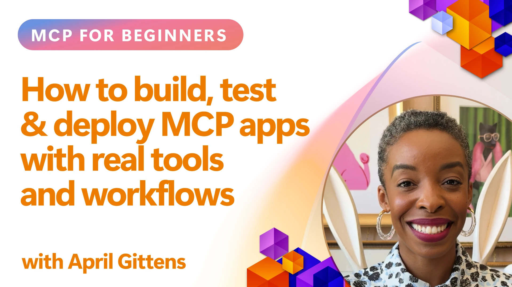

# Praktinė įgyvendinimo dalis

[](https://youtu.be/vCN9-mKBDfQ)

_(Spustelėkite paveikslėlį viršuje, norėdami peržiūrėti šios pamokos vaizdo įrašą)_

Praktinė įgyvendinimo dalis yra vieta, kur Model Context Protocol (MCP) galia tampa apčiuopiama. Nors teorijos ir architektūros supratimas apie MCP yra svarbus, tikroji vertė atsiskleidžia, kai šias sąvokas panaudojate kuriant, testuojant ir diegiant sprendimus, sprendžiančius realaus pasaulio problemas. Šis skyrius sujungia konceptualias žinias su praktiniu kūrimu, vedant jus per MCP pagrindu kuriamų programų kūrimo procesą.

Nesvarbu, ar kuriate intelektualius asistentus, integruojate dirbtinį intelektą į verslo darbo eigas, ar kuriate individualius duomenų apdorojimo įrankius, MCP suteikia lankstų pagrindą. Jo kalbų nepriklausomas dizainas ir oficialūs SDK populiarioms programavimo kalboms leidžia platų spektrą kūrėjų pasiekti. Naudodami šiuos SDK, galite greitai kurti prototipus, tobulinti ir skaluoti savo sprendimus įvairiose platformose ir aplinkose.

Tolimesniuose skyriuose rasite praktinių pavyzdžių, pavyzdinį kodą ir diegimo strategijas, kurios demonstruoja, kaip įgyvendinti MCP C#, Java su Spring, TypeScript, JavaScript ir Python kalbomis. Taip pat sužinosite, kaip derinti ir testuoti MCP serverius, valdyti API bei diegti sprendimus į debesį naudodami Azure. Šie praktiniai ištekliai yra sukurti pagreitinti jūsų mokymąsi ir padėti užtikrintai kurti stiprias, gamybai paruoštas MCP programas.

## Apžvalga

Ši pamoka orientuota į praktinius MCP įgyvendinimo aspektus keliomis programavimo kalbomis. Išnagrinėsime, kaip naudoti MCP SDK C#, Java su Spring, TypeScript, JavaScript ir Python kalbomis kuriant patikimas programas, derinant ir testuojant MCP serverius bei kuriant pakartotinai panaudojamus išteklius, užklausas ir įrankius.

## Mokymosi tikslai

Pamokos pabaigoje galėsite:

- Įgyvendinti MCP sprendimus naudodami oficialius SDK įvairiomis programavimo kalbomis
- Sistemingai derinti ir testuoti MCP serverius
- Kurti ir naudoti serverio funkcijas (ištekliai, užklausos ir įrankiai)
- Kurti veiksmingas MCP darbo eigas sudėtingoms užduotims
- Optimizuoti MCP įgyvendinimus našumui ir patikimumui užtikrinti

## Oficialūs SDK ištekliai

Model Context Protocol siūlo oficialius SDK kelioms kalboms (atitinka [MCP specifikaciją 2025-11-25](https://spec.modelcontextprotocol.io/specification/2025-11-25/)):

- [C# SDK](https://github.com/modelcontextprotocol/csharp-sdk)
- [Java su Spring SDK](https://github.com/modelcontextprotocol/java-sdk) **Pastaba:** reikalauja priklausomybės nuo [Project Reactor](https://projectreactor.io). (Žr. [diskusiją #246](https://github.com/orgs/modelcontextprotocol/discussions/246).)
- [TypeScript SDK](https://github.com/modelcontextprotocol/typescript-sdk)
- [Python SDK](https://github.com/modelcontextprotocol/python-sdk)
- [Kotlin SDK](https://github.com/modelcontextprotocol/kotlin-sdk)
- [Go SDK](https://github.com/modelcontextprotocol/go-sdk)

## Darbas su MCP SDK

Šiame skyriuje pateikiami praktiniai pavyzdžiai, kaip įgyvendinti MCP keliomis programavimo kalbomis. Pavyzdinį kodą rasite `samples` kataloge, suskirstytą pagal kalbą.

### Galimi pavyzdžiai

Sąraše yra [pavyzdiniai įgyvendinimai](../../../04-PracticalImplementation/samples) šia kalbomis:

- [C#](./samples/csharp/README.md)
- [Java su Spring](./samples/java/containerapp/README.md)
- [TypeScript](./samples/typescript/README.md)
- [JavaScript](./samples/javascript/README.md)
- [Python](./samples/python/README.md)

Kiekvienas pavyzdys demonstruoja pagrindines MCP sąvokas ir įgyvendinimo modelius konkrečioje kalboje ir ekosistemoje.

### Praktinės gairės

Papildomos gairės praktiniam MCP įgyvendinimui:

- [Puslapiavimas ir didelės rezultatų rinkiniai](./pagination/README.md) - tvarkykite įrankių, išteklių ir didelių duomenų rinkinių puslapiavimą pagal žymeklius

## Pagrindinės serverio funkcijos

MCP serveriai gali įgyvendinti bet kurį iš šių funkcijų derinį:

### Ištekliai

Ištekliai suteikia kontekstą ir duomenis vartotojui arba DI modeliui:

- Dokumentų saugyklos
- Žinių bazės
- Struktūruotų duomenų šaltiniai
- Failų sistemos

### Užklausos

Užklausos yra šabloniniai pranešimai ir darbo eigos vartotojams:

- Iš anksto apibrėžti pokalbių šablonai
- Vadovaujami sąveikos modeliai
- Specializuotos dialogo struktūros

### Įrankiai

Įrankiai yra funkcijos, kurias DI modelis gali vykdyti:

- Duomenų apdorojimo įrankiai
- Išorinės API integracijos
- Skaičiavimo funkcijos
- Paieškos funkcionalumas

## Pavyzdiniai įgyvendinimai: C# įgyvendinimas

Oficiali C# SDK saugykla turi kelis pavyzdinius įgyvendinimus, demonstruojančius įvairius MCP aspektus:

- **Paprastas MCP klientas**: paprastas pavyzdys, kaip sukurti MCP klientą ir iškviesti įrankius
- **Paprastas MCP serveris**: minimalus serverio įgyvendinimas su pagrindine įrankių registracija
- **Išplėstinis MCP serveris**: pilnai funkcionalus serveris su įrankių registracija, autentifikacija ir klaidų valdymu
- **ASP.NET integracija**: pavyzdžiai, demonstruojantys integraciją su ASP.NET Core
- **Įrankių įgyvendinimo modeliai**: įvairūs modeliai įrankiams įgyvendinti su skirtingu sudėtingumo lygiu

MCP C# SDK yra peržiūros stadijoje, API gali kisti. Šis tinklaraštis bus nuolat atnaujinamas su SDK vystymu.

### Pagrindinės funkcijos

- [C# MCP Nuget ModelContextProtocol](https://www.nuget.org/packages/ModelContextProtocol)
- Statykite savo [pirmą MCP serverį](https://devblogs.microsoft.com/dotnet/build-a-model-context-protocol-mcp-server-in-csharp/)

Norėdami gauti pilnus C# įgyvendinimo pavyzdžius, apsilankykite [oficialioje C# SDK pavyzdžių saugykloje](https://github.com/modelcontextprotocol/csharp-sdk)

## Pavyzdinis įgyvendinimas: Java su Spring įgyvendinimas

Java su Spring SDK siūlo tvirtas MCP įgyvendinimo galimybes su įmoninio lygio funkcijomis.

### Pagrindinės funkcijos

- Spring Framework integracija
- Stipri tipų sauga
- Reaktyvios programavimo palaikymas
- Išsamus klaidų valdymas

Pilnam Java su Spring įgyvendinimo pavyzdžiui žr. [Java su Spring pavyzdį](samples/java/containerapp/README.md) pavyzdžių kataloge.

## Pavyzdinis įgyvendinimas: JavaScript įgyvendinimas

JavaScript SDK suteikia lengvą ir lankstų požiūrį į MCP įgyvendinimą.

### Pagrindinės funkcijos

- Node.js ir naršyklės palaikymas
- API pagrįsta pažadais (Promise)
- Lengva integracija su Express ir kitais karkasais
- WebSocket palaikymas srautui

Pilnam JavaScript įgyvendinimo pavyzdžiui žr. [JavaScript pavyzdį](samples/javascript/README.md) pavyzdžių kataloge.

## Pavyzdinis įgyvendinimas: Python įgyvendinimas

Python SDK siūlo python-išką požiūrį į MCP įgyvendinimą su puikiomis ML karkasų integracijomis.

### Pagrindinės funkcijos

- Async/await palaikymas su asyncio
- FastAPI integracija
- Paprasta įrankių registracija
- Natūrali integracija su populiariomis ML bibliotekomis

Pilnam Python įgyvendinimo pavyzdžiui žr. [Python pavyzdį](samples/python/README.md) pavyzdžių kataloge.

## API valdymas

Azure API Management yra puikus sprendimas, kaip apsaugoti MCP serverius. Idėja – įdėti Azure API Management instanciją prieš savo MCP serverį, kuri jis tvarkytų funkcijas, kurias greičiausiai norėsite, pvz.:

- greičio ribojimas
- raktų valdymas
- stebėjimas
- apkrovos balansavimas
- saugumas

### Azure pavyzdys

Štai Azure pavyzdys, darantis būtent tai, t.y. [kuriantis MCP serverį ir apsaugantis jį Azure API Management](https://github.com/Azure-Samples/remote-mcp-apim-functions-python).

Žr., kaip patvirtinimo srautas vyksta paveikslėlyje žemiau:


Paveikslėlyje vyksta:

- Autentifikacija/Autorizacija naudojant Microsoft Entra.
- Azure API Management veikia kaip vartai ir naudoja taisykles, kad nukreiptų ir valdytų srautą.
- Azure Monitor fiksuoja visus užklausimus tolesnei analizei.

#### Autorizacijos srautas

Pažvelkime į autorizacijos srautą išsamiau:


#### MCP autorizacijos specifikacija

Sužinokite daugiau apie [MCP autorizacijos specifikaciją](https://spec.modelcontextprotocol.io/specification/2025-11-25/basic/authorization/)

## Nuotolinio MCP serverio diegimas į Azure

Pažiūrėkime, ar galime įdiegti ankstesnį pavyzdį:

1. Nuklonuokite repozitoriją

    ```bash
    git clone https://github.com/Azure-Samples/remote-mcp-apim-functions-python.git
    cd remote-mcp-apim-functions-python
    ```

1. Užregistruokite `Microsoft.App` išteklių tiekėją.

   - Jei naudojate Azure CLI, paleiskite `az provider register --namespace Microsoft.App --wait`.
   - Jei naudojate Azure PowerShell, paleiskite `Register-AzResourceProvider -ProviderNamespace Microsoft.App`. Po kurio laiko patikrinkite `(Get-AzResourceProvider -ProviderNamespace Microsoft.App).RegistrationState`, ar registracija baigta.

1. Paleiskite šią [azd](https://aka.ms/azd) komandą, kad suteiktumėte api valdymo paslaugą, funkcijų programą (su kodu) ir visus kitus būtinus Azure išteklius

    ```shell
    azd up
    ```

    Ši komanda turėtų įdiegti visus debesies išteklius Azure

### Jūsų serverio testavimas su MCP Inspector

1. Naujoje terminalo lange įdiekite ir paleiskite MCP Inspector

    ```shell
    npx @modelcontextprotocol/inspector
    ```

    Turėtumėte matyti panašią sąsają:

    

1. Paspauskite CTRL ir spustelėkite, kad įkeltumėte MCP Inspector žiniatinklio programą iš programos rodomo URL (pvz., [http://127.0.0.1:6274/#resources](http://127.0.0.1:6274/#resources))
1. Nustatykite transporto tipą į `SSE`
1. Nustatykite URL į veikiantį API Management SSE įgalintą galinį tašką, rodytą po `azd up` ir **Prijunkite**:

    ```shell
    https://<apim-servicename-from-azd-output>.azure-api.net/mcp/sse
    ```

1. **Rodyti įrankius**. Spustelėkite įrankį ir **Paleiskite įrankį**.

Jei visi žingsniai pavyko, dabar turėtumėte būti prijungti prie MCP serverio ir galėjote kviesti įrankį.

## MCP serveriai Azure aplinkoje

[Remote-mcp-functions](https://github.com/Azure-Samples/remote-mcp-functions-dotnet): Šis repozitorijų rinkinys yra greito paleidimo šablonas, skirtas kurti ir diegti pasirinktinius nuotolinius MCP (Model Context Protocol) serverius naudojant Azure Functions su Python, C# .NET arba Node/TypeScript.

Pavyzdžiai suteikia pilną sprendimą, leidžiantį kūrėjams:

- Kurti ir paleisti vietoje: kurti ir derinti MCP serverį vietinėje mašinoje
- Diegti Azure: lengvai diegti debesyje su paprasta `azd up` komanda
- Prisijungti iš klientų: prisijungti prie MCP serverio iš įvairių klientų, įskaitant VS Code Copilot agento režimą ir MCP Inspector įrankį

### Pagrindinės funkcijos

- Saugumas pagal dizainą: MCP serveris apsaugotas naudojant raktus ir HTTPS
- Autentifikacijos pasirinkimai: palaiko OAuth naudojant įmontuotą autentifikaciją ir/arba API Management
- Tinklo izoliacija: leidžia naudoti tinklo izoliaciją naudojant Azure Virtual Networks (VNET)
- Serverless architektūra: naudoja Azure Functions skalabiliam, įvykių valdomam vykdymui
- Vietinis kūrimas: išsamus vietinio kūrimo ir derinimo palaikymas
- Paprastas diegimas: supaprastintas diegimo procesas į Azure

Repozitorius apima visus reikalingus konfigūracijos failus, šaltinio kodą ir infrastruktūros apibrėžimus, kad greitai pradėtumėte gamybai paruoštą MCP serverio įgyvendinimą.

- [Azure Remote MCP Functions Python](https://github.com/Azure-Samples/remote-mcp-functions-python) - MCP įgyvendinimo pavyzdys naudojant Azure Functions su Python

- [Azure Remote MCP Functions .NET](https://github.com/Azure-Samples/remote-mcp-functions-dotnet) - MCP įgyvendinimo pavyzdys naudojant Azure Functions su C# .NET

- [Azure Remote MCP Functions Node/Typescript](https://github.com/Azure-Samples/remote-mcp-functions-typescript) - MCP įgyvendinimo pavyzdys naudojant Azure Functions su Node/TypeScript.

## Pagrindinės įžvalgos

- MCP SDK suteikia kalbai specifinius įrankius patikimiems MCP sprendimams įgyvendinti
- Derinimo ir testavimo procesas yra kritiškai svarbus patikimoms MCP programoms
- Pakartotinai naudojami užklausų šablonai užtikrina nuoseklias DI sąveikas
- Gerai suprojektuotos darbo eigos gali koordinuoti sudėtingas užduotis, naudojant daug įrankių
- MCP sprendimų įgyvendinimas reikalauja saugumo, našumo ir klaidų valdymo aspektų įvertinimo

## Užduotis

Sukurkite praktišką MCP darbo eigą, sprendžiančią realaus pasaulio problemą jūsų srityje:

1. Identifikuokite 3-4 įrankius, kurie būtų naudingi sprendžiant šią problemą
2. Sukurkite darbo eigos diagramą, rodant, kaip šie įrankiai sąveikauja
3. Įgyvendinkite pagrindinę vieno iš įrankių versiją pasirinkta kalba
4. Sukurkite užklausos šabloną, kuris padėtų modeliui efektyviai naudoti jūsų įrankį

## Papildomi ištekliai

---

## Kas toliau

Toliau: [Išplėstiniai dalykai](../05-AdvancedTopics/README.md)

---

<!-- CO-OP TRANSLATOR DISCLAIMER START -->
**Atsakomybės apribojimas**:
Šis dokumentas buvo išverstas naudojant dirbtinio intelekto vertimo paslaugą [Co-op Translator](https://github.com/Azure/co-op-translator). Nors siekiame tikslumo, prašome atkreipti dėmesį, kad automatiniai vertimai gali turėti klaidų ar netikslumų. Originalus dokumentas gimtąja kalba laikomas autoritetingu šaltiniu. Kritinei informacijai rekomenduojama naudoti profesionalų žmogaus vertimą. Mes neatsakome už jokius nesusipratimus ar klaidingas interpretacijas, kylančias dėl šio vertimo naudojimo.
<!-- CO-OP TRANSLATOR DISCLAIMER END -->