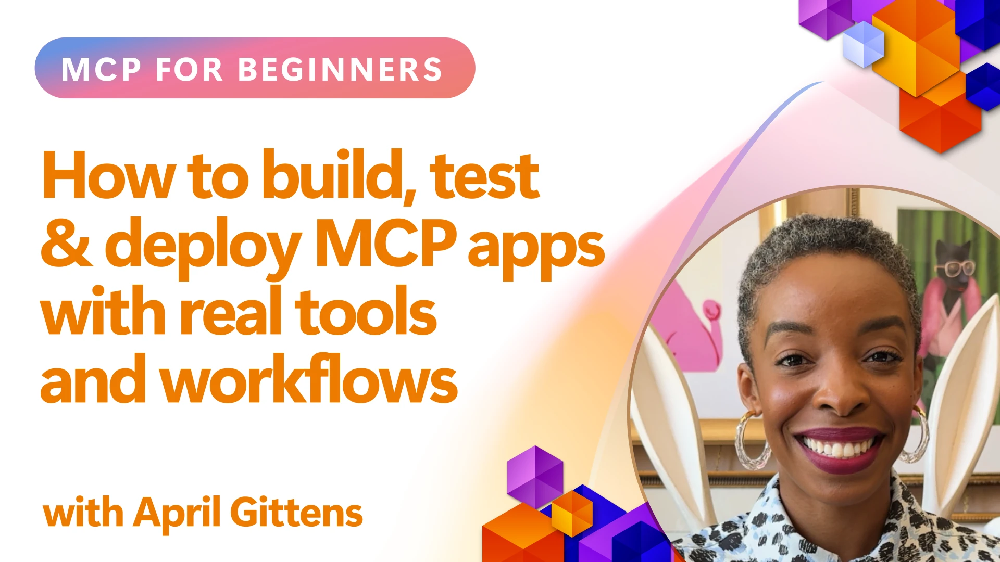

# Praktinė įgyvendinimas

[](https://youtu.be/vCN9-mKBDfQ)

_(Spustelėkite aukščiau esančią nuotrauką, norėdami peržiūrėti šios pamokos vaizdo įrašą)_

Praktinė įgyvendinimas suteikia Model Context Protocol (MCP) galios apčiuopiamumą. Nors svarbu suprasti MCP teoriją ir architektūrą, tikroji vertė atsiskleidžia, kai taikote šiuos konceptus kuriant, testuojant ir diegiant sprendimus, kurie sprendžia realaus pasaulio problemas. Šis skyrius užpildo spragą tarp konceptinių žinių ir praktinio kūrimo, vadovaudamas jus per procesą, kaip įgyvendinti MCP pagrindu veikiančias programėles.

Nesvarbu, ar vystote intelektualius asistentus, diegiate AI į verslo darbo eigas, ar kuriate individualius įrankius duomenų apdorojimui, MCP suteikia lankstų pagrindą. Jo kalbai nepriklausomas dizainas ir oficialūs SDK populiarioms programavimo kalboms leidžia jį pasiekti daugeliui kūrėjų. Naudodamiesi šiais SDK galite greitai prototipuoti, tobulinti ir skalinti savo sprendimus įvairioms platformoms ir aplinkoms.

Tolimesniuose skyriuose rasite praktinius pavyzdžius, pavyzdinį kodą ir diegimo strategijas, kurios demonstruoja, kaip įgyvendinti MCP naudojant C#, Java su Spring, TypeScript, JavaScript ir Python. Taip pat išmoksite, kaip derinti ir testuoti savo MCP serverius, valdyti API ir diegti sprendimus debesyje naudojant Azure. Šios praktinės medžiagos sukurtos tam, kad pagreitintų jūsų mokymąsi ir padėtų užtikrintai kurti tvirtas, gamybai paruoštas MCP programėles.

## Apžvalga

Ši pamoka koncentruojasi į praktiškus MCP įgyvendinimo aspektus keliose programavimo kalbose. Apžvelgsime, kaip naudoti MCP SDK C#, Java su Spring, TypeScript, JavaScript ir Python kalbose, kad sukurtumėte tvirtas programas, derintumėte ir testuotumėte MCP serverius bei kurtumėte pakartotinai naudojamus išteklius, užklausas ir įrankius.

## Mokymosi tikslai

Pasibaigus šiai pamokai, mokėsite:

- Įgyvendinti MCP sprendimus naudodami oficialius SDK įvairiose programavimo kalbose
- Sistemingai derinti ir testuoti MCP serverius
- Kurti ir naudoti serverio funkcijas (Ištekliai, Užklausos ir Įrankiai)
- Kurti efektyvias MCP darbo eigas sudėtingoms užduotims
- Optimizuoti MCP įgyvendinimus našumui ir patikimumui

## Oficialūs SDK ištekliai

Model Context Protocol siūlo oficialius SDK kelioms kalboms. SDK
palaikymas MCP `2026-07-28` versijai diegiamas nepriklausomai, todėl patikrinkite kiekvieno SDK
pakeitimų pastabas ir pavyzdžio paketo versiją prieš naudodami protokolo
suderinamumą. Žr. [oficialių SDK sąrašą](https://modelcontextprotocol.io/docs/sdk):

- [C# SDK](https://github.com/modelcontextprotocol/csharp-sdk)
- [Java su Spring SDK](https://github.com/modelcontextprotocol/java-sdk) **Pastaba:** reikalauja priklausomybės nuo [Project Reactor](https://projectreactor.io). (Žr. [diskusijos klausimą 246](https://github.com/orgs/modelcontextprotocol/discussions/246).)
- [TypeScript SDK](https://github.com/modelcontextprotocol/typescript-sdk)
- [Python SDK](https://github.com/modelcontextprotocol/python-sdk)
- [Kotlin SDK](https://github.com/modelcontextprotocol/kotlin-sdk)
- [Go SDK](https://github.com/modelcontextprotocol/go-sdk)

## Darbas su MCP SDK

Šiame skyriuje pateikiami praktiniai MCP įgyvendinimo pavyzdžiai keliose programavimo kalbose. Pavyzdinį kodą rasite `samples` kataloge, suskirstytą pagal kalbas.

### Galimi pavyzdžiai

Repozitorijoje yra [pavyzdiniai įgyvendinimai](../../../04-PracticalImplementation/samples) šiose kalbose:

- [C#](./samples/csharp/README.md)
- [Java su Spring](./samples/java/containerapp/README.md)
- [TypeScript](./samples/typescript/README.md)
- [JavaScript](./samples/javascript/README.md)
- [Python](./samples/python/README.md)

Kiekvienas pavyzdys demonstruoja pagrindinius MCP konceptus ir konkrečios kalbos bei ekosistemos įgyvendinimo šablonus.

### Praktiniai vadovai

Papildomi vadovai praktiniam MCP įgyvendinimui:

- [Paginacija ir didelės rezultatų aibės](./pagination/README.md) - Tvarkykite žymos pagrindu (cursor) esančią paginaciją įrankiams, ištekliams ir didelėms duomenų aibėms

## Pagrindinės serverio funkcijos

MCP serveriai gali įgyvendinti bet kokį šių funkcijų derinį:

### Ištekliai

Ištekliai suteikia kontekstą ir duomenis naudotojui arba AI modeliui naudoti:

- Dokumentų saugyklos
- Žinių bazės
- Strukturizuoti duomenų šaltiniai
- Failų sistemos

### Užklausos

Užklausos yra šabloniniai pranešimai ir darbo eigos vartotojams:

- Iš anksto apibrėžti pokalbių šablonai
- Vairuojamos sąveikos modeliai
- Specializuotos dialogo struktūros

### Įrankiai

Įrankiai yra funkcijos, kurias AI modelis atlieka:

- Duomenų apdorojimo įrankiai
- Išorinės API integracijos
- Skaičiavimo galimybės
- Paieškos funkcionalumas

## Pavyzdiniai įgyvendinimai: C# įgyvendinimas

Oficialaus C# SDK repozitorijuje yra keletas pavyzdinių įgyvendinimų, demonstruojančių įvairius MCP aspektus:

- **Paprastas MCP klientas**: paprastas pavyzdys, kaip sukurti MCP klientą ir kviesti įrankius
- **Paprastas MCP serveris**: minimalus serverio įgyvendinimas su pagrindine įrankių registracija
- **Išplėstinis MCP serveris**: pilnai funkcionali serverio versija su įrankių registracija, autentifikacija ir klaidų valdymu
- **ASP.NET integracija**: pavyzdžiai, demonstravę integraciją su ASP.NET Core
- **Įrankių įgyvendinimo šablonai**: įvairūs įrankių įgyvendinimo šablonai, skirtingo sudėtingumo lygmenyse

MCP C# SDK yra peržiūros stadijoje, API gali keistis. Šis tinklaraštis bus nuolat atnaujinamas, kol SDK vystysis.

### Pagrindinės funkcijos

- [C# MCP Nuget ModelContextProtocol](https://www.nuget.org/packages/ModelContextProtocol)
- Kuriant savo [pirmą MCP serverį](https://devblogs.microsoft.com/dotnet/build-a-model-context-protocol-mcp-server-in-csharp/).

Pilnus C# įgyvendinamo pavyzdžius rasite [oficialiame C# SDK pavyzdžių repozitorijuje](https://github.com/modelcontextprotocol/csharp-sdk)

## Pavyzdinis įgyvendinimas: Java su Spring įgyvendinimas

Java su Spring SDK siūlo tvirtas MCP įgyvendinimo galimybes su įmonių klasės funkcijomis.

### Pagrindinės funkcijos

- Spring Framework integracija
- Stipri tipo sauga
- Reaktyvaus programavimo palaikymas
- Išsamus klaidų valdymas

Pilną Java su Spring įgyvendinimo pavyzdį rasite [Java su Spring pavyzdyje](samples/java/containerapp/README.md) samples kataloge.

## Pavyzdinis įgyvendinimas: JavaScript įgyvendinimas

JavaScript SDK suteikia lengvą ir lankstų MCP įgyvendinimo būdą.

### Pagrindinės funkcijos

- Node.js ir naršyklės palaikymas
- API, pagrįstas pažadais (Promise)
- Lengva integracija su Express ir kitais karkasais
- WebSocket palaikymas transliacijoms

Pilną JavaScript įgyvendinimo pavyzdį rasite [JavaScript pavyzdyje](samples/javascript/README.md) samples kataloge.

## Pavyzdinis įgyvendinimas: Python įgyvendinimas

Python SDK suteikia pythonistišką MCP įgyvendinimo būdą su puikiomis ML karkasų integracijomis.

### Pagrindinės funkcijos

- Async/await palaikymas su asyncio
- FastAPI integracija``
- Paprasta įrankių registracija
- Gimtasis palaikymas populiarioms ML bibliotekoms

Pilną Python įgyvendinimo pavyzdį rasite [Python pavyzdyje](samples/python/README.md) samples kataloge.

## API valdymas

Azure API valdymas yra puikus būdas apsaugoti MCP serverius. Idėja yra statyti Azure API valdymo instanciją prieš savo MCP serverį ir leisti jai valdyti funkcijas, kurias norėsite, tokias kaip:

- greičio ribojimas
- žetonų valdymas
- stebėjimas
- apkrovos balansas
- saugumas

### Azure pavyzdys

Čia yra Azure pavyzdys, atliekantis būtent tai, t.y. [kuria MCP serverį ir apsaugo jį su Azure API valdymu](https://github.com/Azure-Samples/remote-mcp-apim-functions-python).

Žr. kaip įvyksta autorizacijos srautas žemiau pateiktoje nuotraukoje:


Ankstesniame vaizde vyksta:

- Autentifikacija/Autorizacija vykdoma naudojant Microsoft Entra.
- Azure API valdymas veikia kaip vartai ir naudoja politiką nukreipti ir valdyti srautą.
- Azure Monitor registruoja visus užklausimus tolimesnei analizei.

#### Autorizacijos srautas

Pažiūrėkime autorizacijos srautą detaliau:


#### MCP autorizacijos specifikacija

Sužinokite daugiau apie
[MCP autorizacijos specifikaciją](https://modelcontextprotocol.io/specification/2026-07-28/basic/authorization/).

## Diegimas nuotoliniam MCP serveriui Azure

Pažiūrėkime, ar galime diegti anksčiau minėtą pavyzdį:

1. Nuklonuokite repozitoriją

    ```bash
    git clone https://github.com/Azure-Samples/remote-mcp-apim-functions-python.git
    cd remote-mcp-apim-functions-python
    ```

1. Užregistruokite `Microsoft.App` išteklių tiekėją.

   - Jei naudojate Azure CLI, paleiskite `az provider register --namespace Microsoft.App --wait`.
   - Jei naudojate Azure PowerShell, paleiskite `Register-AzResourceProvider -ProviderNamespace Microsoft.App`. Po kurio laiko patikrinkite `(Get-AzResourceProvider -ProviderNamespace Microsoft.App).RegistrationState`, kad sužinotumėte registracijos būseną.

1. Paleiskite šią [azd](https://aka.ms/azd) komandą, kad paruoštumėte API valdymo paslaugą, funkcijų programą (su kodu) ir visus kitus reikalingus Azure išteklius

    ```shell
    azd up
    ```

    Ši komanda turėtų įdiegti visus debesijos išteklius Azure aplinkoje

### Testavimas naudojant MCP Inspector

1. Naujoje terminalo lange įdiekite ir paleiskite MCP Inspector

    ```shell
    npx @modelcontextprotocol/inspector
    ```

    Turėtumėte matyti panašią sąsają:

    

1. CTRL spustelėjimu atidarykite MCP Inspector žiniatinklio programą pagal programos rodomą URL (pvz., [http://127.0.0.1:6274/#resources](http://127.0.0.1:6274/#resources))
1. Nustatykite transporto tipą į `SSE`
1. Nustatykite URL į jūsų veikiančio API valdymo SSE pabaigos tašką po `azd up` ir pasirinkite **Connect**:

    ```shell
    https://<apim-servicename-from-azd-output>.azure-api.net/mcp/sse
    ```

1. **Įrankių sąrašas**. Spustelėkite įrankį ir **Paleiskite įrankį**.

Jei visi žingsniai pavyko, dabar esate prisijungę prie MCP serverio ir galite kvieti įrankius.

## MCP serveriai Azure platformai

[Remote-mcp-functions](https://github.com/Azure-Samples/remote-mcp-functions-dotnet): Ši repozitorijų suvestinė yra greito pradžios šablonas kuriant ir diegiant pasirinktinius nuotolinius MCP (Model Context Protocol) serverius naudojant Azure Functions su Python, C# .NET arba Node/TypeScript.

Šie pavyzdžiai siūlo pilną sprendimą, leidžiantį kūrėjams:

- Kurti ir paleisti vietoje: Vystyti ir derinti MCP serverį vietiniame kompiuteryje
- Diegti į Azure: Lengvai įdiegti debesyje naudojant paprastą azd up komandą
- Prisijungti iš klientų: Prisijungti prie MCP serverio iš įvairių klientų, įskaitant VS Code Copilot agento režimą ir MCP Inspector įrankį

### Pagrindinės funkcijos

- Saugumas pagal dizainą: MCP serveris apsaugotas raktų ir HTTPS
- Autentifikacijos galimybės: Palaiko OAuth naudodamas įmontuotą autentifikaciją ir/ar API valdymą
- Tinklų izoliacija: Leidžia tinklų izoliaciją naudojant Azure Virtual Networks (VNET)
- Be serverio architektūra: Naudoja Azure Functions masteliui ir įvykių pagrindu vykdymui
- Vietinis vystymas: Pilnas vietinio kūrimo ir derinimo palaikymas
- Paprastas diegimas: Supaprastintas diegimo procesas į Azure

Repozitorijuje yra visi reikalingi konfigūracijos failai, šaltinio kodas ir infrastruktūros aprašymai greitam pradėjimui su gamybai paruoštu MCP serverio įgyvendinimu.

- [Azure Remote MCP Functions Python](https://github.com/Azure-Samples/remote-mcp-functions-python) - MCP pavyzdys naudojant Azure Functions su Python

- [Azure Remote MCP Functions .NET](https://github.com/Azure-Samples/remote-mcp-functions-dotnet) - MCP pavyzdys naudojant Azure Functions su C# .NET

- [Azure Remote MCP Functions Node/Typescript](https://github.com/Azure-Samples/remote-mcp-functions-typescript) - MCP pavyzdys naudojant Azure Functions su Node/TypeScript.

## Pagrindinės išvados

- MCP SDK suteikia kalbai specifinius įrankius stipriems MCP sprendimams įgyvendinti
- Derinimo ir testavimo procesas yra kritiškai svarbus patikimoms MCP programėlėms
- Pakartotinai naudojami užklausų šablonai leidžia užtikrinti nuoseklias AI sąveikas
- Gerai suprojektuotos darbo eigos gali koordinuoti sudėtingas užduotis, naudojant kelis įrankius
- MCP sprendimų įgyvendinimas reikalauja saugumo, našumo ir klaidų valdymo apsvarstymo

## Užduotis

Sukurkite praktišką MCP darbo eigą, sprendžiančią realaus pasaulio problemą jūsų srityje:

1. Identifikuokite 3-4 įrankius, kurie būtų naudingi sprendžiant šią problemą
2. Sukurkite darbo eigos diagramą, rodanti, kaip šie įrankiai sąveikauja
3. Įgyvendinkite vieno iš įrankių pradinę versiją savo pageidaujama kalba
4. Sukurkite užklausos šabloną, kuris padėtų modeliui efektyviai naudoti jūsų įrankį

## Papildomi ištekliai

---

## Kas toliau

Toliau: [Išplėstiniai dalykai](../05-AdvancedTopics/README.md)

---

<!-- CO-OP TRANSLATOR DISCLAIMER START -->
**Atsakomybės apribojimas**:
Šis dokumentas buvo išverstas naudojant dirbtinio intelekto vertimo paslaugą [Co-op Translator](https://github.com/Azure/co-op-translator). Nors siekiame tikslumo, prašome atkreipti dėmesį, kad automatiniai vertimai gali turėti klaidų ar netikslumų. Originalus dokumentas jo gimtąja kalba laikomas autoritetingu šaltiniu. Svarbiai informacijai rekomenduojama naudoti profesionalų žmogiškąjį vertimą. Mes neatsakome už jokius nesusipratimus ar neteisingą interpretaciją, kilusią naudojantis šiuo vertimu.
<!-- CO-OP TRANSLATOR DISCLAIMER END -->