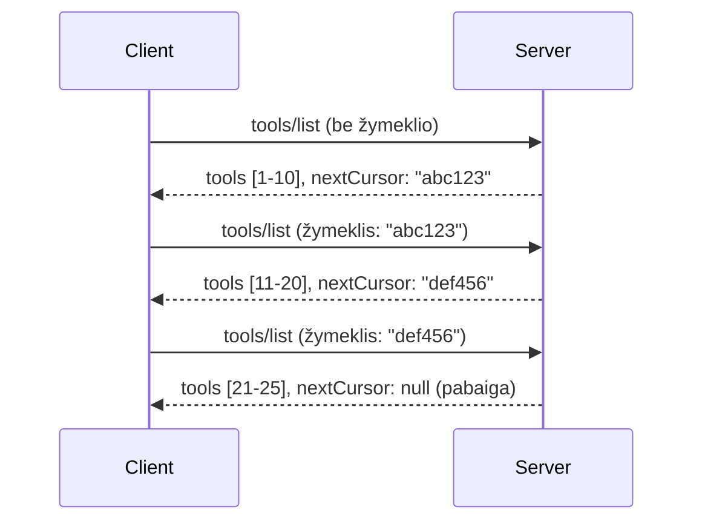

# Puslapiavimas ir dideli rezultatų rinkiniai MCP

Kai jūsų MCP serveris tvarko didelius duomenų rinkinius – nesvarbu, ar rodo tūkstančius failų, duomenų bazės įrašų, ar paieškos rezultatus – jums reikia puslapiavimo, kad efektyviai valdytumėte atmintį ir užtikrintumėte greitą naudotojo patirtį. Šiame vadove aprašoma, kaip įgyvendinti ir naudoti puslapiavimą MCP.

## Kodėl puslapiavimas svarbus

Be puslapiavimo didelės apimties atsakymai gali sukelti:

- **Atminties išsekimą** – vienu metu užkraunant milijonus įrašų
- **Lėtą atsako laiką** – vartotojai laukia, kol visi duomenys bus įkelti
- **Timeout klaidas** – užklausos viršija laiko limitus
- **Prastą DI našumą** – LLM modeliai sunkiai tvarkosi su milžinišku kontekstu

MCP naudoja **kursorių pagrįstą puslapiavimą**, kad patikimai ir nuosekliai būtų galima naršyti per rezultatų rinkinius.

---

## Kaip veikia MCP puslapiavimas

### Kurso sąvoka

**Kursoris** yra nepermatomas tekstinis ženklas, pažymintis jūsų vietą rezultatų rinkinyje. Įsivaizduokite tai kaip žymą knygoje.



### Puslapiavimas MCP metodais

Šie MCP metodai palaiko puslapiavimą:

| Metodas | Grąžina | Kursoriaus palaikymas |
|--------|---------|----------------------|
| `tools/list` | Įrankių aprašymai | ✅ |
| `resources/list` | Ištekliai aprašymai | ✅ |
| `prompts/list` | Užklausų aprašymai | ✅ |
| `resources/templates/list` | Išteklių šablonai | ✅ |

---

## Serverio įgyvendinimas

### Python (FastMCP)

```python
from mcp.server import Server
from mcp.types import Tool, ListToolsResult
import math

app = Server("paginated-server")

# Simuliuoti dideli duomenų rinkiniai
ALL_TOOLS = [
    Tool(name=f"tool_{i}", description=f"Tool number {i}", inputSchema={})
    for i in range(100)
]

PAGE_SIZE = 10

@app.list_tools()
async def list_tools(cursor: str | None = None) -> ListToolsResult:
    """List tools with pagination support."""
    
    # Dekoduoti žymeklį norint gauti pradinį indeksą
    start_index = 0
    if cursor:
        try:
            start_index = int(cursor)
        except ValueError:
            start_index = 0
    
    # Gauti rezultatų puslapį
    end_index = min(start_index + PAGE_SIZE, len(ALL_TOOLS))
    page_tools = ALL_TOOLS[start_index:end_index]
    
    # Apskaičiuoti kitą žymeklį
    next_cursor = None
    if end_index < len(ALL_TOOLS):
        next_cursor = str(end_index)
    
    return ListToolsResult(
        tools=page_tools,
        nextCursor=next_cursor
    )
```

### TypeScript

```typescript
import { Server } from "@modelcontextprotocol/sdk/server/index.js";
import { ListToolsResultSchema } from "@modelcontextprotocol/sdk/types.js";

const server = new Server({
  name: "paginated-server",
  version: "1.0.0"
});

// Simuliuotas didelis duomenų rinkinys
const ALL_TOOLS = Array.from({ length: 100 }, (_, i) => ({
  name: `tool_${i}`,
  description: `Tool number ${i}`,
  inputSchema: { type: "object", properties: {} }
}));

const PAGE_SIZE = 10;

server.setRequestHandler(ListToolsResultSchema, async (request) => {
  // Iššifruoti žymeklį
  let startIndex = 0;
  if (request.params?.cursor) {
    startIndex = parseInt(request.params.cursor, 10) || 0;
  }
  
  // Gauti rezultatų puslapį
  const endIndex = Math.min(startIndex + PAGE_SIZE, ALL_TOOLS.length);
  const pageTools = ALL_TOOLS.slice(startIndex, endIndex);
  
  // Apskaičiuoti kitą žymeklį
  const nextCursor = endIndex < ALL_TOOLS.length ? String(endIndex) : undefined;
  
  return {
    tools: pageTools,
    nextCursor
  };
});
```

### Java (Spring MCP)

```java
@Service
public class PaginatedToolService {
    
    private static final int PAGE_SIZE = 10;
    private final List<Tool> allTools;
    
    public PaginatedToolService() {
        // Inicializuoti didelį duomenų rinkinį
        this.allTools = IntStream.range(0, 100)
            .mapToObj(i -> new Tool("tool_" + i, "Tool number " + i, Map.of()))
            .collect(Collectors.toList());
    }
    
    @McpMethod("tools/list")
    public ListToolsResult listTools(@Param("cursor") String cursor) {
        // Iššifruoti žymeklį
        int startIndex = 0;
        if (cursor != null && !cursor.isEmpty()) {
            try {
                startIndex = Integer.parseInt(cursor);
            } catch (NumberFormatException e) {
                startIndex = 0;
            }
        }
        
        // Gauti rezultatų puslapį
        int endIndex = Math.min(startIndex + PAGE_SIZE, allTools.size());
        List<Tool> pageTools = allTools.subList(startIndex, endIndex);
        
        // Apskaičiuoti kitą žymeklį
        String nextCursor = endIndex < allTools.size() ? String.valueOf(endIndex) : null;
        
        return new ListToolsResult(pageTools, nextCursor);
    }
}
```

---

## Kliento įgyvendinimas

### Python klientas

```python
from mcp import ClientSession

async def get_all_tools(session: ClientSession) -> list:
    """Fetch all tools using pagination."""
    all_tools = []
    cursor = None
    
    while True:
        result = await session.list_tools(cursor=cursor)
        all_tools.extend(result.tools)
        
        if result.nextCursor is None:
            break
        cursor = result.nextCursor
    
    return all_tools

# Naudojimas
async with client_session as session:
    tools = await get_all_tools(session)
    print(f"Found {len(tools)} tools")
```

### TypeScript klientas

```typescript
import { Client } from "@modelcontextprotocol/sdk/client/index.js";

async function getAllTools(client: Client): Promise<Tool[]> {
  const allTools: Tool[] = [];
  let cursor: string | undefined = undefined;
  
  do {
    const result = await client.listTools({ cursor });
    allTools.push(...result.tools);
    cursor = result.nextCursor;
  } while (cursor);
  
  return allTools;
}

// Naudojimas
const tools = await getAllTools(client);
console.log(`Found ${tools.length} tools`);
```

### Tingus įkėlimas

Labai dideliems duomenų rinkiniams puslapius įkelkite pagal poreikį:

```python
class PaginatedToolIterator:
    """Lazily iterate through paginated tools."""
    
    def __init__(self, session: ClientSession):
        self.session = session
        self.cursor = None
        self.buffer = []
        self.exhausted = False
    
    async def __anext__(self):
        # Grįžti iš buferio, jei yra
        if self.buffer:
            return self.buffer.pop(0)
        
        # Patikrinti, ar išnaudojome visas puslapių
        if self.exhausted:
            raise StopAsyncIteration
        
        # Gauti kitą puslapį
        result = await self.session.list_tools(cursor=self.cursor)
        self.buffer = list(result.tools)
        self.cursor = result.nextCursor
        
        if self.cursor is None:
            self.exhausted = True
        
        if not self.buffer:
            raise StopAsyncIteration
        
        return self.buffer.pop(0)
    
    def __aiter__(self):
        return self

# Naudojimo - atminties efektyvu didelėms duomenų rinkinėms
async for tool in PaginatedToolIterator(session):
    process_tool(tool)
```

---

## Puslapiavimas ištekliams

Ištekliai dažnai reikalauja puslapiavimo katalogams ar dideliems duomenų rinkiniams:

```python
from mcp.server import Server
from mcp.types import Resource, ListResourcesResult
import os

app = Server("file-server")

@app.list_resources()
async def list_resources(cursor: str | None = None) -> ListResourcesResult:
    """List files in directory with pagination."""
    
    directory = "/data/files"
    all_files = sorted(os.listdir(directory))
    
    # Dekoduoti žymeklį (failo indeksas)
    start_index = int(cursor) if cursor else 0
    page_size = 20
    end_index = min(start_index + page_size, len(all_files))
    
    # Sukurti šios puslapio išteklių sąrašą
    resources = []
    for filename in all_files[start_index:end_index]:
        filepath = os.path.join(directory, filename)
        resources.append(Resource(
            uri=f"file://{filepath}",
            name=filename,
            mimeType="application/octet-stream"
        ))
    
    # Apskaičiuoti kitą žymeklį
    next_cursor = str(end_index) if end_index < len(all_files) else None
    
    return ListResourcesResult(
        resources=resources,
        nextCursor=next_cursor
    )
```

---

## Kursoriaus dizaino strategijos

### Strategija 1: Indekso pagrindu (paprasta)

```python
# Žymeklis yra tik indeksas
cursor = "50"  # Pradėti nuo 50 elemento
```

**Privalumai:** Paprasta, be valstybės saugojimo
**Trūkumai:** Rezultatai gali keistis, jei elementai pridedami/šalinami

### Strategija 2: ID pagrindu (stabili)

```python
# Žymeklis yra paskutinis matytas ID
cursor = "item_abc123"  # Pradėti po šio elemento
```

**Privalumai:** Stabili, net jei elementai keičiasi
**Trūkumai:** Reikia tvarkingų ID

### Strategija 3: Užkoduota būsena (sudėtinga)

```python
import base64
import json

def encode_cursor(state: dict) -> str:
    return base64.b64encode(json.dumps(state).encode()).decode()

def decode_cursor(cursor: str) -> dict:
    return json.loads(base64.b64decode(cursor).decode())

# Žymeklis turi kelis būseno laukus
cursor = encode_cursor({
    "offset": 50,
    "filter": "active",
    "sort": "name"
})
```

**Privalumai:** Gali užkoduoti sudėtingą būseną
**Trūkumai:** Sudėtingesnė, ilgesni kursoriai

---

## Geriausios praktikos

### 1. Pasirinkite tinkamus puslapio dydžius

```python
# Apsvarstykite duomenų dydį
PAGE_SIZE_SMALL_ITEMS = 100   # Paprasta metaduomenys
PAGE_SIZE_MEDIUM_ITEMS = 20   # Turtingesni objektai
PAGE_SIZE_LARGE_ITEMS = 5     # Sudėtingas turinys
```

### 2. Tvarkykite netinkamus kursorius maloniai

```python
@app.list_tools()
async def list_tools(cursor: str | None = None) -> ListToolsResult:
    try:
        start_index = int(cursor) if cursor else 0
        if start_index < 0 or start_index >= len(ALL_TOOLS):
            start_index = 0  # Nustatyti į pradžią
    except (ValueError, TypeError):
        start_index = 0  # Neteisingas žymeklis, pradėti iš naujo
    # ...
```

### 3. Pateikite bendrą kiekį (neprivaloma)

```python
return ListToolsResult(
    tools=page_tools,
    nextCursor=next_cursor,
    # Kai kurios įgyvendinimo versijos apima bendrą UI progreso rodiklį
    _meta={"total": len(ALL_TOOLS)}
)
```

### 4. Testuokite kraštutines situacijas

```python
async def test_pagination():
    # Tuščias rezultatų rinkinys
    result = await session.list_tools()
    assert result.tools == []
    assert result.nextCursor is None
    
    # Vienas puslapis
    result = await session.list_tools()
    assert len(result.tools) <= PAGE_SIZE
    
    # Neteisingas žymeklis
    result = await session.list_tools(cursor="invalid")
    assert result.tools  # Turėtų grąžinti pirmą puslapį
```

---

## Dažnos klaidos

### ❌ Grąžinti visus rezultatus, o paskui puslapiuoti kliento pusėje

```python
# BLOGAI: Įkelia viską į atmintį
@app.list_tools()
async def list_tools() -> ListToolsResult:
    all_tools = load_all_tools()  # 1 milijonas įrankių!
    return ListToolsResult(tools=all_tools)
```

### ✅ Puslapiuoti prie duomenų šaltinio

```python
# GERAI: Įkelia tik tai, kas reikalinga
@app.list_tools()
async def list_tools(cursor: str | None = None) -> ListToolsResult:
    offset = int(cursor) if cursor else 0
    tools = await db.query_tools(offset=offset, limit=PAGE_SIZE)
    return ListToolsResult(tools=tools, nextCursor=...)
```

---

## Kas toliau

- [5.14 modulis - Konteksto inžinerija](../../05-AdvancedTopics/mcp-contextengineering/README.md)
- [8 modulis - Geriausios praktikos](../../08-BestPractices/README.md)
- [3.8 - MCP serverio testavimas](../../03-GettingStarted/08-testing/README.md)

---

## Papildomi resursai

- [MCP specifikacija - Puslapiavimas](https://modelcontextprotocol.io/specification/2026-07-28/)
- [Paaiškinta kursoriaus pagrindu veikiantis puslapiavimas](https://slack.engineering/evolving-api-pagination-at-slack/)
- [Python SDK puslapiavimo testai](https://github.com/modelcontextprotocol/python-sdk/blob/main/tests/client/test_list_methods_cursor.py)

---

<!-- CO-OP TRANSLATOR DISCLAIMER START -->
**Atsakomybės apribojimas**:
Šis dokumentas buvo išverstas naudojant dirbtinio intelekto vertimo paslaugą [Co-op Translator](https://github.com/Azure/co-op-translator). Nors siekiame tikslumo, prašome atkreipti dėmesį, kad automatiniai vertimai gali turėti klaidų ar netikslumų. Originalus dokumentas jo gimtąja kalba laikomas autoritetingu šaltiniu. Svarbiai informacijai rekomenduojama naudoti profesionalų žmogiškąjį vertimą. Mes neatsakome už jokius nesusipratimus ar neteisingą interpretaciją, kilusią naudojantis šiuo vertimu.
<!-- CO-OP TRANSLATOR DISCLAIMER END -->