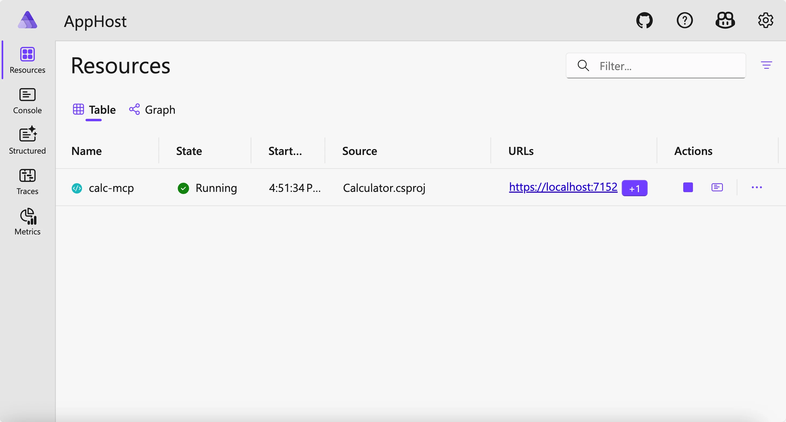
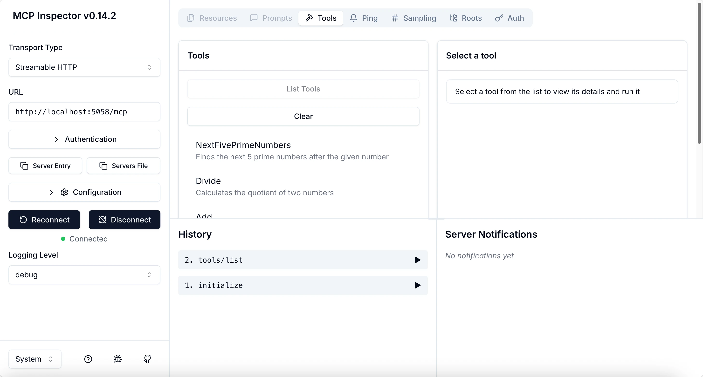
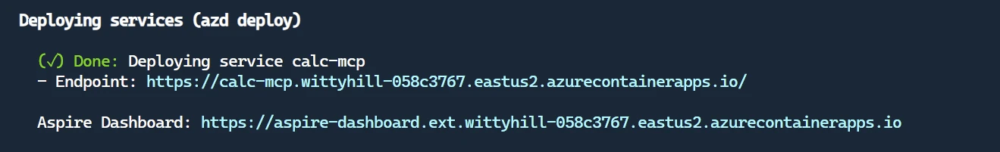

# Pavyzdys

Ankstesnis pavyzdys parodo, kaip naudoti vietinį .NET projektą su `stdio` tipu. Ir kaip paleisti serverį vietoje konteineryje. Tai geras sprendimas daugelyje situacijų. Tačiau naudinga, kad serveris veiktų nuotoliniu būdu, pavyzdžiui, debesies aplinkoje. Čia įžengia `http` tipas.

Pažiūrėję sprendimą `04-PracticalImplementation` kataloge, jis gali atrodyti daug sudėtingesnis nei ankstesnis. Tačiau iš tikrųjų taip nėra. Jei atidžiai pažiūrėsite į projektą `src/Calculator`, pamatysite, kad jo kodas daugiausiai toks pat kaip ankstesniame pavyzdyje. Vienintelis skirtumas yra tas, kad naudojame kitą biblioteką `ModelContextProtocol.AspNetCore` HTTP užklausoms tvarkyti. Taip pat pakeitėme metodą `IsPrime` į privatų, kad parodytume, jog jūsų kode gali būti privatūs metodai. Likęs kodas yra toks pats kaip anksčiau.

Kiti projektai yra iš [Aspire](https://aspire.dev/get-started/what-is-aspire/). Turint Aspire sprendime, pagerėja kūrėjo patirtis kuriant ir testuojant bei padeda stebimumui. Tai nėra būtina serveriui paleisti, bet naudinga turėti sprendime.

## Paleiskite serverį vietoje

1. Iš VS Code (su C# DevKit papildiniu) eikite į `04-PracticalImplementation/samples/csharp` katalogą.
1. Vykdykite šią komandą serveriui paleisti:

   ```bash
    dotnet watch run --project ./src/AppHost
   ```

1. Kai interneto naršyklėje atsidarys Aspire valdymo skydas, atkreipkite dėmesį į `http` URL. Jis turėtų būti kažkas panašaus į `http://localhost:5058/`.

   

## Išbandykite Streamable HTTP su MCP Inspector

Jei turite Node.js 22.7.5 ar naujesnę versiją, galite naudoti MCP Inspector savo serverio testavimui.

Paleiskite serverį ir vykdykite šią komandą terminale:

```bash
npx @modelcontextprotocol/inspector http://localhost:5058
```



- Pasirinkite `Streamable HTTP` kaip Transporto tipą.
- Laukelyje Url įrašykite anksčiau užfiksuotą serverio URL ir pridėkite `/mcp`. Jis turėtų būti `http` (ne `https`), pvz., `http://localhost:5058/mcp`.
- Paspauskite Connect mygtuką.

Gražu tame, kad Inspector suteikia aiškią matomumą, kas vyksta.

- Išbandykite įrankių sąrašą
- Patikrinkite kai kuriuos iš jų; jie veiks taip pat kaip anksčiau.

## Išbandykite MCP serverį su GitHub Copilot Chat VS Code

Norėdami naudoti Streamable HTTP transportą su GitHub Copilot Chat, pakeiskite anksčiau sukurtos `calc-mcp` serverio konfigūraciją taip:

```jsonc
// .vscode/mcp.json
{
  "servers": {
    "calc-mcp": {
      "type": "http",
      "url": "http://localhost:5058/mcp"
    }
  }
}
```

Atlikite keletą testų:

- Paprašykite „3 pirminių skaičių po 6780“. Atkreipkite dėmesį, kaip Copilot naudos naujus įrankius `NextFivePrimeNumbers` ir grąžins tik pirmus 3 pirminius skaičius.
- Paprašykite „7 pirminių skaičių po 111“, kad pamatytumėte, kas nutiks.
- Paklauskite „Jonas turi 24 saldainius ir nori juos paskirstyti savo 3 vaikams. Kiek kiekvienas vaikas gaus?“ ir pažiūrėkite rezultatą.

## Diegimas į Azure

Įdiekime serverį į Azure, kad daugiau žmonių galėtų juo naudotis.

Terminale eikite į katalogą `04-PracticalImplementation/samples/csharp` ir vykdykite šią komandą:

```bash
azd up
```

Baigus diegimą, turėtumėte pamatyti tokį pranešimą:



Nukopijuokite URL ir naudokite jį MCP Inspector ir GitHub Copilot Chat.

```jsonc
// .vscode/mcp.json
{
  "servers": {
    "calc-mcp": {
      "type": "http",
      "url": "https://calc-mcp.gentleriver-3977fbcf.australiaeast.azurecontainerapps.io/mcp"
    }
  }
}
```

## Kas toliau?

Išbandėme įvairius transporto tipus ir testavimo įrankius. Taip pat įdiegėme jūsų MCP serverį į Azure. Bet kas, jei mūsų serveriui reikia prieigos prie privačių išteklių? Pavyzdžiui, duomenų bazės ar privataus API? Kitame skyriuje pamatysime, kaip galime pagerinti serverio saugumą.

---

<!-- CO-OP TRANSLATOR DISCLAIMER START -->
**Atsakomybės apribojimas**:
Šis dokumentas buvo išverstas naudojant dirbtinio intelekto vertimo paslaugą [Co-op Translator](https://github.com/Azure/co-op-translator). Nors siekiame tikslumo, prašome atkreipti dėmesį, kad automatiniai vertimai gali turėti klaidų ar netikslumų. Originalus dokumentas jo gimtąja kalba laikomas autoritetingu šaltiniu. Svarbiai informacijai rekomenduojama naudoti profesionalų žmogiškąjį vertimą. Mes neatsakome už jokius nesusipratimus ar neteisingą interpretaciją, kilusią naudojantis šiuo vertimu.
<!-- CO-OP TRANSLATOR DISCLAIMER END -->