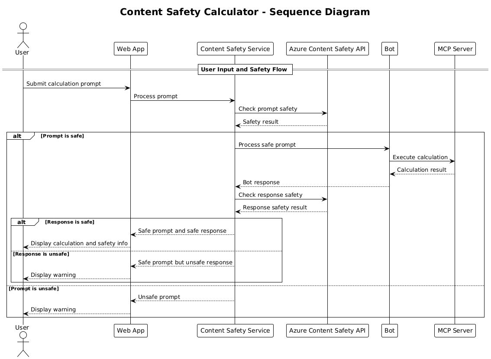

<!--
CO_OP_TRANSLATOR_METADATA:
{
  "original_hash": "e5ea5e7582f70008ea9bec3b3820f20a",
  "translation_date": "2025-08-26T16:18:15+00:00",
  "source_file": "04-PracticalImplementation/samples/java/containerapp/README.md",
  "language_code": "lt"
}
-->
## Sistemos Architektūra

Šis projektas demonstruoja žiniatinklio programą, kuri tikrina turinio saugumą prieš perduodant naudotojo užklausas skaičiuotuvo paslaugai per Model Context Protocol (MCP).



### Kaip tai veikia

1. **Naudotojo įvestis**: Naudotojas įveda skaičiavimo užklausą žiniatinklio sąsajoje
2. **Turinio saugumo patikra (įvestis)**: Užklausa analizuojama naudojant Azure Content Safety API
3. **Saugumo sprendimas (įvestis)**:
   - Jei turinys yra saugus (visose kategorijose sunkumas < 2), jis perduodamas skaičiuotuvui
   - Jei turinys pažymėtas kaip potencialiai žalingas, procesas sustabdomas ir grąžinamas įspėjimas
4. **Skaičiuotuvo integracija**: Saugus turinys apdorojamas naudojant LangChain4j, kuris bendrauja su MCP skaičiuotuvo serveriu
5. **Turinio saugumo patikra (išvestis)**: Roboto atsakymas analizuojamas naudojant Azure Content Safety API
6. **Saugumo sprendimas (išvestis)**:
   - Jei roboto atsakymas yra saugus, jis rodomas naudotojui
   - Jei roboto atsakymas pažymėtas kaip potencialiai žalingas, jis pakeičiamas įspėjimu
7. **Atsakymas**: Rezultatai (jei saugūs) pateikiami naudotojui kartu su abiejų saugumo analizių rezultatais

## Model Context Protocol (MCP) naudojimas su skaičiuotuvo paslaugomis

Šis projektas demonstruoja, kaip naudoti Model Context Protocol (MCP) skaičiuotuvo MCP paslaugoms iškviesti naudojant LangChain4j. Įgyvendinimas naudoja vietinį MCP serverį, veikiantį 8080 prievade, skaičiavimo operacijoms teikti.

### Azure Content Safety paslaugos nustatymas

Prieš naudojant turinio saugumo funkcijas, reikia sukurti Azure Content Safety paslaugos išteklių:

1. Prisijunkite prie [Azure portalo](https://portal.azure.com)
2. Spustelėkite „Create a resource“ ir ieškokite „Content Safety“
3. Pasirinkite „Content Safety“ ir spustelėkite „Create“
4. Įveskite unikalų savo ištekliaus pavadinimą
5. Pasirinkite savo prenumeratą ir išteklių grupę (arba sukurkite naują)
6. Pasirinkite palaikomą regioną (detales rasite [Region availability](https://azure.microsoft.com/en-us/global-infrastructure/services/?products=cognitive-services))
7. Pasirinkite tinkamą kainodaros planą
8. Spustelėkite „Create“, kad įdiegtumėte išteklių
9. Kai diegimas bus baigtas, spustelėkite „Go to resource“
10. Kairiajame meniu, skiltyje „Resource Management“, pasirinkite „Keys and Endpoint“
11. Nukopijuokite vieną iš raktų ir galinio taško URL, kad galėtumėte naudoti kitame žingsnyje

### Aplinkos kintamųjų konfigūravimas

Nustatykite `GITHUB_TOKEN` aplinkos kintamąjį GitHub modelių autentifikavimui:
```sh
export GITHUB_TOKEN=<your_github_token>
```

Turinio saugumo funkcijoms nustatykite:
```sh
export CONTENT_SAFETY_ENDPOINT=<your_content_safety_endpoint>
export CONTENT_SAFETY_KEY=<your_content_safety_key>
```

Šie aplinkos kintamieji naudojami programai autentifikuotis su Azure Content Safety paslauga. Jei šie kintamieji nenustatyti, programa naudos demonstracines reikšmes, tačiau turinio saugumo funkcijos neveiks tinkamai.

### Skaičiuotuvo MCP serverio paleidimas

Prieš paleidžiant klientą, reikia paleisti skaičiuotuvo MCP serverį SSE režimu localhost:8080.

## Projekto aprašymas

Šis projektas demonstruoja Model Context Protocol (MCP) integraciją su LangChain4j skaičiuotuvo paslaugoms iškviesti. Pagrindinės funkcijos:

- MCP naudojimas jungiantis prie skaičiuotuvo paslaugos pagrindinėms matematinėms operacijoms atlikti
- Dvigubo sluoksnio turinio saugumo patikra tiek naudotojo užklausoms, tiek roboto atsakymams
- Integracija su GitHub gpt-4.1-nano modeliu per LangChain4j
- Server-Sent Events (SSE) naudojimas MCP transportui

## Turinio saugumo integracija

Projektas apima išsamias turinio saugumo funkcijas, užtikrinančias, kad tiek naudotojo įvestys, tiek sistemos atsakymai būtų be žalingo turinio:

1. **Įvesties patikra**: Visos naudotojo užklausos analizuojamos dėl žalingo turinio kategorijų, tokių kaip neapykantos kalba, smurtas, savęs žalojimas ir seksualinis turinys, prieš jas apdorojant.

2. **Išvesties patikra**: Net naudojant potencialiai necenzūruotus modelius, sistema tikrina visus sugeneruotus atsakymus per tuos pačius turinio saugumo filtrus prieš juos rodant naudotojui.

Šis dvigubo sluoksnio metodas užtikrina, kad sistema išliktų saugi, nepriklausomai nuo naudojamo AI modelio, apsaugodama naudotojus nuo žalingų įvesčių ir potencialiai problematiškų AI sugeneruotų atsakymų.

## Žiniatinklio klientas

Programa apima patogią naudotojo sąsają, leidžiančią naudotojams sąveikauti su turinio saugumo skaičiuotuvo sistema:

### Žiniatinklio sąsajos funkcijos

- Paprasta, intuityvi forma skaičiavimo užklausoms įvesti
- Dvigubo sluoksnio turinio saugumo patikra (įvestis ir išvestis)
- Realaus laiko grįžtamasis ryšys apie užklausos ir atsakymo saugumą
- Spalvomis pažymėti saugumo indikatoriai lengvam interpretavimui
- Švari, prisitaikanti dizaino sąsaja, tinkanti įvairiems įrenginiams
- Pavyzdinės saugios užklausos naudotojų orientavimui

### Žiniatinklio kliento naudojimas

1. Paleiskite programą:
   ```sh
   mvn spring-boot:run
   ```

2. Atidarykite naršyklę ir eikite į `http://localhost:8087`

3. Įveskite skaičiavimo užklausą pateiktoje teksto srityje (pvz., „Apskaičiuokite 24.5 ir 17.3 sumą“)

4. Spustelėkite „Submit“, kad apdorotumėte savo užklausą

5. Peržiūrėkite rezultatus, kurie apims:
   - Jūsų užklausos turinio saugumo analizę
   - Apskaičiuotą rezultatą (jei užklausa buvo saugi)
   - Roboto atsakymo turinio saugumo analizę
   - Bet kokius saugumo įspėjimus, jei įvestis ar išvestis buvo pažymėta

Žiniatinklio klientas automatiškai tvarko abu turinio saugumo tikrinimo procesus, užtikrindamas, kad visos sąveikos būtų saugios ir tinkamos, nepriklausomai nuo naudojamo AI modelio.

---

**Atsakomybės apribojimas**:  
Šis dokumentas buvo išverstas naudojant AI vertimo paslaugą [Co-op Translator](https://github.com/Azure/co-op-translator). Nors siekiame tikslumo, prašome atkreipti dėmesį, kad automatiniai vertimai gali turėti klaidų ar netikslumų. Originalus dokumentas jo gimtąja kalba turėtų būti laikomas autoritetingu šaltiniu. Kritinei informacijai rekomenduojama profesionali žmogaus vertimo paslauga. Mes neprisiimame atsakomybės už nesusipratimus ar klaidingus interpretavimus, atsiradusius naudojant šį vertimą.