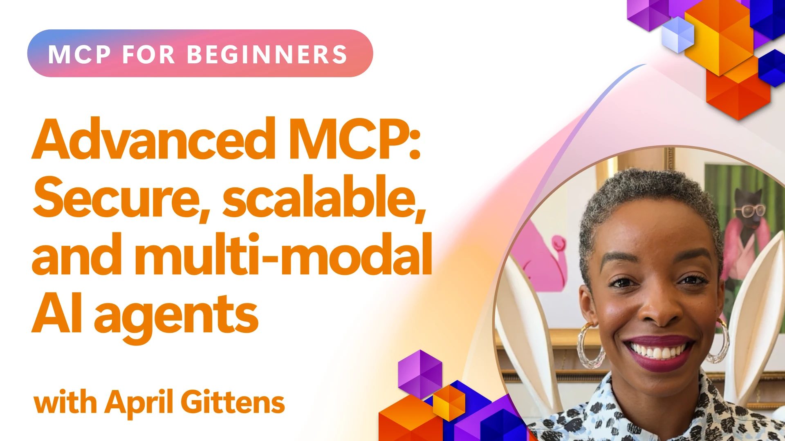

# Pažangios temos MCP

_(Paspauskite viršuje esantį paveikslėlį, kad peržiūrėtumėte pamokos vaizdo įrašą)_

Šiame skyriuje aptariamos pažangios temos, susijusios su Modelio konteksto protokolo (MCP) įgyvendinimu, įskaitant daugiapolį integrovimą, mastelio keitimą, saugumo gerąsias praktikas ir įmonių integraciją. Šios temos yra labai svarbios siekiant sukurti patikrias ir gamybai paruoštas MCP programas, kurios gali atitikti šiuolaikinių AI sistemų reikalavimus.

## Apžvalga

Ši pamoka nagrinėja pažangias sąvokas, susijusias su Modelio konteksto protokolo įgyvendinimu, akcentuodama daugiapolį integrovimą, mastelio keitimą, saugumo gerąsias praktikas ir įmonių integraciją. Šios temos būtinos siekiant sukurti gamybinio lygio MCP programas, galinčias tvarkyti sudėtingus reikalavimus įmonių aplinkose.

> **Dabartinė specifikacijos pastaba:** MCP `2026-07-28` atšaukia šakninius (Roots) ir
> ėmimo (Sampling) primityvus, aptartus pamokose 5.4 ir 5.6. Taip pat perkelia
> eksperimentinę Uždavinio (Tasks) funkciją, nurodytą Protokolo funkcijose (5.16),
> į atskirą Uždavinių (Tasks) plėtinį. Šios pamokos išlaikytos senesniems
> `2025-11-25` įgyvendinimams ir apima migravimo gaires. Žr.
> [Kas pasikeitė MCP: 2026-07-28 specifikacija](../01-CoreConcepts/mcp-2026-07-28.md).

## Mokymosi tikslai

Baigę šią pamoką, galėsite:

- Įgyvendinti daugiapolines galimybes MCP sistemose
- Projektuoti mastelio keičiamos MCP architektūras didelio apkrovimo scenarijams
- Taikyti saugumo gerąsias praktikas, atitinkančias MCP saugumo principus
- Integruoti MCP su įmonių AI sistemomis ir platformomis
- Optimizuoti našumą ir patikimumą gamybos aplinkose

## Pamokos ir pavyzdiniai projektai

| Nuoroda | Pavadinimas | Aprašymas |
|------|-------|-------------|
| [5.1 Integracija su Azure](./mcp-integration/README.md) | Integracija su Azure | Sužinokite, kaip integruoti MCP Serverį Azure platformoje |
| [5.2 Daugiapolio pavyzdys](./mcp-multi-modality/README.md) | MCP daugiapolio pavyzdžiai  | Pavyzdžiai garso, vaizdo ir daugiapolio atsakymo |
| [5.3 MCP OAuth2 pavyzdys](../../../05-AdvancedTopics/mcp-oauth2-demo) | MCP OAuth2 demonstracija | Minimalus Spring Boot programėlės pavyzdys, rodantis OAuth2 su MCP, tiek kaip Autorizacijos, tiek kaip Resursų serveris. Demonstruoja saugų žetonų išdavimą, apsaugotus galinius taškus, Azure Container Apps diegimą ir API valdymo integraciją. |
| [5.4 Šakninių kontekstų pamoka](./mcp-root-contexts/README.md) | Šakniniai kontekstai  | Sužinokite apie legacy `2025-11-25` šakninius primityvus ir dabartines migracijos galimybes (atitariantys `2026-07-28` atšaukimą) |
| [5.5 Maršrutizavimas](./mcp-routing/README.md) | Maršrutizavimas | Sužinokite apie skirtingus maršrutizavimo tipus |
| [5.6 Imties paėmimas](./mcp-sampling/README.md) | Imties paėmimas | Sužinokite apie legacy `2025-11-25` imties paėmimo primityvą ir dabartines migracijos galimybes (atitariantys `2026-07-28` atšaukimą) |
| [5.7 Mastelio didinimas](./mcp-scaling/README.md) | Mastelio keitimas  | Sužinokite apie mastelio keitimą |
| [5.8 Saugumas](./mcp-security/README.md) | Saugumas  | Apsaugokite savo MCP Serverį |
| [5.9 Tinklo paieškos pavyzdys](./web-search-mcp/README.md) | Tinklo paieška MCP | Python MCP serveris ir klientas, integruojantys SerpAPI realaus laiko tinklo, naujienų, produktų paieškai ir klausimams-atsakymams. Demonstruoja daugiainstrumentinį organizavimą, išorinių API integraciją ir stabilų klaidų valdymą. |
| [5.10 Realaus laiko srautinė transliacija](./mcp-realtimestreaming/README.md) | Srautinė transliacija  | Realaus laiko duomenų srautinė transliacija tapo būtina šiuolaikiniame informacijos pasaulyje, kur verslai ir programos reikalauja greitos prieigos prie duomenų, kad priimtų laiku sprendimus.|
| [5.11 Realaus laiko tinklo paieška](./mcp-realtimesearch/README.md) | Tinklo paieška | Kaip MCP transformuoja realaus laiko tinklo paiešką, suteikdama standartizuotą požiūrį į konteksto valdymą per AI modelius, paieškos variklius ir programas.| 
| [5.12 Entra ID autentifikacija Modelio konteksto protokolo serveriams](./mcp-security-entra/README.md) | Entra ID autentifikacija | Microsoft Entra ID suteikia patikimą debesų pagrindu veikiantį tapatybės ir prieigos valdymo sprendimą, padedantį užtikrinti, kad prie MCP serverio gali prisijungti tik įgalioti naudotojai ir programos.|
| [5.13 Microsoft Foundry agentų integracija](./mcp-foundry-agent-integration/README.md) | Microsoft Foundry integracija | Sužinokite, kaip integruoti Modelio konteksto protokolo serverius su Microsoft Foundry agentais, leidžiant įgyvendinti galingą įrankių organizavimą ir įmonių AI galimybes su standartizuotais išorinių duomenų šaltinių ryšiais.|
| [5.14 Konteksto inžinerija](./mcp-contextengineering/README.md) | Konteksto inžinerija | Ateities galimybės taikant konteksto inžinerijos metodus MCP serveriams, įskaitant konteksto optimizavimą, dinaminį konteksto valdymą ir efektyvias paskatinimų inžinerijos strategijas MCP sistemose.|
| [5.15 MCP pasirinktinis transportas](./mcp-transport/README.md) | Pasirinktinis transportas | Sužinokite, kaip įgyvendinti pasirinktinį transporto mechanizmą specializuotiems MCP komunikacijos scenarijams.|
| [5.16 Protokolo funkcijų giluminis nagrinėjimas](./mcp-protocol-features/README.md) | Protokolo funkcijos | Išmokite pažangias protokolo funkcijas, įskaitant pažangos pranešimus, užklausų atšaukimą, išteklių šablonus ir klaidų valdymo modelius.|
| [5.17 Adversarinis daugiagentinis mąstymas](./mcp-adversarial-agents/README.md) | Adversariniai agentai | Naudokite du agentus su priešingomis pozicijomis, dalijantis tuo pačiu MCP įrankių rinkiniu, kad pagautumėte haliucinacijas, atskleistumėte kraštutines situacijas ir sukurtumėte geriau sukalibruotus rezultatus per struktūruotą debatą.|

> **Istorinė `2025-11-25` pastaba:** ši versija įtraukė eksperimentinius
> Uždavinius (Tasks) ir išplėtė keletą protokolo funkcijų. `2026-07-28` eilutėje Uždaviniai
> buvo perkelti į oficialų plėtinį, o Šakniniai Primityvai atšaukti. Nenaudokite
> `2025-11-25` funkcijų statuso kaip dabartinių gaires; žr.
> [2026-07-28 pakeitimų žurnalą](https://modelcontextprotocol.io/specification/2026-07-28/changelog).

## Papildomos nuorodos

Naujausiai informacijai apie pažangias MCP temas žr.:
- [MCP dokumentacija](https://modelcontextprotocol.io/)
- [MCP specifikacija (2026-07-28)](https://modelcontextprotocol.io/specification/2026-07-28/)
- [GitHub saugykla](https://github.com/modelcontextprotocol)
- [OWASP MCP Top 10](https://microsoft.github.io/mcp-azure-security-guide/mcp/) - Saugumo rizikos ir jų valdymas
- [MCP saugumo summit dirbtuvės (Sherpa)](https://azure-samples.github.io/sherpa/) - Praktiniai saugumo mokymai

## Svarbiausios įžvalgos

- Daugiapolio MCP įgyvendinimai praplečia AI galimybes už tik teksto apdorojimo ribų
- Mastelio keitimas yra būtinas įmonių diegimuose ir gali būti sprendžiamas horizontalaus ir vertikalaus mastelio didinimo būdu
- Išsamios saugumo priemonės saugo duomenis ir užtikrina tinkamą prieigos kontrolę
- Įmonių integracija su platformomis, tokiomis kaip Azure OpenAI ir Microsoft AI Foundry, stiprina MCP galimybes
- Pažangūs MCP sprendimai gauna naudą iš optimizuotų architektūrų ir atidaus išteklių valdymo

## Pratimai

Sukurkite įmonės lygio MCP įgyvendinimą specifiniam atvejui:

1. Nustatykite daugiapolinius reikalavimus savo atvejui
2. Apibrėžkite saugumo valdymo priemones, reikalingas jautriems duomenims apsaugoti
3. Sukurkite mastelio keičiamos architektūros planą, galintį tvarkyti kintamą apkrovą
4. Suplanuokite integracijos taškus su įmonių AI sistemomis
5. Dokumentuokite galimus našumo butelio kakliukus ir jų sprendimo strategijas

## Papildomi ištekliai

- [Azure OpenAI dokumentacija](https://learn.microsoft.com/en-us/azure/ai-services/openai/)
- [Microsoft AI Foundry dokumentacija](https://learn.microsoft.com/en-us/ai-services/)

---

## Kas toliau

Tyrinėkite šio modulio pamokas pradėdami nuo: [5.1 MCP integracija](./mcp-integration/README.md)

Baigę šį modulį, tęskite toliau: [6 modulis: Bendruomenės indėliai](../06-CommunityContributions/README.md)

---

<!-- CO-OP TRANSLATOR DISCLAIMER START -->
**Atsakomybės apribojimas**:
Šis dokumentas buvo išverstas naudojant dirbtinio intelekto vertimo paslaugą [Co-op Translator](https://github.com/Azure/co-op-translator). Nors siekiame tikslumo, prašome atkreipti dėmesį, kad automatiniai vertimai gali turėti klaidų ar netikslumų. Originalus dokumentas jo gimtąja kalba laikomas autoritetingu šaltiniu. Svarbiai informacijai rekomenduojama naudoti profesionalų žmogiškąjį vertimą. Mes neatsakome už jokius nesusipratimus ar neteisingą interpretaciją, kilusią naudojantis šiuo vertimu.
<!-- CO-OP TRANSLATOR DISCLAIMER END -->