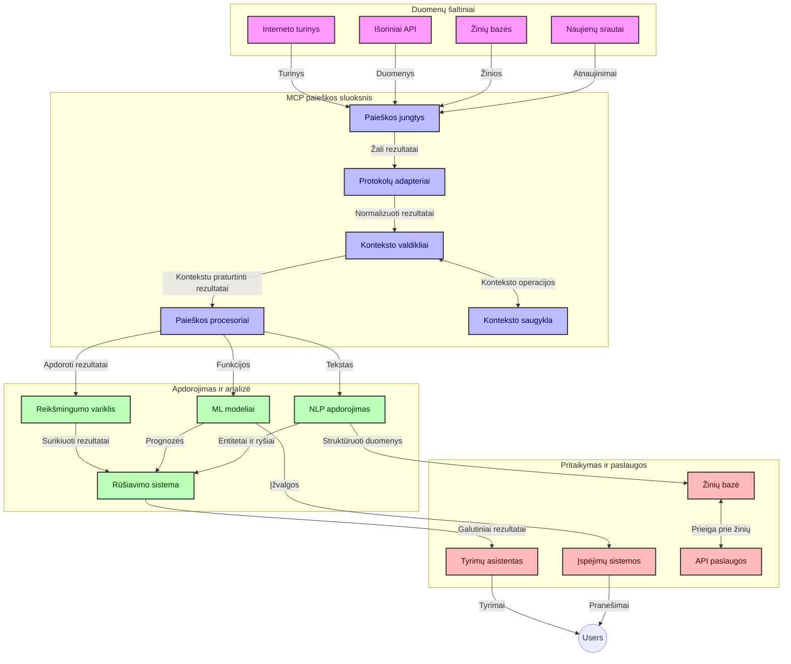
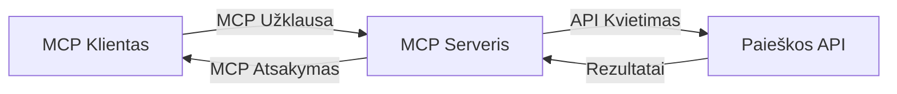
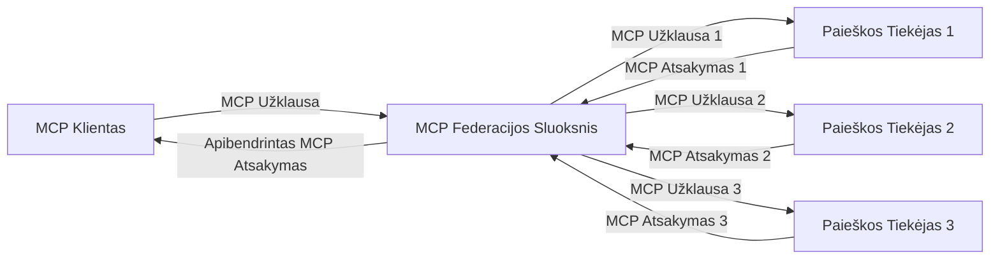
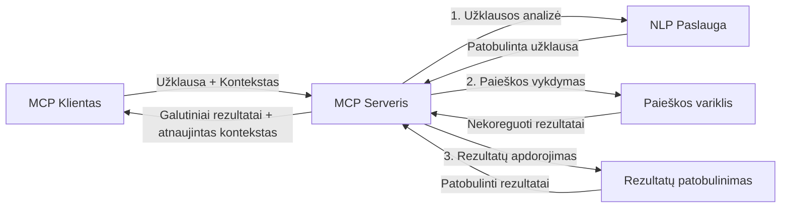

# Modelio konteksto protokolas realaus laiko interneto paieškai

## Apžvalga

Realiojo laiko interneto paieška tapo būtina šiandienos informaciniame pasaulyje, kuriame programoms reikia greito priėjimo prie naujausios informacijos visame internete, kad būtų teikiami aktualūs ir laiku pateikti atsakymai. Modelio konteksto protokolas (MCP) žymi svarbų žingsnį optimizuojant šiuos realaus laiko paieškos procesus, pagerinant paieškos efektyvumą, išlaikant kontekstinį vientisumą ir gerinant bendrą sistemos veikimą.

Šis modulis nagrinėja, kaip MCP keičia realaus laiko interneto paiešką, suteikdamas standartizuotą požiūrį į konteksto valdymą tarp AI modelių, paieškos sistemų ir programų.

### Ką sužinosite

Šiame išsamiame gide sužinosite:

- Kaip MCP sukuria sklandžią sąsają tarp AI modelių ir realaus laiko interneto paieškos galimybių
- Architektūrinius modelius efektyvioms ir skalėms pritaikytoms paieškos sprendimų įgyvendinimui naudojant MCP
- Technikas, skirtas paieškos konteksto išsaugojimui per kelis užklausų ir sąveikų etapus
- Praktinius kodo pavyzdžius Python ir JavaScript kalbomis įvairioms paieškos situacijoms
- Metodus, kaip subalansuoti aktualumą, šviežumą ir našumą MCP pagrindu veikiančiose paieškos sistemose

## Įvadas į realaus laiko interneto paiešką

Realiojo laiko interneto paieška yra technologinis požiūris, leidžiantis nuolat vykdyti užklausas, apdoroti ir analizuoti internetinę informaciją, kai ji publikuojama ar atnaujinama, leidžiantis sistemoms pateikti naujausią ir aktualią informaciją su minimalia delsos laiku. Priešingai nei tradicinės paieškos sistemos, kurios veikia indeksuotų duomenų pagrindu, kurie gali būti kelių valandų ar dienų senumo, realiojo laiko paieška naudoja tiesioginius internetinius duomenis, pateikdama įžvalgas ir informaciją, atspindinčią dabartinę interneto turinio būseną.

### Pagrindinės realaus laiko interneto paieškos sąvokos:

- **Nuolatinis užklausų apdorojimas**: Paieškos užklausos apdorojamos prieš nuolat atnaujinamus duomenų šaltinius
- **Šviežumo prioritizavimas**: Sistemos skiriamos prioritetą šviežiai informacijai
- **Aktualumo balansas**: Išlaikomas pusiausvyros tarp aktualumo ir naujumo palaikymas
- **Skalės galimybė**: Sistemos turi tvarkyti kintančius užklausų kiekius ir duomenų apimtis
- **Kontekstinis supratimas**: Ypatingai svarbu išlaikyti vartotojo kontekstą per kelias paieškos iteracijas reikšmingiems rezultatams
- **Dinamika užklausų pertvarkyme**: Lanksčiai keisti užklausas remiantis kontekstu ir ankstesniais rezultatais
- **Daugių šaltinių integracija**: Apjungti rezultatus iš įvairių paieškos tiekėjų ir interneto šaltinių
- **Semantinis supratimas**: Apdoroti užklausas ir turinį pagal reikšmę, o ne tik pagal raktinius žodžius
- **Realaus laiko reitingavimas**: Nuolat koreguoti rezultatų reitingus, kai pasirodo nauja informacija

### Modelio konteksto protokolas ir realaus laiko interneto paieška

Modelio konteksto protokolas (MCP) sprendžia keletą kritinių iššūkių realaus laiko interneto paieškos aplinkoje:

1. **Paieškos konteksto išsaugojimas**: MCP standartizuoja, kaip kontekstas palaikomas paskirstytose paieškos dalyse, užtikrindamas, kad AI modeliai ir apdorojimo mazgai turi prieigą prie svarbios užklausų istorijos ir vartotojo nustatymų.

2. **Efektyvus užklausų valdymas**: Teikdamas struktūrizuotas mechanikas konteksto perdavimui, MCP sumažina perteklinį konteksto kartojimą kiekvienoje paieškos iteracijoje.

3. **Suderinamumas**: MCP kuria bendrą kalbą konteksto dalijimuisi tarp įvairių paieškos technologijų ir AI modelių, leidžiančią lankstesnes ir išplečiamas architektūras.

4. **Paieškai optimizuotas kontekstas**: MCP įgyvendinimai gali prioritetuoti, kurie konteksto elementai yra svarbiausi efektyviai paieškai, optimizuojant ir našumą, ir tikslumą.

5. **Adaptuojamas paieškos apdorojimas**: Tinkamai valdant kontekstą per MCP, paieškos sistemos gali dinamiškai keisti apdorojimą pagal kintančius vartotojo poreikius ir informacines aplinkas.

Šiuolaikinėse programose nuo naujienų agregacijos iki mokslinių asistentų MCP integracija su interneto paieškos technologijomis leidžia kurti protingesnę, kontekstą suprantančią paiešką, kuri su laiku gali pateikti vis aktualesnius rezultatus pagal vartotojo sąveiką.

## Mokymosi tikslai

Šios pamokos pabaigoje jūs gebėsite:

- Suprasti realaus laiko interneto paieškos pagrindus ir jos iššūkius šiuolaikinėse programose
- Paaiškinti, kaip Modelio konteksto protokolas (MCP) pagerina realaus laiko interneto paieškos galimybes
- Įgyvendinti MCP pagrindu veikiančius paieškos sprendimus naudojant populiarias sistemas ir API
- Kurti ir diegti skalę palaikančias, našias paieškos architektūras su MCP
- Taikyti MCP koncepcijas įvairiems naudojimo atvejams, įskaitant semantinę paiešką, mokslinių tyrimų pagalbą ir AI papildytą naršymą
- Vertinti naujas tendencijas ir būsimas inovacijas MCP pagrindu veikiančiose paieškos technologijose
- Kurti kontekstą suprantančias paieškos sistemas, kurios mokosi iš vartotojo sąveikų
- Integruoti interneto paieškos galimybes AI asistentams naudojant standartizuotus MCP protokolus
- Kurti daugiapakopes paieškos grandines, kurios palaipsniui tikslina rezultatus pagal kontekstą
- Optimizuoti paieškos našumą išlaikant visapusišką konteksto suvokimą

### Apibrėžimas ir svarba

Realiojo laiko interneto paieška apima nuolatinį internetinės informacijos užklausimą, gavimą ir pateikimą su minimaliu delsos laiku. Priešingai nei tradiciniai paieškos varikliai, kurie periodiškai naršo ir indeksuoja internetą, realaus laiko paieška siekia pateikti informaciją, kai ji atsiranda, leidžiant nedelsiant gauti naujausią turinį.

Pagrindinės realaus laiko interneto paieškos savybės:

- **Šviežumas**: Prioritetas neseniems turiniams ir atnaujinimams
- **Nuolatinis apdorojimas**: Pastoviai stebima nauja informacija
- **Užklausų adaptacija**: Paieškos užklausų patikslinimas pagal kontekstą ir atsiliepimus
- **Momentinis pateikimas**: Paieškos rezultatų pateikimas su minimaliu vėlavimu
- **Konteksto išlaikymas**: Iš ankstesnių užklausų statomas kontekstas, gerinantis aktualumą

### Trūkumai tradicinėje interneto paieškoje

Tradiciniai interneto paieškos metodai turi keletą apribojimų, taikant juos realaus laiko scenarijuose:

1. **Konteksto fragmentacija**: Sudėtinga išlaikyti paieškos kontekstą per kelias užklausas
2. **Informacijos šviežumas**: Sudėtinga priartėti ir prioritetizuoti naujausią informaciją
3. **Integracijos sudėtingumas**: Problemų tarp paieškos sistemų ir programų suderinamumo srityje
4. **Delsos problemos**: Siekiant subalansuoti išsamų paieškos veikimą su atsako laiko reikalavimais
5. **Aktualumo reguliavimas**: Užtikrinti tikslumą ir aktualumą, kartu suteikiant prioritetą naujumui

## Modelio konteksto protokolo (MCP) supratimas paieškoje

### Kas yra MCP paieškos kontekstuose?

Modelio konteksto protokolas (MCP) yra standartizuotas komunikacijos protokolas, sukurtas palengvinti efektyvų bendradarbiavimą tarp AI modelių ir programų. Realiojo laiko interneto paieškos kontekste MCP suteikia platformą:

- Išlaikyti paieškos kontekstą per užklausų sekas
- Standardizuoti paieškos užklausų ir rezultatų formatus
- Optimizuoti paieškos parametrų ir rezultatų perdavimą
- Pagerinti modelio ir paieškos variklio komunikaciją

### Pagrindinės sudedamosios dalys ir architektūra

MCP architektūra realaus laiko interneto paieškai susideda iš kelių pagrindinių komponentų:

1. **Užklausų konteksto valdytojai**: Tvarko ir palaiko paieškos kontekstą per kelias užklausas
2. **Paieškos apdorotojai**: Apdoroja gaunamas paieškos užklausas naudodami kontekstą suprantančias technikas
3. **Protokolo adapteriai**: Konvertuoja tarp skirtingų paieškos API išlaikant kontekstą
4. **Konteksto saugykla**: Efektyviai saugo ir pateikia paieškos istoriją bei vartotojo nustatymus
5. **Paieškos jungtys**: Jungiasi su įvairiais paieškos varikliais ir interneto API



### Kaip MCP gerina realaus laiko interneto paiešką

MCP sprendžia tradicinių interneto paieškos iššūkius per:

- **Kontekstinė tęstinumo palaikymas**: Išlaikyti ryšius tarp užklausų visos paieškos sesijos metu
- **Optimizuotą perdavimą**: Mažinti pasikartojančių paieškos parametrų kiekį protingu konteksto valdymu
- **Standartizuotas sąsajas**: Suteikti vientisus API paieškos komponentams
- **Sumažintą delsą**: Mažinti apdorojimo papildomas išlaidas efektyviu konteksto valdymu
- **Pagerintą aktualumą**: Didinti paieškos aktualumą išlaikant vartotojo ketinimus per kelias užklausas

## Integracija ir įgyvendinimas

Realiojo laiko interneto paieškos sistemos reikalauja kruopštaus architektūrinio dizaino ir įgyvendinimo, kad išlaikytų tiek našumą, tiek kontekstinį vientisumą. Modelio konteksto protokolas siūlo standartizuotą požiūrį integruojant AI modelius ir paieškos technologijas, leidžiant sudaryti pažangesnius, kontekstą suvokiančius paieškos srautus.

### MCP integracijos apžvalga paieškos architektūrose

MCP taikymas realiojo laiko interneto paieškos aplinkoje reikalauja kelių pagrindinių aspektų:

1. **Paieškos konteksto serializavimas**: MCP teikia efektyvius mechanizmus kontekstinės informacijos kodavimui paieškos užklausose, užtikrinant, kad būtinas kontekstas seka per visą apdorojimo grandinę. Tai apima standartizuotus serializavimo formatus, optimizuotus paieškos metaduomenims.

2. **Būsenos palaikymas paieškoje**: MCP leidžia išmanų apdorojimą palaikant nuoseklią konteksto reprezentaciją per kelias paieškos iteracijas. Tai ypač vertinga daugiapakopėse paieškos grandinėse, kuriose konteksto tobulinimas gerina rezultatus.

3. **Užklausų plėtra ir patikslinimas**: MCP įgyvendinimai paieškos sistemose gali palengvinti sudėtingą užklausų plėtrą ir patikslinimą, remiantis sukauptu kontekstu, leidžiant gaunamus rezultatus pamažu daryti vis aktualesnius paieškos sesijos eigoje.

4. **Rezultatų talpinimas ir prioritetizavimas**: Standartizuodamas konteksto tvarkymą, MCP padeda valdyti rezultatų talpyklą ir jo prioriteto nustatymą, leidžiant komponentams prisitaikyti pagal besikeičiantį paieškos kontekstą.

5. **Paieškos federacija ir agregacija**: MCP palengvina sudėtingesnę paieškos federaciją per keletą užnugarių sistemų, teikdamas struktūruotas paieškos konteksto atvaizdas, leidžiančius prasmingiau agreguoti rezultatus iš įvairių šaltinių.

Kadangi MCP įgyvendinamas įvairiose paieškos technologijose, sukuriamas vieningas konteksto valdymo metodas, mažinantis poreikį rašyti individualų integracijos kodą ir didinantis sistemos gebėjimą įsiklausyti į prasmingą kontekstą, kai paieškos užklausos vystosi.

### MCP įvairiuose interneto paieškos įgyvendinimuose

Šie pavyzdžiai atitinka esamą MCP specifikaciją, kuri orientuota į JSON-RPC pagrindu veikiančią protokolą su aiškiais transporto mechanizmais. Kodu rodomas būdas, kaip galite įgyvendinti suasmenintus paieškos sprendimus išlaikant visišką suderinamumą su MCP protokolu.


<details>
<summary>Python įgyvendinimas naudojant bendrą paieškos API</summary>

```python
import asyncio
import json
import aiohttp
from typing import Dict, Any, Optional, List
from contextlib import asynccontextmanager
from collections.abc import AsyncIterator

# Importuoti standartines MCP bibliotekas
from mcp.client.session import ClientSession
from mcp.client.streamable_http import streamablehttp_client
from mcp.types import TextContent, CreateMessageRequestParams, CreateMessageResult
from mcp.server.fastmcp import FastMCP

# Sukurti FastMCP serverį interneto paieškai
search_server = FastMCP("WebSearch")

# Klasė, skirta valdyti interneto paieškos operacijas
class WebSearchHandler:
    def __init__(self, api_endpoint: str, api_key: str):
        self.api_endpoint = api_endpoint
        self.api_key = api_key
        self.session = None
        
    async def initialize(self):
        """Initialize the HTTP session"""
        self.session = aiohttp.ClientSession(
            headers={"Authorization": f"Bearer {self.api_key}"}
        )
    
    async def close(self):
        """Close the HTTP session"""
        if self.session:
            await self.session.close()
            
    async def perform_search(self, query: str, max_results: int = 5, 
                           include_domains: List[str] = None, 
                           exclude_domains: List[str] = None,
                           time_period: str = "any") -> Dict[str, Any]:
        """Perform web search using the search API"""
        # Sudaryti paieškos parametrus
        search_params = {
            "q": query,
            "limit": max_results,
            "time": time_period
        }
        
        if include_domains:
            search_params["site"] = ",".join(include_domains)
            
        if exclude_domains:
            search_params["exclude_site"] = ",".join(exclude_domains)
        
        # Atlikti paieškos užklausą
        try:
            async with self.session.get(
                self.api_endpoint,
                params=search_params
            ) as response:
                if response.status != 200:
                    error_text = await response.text()
                    raise Exception(f"Search API error: {response.status} - {error_text}")
                
                search_data = await response.json()
                
                # Paversti API specifinį atsakymą į standartinį formatą
                results = []
                for item in search_data.get("results", []):
                    results.append({
                        "title": item.get("title", ""),
                        "url": item.get("url", ""),
                        "snippet": item.get("snippet", ""),
                        "date": item.get("published_date", ""),
                        "source": item.get("source", "")
                    })
                
                return {
                    "query": query,
                    "totalResults": len(results),
                    "results": results
                }
        except Exception as e:
            print(f"Search API request error: {e}")
            raise

# Inicializuoti paieškos valdiklį
search_handler = WebSearchHandler(
    api_endpoint="https://api.search-service.example/search",
    api_key="your-api-key-here"
)

# Nustatyti gyvenimo trukmę paieškos valdiklio valdymui
@asyncio.asynccontextmanager
async def app_lifespan(server: FastMCP):
    """Manage application lifecycle"""
    await search_handler.initialize()
    try:
        yield {"search_handler": search_handler}
    finally:
        await search_handler.close()

# Nustatyti serverio gyvenimo trukmę
search_server = FastMCP("WebSearch", lifespan=app_lifespan)

# Užregistruoti interneto paieškos įrankį
@search_server.tool()
async def web_search(query: str, max_results: int = 5, 
                   include_domains: List[str] = None,
                   exclude_domains: List[str] = None,
                   time_period: str = "any") -> Dict[str, Any]:
    """
    Search the web for information
    
    Args:
        query: The search query
        max_results: Maximum number of results to return (default: 5)
        include_domains: List of domains to include in search results
        exclude_domains: List of domains to exclude from search results
        time_period: Time period for results ("day", "week", "month", "any")
        
    Returns:
        Dictionary containing search results
    """
    ctx = search_server.get_context()
    search_handler = ctx.request_context.lifespan_context["search_handler"]
    
    results = await search_handler.perform_search(
        query=query,
        max_results=max_results,
        include_domains=include_domains,
        exclude_domains=exclude_domains,
        time_period=time_period
    )
    
    return results

# Pavyzdinis kliento naudojimas
async def client_example():
    # Prisijungti prie paieškos serverio naudojant Streamable HTTP transportą
    async with streamablehttp_client("http://localhost:8000/mcp") as (read, write, _):
        async with ClientSession(read, write) as session:
            # Inicializuoti ryšį
            await session.initialize()
            
            # Iškviesti web_search įrankį
            search_results = await session.call_tool(
                "web_search", 
                {
                    "query": "latest developments in AI and Model Context Protocol",
                    "max_results": 5,
                    "time_period": "day",
                    "include_domains": ["github.com", "microsoft.com"]
                }
            )
            
            print(f"Search results: {search_results}")

# Serverio vykdymo pavyzdys
if __name__ == "__main__":
    # Vykdyti serverį su Streamable HTTP transportu
    search_server.run(transport="streamable-http")
```
</details> 

<details>
<summary>JavaScript įgyvendinimas su naršyklės pagrindu veikiančia paieška</summary>


```javascript
// MCP serverio įgyvendinimas interneto paieškai
import { McpServer, ResourceTemplate } from '@modelcontextprotocol/sdk/server/mcp.js';
import { StreamableHTTPServerTransport } from '@modelcontextprotocol/sdk/server/streamableHttp.js';
import { z } from 'zod';

// Sukurti MCP serverį interneto paieškai
const searchServer = new McpServer({
    name: "BrowserSearch",
    description: "A server that provides web search capabilities"
});

// Paieškos paslaugos klasė
class SearchService {
    constructor(searchApiUrl, apiKey) {
        this.searchApiUrl = searchApiUrl;
        this.apiKey = apiKey;
    }

    async performSearch(parameters) {
        const {
            query = '',
            maxResults = 5,
            includeDomains = [],
            excludeDomains = [],
            timePeriod = 'any'
        } = parameters;
        
        // Sudaryti paieškos URL su parametrais
        const url = new URL(this.searchApiUrl);
        url.searchParams.append('q', query);
        url.searchParams.append('limit', maxResults);
        url.searchParams.append('time', timePeriod);
        
        if (includeDomains.length > 0) {
            url.searchParams.append('site', includeDomains.join(','));
        }
        
        if (excludeDomains.length > 0) {
            url.searchParams.append('exclude_site', excludeDomains.join(','));
        }
        
        try {
            const response = await fetch(url.toString(), {
                method: 'GET',
                headers: {
                    'Authorization': `Bearer ${this.apiKey}`,
                    'Content-Type': 'application/json'
                }
            });
            
            if (!response.ok) {
                const errorText = await response.text();
                throw new Error(`Search API error: ${response.status} - ${errorText}`);
            }
            
            const searchData = await response.json();
            
            // Paversti API specifinę atsakymą į standartinį formatą
            const results = searchData.results?.map(item => ({
                title: item.title || '',
                url: item.url || '',
                snippet: item.snippet || '',
                date: item.published_date || '',
                source: item.source || ''
            })) || [];
            
            return {
                query,
                totalResults: results.length,
                results
            };
        } catch (error) {
            console.error('Search API request error:', error);
            throw error;
        }
    }
}

// Inicijuoti paieškos paslaugą
const searchService = new SearchService(
    'https://api.search-service.example/search',
    'your-api-key-here'
);

// Nustatyti konteksto tiekėją serveriui
searchServer.setContextProvider(() => {
    return {
        searchService
    };
});

// Užregistruoti interneto paieškos įrankį
searchServer.tool({
    name: 'web_search',
    description: 'Search the web for information',
    parameters: {
        type: 'object',
        properties: {
            query: {
                type: 'string',
                description: 'The search query'
            },
            maxResults: {
                type: 'integer',
                description: 'Maximum number of results to return',
                default: 5
            },
            includeDomains: {
                type: 'array',
                items: { type: 'string' },
                description: 'List of domains to include in search results'
            },
            excludeDomains: {
                type: 'array',
                items: { type: 'string' },
                description: 'List of domains to exclude from search results'
            },
            timePeriod: {
                type: 'string',
                description: 'Time period for results',
                enum: ['day', 'week', 'month', 'any'],
                default: 'any'
            }
        },
        required: ['query']
    },
    handler: async (params, context) => {
        const { searchService } = context;
        return await searchService.performSearch(params);
    }
});

// Pavyzdinis kliento kodas prisijungimui prie paieškos serverio
import { Client } from '@modelcontextprotocol/sdk/client/index.js';
import { StreamableHTTPClientTransport } from '@modelcontextprotocol/sdk/client/streamableHttp.js';

async function connectToSearchServer() {
    // Prisijungti prie paieškos serverio
    const transport = new StreamableHTTPClientTransport(
        new URL('http://localhost:8000/mcp')
    );
    
    const client = new Client({
        name: 'search-client',
        version: '1.0.0'
    });
    
    await client.connect(transport);
    
    // Vykdyti paieškos įrankį
    const searchResults = await client.callTool({
        name: 'web_search',
        arguments: {
            query: 'Model Context Protocol implementation examples',
            maxResults: 10,
            timePeriod: 'week',
            includeDomains: ['github.com', 'docs.microsoft.com']
        }
    });
    
    console.log('Search results:', searchResults);
    
    // Valymas
    await client.disconnect();
}

// Paleisti serverį
const transport = new StreamableHTTPServerTransport();
await searchServer.connect(transport);
console.log('Search server running at http://localhost:8000/mcp');

// Atskirame procese arba po serverio paleidimo
// connectToSearchServer().catch(console.error);
```
</details> 


## Kodo pavyzdžių atsakomybės apribojimas

> **Svarbi pastaba**: Toliau pateikti kodo pavyzdžiai demonstruoja Modelio konteksto protokolo (MCP) integraciją su interneto paieškos funkcionalumu. Nors jie atitinka oficialių MCP programų programavimo sąsajų (SDK) modelius ir struktūras, jie supaprastinti edukaciniais tikslais.
> 
> Šie pavyzdžiai rodo:
> 
> 1. **Python įgyvendinimą**: FastMCP serverio įgyvendinimas, kuris suteikia interneto paieškos įrankį ir jungiasi prie išorinio paieškos API. Šis pavyzdys demonstruoja tinkamą gyvenimo ciklo valdymą, konteksto tvarkymą ir įrankio implementavimą pagal [oficialų MCP Python SDK](https://github.com/modelcontextprotocol/python-sdk) pavyzdžius. Serveris naudoja rekomenduojamą Streamable HTTP transportą, kuris pakeitė senesnį SSE transportą gamybiniuose diegimuose.
> 
> 2. **JavaScript įgyvendinimą**: TypeScript/JavaScript įgyvendinimas naudojant FastMCP modelį iš [oficialaus MCP TypeScript SDK](https://github.com/modelcontextprotocol/typescript-sdk), kad būtų sukurtas paieškos serveris su tinkamais įrankių apibrėžimais ir klientų jungtimis. Tai atitinka naujausius rekomenduojamus sesijų valdymo ir konteksto išlaikymo modelius.
> 
> Šie pavyzdžiai reikalautų papildomo klaidų apdorojimo, autentifikacijos ir konkrečių API integracijos kodo gamybos naudojimui. Paieškos API taškai (`https://api.search-service.example/search`) yra pavyzdinės nuorodos ir turi būti pakeistos tikrais paieškos paslaugų taškais.
> 
> Dėl pilno įgyvendinimo detalių ir naujausių požiūrių,
> kreipkitės į [oficialią MCP specifikaciją](https://modelcontextprotocol.io/specification/2026-07-28/)
> ir SDK dokumentaciją.

## Pagrindinės sąvokos

### Modelio konteksto protokolo (MCP) sistema

Pagrindas MCP suteikia standartizuotą būdą AI modeliams, programoms ir paslaugoms keistis kontekstu. Realaus laiko interneto paieškoje šis pagrindas yra būtinas kuriant nuoseklias, daugiapakopes paieškos patirtis. Pagrindiniai komponentai apima:

1. **Kliento-serverio architektūra**: MCP nustato aiškią atskirtį tarp paieškos klientų (užklausų teikėjų) ir paieškos serverių (teikėjų), leidžiant lanksčias diegimo schemas.

2. **JSON-RPC komunikacija**: Protokolas naudoja JSON-RPC žinučių keitimui, tad jis suderinamas su interneto technologijomis ir lengvai įgyvendinamas įvairiose platformose.

3. **Konteksto valdymas**: MCP apibrėžia struktūrizuotus metodus paieškos konteksto palaikymui, atnaujinimui ir išnaudojimui per kelias sąveikas.

4. **Įrankių apibrėžimai**: Paieškos galimybės pateikiamos kaip standartizuoti įrankiai su aiškiai apibrėžtais parametrais ir grąžinimais.

5. **Srautinis palaikymas**: Protokolas palaiko rezultatų srautavimą, būtina realaus laiko paieškai, kai rezultatai gali atkeliauti palaipsniui.

### Interneto paieškos integracijos modeliai

Integruojant MCP su interneto paieška, atsiranda keletas modelių:

#### 1. Tiesioginė paieškos tiekėjo integracija



Šiame modelyje MCP serveris tiesiogiai sąveikauja su vienu ar keliais paieškos API, verčia MCP užklausas į specifinius API kvietimus ir formatuoja rezultatus kaip MCP atsakymus.

#### 2. Federuota paieška su konteksto išsaugojimu



Šis modelis paskirsto paieškos užklausas per kelis MCP suderinamus paieškos tiekėjus, kurie gali specializuotis skirtingų tipų turiniu ar paieškos galimybėmis, išlaikant vieningą kontekstą.

#### 3. Kontekstu sustiprinta paieškos grandinė



Šiame modelyje paieškos procesas yra suskaidytas į kelis etapus, kurių kiekviename žingsnyje kontekstas papildomas, rezultatai palaipsniui tampa aktualesni.

### Paieškos konteksto komponentai

MCP pagrindu veikiančioje interneto paieškoje kontekstas paprastai apima:

- **Užklausų istorija**: Ankstesnės paieškos užklausos sesijos metu
- **Vartotojo nustatymai**: Kalba, regionas, saugios paieškos nustatymai
- **Sąveikų istorija**: Kuriuos rezultatus paspausta, kiek laiko praleista prie rezultatų
- **Paieškos parametrai**: Filtrai, rūšiavimo tvarkos ir kiti paieškos modifikatoriai
- **Domeno žinios**: Tematika specifinis kontekstas, svarbus paieškai
- **Laikinasis kontekstas**: Laiku pagrįsti aktualumo veiksniai
- **Šaltinių prioritetai**: Patikimi ar pageidaujami informacijos šaltiniai

## Naudojimo atvejai ir taikymas

### Moksliniai tyrimai ir informacijos surinkimas

MCP pagerina mokslinių tyrimų darbo eigą per:

- Tyrimų konteksto išlaikymą per paieškos sesijas
- Sudėtingų ir kontekstualiai aktualių užklausų galimybę
- Palaikant daugių šaltinių paieškos federaciją
- Palengvinant žinių išgavimo procesą iš paieškos rezultatų

### Realiojo laiko naujienų ir tendencijų stebėjimas

MCP pagrindu veikiančios paieškos suteikia pranašumų naujienų stebėsenai:

- Beveik realiuoju laiku aptinkamos naujos atsirandančios naujienos
- Kontekstinis svarbios informacijos filtravimas
- Temų ir objektų sekimas keliuose šaltiniuose
- Asmeninės naujienų įspėjimų pranešimai pagal vartotojo kontekstą

### AI papildytas naršymas ir tyrimai

MCP atveria naujas galimybes AI papildytam naršymui:

- Kontekstinės paieškos siūlymai pagal dabartinę naršyklės veiklą
- Sklandi interneto paieškos integracija su LLM pagrindu veikiančiais asistentais
- Daugiapakopis paieškos tobulinimas išlaikant kontekstą
- Pagerintas faktų tikrinimas ir informacijos patikrinimas

## Ateities tendencijos ir inovacijos

### MCP evoliucija interneto paieškoje

Žvelgiant į ateitį, laukiama, kad MCP vystysis sprendžiant:


- **Daugiakanalė paieška**: Teksto, vaizdų, garso ir vaizdo paieškos integravimas išlaikant kontekstą
- **Decentralizuota paieška**: Palaikymas paskirstytoms ir federuotoms paieškos ekosistemoms
- **Paieškos privatumas**: Kontekstą atitinkančios privatumo išsaugojimo paieškos mechanizmai
- **Užklausų supratimas**: Gilus natūralios kalbos paieškos užklausų semantinis analizavimas

### Potencialūs technologiniai patobulinimai

Iškyla technologijos, formuosiančios MCP paieškos ateitį:

1. **Neuroninės paieškos architektūros**: Įterpimais pagrįstos paieškos sistemos optimizuotos MCP
2. **Personalizuotas paieškos kontekstas**: Individualių vartotojų paieškos modelių mokymasis laikui bėgant
3. **Žinių grafų integracija**: Kontekstinė paieška, patobulinta domeno specifiniais žinių grafais
4. **Kryžminio modalumo kontekstas**: Konteksto palaikymas skirtingose paieškos modalumuose

## Praktinės užduotys

### Užduotis 1: Paprastos MCP paieškos grandinės sukūrimas

Šioje užduotyje išmoksite:
- Suorganizuoti paprastą MCP paieškos aplinką
- Įgyvendinti konteksto tvarkyklius interneto paieškai
- Testuoti ir patvirtinti konteksto išsaugojimą paieškos iteracijose

### Užduotis 2: Tyrimų asistento kūrimas su MCP paieška

Sukurkite pilną programą, kuri:
- Apdoroja natūralios kalbos tyrimų klausimus
- Atlieka kontekstą atitinkančias interneto paieškas
- Sintetina informaciją iš kelių šaltinių
- Pateikia organizuotus tyrimų rezultatus

### Užduotis 3: Daugiakanalės paieškos federacijos įgyvendinimas su MCP

Pažangi užduotis apimanti:
- Kontekstą atitinkančių užklausų delegavimą keliems paieškos varikliams
- Rezultatų reitingavimą ir apjungimą
- Kontekstinį paieškos rezultatų dubliavimo šalinimą
- Šaltiniui būdingų meta duomenų tvarkymą

## Papildomi ištekliai

- [Model Context Protocol specifikacija](https://modelcontextprotocol.io/specification/2026-07-28/) - Oficiali MCP specifikacija ir išsami protokolo dokumentacija
- [Model Context Protocol dokumentacija](https://modelcontextprotocol.io/) - Išsamūs vadovai ir įgyvendinimo gairės
- [MCP Python SDK](https://github.com/modelcontextprotocol/python-sdk) - Oficialus MCP protokolo Python įgyvendinimas
- [MCP TypeScript SDK](https://github.com/modelcontextprotocol/typescript-sdk) - Oficialus MCP protokolo TypeScript įgyvendinimas
- [MCP atskaitos serveriai](https://github.com/modelcontextprotocol/servers) - MCP serverių atskaitos įgyvendinimai
- [Bing interneto paieškos API dokumentacija](https://learn.microsoft.com/en-us/bing/search-apis/bing-web-search/overview) - Microsoft interneto paieškos API
- [Google Custom Search JSON API](https://developers.google.com/custom-search/v1/overview) - „Google“ programuojamas paieškos variklis
- [SerpAPI dokumentacija](https://serpapi.com/search-api) - Paieškos variklio rezultatų puslapio API
- [Meilisearch dokumentacija](https://www.meilisearch.com/docs) - Atviro kodo paieškos variklis
- [Elasticsearch dokumentacija](https://www.elastic.co/guide/index.html) - Paskirstytas paieškos ir analizės variklis
- [LangChain dokumentacija](https://python.langchain.com/docs/get_started/introduction) - Programų kūrimas su LLM

## Mokymosi rezultatai

Baigę šį modulį galėsite:

- Suprasti realaus laiko interneto paieškos pagrindus ir jos iššūkius
- Paaiškinti, kaip Model Context Protocol (MCP) gerina realaus laiko interneto paieškos galimybes
- Įgyvendinti MCP pagrindu veikiančius paieškos sprendimus naudojant populiarius karkasus ir API
- Kurti ir diegti masteliu pritaikomas, aukšto našumo paieškos architektūras su MCP
- Taikyti MCP koncepcijas įvairiems naudojimo atvejams, įskaitant semantinę paiešką, tyrimų asistavimą ir AI papildomą naršymą
- Įvertinti kylančias tendencijas ir ateities naujoves MCP pagrįstoje paieškos technologijoje


### Pasitikėjimo ir saugumo svarstymai

Įgyvendinant MCP pagrindu veikiančius interneto paieškos sprendimus, atminkite šias svarbias MCP specifikacijos nuostatas:

1. **Vartotojo sutikimas ir kontrolė**: Vartotojai privalo aiškiai pritarti ir suprasti visus duomenų prieigos ir operacijų aspektus. Tai ypač svarbu interneto paieškos įgyvendinimuose, kurie gali prieiti prie išorinių duomenų šaltinių.

2. **Duomenų privatumas**: Užtikrinkite tinkamą paieškos užklausų ir rezultatų tvarkymą, ypač jei jie gali turėti jautrios informacijos. Taikykite tinkamas prieigos kontrolės priemones, kad apsaugotumėte vartotojo duomenis.

3. **Įrankių saugumas**: Įgyvendinkite tinkamą leidimų suteikimą ir patikrinimą paieškos įrankiams, nes jie gali kelti saugumo riziką dėl savavališko kodo vykdymo. Įrankių elgesio aprašymai turėtų būti traktuojami kaip nepatikimi, jei negaunami iš patikimo serverio.

4. **Aiški dokumentacija**: Teikite aiškią dokumentaciją apie MCP pagrindu veikiančios paieškos galimybes, apribojimus ir saugumo aspektus, remdamiesi MCP specifikacijos įgyvendinimo gairėmis.

5. **Patikimos sutikimo protokolų srauto įgyvendinimas**: Kurkite patikimus sutikimo ir autorizacijos srautus, kurie aiškiai paaiškina, ką kiekvienas įrankis daro prieš leidžiant jį naudoti, ypač įrankiams, kurie sąveikauja su išoriniais interneto resursais.

Visiems MCP saugumo ir pasitikėjimo svarstymams išsamiai žiūrėkite į
[oficialią dokumentaciją](https://modelcontextprotocol.io/specification/2026-07-28/basic/security_best_practices).

## Kas toliau

- [5.12 Entra ID autentifikacija Model Context Protocol serveriams](../mcp-security-entra/README.md)

---

<!-- CO-OP TRANSLATOR DISCLAIMER START -->
**Atsakomybės apribojimas**:
Šis dokumentas buvo išverstas naudojant dirbtinio intelekto vertimo paslaugą [Co-op Translator](https://github.com/Azure/co-op-translator). Nors siekiame tikslumo, prašome atkreipti dėmesį, kad automatiniai vertimai gali turėti klaidų ar netikslumų. Originalus dokumentas jo gimtąja kalba laikomas autoritetingu šaltiniu. Svarbiai informacijai rekomenduojama naudoti profesionalų žmogiškąjį vertimą. Mes neatsakome už jokius nesusipratimus ar neteisingą interpretaciją, kilusią naudojantis šiuo vertimu.
<!-- CO-OP TRANSLATOR DISCLAIMER END -->