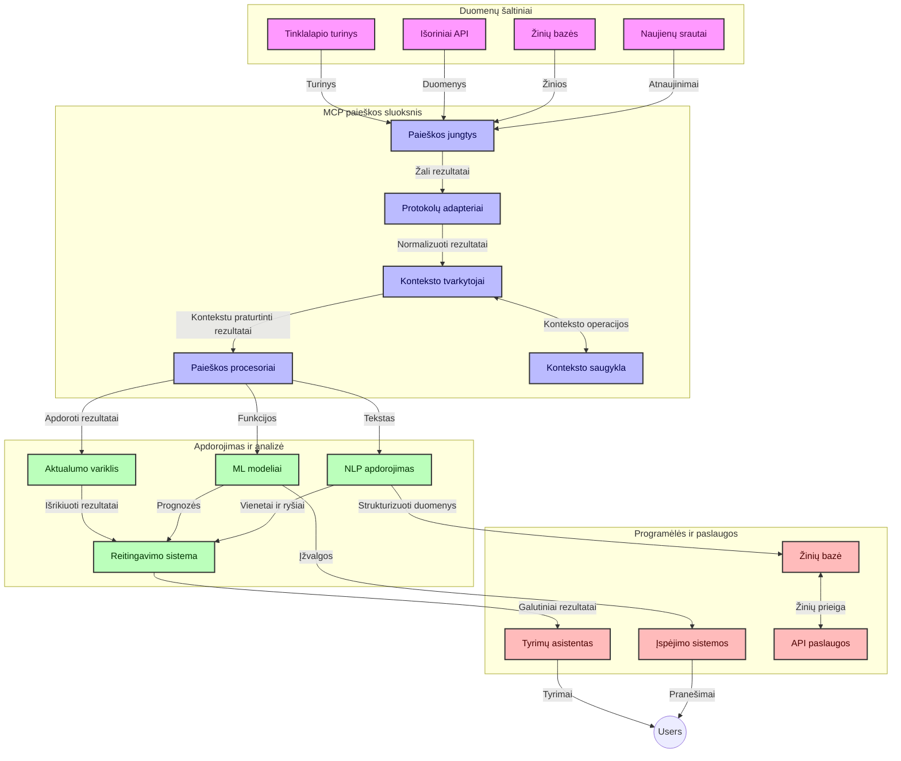
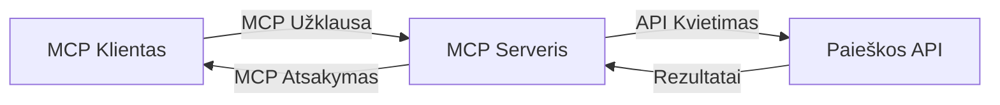
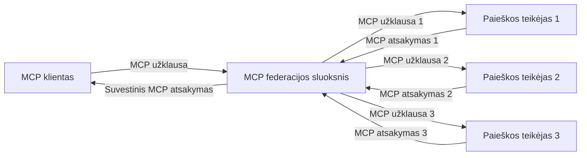
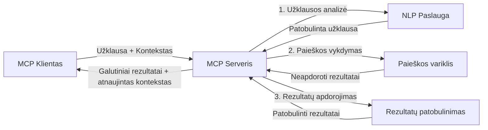

# Modelio konteksto protokolas realiojo laiko interneto paieškai

## Apžvalga

Realiojo laiko interneto paieška tapo esminė šiandieninėje informacijos valdomoje aplinkoje, kuriose programos turi nedelsiant gauti atnaujintą informaciją visame internete, kad pateiktų aktualius ir laiku tinkamus atsakymus. Modelio konteksto protokolas (MCP) reprezentuoja svarbų žingsnį realiojo laiko paieškos procesų optimizavimui, didinant paieškos efektyvumą, išlaikant konteksto vientisumą ir gerinant bendrą sistemos veikimą.

Šis modulis nagrinėja, kaip MCP transformuoja realiojo laiko interneto paiešką, suteikdamas standartizuotą konteksto valdymo požiūrį tarp dirbtinio intelekto modelių, paieškos variklių ir programų.

### Ką sužinosite

Išsamioje šioje pamokoje sužinosite:

- Kaip MCP sukuria sklandžią jungtį tarp dirbtinio intelekto modelių ir realiojo laiko interneto paieškos galimybių
- Architektūrinius modelius efektyvių ir masteliu pritaikomų paieškos sprendimų įgyvendinimui su MCP
- Technikas, kaip išlaikyti paieškos kontekstą kelių užklausų ir sąveikų metu
- Praktinius kodų pavyzdžius Python ir JavaScript įvairioms paieškos situacijoms
- Metodus, kaip subalansuoti aktualumą, naujumą ir našumą MCP pagrįstose paieškos sistemose

## Įvadas į realiojo laiko interneto paiešką

Realiojo laiko interneto paieška yra technologinis požiūris, leidžiantis nuolat vykdyti užklausas, apdoroti ir analizuoti internete esančią informaciją, kai ji skelbiama ar atnaujinama, taip suteikdama sistemoms galimybę pateikti šviežią ir aktualią informaciją su minimalia delsos trukme. Skirtingai nuo tradicinių paieškos sistemų, kurios veikia indeksuotų duomenų pagrindu, kurie gali būti kelių valandų ar dienų senumo, realiojo laiko paieškos apdoroja tiesioginius duomenis iš interneto, pristatydamos įžvalgas ir informaciją, atspindinčią dabartinę interneto turinio būklę.

### Pagrindinės realiojo laiko interneto paieškos sąvokos:

- **Nuolatinis užklausų apdorojimas**: Paieškos užklausos apdorojamos nuolat atnaujinamuose duomenų šaltiniuose
- **Naujumui skiriamas prioritetas**: Sistemos yra sukuriamos tokiu būdu, kad labiau vertintų naują informaciją
- **Aktualumo balansavimas**: Išlaikyti pusiausvyrą tarp aktualumo ir naujumo
- **Masteliu pritaikoma architektūra**: Sistemos turi sugebėti tvarkyti kintamą užklausų apkrovą ir duomenų kiekį
- **Konteksto supratimas**: Vartotojo konteksto išlaikymas per paieškos iteracijas yra labai svarbus prasmingiems rezultatams
- **Dinaminis užklausų pertvarkymas**: Užklausų adaptavimas remiantis kontekstu ir ankstesniais rezultatais
- **Daugių šaltinių integracija**: Rezultatų sujungimas iš kelių paieškos tiekėjų ir interneto šaltinių
- **Semantinis supratimas**: Užklausų ir turinio apdorojimas pagal reikšmę, o ne tik raktinius žodžius
- **Reitingavimas realiu laiku**: Rezultatų reitingų nuolatinis koregavimas, kai atsiranda nauja informacija

### Modelio konteksto protokolas ir realiojo laiko interneto paieška

Modelio konteksto protokolas (MCP) sprendžia kelias kritines problemas realiojo laiko interneto paieškos aplinkoje:

1. **Paieškos konteksto išsaugojimas**: MCP standartizuoja, kaip kontekstas išlaikomas tarp paskirstytų paieškos komponentų, užtikrinant, kad dirbtinio intelekto modeliai ir apdorojimo mazgai turi prieigą prie svarbios užklausų istorijos ir vartotojo nuostatų.

2. **Efektyvus užklausų valdymas**: Teikdamas struktūrizuotas mechanizmus konteksto perdavimui, MCP sumažina papildomą naštą pakartotinai įtraukiant kontekstą kiekvienoje paieškos iteracijoje.

3. **Suderinamumas**: MCP sukuria bendrą kalbą konteksto dalinimuisi tarp įvairių paieškos technologijų ir dirbtinio intelekto modelių, leidžiančią lanksčiau ir platesniam architektūrų taikymui.

4. **Paieškai optimizuotas kontekstas**: MCP įgyvendinimai gali prioritetizuoti, kurie konteksto elementai yra svarbiausi efektyviai paieškai, optimizuojant tiek našumą, tiek tikslumą.

5. **Adaptuojamas paieškos apdorojimas**: Tinkamai valdant kontekstą per MCP, paieškos sistemos gali dinamiškai koreguoti apdorojimą remiantis besivystančiais vartotojo poreikiais ir informacijos sąlygomis.

Šiuolaikinėse programose nuo naujienų agregavimo iki tyrimų pagalbininkų, MCP integracija su interneto paieškos technologijomis leidžia kurti išmanesnes, kontekstiškai informuotas paieškas, kurios teikia vis labiau aktualius rezultatus, kai vartotojų sąveikos tęsiasi.

## Mokymosi tikslai

Šios pamokos pabaigoje sugebėsite:

- Suprasti realiojo laiko interneto paieškos pagrindus ir jos iššūkius šiuolaikinėse programose
- Paaiškinti, kaip Modelio konteksto protokolas (MCP) pagerina realiojo laiko interneto paieškos galimybes
- Įgyvendinti MCP pagrįstus paieškos sprendimus naudojant populiarius karkasus ir API
- Suprojektuoti ir diegti mastelio pritaikomas, aukšto našumo paieškos architektūras su MCP
- Taikyti MCP koncepcijas įvairiuose panaudojimo atvejuose, įskaitant semantinę paiešką, tyrimų pagalbą ir DI papildomas naršymo galimybes
- Įvertinti atsirandančias tendencijas ir būsimus MCP pagrįstų paieškos technologijų inovacijas
- Kurti kontekstu pagrįstas paieškos sistemas, kurios mokosi iš vartotojų sąveikų
- Integruoti interneto paieškos galimybes į DI pagalbininkus naudojant standartizuotus MCP protokolus
- Kurti daugiapakopes paieškos grandines, kurios palaipsniui tobulina rezultatus remiantis kontekstu
- Optimizuoti paieškos našumą išlaikant išsamų konteksto suvokimą

### Apibrėžimas ir reikšmė

Realiojo laiko interneto paieška apima nuolatinį užklausų pateikimą, gavybą ir interneto pagrindu teikiamos informacijos pristatymą su minimaliu vėlavimu. Skirtingai nuo tradicinių paieškos variklių, kurie periodiškai naršo ir indeksuoja internetą, realiojo laiko paieška siekia pateikti informaciją iš karto, kai ji tampa prieinama, užtikrindama nedelsiamą prieigą prie pačios naujausios informacijos.

Pagrindinės realiojo laiko interneto paieškos savybės apima:

- **Šviežumą**: Naujausio turinio ir atnaujinimų prioritetizavimą
- **Nuolatinį apdorojimą**: Nuolatinį naujos informacijos stebėjimą
- **Užklausų adaptaciją**: Paieškos užklausų tobulinimą pagal kontekstą ir grįžtamąjį ryšį
- **Nedelsiamą pristatymą**: Paieškos rezultatų pateikimą su minimaliu vėlavimu
- **Konteksto išlaikymą**: Remiantis ankstesnėmis užklausomis, geresnio aktualumo kūrimui

### Iššūkiai tradicinėje interneto paieškoje

Tradiciniai interneto paieškos metodai susiduria su keliomis ribotumais taikydami realiojo laiko scenarijus:

1. **Konteksto fragmentacija**: Sunku išlaikyti paieškos kontekstą kelių užklausų metu
2. **Informacijos šviežumo iššūkiai**: Sunkumai prieigą prie ir naujausios informacijos prioritetizavimą
3. **Integracijos sudėtingumas**: Problemos dėl suderinamumo tarp paieškos sistemų ir programų
4. **Vėlavimo problemos**: Balansavimas tarp išsamios paieškos ir atsako laiko reikalavimų
5. **Aktualumo reguliavimas**: Tikslumo ir aktualumo užtikrinimas siekiant prioritetizuoti naujumą

## Modelio konteksto protokolo (MCP) supratimas paieškos kontekste

### Kas yra MCP paieškos kontekste?

Modelio konteksto protokolas (MCP) yra standartizuotas komunikacijos protokolas, sukurtas palengvinti efektyvų bendradarbiavimą tarp dirbtinio intelekto modelių ir programų. Realiojo laiko interneto paieškos kontekste MCP suteikia pagrindinę sistemą:

- Išlaikyti paieškos kontekstą per užklausų sekas
- Standartizuoti paieškos užklausų ir rezultatų formatus
- Optimizuoti paieškos parametrų ir rezultatų perdavimą
- Pagerinti modelio ir paieškos variklio komunikaciją

### Pagrindinės sudedamosios dalys ir architektūra

MCP architektūra realiojo laiko interneto paieškai susideda iš kelių pagrindinių komponentų:

1. **Užklausų konteksto valdytojai**: Tvarko ir palaiko paieškos kontekstą per kelias užklausas
2. **Paieškos procesoriai**: Apdoroja gaunamas paieškos užklausas, naudodami kontekstą atsižvelgiančias technikas
3. **Protokolo adapteriai**: Paverčia skirtingas paieškos API, išlaikydami kontekstą
4. **Konteksto saugykla**: Efektyviai saugo ir atkuria paieškos istoriją ir nuostatas
5. **Paieškos jungtys**: Jungiasi su įvairiais paieškos varikliais ir interneto API



### Kaip MCP gerina realiojo laiko interneto paiešką

MCP sprendžia tradicinių interneto paieškų iššūkius per:

- **Kontekstinę tęstinumą**: Išlaikydamas ryšius tarp užklausų per visą paieškos sesiją
- **Optimizuotą perdavimą**: Sumažindamas perteklinį paieškos parametrų kartojimą protingu konteksto valdymu
- **Standartizuotas sąsajas**: Teikdamas nuoseklias API paieškos komponentams
- **Sumažintą vėlavimą**: Minimalizuodamas apdorojimo naštą efektyviu konteksto tvarkymu
- **Pagerintą aktualumą**: Gerindamas paieškos aktualumą išlaikant vartotojo ketinimą per kelias užklausas

## Integracija ir įgyvendinimas

Realiojo laiko interneto paieškos sistemos reikalauja kruopštaus architektūrinio dizaino ir įgyvendinimo norint išlaikyti tiek našumą, tiek kontekstinį vientisumą. Modelio konteksto protokolas siūlo standartizuotą požiūrį į dirbtinio intelekto modelių ir paieškos technologijų integravimą, leidžiantį kurti sudėtingesnes, kontekstą suprantančias paieškos grandines.

### MCP integracijos apžvalga paieškos architektūrose

MCP įgyvendinimas realiojo laiko interneto paieškos aplinkose apima kelis svarbius aspektus:

1. **Paieškos konteksto serializacija**: MCP suteikia efektyvius mechanizmus kontekstinei informacijai koduoti paieškos užklausose, užtikrindamas, kad svarbus kontekstas paseka užklausą visame apdorojimo procese. Tai apima standartizuotus serializacijos formatus, optimizuotus paieškai reikalingiems metaduomenims.

2. **Būseną palaikantis paieškos apdorojimas**: MCP leidžia išmanesnį būseną palaikantį apdorojimą, išlaikant nuoseklų konteksto atvaizdavimą paieškos iteracijose. Tai ypač vertinga daugiapakopėse paieškos grandinėse, kur konteksto tobulinimas gerina rezultatus.

3. **Užklausų išplečiavimas ir tobulinimas**: MCP įgyvendinimai paieškos sistemose gali palengvinti sudėtingą užklausų išplečiavimą ir tobulinimą remiantis sukauptu kontekstu, leidžiant vis labiau aktualius rezultatus, kai paieškos sesija progresuoja.

4. **Rezultatų talpinimas ir prioritetizavimas**: Standartizuodamas konteksto tvarkymą, MCP padeda valdyti rezultatų talpinimą ir prioritetą, leidžiant komponentams prisitaikyti prie besikeičiančio paieškos konteksto.

5. **Paieškos federacija ir agregacija**: MCP palengvina pažangesnę paieškos federaciją per kelis backend'us, pateikdamas struktūrizuotus paieškos konteksto atvaizdavimus, leidžiančius reikšmingiau sujungti rezultatus iš įvairių šaltinių.

MCP įgyvendinimas įvairiose paieškos technologijose sukuria vieningą požiūrį į konteksto valdymą, sumažindamas poreikį rašyti individualų integracijos kodą ir kartu pagerindamas sistemos gebėjimą išlaikyti prasmingą kontekstą, kai keičiasi paieškos užklausos.

### MCP įvairiuose interneto paieškos įgyvendinimuose

Šie pavyzdžiai atitinka dabartinę MCP specifikaciją, kuri orientuota į JSON-RPC pagrindu veikiantį protokolą su skirtingais transportavimo mechanizmais. Kodas demonstruoja, kaip galite įgyvendinti pasirinktines paieškos integracijas išlaikydami visišką suderinamumą su MCP protokolu.


<details>
<summary>Python įgyvendinimas su bendruoju paieškos API</summary>

```python
import asyncio
import json
import aiohttp
from typing import Dict, Any, Optional, List
from contextlib import asynccontextmanager
from collections.abc import AsyncIterator

# Importuoti standartines MCP bibliotekas
from mcp.client.session import ClientSession
from mcp.client.streamable_http import streamablehttp_client
from mcp.types import TextContent, CreateMessageRequestParams, CreateMessageResult
from mcp.server.fastmcp import FastMCP

# Sukurti FastMCP serverį internetinėms paieškoms
search_server = FastMCP("WebSearch")

# Klasė, valdanti internetinės paieškos operacijas
class WebSearchHandler:
    def __init__(self, api_endpoint: str, api_key: str):
        self.api_endpoint = api_endpoint
        self.api_key = api_key
        self.session = None
        
    async def initialize(self):
        """Initialize the HTTP session"""
        self.session = aiohttp.ClientSession(
            headers={"Authorization": f"Bearer {self.api_key}"}
        )
    
    async def close(self):
        """Close the HTTP session"""
        if self.session:
            await self.session.close()
            
    async def perform_search(self, query: str, max_results: int = 5, 
                           include_domains: List[str] = None, 
                           exclude_domains: List[str] = None,
                           time_period: str = "any") -> Dict[str, Any]:
        """Perform web search using the search API"""
        # Sudaryti paieškos parametrus
        search_params = {
            "q": query,
            "limit": max_results,
            "time": time_period
        }
        
        if include_domains:
            search_params["site"] = ",".join(include_domains)
            
        if exclude_domains:
            search_params["exclude_site"] = ",".join(exclude_domains)
        
        # Vykdyti paieškos užklausą
        try:
            async with self.session.get(
                self.api_endpoint,
                params=search_params
            ) as response:
                if response.status != 200:
                    error_text = await response.text()
                    raise Exception(f"Search API error: {response.status} - {error_text}")
                
                search_data = await response.json()
                
                # Paversti API specifinį atsakymą į standartinį formatą
                results = []
                for item in search_data.get("results", []):
                    results.append({
                        "title": item.get("title", ""),
                        "url": item.get("url", ""),
                        "snippet": item.get("snippet", ""),
                        "date": item.get("published_date", ""),
                        "source": item.get("source", "")
                    })
                
                return {
                    "query": query,
                    "totalResults": len(results),
                    "results": results
                }
        except Exception as e:
            print(f"Search API request error: {e}")
            raise

# Inicijuoti paieškos valdytoją
search_handler = WebSearchHandler(
    api_endpoint="https://api.search-service.example/search",
    api_key="your-api-key-here"
)

# Nustatyti gyvenimo trukmę paieškos valdytojui valdyti
@asyncio.asynccontextmanager
async def app_lifespan(server: FastMCP):
    """Manage application lifecycle"""
    await search_handler.initialize()
    try:
        yield {"search_handler": search_handler}
    finally:
        await search_handler.close()

# Nustatyti serverio gyvenimo trukmę
search_server = FastMCP("WebSearch", lifespan=app_lifespan)

# Registruoti internetinės paieškos įrankį
@search_server.tool()
async def web_search(query: str, max_results: int = 5, 
                   include_domains: List[str] = None,
                   exclude_domains: List[str] = None,
                   time_period: str = "any") -> Dict[str, Any]:
    """
    Search the web for information
    
    Args:
        query: The search query
        max_results: Maximum number of results to return (default: 5)
        include_domains: List of domains to include in search results
        exclude_domains: List of domains to exclude from search results
        time_period: Time period for results ("day", "week", "month", "any")
        
    Returns:
        Dictionary containing search results
    """
    ctx = search_server.get_context()
    search_handler = ctx.request_context.lifespan_context["search_handler"]
    
    results = await search_handler.perform_search(
        query=query,
        max_results=max_results,
        include_domains=include_domains,
        exclude_domains=exclude_domains,
        time_period=time_period
    )
    
    return results

# Kliento naudojimo pavyzdys
async def client_example():
    # Prisijungti prie paieškos serverio naudojant Streamable HTTP transportą
    async with streamablehttp_client("http://localhost:8000/mcp") as (read, write, _):
        async with ClientSession(read, write) as session:
            # Inicijuoti ryšį
            await session.initialize()
            
            # Iškvieti web_search įrankį
            search_results = await session.call_tool(
                "web_search", 
                {
                    "query": "latest developments in AI and Model Context Protocol",
                    "max_results": 5,
                    "time_period": "day",
                    "include_domains": ["github.com", "microsoft.com"]
                }
            )
            
            print(f"Search results: {search_results}")

# Serverio vykdymo pavyzdys
if __name__ == "__main__":
    # Paleisti serverį su Streamable HTTP transportu
    search_server.run(transport="streamable-http")
```
</details> 

<details>
<summary>JavaScript įgyvendinimas su naršyklės pagrindu veikiančia paieška</summary>


```javascript
// MCP serverio įgyvendinimas internetinei paieškai
import { McpServer, ResourceTemplate } from '@modelcontextprotocol/sdk/server/mcp.js';
import { StreamableHTTPServerTransport } from '@modelcontextprotocol/sdk/server/streamableHttp.js';
import { z } from 'zod';

// Sukurti MCP serverį internetinei paieškai
const searchServer = new McpServer({
    name: "BrowserSearch",
    description: "A server that provides web search capabilities"
});

// Paieškos paslaugos klasė
class SearchService {
    constructor(searchApiUrl, apiKey) {
        this.searchApiUrl = searchApiUrl;
        this.apiKey = apiKey;
    }

    async performSearch(parameters) {
        const {
            query = '',
            maxResults = 5,
            includeDomains = [],
            excludeDomains = [],
            timePeriod = 'any'
        } = parameters;
        
        // Sukurti paieškos URL su parametrais
        const url = new URL(this.searchApiUrl);
        url.searchParams.append('q', query);
        url.searchParams.append('limit', maxResults);
        url.searchParams.append('time', timePeriod);
        
        if (includeDomains.length > 0) {
            url.searchParams.append('site', includeDomains.join(','));
        }
        
        if (excludeDomains.length > 0) {
            url.searchParams.append('exclude_site', excludeDomains.join(','));
        }
        
        try {
            const response = await fetch(url.toString(), {
                method: 'GET',
                headers: {
                    'Authorization': `Bearer ${this.apiKey}`,
                    'Content-Type': 'application/json'
                }
            });
            
            if (!response.ok) {
                const errorText = await response.text();
                throw new Error(`Search API error: ${response.status} - ${errorText}`);
            }
            
            const searchData = await response.json();
            
            // Paversti API-specifinį atsakymą į standartinį formatą
            const results = searchData.results?.map(item => ({
                title: item.title || '',
                url: item.url || '',
                snippet: item.snippet || '',
                date: item.published_date || '',
                source: item.source || ''
            })) || [];
            
            return {
                query,
                totalResults: results.length,
                results
            };
        } catch (error) {
            console.error('Search API request error:', error);
            throw error;
        }
    }
}

// Inicializuoti paieškos paslaugą
const searchService = new SearchService(
    'https://api.search-service.example/search',
    'your-api-key-here'
);

// Nustatyti konteksto tiekėją serveriui
searchServer.setContextProvider(() => {
    return {
        searchService
    };
});

// Registruoti internetinės paieškos įrankį
searchServer.tool({
    name: 'web_search',
    description: 'Search the web for information',
    parameters: {
        type: 'object',
        properties: {
            query: {
                type: 'string',
                description: 'The search query'
            },
            maxResults: {
                type: 'integer',
                description: 'Maximum number of results to return',
                default: 5
            },
            includeDomains: {
                type: 'array',
                items: { type: 'string' },
                description: 'List of domains to include in search results'
            },
            excludeDomains: {
                type: 'array',
                items: { type: 'string' },
                description: 'List of domains to exclude from search results'
            },
            timePeriod: {
                type: 'string',
                description: 'Time period for results',
                enum: ['day', 'week', 'month', 'any'],
                default: 'any'
            }
        },
        required: ['query']
    },
    handler: async (params, context) => {
        const { searchService } = context;
        return await searchService.performSearch(params);
    }
});

// Pavyzdinis kliento kodas prisijungti prie paieškos serverio
import { Client } from '@modelcontextprotocol/sdk/client/index.js';
import { StreamableHTTPClientTransport } from '@modelcontextprotocol/sdk/client/streamableHttp.js';

async function connectToSearchServer() {
    // Prisijungti prie paieškos serverio
    const transport = new StreamableHTTPClientTransport(
        new URL('http://localhost:8000/mcp')
    );
    
    const client = new Client({
        name: 'search-client',
        version: '1.0.0'
    });
    
    await client.connect(transport);
    
    // Vykdyti paieškos įrankį
    const searchResults = await client.callTool({
        name: 'web_search',
        arguments: {
            query: 'Model Context Protocol implementation examples',
            maxResults: 10,
            timePeriod: 'week',
            includeDomains: ['github.com', 'docs.microsoft.com']
        }
    });
    
    console.log('Search results:', searchResults);
    
    // Išvalymas
    await client.disconnect();
}

// Paleisti serverį
const transport = new StreamableHTTPServerTransport();
await searchServer.connect(transport);
console.log('Search server running at http://localhost:8000/mcp');

// Atskirame procese arba po serverio paleidimo
// connectToSearchServer().catch(console.error);
```
</details> 


## Kodo pavyzdžių atsakomybės apribojimas

> **Svarbi pastaba**: Toliau pateikti kodo pavyzdžiai demonstruoja Modelio konteksto protokolo (MCP) integraciją su interneto paieškos funkcija. Nors jie laikosi oficialių MCP SDK modelių ir struktūrų, jie supaprastinti mokomaisiais tikslais.
> 
> Šie pavyzdžiai demonstruoja:
> 
> 1. **Python įgyvendinimas**: FastMCP serverio įgyvendinimas, kuris suteikia interneto paieškos įrankį ir jungiasi prie išorinės paieškos API. Šis pavyzdys iliustruoja tinkamą gyvavimo trukmės valdymą, konteksto tvarkymą bei įrankių įgyvendinimą, laikantis [oficialaus MCP Python SDK](https://github.com/modelcontextprotocol/python-sdk) modelių. Serveris naudoja rekomenduojamą Streamable HTTP transportą, kuris pakeitė senesnį SSE transportą gamybinėse diegimuose.
> 
> 2. **JavaScript įgyvendinimas**: TypeScript/JavaScript įgyvendinimas, naudodamas FastMCP šabloną iš [oficialaus MCP TypeScript SDK](https://github.com/modelcontextprotocol/typescript-sdk), sukūrantis paieškos serverį su tinkamais įrankių apibrėžimais ir klientų jungtimis. Jis laikosi naujausių rekomenduojamų sesijų valdymo ir konteksto išsaugojimo modelių.
> 
> Šie pavyzdžiai produkciniam naudojimui reikalaus papildomo klaidų valdymo, autentifikacijos ir specifinio API integracijos kodo. Parodyti paieškos API galiniai taškai (`https://api.search-service.example/search`) yra vietos rezervacijos simboliai ir turi būti pakeisti tikrais paieškos paslaugų galiniais URL.
> 
> Pilniems įgyvendinimo duomenims ir naujausioms prieigoms, prašome kreiptis į [oficialią MCP specifikaciją](https://spec.modelcontextprotocol.io/) ir SDK dokumentaciją.

## Pagrindinės sąvokos

### Modelio konteksto protokolo (MCP) pagrindas

Pagrindas MCP suteikia standartizuotą būdą dirbtinio intelekto modeliams, programoms ir paslaugoms keistis kontekstu. Realiojo laiko interneto paieškoje šis pagrindas yra esminis kuriant nuoseklias, daug etapų turinčias paieškos patirtis. Pagrindiniai komponentai yra:

1. **Klientų-serverių architektūra**: MCP nustato aiškią atskirtį tarp paieškos klientų (užklausiančiųjų) ir paieškos serverių (teikėjų), leidžiančią lankstų diegimo modelį.

2. **JSON-RPC komunikacija**: Protokolas naudoja JSON-RPC žinučių mainams, todėl yra suderinamas su interneto technologijomis ir lengvai įgyvendinamas įvairiose platformose.

3. **Konteksto valdymas**: MCP apibrėžia struktūrizuotus metodus kontekstui išlaikyti, atnaujinti ir naudoti keliuose sąveikos etapuose.

4. **Įrankių apibrėžimai**: Paieškos galimybės pateikiamos kaip standartizuoti įrankiai su aiškiai apibrėžtais parametrais ir grąžinamomis reikšmėmis.

5. **Srautinio duomenų palaikymas**: Protokolas palaiko rezultatų srautą, kas yra būtina realiojo laiko paieškai, kai rezultatai gali atkeliauti palaipsniui.

### Interneto paieškos integracijos modeliai

Integruodami MCP su interneto paieška, atsiranda keli modeliai:

#### 1. Tiesioginė paieškos tiekėjo integracija



Šiame modelyje MCP serveris tiesiogiai sąveikauja su viena ar keliomis paieškos API, verčia MCP užklausas į API specifinius kvietimus ir formatuoja rezultatus kaip MCP atsakymus.

#### 2. Federuota paieška su konteksto išsaugojimu



Šis modelis paskirsto paieškos užklausas keliems MCP suderinamiems paieškos tiekėjams, kurie gali specializuotis skirtinguose turinio ar paieškos galimybių segmentuose, išlaikant vieningą kontekstą.

#### 3. Kontekstą praturtinta paieškos grandinė



Šiame modelyje paieškos procesas dalomas į kelis etapus, kuriuose kontekstas yra papildomas kiekviename žingsnyje, gaunant palaipsniui vis aktualesnius rezultatus.

### Paieškos konteksto komponentai

MCP pagrįstoje interneto paieškoje kontekstas paprastai apima:

- **Užklausų istoriją**: Ankstesnes užklausas sesijos metu
- **Vartotojo nuostatas**: Kalbą, regioną, saugios paieškos nustatymus
- **Sąveikos istoriją**: Kurie rezultatai buvo paspausti, laikas praleistas su rezultatais
- **Paieškos parametrus**: Filtrus, rūšiavimo eilę ir kitus paieškos modifikatorius
- **Teminį žinių pagrindą**: Temomis susijusį kontekstą, aktualų paieškai
- **Laiko kontekstą**: Laiko pagrindu aktualių veiksnių įtaką
- **Šaltinių nuostatas**: Patikimus ar pageidaujamus informacijos šaltinius

## Naudojimo atvejai ir taikymo sritys

### Tyrimai ir informacijos rinkimas

MCP pagerina tyrimų darbo eigos procesus per:

- Tyrimų konteksto išlaikymą paieškos sesijų metu
- Labiau sudėtingų ir kontekstualiai aktualių užklausų galimybę
- Daugių šaltinių paieškos federacijos palaikymą
- Pagalbinio žinių išgavimą iš paieškos rezultatų

### Realiojo laiko naujienų ir tendencijų stebėjimas

MCP pagrįsta paieška siūlo privalumus naujienų stebėjimui:

- Naujų naujienų istorijų beveik realiu laiku atradimą
- Kontekstinį aktualios informacijos filtravimą
- Temų ir subjektų sekimą iš kelių šaltinių
- Personalizuotas naujienų pranešimas pagal vartotojo kontekstą

### DI papildomas naršymas ir tyrimai

MCP kuria naujas galimybes DI papildomam naršymui:

- Kontekstualias paieškos rekomendacijas, remiantis dabartine naršyklės veikla
- Sklandžią interneto paieškų integraciją su LLM pagrįstais asistentais
- Daugiapakopį paieškos tobulinimą su konteksto išlaikymu
- Pagerintą faktų tikrinimą ir informacijos patikrinimą

## Ateities tendencijos ir inovacijos

### MCP evoliucija interneto paieškoje

Žvelgiant į ateitį, tikimasi, kad MCP vystysis sprendžiant:


- **Daugiakanalė Paieška**: Teksto, vaizdo, garso ir vaizdo paieškos integravimas su konteksto išsaugojimu
- **Decentralizuota Paieška**: Palaikymas paskirstytoms ir federuotoms paieškos ekosistemoms
- **Paieškos Privatumas**: Kontekstą atitinkančios privatumo saugančios paieškos mechanizmai
- **Užklausų Supratimas**: Gilaus semantinio natūralios kalbos paieškos užklausų analizės taikymas

### Galimi Technologijų Pažangumo Būdai

Naujos technologijos, kurios formuos MCP paieškos ateitį:

1. **Neuroniniai Paieškos Architektūros**: Įtvirtintos paieškos sistemos, optimizuotos MCP
2. **Personalizuotas Paieškos Kontekstas**: Individualių vartotojų paieškos modelių mokymasis laikui bėgant
3. **Žinių Grafų Integracija**: Kontekstinė paieška, praturtinta domeno specifinių žinių grafais
4. **Tarpmodalinis Kontekstas**: Konteksto palaikymas įvairiose paieškos modalumose

## Praktinės Užduotys

### Užduotis 1: Bazinės MCP Paieškos Vamzdyno Sukūrimas

Šioje užduotyje sužinosite, kaip:
- Konfigūruoti bazinę MCP paieškos aplinką
- Įgyvendinti konteksto tvarkyklius interneto paieškai
- Išbandyti ir patvirtinti konteksto išsaugojimą paieškos iteracijų metu

### Užduotis 2: Tyrimų Asistento Kūrimas su MCP Paieška

Sukurkite pilną programą, kuri:
- Apdoroja natūralios kalbos tyrimų klausimus
- Atlieka kontekstinę interneto paiešką
- Sintezuoja informaciją iš kelių šaltinių
- Pateikia organizuotus tyrimų rezultatus

### Užduotis 3: Multi-Šaltinių Paieškos Federacijos Įgyvendinimas su MCP

Pažangi užduotis, apimanti:
- Kontekstinį užklausų siuntimą kelioms paieškos sistemoms
- Rezultatų reitingavimą ir agregaciją
- Kontekstinę paieškos rezultatų dublikavimo šalinimą
- Šaltinių specifinių metaduomenų tvarkymą

## Papildomi Ištekliai

- [Model Context Protocol Specifications](https://spec.modelcontextprotocol.io/) - Oficialios MCP specifikacijos ir išsami protokolo dokumentacija
- [Model Context Protocol Dokumentacija](https://modelcontextprotocol.io/) - Išsamūs mokymai ir įgyvendinimo vadovai
- [MCP Python SDK](https://github.com/modelcontextprotocol/python-sdk) - Oficialus MCP protokolo Python įgyvendinimas
- [MCP TypeScript SDK](https://github.com/modelcontextprotocol/typescript-sdk) - Oficialus MCP protokolo TypeScript įgyvendinimas
- [MCP Referenciniai Serveriai](https://github.com/modelcontextprotocol/servers) - MCP serverių referenciniai įgyvendinimai
- [Bing Interneto Paieškos API Dokumentacija](https://learn.microsoft.com/en-us/bing/search-apis/bing-web-search/overview) - Microsoft interneto paieškos API
- [Google Custom Search JSON API](https://developers.google.com/custom-search/v1/overview) - „Google“ programuojamoji paieškos sistema
- [SerpAPI Dokumentacija](https://serpapi.com/search-api) - Paieškos variklių rezultatų puslapio API
- [Meilisearch Dokumentacija](https://www.meilisearch.com/docs) - Atvirojo kodo paieškos variklis
- [Elasticsearch Dokumentacija](https://www.elastic.co/guide/index.html) - Paskirstyta paieškos ir analizės sistema
- [LangChain Dokumentacija](https://python.langchain.com/docs/get_started/introduction) - Programų kūrimas su LLM

## Mokymosi Rezultatai

Užbaigus šį modulį, galėsite:

- Suprasti realaus laiko interneto paieškos pagrindus ir iššūkius
- Paaiškinti, kaip Model Context Protocol (MCP) pagerina realaus laiko interneto paieškos galimybes
- Įgyvendinti MCP pagrindu veikiančius paieškos sprendimus naudojant populiarias sistemas ir API
- Kurti ir diegti mastelio keičiamas, aukštos spartos paieškos architektūras su MCP
- Taikyti MCP koncepcijas įvairiose srityse, įskaitant semantinę paiešką, tyrimų pagalbą ir AI praturtintą naršymą
- Vertinti naujas tendencijas ir būsimus MCP pagrindu veikiančių paieškos technologijų inovacijas


### Patikimumo ir Saugumo Aspektai

Įgyvendinant MCP pagrindu veikiančius interneto paieškos sprendimus, atminkite šias svarbias MCP specifikacijos principas:

1. **Vartotojo Sutikimas ir Kontrolė**: Vartotojai privalo aiškiai sutikti ir suprasti visą duomenų pasiekiamumą ir veiksmus. Tai ypač svarbu interneto paieškos įgyvendinimams, kurie gali pasiekti išorinius duomenų šaltinius.

2. **Duomenų Privatumas**: Užtikrinkite tinkamą paieškos užklausų ir rezultatų tvarkymą, ypač jei jie gali turėti jautrios informacijos. Įgyvendinkite tinkamus prieigos valdymus, kad apsaugotumėte vartotojų duomenis.

3. **Įrankių Saugumas**: Įgyvendinkite tinkamą įrankių autorizaciją ir patikrinimą, nes jie gali kelti saugumo riziką dėl savavališko kodo vykdymo. Įrankių elgesio aprašymai turi būti laikomi nepatikimais, nebent gauti iš patikimo serverio.

4. **Aiški Dokumentacija**: Pateikite aiškią dokumentaciją apie MCP pagrindu veikiančios paieškos galimybes, apribojimus ir saugumo aspektus, laikydamiesi MCP specifikacijos įgyvendinimo gairių.

5. **Tvirti Sutikimo Srautai**: Kurkite tvirtus sutikimo ir autorizacijos srautus, kurie aiškiai paaiškina, ką kiekvienas įrankis atlieka prieš leidžiant jį naudoti, ypač kai įrankiai jungiasi prie išorinių interneto išteklių.

Išsamią informaciją apie MCP saugumą ir patikimumo aspektus rasite [oficialioje dokumentacijoje](https://modelcontextprotocol.io/specification/2025-11-25/basic/security_best_practices).

## Kas toliau

- [5.12 Entra ID autentifikacija Model Context Protocol serveriams](../mcp-security-entra/README.md)

---

<!-- CO-OP TRANSLATOR DISCLAIMER START -->
**Atsakomybės apribojimas**:
Šis dokumentas buvo išverstas naudojant dirbtinio intelekto vertimo paslaugą [Co-op Translator](https://github.com/Azure/co-op-translator). Nors siekiame tikslumo, prašome atkreipti dėmesį, kad automatiniai vertimai gali turėti klaidų ar netikslumų. Originalus dokumentas jo gimtąja kalba laikomas autoritetingu šaltiniu. Svarbiai informacijai rekomenduojama naudoti profesionalų žmogiškąjį vertimą. Mes neatsakome už jokius nesusipratimus ar neteisingą interpretaciją, kilusią naudojantis šiuo vertimu.
<!-- CO-OP TRANSLATOR DISCLAIMER END -->