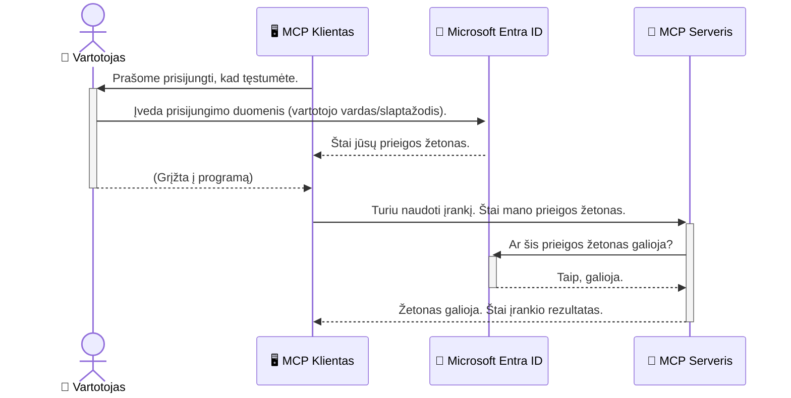

# Dirbtinio intelekto darbo eigų užtikrinimas: Entra ID autentifikavimas Model Context Protocol serveriams

> [!NOTE]
> Šios pamokos nuotolinio serverio kodas saugo paveldėtus `/sse` ir `/message`
> galinius taškus ir taikosi į MCP `2025-11-25`. Išlaikykite jo tapatybės ir žetonų patikros
> praktiką, tačiau naujiems įgyvendinimams naudokite `2026-07-28` suderinamą Streamable HTTP transportą.


## Įvadas
Model Context Protocol (MCP) serverio apsauga yra tokia pat svarbi kaip jūsų namų priekinės durys. Palikus MCP serverį atvirą, jūsų įrankiai ir duomenys tampa prieinami neįgaliotiems asmenims, kas gali sukelti saugumo pažeidimus. Microsoft Entra ID suteikia tvirtą debesų pagrindu veikiančią tapatybės ir prieigos valdymo sprendimą, užtikrinantį, kad su jūsų MCP serveriu gali sąveikauti tik įgalioti vartotojai ir programos. Šioje dalyje sužinosite, kaip apsaugoti savo DI darbo eigas naudojant Entra ID autentifikavimą.

## Mokymosi tikslai
Pasibaigus šiai daliai, mokėsite:

- Suprasti MCP serverių apsaugos svarbą.
- Paaiškinti Microsoft Entra ID ir OAuth 2.0 autentifikavimo pagrindus.
- Atpažinti skirtumą tarp viešųjų ir konfidencialių klientų.
- Įgyvendinti Entra ID autentifikavimą tiek vietinių (viešųjų klientų), tiek nuotolinių (konfidencialių klientų) MCP serverių scenarijuose.
- Taikyti saugumo geriausias praktikas kuriant DI darbo eigas.

## Saugumas ir MCP

Kaip nedrįstumėte palikti savo namų priekinės durų atrakintas, taip neturėtumėte palikti atviro MCP serverio, prieinamo bet kam. DI darbo eigų apsauga būtina kuriant tvirtas, patikimas ir saugias programas. Ši skiltis supažindins su Microsoft Entra ID naudojimu MCP serverių apsaugai, užtikrinant, kad tik įgalioti vartotojai ir programos galėtų sąveikauti su jūsų įrankiais ir duomenimis.

## Kodėl saugumas svarbus MCP serveriams

Įsivaizduokite, kad jūsų MCP serveris turi įrankį, kuris gali siųsti el. laiškus ar prieiti prie klientų duomenų bazės. Nesaugus serveris reikštų, kad bet kas galėtų naudoti tą įrankį, kas gali lemti neautorizuotą prieigą prie duomenų, šlamštą ar kitą kenksmingą veiklą.

Įgyvendindami autentifikavimą užtikrinate, kad kiekvienas serverio užklausa yra patikrinta, patvirtinanti užklausą siunčiančio vartotojo ar programos tapatybę. Tai yra pirmas ir svarbiausias žingsnis saugant jūsų DI darbo eigas.

## Įvadas į Microsoft Entra ID

[**Microsoft Entra ID**](https://adoption.microsoft.com/microsoft-security/entra/) yra debesų pagrindu veikianti tapatybės ir prieigos valdymo paslauga. Įsivaizduokite ją kaip universalų saugos sargą jūsų programoms. Ji atlieka sudėtingą vartotojų tapatybės patvirtinimo (autentifikavimo) ir teisės veikti nustatymo (autorizavimo) procesą.

Naudodami Entra ID galite:

- Užtikrinti saugų prisijungimą vartotojams.
- Apsaugoti API ir paslaugas.
- Valdyti prieigos politikas iš vienos centrinės vietos.

MCP serveriams Entra ID suteikia tvirtą ir plačiai patikimą sprendimą valdyti, kas gali naudotis jūsų serverio galimybėmis.

---

## Kaip veikia Entra ID autentifikavimas

Entra ID naudoja atvirus standartus, tokius kaip **OAuth 2.0**, autentifikavimui tvarkyti. Nors detalės gali būti sudėtingos, pagrindinė idėja yra paprasta ir ją galima suprasti per analogiją.

### Švelnus įvadas į OAuth 2.0: valet raktas

Įsivaizduokite OAuth 2.0 kaip valet paslaugą jūsų automobiliui. Atvykę į restoraną, jums nereikia duoti valet darbuotojui pagrindinių rakto. Vietoje to pateikiate **valet raktą**, kuris turi ribotas teises – gali užvesti automobilį ir užrakinti duris, bet negali atidaryti bagažinės ar pirštininės skyrelio.

Šioje analogijoje:

- **Jūs** esate **Vartotojas**.
- **Jūsų automobilis** yra **MCP serveris** su vertingais įrankiais ir duomenimis.
- **Valet** yra **Microsoft Entra ID**.
- **Parkavimo darbuotojas** yra **MCP klientas** (programa, norinti prieiti prie serverio).
- **Valet raktas** yra **Prieigos žetonas**.

Prieigos žetonas yra saugus tekstinis eilutė, kurią MCP klientas gauna iš Entra ID prisijungus. Klientas tada pateikia šį žetoną MCP serveriui su kiekviena užklausa. Serveris gali patikrinti žetoną, kad užtikrintų užklausos teisėtumą ir kliento teisę vykdyti veiksmus, visa tai nevaldyti jūsų tikrųjų prisijungimo duomenų (pvz., slaptažodžio).

### Autentifikavimo eiga

Štai kaip šis procesas veikia praktikoje:



### Susipažinimas su Microsoft Authentication Library (MSAL)

Prieš pradedant nagrinėti kodą svarbu pristatyti pagrindinę komponentę, kurią matysite pavyzdžiuose: **Microsoft Authentication Library (MSAL)**.

MSAL yra Microsoft sukurta biblioteka, kuri daug palengvina kūrėjų darbą valdant autentifikavimą. Vietoje to, kad rašytumėte sudėtingą kodą saugumo žetonams, prisijungimų valdymui ir sesijų atnaujinimui, MSAL atlieka šią sudėtingą darbą už jus.

Rekomenduojama naudoti tokią biblioteką kaip MSAL, nes ji:

- **Yra saugi:** įgyvendina pramonės standartus ir geriausias saugumo praktikas, sumažindama silpnybių riziką jūsų kode.
- **Palengvina kūrimą:** abstrahuoja OAuth 2.0 ir OpenID Connect sudėtingumą, leidžiant pridėti tvirtą autentifikavimą su vos keliais kodo sakiniais.
- **Yra prižiūrima:** Microsoft aktyviai palaiko ir atnaujina MSAL, spręsdama naujas saugumo grėsmes ir platformų pokyčius.

MSAL palaiko daugybę programavimo kalbų ir programų karkasų, įskaitant .NET, JavaScript/TypeScript, Python, Java, Go ir mobiliąsias platformas kaip iOS ir Android. Tai reiškia, kad tą patį autentifikavimo modelį galite naudoti visame savo technologijų rinkinyje.

Norėdami sužinoti daugiau apie MSAL, galite peržiūrėti oficialią [MSAL apžvalgos dokumentaciją](https://learn.microsoft.com/entra/identity-platform/msal-overview).

---

## Kaip apsaugoti MCP serverį su Entra ID: žingsnis po žingsnio

Dabar pereikime prie to, kaip apsaugoti vietinį MCP serverį (komunikuojantį per `stdio`) naudojant Entra ID. Šiame pavyzdyje naudojamas **viešasis klientas**, tinkamas programoms, veikiančioms vartotojo kompiuteryje, kaip darbalaukio programa ar vietinis kūrimo serveris.

### Scenarijus 1: Vietinio MCP serverio apsauga (su viešuoju klientu)

Šiame scenarijuje apžvelgsime vietinį MCP serverį, kuris komunikuoja per `stdio` ir naudoja Entra ID vartotojo autentifikavimui prieš leidžiant naudotis jo įrankiais. Serveryje bus vienas įrankis, gaunantis vartotojo profilio informaciją iš Microsoft Graph API.

#### 1. Programos registracija Entra ID

Prieš rašant kodą, turite užregistruoti savo programą Microsoft Entra ID. Tai leidžia Entra ID žinoti apie jūsų programą ir suteikia leidimą naudotis autentifikavimo paslauga.

1. Eikite į **[Microsoft Entra portalą](https://entra.microsoft.com/)**.
2. Pasirinkite **App registrations** ir spauskite **New registration**.
3. Suteikite programai pavadinimą (pvz., "Mano vietinis MCP serveris").
4. Skiltyje **Supported account types** pasirinkite **Accounts in this organizational directory only**.
5. Šiam pavyzdžiui galima palikti **Redirect URI** tuščią.
6. Spauskite **Register**.

Užsiregistravus užsirašykite **Application (client) ID** ir **Directory (tenant) ID**. Šių reikės jūsų kode.

#### 2. Kodo dalys: apžvalga

Pažvelkime į pagrindines kodo dalis, kurios tvarko autentifikavimą. Pilną šio pavyzdžio kodą rasite [Entra ID - Local - WAM](https://github.com/Azure-Samples/mcp-auth-servers/tree/main/src/entra-id-local-wam) aplanke [mcp-auth-servers GitHub saugykloje](https://github.com/Azure-Samples/mcp-auth-servers).

**`AuthenticationService.cs`**

Ši klasė atsakinga už bendravimą su Entra ID.

- **`CreateAsync`**: šis metodas inicijuoja MSAL bibliotekos `PublicClientApplication`. Jis yra konfigūruotas su jūsų programos `clientId` ir `tenantId`.
- **`WithBroker`**: įjungia brokerio (pvz., Windows Web Account Manager) naudojimą, kas suteikia saugesnę ir vientisesnę prisijungimo patirtį.
- **`AcquireTokenAsync`**: tai pagrindinis metodas. Pirmiausia jis bando tyliu būdu gauti žetoną (vartotojui nereikia vėl prisijungti, jei sesija yra galiojanti). Jei tylaus žetono negalima gauti, vartotojui bus siūloma prisijungti interaktyviai.

```csharp
// Simplified for clarity
public static async Task<AuthenticationService> CreateAsync(ILogger<AuthenticationService> logger)
{
    var msalClient = PublicClientApplicationBuilder
        .Create(_clientId) // Your Application (client) ID
        .WithAuthority(AadAuthorityAudience.AzureAdMyOrg)
        .WithTenantId(_tenantId) // Your Directory (tenant) ID
        .WithBroker(new BrokerOptions(BrokerOptions.OperatingSystems.Windows))
        .Build();

    // ... cache registration ...

    return new AuthenticationService(logger, msalClient);
}

public async Task<string> AcquireTokenAsync()
{
    try
    {
        // Try silent authentication first
        var accounts = await _msalClient.GetAccountsAsync();
        var account = accounts.FirstOrDefault();

        AuthenticationResult? result = null;

        if (account != null)
        {
            result = await _msalClient.AcquireTokenSilent(_scopes, account).ExecuteAsync();
        }
        else
        {
            // If no account, or silent fails, go interactive
            result = await _msalClient.AcquireTokenInteractive(_scopes).ExecuteAsync();
        }

        return result.AccessToken;
    }
    catch (Exception ex)
    {
        _logger.LogError(ex, "An error occurred while acquiring the token.");
        throw; // Optionally rethrow the exception for higher-level handling
    }
}
```

**`Program.cs`**

Čia yra nustatomas MCP serveris ir integruojama autentifikavimo paslauga.

- **`AddSingleton<AuthenticationService>`**: registruojamas `AuthenticationService` su priklausomybių injekcijos konteineriu, kad jį galėtų naudoti kitos programos dalys (pvz., mūsų įrankis).
- **`GetUserDetailsFromGraph` įrankis**: šiam įrankiui reikia `AuthenticationService` instancijos. Prieš žengdama bet kokį žingsnį, jis kviečia `authService.AcquireTokenAsync()` norėdamas gauti galiojantį prieigos žetoną. Jei autentifikacija sėkminga, žetonas naudojamas kvietimui Microsoft Graph API ir vartotojo duomenų gavimui.

```csharp
// Simplified for clarity
[McpServerTool(Name = "GetUserDetailsFromGraph")]
public static async Task<string> GetUserDetailsFromGraph(
    AuthenticationService authService)
{
    try
    {
        // This will trigger the authentication flow
        var accessToken = await authService.AcquireTokenAsync();

        // Use the token to create a GraphServiceClient
        var graphClient = new GraphServiceClient(
            new BaseBearerTokenAuthenticationProvider(new TokenProvider(authService)));

        var user = await graphClient.Me.GetAsync();

        return System.Text.Json.JsonSerializer.Serialize(user);
    }
    catch (Exception ex)
    {
        return $"Error: {ex.Message}";
    }
}
```

#### 3. Kaip tai veikia kartu

1. Kai MCP klientas bando naudoti `GetUserDetailsFromGraph` įrankį, įrankis pirma iškviečia `AcquireTokenAsync`.
2. `AcquireTokenAsync` inicijuoja MSAL biblioteką patikrinti galiojantį žetoną.
3. Jei žetonas nerandamas, MSAL per brokerį paprašo vartotojo prisijungti su Entra ID paskyra.
4. Prisijungus vartotojui, Entra ID išduoda prieigos žetoną.
5. Įrankis gauna žetoną ir naudoja jį saugiam kvietimui Microsoft Graph API.
6. Vartotojo duomenys grąžinami MCP klientui.

Šis procesas užtikrina, kad įrankį gali naudoti tik autentifikuoti vartotojai, efektyviai apsaugant vietinį MCP serverį.

### Scenarijus 2: Nuotolinio MCP serverio apsauga (su konfidencialiu klientu)

Kai jūsų MCP serveris veikia nuotoliniame kompiuteryje (pvz., debesų serveryje) ir komunikuoja per tokį protokolą kaip HTTP Streaming, saugumo reikalavimai skiriasi. Tokiu atveju turėtumėte naudoti **konfidencialų klientą** ir **Authorization Code Flow**. Tai saugesnis metodas, nes programos paslaptys niekada nėra atskleidžiamos naršyklei.

Šis pavyzdys naudoja TypeScript pagrindu veikiantį MCP serverį, kuris naudoja Express.js HTTP užklausoms tvarkyti.

#### 1. Programos registracija Entra ID

Registracija Entra ID yra panaši kaip viešajam klientui, bet yra viena esminė skirtis: reikia sukurti **kliento slaptą raktą**.

1. Eikite į **[Microsoft Entra portalą](https://entra.microsoft.com/)**.
2. Savo programos registracijoje eikite į **Certificates & secrets** skirtuką.
3. Spauskite **New client secret**, įveskite aprašymą ir spauskite **Add**.
4. **Svarbu:** iš karto nukopijuokite slaptą reikšmę. Jos daugiau negalėsite peržiūrėti.
5. Taip pat reikia sukonfigūruoti **Redirect URI**. Eikite į **Authentication** skirtuką, spauskite **Add a platform**, pasirinkite **Web** ir įveskite programos nukreipimo URI (pvz., `http://localhost:3001/auth/callback`).

> **⚠️ Svarbi saugumo pastaba:** gamybos programoms Microsoft labai rekomenduoja naudoti **autentifikavimą be slaptažodžių**, tokius kaip **Managed Identity** arba **Workload Identity Federation**, o ne kliento slaptuosius raktus. Klientų slaptieji raktai kelia saugumo riziką, nes gali būti atskleisti arba pažeisti. Valdomos tapatybės suteikia saugesnį būdą pašalinant poreikį saugoti kredencialus kode ar konfigūracijoje.
>
> Daugiau informacijos apie valdomas tapatybes ir jų įgyvendinimą rasite [Valdomų tapatybių Azure ištekliais apžvalgoje](https://learn.microsoft.com/entra/identity/managed-identities-azure-resources/overview).

#### 2. Kodo dalys: apžvalga

Šis pavyzdys naudoja sesijomis pagrįstą metodą. Prisijungus vartotojui, serveris saugo prieigos ir atnaujinimo žetonus sesijoje ir suteikia vartotojui sesijos žetoną. Šis sesijos žetonas tada naudojamas kitoms užklausoms. Pilną šio pavyzdžio kodą rasite [Entra ID - Confidential client](https://github.com/Azure-Samples/mcp-auth-servers/tree/main/src/entra-id-cca-session) aplanke [mcp-auth-servers GitHub saugykloje](https://github.com/Azure-Samples/mcp-auth-servers).

**`Server.ts`**

Šis failas nustato Express serverį ir MCP transporto sluoksnį.

- **`requireBearerAuth`**: tai tarpinis programos sluoksnis, saugantis `/sse` ir `/message` galinius taškus. Jis patikrina galiojantį bearer žetoną užklausos `Authorization` antraštėje.
- **`EntraIdServerAuthProvider`**: tai sprendimo klasė, įgyvendinanti `McpServerAuthorizationProvider` sąsają. Ji tvarko OAuth 2.0 autentifikavimo eigą.
- **`/auth/callback`**: šis galinis taškas tvarko nukreipimą iš Entra ID, kai vartotojas yra autentifikuotas. Jis keičia autorizacijos kodą į prieigos ir atnaujinimo žetonus.

```typescript
// Supaprastinta aiškumo labui
const app = express();
const { server } = createServer();
const provider = new EntraIdServerAuthProvider();

// Apsaugoti SSE galinį tašką
app.get("/sse", requireBearerAuth({
  provider,
  requiredScopes: ["User.Read"]
}), async (req, res) => {
  // ... prisijungti prie transporto ...
});

// Apsaugoti žinutės galinį tašką
app.post("/message", requireBearerAuth({
  provider,
  requiredScopes: ["User.Read"]
}), async (req, res) => {
  // ... apdoroti žinutę ...
});

// Apdoroti OAuth 2.0 atgalinį kvietimą
app.get("/auth/callback", (req, res) => {
  provider.handleCallback(req.query.code, req.query.state)
    .then(result => {
      // ... apdoroti sėkmę arba nesėkmę ...
    });
});
```

**`Tools.ts`**

Šiame faile aprašyti įrankiai, kuriuos pasiūlo MCP serveris. `getUserDetails` įrankis yra panašus į ankstesnį pavyzdį, bet žetoną gauna iš sesijos.

```typescript
// Supaprastinta aiškumui
server.setRequestHandler(CallToolRequestSchema, async (request) => {
  const { name } = request.params;
  const context = request.params?.context as { token?: string } | undefined;
  const sessionToken = context?.token;

  if (name === ToolName.GET_USER_DETAILS) {
    if (!sessionToken) {
      throw new AuthenticationError("Authentication token is missing or invalid. Ensure the token is provided in the request context.");
    }

    // Gaukite Entra ID žetoną iš sesijos saugyklos
    const tokenData = tokenStore.getToken(sessionToken);
    const entraIdToken = tokenData.accessToken;

    const graphClient = Client.init({
      authProvider: (done) => {
        done(null, entraIdToken);
      }
    });

    const user = await graphClient.api('/me').get();

    // ... grąžina vartotojo duomenis ...
  }
});
```

**`auth/EntraIdServerAuthProvider.ts`**

Ši klasė tvarko šią logiką:

- Nukreipia vartotoją į Entra ID prisijungimo puslapį.
- Keičiа autorizacijos kodą į prieigos žetoną.
- Saugo žetonus `tokenStore`.
- Atnaujina prieigos žetoną, kai jis pasibaigia.


#### 3. Kaip visa tai veikia kartu

1. Kai vartotojas pirmą kartą bando prisijungti prie MCP serverio, `requireBearerAuth` tarpinis programinės įrangos sluoksnis pastebi, kad jie neturi galiojančios sesijos ir nukreipia juos į Entra ID prisijungimo puslapį.
2. Vartotojas prisijungia naudodamas savo Entra ID paskyrą.
3. Entra ID nukreipia vartotoją atgal į `/auth/callback` galinį tašką su autorizacijos kodu.
4. Serveris apsikeičia kodu į prieigos žetoną ir atnaujinimo žetoną, juos saugo ir sukuria sesijos žetoną, kuris išsiunčiamas klientui.
5. Dabar klientas gali naudoti šį sesijos žetoną `Authorization` antraštėje visiems būsimoms užklausoms MCP serveriui.
6. Kai iškviečiamas įrankis `getUserDetails`, jis naudoja sesijos žetoną Entra ID prieigos žetonui surasti, o tada su juo iškviečia Microsoft Graph API.

Šis srautas yra sudėtingesnis nei viešo kliento srautas, tačiau reikalingas viešai prieinamoms taško vietoms. Kadangi nuotoliniai MCP serveriai yra pasiekiami per viešą internetą, jiems reikia griežtesnių saugumo priemonių, kad būtų apsaugota nuo neteisėto prieigos ir galimų atakų.


## Geriausios saugumo praktikos

- **Visada naudokite HTTPS**: Užšifruokite ryšį tarp kliento ir serverio, kad apsaugotumėte žetonus nuo perėmimo.
- **Įgyvendinkite vaidmenų pagrindu pagrįstą prieigos valdymą (RBAC)**: Ne tik tikrinkite, *ar* vartotojas yra autentifikuotas; tikrinkite, *ką* jis gali daryti. Galite apibrėžti vaidmenis Entra ID ir tikrinti juos savo MCP serveryje.
- **Stebėkite ir audituokite**: Registruokite visas autentifikacijos įvykius, kad galėtumėte aptikti ir reaguoti į įtartiną veiklą.
- **Tvarkykite užklausų dažnio apribojimus ir ribojimus**: Microsoft Graph ir kiti API įgyvendina dažnio ribojimus, kad išvengtų piktnaudžiavimo. Savo MCP serveryje įgyvendinkite eksponentinio atsitraukimo ir pakartotinės bandymo logiką, kad gražiai tvarkytumėte HTTP 429 (Per daug užklausų) atsakymus. Apsvarstykite dažnai pasiekiamų duomenų kešavimą, kad sumažintumėte API iškvietimus.
- **Saugus žetonų saugojimas**: Saugoje prieigos žetonus ir atnaujinimo žetonus saugiai. Vietinėms programoms naudokite sistemos saugos saugojimo mechanizmus. Serverių programoms apsvarstykite šifruotą saugyklą arba saugios raktų valdymo paslaugas, tokias kaip Azure Key Vault.
- **Žetonų galiojimo pabaigos tvarkymas**: Prieigos žetonų galiojimo laikas yra ribotas. Įgyvendinkite automatinį žetonų atnaujinimą naudodami atnaujinimo žetonus, kad užtikrintumėte sklandžią vartotojo patirtį be pakartotinio autentifikavimo.
- **Apsvarstykite Azure API Management naudojimą**: Nors saugumą tiesiogiai savo MCP serveryje įgyvendinti leidžia jums valdyti detalų saugumo lygį, API vartai, tokie kaip Azure API Management, gali automatiškai tvarkyti daugelį saugumo klausimų, įskaitant autentifikaciją, autorizaciją, dažnio ribojimą ir stebėjimą. Jie suteikia centralizuotą saugumo sluoksnį tarp jūsų klientų ir MCP serverių. Daugiau informacijos apie API vartų naudojimą su MCP rasite mūsų [Azure API Management Your Auth Gateway For MCP Servers](https://techcommunity.microsoft.com/blog/integrationsonazureblog/azure-api-management-your-auth-gateway-for-mcp-servers/4402690).


## Svarbiausios išvados

- Jūsų MCP serverio saugumas yra esminis norint apsaugoti jūsų duomenis ir įrankius.
- Microsoft Entra ID suteikia patikimą ir mastelį keičiančią autentifikacijos ir autorizacijos sprendimą.
- Naudokite **viešą klientą** vietinėms programoms ir **konfidencialų klientą** nuotoliniams serveriams.
- **Autorizacijos kodo srautas** yra saugiausias pasirinkimas internetinėms programoms.


## Praktinės užduotys

1. Pagalvokite apie MCP serverį, kurį galėtumėte sukurti. Ar tai būtų vietinis serveris, ar nuotolinis serveris?
2. Atsižvelgdami į savo atsakymą, ar naudotumėte viešą ar konfidencialų klientą?
3. Kokį leidimą jūsų MCP serveris prašytų, kad galėtų atlikti veiksmus Microsoft Graph atžvilgiu?


## Praktiniai pratimai

### Pratimas 1: Registruokite programėlę Entra ID
Eikite į Microsoft Entra portalą.
Užregistruokite naują programėlę savo MCP serveriui.
Užsirašykite programėlės (kliento) ID ir katalogo (nuomininko) ID.

### Pratimas 2: Apsaugokite vietinį MCP serverį (viešas klientas)
- Vadovaukitės kodo pavyzdžiu integruoti MSAL (Microsoft autentifikavimo biblioteka) vartotojo autentifikacijai.
- Išbandykite autentifikacijos srautą, kviesdami MCP įrankį, kuris gauna vartotojo informaciją iš Microsoft Graph.

### Pratimas 3: Apsaugokite nuotolinį MCP serverį (konfidencialus klientas)
- Užregistruokite konfidencialų klientą Entra ID ir sukurkite kliento slaptažodį.
- Konfigūruokite savo Express.js MCP serverį naudoti Autorizacijos kodo srautą.
- Išbandykite apsaugotas galines vietas ir patvirtinkite prieigą, pagrįstą žetonais.

### Pratimas 4: Taikykite geriausias saugumo praktikas
- Įjunkite HTTPS savo vietiniam ar nuotoliniam serveriui.
- Įgyvendinkite vaidmenų pagrįstą prieigos valdymą (RBAC) savo serverio logikoje.
- Pridėkite žetonų galiojimo valdymą ir saugų žetonų saugojimą.

## Ištekliai

1. **MSAL apžvalgos dokumentacija**  
   Sužinokite, kaip Microsoft autentifikavimo biblioteka (MSAL) leidžia saugiai gauti žetonus įvairiose platformose:  
   [MSAL Overview on Microsoft Learn](https://learn.microsoft.com/en-gb/entra/msal/overview)

2. **Azure-Samples/mcp-auth-servers GitHub saugykla**  
   MCP serverių pavyzdiniai įgyvendinimai, demonstruojantys autentifikavimo srautus:  
   [Azure-Samples/mcp-auth-servers on GitHub](https://github.com/Azure-Samples/mcp-auth-servers)

3. **Valdomos tapatybės Azure ištekliams apžvalga**  
   Supraskite, kaip atsisakyti slaptažodžių naudojant sisteminės ar naudotojo priskirtas valdomas tapatybes:  
   [Managed Identities Overview on Microsoft Learn](https://learn.microsoft.com/en-us/entra/identity/managed-identities-azure-resources/)

4. **Azure API Management: jūsų autentifikacijos vartai MCP serveriams**  
   Išsamus įžvalgų vadovas, kaip naudoti APIM kaip saugius OAuth2 vartus MCP serveriams:  
   [Azure API Management Your Auth Gateway For MCP Servers](https://techcommunity.microsoft.com/blog/integrationsonazureblog/azure-api-management-your-auth-gateway-for-mcp-servers/4402690)

5. **Microsoft Graph leidimų nuoroda**  
   Išsamus deleguotų ir programėlių leidimų Microsoft Graph sąrašas:  
   [Microsoft Graph Permissions Reference](https://learn.microsoft.com/zh-tw/graph/permissions-reference)


## Mokymosi rezultatai
Baigę šią sekciją, galėsite:

- Paaiškinti, kodėl autentifikacija yra kritiškai svarbi MCP serveriams ir AI darbo srautams.
- Įdiegti ir sukonfigūruoti Entra ID autentifikaciją tiek vietiniams, tiek nuotoliniams MCP serverių scenarijams.
- Pasirinkti tinkamą kliento tipą (viešą arba konfidencialų) pagal serverio diegimą.
- Įgyvendinti saugaus rašymo praktikas, įskaitant žetonų saugojimą ir vaidmenų pagrįstą autorizaciją.
- Užtikrintai apsaugoti savo MCP serverį ir jo įrankius nuo neteisėtos prieigos.

## Kas toliau 

- [5.13 Model Context Protocol (MCP) integracija su Microsoft Foundry](../mcp-foundry-agent-integration/README.md)

---

<!-- CO-OP TRANSLATOR DISCLAIMER START -->
**Atsakomybės apribojimas**:
Šis dokumentas buvo išverstas naudojant dirbtinio intelekto vertimo paslaugą [Co-op Translator](https://github.com/Azure/co-op-translator). Nors siekiame tikslumo, prašome atkreipti dėmesį, kad automatiniai vertimai gali turėti klaidų ar netikslumų. Originalus dokumentas jo gimtąja kalba laikomas autoritetingu šaltiniu. Svarbiai informacijai rekomenduojama naudoti profesionalų žmogiškąjį vertimą. Mes neatsakome už jokius nesusipratimus ar neteisingą interpretaciją, kilusią naudojantis šiuo vertimu.
<!-- CO-OP TRANSLATOR DISCLAIMER END -->