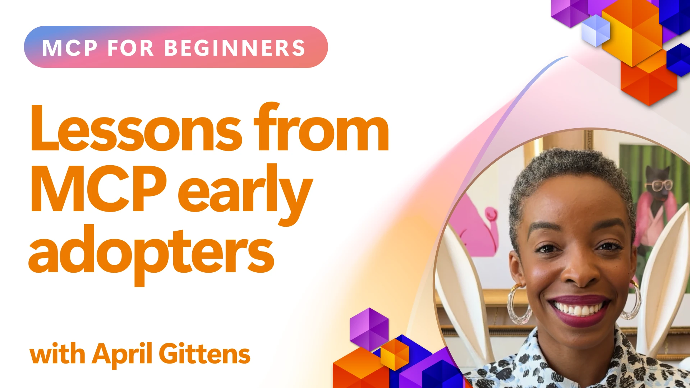

# 🌟 Pamokos iš Pirmųjų Naudotojų

[](https://youtu.be/jds7dSmNptE)

_(Paspauskite paveikslėlį viršuje, kad peržiūrėtumėte šios pamokos vaizdo įrašą)_

## 🎯 Ką Apima Šis Modulis

Šiame modulyje nagrinėjama, kaip realios organizacijos ir kūrėjai pasitelkia Modelio Konteksto Protokolą (MCP), spręsdami tikras problemas ir skatindami inovacijas. Per detalias atvejų studijas, praktinius projektus ir realius pavyzdžius atrasite, kaip MCP užtikrina saugią, plečiamą AI integraciją, jungianti kalbos modelius, įrankius ir įmonių duomenis.

### 📚 Pažiūrėkite MCP Veikiant

Norite pamatyti, kaip šie principai taikomi produkcijai parengtiems įrankiams? Peržiūrėkite mūsų [**10 Microsoft MCP serverių, kurie keičia kūrėjų produktyvumą**](microsoft-mcp-servers.md), kur pateikiami realūs Microsoft MCP serveriai, kuriuos galite naudoti šiandien.

## Apžvalga

Ši pamoka apžvelgia, kaip ankstyvieji naudotojai pasinaudojo Modelio Konteksto Protokolu (MCP), spręsdami realaus pasaulio iššūkius ir skatindami inovacijas įvairiose pramonės šakose. Per detalias atvejų studijas ir praktinius projektus pamatysite, kaip MCP suteikia standartizuotą, saugią ir plečiamą AI integraciją – sujungiant didelius kalbos modelius, įrankius ir įmonių duomenis vieningoje sistemoje. Įgysite praktinės patirties projektuojant ir kuriant MCP pagrindu veikiančius sprendimus, susipažinsite su patikrintais įgyvendinimo modeliais ir išmoksite geriausias praktikas MCP diegimui gamybinėse aplinkose. Pamoka taip pat pabrėžia naujausias tendencijas, ateities kryptis bei atviro kodo išteklius, padedančius išlikti MCP technologijų ir jos besivystančios ekosistemos priešakyje.

## Mokymosi Tikslai

- Analizuoti realius MCP įgyvendinimus įvairiose pramonės šakose
- Projektuoti ir kurti pilnas MCP pagrindu veikiančias programas
- Išnagrinėti naujausias tendencijas ir ateities kryptis MCP technologijoje
- Taikyti geriausias praktikas tikrose kūrimo situacijose

## Realūs MCP Įgyvendinimai

### Atvejo Studija 1: Įmonių Klientų Aptarnavimo Automatizavimas

Daugiatautė korporacija įdiegė MCP pagrindu veikiančią sistemą, standartizuojančią AI sąveikas tarp klientų aptarnavimo sistemų. Tai leido jiems:

- Sukurti vieningą sąsają keliems LLM teikėjams
- Išlaikyti nuoseklų prašymų valdymą skirtinguose skyriuose
- Įgyvendinti tvirtus saugumo ir atitikties valdymo kontrolės mechanizmus
- Lengvai keisti skirtingus AI modelius pagal specifinius poreikius

**Techninė Įgyvendinimo Apžvalga:**

```python
# Python MCP serverio įgyvendinimas klientų aptarnavimui
import logging
import asyncio
from modelcontextprotocol import create_server, ServerConfig
from modelcontextprotocol.server import MCPServer
from modelcontextprotocol.transports import create_http_transport
from modelcontextprotocol.resources import ResourceDefinition
from modelcontextprotocol.prompts import PromptDefinition
from modelcontextprotocol.tool import ToolDefinition

# Konfigūruoti žurnalų vedimą
logging.basicConfig(level=logging.INFO)

async def main():
    # Sukurti serverio konfigūraciją
    config = ServerConfig(
        name="Enterprise Customer Support Server",
        version="1.0.0",
        description="MCP server for handling customer support inquiries"
    )
    
    # Inicializuoti MCP serverį
    server = create_server(config)
    
    # Užregistruoti žinių bazės išteklius
    server.resources.register(
        ResourceDefinition(
            name="customer_kb",
            description="Customer knowledge base documentation"
        ),
        lambda params: get_customer_documentation(params)
    )
    
    # Užregistruoti šablonus užklausoms
    server.prompts.register(
        PromptDefinition(
            name="support_template",
            description="Templates for customer support responses"
        ),
        lambda params: get_support_templates(params)
    )
    
    # Užregistruoti pagalbos įrankius
    server.tools.register(
        ToolDefinition(
            name="ticketing",
            description="Create and update support tickets"
        ),
        handle_ticketing_operations
    )
    
    # Paleisti serverį su HTTP transportu
    transport = create_http_transport(port=8080)
    await server.run(transport)

if __name__ == "__main__":
    asyncio.run(main())
```

**Rezultatai:** 30 % modelių sąnaudų sumažėjimas, 45 % atsakymų nuoseklumo pagerėjimas ir pagerėjusi atitiktis pasaulinėse operacijose.

### Atvejo Studija 2: Sveikatos Diagnostikos Asistentas

Sveikatos priežiūros teikėjas sukūrė MCP infrastruktūrą, integruojančią kelis specializuotus medicinos AI modelius, užtikrindamas jautrių pacientų duomenų apsaugą:

- Sklandus perjungimas tarp bendrųjų ir specialistų medicinos modelių
- Griežtos privatumo kontrolės ir audito įrašai
- Integracija su esamomis Elektroninės Sveikatos Įrašų (EHR) sistemomis
- Nuoseklūs prašymų konstravimo principai medicinos terminologijai

**Techninė Įgyvendinimo Apžvalga:**

```csharp
// C# MCP host application implementation in healthcare application
using Microsoft.Extensions.DependencyInjection;
using ModelContextProtocol.SDK.Client;
using ModelContextProtocol.SDK.Security;
using ModelContextProtocol.SDK.Resources;

public class DiagnosticAssistant
{
    private readonly MCPHostClient _mcpClient;
    private readonly PatientContext _patientContext;
    
    public DiagnosticAssistant(PatientContext patientContext)
    {
        _patientContext = patientContext;
        
        // Configure MCP client with healthcare-specific settings
        var clientOptions = new ClientOptions
        {
            Name = "Healthcare Diagnostic Assistant",
            Version = "1.0.0",
            Security = new SecurityOptions
            {
                Encryption = EncryptionLevel.Medical,
                AuditEnabled = true
            }
        };
        
        _mcpClient = new MCPHostClientBuilder()
            .WithOptions(clientOptions)
            .WithTransport(new HttpTransport("https://healthcare-mcp.example.org"))
            .WithAuthentication(new HIPAACompliantAuthProvider())
            .Build();
    }
    
    public async Task<DiagnosticSuggestion> GetDiagnosticAssistance(
        string symptoms, string patientHistory)
    {
        // Create request with appropriate resources and tool access
        var resourceRequest = new ResourceRequest
        {
            Name = "patient_records",
            Parameters = new Dictionary<string, object>
            {
                ["patientId"] = _patientContext.PatientId,
                ["requestingProvider"] = _patientContext.ProviderId
            }
        };
        
        // Request diagnostic assistance using appropriate prompt
        var response = await _mcpClient.SendPromptRequestAsync(
            promptName: "diagnostic_assistance",
            parameters: new Dictionary<string, object>
            {
                ["symptoms"] = symptoms,
                patientHistory = patientHistory,
                relevantGuidelines = _patientContext.GetRelevantGuidelines()
            });
            
        return DiagnosticSuggestion.FromMCPResponse(response);
    }
}
```

**Rezultatai:** Pagerintos diagnostikos rekomendacijos gydytojams, pilnas HIPAA atitikties užtikrinimas ir reikšmingas kontekstų perjungimo tarp sistemų sumažinimas.

### Atvejo Studija 3: Finansinių Paslaugų Rizikos Analizė

Finansų institucija įdiegė MCP, siekdama standartizuoti rizikos analizės procesus skirtinguose skyriuose:

- Sukūrė vieningą sąsają kredito rizikos, sukčiavimo aptikimo ir investicijų rizikos modeliams
- Įgyvendino griežtą prieigos kontrolę ir modelių versijavimą
- Užtikrino visų AI rekomendacijų audito galimybę
- Išlaikė nuoseklų duomenų formatavimą skirtingose sistemose

**Techninė Įgyvendinimo Apžvalga:**

```java
// Java MCP serveris finansinės rizikos įvertinimui
import org.mcp.server.*;
import org.mcp.security.*;

public class FinancialRiskMCPServer {
    public static void main(String[] args) {
        // Sukurkite MCP serverį su finansinės atitikties funkcijomis
        MCPServer server = new MCPServerBuilder()
            .withModelProviders(
                new ModelProvider("risk-assessment-primary", new AzureOpenAIProvider()),
                new ModelProvider("risk-assessment-audit", new LocalLlamaProvider())
            )
            .withPromptTemplateDirectory("./compliance/templates")
            .withAccessControls(new SOCCompliantAccessControl())
            .withDataEncryption(EncryptionStandard.FINANCIAL_GRADE)
            .withVersionControl(true)
            .withAuditLogging(new DatabaseAuditLogger())
            .build();
            
        server.addRequestValidator(new FinancialDataValidator());
        server.addResponseFilter(new PII_RedactionFilter());
        
        server.start(9000);
        
        System.out.println("Financial Risk MCP Server running on port 9000");
    }
}
```

**Rezultatai:** Pagerinta reguliavimo atitiktis, 40 % spartesni modelių diegimo ciklai, pagerintas rizikos vertinimo nuoseklumas skyriuose.

### Atvejo Studija 4: Microsoft Playwright MCP Serveris naršyklės automatizavimui

Microsoft sukūrė [Playwright MCP serverį](https://github.com/microsoft/playwright-mcp), leidžiantį saugią, standartizuotą naršyklės automatizaciją naudojant Modelio Konteksto Protokolą. Šis produkcijai parengtas serveris leidžia AI agentams ir LLM bendradarbiauti su interneto naršyklėmis kontroliuojamu, auditiniu ir išplėtimus palaikančiu būdu – leidžiant naudoti automatizuotus interneto testavimus, duomenų išgavimą ir pilnus darbo eigų sprendimus.

> **🎯 Produkcijai Parengtas Įrankis**
> 
> Ši atvejo studija pristato realų MCP serverį, kuriuo galite naudotis šiandien! Sužinokite daugiau apie Playwright MCP Serverį ir dar 9 kitus produkcijai parengtus Microsoft MCP serverius mūsų [**Microsoft MCP Serverių Vadove**](microsoft-mcp-servers.md#8--playwright-mcp-server).

**Pagrindinės Savybės:**
- Patsine naršyklės automatizavimo galimybes (navigacija, formų pildymas, ekrano kopijų fiksavimas ir kt.) kaip MCP įrankius
- Įgyvendina griežtą prieigos kontrolę ir smėliadėžę, kad būtų išvengta neautorizuotų veiksmų
- Teikia detalius audito įrašus visoms naršyklės sąveikoms
- Palaiko integraciją su Azure OpenAI ir kitais LLM tiekėjais agentų valdomai automatizacijai
- Maitina GitHub Copilot Kodo Agenta naršyklės galimybėmis

**Techninė Įgyvendinimo Apžvalga:**

```typescript
// TypeScript: Playwright naršyklės automatizavimo įrankių registravimas MCP serveryje
import { createServer, ToolDefinition } from 'modelcontextprotocol';
import { launch } from 'playwright';

const server = createServer({
  name: 'Playwright MCP Server',
  version: '1.0.0',
  description: 'MCP server for browser automation using Playwright'
});

// Registruoti įrankį URL naršymui ir ekrano kopijos fiksavimui
server.tools.register(
  new ToolDefinition({
    name: 'navigate_and_screenshot',
    description: 'Navigate to a URL and capture a screenshot',
    parameters: {
      url: { type: 'string', description: 'The URL to visit' }
    }
  }),
  async ({ url }) => {
    const browser = await launch();
    const page = await browser.newPage();
    await page.goto(url);
    const screenshot = await page.screenshot();
    await browser.close();
    return { screenshot };
  }
);

// Paleisti MCP serverį
server.listen(8080);
```

**Rezultatai:**

- Leido saugią, programinę naršyklės automatizaciją AI agentams ir LLM
- Sumažino rankinio testavimo apimtis ir pagerino testavimo aprėptį interneto programose
- Pateikė pakartotinai naudojamą, išplečiamą sistemą naršyklės pagrindu įrankių integracijai įmoninėse aplinkose
- Maitina GitHub Copilot naršyklės galimybes

**Nuorodos:**

- [Playwright MCP Serverio GitHub Saugykla](https://github.com/microsoft/playwright-mcp)
- [Microsoft AI ir Automatizacijos Sprendimai](https://azure.microsoft.com/en-us/products/ai-services/)

### Atvejo Studija 5: Azure MCP – Įmoninė Modelio Konteksto Protokolo Paslauga

Azure MCP Serveris ([https://aka.ms/azmcp](https://aka.ms/azmcp)) yra Microsoft valdomas, įmonėms skirtas Modelio Konteksto Protokolo įgyvendinimas, sukurtas teikti plečiamą, saugią ir atitikties užtikrinančią MCP serverio funkciją kaip debesijos paslaugą. Azure MCP leidžia organizacijoms greitai diegti, valdyti ir integruoti MCP serverius su Azure AI, duomenų ir saugumo paslaugomis, mažinant operatyvinę naštą ir spartinant AI priėmimą.

> **🎯 Produkcijai Parengtas Įrankis**
> 
> Tai realus MCP serveris, kuriuo galite naudotis šiandien! Sužinokite daugiau apie Microsoft Foundry MCP Serverį mūsų [**Microsoft MCP Serverių Vadove**](microsoft-mcp-servers.md).


- Pilnai valdomas MCP serverio talpinimas su įmontuotu masteliu, stebėsena ir saugumu
- Natūrali integracija su Azure OpenAI, Azure AI Search ir kitomis Azure paslaugomis
- Įmoninis autentifikavimas ir autorizavimas per Microsoft Entra ID
- Palaikymas pritaikytų įrankių, prašymų šablonų ir resursų jungčių
- Atitiktis įmonių saugumo ir reguliavimo reikalavimams

**Techninė Įgyvendinimo Apžvalga:**

```yaml
# Example: Azure MCP server deployment configuration (YAML)
apiVersion: mcp.microsoft.com/v1
kind: McpServer
metadata:
  name: enterprise-mcp-server
spec:
  modelProviders:
    - name: azure-openai
      type: AzureOpenAI
      endpoint: https://<your-openai-resource>.openai.azure.com/
      apiKeySecret: <your-azure-keyvault-secret>
  tools:
    - name: document_search
      type: AzureAISearch
      endpoint: https://<your-search-resource>.search.windows.net/
      apiKeySecret: <your-azure-keyvault-secret>
  authentication:
    type: EntraID
    tenantId: <your-tenant-id>
  monitoring:
    enabled: true
    logAnalyticsWorkspace: <your-log-analytics-id>
```

**Rezultatai:**  
- Sutrumpino laiką iki vertės įgyvendinant įmonių AI projektus, suteikdama paruoštą naudoti, atitinkantį standartus MCP serverio platformą
- Supaprastino LLM, įrankių ir įmonių duomenų šaltinių integraciją
- Pagerino saugumą, stebėseną ir veiklos efektyvumą MCP apkrovoms
- Pagerino kodo kokybę, taikant Azure SDK geriausias praktikas ir galiojančius autentifikavimo modelius

**Nuorodos:**  
- [Azure MCP Dokumentacija](https://aka.ms/azmcp)
- [Azure MCP Serverio GitHub Saugykla](https://github.com/Azure/azure-mcp)
- [Azure AI Paslaugos](https://azure.microsoft.com/en-us/products/ai-services/)
- [Microsoft MCP Centras](https://mcp.azure.com)

## Atvejo Studija 6: NLWeb 
MCP (Modelio Konteksto Protokolas) yra besiformuojantis protokolas, leidžiantis pokalbių robotams ir AI padėjėjams sąveikauti su įrankiais. Kiekvienas NLWeb egzempliorius taip pat yra MCP serveris, palaikantis pagrindinį metodą ask, naudojamą užduoti klausimus natūralia kalba tinklalapiui. Grąžinamas atsakymas naudoja schema.org, plačiai naudojamą interneto duomenų aprašymo žodyną. Laikantis analogijos, MCP yra NLWeb, kaip Http yra HTML. NLWeb jungia protokolus, Schema.org formatus ir pavyzdinius kodus, kad svetainės galėtų greitai kurti šias galines sąsajas, naudingas tiek žmonėms per pokalbių sąsajas, tiek mašinoms natūralios agentų sąveikos pagrindu.

NLWeb turi du aiškiai išskirtus komponentus.
- Protokolą, labai paprastą pradėti naudoti, skirtą bendrauti su svetaine natūralia kalba ir formatą, naudojant json ir schema.org grąžinamam atsakymui. Daugiau informacijos rasite REST API dokumentacijoje.
- Paprastą (1) įgyvendinimą, naudojant esamą žymėjimą, svetainėms, kurias galima abstrahuoti kaip prekių, receptų, lankytinų vietų, atsiliepimų sąrašus. Kartu su naudotojo sąsajos valdikliais svetainės lengvai gali suteikti pokalbių sąsajas savo turiniui. Daugiau informacijos žr. dokumentacijoje Life of a chat query.
 
**Nuorodos:**  
- [Azure MCP Dokumentacija](https://aka.ms/azmcp)
- [NLWeb](https://github.com/microsoft/NlWeb)

### Atvejo Studija 7: Microsoft Foundry MCP Serveris – Įmonių AI Agentų Integracija

Microsoft Foundry MCP serveriai demonstruoja, kaip MCP gali būti naudojamas AI agentams ir darbų eigos valdymui įmoninėse aplinkose. Integruojant MCP su Microsoft Foundry, organizacijos gali standartizuoti agentų sąveikas, pasinaudoti Foundry darbo eigos valdymu ir užtikrinti saugius, plečiamus diegimus.

> **🎯 Produkcijai Parengtas Įrankis**
> 
> Tai realus MCP serveris, kuriuo galite naudotis šiandien! Sužinokite daugiau apie Microsoft Foundry MCP Serverį mūsų [**Microsoft MCP Serverių Vadove**](microsoft-mcp-servers.md#9--microsoft-foundry-mcp-server).

**Pagrindinės Savybės:**
- Visapusiška prieiga prie Azure AI ekosistemos, įskaitant modelių katalogus ir diegimų valdymą
- Žinių indeksavimas su Azure AI Search RAG taikymams
- Vertinimo įrankiai AI modelių našumui ir kokybės užtikrinimui
- Integracija su Microsoft Foundry katalogu ir laboratorijomis pažangiems tyrimų modeliams
- Agentų valdymo ir vertinimo galimybės gamybos situacijoms

**Rezultatai:**
- Greitas AI agentų darbo eigos prototipavimas ir tvirta stebėsena
- Sklandi integracija su Azure AI paslaugomis pažangiems scenarijams
- Vieninga sąsaja agentų pipeline kūrimui, talpinimui ir stebėsenai
- Pagerintas saugumas, atitiktis ir veiklos efektyvumas įmonėms
- Paspartintas AI priėmimas išlaikant kontrolę sudėtinguose agentų valdomuose procesuose

**Nuorodos:**
- [Microsoft Foundry MCP Serverio GitHub Saugykla](https://github.com/azure-ai-foundry/mcp-foundry)
- [Azure AI agentų integracija su MCP (Microsoft Foundry tinklaraštis)](https://devblogs.microsoft.com/foundry/integrating-azure-ai-agents-mcp/)

### Atvejo Studija 8: Foundry MCP Playground – Eksperimentavimas ir Prototipavimas

Foundry MCP Playground suteikia paruoštą naudoti aplinką MCP serverių ir Microsoft Foundry integracijos eksperimentams. Kūrėjai gali greitai prototipuoti, testuoti ir vertinti AI modelius bei agentų darbo eigas naudodami išteklius iš Microsoft Foundry katalogo ir laboratorijų. Playground supaprastina paruošimą, teikia pavyzdinius projektus ir palaiko bendradarbiavimą, leidžiant lengvai tyrinėti geriausias praktikas ir naujus scenarijus su minimaliu papildomu darbu. Tai ypač naudinga komandoms, norinčioms patvirtinti idėjas, dalytis eksperimentiškomis veiklomis ir spartinti mokymąsi be sudėtingos infrastruktūros. Mažindamas įėjimo barjerą, playground skatina inovacijas ir bendruomenės indėlį MCP bei Microsoft Foundry ekosistemoje.

**Nuorodos:**

- [Foundry MCP Playground GitHub Saugykla](https://github.com/azure-ai-foundry/foundry-mcp-playground)

### Atvejo Studija 9: Microsoft Learn Docs MCP Serveris – AI Varoma Dokumentacijos Prieiga

Microsoft Learn Docs MCP Serveris yra debesijos paslauga, teikianti AI padėjėjams prieigą realiu laiku prie oficialios Microsoft dokumentacijos per Modelio Konteksto Protokolą. Šis produkcijai parengtas serveris jungiasi prie išsamios Microsoft Learn ekosistemos ir leidžia semantinę paiešką visuose oficialiuose Microsoft šaltiniuose.

> **🎯 Produkcijai Parengtas Įrankis**
> 
> Tai realus MCP serveris, kuriuo galite naudotis šiandien! Sužinokite daugiau apie Microsoft Learn Docs MCP Serverį mūsų [**Microsoft MCP Serverių Vadove**](microsoft-mcp-servers.md#1--microsoft-learn-docs-mcp-server).

**Pagrindinės Savybės:**
- Realiu laiku prieiga prie oficialios Microsoft dokumentacijos, Azure dokumentų ir Microsoft 365 dokumentacijos
- Pažangios semantinės paieškos galimybės, suprantančios kontekstą ir intenciją
- Visada atnaujinta informacija, kai skelbiami Microsoft Learn turiniai
- Išsamus aprėptis Microsoft Learn, Azure dokumentacijoje ir Microsoft 365 šaltiniuose
- Grąžina iki 10 aukštos kokybės turinio fragmentų su straipsnių pavadinimais ir URL

**Kodėl Tai Svarbu:**
- Sprendžia "pasenusią AI žinių" problemą Microsoft technologijose
- Užtikrina, kad AI padėjėjai turi prieigą prie naujausių .NET, C#, Azure ir Microsoft 365 funkcijų
- Suteikia autoritetingą, pirmosios šalies informaciją tiksliai kodo generacijai
- Būtina kūrėjams, dirbantiems su sparčiai besivystančiomis Microsoft technologijomis

**Rezultatai:**
- Drastiškai pagerėjo AI generuojamo kodo tikslumas Microsoft technologijoms
- Sumažėjo laikas, praleistas ieškant naujausios dokumentacijos ir geriausių praktikų
- Padidėjo kūrėjų produktyvumas su kontekstą suprantančia dokumentacijos paieška
- Sklandi integracija į kūrimo darbo eigas neišeinant iš IDE

**Nuorodos:**
- [Microsoft Learn Docs MCP Serverio GitHub Saugykla](https://github.com/MicrosoftDocs/mcp)
- [Microsoft Learn Dokumentacija](https://learn.microsoft.com/)

## Praktiniai Projektai

### Projektas 1: Sukurkite Daugiausiai Teikėjų MCP Serverį

**Tikslas:** Sukurti MCP serverį, kuris pagal tam tikrus kriterijus galėtų nukreipti užklausas keliems AI modelių tiekėjams.

**Reikalavimai:**

- Palaikyti bent tris skirtingus modelių tiekėjus (pvz., OpenAI, Anthropic, vietiniai modeliai)
- Įgyvendinti maršruto nustatymo mechanizmą pagal užklausos metaduomenis
- Sukurti konfigūracijos sistemą tiekėjų kredencialiams valdyti
- Įdiegti kešavimą našumui ir sąnaudų optimizavimui
- Sukurti paprastą informacijos suvestinę naudojimo stebėsenai

**Įgyvendinimo Žingsniai:**

1. Nustatyti pagrindinę MCP serverio infrastruktūrą
2. Įgyvendinti tiekėjų adapterius kiekvienai AI modelių paslaugai
3. Sukurti maršruto logiką pagal užklausos atributus
4. Įjungti kešavimo mechanizmus dažnoms užklausoms
5. Sukurti stebėsenos suvestinę
6. Ištestuoti su įvairiais užklausų modeliais

**Technologijos:** Pasirinkite Python (.NET/Java/Python pagal pageidavimą), Redis kešavimui ir paprastą žiniatinklio sistemą suvestinei.

### Projektas 2: Įmonių Prašymų Valdymo Sistema

**Tikslas:** Sukurti MCP pagrindu veikiančią sistemą prašymų šablonams tvarkyti, versijuoti ir diegti organizacijos mastu.

**Reikalavimai:**


- Sukurti centralizuotą šablonų saugyklą
- Įgyvendinti versijų valdymą ir patvirtinimo darbo eigas
- Sukurti šablonų testavimo galimybes su pavyzdiniais įvestimis
- Sukurti pagal vaidmenis pagrįstą prieigos kontrolę
- Sukurti API šablonų gavimui ir diegimui

**Įgyvendinimo žingsniai:**

1. Sukurti duomenų bazės schemą šablonų saugojimui
2. Sukurti pagrindinį API šablonų CRUD operacijoms
3. Įgyvendinti versijų valdymo sistemą
4. Sukurti patvirtinimo darbo eigą
5. Sukurti testavimo sistemą
6. Sukurti paprastą žiniatinklio sąsają valdymui
7. Integruoti su MCP serveriu

**Technologijos:** Jūsų pasirinktas backend karkasas, SQL arba NoSQL duomenų bazė ir frontend karkasas valdymo sąsajai.

### Projektas 3: MCP pagrindu veikianti turinio generavimo platforma

**Tikslas:** Sukurti turinio generavimo platformą, kuri naudoja MCP, kad būtų užtikrinti nuoseklūs rezultatai įvairių tipų turiniui.

**Reikalavimai:**

- Palaikyti kelis turinio formatus (tinklaraščio įrašai, socialinė žiniasklaida, rinkodaros tekstai)
- Įgyvendinti šablonais pagrįstą generavimą su pritaikymo galimybėmis
- Sukurti turinio peržiūros ir atsiliepimų sistemą
- Stebėti turinio našumo metrikas
- Palaikyti turinio versijavimą ir iteraciją

**Įgyvendinimo žingsniai:**

1. Įrengti MCP kliento infrastruktūrą
2. Sukurti šablonus skirtingiems turinio tipams
3. Sukurti turinio generavimo vamzdyną
4. Įgyvendinti peržiūros sistemą
5. Sukurti metrikų stebėjimo sistemą
6. Sukurti naudotojo sąsają šablonų valdymui ir turinio generavimui

**Technologijos:** Jūsų pageidaujama programavimo kalba, žiniatinklio karkasas ir duomenų bazių sistema.

## Ateities kryptys MCP technologijai

### Kylančios tendencijos

1. **Daugiarūšis MCP**
   - MCP plėtra standartizuoti sąveikas su vaizdų, garso ir vaizdo modeliais
   - Kryžminio modalumo mąstymo galimybių plėtra
   - Standartizuoti užklausų formatai skirtingoms modalumo rūšims

2. **Federuota MCP infrastruktūra**
   - Išskirstytos MCP tinklai, galintys dalintis ištekliais tarp organizacijų
   - Standartizuoti saugaus modeliavimo dalinimosi protokolai
   - Privatumo saugojimo skaičiavimo technikos

3. **MCP turgavietės**
   - Ekosistemos MCP šablonų ir papildinių dalinimuisi ir pelno gavimui
   - Kokybės užtikrinimo ir sertifikavimo procesai
   - Integracija su modelių turgavietėmis

4. **MCP krašto (Edge) kompiuterijai**
   - MCP standartų adaptacija išteklių ribotiems krašto įrenginiams
   - Optimizuoti protokolai mažo pralaidumo aplinkoms
   - Specializuoti MCP sprendimai daiktų interneto ekosistemoms

5. **Reguliavimo sistemos**
   - MCP plėtinių kūrimas reguliavimo atitikčiai
   - Standartizuotos audito pėdų ir paaiškinamumo sąsajos
   - Integracija su kylančiomis AI valdymo sistemomis

### MCP sprendimai iš Microsoft

Microsoft ir Azure sukūrė keletą atvirojo kodo saugyklų, kad padėtų kūrėjams įgyvendinti MCP įvairiose situacijose:

#### Microsoft organizacija

1. [playwright-mcp](https://github.com/microsoft/playwright-mcp) - Playwright MCP serveris naršyklės automatizacijai ir testavimui
2. [files-mcp-server](https://github.com/microsoft/files-mcp-server) - OneDrive MCP serverio įgyvendinimas vietiniam testavimui ir bendruomenės indėliui
3. [NLWeb](https://github.com/microsoft/NlWeb) - NLWeb yra atvirų protokolų ir susijusių atviro kodo įrankių rinkinys. Pagrindinis dėmesys skiriamas AI tinklo pagrindo sluoksnio sukūrimui

#### Azure-Samples organizacija

1. [mcp](https://github.com/Azure-Samples/mcp) - Nuorodos į pavyzdžius, įrankius ir išteklius MCP serverių kūrimui ir integravimui Azure naudojant kelias kalbas
2. [mcp-auth-servers](https://github.com/Azure-Samples/mcp-auth-servers) - MCP serverių pavyzdžiai su autentifikacija pagal naujausią Model Context Protocol specifikaciją
3. [remote-mcp-functions](https://github.com/Azure-Samples/remote-mcp-functions) - Pradžios puslapis nuotoliniams MCP serverių įgyvendinimams Azure Functions su nuorodomis į kalboms skirtus saugyklas
4. [remote-mcp-functions-python](https://github.com/Azure-Samples/remote-mcp-functions-python) - Greito starto šablonas kuriant ir diegiant nuotolinius MCP serverius Azure Functions su Python
5. [remote-mcp-functions-dotnet](https://github.com/Azure-Samples/remote-mcp-functions-dotnet) - Greito starto šablonas kuriant ir diegiant nuotolinius MCP serverius Azure Functions su .NET/C#
6. [remote-mcp-functions-typescript](https://github.com/Azure-Samples/remote-mcp-functions-typescript) - Greito starto šablonas kuriant ir diegiant nuotolinius MCP serverius Azure Functions su TypeScript
7. [remote-mcp-apim-functions-python](https://github.com/Azure-Samples/remote-mcp-apim-functions-python) - Azure API valdymas kaip AI vartai nuotoliniams MCP serveriams naudojant Python
8. [AI-Gateway](https://github.com/Azure-Samples/AI-Gateway) - APIM ❤️ AI eksperimentai su MCP galimybėmis, integruojantis su Azure OpenAI ir AI Foundry

Šios saugyklos suteikia įvairių įgyvendinimų, šablonų ir išteklių darbui su Model Context Protocol įvairiomis programavimo kalbomis ir Azure paslaugomis. Jos apima pagrindinius serverių įgyvendinimus, autentifikaciją, debesų diegimą ir įmonių integracijos scenarijus.

#### MCP išteklių katalogas

Oficialioje Microsoft MCP saugykloje esantis [MCP Resources katalogas](https://github.com/microsoft/mcp/tree/main/Resources) suteikia atrinktą pavyzdinių išteklių, užklausų šablonų ir įrankių apibrėžčių kolekciją Model Context Protocol serverių naudojimui. Šis katalogas sukurtas, kad padėtų kūrėjams greitai pradėti darbą su MCP siūlant pakartotinai naudojamus blokelius ir geriausių praktikų pavyzdžius:

- **Užklausų šablonai:** Paruošti naudoti užklausų šablonai dažnoms AI užduotims ir scenarijoms, kurie gali būti pritaikyti jūsų MCP serverių įgyvendinimams.
- **Įrankių apibrėžimai:** Pavyzdiniai įrankių schemos ir metaduomenys standartizuoti įrankių integraciją ir kvietimą įvairiuose MCP serveriuose.
- **Išteklių pavyzdžiai:** Pavyzdiniai išteklių apibrėžimai jungimuisi prie duomenų šaltinių, API ir išorinių paslaugų MCP sistemoje.
- **Referenciniai įgyvendinimai:** Praktiniai pavyzdžiai, demonstruojantys, kaip struktūrizuoti ir organizuoti išteklius, užklausas ir įrankius tikruose MCP projektuose.

Šie ištekliai spartina kūrimą, skatina standartizaciją ir padeda užtikrinti geriausias praktikas kuriant ir diegiant MCP pagrindu veikiančius sprendimus.

#### MCP išteklių katalogas

- [MCP Resources (pavyzdiniai užklausų šablonai, įrankiai ir išteklių apibrėžimai)](https://github.com/microsoft/mcp/tree/main/Resources)

### Tyrimų galimybės

- Efektyvios užklausų optimizavimo technikos MCP sistemose
- Saugumo modeliai daugiabankinėms MCP diegimams
- Našumo palyginamasis vertinimas skirtinguose MCP įgyvendinimuose
- Formalūs MCP serverių patikrinimo metodai

## Išvados

Model Context Protocol (MCP) sparčiai formuoja standartizuoto, saugaus ir sąveikaus AI integravimo ateitį įvairiose pramonės šakose. Per šios pamokos atvejų studijas ir praktinius projektus matėte, kaip ankstyvieji šios technologijos priėmėjai – įskaitant Microsoft ir Azure – naudoja MCP spręsti realias problemas, pagreitinti AI priėmimą ir užtikrinti atitiktį, saugumą bei mastelį. MCP modulinis požiūris leidžia organizacijoms sujungti didelio masto kalbos modelius, įrankius ir verslo duomenis į vieningą, auditabilų sistemą. Toliau vystantis MCP, būtina išlikti aktyviems bendruomenėje, nagrinėti atviro kodo išteklius ir taikyti geriausias praktikas, kad būtų sukuriami patikimi ir ateičiai paruošti AI sprendimai.

## Papildomi ištekliai

- [MCP Foundry GitHub saugykla](https://github.com/azure-ai-foundry/mcp-foundry)
- [Foundry MCP žaidimų aikštelė](https://github.com/azure-ai-foundry/foundry-mcp-playground)
- [Azure AI agentų integracija su MCP (Microsoft Foundry tinklaraštis)](https://devblogs.microsoft.com/foundry/integrating-azure-ai-agents-mcp/)
- [MCP GitHub saugykla (Microsoft)](https://github.com/microsoft/mcp)
- [MCP Resources katalogas (pavyzdiniai užklausų šablonai, įrankiai ir išteklių apibrėžimai)](https://github.com/microsoft/mcp/tree/main/Resources)
- [MCP bendruomenė ir dokumentacija](https://modelcontextprotocol.io/introduction)
- [MCP specifikacija (2026-07-28)](https://modelcontextprotocol.io/specification/2026-07-28/)
- [Azure MCP dokumentacija](https://aka.ms/azmcp)
- [OWASP MCP Top 10](https://microsoft.github.io/mcp-azure-security-guide/mcp/) - Saugumo geriausios praktikos
- [Playwright MCP serverio GitHub saugykla](https://github.com/microsoft/playwright-mcp)
- [Files MCP serveris (OneDrive)](https://github.com/microsoft/files-mcp-server)
- [Azure-Samples MCP](https://github.com/Azure-Samples/mcp)
- [MCP Auth Servers (Azure-Samples)](https://github.com/Azure-Samples/mcp-auth-servers)
- [Remote MCP Functions (Azure-Samples)](https://github.com/Azure-Samples/remote-mcp-functions)
- [Remote MCP Functions Python (Azure-Samples)](https://github.com/Azure-Samples/remote-mcp-functions-python)
- [Remote MCP Functions .NET (Azure-Samples)](https://github.com/Azure-Samples/remote-mcp-functions-dotnet)
- [Remote MCP Functions TypeScript (Azure-Samples)](https://github.com/Azure-Samples/remote-mcp-functions-typescript)
- [Remote MCP APIM Functions Python (Azure-Samples)](https://github.com/Azure-Samples/remote-mcp-apim-functions-python)
- [AI-Gateway (Azure-Samples)](https://github.com/Azure-Samples/AI-Gateway)
- [Microsoft AI ir automatizavimo sprendimai](https://azure.microsoft.com/en-us/products/ai-services/)

## Užduotys

1. Išanalizuokite vieną iš atvejų studijų ir pasiūlykite alternatyvų įgyvendinimo būdą.
2. Pasirinkite vieną projekto idėją ir paruoškite išsamų techninį specifikaciją.
3. Ištirkite pramonės šaką, kurios neaptarėme atvejų studijose, ir aprašykite, kaip MCP galėtų spręsti jos specifines problemas.
4. Išnagrinėkite vieną iš ateities krypčių ir sukurkite naujo MCP plėtinio koncepciją, skirtą ją palaikyti.

## Kas toliau

Sužinokite daugiau: [Microsoft MCP serveriai](./microsoft-mcp-servers.md)

Toliau skaitykite: [8 modulis: Geriausios praktikos](../08-BestPractices/README.md)

---

<!-- CO-OP TRANSLATOR DISCLAIMER START -->
**Atsakomybės apribojimas**:
Šis dokumentas buvo išverstas naudojant dirbtinio intelekto vertimo paslaugą [Co-op Translator](https://github.com/Azure/co-op-translator). Nors siekiame tikslumo, prašome atkreipti dėmesį, kad automatiniai vertimai gali turėti klaidų ar netikslumų. Originalus dokumentas jo gimtąja kalba laikomas autoritetingu šaltiniu. Svarbiai informacijai rekomenduojama naudoti profesionalų žmogiškąjį vertimą. Mes neatsakome už jokius nesusipratimus ar neteisingą interpretaciją, kilusią naudojantis šiuo vertimu.
<!-- CO-OP TRANSLATOR DISCLAIMER END -->