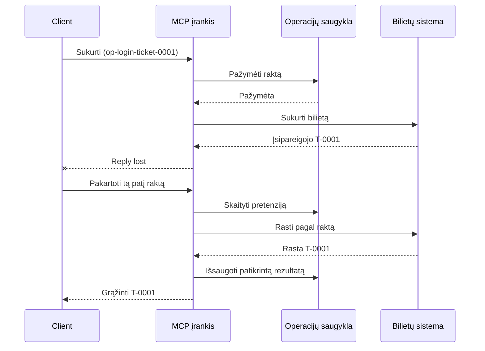
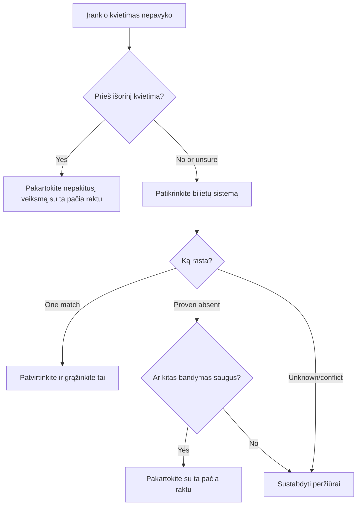

# Saugūs pakartotiniai bandymai MCP įrankiams: patikimumo „sidecar“ modelis

Nepateiktas atsakymas nereiškia, kad veiksmas nesukeltas. Pagalbos bilietų kūrimo įrankis
gali sukurti bilietą `T-0001` ir tada prarasti ryšį, kol klientas mato
rezultatą. Jei klientas pakartoja bandymą aklai, gali sukurti `T-0002`.

Ši pamoka parodo, kaip atpažinti tokį neaiškų rezultatą, išlaikyti vieną stabilų
identitetą numatytam veiksmui ir patikrinti bilietų sistemą prieš bandant
dar kartą. Priedo pateiktas Python pratimas veikia vietoje su standartine biblioteka
ir SQLite.

## Kodėl laiko išnaudojimas reiškia „rezultatas nežinomas“

Tarkime, klientas iškviečia `create_support_ticket` su operacijos raktu
`op-login-ticket-0001`:



Ryšys nutrūksta po to, kai bilietas įrašytas, bet prieš pranešimą gavimą.
Klientas žino tik tai, kad atsakymas dingo. Jis nežino, ar
bilietas yra pateiktas. Kartojant operacijos raktą įrankis sugeba rasti ir grąžinti
`T-0001` vietoje to, kad sukurtų `T-0002`.

## Ką daro patikimumo „sidecar“

Patikimumo „sidecar“ yra programos kodas, kuris laiko atkūrimo būseną šalia
įrankio. Tai gali būti biblioteka, tarpinė programinė įranga, duomenų bazės palaikoma paslauga arba tiesiog
įrankio įgyvendinimo dalis. Tai nebūtinai turi būti atskiras procesas,
taip pat tai nėra MCP protokolo funkcija.

„Sidecar“ turi keturis uždavinius:

1. išsaugoti numatytą veiksmą prieš iškviečiant išorinę sistemą;
2. leisti tik vienam vykdytojui prisiimti tą veiksmą;
3. prisiminti pakankamai būsenos, kad būtų galima atstatyti po gedimo;
4. patikrinti išorinę sistemą, kai rezultatas neaiškus.

Ši pamoka skirta galutinei MCP specifikacijai `2026-07-28`. MCP neturi
protokolo lygmens sesijos, todėl operacijos raktas yra įprastas įrankio argumentas,
kurį palaiko patvari programinė būsena. Tas pats modelis veikia ir su ankstesnėmis
MCP versijomis.

## Keturi ID, sprendžiantys skirtingas problemas

Šie identifikatoriai yra susiję, bet jie nėra keičiami tarpusavyje:

| Identifikatorius | Ką identifikuoja | Išlieka pakartojus bandymą? |
| --- | --- | --- |
| JSON-RPC ID | Vieną užklausą ir atsakymą | Ne; naudokite naują užklausos ID |
| MCP užduoties ID | Vieną ilgai trunkančią užduotį | Taip; išlaikykite jį laukimui |
| Operacijos raktas | Vieną numatytą veiksmą | Taip; naudokite jį tam veiksmui |
| Bilieto ID | Saugojamą rezultatą | Taip; grąžinkite jį po patvirtinimo |

Progreso pranešimai ir sekimo kontekstas padeda stebėti užklausą.
Atšaukimas reikalauja sustabdyti darbą. Nė vienas iš jų nesustabdo dublikato sukūrimo.

## Sukurkite apsaugą

Sukurkite operacijos raktą prieš pirmąjį įrankio iškvietimą ir išsaugokite jį su
darbo eiga. Kiekvienas bandymas sukurti tą patį numatytą bilietą naudoja tą patį raktą:

```json
{
  "operation_key": "op-login-ticket-0001",
  "title": "Cannot sign in"
}
```

Kitam numatytam bilietui sukuriamas naujas raktas. Produkcijoje sukurkite neperprantamą,
neįminamą reikšmę vietoje klientų duomenų dedant juos į raktą.

Čia pateikiama visa MCP įrankio schema, naudojama šioje pamokoje:

```json
{
  "name": "create_support_ticket",
  "title": "Create support ticket",
  "description": "Creates or recovers one support ticket for an operation key.",
  "inputSchema": {
    "$schema": "https://json-schema.org/draft/2020-12/schema",
    "type": "object",
    "properties": {
      "operation_key": {
        "type": "string",
        "minLength": 16,
        "maxLength": 128,
        "description": "Stable key reused for the same intended action."
      },
      "title": {
        "type": "string",
        "minLength": 1,
        "maxLength": 200
      }
    },
    "required": ["operation_key", "title"],
    "additionalProperties": false
  },
  "outputSchema": {
    "$schema": "https://json-schema.org/draft/2020-12/schema",
    "type": "object",
    "properties": {
      "ticket_id": {
        "type": "string"
      },
      "operation_key": {
        "type": "string"
      },
      "status": {
        "type": "string",
        "const": "verified"
      }
    },
    "required": ["ticket_id", "operation_key", "status"],
    "additionalProperties": false
  }
}
```

Autentifikuoto iškvietėjo tapatybė kyla iš serverio konteksto, o ne iš
modelio pateiktos įrankio įvesties. Kiekvieną saugomą operaciją apribokite:

- tam iškvietėjui, nuomininkui arba paslaugos paskyrai;
- įrankio pavadinimui ir versijai; ir
- normalizuotų įvesties duomenų hašui, kurie apibrėžia išorinį veiksmą.

Įvesties hašas atsako į paprastą klausimą: „Ar šis pakartotinis bandymas prašo to paties
bilieto?“ Jei raktas jau yra priskirtas kitam pavadinimui, atmeskite prašymą.

Ankstesnio rezultato grąžinimas pakeistam įrašo įvedimui paslėptų sutarties klaidą.

Išsaugokite teiginį su viena atomine duomenų bazės operacija. „Atominė“ reiškia, kad du darbuotojai
abu negali stebėti tuščio įrašo ir abu tapti savininkais. Vietinis
proceso užraktas nepakanka, kai kita serverio instancija gali gauti bandymą iš naujo.

Darbų eiga sukuria raktą, kol veiksmas yra `planned`. Pavyzdys tada
išsaugo šias būsenas:

- `claimed`: vienas darbuotojas rezervavo operaciją;
- `completed`: bilietų sistema grąžino rezultatą; ir
- `verified`: bilietų sistemos skaitymas patvirtina rezultatą.

Gedimas gali palikti saugomą būseną `claimed` net po to, kai bilietas
buvo sukurtas. Laikykitės, kad kiekvienas neterminuotas teiginys yra neaiškus, kol išoriniai įrodymai
to nepaaiškina. Nesvarstykite, kad `claimed` reiškia „nieko neįvyko“.

## Atsigavimas prieš pakartotinį bandymą

Kai įrankio kvietimas nepavyksta, nuspręskite, kas žinoma, prieš siųsdami kitą išorinį
rašymą:



Validacija, nepavykstanti prieš kviečiant bilietų API, yra žinoma klaida.
Pakartokite nepakoreguotą veiksmą su tuo pačiu operacijos raktu. Jei įvesties
taisymas keičia numatytą bilietą, sukurkite naują raktą tam naujam veiksmui.

Jei užklausa galėjo pasiekti bilietų sistemą, pirmiausia jį suvienodinkite.
Suvienodinimas reiškia išsaugoto teiginio palyginimą su autoritetingu bilieto
įrašu. Grąžinkite esamą bilietą, kai randamas tiksliai vienas atitinkantis įrašas.
Pakartokite tik tada, kai bilietas yra neabejotinai neegzistuojantis ir žemutinės grandies sutartis
padaro kitą bandymą saugų.

„Nerasta“ ne visada yra galutinis sprendimas. Teikėjas su galutinai suderinta
paieška gali prireikti riboto laukimo ir kito tikrinimo. Jei sistemos negalima
ieškoti, ji pateikia prieštaringus rezultatus arba saugiai negali pašalinti dublikatos kito
bandymo, sustokite ir praneškite `outcome unknown`. Sustojimas čia kartais vadinamas
„failing closed“: darbo eiga atsisako spėlioti.

## Įrodymai, darbai ir atšaukimas

Įrankio atsakymas sako, ką įrankis pranešė. Įrašytas kontrolinis taškas sako, ką
darbo eiga užfiksavo. Stipriausi įrodymai ateina iš sistemos, kuri valdo
rezultatą: šiuo atveju, skaitymas iš bilietų sistemos, kuris randa tiksliai vieną
atitinkantį bilietą.

Atitikite įrodymus prie rizikos. Teikėjo pranešimo ID gali būti pakankamas
mažos rizikos pranešimui. Mokėjimai, diegimai ir naikinimo veiksmai gali
reikėti teikėjo būklės, apskaitos arba rankinio peržiūros įrodymų.

MCP Tasks išplėtimas papildo šį modelį ilgai trunkančiai veiklai. Užduoties
ID leidžia klientui atnaujinti apklausą po atsijungimo, bet jis neidentifikuoja
ar nedubliuoja paties bilieto. Kai naudojamos Užduotys, tapatybės jungiasi
taip:

```text
operation key -> Task ID -> ticket ID -> verification evidence
```

Atšaukimas yra bendradarbiaujantis, o ne atšaukimo veiksmas. Bilietas gali vis dar būti sukurtas
po to, kai atšaukimas yra patvirtintas, todėl neaiškus rezultatas vis dar reikalauja
suvienodinimo.

## Atlikite gedimų įpurškimo pratimą

Pavyzdys naudoja du SQLite failus: vienas atspindi operacijų saugyklą, o
kitas atspindi išorinę bilietų sistemą. Nėra transakcijos, apimančios
abu failus. Gedimas įpurškiamas po to, kai bilietas patvirtinamas, bet prieš tai,
kai pagalbinis įrankis užrašo užbaigimą.

Tiesioginis Python metodas priima `caller_id` kaip įgalioto
serverio konteksto pakaitalą. Nepridėkite `caller_id` į modelį kontroliuojamą MCP įvedimo
schemą.

Nuspėkite rezultatą prieš vykdydami testus:

| Kelias | Rezultatas po pakartotinio bandymo | Bilietų skaičius |
| --- | --- | --- |
| Aklas pakartotinis bandymas | Sukuria `T-0002` po atsakymo praradimo dėl `T-0001` | 2 |

| Apsaugotas bandymas iš naujo | Suranda ir grąžina `T-0001` | 1 |

Vykdyti:

```bash
cd 08-BestPractices/reliability-sidecars/python
python -m unittest discover -p "test_*.py" -v
```

Šeši testai rodo, kad:

1. aklas bandymas iš naujo sukuria kopiją;
2. atsako praradimas ir perkrovimas atkuria vieną bilietą iš patvaraus reikalavimo;
3. patikrintas bandymas iš naujo panaudoja išsaugotą rezultatą;
4. pakeisti įvestys arba konfliktuojantys išoriniai įrodymai atmesti;
5. esamas reikalavimas be išorinių įrodymų saugiai sustoja; ir
6. konkurentiniai reikalavimai leidžia vienam savininkui be patikrinto rezultato regresijos.

Atidarykite pavyzdį:

- [Python įgyvendinimas](../../../../08-BestPractices/reliability-sidecars/python/reliability_sidecar.py)
- [Deterministiniai testai](../../../../08-BestPractices/reliability-sidecars/python/test_reliability_sidecar.py)

Pavyzdyje tyčia praleidžiami pasenusių reikalavimų nuomos sutarčių atvejai. Produkcijos perėmimo
politika reikalauja ribotos nuomos sutarties, atominių nuosavybės perdavimo ir kito išorinio
patikrinimo prieš vykdant.

## Pasirenkama Bendruomenės Įgyvendinimas

Agent Enhancer Utilities yra vienas bendruomenės įgyvendinimo šios
taikymo lygio šablono. Jo planuotojas pasirenka atkūrimo būdą, o
kontrolinis taškas įrašo reikalavimo ir neaiškaus rezultato būsenas. Domeno įrankis arba MCP
serveris vis dar atlieka ir patvirtina tikrą veiksmą. Ši paslauga nėra MCP
specifikacijos dalis ir šioms pamokoms nėra privaloma.

| Pamokos koncepcija | Agent Enhancer dalis | Svarbus apribojimas |
| --- | --- | --- |
| Atkūrimo planas | `workflow-guard-planner` | Neskambina domeno įrankiui |
| Reikalavimas ir atkūrimas | `workflow-checkpoint` | `external_proof` lieka `false` |
| Tikslus sidecar pakartojimas | `lab.invoke_tool` | Naudoja atskirą idempotentiškumo raktą |
| Tikrinti tikrą veiksmą | Paskirties paieška / skaitymas atgal | Domeno MCP valdo tai |

Tiksliai pakartotinai iškvietimui vieno sidecar, `lab.invoke_tool` priima išorinį
`idempotency_key`. Šis raktas identifikuoja sidecar iškvietimą; tai nėra
verslo `operation_key` naudojamas bilietui.

Pažymėtas viešas sutartis ir pasirenkamas tinklu perduodamas pavyzdys yra prieinami
čia:

- [Reliability Sidecar Contract v1](https://github.com/artiehinz/Agent-Enhancer-Utilities/blob/v1.6.0/docs/RELIABILITY_SIDECAR_CONTRACT_V1.md)
- [Planner and mock-domain example](https://github.com/artiehinz/Agent-Enhancer-Utilities/tree/v1.6.0/examples/reliability-sidecar)

Šie nuorodos iliustruoja taikymo šabloną. Jos nepareiškia, kad
talpinama paslauga atitinka MCP `2026-07-28`, o kontrolinio taško būsena niekada nėra laikoma
išoriniu bilieto įrodymu.

## Produkcijos kontrolinis sąrašas

- [ ] Sukurti ir išsaugoti operacijos raktą prieš pirmąjį išorinį bandymą.
- [ ] Susieti raktą su iškvietėju, įrankio versija ir normalizuoto įvesties maiša.
- [ ] Atmesti pakeistą įvestį esamo rakto atveju.
- [ ] Leisti vienam savininkui atliekant atominę bendrosios saugyklos operaciją.
- [ ] Perduoti raktą žemyn įrangos tiekėjui, kai jis palaiko idempotentiškumą.
- [ ] Derinti neaiškius rezultatus prieš kitą rašymą.
- [ ] Laikyti patikrintus rezultatus ir įrodymus visą pakartojimo langą.
- [ ] Sustabdyti peržiūrai, kai negalima saugiai nustatyti išorinį rezultatą.

## Nuorodos

- [MCP specifikacija `2026-07-28`](https://modelcontextprotocol.io/specification/2026-07-28)

- [MCP `2026-07-28` įrankių gidas](https://modelcontextprotocol.io/specification/2026-07-28/server/tools)
- [MCP užduočių plėtinys](https://modelcontextprotocol.io/extensions/tasks/overview)
- [JSON-RPC 2.0 specifikacija](https://www.jsonrpc.org/specification)

---

<!-- CO-OP TRANSLATOR DISCLAIMER START -->
**Atsakomybės apribojimas**:
Šis dokumentas buvo išverstas naudojant dirbtinio intelekto vertimo paslaugą [Co-op Translator](https://github.com/Azure/co-op-translator). Nors siekiame tikslumo, prašome atkreipti dėmesį, kad automatiniai vertimai gali turėti klaidų ar netikslumų. Originalus dokumentas jo gimtąja kalba laikomas autoritetingu šaltiniu. Svarbiai informacijai rekomenduojama naudoti profesionalų žmogiškąjį vertimą. Mes neatsakome už jokius nesusipratimus ar neteisingą interpretaciją, kilusią naudojantis šiuo vertimu.
<!-- CO-OP TRANSLATOR DISCLAIMER END -->