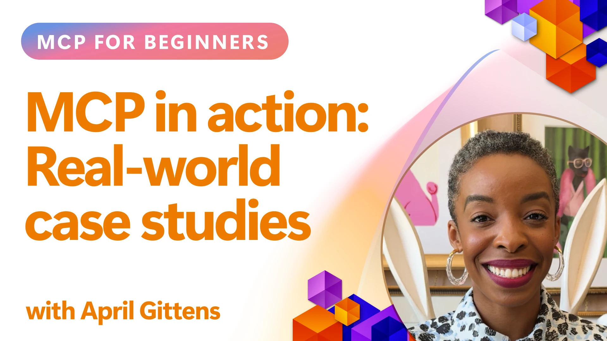

# MCP veiksme: realūs atvejų tyrimai

_(Spustelėkite aukščiau esantį vaizdą, kad peržiūrėtumėte šio pamokos vaizdo įrašą)_

Modelio konteksto protokolas (MCP) transformuoja, kaip DI programos sąveikauja su duomenimis, įrankiais ir paslaugomis. Šiame skyriuje pateikiami realūs atvejų tyrimai, demonstruojantys MCP praktines taikymus įvairiuose įmonių scenarijuose.

## Apžvalga

Šiame skyriuje pateikiami konkretūs MCP įgyvendinimo pavyzdžiai, parodantys, kaip organizacijos naudoja šį protokolą spręsdamos sudėtingus verslo iššūkius. Analizuodami šiuos atvejų tyrimus, įgisite įžvalgų apie MCP universalumą, mastelį ir praktines naudas realiuose scenarijuose.

## Pagrindiniai mokymosi tikslai

Tyrinėdami šiuos atvejų tyrimus, jūs:

- Suprasite, kaip MCP gali būti taikomas sprendžiant konkrečias verslo problemas
- Sužinosite apie įvairius integracijos modelius ir architektūrinius požiūrius
- Atpažinsite gerąsias praktikas, įgyvendinant MCP įmonių aplinkose
- Įgisite įžvalgų apie iššūkius ir sprendimus realiose įgyvendinimo situacijose
- Nustatysite galimybes taikyti panašius modelius savo projektuose

## Parinkti atvejų tyrimai

### 1. [Azure AI kelionių agentai – referencinis įgyvendinimas](./travelagentsample.md)

Šis atvejo tyrimas nagrinėja Microsoft išsamų referencinį sprendimą, demonstruojantį, kaip sukurti kelių agentų, DI pagrindu veikiančią kelionių planavimo programą naudojant MCP, Azure OpenAI ir Azure AI Search. Projektas pristato:

- Daugiaagentinę orkestraciją per MCP
- Įmonių duomenų integraciją su Azure AI Search
- Saugia ir mastoma architektūrą naudojant Azure paslaugas
- Išplečiamus įrankius su pakartotinai naudojamais MCP komponentais
- Pokalbių vartotojo patirtį, pagrįstą Azure OpenAI

Architektūros ir įgyvendinimo detalės suteikia vertingų įžvalgų, kaip kurti sudėtingas kelių agentų sistemas, naudojant MCP kaip koordinavimo sluoksnį.

### 2. [Azure DevOps elementų atnaujinimas iš YouTube duomenų](./UpdateADOItemsFromYT.md)

Šis atvejo tyrimas demonstruoja praktišką MCP panaudojimą darbo eigų automatizavimui. Parodoma, kaip MCP įrankiai gali būti naudojami:

- Išgauti duomenis iš internetinių platformų (YouTube)
- Atnaujinti darbo elementus Azure DevOps sistemose
- Kurti pasikartojančias automatizavimo darbo eiles
- Integruoti duomenis tarp skirtingų sistemų

Šis pavyzdys iliustruoja, kaip net palyginti paprasti MCP įgyvendinimai gali gerokai padidinti efektyvumą automatizuojant rutinos užduotis ir gerinant duomenų nuoseklumą tarp sistemų.

### 3. [Realaus laiko dokumentacijos gavimas su MCP](./docs-mcp/README.md)

Šiame atvejo tyrime supažindinama, kaip prijungti Python konsolės klientą prie Modelio konteksto protokolo (MCP) serverio, norint realiu laiku gauti ir registruoti kontekstualią Microsoft dokumentaciją. Išmoksite:

- Prisijungti prie MCP serverio, naudojant Python klientą ir oficialią MCP SDK
- Naudoti srautinio perdavimo HTTP klientus efektyviam duomenų gavimui realiu laiku
- Kviesti dokumentacijos įrankius serveryje ir atsakymus tiesiogiai registruoti konsolėje
- Integruoti atnaujintą Microsoft dokumentaciją į savo darbo eigą, nenutuščiuojant terminalo

Skyriuje pateikiama praktinė užduotis, minimalus veikiantis kodo pavyzdys ir nuorodos į papildomus išteklius giliau mokytis. Peržiūrėkite visą veiksmų eigą ir kodą susietame skyriuje, kad suprastumėte, kaip MCP gali transformuoti dokumentacijos prieigą ir kūrėjų produktyvumą konsolinėse aplinkose.

### 4. [Interaktyvus studijų plano generatoriaus internetinis taikymas su MCP](./docs-mcp/README.md)

Šis atvejo tyrimas demonstruoja, kaip sukurti interaktyvią internetinę programą, naudojant Chainlit ir Modelio konteksto protokolą (MCP), generuojančią suasmenintus studijų planus bet kuriai temai. Vartotojai gali nurodyti temą (pvz., "AI-900 sertifikavimas") ir studijų trukmę (pvz., 8 savaites), o programa pateiks savaitinį rekomenduojamo turinio išdėstymą. Chainlit suteikia pokalbių sąsają, todėl patirtis yra įtraukianti ir adaptuojama.

- Pokalbių internetinė programa, pagrįsta Chainlit
- Vartotojo valdomi užklausų formų įvedimai dėl temos ir trukmės
- Savaitės po savaitės turinio rekomendacijos, naudojant MCP
- Realiojo laiko, adaptuojamos reakcijos pokalbių sąsajoje

Projektas iliustruoja, kaip pokalbių DI ir MCP gali būti sujungti kuriant dinamiškus, vartotojo valdomus mokymo įrankius šiuolaikinėje internetinėje aplinkoje.

### 5. [Dokumentacija redaktoriuje su MCP serveriu VS Code](./docs-mcp/README.md)

Šis atvejo tyrimas demonstruoja, kaip Microsoft Learn dokumentaciją galima tiesiogiai įtraukti į VS Code aplinką naudojant MCP serverį – nebereikia keisti naršyklės skirtukų! Išmoksite:

- Akimirksniu ieškoti ir skaityti dokumentaciją VS Code viduje, naudojant MCP panelę arba komandų paletę
- Nurodyti dokumentaciją ir tiesiogiai įterpti nuorodas į README ar kursų markdown failus
- Naudoti GitHub Copilot ir MCP kartu sklandžiai, DI pagrįstai dokumentacijos ir kodo darbo eigai
- Patikrinti ir pagerinti dokumentaciją su realiojo laiko atsiliepimais ir Microsoft pateikta tikslumu
- Integruoti MCP su GitHub darbo eigomis dokumentacijos nuolatinei validacijai

Įgyvendinimas apima:

- Pavyzdinė `.vscode/mcp.json` konfigūracija lengvam nustatymui
- Ekrano nuotraukose pagrįstos instrukcijos su darbo edityje patirtimi
- Patarimai, kaip sujungti Copilot ir MCP maksimaliam produktyvumui

Ši situacija ideali kursų autoriams, dokumentacijos rašytojams ir kūrėjams, norintiems likti susikoncentravusiose redaktoriaus sąsajose dirbant su dokumentais, Copilot ir validavimo įrankiais, viskas valdoma MCP.

### 6. [APIM MCP serverio kūrimas](./apimsample.md)

Šis atvejo tyrimas pateikia išsamų žingsnis po žingsnio gidą, kaip sukurti MCP serverį naudojant Azure API valdymo (APIM) technologiją. Apima:

- MCP serverio nustatymą Azure API valdyme
- API operacijų atskleidimą kaip MCP įrankius
- Politikų konfigūravimą dėl užklausų ribojimų ir saugumo
- MCP serverio testavimą naudojant Visual Studio Code ir GitHub Copilot

Šis pavyzdys iliustruoja, kaip pasitelkti Azure galimybes kuriant tvirtą MCP serverį, kuris tinka įvairioms programėlėms, gerinant DI sistemų integraciją su įmonių API.

### 7. [GitHub MCP registras — spartinantis agentinę integraciją](https://github.com/mcp)

Šis atvejo tyrimas nagrinėja, kaip 2025 m. rugsėjo mėn. paleistas GitHub MCP registras sprendžia pagrindinę DI ekosistemos problemą: Modelio konteksto protokolo (MCP) serverių išskaidytą paiešką ir diegimą.

#### Apžvalga
**MCP registras** išsprendžia augančią problemą dėl išsibarstymo MCP serverių tarp saugyklų ir registrų, kuris anksčiau sulėtindavo integracijas ir kėlė klaidų riziką. Šie serveriai leidžia DI agentams sąveikauti su išorinėmis sistemomis, tokiomis kaip API, duomenų bazės ir dokumentacijos šaltiniai.

#### Problemos formulavimas
Agentinių darbo srautų kūrėjai susidūrė su keliomis problemomis:
- **Prasta MCP serverių atrandamumas** skirtingose platformose
- **Vėlai pasikartojančios sąrankos problemos**, pasiskirsčiusios forumuose ir dokumentacijoje
- **Saugumo grėsmės** iš nepatikrintų ir nepatikimų šaltinių
- **Standartizacijos trūkumas** serverių kokybės ir suderinamumo srityje

#### Sprendimo architektūra
GitHub MCP registras centralizuoja patikimus MCP serverius su pagrindinėmis savybėmis:
- **Vieno spustelėjimo diegimas** integruotas su VS Code, supaprastintam nustatymui
- **Signalų-attriškumo rūšiavimas** pagal žvaigždutes, aktyvumą ir bendruomenės patvirtinimą
- **Tiesioginė integracija** su GitHub Copilot ir kitais MCP suderinamais įrankiais
- **Atviras indėlio modelis**, leidžiantis bendruomenei ir įmonių partneriams prisidėti

#### Verslo poveikis
Registras pateikė matomus patobulinimus:
- **Greitesnis įsitraukimas** kūrėjams, naudojantiems tokį įrankį kaip Microsoft Learn MCP serveris, kuris srautu perduoda oficialią dokumentaciją tiesiai agentams
- **Padidėjęs produktyvumas** per specializuotus serverius, tokius kaip `github-mcp-server`, leidžiantį natūralios kalbos GitHub automatizaciją (PR kūrimas, CI pakartotiniai paleidimai, kodo skenavimas)
- **Stipresnis ekosistemos pasitikėjimas** dėl kuruojamų sąrašų ir skaidrių konfigūracijos standartų

#### Strateginė vertė
Praktikams, specializuojantiems agentinio ciklo valdyme ir atkuriamose darbo eigos sistemose, MCP registras suteikia:
- **Modulinį agentų diegimą** su standartizuotais komponentais
- **Registru palaikomus vertinimo vamzdynus** nuosekliam testavimui ir validacijai
- **Įrankių tarpusavio sąveikumą**, leidžiantį sklandžią integraciją tarp skirtingų DI platformų

Šis atvejo tyrimas demonstruoja, kad MCP registras yra daugiau nei tik katalogas – tai pagrindinė platforma skalbyliškai, realaus pasaulio modelių integracijai ir agentinių sistemų diegimui.

### 8. [Paskelbimas socialiniuose tinkluose iš agento](./publora-social-publishing.md)

Šis atvejo tyrimas žingsnis po žingsnio rodo **rašyti galinčio nuotolinio MCP serverio** pavyzdį — serverio, kurio įrankiai atlieka negrįžtamus veiksmus vartotojo vardu — naudodamas socialinių tinklų paskelbimą kaip demonstracinį pavyzdį. Agentas rengia įrašą, žmogus jį patvirtina, o serveris suplanuoja paskelbimą įvairiuose tinkluose.

Įdomiausia dalis yra paskelbimo dizaino apribojimai, kurie taikomi bet kuriam serveriui, rašančiam, o ne skaitančiam:

- **Atvira atranka, autentifikuotas vykdymas** — `tools/list` atsakymas be kredencialų, kad registrai ir klientai galėtų introspektuoti, o kiekvienas `tools/call` reikalauja žetono, kitu atveju grąžina `401` su `WWW-Authenticate` antrašte
- **OAuth registracija be išorinio žingsnio** — šiandien dinaminė kliento registracija, su Kliento ID meta duomenų dokumentais kaip kryptimi, į kurią nurodo `2026-07-28` specifikacija
- **Įrankių anotacijos** (`readOnlyHint`, `destructiveHint`, `idempotentHint`), kurias klientai naudoja spręsdami, ką patvirtinti — užuominos, o ne priverstinis vykdymas, ir tai, ko dabar tikimasi perjungimo katalogų peržiūrose
- **Neįsivaizduojami identifikatoriai**, todėl klaidinga reikšmė sukelia aiškią klaidą, o ne veikia remiantis įtikinama reikšme
- **Idempotentiškumo raktai įrašymo įrankiuose**, kad agente veikimo pakartojimas nepridarytų pasikartojančių paskelbimų
- **Neadresuojamas tikslas aprašytas įrankio schemoje**, kuris testuoja visą rašymo kelią ir nieko nepaskelbia, skirtas peržiūroms ir CI

Skyrius baigiamas trumpu kontroliniu sąrašu, kurį galite taikyti serveriui, kurį statote.

## Išvada

Šie aštuoni išsamūs atvejų tyrimai demonstruoja įspūdingą Modelio konteksto protokolo universumą ir praktinius taikymus įvairiuose realaus pasaulio scenarijuose. Nuo sudėtingų kelių agentų kelionių planavimo sistemų ir įmonių API valdymo iki optimizuotų dokumentacijos darbo eigų ir revoliucinio GitHub MCP registro, šie pavyzdžiai rodo, kaip MCP suteikia standartizuotą, mastelį palaikančią naudą prijungiant DI sistemas su reikalingais įrankiais, duomenimis ir paslaugomis siekiant išskirtinės vertės.

Atvejų tyrimai apima kelis MCP įgyvendinimo aspektus:
- **Įmonių integracija**: Azure API valdymas ir Azure DevOps automatizavimas
- **Kelių agentų orkestracija**: kelionių planavimas su koordinuotais DI agentais
- **Kūrėjų produktyvumas**: VS Code integracija ir realaus laiko dokumentacijos prieiga
- **Ekosistemos vystymas**: GitHub MCP registras kaip pagrindinė platforma
- **Švietimo taikymai**: interaktyvūs studijų planų generatoriai ir pokalbių sąsajos

Analizuodami šiuos įgyvendinimus, gausite svarbias įžvalgas apie:
- **Architektūrinius modelius** įvairiems mastams ir naudojimo atvejams
- **Implementavimo strategijas**, balansuoja tarp funkcionalumo ir priežiūros
- **Saugumo ir mastelio** aspektus gamybinėse aplinkose
- **Geras praktikas** MCP serverių kūrimui ir klientų integracijai
- **Ekosistemos mąstymą** kuriant tarpusavyje susietus DI sprendimus

Šie pavyzdžiai kartu rodo, kad MCP nėra vien teorinė koncepcija, o subrendęs, gamybai paruoštas protokolas, leidžiantis praktinius sprendimus sudėtingoms verslo problemoms. Nesvarbu, ar kuriate paprastus automatizavimo įrankius, ar sudėtingas kelių agentų sistemas, čia aprašyti modeliai ir metodai sudaro tvirtą pagrindą jūsų MCP projektams.

## Papildomi ištekliai

- [Azure AI kelionių agentų GitHub saugykla](https://github.com/Azure-Samples/azure-ai-travel-agents)
- [Azure DevOps MCP įrankis](https://github.com/microsoft/azure-devops-mcp)
- [Playwright MCP įrankis](https://github.com/microsoft/playwright-mcp)
- [Microsoft Docs MCP serveris](https://github.com/MicrosoftDocs/mcp)
- [GitHub MCP registras — spartinantis agentinę integraciją](https://github.com/mcp)
- [MCP bendruomenės pavyzdžiai](https://github.com/microsoft/mcp)

## Kas toliau

- Ankstesnis: [8 modulis: gerosios praktikos](../08-BestPractices/README.md)
- Kitas: [10 modulis: DI darbo eigų optimizavimas: MCP serverio kūrimas su AI įrankių rinkiniu](../10-StreamliningAIWorkflowsBuildingAnMCPServerWithAIToolkit/README.md)

---

<!-- CO-OP TRANSLATOR DISCLAIMER START -->
**Atsakomybės apribojimas**:
Šis dokumentas buvo išverstas naudojant dirbtinio intelekto vertimo paslaugą [Co-op Translator](https://github.com/Azure/co-op-translator). Nors siekiame tikslumo, prašome atkreipti dėmesį, kad automatiniai vertimai gali turėti klaidų ar netikslumų. Originalus dokumentas jo gimtąja kalba laikomas autoritetingu šaltiniu. Svarbiai informacijai rekomenduojama naudoti profesionalų žmogiškąjį vertimą. Mes neatsakome už jokius nesusipratimus ar neteisingą interpretaciją, kilusią naudojantis šiuo vertimu.
<!-- CO-OP TRANSLATOR DISCLAIMER END -->