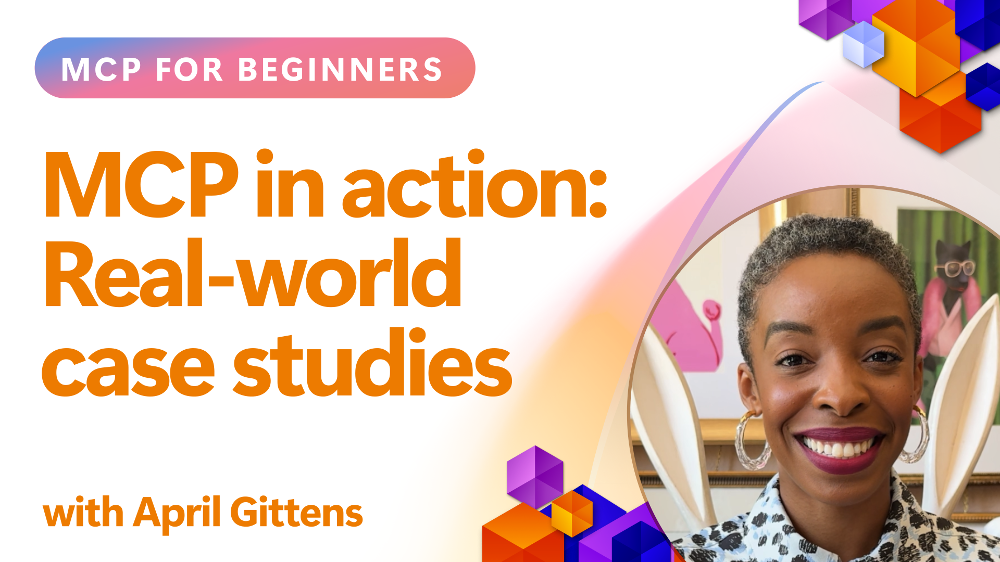

<!--
CO_OP_TRANSLATOR_METADATA:
{
  "original_hash": "61a160248efabe92b09d7b08293d17db",
  "translation_date": "2025-08-26T16:04:53+00:00",
  "source_file": "09-CaseStudy/README.md",
  "language_code": "lt"
}
-->
# MCP veiksme: realaus pasaulio atvejų analizės

_(Spustelėkite aukščiau esančią nuotrauką, kad peržiūrėtumėte šios pamokos vaizdo įrašą)_

Modelio konteksto protokolas (MCP) keičia būdą, kaip dirbtinio intelekto programos sąveikauja su duomenimis, įrankiais ir paslaugomis. Šiame skyriuje pateikiamos realaus pasaulio atvejų analizės, kurios parodo praktinius MCP taikymo pavyzdžius įvairiose įmonių situacijose.

## Apžvalga

Šiame skyriuje pristatomi konkretūs MCP įgyvendinimo pavyzdžiai, pabrėžiant, kaip organizacijos naudoja šį protokolą sudėtingoms verslo problemoms spręsti. Analizuodami šias atvejų analizes, sužinosite apie MCP universalumą, mastelį ir praktinę naudą realiame pasaulyje.

## Pagrindiniai mokymosi tikslai

Analizuodami šias atvejų analizes, jūs:

- Suprasite, kaip MCP gali būti taikomas konkrečioms verslo problemoms spręsti
- Sužinosite apie skirtingus integracijos modelius ir architektūrinius metodus
- Atpažinsite geriausias MCP įgyvendinimo praktikas įmonių aplinkoje
- Įgysite įžvalgų apie iššūkius ir sprendimus, su kuriais susiduriama realiuose įgyvendinimuose
- Atpažinsite galimybes taikyti panašius modelius savo projektuose

## Pateiktos atvejų analizės

### 1. [Azure AI kelionių agentai – pavyzdinė įgyvendinimo analizė](./travelagentsample.md)

Šioje atvejų analizėje nagrinėjamas „Microsoft“ išsamus pavyzdinis sprendimas, kuris demonstruoja, kaip sukurti kelių agentų, dirbtiniu intelektu paremtą kelionių planavimo programą naudojant MCP, Azure OpenAI ir Azure AI Search. Projektas parodo:

- Kelių agentų koordinavimą per MCP
- Įmonės duomenų integraciją su Azure AI Search
- Saugios, mastelio keitimo architektūros kūrimą naudojant Azure paslaugas
- Išplečiamus įrankius su pakartotinai naudojamais MCP komponentais
- Pokalbių vartotojo patirtį, paremtą Azure OpenAI

Architektūros ir įgyvendinimo detalės suteikia vertingų įžvalgų, kaip kurti sudėtingas kelių agentų sistemas, kuriose MCP veikia kaip koordinavimo sluoksnis.

### 2. [Azure DevOps elementų atnaujinimas iš „YouTube“ duomenų](./UpdateADOItemsFromYT.md)

Šioje atvejų analizėje pateikiamas praktinis MCP taikymas darbo procesų automatizavimui. Ji parodo, kaip MCP įrankiai gali būti naudojami:

- Duomenims iš internetinių platformų (pvz., „YouTube“) išgauti
- Darbo elementams Azure DevOps sistemose atnaujinti
- Kartojamiems automatizavimo darbo procesams kurti
- Duomenims integruoti tarp skirtingų sistemų

Šis pavyzdys iliustruoja, kaip net palyginti paprasti MCP įgyvendinimai gali suteikti reikšmingų efektyvumo pranašumų, automatizuojant rutinines užduotis ir gerinant duomenų nuoseklumą tarp sistemų.

### 3. [Realaus laiko dokumentų gavimas naudojant MCP](./docs-mcp/README.md)

Šioje atvejų analizėje pateikiama, kaip prijungti „Python“ konsolės klientą prie Modelio konteksto protokolo (MCP) serverio, kad būtų galima gauti ir registruoti realaus laiko, kontekstui pritaikytą „Microsoft“ dokumentaciją. Sužinosite, kaip:

- Prisijungti prie MCP serverio naudojant „Python“ klientą ir oficialų MCP SDK
- Naudoti srautinius HTTP klientus efektyviam, realaus laiko duomenų gavimui
- Kviesti dokumentacijos įrankius serveryje ir registruoti atsakymus tiesiai konsolėje
- Integruoti naujausią „Microsoft“ dokumentaciją į savo darbo eigą neišeinant iš terminalo

Šiame skyriuje yra praktinė užduotis, minimalus veikiančio kodo pavyzdys ir nuorodos į papildomus išteklius gilesniam mokymuisi. Peržiūrėkite visą vadovą ir kodą susietame skyriuje, kad suprastumėte, kaip MCP gali pakeisti dokumentacijos prieigą ir kūrėjų produktyvumą konsolės aplinkoje.

### 4. [Interaktyvus mokymosi plano generatorius su MCP](./docs-mcp/README.md)

Šioje atvejų analizėje parodoma, kaip sukurti interaktyvią internetinę programą naudojant Chainlit ir Modelio konteksto protokolą (MCP), kad būtų galima generuoti suasmenintus mokymosi planus bet kuria tema. Vartotojai gali nurodyti temą (pvz., „AI-900 sertifikatas“) ir mokymosi trukmę (pvz., 8 savaites), o programa pateiks savaitės rekomendacijų planą. Chainlit suteikia pokalbių sąsają, kuri padaro patirtį įtraukiančią ir pritaikomą.

- Pokalbių internetinė programa, paremta Chainlit
- Vartotojo nurodomi raginimai temai ir trukmei
- Savaitės turinio rekomendacijos naudojant MCP
- Realaus laiko, pritaikomi atsakymai pokalbių sąsajoje

Projektas iliustruoja, kaip pokalbių dirbtinis intelektas ir MCP gali būti derinami kuriant dinamiškus, vartotojo poreikiams pritaikytus mokymosi įrankius šiuolaikinėje interneto aplinkoje.

### 5. [Dokumentacija redaktoriuje su MCP serveriu VS Code](./docs-mcp/README.md)

Šioje atvejų analizėje parodoma, kaip „Microsoft Learn Docs“ galima tiesiogiai integruoti į jūsų VS Code aplinką naudojant MCP serverį – nebereikia perjunginėti naršyklės skirtukų! Sužinosite, kaip:

- Akimirksniu ieškoti ir skaityti dokumentaciją VS Code naudojant MCP skydelį arba komandų paletę
- Nuorodas į dokumentaciją įterpti tiesiai į savo README ar kursų Markdown failus
- Naudoti GitHub Copilot ir MCP kartu sklandžiam, dirbtiniu intelektu paremtam dokumentacijos ir kodo darbo procesui
- Tikrinti ir tobulinti savo dokumentaciją su realaus laiko atsiliepimais ir „Microsoft“ šaltinių tikslumu
- Integruoti MCP su GitHub darbo procesais nuolatiniam dokumentacijos tikrinimui

Įgyvendinimas apima:

- Pavyzdinę `.vscode/mcp.json` konfigūraciją lengvam nustatymui
- Ekrano nuotraukomis paremtus vadovus apie darbo su redaktoriumi patirtį
- Patarimus, kaip derinti Copilot ir MCP maksimaliam produktyvumui

Šis scenarijus idealiai tinka kursų autoriams, dokumentacijos rašytojams ir kūrėjams, kurie nori išlikti susikoncentravę savo redaktoriuje, dirbdami su dokumentacija, Copilot ir tikrinimo įrankiais – visa tai paremta MCP.

### 6. [APIM MCP serverio kūrimas](./apimsample.md)

Šioje atvejų analizėje pateikiamas žingsnis po žingsnio vadovas, kaip sukurti MCP serverį naudojant Azure API Management (APIM). Jame aptariama:

- MCP serverio nustatymas Azure API Management
- API operacijų eksponavimas kaip MCP įrankių
- Politikų konfigūravimas greičio ribojimui ir saugumui
- MCP serverio testavimas naudojant Visual Studio Code ir GitHub Copilot

Šis pavyzdys iliustruoja, kaip pasinaudoti Azure galimybėmis kuriant patikimą MCP serverį, kuris gali būti naudojamas įvairiose programose, pagerinant dirbtinio intelekto sistemų integraciją su įmonių API.

## Išvada

Šios atvejų analizės pabrėžia Modelio konteksto protokolo universalumą ir praktinį taikymą realiame pasaulyje. Nuo sudėtingų kelių agentų sistemų iki tikslinių automatizavimo darbo procesų, MCP suteikia standartizuotą būdą sujungti dirbtinio intelekto sistemas su įrankiais ir duomenimis, kurių joms reikia, kad sukurtų vertę.

Analizuodami šiuos įgyvendinimus, galite įgyti įžvalgų apie architektūrinius modelius, įgyvendinimo strategijas ir geriausias praktikas, kurias galima pritaikyti savo MCP projektuose. Pavyzdžiai rodo, kad MCP nėra tik teorinis pagrindas, bet ir praktinis sprendimas realioms verslo problemoms.

## Papildomi ištekliai

- [Azure AI kelionių agentų GitHub saugykla](https://github.com/Azure-Samples/azure-ai-travel-agents)
- [Azure DevOps MCP įrankis](https://github.com/microsoft/azure-devops-mcp)
- [Playwright MCP įrankis](https://github.com/microsoft/playwright-mcp)
- [Microsoft Docs MCP serveris](https://github.com/MicrosoftDocs/mcp)
- [MCP bendruomenės pavyzdžiai](https://github.com/microsoft/mcp)

Kitas: Praktinis užsiėmimas [AI darbo procesų optimizavimas: MCP serverio kūrimas su AI įrankių rinkiniu](../10-StreamliningAIWorkflowsBuildingAnMCPServerWithAIToolkit/README.md)

---

**Atsakomybės apribojimas**:  
Šis dokumentas buvo išverstas naudojant AI vertimo paslaugą [Co-op Translator](https://github.com/Azure/co-op-translator). Nors siekiame tikslumo, prašome atkreipti dėmesį, kad automatiniai vertimai gali turėti klaidų ar netikslumų. Originalus dokumentas jo gimtąja kalba turėtų būti laikomas autoritetingu šaltiniu. Kritinei informacijai rekomenduojama naudoti profesionalų žmogaus vertimą. Mes neprisiimame atsakomybės už nesusipratimus ar klaidingus interpretavimus, atsiradusius dėl šio vertimo naudojimo.