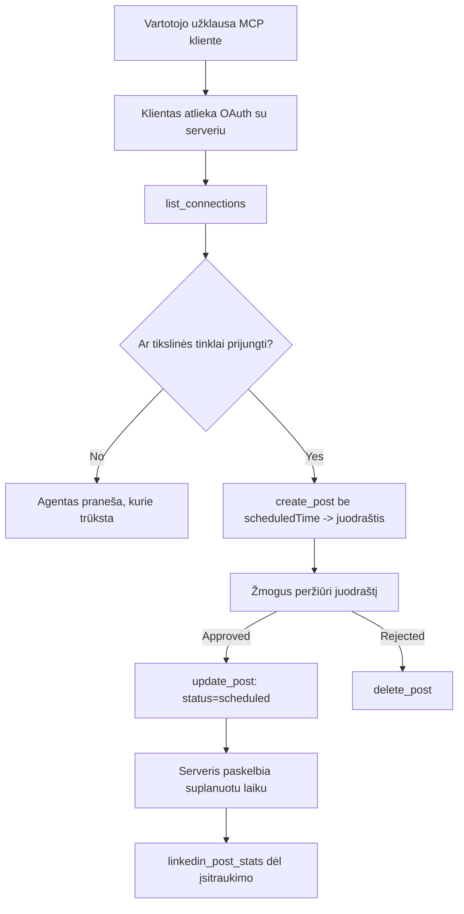

# Atvejo analizė: Leidyba į socialinius tinklus iš agento su nuotoliniu MCP serveriu

> **Atsakomybės apribojimas:** Keletas paslaugų ir atviro kodo projektų gali skelbti socialiniuose tinkluose, ir komanda taip pat gali tiesiogiai integruoti kiekvieno tinklo API. Žemiau pateiktas scenarijus yra vienas iš dirbtinių pavyzdžių, kaip galima sukurti ir naudoti **rašyti gebantį nuotolinį MCP serverį**. Publora yra komercinė paslauga su nemokamu planu; čia aprašyti modeliai taikomi bet kuriam MCP serveriui, kuris atlieka negrįžtamus veiksmus vartotojo vardu.

## Apžvalga

Agentai gerai geba rengti turinį, bet blogai jį paskelbti. Modelis gali parašyti pranešimą spaudai per kelias sekundes, ir tada darbas sustoja: jo paskelbimas reiškia kiekvienam tinklui atskirą API, kiekvienam tinklui atskirą OAuth programėlę ir skirtingus medijų taisyklių rinkinius. Dauguma komandų tai sprendžia rankiniu būdu nukopijuodami tekstą į naršyklę.

Ši atvejo analizė nagrinėja, kaip paskutinis žingsnis uždaromas vienu nuotoliniu MCP serveriu ir – naudingiau tiems, kurie jį kuria – į dizaino sprendimus, kuriuos turi teisingai priimti **rašyti gebantis** serveris. Duomenų skaitymas yra lankstus. Leidyba – ne: neteisingas įrankio kvietimas matomas auditorijai ir jo negalima atšaukti.

## Scenarijus

Nedidelė vystytojų ryšių komanda rengia pranešimus agente (Claude, VS Code, Cursor — klientas nesvarbus). Jie nori, kad agentas:

- matytų, kurios socialinės paskyros komanda yra prijungusi,
- parašytų pranešimą ir išsaugotų jį kaip juodraštį žmogaus patvirtinimui,
- pridėtų paveikslėlį,
- suplanuotų paskelbimą keliuose tinkluose pasirinktu laiku,
- ir vėliau pateiktų ataskaitą, kaip pranešimas pasirodė.

Svarbiausia, kad jie nori, jog agentas **negali netyčia** paskelbti, kol jie dar eksperimentuoja.

## Naudoti įrankiai

- [Publora MCP Server](https://github.com/publora/mcp-server) — nuotolinis MCP serveris (`streamable-http`), suteikiantis leidybos, planavimo, medijų ir LinkedIn analitikos įrankius. Registruotas oficialiame MCP registre kaip `com.publora/mcp-server`.

## Žingsnis po žingsnio darbo eiga

1. **Prijunkite serverį.** Klientai, palaikantys OAuth, atlieka autorizacijos kodo srautą su PKCE prieš serverio sutikimo ekraną; klientai, kurie to nedaro, kaip ir „be galvos“ CLI, naudoja Publora API raktą antraštėje. Abu būdai palaikomi, o kurį gaunate, priklauso nuo kliento, o ne nuo serverio.
2. **Išvardinkite prijungimus.** Agentas kviečia `list_connections` ir gauna prijungtas paskyras su jų identifikatoriais.
3. **Rengimas.** Agentas kviečia `create_post` *be* suplanuoto laiko. Pranešimas saugomas kaip juodraštis – niekas nėra paskelbta.
4. **Pridėti mediją.** Viešieji paveikslėlių URL perduodami tame pačiame kvietime; serveris juos atsisiunčia ir patikrina.
5. **Planuoti.** Po žmogaus patvirtinimo, `update_post` nustato būseną kaip suplanuota su ISO 8601 laiku.
6. **Matavimas.** LinkedIn atveju `linkedin_post_stats` grąžina įsitraukimo duomenis, kai pranešimas jau gyvas.

## Pavyzdinis užklausos tekstas

```text
Which social accounts do I have connected?
Draft a post announcing our new changelog page, attach the screenshot at
https://example.com/changelog.png, and keep it as a draft — do not publish it.
Once I approve, schedule it to LinkedIn and Bluesky for tomorrow at 09:00 UTC.
```

## Mermaid srauto diagrama



## Techninė įgyvendinimo dalis

Toliau pateiktos pamokos yra perduodama šios atvejo analizės dalis.

### Atvira atranka, autentifikuotas vykdymas

`tools/list` teikiamas be kredencialų; kiekvienas `tools/call` reikalauja žetono
ir kitaip grąžina `401` su `WWW-Authenticate` antrašte, nukreipiančia į
apsaugoto ištekliaus meta duomenis. Serverio senesnis galinis taškas taip pat atsako į
neautentifikuotą `initialize` klientams, naudojantiems protokolo versijas prieš
`2026-07-28`; dabartiniai klientai to sinonimu nebevartoja.

Šis serveriui būdingas atskyrimas leidžia registrams, katalogams ir klientams be slapto rakto
peržiūrėti įrankių pavadinimus, schemas ir anotacijas, tuo pat metu blokuojant anoniminį
vykdymą. Atvira atranka yra diegimo pasirinkimas, o ne MCP reikalavimas; apsaugotas diegimas
taip pat gali reikalauti autorizacijos `tools/list`.

### Registracija: dinaminė kliento registracija ir kas ją pakeičia

Serveris reklamuoja `/.well-known/oauth-protected-resource` ir `/.well-known/oauth-authorization-server`, ir palaiko autorizacijos kodo srautą su PKCE (`S256`), atnaujinimo žetonus bei **dinaminę kliento registraciją**.

Dinaminė registracija pašalino rankinį žingsnį senuose klientuose: be jos
kiekvienas klientas turėjo gauti iš tiekėjo išduotą `client_id`.

Tai vertinkite kaip suderinamumo elgesį, o ne kaip kopijuotiną dizainą. 2026-07-28 specifikacijos pataisa nustoja naudoti dinaminę kliento registraciją ir vietoje jos rekomenduoja Kliento ID meta informacijos dokumentus, kai klientas talpina meta dokumentą stabiliu HTTPS URL adresu ir tas URL *yra* `client_id`. DCR šiandien veikia, bet naujai kuriamas serveris turėtų planuoti CIMD ir DCR naudoti tik vyresniems klientams.

### Įrankių anotacijos nėra tik papuošimai

Kiekvienas įrankis turi `title` ir taikomas užuominas: `readOnlyHint`, `destructiveHint`, `idempotentHint`, `openWorldHint`.

Dvi priežastys investuoti į jas. Pirma, klientai naudoja užuominas, kad nuspręstų, ką patvirtinti su vartotoju – klientas gali automatiškai atlikti tik skaitymui skirtą užklausą ir sustoti patvirtinimui prieš trynimą. Specifikacija aiškiai nurodo, kad anotacijos yra nepatikimos užuominos, o ne autorizacijos mechanizmas: jos formuoja, ką klientas siūlo atlikti, jos nieko nesustabdo serveryje, o serveris vis tiek turi vykdyti savo taisykles. Antra, didžiosios jungiamųjų katalogų peržiūros dabar jų *reikalauja*; serveris, kurio įrankiai neturi antraščių ir užuominų, bus atmestas nepriklausomai nuo veikimo kokybės.

### Padarykite identifikatorius neįmanomus išgalvoti

Platformos identifikatoriai yra neaiškūs tekstiniai simboliai, grąžinami per `list_connections`, ir schemos aprašyme aiškiai nurodoma, kad juos būtina kopijuoti pažodžiui ir niekada nebandyti spėti. Serveris atmeta bet ką kitą.

Modeliai moka spėlioti. Bet kuris rašyti galintis serveris turėtų manyti, kad kažkada identifikatorius bus sugalvotas ir tą klaidingą kelią reikia pripažinti kaip nesėkmę garsiai ir anksti, o ne veikti remiantis panašiu į teisingą vertimu.

### Nepavykti prieš leidybą su aiškia klaidos žinute

Kai kurie tinklai nepriima tik teksto pranešimų ir reikalauja paveikslėlio arba vaizdo įrašo. Tai tikrinama, kai pranešimas planuojamas, ir klaidos pranešime nurodoma platforma ir trūkstamas reikalavimas.

Agentas gali atsigauti iš „Instagram reikalauja medijos – pridėkite paveikslėlį arba vaizdo įrašą“ be papildomo vėlinimo. Jis negali atsigauti iš bendros `400` klaidos.

### Užtikrinkite pakartojimų saugumą

Du įrankiai, kurie kuria turinį, `create_post` ir `update_post`, priima idempotencijos raktą: pakartotinai jį panaudojus identišku užklausimu, grąžinamas originalus atsakymas vietoje antro pranešimo sukūrimo. Agentų vykdymo aplinkos bando iš naujo laukiant atsakymo; be idempotencijos, lėtas atsakymas tampa pasikartojančiu paskelbimu. Kiti rašymo įrankiai – trinimai, medijų veiksmai, LinkedIn reakcijos ir komentarai – neturi tokio rakto, todėl pakartojimas ten automatiškai nesaugus. Svarbu žinoti, kurie jūsų mutacijų veiksmai yra apsaugoti, o kurie ne.

### Suteikite galimybę testuoti be jokios leidybos

Serveris priima rezervuotą tikslą `publora-playground`, kuris yra patikrinamas ir pripažįstamas kaip tikras tikslas, o tada atmestas – niekas nepatenka į gyvą paskyrą. Tai aprašyta pačioje įrankių schemoje, kurią bet kuris klientas gali perskaityti be kredencialų: `platforms` laukas `create_post` dokumente apibūdina tai kaip „prisijungimo testavimo tikslą, kuriam nereikia tikro prisijungimo – pranešimas pripažįstamas ir atmetamas, nieko nepaskelbiama“. Jį iškvieskite perduodami vienintelį įrašą: `platforms: ["publora-playground"]`.

Tai pasirodė esą viena iš naudingiausių visos sąsajos detalių. Jungiamųjų katalogų peržiūros, dalyviai ir CI gali išbandyti visą rašymo kelią nuo pradžios iki pabaigos be jokios žalos tikrai auditorijai. Bet kuris MCP serveris su negrįžtamais veiksmais naudos dokumentuotą neveikiančią paskirties vietą.

## Rezultatai ir poveikis

- Leidybos žingsnis perkeltas iš naršyklės į tą pačią pokalbių vietą, kur kuriamas turinys, o juodraščio pirmumo įprotis palaiko žmogaus kontrolę. Būkite tikslūs, ką tai reiškia: juodraštis yra sutartis, o ne riba. Tas pats kredencialas gali suplanuoti arba paskelbti, todėl kas nors, kam reikia tikro patvirtinimo, turi tai užtikrinti įrankio aplinkos ribose — atskiri kredencialai arba politikos sluoksnis prieš serverį.
- Tinklo skirtumai — medijų reikalavimai, temų atskyrimas, atsakymų kontrolė — tvarkomi vieną kartą serveryje užuot kiekviename agentų kalbėjime su juo.
- Tas pats serveris aptarnauja keletą MCP klientų be išduotų iš anksto kredencialų.
    Dabartiniai klientai gali naudoti Kliento ID Meta informacijos dokumentus; DCR išlieka atsarginė
    galimybė vyresniems klientams.
- Aukščiau nurodytos dizaino nuostatos buvo formuotos tiek jungiamųjų katalogų peržiūrų, tiek vartotojų reikalavimų: anotacijos, OAuth ir saugus testavimo tikslas buvo patvirtinti bent vieno iš jų.

## Nuorodos

- [Publora MCP Server (šaltinis)](https://github.com/publora/mcp-server)
- [Publora API ir MCP dokumentacija](https://docs.publora.com)
- [MCP registracijos įrašas: `com.publora/mcp-server`](https://registry.modelcontextprotocol.io/v0/servers?search=com.publora/mcp-server)
- [MCP specifikacija — Autorizacija](https://modelcontextprotocol.io/specification/2026-07-28/basic/authorization)
- [MCP specifikacija — Įrankių anotacijos](https://modelcontextprotocol.io/docs/concepts/tools)

## Kas toliau

- Paimkite MCP serverį, kurį kuriate, ir patikrinkite tris pigiausius laimėjimus čia: anotacijas kiekvienam įrankiui, idempotencijos raktą kiekvienam rašymui ir dokumentuotą neveikiančią paskirties vietą.
- Išbandykite atviros atrankos modelį: kvieskite `tools/list` viešam nuotoliniam serveriui be kredencialų, po to kvieskite įrankį ir peržiūrėkite `401` iššūkį.
- Apsvarstykite, ką „atšaukimas“ reiškia jūsų srityje. Leidyboje yra juodraščiai ir trynimas; jei jūsų veiksmai neturi lygiaverčių, patvirtinimas turėtų būti įrankio dizaine, o ne užklausoje.

---

<!-- CO-OP TRANSLATOR DISCLAIMER START -->
**Atsakomybės apribojimas**:
Šis dokumentas buvo išverstas naudojant dirbtinio intelekto vertimo paslaugą [Co-op Translator](https://github.com/Azure/co-op-translator). Nors siekiame tikslumo, prašome atkreipti dėmesį, kad automatiniai vertimai gali turėti klaidų ar netikslumų. Originalus dokumentas jo gimtąja kalba laikomas autoritetingu šaltiniu. Svarbiai informacijai rekomenduojama naudoti profesionalų žmogiškąjį vertimą. Mes neatsakome už jokius nesusipratimus ar neteisingą interpretaciją, kilusią naudojantis šiuo vertimu.
<!-- CO-OP TRANSLATOR DISCLAIMER END -->