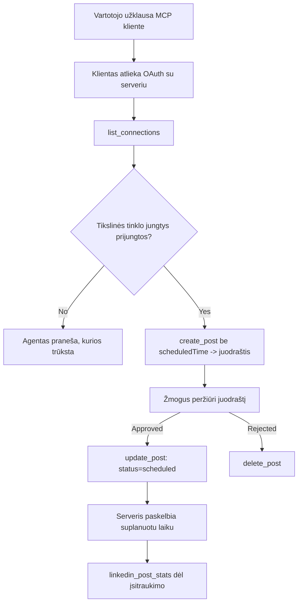

# Atvejo analizė: publikavimas į socialinius tinklus iš agento naudojant nuotolinį MCP serverį

> **Atsakomybės apribojimas:** Keletas paslaugų ir atvirojo kodo projektų gali publikuoti socialiniuose tinkluose, ir komanda taip pat galėtų tiesiogiai integruoti kiekvieno tinklo API. Žemiau pateiktas scenarijus yra vienas apdorotas pavyzdys, kaip galima sukurti ir vartoti **rašymo gebantį nuotolinį MCP serverį**. Publora yra komercinė paslauga su nemokamu lygiu; čia aprašyti modeliai galioja bet kokiam MCP serveriui, kuris atlieka negrįžtamus veiksmus vartotojo vardu.

## Apžvalga

Agentai gerai rašo turinį, bet blogai jį paskelbia. Modelis gali akimirksniu parašyti pranešimą spaudai, bet darbas ten baigiasi: publikavimas reikalauja API kiekvienam tinklui, OAuth programėlės kiekvienam tinklui ir skirtingų medijos taisyklių kiekvienam. Daugelis komandų sprendžia tai rankiniu būdu kopijuodamos tekstą į naršyklę.

Šis atvejo analizės pavyzdys nagrinėja, kaip paskutinis žingsnis uždaromas naudojant vieną nuotolinį MCP serverį ir — kas naudingiau tiems, kurie kuria tokį serverį — dizaino sprendimus, kuriuos privalo teisingai įgyvendinti **rašymo gebantis** serveris. Duomenų skaitymas yra atleidžiantis. Publikavimas ne: klaidingas įrankio kvietimas matomas auditorijai ir jo atšaukti neįmanoma.

## Scenarijus

Maža kūrėjų ryšių komanda rengia įrašus agento viduje (Claude, VS Code, Cursor — klientas nesvarbus). Jie nori, kad agentas:

- matytų, kokios socialinės paskyros yra prijungtos prie komandos,
- kurtų įrašą ir laikytų jį kaip juodraštį, kurį patvirtintų žmogus,
- pridėtų vaizdą,
- suplanuotų jį keliose tinkluose pasirinktu metu,
- ir vėliau pateiktų ataskaitą apie jo pasirodymą.

Svarbiausia, jie nori, kad agentas **negali** netyčia publikuoti, kol jie dar eksperimentuoja.

## Naudojami įrankiai

- [Publora MCP serveris](https://github.com/publora/mcp-server) — nuotolinis MCP serveris (`streamable-http`), suteikiantis publikavimo, planavimo, medijos ir LinkedIn analizės įrankius. Užregistruotas oficialiame MCP registre kaip `com.publora/mcp-server`.

## Žingsnis po žingsnio veiksmų eiga

1. **Prisijungti prie serverio.** Klientai, kurie palaiko OAuth, atlieka autorizacijos kodo srauto su PKCE patvirtinimą per pačio serverio sutikimo ekraną; klientai, kurie to nepalaiko, pavyzdžiui, bevaizdžiai CLI, naudoja Publora API raktą antraštėje. Abu keliai palaikomi, o kuris pasiekiamas priklauso nuo kliento, ne nuo serverio.
2. **Išvardinti ryšius.** Agentas kviečia `list_connections` ir gauna prijungtų paskyrų su jų identifikatoriais sąrašą.
3. **Parengti juodraštį.** Agentas kviečia `create_post` *be* suplanuoto laiko. Įrašas saugomas kaip juodraštis — niekas nepaskelbiama.
4. **Pridėti mediją.** Viešos nuotraukų URL siunčiamos tuo pačiu kvietimu; serveris atsisiunčia ir patikrina jas.
5. **Suplanuoti.** Kai žmogus patvirtina, `update_post` nustato būseną kaip suplanuotą ISO 8601 laiku.
6. **Išmatuoti.** LinkedIn metu `linkedin_post_stats` grąžina įsitraukimo duomenis, kai įrašas gyvena.

## Pavyzdinis klausimas

```text
Which social accounts do I have connected?
Draft a post announcing our new changelog page, attach the screenshot at
https://example.com/changelog.png, and keep it as a draft — do not publish it.
Once I approve, schedule it to LinkedIn and Bluesky for tomorrow at 09:00 UTC.
```

## Mermaid blokas



## Techninė įgyvendinimo dalis

Žemiau pateiktos pamokos yra perkeliamas šios atvejo analizės turinys.

### Atvira atranka, autentifikuotas vykdymas

`tools/list` pateikiamas be kredencialų; kiekvienas `tools/call` reikalauja žetono, kitaip grąžina `401` su `WWW-Authenticate` antrašte, nurodančia apsaugotos išteklių metaduomenis. (Serveris taip pat atsako neautentifikuotam `initialize`, kuris svarbus tik klientams su protokolo versijomis iki `2026-07-28`; ši versija visiškai pašalino rankų paspaudimą.)

Šis padalijimas yra svarbus praktikoje. Registrai, katalogai ir klientai gali peržvelgti įrankių paviršių — pavadinimus, schemas, anotacijas — neturėdami paslapties, tuo tarpu jokio veiksmo negalima *vykdyti* anonimiškai. Serveris, kuris reikalauja žetono `initialize`, yra iš esmės nematomas įrankiams; serveris, leidžiantis anoniminį `tools/call`, yra rizikingas.

### Registracija: dinaminė kliento registracija ir jos pakaitalas

Serveris deklaruoja `/.well-known/oauth-protected-resource` ir `/.well-known/oauth-authorization-server`, palaiko autorizacijos kodo srautą su PKCE (`S256`), atnaujinimo žetonus ir **dinaminę kliento registraciją**.

Dinaminė registracija pašalina rankinį žingsnį: be jos kiekvienam klientui reikia iš anksto suteikto `client_id`, tai reiškia už klientą atliekamą atskirą prašymą tiekėjui.

Svarbu tai vertinti kaip suderinamumo elgesį, o ne kaip norimą kopijuoti dizainą. `2026-07-28` specifikacijos pataisa žymi dinaminę registraciją kaip pasenusią ir skatina naudoti Kliento ID metaduomenų dokumentus, kai klientas viešina metaduomenų dokumentą stabiliu HTTPS URL, kuris *yra* `client_id`. DCR šiuo metu dar veikia, bet šiandien kuriant serverį reikėtų planuoti CIMD naudojimą ir DCR laikyti tik senesniems klientams.

### Įrankių anotacijos nėra papuošimai

Kiekvienas įrankis turi `title` ir taikytinas užuominas: `readOnlyHint`, `destructiveHint`, `idempotentHint`, `openWorldHint`.

Dvi priežastys jomis rūpintis. Pirma, klientai naudoja užuominas, kad nuspręstų, ką patvirtinti su vartotoju — klientas gali automatiškai vykdyti tik skaitymui skirtą užklausą ir sustoti patvirtinimui prieš trynimą. Specifikacija aiškiai nurodo, kad anotacijos yra nepatikimos užuominos, o ne autorizacijos mechanizmas: jos formuoja, ką klientas siūlo daryti, ir nieko nesustabdo serveryje, kuris vis tiek privalo taikyti savas taisykles. Antra, pagrindiniai jungčių katalogai dabar *reikalauja* jų apžvalgai; serveris, kurio įrankiai neturi pavadinimų ir užuominų, bus grąžintas nepriklausomai nuo sklandaus veikimo.

### Padaryti identifikatorius neįmanomus sugalvoti

Platformos identifikatoriai yra neaiškūs simbolių eilutės, grąžinami iš `list_connections`, ir schemos aprašymas aiškiai sako, kad jie turi būti tiesiog nukopijuojami be jokių spėjimų. Serveris atmeta viską kitą.

Modeliai yra įgudę spėliotojai. Bet koks rašymo galintis serveris turėtų manyti, kad identifikatorius galiausiai bus išgalvotas ir padaryti, kad ta kelionė baigtųsi triukšmingu ir ankstyvu klaidos pranešimu, o ne reaguotų į patraukliai atrodančią reikšmę.

### Klaidos prieš publikavimą su aiškiu veiksmų pranešimu

Kai kurie tinklai nepriima tik teksto įrašų ir reikalauja vaizdo ar video. Tai patikrinama kai įrašas suplanuojamas, o klaida nurodo platformą ir trūkstamą reikalavimą.

Agentas gali atsigauti iš "Instagram reikalauja medijos — pridėkite vaizdą ar video" be papildomo kelionės užklausti serverį. Ji negali atsigauti iš bendro `400`.

### Padaryti pakartojimus saugiais

Du įrankiai, kurie kuria turinį, `create_post` ir `update_post`, priima idempotencijos raktą: pakartotinai jį panaudojant identiškam užklausimui, serveris atkartoja originalų atsakymą užuot sukūręs antrą įrašą. Agentų vykdymo aplinkos bando pakartoti užklausas dėl laiko išeikvavimo; be idempotencijos ilgas atsakymas virsta daugybine publikacija. Kiti rašymo įrankiai — trynimai, medijos veiksmai, LinkedIn reakcijos ir komentarai — tokio rakto neturi, todėl pakartojimas nėra automatiškai saugus. Svarbu žinoti, kurios jūsų modifikacijos yra apsaugotos ir kurios ne.

### Suteikti galimybę testuoti be jokių publikavimų

Serveris priima rezervuotą tikslą, `publora-playground`, kuris yra patikrinamas ir patvirtinamas kaip tikras taikinys ir tada atmetamas — niekas neprasiskverbia į gyvą paskyrą. Tai aprašyta pačio įrankio schemoje, kurią bet kuris klientas gali perskaityti be kredencialų: `platforms` lauke `create_post` nurodoma kaip "jungties testavimo tikslas, nereikalaujantis realaus ryšio — įrašas patvirtinamas ir atmestas, niekas nepaskelbiama". Jį kvieskite pateikdami kaip vienintelį įrašą: `platforms: ["publora-playground"]`.

Tai pasirodė esanti viena naudingiausių viso paviršiaus detalių. Jungčių katalogų peržiūrėtojai, prisidėtojai ir CI gali atlikti visą rašymo kelią nuo pradžios iki pabaigos neturėdami jokios rizikos realiai auditorijai. Bet koks MCP serveris, atliekantis negrįžtamus veiksmus, gauna naudą iš dokumentuoto neoperacinio tikslo.

## Rezultatai ir poveikis

- Publikavimo žingsnis persikėlė iš naršyklės į tą pačią pokalbio vietą, kur rašomas turinys, ir įprastas juodraščio prioritetas palaiko žmogų vykdyme. Būkite tikslūs, ką tai reiškia: juodraštis yra susitarimas, o ne riba. Tas pats kredencialas gali suplanuoti ar publikuoti, tad kam reikia tikro patvirtinimo vartų, tas tai turi taikyti už įrankio paviršiaus ribų — atskiros teisės arba politikos sluoksnis serverio priekyje.
- Skirtingumai tarp tinklų — medijos reikalavimai, temavimas, atsakymų kontrolės — sprendžiami kartą serveryje, o ne kiekviename agento įrenginyje, kuris su juo kalbasi.
- Tas pats serveris palaiko kelis MCP klientus be darbų kiekvienam klientui atskirai, nes atranka yra atvira ir registracija dinaminė.
- Dizaino apribojimus formavo ne tik vartotojai, bet ir jungčių katalogų peržiūros: anotacijos, OAuth ir saugus testavimo tikslas buvo reikalavimai bent vieno iš jų.

## Nuorodos

- [Publora MCP serveris (šaltinis)](https://github.com/publora/mcp-server)
- [Publora API ir MCP dokumentacija](https://docs.publora.com)
- [MCP registro įrašas: `com.publora/mcp-server`](https://registry.modelcontextprotocol.io/v0/servers?search=com.publora/mcp-server)
- [MCP specifikacija — autorizacija](https://modelcontextprotocol.io/specification/draft/basic/authorization)
- [MCP specifikacija — Įrankių anotacijos](https://modelcontextprotocol.io/docs/concepts/tools)

## Kas toliau

- Patikrinkite MCP serverį, kurį kuriate, atsižvelgdami į tris ekonomiškiausias laimėjimo vietas čia: anotacijas kiekviename įrankyje, idempotencijos raktą kiekviename rašyme ir dokumentuotą neoperacinį tikslą.
- Išbandykite atvirą atrankos padalijimą: iškvieskite `tools/list` prieš viešą nuotolinį serverį be kredencialų, tada iškvieskite įrankį ir peržiūrėkite `401` iššūkį.
- Pagalvokite, ką „atšaukti“ reiškia jūsų domenui. Publikavimas turi juodraščius ir trynimą; jei jūsų veiksmai neturi atitikmenų, patvirtinimas turi būti įrankio dizaino dalis, o ne užklausos.

---

<!-- CO-OP TRANSLATOR DISCLAIMER START -->
**Atsakomybės apribojimas**:
Šis dokumentas buvo išverstas naudojant dirbtinio intelekto vertimo paslaugą [Co-op Translator](https://github.com/Azure/co-op-translator). Nors siekiame tikslumo, prašome atkreipti dėmesį, kad automatiniai vertimai gali turėti klaidų ar netikslumų. Originalus dokumentas jo gimtąja kalba laikomas autoritetingu šaltiniu. Svarbiai informacijai rekomenduojama naudoti profesionalų žmogiškąjį vertimą. Mes neatsakome už jokius nesusipratimus ar neteisingą interpretaciją, kilusią naudojantis šiuo vertimu.
<!-- CO-OP TRANSLATOR DISCLAIMER END -->